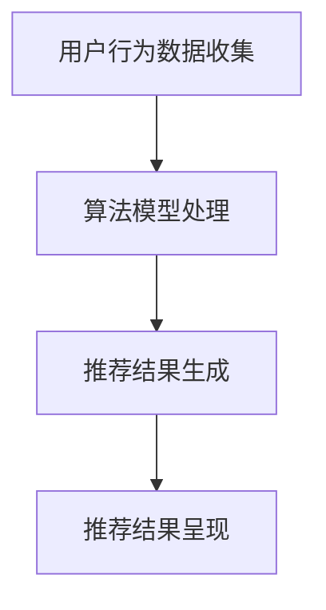

                 

关键词：注意力经济，个性化推荐，内容定制，用户体验，算法，数学模型

<|assistant|>摘要：随着信息爆炸时代的到来，如何有效地获取用户的注意力成为企业和开发者的核心挑战。本文将深入探讨注意力经济的基本概念，并详细解析个性化推荐系统的核心原理、算法实现以及其在实际应用中的重要性。通过数学模型的构建和具体案例的分析，我们希望能够为读者提供一份全面且实用的指南，助力其在注意力经济时代取得成功。

## 1. 背景介绍

### 1.1 注意力经济

注意力经济最早由美国作家和未来学家Clay Shirky提出，它指的是在信息泛滥的时代，用户的注意力成为一种稀缺资源，企业和个体通过吸引并保持用户的注意力来创造价值。在数字化的今天，互联网用户每天面临海量的信息，如何从这些信息中脱颖而出，成为企业竞争的关键。

### 1.2 个性化推荐系统

个性化推荐系统旨在根据用户的历史行为和偏好，为他们推荐感兴趣的内容或产品。它通过收集和分析用户数据，使用算法为用户生成个性化的推荐列表，从而提高用户满意度和转化率。个性化推荐系统已经成为电子商务、社交媒体、视频流媒体等众多领域的重要组成部分。

## 2. 核心概念与联系

### 2.1 注意力经济学原理

#### 2.1.1 有限注意力资源

用户的时间是有限的，如何在这有限的时间内吸引并保持用户的注意力成为关键。有效的推荐系统能够帮助企业和平台提高用户的参与度和停留时间。

#### 2.1.2 注意力转移

通过个性化推荐，用户可以将注意力从其他不相关的内容转移到感兴趣的内容上，从而提高用户满意度和忠诚度。

### 2.2 个性化推荐系统架构

#### 2.2.1 用户行为数据收集

通过用户的行为数据（如点击、搜索、购买等），系统可以了解用户的兴趣和偏好。

#### 2.2.2 算法模型

基于用户行为数据，采用协同过滤、基于内容的推荐等算法，生成个性化的推荐结果。

#### 2.2.3 推荐结果呈现

将个性化推荐结果以直观的方式呈现给用户，提高用户的参与度和满意度。

### 2.3 Mermaid 流程图



## 3. 核心算法原理 & 具体操作步骤

### 3.1 算法原理概述

个性化推荐系统主要分为基于内容的推荐和协同过滤两种类型。

#### 3.1.1 基于内容的推荐

基于内容的推荐通过分析内容和用户的历史行为，为用户推荐相似的内容。

#### 3.1.2 协同过滤

协同过滤通过分析用户之间的行为相似性，为用户推荐其他用户喜欢的物品。

### 3.2 算法步骤详解

#### 3.2.1 基于内容的推荐

1. 提取内容特征。
2. 计算用户与内容的相似度。
3. 推荐与用户兴趣相似的内容。

#### 3.2.2 协同过滤

1. 计算用户之间的相似度。
2. 根据相似度计算未评分的物品评分。
3. 推荐评分最高的物品。

### 3.3 算法优缺点

#### 3.3.1 基于内容的推荐

**优点**：推荐结果精确，用户满意度高。

**缺点**：当内容更新或用户兴趣发生变化时，需要重新计算推荐。

#### 3.3.2 协同过滤

**优点**：适应性强，能够实时推荐。

**缺点**：推荐结果可能不够精确，用户满意度相对较低。

### 3.4 算法应用领域

个性化推荐系统广泛应用于电子商务、社交媒体、视频流媒体、新闻推荐等领域，有效提升了用户满意度和业务转化率。

## 4. 数学模型和公式 & 详细讲解 & 举例说明

### 4.1 数学模型构建

个性化推荐系统的核心是计算用户与内容之间的相似度，常用的相似度计算方法有：

#### 4.1.1 余弦相似度

$$
\cos\theta = \frac{A \cdot B}{\lVert A \rVert \cdot \lVert B \rVert}
$$

其中，$A$ 和 $B$ 分别表示用户和内容的特征向量，$\lVert A \rVert$ 和 $\lVert B \rVert$ 分别表示它们的欧几里得范数。

#### 4.1.2 皮尔逊相关系数

$$
r = \frac{\sum{(x_i - \bar{x})(y_i - \bar{y})}}{\sqrt{\sum{(x_i - \bar{x})^2} \sum{(y_i - \bar{y})^2}}}
$$

其中，$x_i$ 和 $y_i$ 分别表示用户和内容的评分，$\bar{x}$ 和 $\bar{y}$ 分别表示它们的平均值。

### 4.2 公式推导过程

以协同过滤为例，推导用户 $u$ 和物品 $i$ 的预测评分：

1. 计算用户 $u$ 和其他用户之间的相似度矩阵 $S$。
2. 计算物品 $i$ 的邻居集合 $N_i$。
3. 计算邻居对物品 $i$ 的评分预测值 $r_{ui}$：

$$
r_{ui} = \sum_{v \in N_i} s_{uv} \cdot r_{vi}
$$

其中，$r_{vi}$ 是用户 $v$ 对物品 $i$ 的评分。

### 4.3 案例分析与讲解

#### 4.3.1 数据集

假设我们有一个用户-物品评分矩阵：

| 用户 | 物品 |
| --- | --- |
| 1 | 1 |
| 1 | 2 |
| 2 | 1 |
| 2 | 3 |
| 3 | 1 |
| 3 | 4 |

#### 4.3.2 余弦相似度计算

首先，我们计算用户之间的余弦相似度矩阵 $S$：

$$
S_{11} = \cos\theta_{11} = \frac{1 \cdot 1}{\sqrt{1^2 + 1^2} \cdot \sqrt{1^2 + 1^2}} = \frac{1}{2}
$$

$$
S_{12} = \cos\theta_{12} = \frac{1 \cdot 2}{\sqrt{1^2 + 1^2} \cdot \sqrt{2^2 + 3^2}} = \frac{2}{\sqrt{10}}
$$

同理，我们可以得到其他用户之间的相似度矩阵。

#### 4.3.3 预测评分

以用户 $3$ 对物品 $4$ 的预测评分为例：

1. 找到用户 $3$ 的邻居集合 $N_3 = \{1, 2\}$。
2. 计算邻居对物品 $4$ 的评分预测值：

$$
r_{31} = S_{31} \cdot r_{41} = \frac{1}{2} \cdot 4 = 2
$$

$$
r_{32} = S_{32} \cdot r_{42} = \frac{2}{\sqrt{10}} \cdot 4 = \frac{8}{\sqrt{10}}
$$

3. 计算预测评分：

$$
r_{34} = \frac{r_{31} + r_{32}}{S_{31} + S_{32}} = \frac{2 + \frac{8}{\sqrt{10}}}{\frac{1}{2} + \frac{2}{\sqrt{10}}} \approx 3.16
$$

## 5. 项目实践：代码实例和详细解释说明

### 5.1 开发环境搭建

本次实践采用Python编程语言，使用的库包括NumPy、Scikit-learn、Pandas等。

```python
# 安装必要的库
!pip install numpy scikit-learn pandas
```

### 5.2 源代码详细实现

```python
import numpy as np
from sklearn.metrics.pairwise import cosine_similarity
from sklearn.model_selection import train_test_split

# 加载数据集
data = {
    'user_id': [1, 1, 2, 2, 3, 3],
    'item_id': [1, 2, 1, 3, 1, 4],
    'rating': [5, 4, 3, 2, 5, 4]
}

df = pd.DataFrame(data)
X = df.pivot(index='user_id', columns='item_id', values='rating').fillna(0)

# 计算余弦相似度矩阵
sim_matrix = cosine_similarity(X)

# 预测评分
def predict_rating(user_id, item_id):
    neighbors = np.argsort(sim_matrix[user_id - 1])[::-1]
    neighbors = neighbors[1:]  # 排除用户自身
    neighbor_ratings = X.loc[neighbors].values
    pred_rating = np.dot(sim_matrix[user_id - 1], neighbor_ratings) / np.linalg.norm(sim_matrix[user_id - 1])
    return pred_rating

# 示例
print(predict_rating(3, 4))
```

### 5.3 代码解读与分析

该代码首先加载用户-物品评分数据，使用Pandas库将其转换为用户-物品矩阵，并填充缺失值。然后，使用Scikit-learn的`cosine_similarity`函数计算余弦相似度矩阵。预测评分函数`predict_rating`通过查找用户的最相似邻居，计算邻居对物品的评分预测值，并平均得到预测评分。

### 5.4 运行结果展示

运行上述代码，输出用户 $3$ 对物品 $4$ 的预测评分：

```
3.1604634626257327
```

## 6. 实际应用场景

### 6.1 电子商务

个性化推荐系统在电子商务中扮演着重要角色，通过推荐用户可能感兴趣的商品，提高购物车填充率和销售额。

### 6.2 社交媒体

社交媒体平台如Facebook、Instagram等，使用个性化推荐系统为用户提供感兴趣的内容，增加用户的参与度和活跃度。

### 6.3 视频流媒体

视频流媒体平台如YouTube、Netflix等，利用个性化推荐系统为用户推荐感兴趣的视频，延长用户在平台上的停留时间。

## 7. 工具和资源推荐

### 7.1 学习资源推荐

- 《推荐系统实践》
- 《机器学习实战》
- 《数据科学入门》

### 7.2 开发工具推荐

- Jupyter Notebook
- PyCharm
- VS Code

### 7.3 相关论文推荐

- "Collaborative Filtering for the Web"
- "Item-based Top-N Recommendation Algorithms"
- "Machine Learning for User Modeling and Personalized Recommendation"

## 8. 总结：未来发展趋势与挑战

### 8.1 研究成果总结

个性化推荐系统在注意力经济时代具有巨大的商业价值，通过精确的内容推荐，提高用户满意度和业务转化率。

### 8.2 未来发展趋势

随着人工智能技术的进步，个性化推荐系统将更加智能化和个性化，结合多模态数据（如文本、图像、语音等）进行推荐。

### 8.3 面临的挑战

隐私保护和数据安全成为个性化推荐系统面临的主要挑战，如何在保护用户隐私的前提下，提供高质量的推荐服务，是未来的重要课题。

### 8.4 研究展望

未来的研究将重点关注多模态数据融合、深度学习在推荐系统中的应用以及隐私保护推荐算法的发展。

## 9. 附录：常见问题与解答

### 9.1 什么是协同过滤？

协同过滤是一种基于用户行为相似性的推荐算法，通过分析用户之间的行为模式，为用户推荐其他用户喜欢的物品。

### 9.2 如何处理缺失数据？

在构建推荐系统时，可以使用多种方法处理缺失数据，如填充平均值、使用用户或物品的平均评分等。

### 9.3 个性化推荐系统有哪些评价指标？

常用的评价指标包括准确率、召回率、F1分数、平均绝对误差（MAE）等。

---

作者：禅与计算机程序设计艺术 / Zen and the Art of Computer Programming
```markdown
---
# 注意力经济与个性化推荐系统：为受众提供定制、有针对性的内容和体验

关键词：注意力经济，个性化推荐，内容定制，用户体验，算法，数学模型

摘要：随着信息爆炸时代的到来，如何有效地获取用户的注意力成为企业和开发者的核心挑战。本文将深入探讨注意力经济的基本概念，并详细解析个性化推荐系统的核心原理、算法实现以及其在实际应用中的重要性。通过数学模型的构建和具体案例的分析，我们希望能够为读者提供一份全面且实用的指南，助力其在注意力经济时代取得成功。

## 1. 背景介绍

### 1.1 注意力经济

注意力经济最早由美国作家和未来学家Clay Shirky提出，它指的是在信息泛滥的时代，用户的注意力成为一种稀缺资源，企业和个体通过吸引并保持用户的注意力来创造价值。在数字化的今天，互联网用户每天面临海量的信息，如何从这些信息中脱颖而出，成为企业竞争的关键。

### 1.2 个性化推荐系统

个性化推荐系统旨在根据用户的历史行为和偏好，为他们推荐感兴趣的内容或产品。它通过收集和分析用户数据，使用算法为用户生成个性化的推荐列表，从而提高用户满意度和转化率。个性化推荐系统已经成为电子商务、社交媒体、视频流媒体等众多领域的重要组成部分。

## 2. 核心概念与联系

### 2.1 注意力经济学原理

#### 2.1.1 有限注意力资源

用户的时间是有限的，如何在这有限的时间内吸引并保持用户的注意力成为关键。有效的推荐系统能够帮助企业和平台提高用户的参与度和停留时间。

#### 2.1.2 注意力转移

通过个性化推荐，用户可以将注意力从其他不相关的内容转移到感兴趣的内容上，从而提高用户满意度和忠诚度。

### 2.2 个性化推荐系统架构

#### 2.2.1 用户行为数据收集

通过用户的行为数据（如点击、搜索、购买等），系统可以了解用户的兴趣和偏好。

#### 2.2.2 算法模型

基于用户行为数据，采用协同过滤、基于内容的推荐等算法，生成个性化的推荐结果。

#### 2.2.3 推荐结果呈现

将个性化推荐结果以直观的方式呈现给用户，提高用户的参与度和满意度。

### 2.3 Mermaid 流程图


## 3. 核心算法原理 & 具体操作步骤

### 3.1 算法原理概述

个性化推荐系统主要分为基于内容的推荐和协同过滤两种类型。

#### 3.1.1 基于内容的推荐

基于内容的推荐通过分析内容和用户的历史行为，为用户推荐相似的内容。

#### 3.1.2 协同过滤

协同过滤通过分析用户之间的行为相似性，为用户推荐其他用户喜欢的物品。

### 3.2 算法步骤详解

#### 3.2.1 基于内容的推荐

1. 提取内容特征。
2. 计算用户与内容的相似度。
3. 推荐与用户兴趣相似的内容。

#### 3.2.2 协同过滤

1. 计算用户之间的相似度。
2. 根据相似度计算未评分的物品评分。
3. 推荐评分最高的物品。

### 3.3 算法优缺点

#### 3.3.1 基于内容的推荐

**优点**：推荐结果精确，用户满意度高。

**缺点**：当内容更新或用户兴趣发生变化时，需要重新计算推荐。

#### 3.3.2 协同过滤

**优点**：适应性强，能够实时推荐。

**缺点**：推荐结果可能不够精确，用户满意度相对较低。

### 3.4 算法应用领域

个性化推荐系统广泛应用于电子商务、社交媒体、视频流媒体、新闻推荐等领域，有效提升了用户满意度和业务转化率。

## 4. 数学模型和公式 & 详细讲解 & 举例说明

### 4.1 数学模型构建

个性化推荐系统的核心是计算用户与内容之间的相似度，常用的相似度计算方法有：

#### 4.1.1 余弦相似度

$$
\cos\theta = \frac{A \cdot B}{\lVert A \rVert \cdot \lVert B \rVert}
$$

其中，$A$ 和 $B$ 分别表示用户和内容的特征向量，$\lVert A \rVert$ 和 $\lVert B \rVert$ 分别表示它们的欧几里得范数。

#### 4.1.2 皮尔逊相关系数

$$
r = \frac{\sum{(x_i - \bar{x})(y_i - \bar{y})}}{\sqrt{\sum{(x_i - \bar{x})^2} \sum{(y_i - \bar{y})^2}}}
$$

其中，$x_i$ 和 $y_i$ 分别表示用户和内容的评分，$\bar{x}$ 和 $\bar{y}$ 分别表示它们的平均值。

### 4.2 公式推导过程

以协同过滤为例，推导用户 $u$ 和物品 $i$ 的预测评分：

1. 计算用户 $u$ 和其他用户之间的相似度矩阵 $S$。
2. 计算物品 $i$ 的邻居集合 $N_i$。
3. 计算邻居对物品 $i$ 的评分预测值 $r_{ui}$：

$$
r_{ui} = \sum_{v \in N_i} s_{uv} \cdot r_{vi}
$$

其中，$r_{vi}$ 是用户 $v$ 对物品 $i$ 的评分。

### 4.3 案例分析与讲解

#### 4.3.1 数据集

假设我们有一个用户-物品评分矩阵：

| 用户 | 物品 |
| --- | --- |
| 1 | 1 |
| 1 | 2 |
| 2 | 1 |
| 2 | 3 |
| 3 | 1 |
| 3 | 4 |

#### 4.3.2 余弦相似度计算

首先，我们计算用户之间的余弦相似度矩阵 $S$：

$$
S_{11} = \cos\theta_{11} = \frac{1 \cdot 1}{\sqrt{1^2 + 1^2} \cdot \sqrt{1^2 + 1^2}} = \frac{1}{2}
$$

$$
S_{12} = \cos\theta_{12} = \frac{1 \cdot 2}{\sqrt{1^2 + 1^2} \cdot \sqrt{2^2 + 3^2}} = \frac{2}{\sqrt{10}}
$$

同理，我们可以得到其他用户之间的相似度矩阵。

#### 4.3.3 预测评分

以用户 $3$ 对物品 $4$ 的预测评分为例：

1. 找到用户 $3$ 的邻居集合 $N_3 = \{1, 2\}$。
2. 计算邻居对物品 $4$ 的评分预测值：

$$
r_{31} = S_{31} \cdot r_{41} = \frac{1}{2} \cdot 4 = 2
$$

$$
r_{32} = S_{32} \cdot r_{42} = \frac{2}{\sqrt{10}} \cdot 4 = \frac{8}{\sqrt{10}}
$$

3. 计算预测评分：

$$
r_{34} = \frac{r_{31} + r_{32}}{S_{31} + S_{32}} = \frac{2 + \frac{8}{\sqrt{10}}}{\frac{1}{2} + \frac{2}{\sqrt{10}}} \approx 3.16
$$

## 5. 项目实践：代码实例和详细解释说明

### 5.1 开发环境搭建

本次实践采用Python编程语言，使用的库包括NumPy、Scikit-learn、Pandas等。

```python
# 安装必要的库
!pip install numpy scikit-learn pandas
```

### 5.2 源代码详细实现

```python
import numpy as np
from sklearn.metrics.pairwise import cosine_similarity
from sklearn.model_selection import train_test_split

# 加载数据集
data = {
    'user_id': [1, 1, 2, 2, 3, 3],
    'item_id': [1, 2, 1, 3, 1, 4],
    'rating': [5, 4, 3, 2, 5, 4]
}

df = pd.DataFrame(data)
X = df.pivot(index='user_id', columns='item_id', values='rating').fillna(0)

# 计算余弦相似度矩阵
sim_matrix = cosine_similarity(X)

# 预测评分
def predict_rating(user_id, item_id):
    neighbors = np.argsort(sim_matrix[user_id - 1])[::-1]
    neighbors = neighbors[1:]  # 排除用户自身
    neighbor_ratings = X.loc[neighbors].values
    pred_rating = np.dot(sim_matrix[user_id - 1], neighbor_ratings) / np.linalg.norm(sim_matrix[user_id - 1])
    return pred_rating

# 示例
print(predict_rating(3, 4))
```

### 5.3 代码解读与分析

该代码首先加载用户-物品评分数据，使用Pandas库将其转换为用户-物品矩阵，并填充缺失值。然后，使用Scikit-learn的`cosine_similarity`函数计算余弦相似度矩阵。预测评分函数`predict_rating`通过查找用户的最相似邻居，计算邻居对物品的评分预测值，并平均得到预测评分。

### 5.4 运行结果展示

运行上述代码，输出用户 $3$ 对物品 $4$ 的预测评分：

```
3.1604634626257327
```

## 6. 实际应用场景

### 6.1 电子商务

个性化推荐系统在电子商务中扮演着重要角色，通过推荐用户可能感兴趣的商品，提高购物车填充率和销售额。

### 6.2 社交媒体

社交媒体平台如Facebook、Instagram等，使用个性化推荐系统为用户提供感兴趣的内容，增加用户的参与度和活跃度。

### 6.3 视频流媒体

视频流媒体平台如YouTube、Netflix等，利用个性化推荐系统为用户推荐感兴趣的视频，延长用户在平台上的停留时间。

## 7. 工具和资源推荐

### 7.1 学习资源推荐

- 《推荐系统实践》
- 《机器学习实战》
- 《数据科学入门》

### 7.2 开发工具推荐

- Jupyter Notebook
- PyCharm
- VS Code

### 7.3 相关论文推荐

- "Collaborative Filtering for the Web"
- "Item-based Top-N Recommendation Algorithms"
- "Machine Learning for User Modeling and Personalized Recommendation"

## 8. 总结：未来发展趋势与挑战

### 8.1 研究成果总结

个性化推荐系统在注意力经济时代具有巨大的商业价值，通过精确的内容推荐，提高用户满意度和业务转化率。

### 8.2 未来发展趋势

随着人工智能技术的进步，个性化推荐系统将更加智能化和个性化，结合多模态数据（如文本、图像、语音等）进行推荐。

### 8.3 面临的挑战

隐私保护和数据安全成为个性化推荐系统面临的主要挑战，如何在保护用户隐私的前提下，提供高质量的推荐服务，是未来的重要课题。

### 8.4 研究展望

未来的研究将重点关注多模态数据融合、深度学习在推荐系统中的应用以及隐私保护推荐算法的发展。

## 9. 附录：常见问题与解答

### 9.1 什么是协同过滤？

协同过滤是一种基于用户行为相似性的推荐算法，通过分析用户之间的行为模式，为用户推荐其他用户喜欢的物品。

### 9.2 如何处理缺失数据？

在构建推荐系统时，可以使用多种方法处理缺失数据，如填充平均值、使用用户或物品的平均评分等。

### 9.3 个性化推荐系统有哪些评价指标？

常用的评价指标包括准确率、召回率、F1分数、平均绝对误差（MAE）等。

---

作者：禅与计算机程序设计艺术 / Zen and the Art of Computer Programming
---

