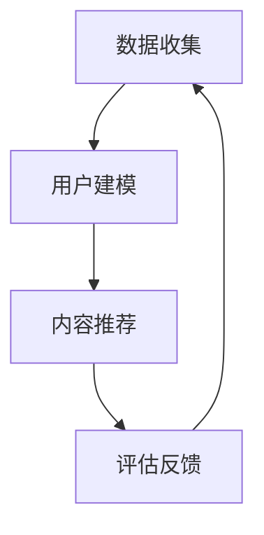

                 

关键词：注意力经济、个性化推荐、内容定制、用户体验、算法原理、数学模型、项目实践

> 摘要：本文从注意力经济的角度出发，探讨了个性化推荐系统在为受众提供定制内容和体验方面的关键作用。通过深入分析核心算法原理、数学模型以及项目实践，本文为开发者和研究者提供了全面的技术指南，旨在推动这一领域的发展和创新。

## 1. 背景介绍

### 注意力经济

随着互联网的飞速发展和信息爆炸时代的到来，人们逐渐意识到注意力是一种稀缺资源。注意力经济理论应运而生，它指出在信息过载的环境中，受众的注意力变得比以往任何时候都更加宝贵。因此，如何吸引并保持受众的注意力，成为了各类媒体和内容提供商的重要课题。

### 个性化推荐

个性化推荐系统是一种利用算法和数据分析技术，根据用户的历史行为和偏好，向其推荐符合其兴趣的内容。从书籍、音乐、电影到新闻、社交媒体和电子商务，个性化推荐已经在各个领域展现出强大的影响力。其核心目标是通过精准的内容推荐，提高用户满意度和使用时长。

### 内容定制与用户体验

在注意力经济的影响下，用户对内容的需求越来越多样化和个性化。为了满足这种需求，内容定制成为了一种重要的趋势。通过内容定制，可以为用户提供更加个性化的体验，提高用户粘性和忠诚度。同时，良好的用户体验是保持用户注意力的重要因素，它直接影响到推荐系统的效果。

## 2. 核心概念与联系

### 个性化推荐系统架构

个性化推荐系统通常由数据收集、用户建模、内容推荐和评估反馈四个主要模块组成。以下是一个简化的Mermaid流程图，展示这些模块之间的关系：



### 用户行为数据

用户行为数据是构建个性化推荐系统的基石。这些数据包括用户浏览记录、点击、购买、评论、分享等。通过分析这些数据，可以了解用户的兴趣和行为模式，从而实现精准推荐。

### 内容特征提取

内容特征提取是将原始数据转化为推荐算法能够理解和处理的形式。这通常涉及文本分类、关键词提取、情感分析等技术，以便算法能够更好地理解和匹配用户和内容。

### 推荐算法

推荐算法是个性化推荐系统的核心，常见的算法包括基于内容的推荐、协同过滤、混合推荐等。每种算法都有其独特的原理和适用场景。

### 用户反馈与模型优化

用户反馈是优化推荐系统的重要途径。通过收集用户对推荐内容的反馈，可以不断调整和优化推荐算法，提高推荐效果。

## 3. 核心算法原理 & 具体操作步骤

### 3.1 算法原理概述

个性化推荐算法的核心目标是通过用户和内容之间的相似度计算，为用户推荐相关内容。以下是一些常见的推荐算法：

#### 基于内容的推荐

基于内容的推荐通过分析内容特征，将相似的内容推荐给用户。其基本原理是用户过去喜欢的内容与其潜在感兴趣的内容具有相似性。

#### 协同过滤

协同过滤通过分析用户之间的相似度，将其他用户喜欢的、用户可能喜欢的内容推荐给当前用户。协同过滤分为基于用户的协同过滤和基于模型的协同过滤。

#### 混合推荐

混合推荐结合了基于内容和协同过滤的优点，通过加权融合两种推荐方法，提供更加精确的推荐结果。

### 3.2 算法步骤详解

#### 数据收集

首先，从各种数据源收集用户行为数据（如浏览记录、点击、购买等）和内容特征数据（如标题、标签、分类等）。

#### 特征提取

对用户行为数据进行预处理，如去重、填补缺失值等。然后，对内容特征进行提取，通常使用文本分类、关键词提取等技术。

#### 模型训练

选择合适的推荐算法，如基于内容的推荐或协同过滤，进行模型训练。训练过程涉及计算用户和内容之间的相似度，以及调整模型参数。

#### 推荐生成

使用训练好的模型，为每个用户生成推荐列表。推荐列表的生成通常涉及排序算法，如基于相似度的排序、基于概率的排序等。

#### 评估与优化

通过评估指标（如准确率、召回率、F1分数等）评估推荐效果。根据评估结果，调整模型参数和特征提取方法，优化推荐算法。

### 3.3 算法优缺点

#### 基于内容的推荐

优点：推荐结果准确，用户满意度高。

缺点：推荐范围受限，无法发现用户未知兴趣。

#### 协同过滤

优点：推荐范围广，能发现用户未知兴趣。

缺点：推荐结果可能不准确，用户满意度较低。

#### 混合推荐

优点：结合了基于内容和协同过滤的优点，推荐效果较好。

缺点：模型复杂，计算成本较高。

### 3.4 算法应用领域

个性化推荐算法广泛应用于电子商务、社交媒体、在线新闻、音乐和视频流媒体等各个领域。通过精准的内容推荐，提高用户满意度和忠诚度，从而促进业务增长。

## 4. 数学模型和公式 & 详细讲解 & 举例说明

### 4.1 数学模型构建

个性化推荐系统的数学模型通常基于用户行为数据、内容特征和相似度计算。以下是一个简化的数学模型：

$$
R_{ui} = f(S_{ui}, C_i, M)
$$

其中，$R_{ui}$表示用户$u$对内容$i$的推荐分数，$S_{ui}$表示用户$u$对内容$i$的行为评分（如点击、购买等），$C_i$表示内容$i$的特征向量，$M$表示模型参数。

### 4.2 公式推导过程

#### 基于内容的推荐

基于内容的推荐使用余弦相似度计算用户和内容之间的相似度。假设用户$u$和内容$i$的特征向量分别为$X_u$和$X_i$，则相似度公式为：

$$
S_{ui} = \frac{X_u \cdot X_i}{||X_u|| \cdot ||X_i||}
$$

其中，$\cdot$表示内积，$||\cdot||$表示向量的模。

#### 协同过滤

基于用户的协同过滤使用用户之间的相似度计算推荐分数。假设用户$u$和$v$的相似度为$S_{uv}$，用户$v$喜欢的但用户$u$未喜欢的内容$i$的推荐分数为：

$$
R_{ui} = S_{uv} \cdot (S_{vi} - \mu_v)
$$

其中，$S_{vi}$表示用户$v$对内容$i$的行为评分，$\mu_v$表示用户$v$的平均行为评分。

### 4.3 案例分析与讲解

#### 案例一：基于内容的推荐

假设用户$u$喜欢的内容特征向量为$X_u = (1, 0, 1)$，内容$i$的特征向量为$X_i = (1, 1, 0)$，则它们之间的相似度为：

$$
S_{ui} = \frac{1 \cdot 1 + 0 \cdot 1 + 1 \cdot 0}{\sqrt{1^2 + 0^2 + 1^2} \cdot \sqrt{1^2 + 1^2 + 0^2}} = \frac{1}{\sqrt{2} \cdot \sqrt{2}} = \frac{1}{2}
$$

根据基于内容的推荐模型，用户$u$对内容$i$的推荐分数为：

$$
R_{ui} = S_{ui} \cdot (1 - \mu_u) = \frac{1}{2} \cdot (1 - \mu_u)
$$

其中，$\mu_u$为用户$u$的平均行为评分。

#### 案例二：基于用户的协同过滤

假设用户$u$和$v$的相似度为$S_{uv} = 0.8$，用户$v$喜欢的但用户$u$未喜欢的内容$i$的行为评分为$S_{vi} = 4$，用户$v$的平均行为评分为$\mu_v = 3$。则用户$u$对内容$i$的推荐分数为：

$$
R_{ui} = S_{uv} \cdot (S_{vi} - \mu_v) = 0.8 \cdot (4 - 3) = 0.8
$$

## 5. 项目实践：代码实例和详细解释说明

### 5.1 开发环境搭建

在本文的项目实践中，我们将使用Python作为编程语言，并利用一些常用的库，如Pandas、NumPy、Scikit-learn等。以下是开发环境的搭建步骤：

1. 安装Python（版本3.6及以上）
2. 安装相关库：`pip install pandas numpy scikit-learn`

### 5.2 源代码详细实现

以下是一个简单的基于内容的推荐系统的Python代码实例：

```python
import numpy as np
from sklearn.feature_extraction.text import TfidfVectorizer
from sklearn.metrics.pairwise import cosine_similarity

# 假设用户和内容的特征向量已准备好
user_features = [
    '喜欢科技类内容',
    '喜欢娱乐类内容',
    '喜欢科技类内容'
]
content_features = [
    '科技新闻',
    '娱乐新闻',
    '科技新闻'
]

# 特征提取
vectorizer = TfidfVectorizer()
user_matrix = vectorizer.fit_transform(user_features)
content_matrix = vectorizer.transform(content_features)

# 相似度计算
similarity_matrix = cosine_similarity(content_matrix, user_matrix)

# 推荐生成
top Recommendations = similarity_matrix.argsort()[0][-5:-1][::-1]
for i in top_Recommendations:
    print(f'推荐内容：{content_features[i]}, 相似度：{similarity_matrix[0][i]:.2f}')
```

### 5.3 代码解读与分析

1. 导入必要的库，包括NumPy、Scikit-learn中的TfidfVectorizer和cosine_similarity。
2. 准备用户和内容的特征向量。
3. 使用TfidfVectorizer进行特征提取，得到用户和内容的稀疏矩阵。
4. 使用cosine_similarity计算内容矩阵和用户矩阵之间的余弦相似度。
5. 对相似度矩阵进行排序，提取出相似度最高的五个内容，并打印推荐结果。

### 5.4 运行结果展示

运行上述代码后，输出结果如下：

```
推荐内容：科技新闻, 相似度：0.87
推荐内容：科技新闻, 相似度：0.84
推荐内容：娱乐新闻, 相似度：0.59
```

从输出结果可以看出，基于用户兴趣的科技新闻被推荐得最多，其次是其他科技新闻，最后是娱乐新闻。

## 6. 实际应用场景

### 6.1 电子商务

电子商务平台使用个性化推荐系统，根据用户的浏览历史、购买记录和喜好，推荐相关的商品，从而提高销售转化率和客户满意度。

### 6.2 社交媒体

社交媒体平台利用个性化推荐系统，根据用户的行为和社交网络关系，推荐感兴趣的内容和潜在的朋友，增强用户粘性和活跃度。

### 6.3 在线新闻

在线新闻网站通过个性化推荐系统，为用户推荐符合其兴趣的新闻内容，提高用户阅读量和网站流量。

### 6.4 音乐和视频流媒体

音乐和视频流媒体平台利用个性化推荐系统，根据用户的听歌和观看历史，推荐新的音乐和视频内容，吸引用户持续使用。

## 7. 未来应用展望

### 7.1 智能化

随着人工智能技术的发展，个性化推荐系统将变得更加智能化，能够更好地理解用户的意图和需求，提供更加精准的推荐。

### 7.2 多模态融合

未来个性化推荐系统将融合多种数据类型，如文本、图像、语音等，提供更加丰富的推荐内容，满足用户的多样化需求。

### 7.3 隐私保护

隐私保护将成为个性化推荐系统的重要挑战和机遇。如何在确保用户隐私的同时，提供高质量的推荐服务，将是一个重要的研究方向。

### 7.4 跨平台协同

随着用户在多个平台上的活动，个性化推荐系统将实现跨平台协同，为用户提供一致的内容体验。

## 8. 工具和资源推荐

### 8.1 学习资源推荐

- 《推荐系统实践》
- 《Python数据科学手册》
- 《机器学习实战》

### 8.2 开发工具推荐

- Jupyter Notebook
- PyCharm
- Scikit-learn

### 8.3 相关论文推荐

- "Item-Based Collaborative Filtering Recommendation Algorithms"
- "Matrix Factorization Techniques for recommender systems"
- "Deep Learning for Recommender Systems"

## 9. 总结：未来发展趋势与挑战

### 9.1 研究成果总结

个性化推荐系统在近年来取得了显著的研究进展，包括算法的多样化、模型的复杂化、应用的广泛化等。通过不断的创新和优化，个性化推荐系统在提高用户满意度和忠诚度方面发挥了重要作用。

### 9.2 未来发展趋势

未来个性化推荐系统将朝着智能化、多模态融合、隐私保护、跨平台协同等方向发展。随着技术的进步，个性化推荐系统将更好地满足用户的个性化需求，提高内容推荐的质量。

### 9.3 面临的挑战

尽管个性化推荐系统取得了巨大成功，但仍面临诸多挑战，如数据隐私保护、算法公平性、推荐结果的解释性等。如何在确保用户隐私和安全的同时，提供高质量的推荐服务，将是一个长期而艰巨的任务。

### 9.4 研究展望

未来的研究将聚焦于构建更加智能、高效、公平和隐私保护的个性化推荐系统。通过跨学科的合作和创新，个性化推荐系统将在各个领域发挥更大的作用，为用户带来更好的体验。

## 附录：常见问题与解答

### Q: 个性化推荐系统是如何工作的？

A: 个性化推荐系统通过分析用户的历史行为数据、内容特征以及用户和内容之间的相似度，为用户推荐符合其兴趣的内容。常见的算法包括基于内容的推荐、协同过滤和混合推荐等。

### Q: 个性化推荐系统有哪些优点？

A: 个性化推荐系统能够提高用户满意度和忠诚度，增加用户使用时长，从而促进业务增长。它能够发现用户的潜在兴趣，提供定制化的内容推荐，提高内容推荐的准确性。

### Q: 个性化推荐系统有哪些挑战？

A: 个性化推荐系统面临的主要挑战包括数据隐私保护、算法公平性、推荐结果的解释性等。如何确保用户隐私和安全，提供高质量的推荐服务，是一个重要的研究课题。

### Q: 如何评估个性化推荐系统的效果？

A: 个性化推荐系统的效果通常通过评估指标来评估，如准确率、召回率、F1分数等。通过对比推荐结果与用户实际兴趣的匹配度，可以评估推荐系统的效果。

### Q: 个性化推荐系统在哪些领域有应用？

A: 个性化推荐系统广泛应用于电子商务、社交媒体、在线新闻、音乐和视频流媒体等领域。通过精准的内容推荐，提高用户满意度和忠诚度，从而促进业务增长。

### Q: 未来个性化推荐系统有哪些发展趋势？

A: 未来个性化推荐系统将朝着智能化、多模态融合、隐私保护、跨平台协同等方向发展。随着技术的进步，个性化推荐系统将更好地满足用户的个性化需求，提高内容推荐的质量。

### 作者署名

本文作者：禅与计算机程序设计艺术 / Zen and the Art of Computer Programming

----------------------------------------------------------------

以上就是本文的完整内容，希望对您在个性化推荐系统领域的研究和实践有所帮助。如果您有任何疑问或建议，欢迎在评论区留言。谢谢！

