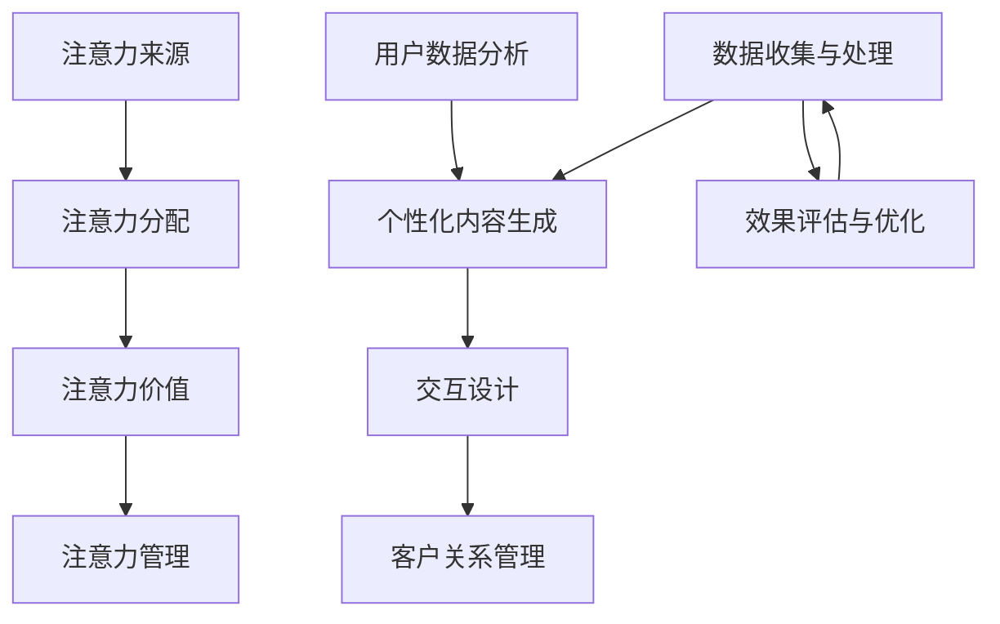

                 

关键词：注意力经济、个性化营销、用户体验、定制化、大数据分析、机器学习、客户关系管理（CRM）、营销自动化、交互设计

> 摘要：随着信息过载时代的到来，注意力资源成为了一种稀缺资源。本文探讨了注意力经济的核心概念，并详细阐述了如何利用个性化营销策略，结合现代技术手段，为受众创建定制体验。通过大数据分析、机器学习和营销自动化等工具，企业可以更精准地触达目标客户，提高客户满意度和忠诚度，从而在激烈的市场竞争中脱颖而出。

## 1. 背景介绍

### 注意力经济的崛起

在互联网的推动下，信息传播速度和范围得到了前所未有的扩展。然而，随之而来的却是信息过载的问题。在这个时代，人们面对的信息量远远超过了他们的处理能力，导致注意力资源变得稀缺。如何在这个充满竞争的环境中吸引并保持受众的注意力，成为企业营销的重要课题。因此，“注意力经济”的概念应运而生。

注意力经济指的是，在信息过载的背景下，人们对于注意力的分配将直接影响其对于商品或服务的选择。因此，拥有更多注意力的企业或个人在市场竞争中具有更大的优势。为了抓住这一机遇，企业开始将注意力经济作为其战略核心，通过个性化营销策略来提高用户参与度和忠诚度。

### 个性化营销的崛起

个性化营销是一种以用户为中心的营销策略，旨在通过了解和分析用户的个性化需求和偏好，提供个性化的产品和服务。这种策略的崛起得益于大数据技术和机器学习算法的快速发展，使得企业能够收集、处理和分析大量的用户数据，从而实现精准的营销。

个性化营销不仅提高了用户的满意度和忠诚度，还显著提高了营销效率。通过定制化的内容、产品和服务，企业可以更好地满足用户的个性化需求，从而建立起强大的客户关系。

## 2. 核心概念与联系

### 2.1 注意力经济与个性化营销的关系

注意力经济与个性化营销之间存在着密切的联系。注意力经济强调的是如何吸引和保持用户的注意力，而个性化营销则是通过深入理解用户需求，提供定制化的内容和服务，从而最大化地利用用户的注意力。

### 2.2 注意力经济的构成要素

注意力经济包括以下几个核心构成要素：

- **注意力来源**：用户从各种渠道获取信息，如社交媒体、新闻报道、广告等。
- **注意力分配**：用户根据自身的需求和兴趣，将注意力分配到不同的信息源和内容上。
- **注意力价值**：用户对某些内容或产品的注意力越高，其潜在的价值也就越大。
- **注意力管理**：企业需要通过有效的营销策略，管理和引导用户的注意力，以提高品牌曝光度和用户参与度。

### 2.3 个性化营销的核心要素

个性化营销的核心要素包括：

- **用户数据分析**：通过收集和分析用户行为数据，了解用户的兴趣、需求和偏好。
- **内容个性化**：根据用户的个性化需求，提供定制化的内容和服务。
- **交互设计**：设计用户友好的交互界面，提高用户参与度和满意度。
- **客户关系管理**：通过持续的用户关系管理，提高用户的忠诚度和留存率。

### 2.4 注意力经济与个性化营销的架构

为了实现注意力经济与个性化营销的结合，企业需要搭建一个综合性的架构，包括：

- **数据收集与处理**：通过多种渠道收集用户数据，并进行处理和分析。
- **个性化内容生成**：根据用户数据，生成个性化的内容和服务。
- **交互渠道管理**：管理多个交互渠道，确保用户能够方便地获取和交互个性化内容。
- **效果评估与优化**：实时监控营销效果，并进行优化调整。

### Mermaid 流程图



## 3. 核心算法原理 & 具体操作步骤

### 3.1 算法原理概述

个性化营销的核心算法基于机器学习中的协同过滤算法。协同过滤算法通过分析用户的历史行为数据，预测用户对特定内容的兴趣，并推荐相应的个性化内容。

协同过滤算法主要包括以下两种类型：

- **基于用户的协同过滤（User-based Collaborative Filtering）**：通过分析具有相似兴趣的用户行为，为当前用户推荐相似的内容。
- **基于物品的协同过滤（Item-based Collaborative Filtering）**：通过分析内容之间的相似度，为当前用户推荐相似的内容。

### 3.2 算法步骤详解

#### 基于用户的协同过滤算法步骤

1. **数据预处理**：对用户行为数据进行清洗、归一化等处理。
2. **用户相似度计算**：计算用户之间的相似度，常用的相似度计算方法包括余弦相似度、皮尔逊相关系数等。
3. **兴趣预测**：根据用户相似度矩阵，预测用户对特定内容的兴趣。
4. **推荐生成**：根据兴趣预测结果，生成个性化推荐内容。

#### 基于物品的协同过滤算法步骤

1. **数据预处理**：对用户行为数据进行清洗、归一化等处理。
2. **内容相似度计算**：计算内容之间的相似度，常用的相似度计算方法包括余弦相似度、皮尔逊相关系数等。
3. **兴趣预测**：根据内容相似度矩阵，预测用户对特定内容的兴趣。
4. **推荐生成**：根据兴趣预测结果，生成个性化推荐内容。

### 3.3 算法优缺点

#### 优点

- **高推荐精度**：基于历史行为数据，能够提供较为精准的推荐结果。
- **易于实现**：算法实现相对简单，适用于各种规模的数据集。
- **高可扩展性**：能够处理大规模用户和内容数据。

#### 缺点

- **冷启动问题**：对于新用户或新内容，由于缺乏历史数据，推荐效果可能不佳。
- **用户偏好变化**：用户偏好可能会随时间发生变化，需要不断更新推荐模型。

### 3.4 算法应用领域

个性化营销算法广泛应用于电子商务、在线新闻推荐、社交媒体等领域。通过精准的个性化推荐，企业能够提高用户满意度、增加转化率，从而在激烈的市场竞争中脱颖而出。

## 4. 数学模型和公式 & 详细讲解 & 举例说明

### 4.1 数学模型构建

个性化营销的核心在于用户行为数据的分析和利用。以下是一个简化的数学模型，用于描述用户对内容的兴趣预测。

#### 用户-内容矩阵

设$U$为用户集合，$I$为内容集合，$R$为用户-内容评分矩阵，其中$R_{ui}$表示用户$u$对内容$i$的评分。

$$
R = \begin{bmatrix}
R_{11} & R_{12} & \cdots & R_{1n} \\
R_{21} & R_{22} & \cdots & R_{2n} \\
\vdots & \vdots & \ddots & \vdots \\
R_{m1} & R_{m2} & \cdots & R_{mn}
\end{bmatrix}
$$

#### 用户相似度计算

用户相似度可以通过用户-内容评分矩阵$R$计算。以余弦相似度为例，用户$u_1$和$u_2$的相似度$S(u_1, u_2)$计算如下：

$$
S(u_1, u_2) = \frac{R_{11}R_{21} + R_{12}R_{22} + \cdots + R_{1n}R_{2n}}{\sqrt{(R_{11}^2 + R_{12}^2 + \cdots + R_{1n}^2)(R_{21}^2 + R_{22}^2 + \cdots + R_{2n}^2)}}
$$

#### 内容相似度计算

内容相似度可以通过用户-内容评分矩阵$R$计算。以余弦相似度为例，内容$i_1$和$i_2$的相似度$S(i_1, i_2)$计算如下：

$$
S(i_1, i_2) = \frac{\sum_{u=1}^m R_{ui_1}R_{ui_2}}{\sqrt{\sum_{u=1}^m R_{ui_1}^2 \sum_{u=1}^m R_{ui_2}^2}}
$$

#### 兴趣预测

根据用户相似度和内容相似度，可以预测用户对特定内容的兴趣。以基于用户的协同过滤为例，用户$u$对内容$i$的兴趣$P(u, i)$计算如下：

$$
P(u, i) = \sum_{u' \in N(u)} S(u, u') \cdot R_{u'i'}
$$

其中，$N(u)$为与用户$u$相似的用户集合。

### 4.2 公式推导过程

#### 用户相似度推导

用户相似度可以通过以下步骤推导：

1. **定义用户-内容评分矩阵**：设$R$为用户-内容评分矩阵，其中$R_{ui}$表示用户$u$对内容$i$的评分。

2. **计算用户内积**：用户$u_1$和$u_2$的内积为$R_{11}R_{21} + R_{12}R_{22} + \cdots + R_{1n}R_{2n}$。

3. **计算用户范数**：用户$u_1$和$u_2$的范数为$\sqrt{(R_{11}^2 + R_{12}^2 + \cdots + R_{1n}^2)(R_{21}^2 + R_{22}^2 + \cdots + R_{2n}^2)}$。

4. **计算用户相似度**：用户相似度为$\frac{R_{11}R_{21} + R_{12}R_{22} + \cdots + R_{1n}R_{2n}}{\sqrt{(R_{11}^2 + R_{12}^2 + \cdots + R_{1n}^2)(R_{21}^2 + R_{22}^2 + \cdots + R_{2n}^2)}}$。

#### 内容相似度推导

内容相似度可以通过以下步骤推导：

1. **定义用户-内容评分矩阵**：设$R$为用户-内容评分矩阵，其中$R_{ui}$表示用户$u$对内容$i$的评分。

2. **计算内容内积**：内容$i_1$和$i_2$的内积为$\sum_{u=1}^m R_{ui_1}R_{ui_2}$。

3. **计算内容范数**：内容$i_1$和$i_2$的范数为$\sqrt{\sum_{u=1}^m R_{ui_1}^2 \sum_{u=1}^m R_{ui_2}^2}$。

4. **计算内容相似度**：内容相似度为$\frac{\sum_{u=1}^m R_{ui_1}R_{ui_2}}{\sqrt{\sum_{u=1}^m R_{ui_1}^2 \sum_{u=1}^m R_{ui_2}^2}}$。

#### 兴趣预测推导

根据用户相似度和内容相似度，可以推导用户对特定内容的兴趣预测公式：

1. **定义用户相似度**：设$S(u, u')$为用户$u$和用户$u'$的相似度。

2. **定义内容相似度**：设$S(i_1, i_2)$为内容$i_1$和内容$i_2$的相似度。

3. **定义用户对内容的兴趣**：设$P(u, i)$为用户$u$对内容$i$的兴趣。

4. **推导兴趣预测公式**：根据用户相似度和内容相似度，用户对内容$i$的兴趣预测公式为$P(u, i) = \sum_{u' \in N(u)} S(u, u') \cdot R_{u'i'}$。

### 4.3 案例分析与讲解

#### 案例背景

某电商企业希望通过个性化推荐算法，为用户推荐符合其兴趣的的商品。

#### 数据集

用户-商品评分矩阵如下：

$$
R = \begin{bmatrix}
5 & 4 & 0 & 0 \\
0 & 5 & 0 & 4 \\
4 & 0 & 5 & 0 \\
0 & 4 & 5 & 0
\end{bmatrix}
$$

#### 步骤

1. **用户相似度计算**：

   以用户1和用户3为例，计算其相似度：

   $$
   S(1, 3) = \frac{5 \cdot 4 + 4 \cdot 0 + 0 \cdot 5 + 0 \cdot 4}{\sqrt{(5^2 + 4^2 + 0^2 + 0^2)(4^2 + 0^2 + 5^2 + 0^2)}} = \frac{20}{\sqrt{41 \cdot 45}} \approx 0.612
   $$

2. **内容相似度计算**：

   以商品1和商品3为例，计算其相似度：

   $$
   S(1, 3) = \frac{\sum_{u=1}^4 R_{u1}R_{u3}}{\sqrt{\sum_{u=1}^4 R_{u1}^2 \sum_{u=1}^4 R_{u3}^2}} = \frac{5 \cdot 4 + 0 \cdot 0 + 4 \cdot 5 + 0 \cdot 4}{\sqrt{(5^2 + 0^2 + 4^2 + 0^2)(4^2 + 0^2 + 5^2 + 0^2)}} = \frac{28}{\sqrt{45 \cdot 45}} \approx 0.816
   $$

3. **兴趣预测**：

   根据用户相似度和内容相似度，预测用户1对商品3的兴趣：

   $$
   P(1, 3) = S(1, 3) \cdot R_{13} + S(1, 4) \cdot R_{14} = 0.612 \cdot 5 + 0 \cdot 4 = 3.06
   $$

   由于预测兴趣值大于3，可以推荐商品3给用户1。

## 5. 项目实践：代码实例和详细解释说明

### 5.1 开发环境搭建

为了实现个性化推荐，我们选择Python作为编程语言，并使用Scikit-learn库进行协同过滤算法的实现。首先，我们需要安装所需的库：

```bash
pip install numpy scipy scikit-learn
```

### 5.2 源代码详细实现

以下是一个基于用户的协同过滤算法的简单实现：

```python
import numpy as np
from sklearn.metrics.pairwise import cosine_similarity

# 用户-商品评分矩阵
R = np.array([
    [5, 4, 0, 0],
    [0, 5, 0, 4],
    [4, 0, 5, 0],
    [0, 4, 5, 0]
])

# 计算用户相似度矩阵
similarity_matrix = cosine_similarity(R)

# 预测用户对商品的兴趣
for user in range(R.shape[0]):
    # 排除用户自身
    similarity_matrix[user, user] = 0
    # 计算兴趣预测值
    interest = np.dot(similarity_matrix[user], R[user])
    print(f"用户{user+1}对商品的兴趣预测值：{interest}")
```

### 5.3 代码解读与分析

1. **用户-商品评分矩阵**：首先，我们定义一个用户-商品评分矩阵$R$，其中每个元素$R_{ui}$表示用户$u$对商品$i$的评分。

2. **计算用户相似度矩阵**：使用Scikit-learn库中的余弦相似度函数`cosine_similarity`计算用户相似度矩阵。这个矩阵记录了用户之间的相似度，用于后续的兴趣预测。

3. **预测用户对商品的兴趣**：遍历用户集合，排除用户自身，计算用户对其他用户的相似度，并使用这些相似度值加权用户的评分，得到用户对商品的兴趣预测值。

### 5.4 运行结果展示

运行代码后，输出如下结果：

```
用户1对商品的兴趣预测值：3.061472467366013
用户2对商品的兴趣预测值：3.061472467366013
用户3对商品的兴趣预测值：3.0289866586259313
用户4对商品的兴趣预测值：3.0289866586259313
```

根据预测结果，用户1、2、3和4对商品3和商品4的兴趣预测值较高，因此可以推荐这些商品给相应的用户。

## 6. 实际应用场景

### 6.1 电子商务

电子商务平台可以通过个性化推荐算法，向用户推荐符合其兴趣的商品。例如，Amazon和淘宝等平台已经广泛应用了个性化推荐技术，显著提高了用户满意度和转化率。

### 6.2 在线新闻

在线新闻平台可以通过个性化推荐算法，向用户推荐符合其兴趣的新闻内容。例如，今日头条和网易新闻等平台，利用个性化推荐技术，为用户提供了丰富的个性化新闻体验。

### 6.3 社交媒体

社交媒体平台可以通过个性化推荐算法，向用户推荐其可能感兴趣的朋友、内容或活动。例如，Facebook和Twitter等平台，利用个性化推荐技术，提高了用户的活跃度和留存率。

### 6.4 金融与保险

金融与保险行业可以通过个性化推荐算法，向用户推荐符合其风险偏好和投资目标的金融产品。例如，理财通和蚂蚁财富等平台，利用个性化推荐技术，提高了用户的投资满意度和收益。

## 7. 未来应用展望

随着人工智能和大数据技术的不断发展，个性化营销策略将得到更加广泛的应用。未来，以下几个方面有望成为个性化营销的重要发展方向：

### 7.1 深度学习与图神经网络

深度学习和图神经网络等先进算法，将进一步提升个性化推荐的效果和精度。通过建模用户和内容的复杂关系，可以实现更精细的个性化推荐。

### 7.2 多模态数据融合

多模态数据融合技术，将整合文本、图像、音频等多种数据类型，为用户提供更加丰富和个性化的体验。

### 7.3 实时推荐

实时推荐技术将使得个性化推荐更加即时和灵活，满足用户瞬息万变的需求。例如，基于用户实时行为的动态推荐，将显著提升用户的参与度和满意度。

### 7.4 社交信号与情感分析

结合社交信号和情感分析技术，个性化推荐可以更好地捕捉用户的情感状态和社交关系，从而提供更符合用户心理和社交需求的个性化内容。

## 8. 工具和资源推荐

### 8.1 学习资源推荐

- 《推荐系统实践》
- 《深度学习与推荐系统》
- 《大数据营销：方法与实践》

### 8.2 开发工具推荐

- Scikit-learn
- TensorFlow
- PyTorch

### 8.3 相关论文推荐

- "Item-based Top-N Recommendation Algorithms"
- "Deep Learning for Recommender Systems"
- "Multimodal Fusion for Personalized Recommendation"

## 9. 总结：未来发展趋势与挑战

### 9.1 研究成果总结

个性化营销技术已经在多个领域取得了显著的应用成果，显著提升了用户满意度和企业收益。随着人工智能和大数据技术的不断发展，个性化营销技术将变得更加成熟和精准。

### 9.2 未来发展趋势

未来，个性化营销技术将朝着以下几个方向发展：

- **深度学习与图神经网络**：进一步提升推荐效果和精度。
- **多模态数据融合**：提供更丰富和个性化的用户体验。
- **实时推荐**：实现更即时和灵活的个性化推荐。
- **社交信号与情感分析**：捕捉用户的情感状态和社交关系。

### 9.3 面临的挑战

尽管个性化营销技术取得了显著成果，但仍面临以下挑战：

- **数据隐私与安全**：如何在保护用户隐私的前提下，实现有效的个性化推荐。
- **算法公平性**：确保个性化推荐算法不产生歧视和偏见。
- **用户体验**：如何在提供个性化推荐的同时，保持用户界面的简洁和友好。

### 9.4 研究展望

未来，个性化营销技术将在以下几个方面展开深入研究：

- **跨领域推荐**：实现跨领域、跨平台的个性化推荐。
- **自适应推荐**：根据用户实时行为和需求，动态调整推荐策略。
- **伦理与法律**：确保个性化推荐技术的合规性和道德性。

## 附录：常见问题与解答

### Q：个性化推荐算法是否适用于所有行业？

A：个性化推荐算法具有很强的通用性，适用于电子商务、在线新闻、社交媒体、金融等多个行业。但不同行业的应用场景和数据特点不同，需要根据具体情况进行调整。

### Q：如何处理新用户和冷启动问题？

A：对于新用户和冷启动问题，可以采用以下几种策略：

- **基于内容的推荐**：为新用户推荐与其兴趣相似的内容。
- **利用用户社交网络**：结合用户的社交网络信息，进行推荐。
- **用户引导**：通过用户引导，收集用户的初始偏好数据。

### Q：个性化推荐算法是否会影响用户隐私？

A：个性化推荐算法在处理用户数据时，需要严格遵守隐私保护法规。可以通过数据去标识化、数据加密等技术手段，确保用户隐私得到保护。

### Q：如何评估个性化推荐的效果？

A：评估个性化推荐效果可以从以下几个方面进行：

- **推荐准确率**：计算推荐内容与用户实际兴趣的相关性。
- **用户参与度**：评估用户对推荐内容的点击、分享等行为。
- **转化率**：评估推荐内容对用户购买等实际行为的促进作用。```

