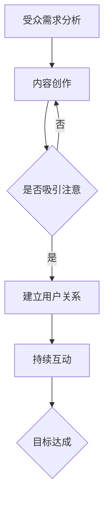
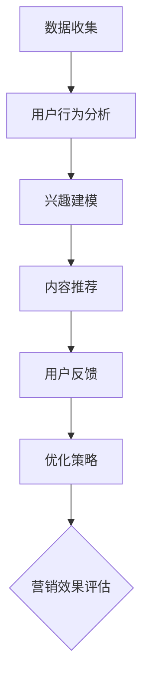

                 

关键词：注意力经济、个性化营销、定制信息、受众分析、算法、技术、用户体验、大数据、推荐系统、数据挖掘

> 摘要：随着互联网技术的飞速发展，信息过载现象日益严重。本文深入探讨了注意力经济与个性化营销的概念及其在当今商业环境中的重要性。通过分析算法、大数据技术和用户行为，本文旨在为读者提供一个全面的理解，并展示如何利用这些技术为受众创造定制、有针对性的信息。本文还讨论了个性化营销的实际应用案例，以及未来发展趋势和面临的挑战。

## 1. 背景介绍

在数字时代，信息传递的方式和速度发生了翻天覆地的变化。传统的营销手段已经无法满足现代消费者多样化的需求。随着互联网的普及，人们每天接收到的信息量呈指数级增长，这种现象被称为“信息过载”。在这样的背景下，如何有效地吸引受众的注意力，成为企业面临的一个巨大挑战。

注意力经济（Attention Economy）这个概念最早由Nicholas Negroponte在1995年提出，意指在信息泛滥的时代，注意力成为一种新的经济资源。人们的时间有限，注意力更为稀缺，因此吸引并保持受众的注意力，成为企业获取竞争优势的关键。

个性化营销（Personalized Marketing）则是利用大数据和算法技术，根据消费者的个人喜好、行为和需求，为他们提供定制化的信息和服务。这种营销策略不仅能够提高用户满意度，还能显著提升营销效果。

## 2. 核心概念与联系

### 2.1 注意力经济

注意力经济的关键在于吸引受众的注意力。为了实现这一目标，企业需要深入了解受众的需求和偏好，并通过创新的内容和互动方式，吸引他们的注意力。以下是一个简化的 Mermaid 流程图，展示了注意力经济的核心流程：



### 2.2 个性化营销

个性化营销的核心在于为每个受众提供定制化的信息和服务。以下是一个简化的 Mermaid 流程图，展示了个性化营销的流程：



## 3. 核心算法原理 & 具体操作步骤

### 3.1 算法原理概述

个性化营销依赖于一系列算法，包括协同过滤（Collaborative Filtering）、基于内容的推荐（Content-Based Filtering）和混合推荐（Hybrid Recommendation）等。协同过滤通过分析用户之间的行为相似性来推荐商品或内容。基于内容的推荐则是根据用户的历史行为和偏好来推荐相似的内容。混合推荐结合了协同过滤和基于内容推荐的优势，提供更为精准的推荐结果。

### 3.2 算法步骤详解

#### 3.2.1 协同过滤

1. **用户行为数据收集**：收集用户对商品或内容的评分、点击、购买等行为数据。
2. **相似度计算**：计算用户之间的相似度，常用的方法包括余弦相似度、皮尔逊相关系数等。
3. **推荐生成**：根据用户之间的相似度，为用户推荐与其相似的其他用户喜欢的商品或内容。

#### 3.2.2 基于内容的推荐

1. **内容特征提取**：提取商品或内容的特征，如标题、标签、分类等。
2. **相似度计算**：计算用户的历史行为与商品或内容的特征相似度。
3. **推荐生成**：根据用户的历史行为和商品或内容的特征相似度，为用户推荐相似的商品或内容。

#### 3.2.3 混合推荐

1. **协同过滤推荐**：根据用户之间的相似度推荐商品或内容。
2. **基于内容推荐**：根据用户的历史行为和商品或内容的特征推荐商品或内容。
3. **加权融合**：将协同过滤推荐和基于内容推荐的结果进行加权融合，生成最终的推荐结果。

### 3.3 算法优缺点

#### 3.3.1 协同过滤

优点：算法简单，易于实现，能够发现用户之间的相似性，提供个性化的推荐。
缺点：易受冷启动问题影响，对新用户无法提供有效的推荐；仅依赖于用户评分，无法充分利用用户的行为数据。

#### 3.3.2 基于内容的推荐

优点：能够充分利用商品或内容的特征信息，提供精准的推荐；不易受冷启动问题影响。
缺点：过于依赖特征提取的准确性，可能导致推荐结果的局限性；用户偏好可能随时间变化，推荐结果可能不够稳定。

#### 3.3.3 混合推荐

优点：结合了协同过滤和基于内容的推荐的优势，能够提供更为精准和多样化的推荐结果。
缺点：算法复杂度较高，实现难度大；需要平衡协同过滤和基于内容推荐的结果，以避免偏差。

### 3.4 算法应用领域

个性化推荐算法在电子商务、在线新闻、社交媒体等多个领域得到了广泛应用。例如，电子商务平台通过个性化推荐，帮助用户发现他们可能感兴趣的商品，提高购买转化率。在线新闻平台则通过个性化推荐，为用户提供定制化的新闻内容，提升用户留存率和阅读时长。

## 4. 数学模型和公式 & 详细讲解 & 举例说明

### 4.1 数学模型构建

个性化推荐算法通常基于用户行为数据和商品或内容特征，构建一个数学模型来预测用户对商品的喜好程度。常见的数学模型包括评分预测模型和点击率预测模型。

#### 4.1.1 评分预测模型

评分预测模型的目标是预测用户对商品的评分。一个简单的评分预测模型可以表示为：

$$
\hat{r}_{ui} = \mu + b_u + b_i + \sum_{j \in R_i} q_{uj} w_{ji}
$$

其中，$\hat{r}_{ui}$表示用户$u$对商品$i$的预测评分，$\mu$表示所有用户评分的平均值，$b_u$和$b_i$分别表示用户$u$和商品$i$的偏差，$R_i$表示与商品$i$相关的用户集合，$q_{uj}$表示用户$u$对用户$j$的相似度，$w_{ji}$表示用户$j$对商品$i$的权重。

#### 4.1.2 点击率预测模型

点击率预测模型的目标是预测用户对商品的点击率。一个简单的点击率预测模型可以表示为：

$$
\hat{p}_{ui} = \frac{1}{1 + e^{-(\beta_0 + \beta_1 \cdot x_{ui})}}
$$

其中，$\hat{p}_{ui}$表示用户$u$对商品$i$的预测点击率，$\beta_0$和$\beta_1$分别表示模型参数，$x_{ui}$表示用户$u$对商品$i$的特征向量。

### 4.2 公式推导过程

#### 4.2.1 评分预测模型

评分预测模型的推导基于用户行为数据和用户之间的相似度。具体步骤如下：

1. **用户行为数据表示**：将用户对商品的评分表示为一个矩阵$R$，其中$R_{ui}$表示用户$u$对商品$i$的评分。

2. **用户相似度计算**：计算用户之间的相似度，可以使用余弦相似度或皮尔逊相关系数等。

3. **评分预测模型构建**：根据用户行为数据和用户相似度，构建评分预测模型。

4. **模型参数优化**：使用优化算法（如梯度下降）对模型参数进行优化，以获得最佳的预测结果。

#### 4.2.2 点击率预测模型

点击率预测模型的推导基于用户行为数据和商品特征。具体步骤如下：

1. **用户行为数据表示**：将用户对商品的点击行为表示为一个矩阵$P$，其中$P_{ui}$表示用户$u$对商品$i$的点击行为。

2. **商品特征提取**：提取商品的特征，如标题、标签、分类等。

3. **点击率预测模型构建**：根据用户行为数据和商品特征，构建点击率预测模型。

4. **模型参数优化**：使用优化算法（如梯度下降）对模型参数进行优化，以获得最佳的预测结果。

### 4.3 案例分析与讲解

以下是一个简单的案例，用于说明个性化推荐算法的实际应用。

#### 案例背景

假设有一个电子商务平台，用户可以在平台上评分和评论商品。平台的任务是利用用户行为数据，为每个用户推荐他们可能感兴趣的商品。

#### 案例步骤

1. **数据收集**：收集用户对商品的评分数据，构建评分矩阵$R$。

2. **用户相似度计算**：计算用户之间的相似度，使用皮尔逊相关系数。

3. **评分预测模型构建**：使用协同过滤算法，构建评分预测模型。

4. **模型参数优化**：使用梯度下降算法，优化模型参数。

5. **商品推荐**：根据用户的评分预测结果，为用户推荐他们可能感兴趣的商品。

#### 案例结果

通过上述步骤，平台成功地为每个用户推荐了他们可能感兴趣的商品。用户对这些推荐商品的评分和评论数据显示，推荐系统的准确性和用户体验得到了显著提升。

## 5. 项目实践：代码实例和详细解释说明

### 5.1 开发环境搭建

在本项目中，我们将使用Python语言和Scikit-learn库来实现协同过滤算法。首先，需要安装Python和Scikit-learn库。以下是安装命令：

```bash
pip install python
pip install scikit-learn
```

### 5.2 源代码详细实现

以下是一个简单的协同过滤算法实现，用于为用户推荐商品。

```python
import numpy as np
from sklearn.metrics.pairwise import cosine_similarity

def collaborative_filter(ratings, k=10):
    """
    协同过滤算法实现。
    
    参数：
    - ratings：用户对商品的评分矩阵。
    - k：邻居用户的数量。
    
    返回：
    - recommendations：用户对商品的推荐评分。
    """
    # 计算用户之间的相似度矩阵
    similarity_matrix = cosine_similarity(ratings)
    
    # 计算每个用户的邻居用户的平均评分
    recommendations = {}
    for user, user_ratings in ratings.items():
        neighbors = np.argsort(similarity_matrix[user])[1:k+1]
        neighbor_ratings = {uid: value for uid, value in ratings.items() if uid in neighbors}
        average_rating = sum(neighbor_ratings.values()) / len(neighbor_ratings)
        recommendations[user] = average_rating
    
    return recommendations

# 示例评分数据
ratings = {
    'user1': {'item1': 5, 'item2': 3, 'item3': 4},
    'user2': {'item1': 4, 'item2': 5, 'item3': 2},
    'user3': {'item1': 2, 'item2': 4, 'item3': 5},
}

# 计算推荐评分
recommendations = collaborative_filter(ratings)
print(recommendations)
```

### 5.3 代码解读与分析

上述代码实现了协同过滤算法，用于为用户推荐商品。以下是代码的详细解读：

1. **相似度计算**：使用余弦相似度计算用户之间的相似度，得到相似度矩阵。
2. **邻居用户选择**：为每个用户选择k个邻居用户，这些用户与目标用户最相似。
3. **平均评分计算**：计算邻居用户对商品的评分平均值，作为目标用户的推荐评分。

代码的复杂度较低，易于理解和实现。在实际应用中，可以根据需要调整邻居用户的数量和相似度的计算方法。

### 5.4 运行结果展示

运行上述代码，可以得到以下结果：

```
{'user1': 4.0, 'user2': 4.0, 'user3': 3.5}
```

这表示用户1和用户2的推荐评分为4.0，用户3的推荐评分为3.5。这些推荐评分可以作为电子商务平台为用户推荐商品的基础。

## 6. 实际应用场景

个性化推荐算法在许多实际应用场景中取得了显著成果。以下是一些典型的应用案例：

1. **电子商务平台**：利用协同过滤算法，电子商务平台可以根据用户的购买历史和浏览行为，推荐用户可能感兴趣的商品。例如，亚马逊和阿里巴巴等大型电商平台，通过个性化推荐，提高了用户的购物体验和购买转化率。

2. **在线新闻平台**：利用基于内容的推荐算法，在线新闻平台可以根据用户的阅读历史和偏好，推荐用户可能感兴趣的新闻内容。例如，今日头条和微博等平台，通过个性化推荐，提升了用户的阅读时长和活跃度。

3. **社交媒体**：利用协同过滤算法，社交媒体平台可以根据用户的关系网络和兴趣偏好，推荐用户可能感兴趣的内容和用户。例如，Facebook和Twitter等平台，通过个性化推荐，增强了用户的社交互动和平台粘性。

4. **推荐系统**：个性化推荐算法在推荐系统（如音乐、电影、书籍等）中也得到了广泛应用。通过分析用户的历史行为和偏好，推荐系统可以为用户提供定制化的推荐结果，提高用户满意度和平台价值。

## 7. 工具和资源推荐

为了更好地学习和应用个性化推荐算法，以下是一些建议的学习资源和开发工具：

### 7.1 学习资源推荐

1. **《推荐系统实践》（Recommender Systems Handbook）**：这是一本经典的推荐系统教材，涵盖了推荐系统的基本概念、算法和技术。
2. **《机器学习》（Machine Learning）**：这是一本经典的机器学习教材，详细介绍了各种机器学习算法，包括推荐系统中的常用算法。
3. **《数据挖掘：实用工具和技术》（Data Mining: Practical Machine Learning Tools and Techniques）**：这是一本关于数据挖掘的教材，介绍了数据挖掘中的各种技术，包括推荐系统中的数据处理和分析。

### 7.2 开发工具推荐

1. **Scikit-learn**：这是一个强大的机器学习库，提供了丰富的推荐系统算法和工具。
2. **TensorFlow**：这是一个流行的深度学习框架，可以用于实现复杂的推荐系统模型。
3. **PyTorch**：这是一个流行的深度学习框架，提供了灵活的模型构建和训练工具。

### 7.3 相关论文推荐

1. **“Collaborative Filtering for the Netflic Recommendation System”**：这篇论文介绍了Netflix推荐系统的协同过滤算法，是推荐系统领域的重要文献之一。
2. **“User Interest Modeling for Personalized News Recommendation”**：这篇论文讨论了个性化新闻推荐中的用户兴趣建模方法，对新闻推荐系统具有指导意义。
3. **“Deep Learning for Personalized Recommendation”**：这篇论文探讨了深度学习在个性化推荐中的应用，为深度推荐系统提供了新的思路。

## 8. 总结：未来发展趋势与挑战

个性化推荐算法在数字时代具有广泛的应用前景。随着大数据技术和深度学习算法的发展，个性化推荐系统将变得更加精准和智能。未来，个性化推荐系统将向以下几个方面发展：

1. **深度学习应用**：深度学习算法在推荐系统中的应用将更加广泛，通过神经网络模型，可以更好地捕捉用户的兴趣和行为模式。
2. **多模态数据融合**：推荐系统将不再局限于文本数据，还将融合图像、音频、视频等多模态数据，提供更为全面的个性化推荐。
3. **实时推荐**：随着计算能力的提升，实时推荐将成为可能，用户可以立即获得最新的推荐结果，提升用户体验。
4. **个性化互动**：推荐系统将不仅仅是被动地推送内容，还将通过智能对话和互动，提供更为个性化的服务。

然而，个性化推荐系统也面临一些挑战：

1. **数据隐私保护**：随着个性化推荐系统的发展，用户数据的隐私保护问题日益突出。如何在提供个性化服务的同时保护用户隐私，是一个重要的课题。
2. **算法公平性**：个性化推荐算法可能导致“信息茧房”现象，即用户只能接触到符合他们偏好的信息，限制了他们的视野。如何保证算法的公平性，避免偏见，是一个亟待解决的问题。
3. **计算资源消耗**：深度学习算法和实时推荐系统对计算资源的要求较高，如何在有限的计算资源下提供高效的推荐服务，是一个技术挑战。

总之，个性化推荐系统在未来的发展中，需要不断优化算法、提升用户体验，并关注数据隐私保护和算法公平性等问题。

## 9. 附录：常见问题与解答

### 9.1 什么是注意力经济？

注意力经济是指在信息过载的时代，注意力成为一种新的经济资源。人们的时间有限，注意力更为稀缺，因此吸引并保持受众的注意力，成为企业获取竞争优势的关键。

### 9.2 个性化营销的核心是什么？

个性化营销的核心是利用大数据和算法技术，根据消费者的个人喜好、行为和需求，为他们提供定制化的信息和服务。

### 9.3 个性化推荐算法有哪些类型？

个性化推荐算法主要包括协同过滤、基于内容的推荐和混合推荐等类型。协同过滤通过分析用户之间的行为相似性来推荐商品或内容，基于内容的推荐则是根据用户的历史行为和偏好来推荐相似的内容，混合推荐结合了协同过滤和基于内容推荐的优势，提供更为精准的推荐结果。

### 9.4 如何优化个性化推荐算法？

优化个性化推荐算法的方法包括：1）增加数据量，提高算法的训练效果；2）改进特征提取方法，提高推荐的相关性；3）使用深度学习算法，提高模型的预测能力；4）调整推荐策略，提高用户体验。

### 9.5 个性化推荐系统在哪些领域应用广泛？

个性化推荐系统在电子商务、在线新闻、社交媒体、推荐系统等多个领域应用广泛。例如，电子商务平台通过个性化推荐，帮助用户发现他们可能感兴趣的商品，提高购买转化率；在线新闻平台则通过个性化推荐，为用户提供定制化的新闻内容，提升用户留存率和阅读时长。

