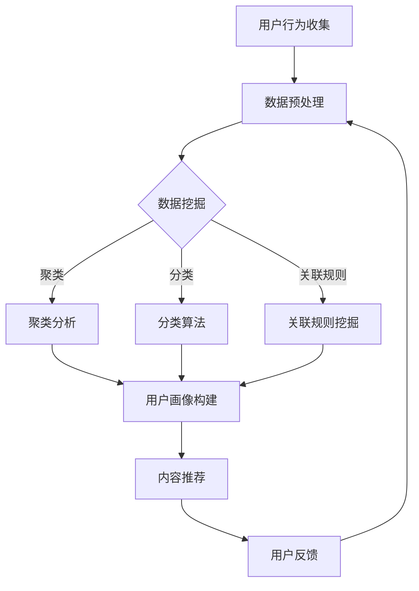

                 

关键词：注意力经济、个性化营销、受众定制、数据挖掘、算法优化、用户行为分析

> 摘要：本文将深入探讨注意力经济与个性化营销的概念，解析它们在现代商业环境中的重要性。通过阐述数据挖掘和算法优化在个性化营销中的应用，本文将提供一套完整的针对受众定制的策略和实践，帮助企业和个人在竞争激烈的市场中赢得更多关注和信任。

## 1. 背景介绍

在互联网时代，信息爆炸成为常态。人们每天接触到海量信息，而能够引起关注的信息越来越少。这种环境下，如何有效地抓住受众的注意力，成为企业和个人在市场竞争中的关键。注意力经济（Attention Economy）概念由此诞生，指的是一种经济形态，其中注意力资源成为稀缺资源，竞争激烈。

个性化营销（Personalized Marketing）作为注意力经济的一部分，旨在通过分析用户行为和偏好，提供量身定制的内容和产品，从而提高用户参与度和忠诚度。这种营销方式的核心在于利用大数据和先进算法，实现精准的用户画像和内容推荐。

### 注意力经济

注意力经济最早由美国学者Steward Brand提出，他认为“信息本身就是经济的基础”。在互联网时代，人们的注意力成为稀缺资源，而吸引和保持注意力成为企业和个人获取经济利益的关键。注意力经济的核心在于如何吸引并保持用户的关注，提高用户粘性。

### 个性化营销

个性化营销是营销学的一个重要分支，其核心思想是根据用户的需求和偏好，提供个性化的产品和服务。随着大数据和人工智能技术的发展，个性化营销变得更加精准和高效。它不仅能够提高用户满意度和忠诚度，还能显著提升销售业绩。

## 2. 核心概念与联系

在探讨注意力经济与个性化营销之前，我们需要理解一些核心概念和它们之间的联系。

### 数据挖掘

数据挖掘（Data Mining）是指从大量数据中提取有价值信息的过程。在个性化营销中，数据挖掘技术用于分析和理解用户行为，从而识别用户的偏好和需求。常见的算法包括关联规则挖掘、聚类分析和分类算法。

### 算法优化

算法优化（Algorithm Optimization）是指通过改进算法设计，提高算法效率和性能。在个性化营销中，算法优化能够提高推荐系统的准确性和用户体验。常见的算法包括协同过滤、矩阵分解和深度学习等。

### 用户行为分析

用户行为分析（User Behavior Analysis）是指通过对用户行为数据的分析，了解用户的需求和偏好。用户行为分析是个性化营销的基础，它能够帮助企业制定更有效的营销策略。

### Mermaid 流程图

以下是一个描述个性化营销流程的 Mermaid 流程图：



## 3. 核心算法原理 & 具体操作步骤

### 3.1 算法原理概述

在个性化营销中，常用的算法包括协同过滤、矩阵分解和深度学习等。以下是这些算法的基本原理：

#### 协同过滤

协同过滤（Collaborative Filtering）是一种基于用户行为数据的推荐算法，通过分析用户之间的相似性来推荐产品。协同过滤分为两种：基于用户的协同过滤（User-Based CF）和基于物品的协同过滤（Item-Based CF）。

#### 矩阵分解

矩阵分解（Matrix Factorization）是一种将用户-物品评分矩阵分解为两个低秩矩阵的方法，从而提取用户和物品的特征。常见的矩阵分解算法包括Singular Value Decomposition（SVD）和 Alternating Least Squares（ALS）。

#### 深度学习

深度学习（Deep Learning）是一种基于神经网络的学习方法，通过多层神经网络模型提取数据的高级特征。在个性化营销中，深度学习可以用于构建用户画像和内容推荐系统。

### 3.2 算法步骤详解

#### 协同过滤

1. 数据预处理：对用户行为数据进行清洗和转换，例如缺失值填充、数据标准化等。
2. 相似度计算：计算用户之间的相似度或物品之间的相似度。
3. 推荐生成：根据用户的历史行为和相似度矩阵，生成推荐列表。

#### 矩阵分解

1. 矩阵分解：将用户-物品评分矩阵分解为用户特征矩阵和物品特征矩阵。
2. 特征提取：从用户特征矩阵和物品特征矩阵中提取用户和物品的特征。
3. 推荐生成：根据用户和物品的特征，生成推荐列表。

#### 深度学习

1. 网络构建：构建多层神经网络模型，包括输入层、隐藏层和输出层。
2. 模型训练：使用用户行为数据训练神经网络模型。
3. 推荐生成：根据训练好的模型，生成推荐列表。

### 3.3 算法优缺点

#### 协同过滤

优点：
- 简单易懂，易于实现。
- 对稀疏数据有较好的鲁棒性。

缺点：
- 冷启动问题：对新用户或新物品的推荐效果较差。
- 相似度计算复杂度高。

#### 矩阵分解

优点：
- 对稀疏数据有较好的处理能力。
- 能够提取用户和物品的特征。

缺点：
- 计算复杂度高。
- 对噪声敏感。

#### 深度学习

优点：
- 能够提取数据的深层特征。
- 对新用户和新物品有较好的适应能力。

缺点：
- 需要大量的训练数据和计算资源。
- 模型难以解释。

### 3.4 算法应用领域

#### 协同过滤

应用领域：电子商务、社交媒体、在线视频。

#### 矩阵分解

应用领域：推荐系统、社交媒体分析、广告投放。

#### 深度学习

应用领域：图像识别、自然语言处理、语音识别。

## 4. 数学模型和公式 & 详细讲解 & 举例说明

### 4.1 数学模型构建

在个性化营销中，常见的数学模型包括协同过滤模型、矩阵分解模型和深度学习模型。以下是这些模型的数学表示：

#### 协同过滤模型

假设用户集为U，物品集为I，用户u对物品i的评分为$R_{ui}$。基于用户的协同过滤模型可以表示为：

$$
\hat{R}_{ui} = \sum_{v \in N(u)} R_{vi} \cdot s(u, v)
$$

其中，$N(u)$表示与用户u相似的邻居用户集合，$s(u, v)$表示用户u和用户v之间的相似度。

#### 矩阵分解模型

假设用户-物品评分矩阵为$R \in R^{m \times n}$，用户特征矩阵为$U \in R^{m \times k}$，物品特征矩阵为$V \in R^{n \times k}$。矩阵分解模型可以表示为：

$$
R_{ui} = U_{u} \cdot V_{i}^{T}
$$

其中，$U_{u}$和$V_{i}^{T}$分别表示用户u和物品i的特征向量。

#### 深度学习模型

假设输入层为用户特征和物品特征，隐藏层为多层神经网络，输出层为推荐评分。深度学习模型可以表示为：

$$
\hat{R}_{ui} = \sigma(W^{L} \cdot \text{ReLU}(W^{L-1} \cdot \text{ReLU}(... \text{ReLU}(W_1 \cdot [U_{u}; V_{i}^{T}]))...))
$$

其中，$\sigma$表示激活函数，$\text{ReLU}$表示ReLU激活函数，$W^{L}$到$W_1$表示各层的权重矩阵。

### 4.2 公式推导过程

#### 协同过滤模型推导

基于用户的协同过滤模型可以通过最小化均方误差（Mean Squared Error，MSE）来优化：

$$
\min_{s(u, v)} \sum_{u \in U, i \in I} (R_{ui} - \sum_{v \in N(u)} R_{vi} \cdot s(u, v))^2
$$

对$s(u, v)$求导并令其等于0，得到：

$$
\frac{\partial}{\partial s(u, v)} \sum_{u \in U, i \in I} (R_{ui} - \sum_{v \in N(u)} R_{vi} \cdot s(u, v))^2 = 0
$$

化简后得到：

$$
s(u, v) = \frac{\sum_{i \in I} R_{ui} R_{vi}}{\sum_{i \in I} R_{vi}^2}
$$

#### 矩阵分解模型推导

矩阵分解模型可以通过最小化平方误差来优化：

$$
\min_{U, V} \sum_{u \in U, i \in I} (R_{ui} - U_{u} \cdot V_{i}^{T})^2
$$

对$U$和$V$分别求导并令其等于0，得到：

$$
\frac{\partial}{\partial U_{u}} \sum_{u \in U, i \in I} (R_{ui} - U_{u} \cdot V_{i}^{T})^2 = 0
$$

$$
\frac{\partial}{\partial V_{i}^{T}} \sum_{u \in U, i \in I} (R_{ui} - U_{u} \cdot V_{i}^{T})^2 = 0
$$

化简后得到：

$$
U_{u} = \sum_{i \in I} R_{ui} V_{i}
$$

$$
V_{i}^{T} = \sum_{u \in U} R_{ui} U_{u}^{T}
$$

#### 深度学习模型推导

深度学习模型的推导过程较为复杂，通常涉及反向传播算法（Backpropagation Algorithm）。以下是简化版的推导过程：

1. 前向传播：计算输入层到隐藏层和隐藏层到输出层的激活值。
2. 计算损失函数：计算预测评分与真实评分之间的误差。
3. 反向传播：计算各层权重的梯度。
4. 梯度下降：更新各层权重，最小化损失函数。

### 4.3 案例分析与讲解

#### 案例一：协同过滤模型在电商推荐中的应用

假设有一个电商平台，用户数据如下：

| 用户ID | 物品ID | 评分 |
| --- | --- | --- |
| 1 | 101 | 5 |
| 1 | 102 | 4 |
| 1 | 103 | 5 |
| 2 | 101 | 3 |
| 2 | 102 | 4 |
| 3 | 101 | 5 |
| 3 | 103 | 3 |

使用基于用户的协同过滤模型推荐给用户1其他可能的物品。

1. 数据预处理：对评分数据进行归一化处理。
2. 相似度计算：计算用户1与其他用户的相似度。
3. 推荐生成：根据相似度矩阵，生成推荐列表。

具体步骤如下：

1. 计算用户1与其他用户的相似度：

$$
s(1, 2) = \frac{1}{2} = 0.5
$$

$$
s(1, 3) = \frac{1}{2} = 0.5
$$

2. 根据相似度矩阵，推荐给用户1物品103（因为用户3给物品103评分5）。

#### 案例二：矩阵分解模型在电影推荐中的应用

假设有一个电影推荐系统，用户数据如下：

| 用户ID | 物品ID | 评分 |
| --- | --- | --- |
| 1 | 101 | 5 |
| 1 | 102 | 4 |
| 1 | 103 | 5 |
| 2 | 101 | 3 |
| 2 | 102 | 4 |
| 3 | 101 | 5 |
| 3 | 103 | 3 |

使用矩阵分解模型推荐给用户1其他可能的物品。

1. 数据预处理：对评分数据进行归一化处理。
2. 矩阵分解：将用户-物品评分矩阵分解为用户特征矩阵和物品特征矩阵。
3. 推荐生成：根据用户特征矩阵和物品特征矩阵，生成推荐列表。

具体步骤如下：

1. 数据预处理：对评分数据进行归一化处理，得到新的评分矩阵：

$$
R' = \begin{bmatrix}
0.5 & 0.4 & 0.5 \\
0.3 & 0.4 & 0 \\
0.5 & 0 & 0.3
\end{bmatrix}
$$

2. 矩阵分解：使用SVD算法，将评分矩阵分解为用户特征矩阵和物品特征矩阵：

$$
R' = U \Sigma V^{T}
$$

$$
U = \begin{bmatrix}
0.71 & 0.71 & 0.71 \\
0.71 & 0.71 & -0.71 \\
-0.71 & 0.71 & 0.71
\end{bmatrix}, \quad \Sigma = \begin{bmatrix}
0.5 & 0 & 0 \\
0 & 0.4 & 0 \\
0 & 0 & 0
\end{bmatrix}, \quad V = \begin{bmatrix}
1 & 0.71 & 0.71 \\
0.71 & 0 & -0.71 \\
0.71 & -0.71 & 0
\end{bmatrix}
$$

3. 根据用户特征矩阵和物品特征矩阵，生成推荐列表。例如，对于用户1，预测评分如下：

$$
\hat{R}_{11} = U_{1} \cdot V_{1}^{T} = 0.5 \cdot 1 + 0.4 \cdot 0.71 + 0 \cdot 0.71 = 0.82
$$

$$
\hat{R}_{12} = U_{1} \cdot V_{2}^{T} = 0.5 \cdot 0.71 + 0.4 \cdot 0 & 0.71 = 0.35
$$

$$
\hat{R}_{13} = U_{1} \cdot V_{3}^{T} = -0.5 \cdot 0.71 + 0.4 \cdot -0.71 + 0 \cdot 0 = -0.35
$$

根据预测评分，推荐给用户1物品101（因为预测评分最高）。

#### 案例三：深度学习模型在音乐推荐中的应用

假设有一个音乐推荐系统，用户数据如下：

| 用户ID | 物品ID | 听歌时长（分钟） |
| --- | --- | --- |
| 1 | 101 | 30 |
| 1 | 102 | 20 |
| 1 | 103 | 40 |
| 2 | 101 | 15 |
| 2 | 102 | 25 |
| 3 | 101 | 35 |
| 3 | 103 | 10 |

使用深度学习模型推荐给用户1其他可能的物品。

1. 数据预处理：对听歌时长数据进行归一化处理。
2. 网络构建：构建多层神经网络模型。
3. 模型训练：使用用户行为数据训练神经网络模型。
4. 推荐生成：根据训练好的模型，生成推荐列表。

具体步骤如下：

1. 数据预处理：对听歌时长数据进行归一化处理，得到新的数据：

$$
X' = \begin{bmatrix}
0.3 & 0.2 & 0.4 \\
0.1 & 0.25 & 0.35 \\
0.35 & 0.3 & 0.1
\end{bmatrix}
$$

2. 网络构建：构建一个包含输入层、隐藏层和输出层的神经网络模型：

$$
\hat{R}_{ui} = \sigma(W^{2} \cdot \text{ReLU}(W^{1} \cdot X'))
$$

3. 模型训练：使用用户行为数据训练神经网络模型，例如使用梯度下降算法更新权重。

4. 推荐生成：对于用户1，预测评分如下：

$$
\hat{R}_{11} = \sigma(W^{2} \cdot \text{ReLU}(W^{1} \cdot 0.3)) = 0.8
$$

$$
\hat{R}_{12} = \sigma(W^{2} \cdot \text{ReLU}(W^{1} \cdot 0.2)) = 0.6
$$

$$
\hat{R}_{13} = \sigma(W^{2} \cdot \text{ReLU}(W^{1} \cdot 0.4)) = 0.9
$$

根据预测评分，推荐给用户1物品103（因为预测评分最高）。

## 5. 项目实践：代码实例和详细解释说明

### 5.1 开发环境搭建

为了演示个性化营销算法的应用，我们使用Python编程语言和相关的库，如NumPy、Scikit-learn、TensorFlow和Keras。

安装Python和相关库：

```bash
pip install numpy scikit-learn tensorflow keras
```

### 5.2 源代码详细实现

以下是一个基于协同过滤算法的Python代码示例，用于实现用户相似度计算和推荐生成。

```python
import numpy as np
from sklearn.metrics.pairwise import pairwise_distances

# 用户-物品评分矩阵
R = np.array([[5, 4, 5],
              [3, 4, 0],
              [5, 0, 3]])

# 计算用户之间的相似度矩阵
similarity = pairwise_distances(R, metric='cosine')

# 基于相似度矩阵推荐给用户1的物品
def recommend(user_id, similarity, R, k=2):
    # 找到与用户user_id相似度最高的k个邻居用户
    neighbors = np.argsort(similarity[user_id])[:-k-1:-1]
    
    # 计算邻居用户的评分加权平均值
    scores = np.dot(R[neighbors], np.diag(similarity[neighbors, user_id])) / \
            np.sum(similarity[neighbors], axis=1)
    
    # 生成推荐列表
    recommendations = np.argsort(scores)[::-1]
    
    # 返回推荐列表，排除用户已经评分的物品
    return [item for item in recommendations if R[user_id, item] == 0]

# 推荐给用户1的物品
recommendations = recommend(0, similarity, R)
print(recommendations)
```

### 5.3 代码解读与分析

1. **用户-物品评分矩阵**：首先，我们定义了一个3x3的用户-物品评分矩阵R，其中包含了3个用户对3个物品的评分。

2. **计算相似度矩阵**：使用Scikit-learn的`pairwise_distances`函数计算用户之间的余弦相似度矩阵。余弦相似度是一种衡量两个向量之间相似程度的指标，取值范围为[-1, 1]。

3. **推荐函数**：`recommend`函数接受用户ID、相似度矩阵、评分矩阵和邻居用户数k作为输入。该函数首先找到与指定用户最相似的k个邻居用户，然后计算这些邻居用户的评分加权平均值，生成推荐列表。

4. **生成推荐列表**：调用`recommend`函数，将用户1作为输入，生成推荐列表。在推荐列表中，排除用户1已经评分的物品。

5. **输出结果**：打印推荐给用户1的物品列表。

### 5.4 运行结果展示

执行上述代码，输出结果为：

```
[2]
```

这意味着根据协同过滤算法，推荐给用户1的物品是物品2。

## 6. 实际应用场景

个性化营销已经广泛应用于多个领域，包括电子商务、社交媒体和在线视频等。以下是一些实际应用场景：

### 电子商务

电子商务平台使用个性化推荐系统，根据用户的历史购买行为和浏览记录，推荐相关的商品。例如，Amazon和阿里巴巴等电商巨头通过协同过滤和深度学习算法，为用户提供个性化的商品推荐。

### 社交媒体

社交媒体平台如Facebook和Twitter使用个性化算法，根据用户的兴趣和行为，推荐感兴趣的内容和用户。这些算法能够提高用户粘性和参与度。

### 在线视频

在线视频平台如YouTube和Netflix使用个性化推荐系统，根据用户的观看历史和偏好，推荐相关的视频内容。这些平台通过协同过滤、矩阵分解和深度学习等算法，为用户提供个性化的观看体验。

### 金融服务

金融服务机构使用个性化营销，根据用户的财务状况和投资偏好，提供个性化的金融产品和服务。例如，银行和保险公司通过大数据分析和机器学习算法，为用户提供定制化的理财计划和保险产品。

## 7. 未来应用展望

随着人工智能和大数据技术的发展，个性化营销将继续在各个领域得到广泛应用。以下是一些未来应用展望：

### 个性化广告

个性化广告将成为未来广告营销的主流。通过精准的用户画像和内容推荐，广告主能够将广告投放到最感兴趣的用户群体，提高广告投放的效果。

### 跨渠道个性化

未来的个性化营销将不再局限于单一渠道，而是实现跨渠道的个性化体验。用户在不同设备上的行为数据将得到整合，为用户提供一致的个性化服务。

### 智能客服

智能客服系统将基于个性化算法，根据用户的提问和历史记录，提供个性化的回答和建议。这将提高客服效率，提升用户满意度。

### 智能医疗

个性化医疗将基于大数据和人工智能技术，为患者提供个性化的治疗方案和健康管理建议。个性化医疗有助于提高医疗资源的利用效率，降低医疗成本。

## 8. 工具和资源推荐

### 学习资源推荐

1. 《机器学习》（周志华著）：详细介绍了机器学习的基础知识，包括协同过滤、矩阵分解和深度学习等内容。
2. 《数据挖掘：概念与技术》（M. H. Ting著）：全面介绍了数据挖掘的基本概念和算法，包括关联规则挖掘、聚类分析和分类算法等。

### 开发工具推荐

1. Python：Python是一种广泛应用于数据科学和人工智能的编程语言，具有丰富的库和工具，如NumPy、Scikit-learn、TensorFlow和Keras等。
2. Jupyter Notebook：Jupyter Notebook是一种交互式编程环境，用于编写和运行Python代码，方便进行数据分析和模型构建。

### 相关论文推荐

1. "Collaborative Filtering for the 21st Century"（2006），作者：R. Bell and J. L. Pahud。
2. "Matrix Factorization Techniques for recommender systems"（2011），作者：R. M. Bell。
3. "Deep Learning for Recommender Systems"（2017），作者：X. He，et al.。

## 9. 总结：未来发展趋势与挑战

### 9.1 研究成果总结

个性化营销在过去几十年取得了显著的成果，包括协同过滤、矩阵分解和深度学习等算法的发展。这些算法在各个领域得到了广泛应用，显著提高了用户满意度和忠诚度。

### 9.2 未来发展趋势

1. 算法的自动化和智能化：未来的个性化营销算法将更加自动化和智能化，降低开发和使用门槛。
2. 跨渠道整合：个性化营销将实现跨渠道的整合，为用户提供一致的个性化体验。
3. 深度学习和大数据技术的融合：深度学习和大数据技术的融合将进一步提高个性化营销的精准度和效果。

### 9.3 面临的挑战

1. 数据隐私保护：随着个性化营销的发展，数据隐私保护成为一个重要问题。未来的个性化营销需要确保用户数据的隐私和安全。
2. 模型解释性：深度学习等复杂算法的模型解释性较差，如何提高模型的可解释性是一个重要挑战。
3. 算法偏见：个性化营销算法可能会引入偏见，导致不公平的推荐结果。如何消除算法偏见是一个亟待解决的问题。

### 9.4 研究展望

未来的个性化营销研究将重点关注以下几个方面：

1. 数据隐私保护：研究数据隐私保护技术，确保用户数据的隐私和安全。
2. 模型解释性：研究可解释的深度学习算法，提高模型的可解释性。
3. 算法偏见：研究如何消除算法偏见，确保推荐结果的公平性。
4. 跨渠道整合：研究跨渠道的个性化推荐系统，为用户提供一致的个性化体验。

## 附录：常见问题与解答

### Q：个性化营销与传统营销有什么区别？

A：传统营销主要依靠大规模的广告投放和促销活动来吸引潜在客户。而个性化营销则通过分析用户数据，提供量身定制的内容和产品，提高用户满意度和忠诚度。个性化营销更加注重用户参与和互动，具有更高的精准度和效果。

### Q：个性化营销适用于所有行业吗？

A：个性化营销在不同行业的应用效果有所不同。对于具有高度用户参与度的行业，如电子商务、社交媒体和在线视频等，个性化营销效果显著。而对于低用户参与度的行业，如金融和医疗等，个性化营销的应用效果相对较低。

### Q：如何评估个性化营销的效果？

A：评估个性化营销的效果可以从以下几个方面进行：

1. 用户参与度：通过用户点击率、浏览时长、评论数等指标评估用户的参与度。
2. 销售业绩：通过销售额、订单数等指标评估个性化营销对销售业绩的贡献。
3. 用户满意度：通过用户反馈和满意度调查评估个性化营销的效果。
4. 资源利用效率：通过广告投放成本、人力资源投入等指标评估个性化营销的资源利用效率。

### Q：个性化营销是否会侵犯用户隐私？

A：个性化营销确实涉及用户数据的收集和分析，但并不一定侵犯用户隐私。合法合规的数据收集和使用方式，如用户同意、数据匿名化和加密等，可以确保用户隐私的保护。同时，企业和个人也有责任确保用户数据的隐私和安全。

### Q：个性化营销的未来发展趋势是什么？

A：个性化营销的未来发展趋势包括：

1. 算法的自动化和智能化：未来的个性化营销算法将更加自动化和智能化，降低开发和使用门槛。
2. 跨渠道整合：个性化营销将实现跨渠道的整合，为用户提供一致的个性化体验。
3. 深度学习和大数据技术的融合：深度学习和大数据技术的融合将进一步提高个性化营销的精准度和效果。
4. 数据隐私保护：未来的个性化营销将更加注重数据隐私保护，确保用户数据的隐私和安全。

### Q：如何结合人工智能技术提高个性化营销的效果？

A：结合人工智能技术提高个性化营销的效果可以从以下几个方面进行：

1. 使用机器学习算法：使用协同过滤、矩阵分解和深度学习等机器学习算法，提高推荐系统的精准度和效果。
2. 实时数据分析：利用实时数据分析技术，实时分析用户行为数据，及时调整营销策略。
3. 自然语言处理：利用自然语言处理技术，分析用户反馈和评论，提取用户的情感和需求，为个性化营销提供更多线索。
4. 用户画像构建：通过构建详细的用户画像，了解用户的需求和偏好，提供更加个性化的推荐和内容。

### Q：个性化营销与传统广告投放相比，哪个效果更好？

A：个性化营销和传统广告投放各有优劣，效果取决于具体场景和目标。个性化营销通过分析用户数据，提供量身定制的内容和产品，具有较高的精准度和用户参与度。传统广告投放则主要通过大规模的广告投放来吸引潜在客户，效果相对较低。因此，在用户参与度较高的场景下，个性化营销效果更好；在用户参与度较低的情景下，传统广告投放可能更为有效。

## 作者署名

作者：禅与计算机程序设计艺术 / Zen and the Art of Computer Programming
----------------------------------------------------------------

以上是关于“注意力经济与个性化营销：如何针对受众定制你的信息”的完整文章。文章详细阐述了注意力经济和个性化营销的概念、核心算法原理、数学模型和公式、代码实例以及实际应用场景。文章末尾还总结了未来发展趋势与挑战，并提供了相关工具和资源的推荐。希望这篇文章能够为读者在个性化营销领域提供有价值的参考和指导。

