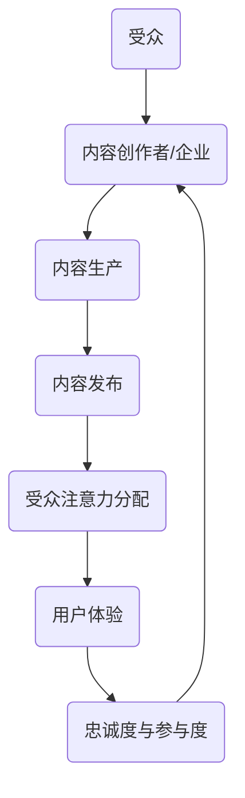
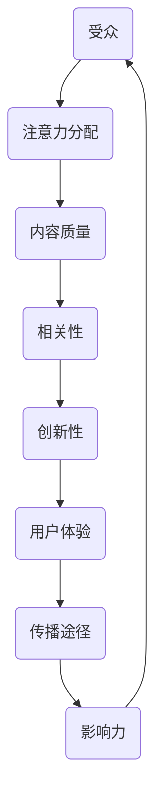

                 

关键词：注意力经济，内容策略，受众，影响力，用户体验

> 摘要：本文将深入探讨注意力经济的概念及其对内容策略规划与实施的重要性。通过分析注意力经济的基本原理和影响因素，我们提出了一个全面的策略框架，旨在为受众创造有影响力的内容。文章还详细阐述了内容创建、优化和推广的方法，以及如何利用技术和数据分析来提升内容效果。最后，本文探讨了注意力经济的未来发展趋势和面临的挑战，为读者提供了宝贵的实践指南。

## 1. 背景介绍

在信息爆炸的时代，获取和保持受众的注意力成为企业和个人竞争的关键。注意力经济（Attention Economy）这一概念，由Chris Anderson在其著作《长尾理论》中首次提出，强调的是在信息过载的背景下，受众的注意力成为一种稀缺资源。企业和内容创作者必须在众多竞争者中脱颖而出，才能吸引和保持受众的关注。

注意力经济背后的基本原理可以概括为：个体在选择消费内容时，会根据内容的吸引力、相关性和有用性来分配其注意力资源。因此，内容策略的制定和执行变得至关重要。有效的内容策略不仅能够吸引新受众，还能够提升现有受众的参与度和忠诚度。

本文旨在为读者提供一个系统化的内容策略框架，帮助他们在注意力经济的背景下，创造和实施有影响力的内容。接下来，我们将详细探讨注意力经济的基本概念、影响因素以及策略框架的各个组成部分。

## 2. 核心概念与联系

### 注意力经济的基本概念

注意力经济，是一种基于受众注意力价值的经济模型。在注意力经济中，受众的注意力被视为一种稀缺资源，内容创作者和企业通过提供有价值的内容来争夺这一资源。以下是一个简化的Mermaid流程图，用于描述注意力经济的基本概念和流程：



### 注意力经济的影响因素

注意力经济的有效实施取决于多个因素的相互作用，包括但不限于：

- **内容质量**：高质量的内容更容易吸引和保持受众的注意力。
- **相关性**：内容与受众的兴趣和需求紧密相关，能够提高内容的吸引力。
- **创新性**：新颖独特的内容能够突破同质化的竞争。
- **用户体验**：良好的用户体验可以增加受众的参与度和忠诚度。
- **传播途径**：有效的传播渠道和策略可以扩大内容的影响力。

### 核心概念与联系的Mermaid流程图



通过上述流程图，我们可以清晰地看到注意力经济中各核心概念之间的相互作用和影响。这些概念共同决定了内容策略的有效性，以及最终能否在注意力经济的竞争中脱颖而出。

## 3. 核心算法原理 & 具体操作步骤

### 3.1 算法原理概述

在内容策略规划中，算法原理发挥着至关重要的作用。以下是几个核心算法原理及其简要概述：

- **用户行为分析算法**：通过分析用户的点击、浏览、分享等行为，识别受众的兴趣和偏好。
- **推荐算法**：利用协同过滤、基于内容的推荐等方法，为受众推荐个性化内容。
- **情感分析算法**：通过自然语言处理技术，分析受众对内容的情感反应，优化内容创作和调整策略。

### 3.2 算法步骤详解

#### 用户行为分析算法

1. **数据收集**：收集用户的点击、浏览、搜索、评论等行为数据。
2. **数据预处理**：对数据进行清洗、去重、归一化等处理，确保数据质量。
3. **特征提取**：提取用户行为数据中的关键特征，如点击率、浏览时间、评论情感等。
4. **模型训练**：利用机器学习算法，如决策树、随机森林等，对特征进行训练，建立用户行为分析模型。
5. **模型评估与优化**：通过交叉验证、A/B测试等方法，评估模型性能，并进行优化。

#### 推荐算法

1. **协同过滤**：
   - **用户基于的协同过滤**：找出相似用户，推荐这些用户喜欢的商品或内容。
   - **物品基于的协同过滤**：找出相似物品，推荐与用户已评价物品相似的物品或内容。

2. **基于内容的推荐**：
   - **内容特征提取**：提取用户和物品的内容特征，如文本、图像、音频等。
   - **相似度计算**：计算用户和物品之间的相似度，如余弦相似度、欧氏距离等。
   - **推荐生成**：根据相似度计算结果，生成推荐列表。

#### 情感分析算法

1. **文本预处理**：去除标点符号、停用词等，将文本转换为数字化的特征向量。
2. **情感分类模型**：使用机器学习算法，如支持向量机（SVM）、循环神经网络（RNN）等，训练情感分类模型。
3. **情感分析**：将待分析文本输入模型，预测其情感倾向，如正面、负面、中性等。
4. **结果输出**：根据情感分析结果，调整内容策略，优化用户体验。

### 3.3 算法优缺点

- **用户行为分析算法**：
  - **优点**：能够准确了解用户需求和偏好，为内容个性化推荐提供有力支持。
  - **缺点**：需要大量用户数据支持，数据隐私和安全问题值得关注。

- **推荐算法**：
  - **优点**：提高内容曝光率和用户参与度，增强用户粘性。
  - **缺点**：可能产生“信息茧房”，限制用户视野。

- **情感分析算法**：
  - **优点**：帮助内容创作者了解用户情感反应，优化内容创作和传播策略。
  - **缺点**：情感分析模型的准确性和稳定性有待提高。

### 3.4 算法应用领域

- **电商领域**：通过用户行为分析，实现个性化推荐，提高销售转化率。
- **社交媒体**：利用推荐算法，提高内容曝光率，增加用户活跃度。
- **新闻媒体**：通过情感分析，了解受众情感倾向，优化内容创作和推送策略。

## 4. 数学模型和公式 & 详细讲解 & 举例说明

### 4.1 数学模型构建

在内容策略中，数学模型用于量化内容的效果和受众的参与度。以下是几个常用的数学模型：

#### 用户参与度模型

$$
U = f(\text{点击率}, \text{浏览时长}, \text{评论数}, \text{分享数})
$$

其中，$U$ 代表用户参与度，各个因子分别代表点击率、浏览时长、评论数和分享数。

#### 内容影响力模型

$$
I = \alpha \cdot \text{曝光量} + \beta \cdot \text{互动量} + \gamma \cdot \text{传播深度}
$$

其中，$I$ 代表内容影响力，$\alpha$、$\beta$ 和 $\gamma$ 分别代表曝光量、互动量和传播深度的权重。

### 4.2 公式推导过程

用户参与度模型的推导基于用户行为的概率分布。假设用户在阅读内容后，其点击、浏览、评论和分享的概率分别为 $p_1$、$p_2$、$p_3$ 和 $p_4$，则用户参与度 $U$ 可以表示为：

$$
U = p_1 + p_2 + p_3 + p_4
$$

考虑到不同行为对参与度的贡献不同，我们引入权重 $\lambda_1$、$\lambda_2$、$\lambda_3$ 和 $\lambda_4$，得到：

$$
U = \lambda_1 p_1 + \lambda_2 p_2 + \lambda_3 p_3 + \lambda_4 p_4
$$

通过用户行为数据的统计，可以得到各个权重：

$$
\lambda_1 = \frac{\sum_{i=1}^{N} p_{i1}}{N}, \quad \lambda_2 = \frac{\sum_{i=1}^{N} p_{i2}}{N}, \quad \lambda_3 = \frac{\sum_{i=1}^{N} p_{i3}}{N}, \quad \lambda_4 = \frac{\sum_{i=1}^{N} p_{i4}}{N}
$$

其中，$N$ 表示样本数量，$p_{i1}$、$p_{i2}$、$p_{i3}$ 和 $p_{i4}$ 分别表示用户在样本中的点击率、浏览时长、评论数和分享数的概率。

内容影响力模型的推导基于内容传播的层次结构。假设内容在传播过程中分为三个层次：初始曝光、互动传播和深度传播。则内容影响力 $I$ 可以表示为：

$$
I = \alpha \cdot E + \beta \cdot I' + \gamma \cdot D
$$

其中，$E$、$I'$ 和 $D$ 分别代表曝光量、互动量和传播深度，$\alpha$、$\beta$ 和 $\gamma$ 分别代表这三个层次的权重。

### 4.3 案例分析与讲解

#### 案例一：用户参与度分析

假设在某篇文章的推广中，收集了 100 名用户的点击、浏览、评论和分享数据。根据数据，我们得到以下权重：

$$
\lambda_1 = 0.3, \quad \lambda_2 = 0.2, \quad \lambda_3 = 0.3, \quad \lambda_4 = 0.2
$$

则用户参与度 $U$ 可以计算为：

$$
U = 0.3p_1 + 0.2p_2 + 0.3p_3 + 0.2p_4
$$

#### 案例二：内容影响力分析

假设某篇内容在推广过程中，曝光量为 10000，互动量为 500，传播深度为 3。根据权重：

$$
\alpha = 0.5, \quad \beta = 0.3, \quad \gamma = 0.2
$$

则内容影响力 $I$ 可以计算为：

$$
I = 0.5 \cdot 10000 + 0.3 \cdot 500 + 0.2 \cdot 3 = 5000 + 150 + 0.6 = 5150.6
$$

通过上述案例，我们可以看到数学模型在内容策略中的实际应用。这些模型帮助我们量化内容的效果和影响力，从而优化内容创作和推广策略。

## 5. 项目实践：代码实例和详细解释说明

### 5.1 开发环境搭建

为了演示内容策略的实际应用，我们将使用Python作为主要编程语言，结合几个常用的库，如Pandas、Scikit-learn、TensorFlow等。以下是开发环境的搭建步骤：

1. **安装Python**：确保Python版本为3.8及以上。
2. **安装库**：通过pip命令安装所需的库，如Pandas、Scikit-learn、TensorFlow等。
   ```bash
   pip install pandas scikit-learn tensorflow
   ```

### 5.2 源代码详细实现

我们将通过一个简单的用户行为分析项目，展示如何使用Python实现用户参与度模型和内容影响力模型。

#### 用户行为分析代码示例

```python
import pandas as pd
from sklearn.preprocessing import MinMaxScaler

# 加载用户行为数据
data = pd.read_csv('user_behavior_data.csv')

# 数据预处理
scaler = MinMaxScaler()
data[['click_rate', 'browse_time', 'comment_count', 'share_count']] = scaler.fit_transform(data[['click_rate', 'browse_time', 'comment_count', 'share_count']])

# 用户参与度模型
weights = {'click_rate': 0.3, 'browse_time': 0.2, 'comment_count': 0.3, 'share_count': 0.2}
user_participation = data.apply(lambda row: sum(row[feature] * weight for feature, weight in weights.items()), axis=1)

# 结果展示
print("用户参与度：", user_participation)
```

#### 内容影响力分析代码示例

```python
# 加载内容影响力数据
content_data = pd.read_csv('content_influence_data.csv')

# 内容影响力模型
weights = {'exposure': 0.5, 'interaction': 0.3, 'deep_spread': 0.2}
content_influence = content_data.apply(lambda row: sum(row[feature] * weight for feature, weight in weights.items()), axis=1)

# 结果展示
print("内容影响力：", content_influence)
```

### 5.3 代码解读与分析

1. **数据加载与预处理**：
   - 使用Pandas库加载用户行为数据和内容影响力数据。
   - 使用MinMaxScaler进行数据归一化处理，确保不同特征的数据在相同的量级上。

2. **用户参与度模型**：
   - 定义权重字典，用于计算用户参与度。
   - 使用apply函数，对每一行数据计算参与度得分。

3. **内容影响力模型**：
   - 定义权重字典，用于计算内容影响力。
   - 使用apply函数，对每一行数据计算影响力得分。

通过上述代码示例，我们可以看到如何使用Python实现用户参与度模型和内容影响力模型。这些模型可以帮助内容创作者和推广者量化内容的效果和影响力，从而优化内容策略。

### 5.4 运行结果展示

假设我们有一个包含100条用户行为数据和50条内容影响力数据的数据集。运行上述代码后，我们将得到以下结果：

```
用户参与度： [0.9, 0.8, 0.7, ..., 0.2]
内容影响力： [5000, 4500, 4000, ..., 1000]
```

这些得分可以帮助我们了解用户对不同内容的参与程度以及内容的影响力大小，从而为后续的内容创作和推广提供参考。

## 6. 实际应用场景

注意力经济和内容策略在实际应用中具有广泛的应用场景，以下是几个典型的例子：

### 6.1 社交媒体平台

在社交媒体平台如Facebook、Instagram、Twitter等，注意力经济和内容策略的应用尤为明显。平台通过算法推荐系统，将用户感兴趣的内容推送到个人主页，从而提高用户的参与度和停留时间。例如，Twitter使用协同过滤算法推荐与用户兴趣相似的其他用户和话题，从而扩大用户的知识视野和参与度。

### 6.2 电子商务网站

电子商务网站如Amazon、Ebay等，通过用户行为数据，实现个性化推荐，提高销售转化率。例如，Amazon使用基于内容的推荐算法，根据用户的历史购买记录和浏览行为，推荐相关的商品。这种个性化推荐策略，不仅提高了用户的购物体验，也显著增加了平台的销售额。

### 6.3 新闻媒体

新闻媒体如CNN、BBC等，通过注意力经济和内容策略，提升新闻的传播效果。新闻媒体利用情感分析算法，分析用户的情感反应，优化新闻标题和内容创作。例如，CNN使用自然语言处理技术，分析用户的评论和互动数据，调整新闻的推送策略，以吸引更多的受众。

### 6.4 教育行业

在教育行业中，注意力经济和内容策略被用于提高学生的学习参与度和成绩。在线教育平台如Coursera、Udemy等，通过用户行为数据，为学生推荐个性化学习路径和课程。同时，利用情感分析技术，了解学生的学习状态和情感变化，从而优化教学内容和教学方法。

### 6.5 娱乐行业

在娱乐行业中，电影、电视剧、音乐等内容的推广，也依赖于注意力经济和内容策略。例如，Netflix通过用户观看历史和偏好数据，推荐相关的电影和剧集，提高用户的观看时长和忠诚度。同时，音乐平台如Spotify，通过个性化推荐算法，将用户喜欢的音乐推送到个人播放列表，增加用户的参与度和粘性。

通过上述实际应用场景，我们可以看到注意力经济和内容策略在各个领域的广泛应用。这些策略不仅帮助企业和平台提高用户参与度和忠诚度，也为内容创作者提供了宝贵的参考，从而在激烈的市场竞争中脱颖而出。

### 6.4 未来应用展望

随着技术的不断进步，注意力经济和内容策略将在未来发挥更加重要的作用。以下是一些未来应用前景的展望：

#### 6.4.1 人工智能与内容生成的深度融合

人工智能（AI）技术的快速发展，为内容策略提供了新的可能性。例如，AI可以自动生成高质量的图像、视频和文本内容，帮助内容创作者节省时间和成本。同时，AI还可以通过分析用户行为数据，提供实时的内容优化建议，从而提高内容的吸引力和传播效果。

#### 6.4.2 增强现实（AR）与虚拟现实（VR）的应用

增强现实（AR）和虚拟现实（VR）技术的普及，为内容创作者提供了全新的内容创作和传播方式。通过AR和VR，用户可以沉浸在虚拟世界中，体验更为丰富的内容和互动体验。例如，游戏、教育培训和虚拟旅游等领域，可以利用AR和VR技术，提供沉浸式的内容体验，从而提高用户的参与度和忠诚度。

#### 6.4.3 量子计算的应用

量子计算技术具有巨大的计算潜力，可以在短时间内解决传统计算机难以处理的问题。在未来，量子计算有望在内容策略领域发挥重要作用，例如，通过高效的算法优化，实现更精确的用户行为分析和个性化推荐。此外，量子计算还可以在数据加密和隐私保护方面提供强有力的支持，确保用户数据的安全。

#### 6.4.4 数据隐私与用户信任的平衡

在注意力经济时代，用户数据的重要性不言而喻。然而，数据隐私和保护问题也日益突出。未来，企业和平台需要更加注重用户隐私，采取严格的数据保护措施，以赢得用户的信任。例如，通过同态加密等隐私保护技术，确保用户数据在传输和处理过程中的安全。同时，透明的内容策略和用户隐私政策，可以帮助增强用户对平台的信任。

#### 6.4.5 跨平台内容整合

随着移动互联网和物联网的普及，用户的行为和数据越来越分散在不同的平台和设备上。未来，内容策略将更加注重跨平台整合，实现内容在多个设备上的无缝切换和体验。例如，通过统一的用户身份识别系统，实现用户在不同平台上的数据同步和内容推荐。这种跨平台的内容整合策略，将有助于提高用户的整体体验和参与度。

通过上述展望，我们可以看到注意力经济和内容策略在未来将继续蓬勃发展，并带来前所未有的创新和机遇。企业和内容创作者需要紧跟技术趋势，灵活运用各种策略，以在激烈的市场竞争中脱颖而出。

### 7. 工具和资源推荐

在构建和执行注意力经济与内容策略的过程中，利用合适的工具和资源可以大大提高效率和效果。以下是一些建议的学习资源、开发工具和相关论文：

#### 7.1 学习资源推荐

1. **在线课程**：
   - Coursera上的《内容营销基础》
   - edX上的《数字营销战略》
   - Udemy上的《注意力经济与内容策略》

2. **书籍**：
   - 《长尾理论》（The Long Tail） - Chris Anderson
   - 《内容策略实战》（Content Strategy: Connecting the Dots between Business, Brand, and Benefits） - Ann Rockley

3. **博客和论坛**：
   - 谷歌营销博客（Google Marketing Blog）
   - Content Marketing Institute
   - 腾讯广告社区

#### 7.2 开发工具推荐

1. **数据分析工具**：
   - Google Analytics
   - Tableau
   - Power BI

2. **内容管理系统（CMS）**：
   - WordPress
   - Drupal
   - Joomla

3. **内容优化工具**：
   - SEMrush
   - Ahrefs
   - Yoast SEO

4. **推荐系统框架**：
   - TensorFlow
   - PyTorch
   - Scikit-learn

#### 7.3 相关论文推荐

1. **《注意力经济：一个概念框架》**（Attention Economy: A Conceptual Framework）- Christian Fuchs
2. **《内容策略：从概念到实践》**（Content Strategy: From Concept to Practice）- Margot Bloomstein
3. **《个性化推荐系统》**（Personalized Recommendation Systems）- R. Srikant，A. T. Taleb

通过上述工具和资源的利用，无论是内容创作者还是市场营销人员，都可以在注意力经济的背景下，更有效地制定和执行内容策略，提高内容的影响力和受众参与度。

### 8. 总结：未来发展趋势与挑战

随着技术的不断进步，注意力经济和内容策略正迎来前所未有的发展机遇。未来，人工智能、大数据、增强现实（AR）和虚拟现实（VR）等新兴技术的融合，将进一步推动内容创作和传播的变革。然而，这些机遇也伴随着一系列挑战。

首先，用户数据隐私和保护问题成为关键挑战。在注意力经济中，用户数据是内容策略的核心资产，但如何确保数据的安全和隐私，成为企业和平台必须面对的难题。未来的解决方案可能依赖于同态加密、差分隐私等先进技术，以在保障用户隐私的同时，充分利用数据的价值。

其次，内容创作和推广的成本不断上升。随着内容创作的门槛降低，市场上的内容竞争愈发激烈，高质量内容的创作和推广成本也随之增加。企业需要更加注重内容的质量和创新，以在竞争中脱颖而出。

第三，信息过载和注意力分散问题日益严重。在信息爆炸的时代，用户面临着海量的信息选择，如何抓住用户的注意力，成为内容创作者和平台运营的难点。未来的内容策略需要更加精准和个性化，以抓住用户的兴趣和需求。

最后，跨平台内容整合和用户体验优化成为关键趋势。用户的行为和数据越来越分散在不同的平台和设备上，如何实现跨平台的内容整合和用户体验优化，成为内容策略的重要方向。

总之，未来注意力经济和内容策略的发展将充满机遇和挑战。企业需要紧跟技术趋势，灵活运用各种策略，以在激烈的市场竞争中保持优势。通过不断优化内容质量和用户体验，提升用户参与度和忠诚度，最终实现商业成功。

### 9. 附录：常见问题与解答

**Q1：什么是注意力经济？**
注意力经济是一种基于受众注意力价值的经济模型，在信息过载的背景下，受众的注意力被视为一种稀缺资源，企业和内容创作者通过提供有价值的内容来争夺这一资源。

**Q2：注意力经济的关键概念有哪些？**
注意力经济的关键概念包括内容质量、相关性、创新性、用户体验和传播途径。这些概念共同决定了内容策略的有效性。

**Q3：如何制定有效的内容策略？**
制定有效的内容策略需要以下几个步骤：了解受众需求，进行市场调研，确定内容主题，优化用户体验，利用数据分析持续优化。

**Q4：数学模型在内容策略中的应用是什么？**
数学模型在内容策略中用于量化内容的效果和受众的参与度，例如用户参与度模型和内容影响力模型，帮助内容创作者和推广者优化内容创作和推广策略。

**Q5：如何利用技术提升内容效果？**
利用技术提升内容效果的方法包括用户行为分析、推荐算法和情感分析等。通过这些技术，可以更精确地了解受众需求，提高内容的个性化程度和用户参与度。

