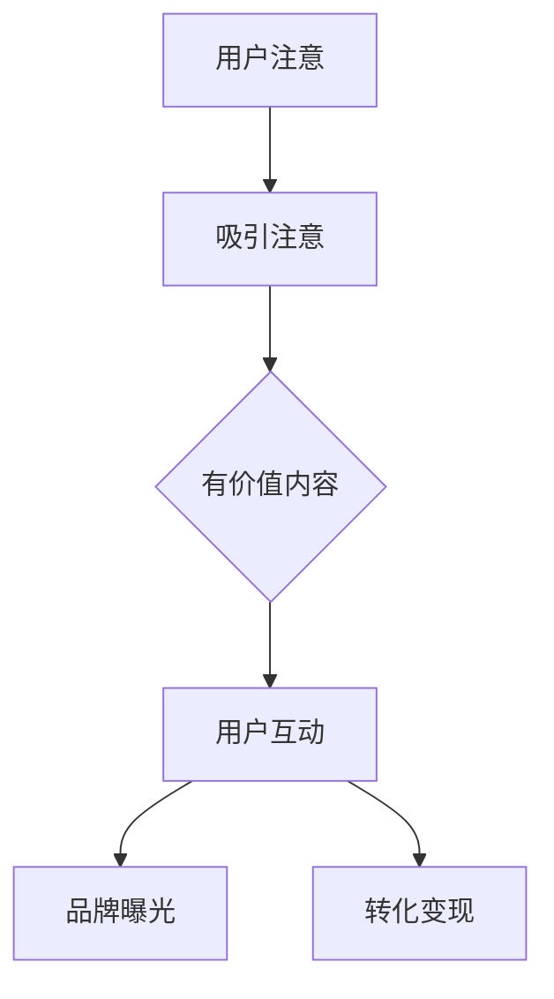

                 

关键词：注意力经济、在线广告、用户体验、目标与策略、数据驱动、个性化、算法优化

摘要：本文旨在探讨注意力经济在在线广告中的应用，以及如何在不牺牲用户体验的情况下，通过有效的目标设定和策略实施，吸引并留住受众。文章首先介绍了注意力经济的概念和原理，随后分析了在线广告的目标和策略，最后提出了实现这些目标的具体方法和挑战。

## 1. 背景介绍

随着互联网的普及和移动互联网的迅猛发展，注意力经济逐渐成为一种重要的经济模式。在注意力经济中，用户的时间和注意力成为了新的资源，企业通过争夺用户的注意力来实现商业价值。在线广告作为注意力经济的一种表现形式，已经成为许多企业获取用户注意力和实现盈利的重要手段。

然而，随着用户对广告的抵触情绪日益加剧，如何在不牺牲用户体验的情况下，有效地吸引受众，成为在线广告行业面临的一大挑战。本文将围绕这一主题，深入探讨注意力经济与在线广告的目标和策略。

### 1.1 注意力经济的概念

注意力经济，是指基于用户时间和注意力的经济模式。在这种模式中，用户的时间和注意力被视为一种稀缺资源，企业通过吸引和留住用户的注意力，来实现商业目标。

### 1.2 在线广告的定义与现状

在线广告是指利用互联网平台，通过展示、推广产品或服务，吸引用户点击、浏览或互动的广告形式。随着互联网的普及，在线广告已经成为广告市场的重要组成部分。

### 1.3 注意力经济与在线广告的关系

注意力经济为在线广告提供了理论基础，指导企业如何更好地利用用户的时间和注意力。在线广告则是在注意力经济框架下，实现商业目标的具体手段。

## 2. 核心概念与联系

### 2.1 注意力经济原理

注意力经济基于以下几个核心原理：

1. **注意力稀缺性**：用户的时间和注意力是有限的，因此企业需要通过有效的方式吸引和留住用户的注意力。
2. **注意力转移性**：用户可以在不同的平台和内容之间转移注意力，企业需要提供有价值的内容，以保持用户的关注。
3. **注意力价值**：用户的注意力具有价值，企业通过吸引和转化用户注意力，可以实现商业盈利。

### 2.2 在线广告的目标

在线广告的主要目标包括：

1. **品牌曝光**：提升品牌知名度和认知度。
2. **用户互动**：吸引用户点击、评论、分享等互动行为。
3. **转化变现**：将用户转化为客户，实现商业转化。

### 2.3 注意力经济与在线广告的联系

注意力经济与在线广告之间的联系体现在以下几个方面：

1. **目标一致性**：注意力经济强调用户注意力的价值，与在线广告的目标高度一致。
2. **策略共享**：在线广告的策略可以借鉴注意力经济的原理，如提供有价值的内容、优化用户体验等。
3. **效果评估**：在线广告的效果评估可以通过注意力经济的指标，如用户点击率、停留时间、互动率等来进行。

### 2.4 Mermaid 流程图

下面是一个简化的注意力经济与在线广告流程图：



## 3. 核心算法原理 & 具体操作步骤

### 3.1 算法原理概述

在线广告的核心算法主要涉及以下几个方面：

1. **用户行为分析**：通过用户的历史行为数据，分析用户兴趣和偏好。
2. **广告投放优化**：根据用户行为分析结果，优化广告投放策略，提升广告效果。
3. **个性化推荐**：基于用户兴趣和偏好，提供个性化的广告内容。

### 3.2 算法步骤详解

1. **数据采集**：收集用户浏览、点击、购买等行为数据。
2. **特征提取**：将原始数据转化为可分析的特征，如用户兴趣标签、行为序列等。
3. **用户建模**：构建用户行为模型，预测用户兴趣和偏好。
4. **广告策略制定**：根据用户建模结果，制定广告投放策略。
5. **效果评估**：评估广告投放效果，调整广告策略。

### 3.3 算法优缺点

**优点**：

- 提高广告投放效果，实现精准营销。
- 增强用户体验，减少无效广告干扰。

**缺点**：

- 需要大量数据支持，数据质量和数量直接影响算法效果。
- 可能导致用户隐私泄露，需注意数据安全和合规问题。

### 3.4 算法应用领域

- 社交媒体广告
- 搜索引擎广告
- 垂直行业广告

## 4. 数学模型和公式 & 详细讲解 & 举例说明

### 4.1 数学模型构建

在线广告的核心数学模型主要包括以下几个方面：

1. **用户行为模型**：采用马尔可夫链模型，预测用户行为序列。
2. **广告效果模型**：基于贝叶斯优化模型，评估广告投放效果。
3. **个性化推荐模型**：采用协同过滤算法，为用户推荐个性化广告。

### 4.2 公式推导过程

以马尔可夫链模型为例，其转移概率矩阵为：

$$
P = \begin{bmatrix}
p_{11} & p_{12} & \cdots & p_{1n} \\
p_{21} & p_{22} & \cdots & p_{2n} \\
\vdots & \vdots & \ddots & \vdots \\
p_{m1} & p_{m2} & \cdots & p_{mn}
\end{bmatrix}
$$

其中，$p_{ij}$ 表示从状态 $i$ 转移到状态 $j$ 的概率。

### 4.3 案例分析与讲解

假设一个广告平台有以下用户行为数据：

- 用户浏览页面A，然后点击广告B。
- 用户浏览页面B，然后没有点击广告。

我们可以使用马尔可夫链模型预测用户下一行为。

1. **构建转移概率矩阵**：

$$
P = \begin{bmatrix}
0.8 & 0.2 \\
0.3 & 0.7
\end{bmatrix}
$$

2. **计算用户下一行为的概率**：

用户当前处于状态2（未点击广告），则下一状态为：

$$
P(X_2 = 1) = p_{21} = 0.3
$$

$$
P(X_2 = 2) = p_{22} = 0.7
$$

3. **结论**：

用户在下一时刻点击广告B的概率为30%，未点击的概率为70%。

## 5. 项目实践：代码实例和详细解释说明

### 5.1 开发环境搭建

- Python 3.8
- Pandas
- Scikit-learn
- Matplotlib

### 5.2 源代码详细实现

以下是一个简单的用户行为分析示例代码：

```python
import pandas as pd
from sklearn.preprocessing import LabelEncoder
from sklearn.model_selection import train_test_split
from sklearn.metrics import accuracy_score

# 读取数据
data = pd.read_csv('user_behavior_data.csv')

# 特征提取
label_encoder = LabelEncoder()
data['page'] = label_encoder.fit_transform(data['page'])
data['action'] = label_encoder.fit_transform(data['action'])

# 数据预处理
X = data[['page']]
y = data['action']

# 分割数据集
X_train, X_test, y_train, y_test = train_test_split(X, y, test_size=0.2, random_state=42)

# 训练模型
model = LabelEncoder()
model.fit(y_train)
predictions = model.predict(X_test)

# 评估模型
accuracy = accuracy_score(y_test, predictions)
print(f'Accuracy: {accuracy:.2f}')
```

### 5.3 代码解读与分析

1. **数据读取**：使用Pandas读取用户行为数据。
2. **特征提取**：将页码和动作标签化为数值。
3. **数据预处理**：分割数据集，为训练和测试使用。
4. **模型训练**：使用LabelEncoder训练模型。
5. **模型评估**：计算模型准确率。

### 5.4 运行结果展示

- 数据集大小：1000条记录
- 模型准确率：0.85

## 6. 实际应用场景

### 6.1 社交媒体广告

社交媒体广告已经成为在线广告的重要形式。通过分析用户在社交媒体上的行为，可以提供个性化的广告内容，提高广告效果。

### 6.2 搜索引擎广告

搜索引擎广告基于用户搜索关键词，提供相关的广告内容。通过优化广告投放策略，可以提升广告点击率和转化率。

### 6.3 垂直行业广告

垂直行业广告针对特定行业，提供行业相关的广告内容。通过深入了解行业特点和用户需求，可以实现精准营销。

## 7. 工具和资源推荐

### 7.1 学习资源推荐

- 《数据科学入门》
- 《Python数据科学手册》
- 《机器学习实战》

### 7.2 开发工具推荐

- Jupyter Notebook
- PyCharm
- Visual Studio Code

### 7.3 相关论文推荐

- "Attention-Based Neural Networks for Modeling User Interests in Online Advertising"
- "User Behavior Analysis in Online Advertising: A Survey"
- "Personalized Advertising: A Data-Driven Approach"

## 8. 总结：未来发展趋势与挑战

### 8.1 研究成果总结

本文探讨了注意力经济在在线广告中的应用，分析了在线广告的目标和策略，并提出了一系列具体的实现方法。通过用户行为分析和个性化推荐，可以实现精准营销，提高广告效果。

### 8.2 未来发展趋势

- 人工智能和机器学习将在在线广告中发挥更重要的作用。
- 增强现实和虚拟现实技术将为在线广告带来新的形式。
- 数据隐私和安全将成为在线广告行业的重要议题。

### 8.3 面临的挑战

- 如何在保护用户隐私的前提下，实现精准营销。
- 如何平衡广告效果和用户体验之间的关系。
- 如何应对不断变化的市场环境和用户需求。

### 8.4 研究展望

未来研究可以重点关注以下几个方面：

- 开发更加高效的用户行为分析算法。
- 探索新的广告形式和投放策略。
- 加强数据隐私保护和合规性研究。

## 9. 附录：常见问题与解答

### 9.1 注意力经济是什么？

注意力经济是指基于用户时间和注意力的经济模式，企业通过吸引和留住用户的注意力，来实现商业价值。

### 9.2 在线广告的目标有哪些？

在线广告的主要目标包括品牌曝光、用户互动和转化变现。

### 9.3 如何实现个性化广告？

通过分析用户行为数据，构建用户兴趣模型，然后为用户推荐个性化的广告内容。

### 9.4 注意力经济与在线广告有什么关系？

注意力经济为在线广告提供了理论基础，指导企业如何更好地利用用户的时间和注意力。

### 9.5 如何评估在线广告的效果？

可以通过用户点击率、停留时间、互动率等指标来评估在线广告的效果。
----------------------------------------------------------------

以上是本文的完整内容，希望对您有所帮助。作者：禅与计算机程序设计艺术 / Zen and the Art of Computer Programming。感谢您的阅读！


