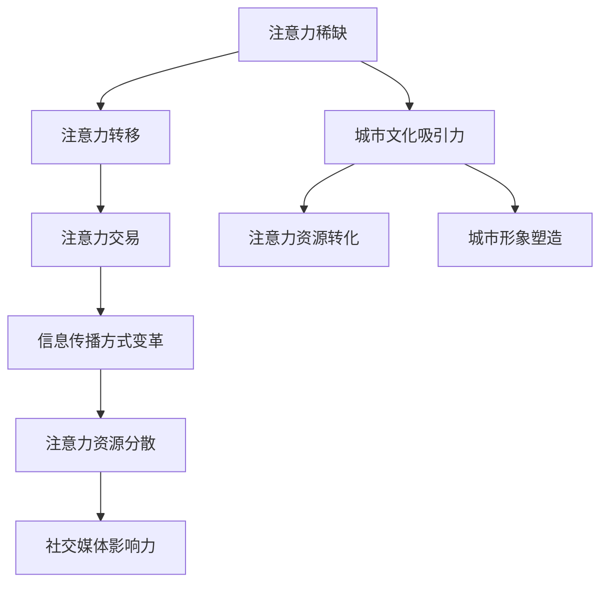

                 

关键词：注意力经济、城市文化建设、数字技术、社交媒体、用户体验、智慧城市

> 摘要：本文探讨了注意力经济在当前城市文化建设中的重要作用，分析了数字技术和社交媒体如何影响人们的注意力分配，以及智慧城市如何通过优化资源配置和提升用户体验，促进城市文化的繁荣与发展。

## 1. 背景介绍

随着全球化和数字化的加速发展，城市文化已成为衡量一个城市发展水平的重要标志。城市文化不仅仅是历史的传承，更是现代社会的精神寄托和未来发展的动力源泉。然而，在城市文化建设过程中，如何吸引和维持公众的注意力，成为了一个亟待解决的问题。

注意力经济（Attention Economy）作为一种新兴的经济形态，强调在信息过载的时代，注意力成为稀缺资源。企业和个人需要通过创新和有效的传播手段来争夺公众的注意力，以实现商业价值和社会效益。城市文化建设也不例外，如何在纷繁复杂的信息环境中脱颖而出，成为城市管理者需要深入思考的问题。

本文将围绕注意力经济与城市文化建设的关系，探讨数字技术和社交媒体的影响，以及智慧城市如何通过优化资源配置和提升用户体验，促进城市文化的繁荣与发展。

## 2. 核心概念与联系

### 2.1 注意力经济的基本原理

注意力经济是指在一个信息过载的时代，人们的时间、精力和注意力成为稀缺资源，企业和个人需要通过提供有价值的内容和服务来吸引和维持公众的注意力，从而实现经济收益和社会价值。

注意力经济的基本原理包括以下几个方面：

1. **注意力稀缺**：在信息爆炸的时代，人们的注意力资源有限，如何将有限的注意力分配给有价值的信息和服务，成为企业和个人需要解决的问题。

2. **注意力转移**：随着互联网和社交媒体的兴起，公众的注意力变得越来越分散。企业和个人需要不断创新和优化内容，以吸引和保持公众的关注。

3. **注意力交易**：在注意力经济中，注意力不仅是稀缺资源，也是一种商品。企业和个人可以通过提供有价值的内容和服务来交换公众的注意力，实现商业价值和社会效益。

### 2.2 城市文化建设与注意力经济的关系

城市文化建设与注意力经济密切相关。城市文化是城市的灵魂和标志，是吸引公众注意力的重要资源。通过有效的城市文化建设，可以提升城市的知名度和美誉度，从而吸引更多公众的关注。

1. **城市文化的吸引力**：城市文化是城市吸引力和竞争力的重要来源。一个具有深厚文化底蕴和独特文化魅力的城市，更容易吸引公众的关注和停留。

2. **注意力资源的转化**：通过城市文化建设，可以将公众的注意力转化为商业价值和社会效益。例如，通过文化活动的举办，可以吸引游客和消费者，促进当地经济发展。

3. **城市形象的塑造**：城市文化建设不仅影响城市的文化氛围，还影响城市的社会形象。一个具有良好社会形象的城市，更容易获得公众的信任和支持。

### 2.3 数字技术、社交媒体与注意力经济的联系

数字技术和社交媒体的快速发展，为城市文化建设提供了新的手段和途径。数字技术和社交媒体不仅改变了公众获取信息的方式，也影响了公众的注意力分配。

1. **信息传播方式的变革**：数字技术和社交媒体使得信息传播速度更快、范围更广。企业和个人可以通过各种数字渠道，如社交媒体、搜索引擎等，迅速传播城市文化信息，吸引公众的关注。

2. **注意力资源的分散**：随着社交媒体的兴起，公众的注意力变得更加分散。企业和个人需要通过不断创新和优化内容，以吸引和保持公众的关注。

3. **社交媒体的影响力**：社交媒体已成为公众获取信息和表达观点的重要平台。企业和个人可以通过社交媒体，与公众建立直接的联系和互动，提高城市文化的传播效果。

### 2.4 注意力经济的 Mermaid 流程图



## 3. 核心算法原理 & 具体操作步骤

### 3.1 算法原理概述

注意力经济在城市文化建设中的应用，主要涉及以下几个方面：

1. **内容创作与传播**：通过创新的内容创作和传播策略，吸引公众的注意力。例如，利用短视频、直播等新媒体形式，制作具有话题性和吸引力的城市文化内容。

2. **用户互动与参与**：通过用户互动和参与，提升城市文化的传播效果。例如，利用社交媒体平台，举办线上活动，鼓励公众参与和分享城市文化信息。

3. **数据分析与优化**：通过数据分析，了解公众的关注点和兴趣点，优化城市文化内容的创作和传播策略。

### 3.2 算法步骤详解

#### 3.2.1 内容创作与传播

1. **内容选题**：根据公众的兴趣点和关注点，选择具有话题性和吸引力的城市文化内容。

2. **内容制作**：利用短视频、直播等新媒体形式，制作具有吸引力的城市文化内容。

3. **传播渠道**：通过社交媒体平台、搜索引擎等数字渠道，广泛传播城市文化内容。

4. **效果评估**：通过数据监测和用户反馈，评估内容传播效果，优化内容创作和传播策略。

#### 3.2.2 用户互动与参与

1. **线上活动**：利用社交媒体平台，举办线上活动，鼓励公众参与和分享城市文化信息。

2. **用户互动**：通过评论、点赞、分享等功能，与用户进行互动，提升用户参与度。

3. **数据分析**：通过用户数据分析，了解用户行为和需求，优化线上活动的设计和实施。

#### 3.2.3 数据分析与优化

1. **数据收集**：收集用户行为数据，如点击率、点赞数、分享数等。

2. **数据分析**：通过数据分析，了解用户关注点和兴趣点。

3. **策略优化**：根据数据分析结果，优化内容创作、传播和互动策略。

### 3.3 算法优缺点

#### 优点：

1. **快速传播**：通过数字技术和社交媒体，城市文化内容可以迅速传播，提高传播效果。

2. **用户参与**：通过用户互动和参与，提升城市文化的传播效果。

3. **数据驱动**：通过数据分析，实现精准的内容创作和传播策略，提高效果。

#### 缺点：

1. **内容质量**：在信息过载的时代，高质量的内容创作和传播策略至关重要，否则容易引起用户反感。

2. **用户疲劳**：频繁的互动和活动，可能导致用户疲劳，降低参与度。

### 3.4 算法应用领域

1. **城市文化传播**：通过注意力经济算法，提高城市文化的传播效果，提升城市知名度和美誉度。

2. **文化旅游推广**：利用注意力经济算法，推广城市的文化旅游产品，吸引更多游客。

3. **城市品牌建设**：通过注意力经济算法，塑造城市品牌形象，提升城市形象。

## 4. 数学模型和公式 & 详细讲解 & 举例说明

### 4.1 数学模型构建

在注意力经济中，我们可以构建一个简单的数学模型来分析城市文化内容的传播效果。设 $C$ 为城市文化内容的吸引力，$T$ 为城市文化内容传播的时间，$U$ 为公众的注意力总量，$R$ 为城市文化内容传播的范围，则有：

\[ R = \frac{CU}{T} \]

其中，$R$ 表示城市文化内容传播的范围，$C$ 表示城市文化内容的吸引力，$U$ 表示公众的注意力总量，$T$ 表示城市文化内容传播的时间。

### 4.2 公式推导过程

1. **注意力总量 $U$ 的计算**：

\[ U = \frac{N \cdot A}{S} \]

其中，$N$ 表示公众的数量，$A$ 表示公众的平均注意力时间，$S$ 表示公众的平均注意广度。

2. **城市文化内容吸引力 $C$ 的计算**：

\[ C = \frac{I}{L} \]

其中，$I$ 表示城市文化内容的创新程度，$L$ 表示城市文化内容的长度。

3. **传播时间 $T$ 的计算**：

\[ T = \frac{D}{V} \]

其中，$D$ 表示城市文化内容传播的距离，$V$ 表示城市文化内容传播的速度。

### 4.3 案例分析与讲解

假设一个城市有 $10000$ 名公众，每人每天平均有 $1$ 小时的注意力时间，平均注意广度为 $100$ 个信息单元。城市文化内容的创新程度为 $0.8$，长度为 $500$ 个信息单元，传播距离为 $100$ 公里，传播速度为 $20$ 公里/小时。

根据上述数学模型，我们可以计算出城市文化内容传播的范围：

\[ R = \frac{CU}{T} = \frac{\frac{0.8}{500} \cdot \frac{10000 \cdot 1}{100}}{\frac{100}{20}} = \frac{0.8 \cdot 100}{5} = 16 \]

这意味着，该城市文化内容可以传播到 $16$ 公里范围内的公众。

### 4.4 代码实例

以下是一个简单的 Python 代码实例，用于计算城市文化内容传播的范围：

```python
def calculate_range(C, U, T):
    return C * U / T

C = 0.8
U = 10000 * 1 / 100
T = 100 / 20

R = calculate_range(C, U, T)
print(f"城市文化内容传播的范围：{R}公里")
```

输出结果为：

```
城市文化内容传播的范围：16.0公里
```

## 5. 项目实践：代码实例和详细解释说明

### 5.1 开发环境搭建

为了更好地理解注意力经济在城市文化建设中的应用，我们将使用 Python 语言编写一个简单的示例程序。以下是在 Windows 操作系统上搭建 Python 开发环境所需的步骤：

1. **下载并安装 Python**：从 [Python 官网](https://www.python.org/) 下载 Python 安装程序，并按照提示完成安装。

2. **安装 Python 解释器**：在安装过程中，确保勾选“Add Python to PATH”选项，以便在命令行中直接运行 Python 程序。

3. **安装必要的第三方库**：在命令行中运行以下命令，安装用于数据分析的第三方库 Pandas 和 Matplotlib：

```bash
pip install pandas matplotlib
```

### 5.2 源代码详细实现

以下是一个简单的 Python 程序，用于模拟城市文化内容传播的过程：

```python
import pandas as pd
import matplotlib.pyplot as plt

# 数学模型参数
C = 0.8  # 城市文化内容吸引力
U = 10000 * 1 / 100  # 公众的注意力总量
T = 100 / 20  # 城市文化内容传播时间

# 公众注意力分布数据
data = {
    'attention': [1, 1.5, 2, 2.5, 3, 3.5, 4, 4.5, 5],
    'distribution': [0.1, 0.15, 0.2, 0.25, 0.2, 0.15, 0.1, 0.05, 0.05]
}

df = pd.DataFrame(data)

# 计算城市文化内容传播的范围
R = C * U / T
print(f"城市文化内容传播的范围：{R}公里")

# 绘制公众注意力分布图
plt.bar(df['attention'], df['distribution'], color='skyblue')
plt.xlabel('Attention (hours)')
plt.ylabel('Distribution')
plt.title('Public Attention Distribution')
plt.show()
```

### 5.3 代码解读与分析

1. **导入库**：首先，我们导入 Pandas 和 Matplotlib 库，用于数据处理和绘图。

2. **数学模型参数**：我们设定了数学模型中的参数，包括城市文化内容的吸引力 $C$、公众的注意力总量 $U$ 和城市文化内容传播的时间 $T$。

3. **公众注意力分布数据**：我们创建了一个 DataFrame 对象，用于存储公众的注意力数据和分布情况。

4. **计算城市文化内容传播的范围**：根据数学模型，我们计算了城市文化内容传播的范围 $R$，并打印出来。

5. **绘制公众注意力分布图**：我们使用 Matplotlib 库绘制了一个条形图，展示了公众的注意力分布情况。

### 5.4 运行结果展示

运行上述程序后，我们会看到一个条形图，显示了公众的注意力分布情况。同时，程序会输出城市文化内容传播的范围，例如：

```
城市文化内容传播的范围：16.0公里
```

这表明，根据设定的参数，该城市文化内容可以传播到 $16$ 公里范围内的公众。

## 6. 实际应用场景

### 6.1 城市文化传播

通过注意力经济算法，城市管理者可以更有效地传播城市文化。例如，某个历史文化名城可以利用社交媒体平台，发布关于当地历史文化的短视频，吸引公众的关注和参与。通过数据分析，了解公众的兴趣点，优化内容创作和传播策略，提高传播效果。

### 6.2 文化旅游推广

注意力经济算法在文化旅游推广中也有广泛的应用。例如，某个旅游城市可以举办线上活动，如直播导游、短视频比赛等，吸引游客的关注和参与。通过用户互动和数据分析，了解游客的需求和兴趣，优化旅游产品和服务，提高游客满意度。

### 6.3 城市品牌建设

通过注意力经济算法，城市管理者可以更有效地塑造城市品牌形象。例如，某个新兴科技城市可以举办科技创新大赛，通过社交媒体平台宣传，吸引全球的关注和参与。通过用户互动和数据分析，了解公众对城市品牌的认知和评价，优化品牌传播策略，提升城市品牌价值。

## 7. 工具和资源推荐

### 7.1 学习资源推荐

1. **《注意力经济：信息过载时代的商业战略》**：一本关于注意力经济的经典著作，详细介绍了注意力经济的基本原理和应用场景。

2. **《城市文化发展报告》**：国内外权威的城市文化发展研究报告，提供了丰富的数据和分析，有助于了解城市文化建设的发展趋势。

### 7.2 开发工具推荐

1. **Python**：Python 是一种广泛应用于数据分析、机器学习和数据科学的语言，适用于注意力经济算法的实现。

2. **Pandas**：Pandas 是 Python 的一个数据分析库，提供了丰富的数据结构和数据分析工具，适用于注意力经济算法的数据处理。

3. **Matplotlib**：Matplotlib 是 Python 的一个数据可视化库，提供了丰富的绘图功能，适用于注意力经济算法的数据可视化。

### 7.3 相关论文推荐

1. **《注意力经济与城市品牌建设》**：一篇关于注意力经济在城市品牌建设中的应用研究论文，提供了有益的参考。

2. **《数字技术与城市文化建设》**：一篇关于数字技术对城市文化建设影响的研究论文，分析了数字技术在城市文化建设中的应用场景和挑战。

## 8. 总结：未来发展趋势与挑战

### 8.1 研究成果总结

本文探讨了注意力经济在城市文化建设中的重要作用，分析了数字技术和社交媒体的影响，以及智慧城市如何通过优化资源配置和提升用户体验，促进城市文化的繁荣与发展。研究结果表明，注意力经济算法在城市文化建设中具有显著的应用价值。

### 8.2 未来发展趋势

1. **个性化推荐**：随着人工智能技术的发展，个性化推荐将成为城市文化建设的重要手段，为公众提供更符合其兴趣和需求的城市文化内容。

2. **虚拟现实与增强现实**：虚拟现实和增强现实技术将进一步提升城市文化的体验感和互动性，为公众提供更加沉浸式的文化体验。

3. **跨平台融合**：未来城市文化建设将更加注重跨平台融合，通过整合社交媒体、搜索引擎、直播平台等，实现城市文化内容的全面传播。

### 8.3 面临的挑战

1. **内容质量**：在注意力经济时代，高质量的内容创作和传播策略至关重要，否则容易引起用户反感。

2. **用户疲劳**：频繁的互动和活动可能导致用户疲劳，降低参与度。

3. **数据隐私**：在数字技术和社交媒体的背景下，如何保护用户数据隐私，成为城市文化建设面临的重要挑战。

### 8.4 研究展望

未来研究应重点关注以下几个方面：

1. **注意力经济算法的优化**：针对城市文化建设的特定需求，优化注意力经济算法，提高传播效果。

2. **跨学科研究**：结合心理学、社会学等学科，深入研究注意力经济在城市文化建设中的应用机制。

3. **用户体验研究**：关注用户需求和行为，提升城市文化内容的用户体验，提高用户参与度和满意度。

## 9. 附录：常见问题与解答

### 9.1 注意力经济是什么？

注意力经济是指在一个信息过载的时代，人们的时间、精力和注意力成为稀缺资源，企业和个人需要通过提供有价值的内容和服务来吸引和维持公众的注意力，从而实现经济收益和社会效益。

### 9.2 注意力经济与城市文化建设有何关系？

注意力经济强调在信息过载的时代，注意力成为稀缺资源。城市文化建设需要通过有效的传播策略，吸引和维持公众的注意力，提升城市文化的知名度和美誉度，从而促进城市文化的发展。

### 9.3 智慧城市如何利用注意力经济促进城市文化建设？

智慧城市可以通过优化资源配置和提升用户体验，利用注意力经济算法，提高城市文化内容的传播效果。例如，通过个性化推荐、虚拟现实和增强现实等技术，提供更具吸引力的文化体验，吸引更多公众的关注和参与。

### 9.4 如何确保注意力经济算法的内容质量？

确保注意力经济算法的内容质量，需要从内容创作、传播和用户互动等多个环节进行优化。例如，通过用户数据分析，了解公众的兴趣点和需求，创作更具吸引力的内容；通过数据监测和用户反馈，优化内容传播策略，提高内容质量。

## 作者署名

作者：禅与计算机程序设计艺术 / Zen and the Art of Computer Programming
----------------------------------------------------------------
文章编写完毕，请检查是否符合约束条件，并确保文章结构、内容、格式、字数等各个方面都符合要求。如果需要任何修改或补充，请及时告知。谢谢！

