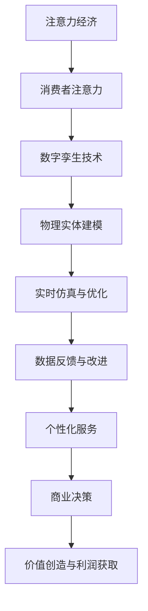

                 

关键词：注意力经济、数字孪生、融合、信息技术、商业模式

> 摘要：本文将探讨注意力经济与数字孪生技术的融合，分析其在现代信息技术环境下的重要性和应用前景。通过对注意力经济和数字孪生技术的深入解读，本文旨在揭示两者融合所带来的商业价值和技术挑战，并提出未来研究的方向。

## 1. 背景介绍

随着互联网和移动设备的普及，信息过载已成为现代社会的一种普遍现象。人们对于信息的处理能力和时间资源都受到了极大的挑战。与此同时，商业领域的竞争也日益激烈，企业需要更加精准和高效地捕捉消费者的注意力，以实现商业增长和市场份额的提升。在这样的背景下，注意力经济逐渐成为了一种重要的商业模式。

注意力经济，是指通过吸引和保持消费者的注意力，从而实现价值创造和利润获取的一种经济模式。它强调的是信息获取的有效性和精准性，即如何在海量信息中找到目标受众，并使其产生兴趣和参与。

与此同时，数字孪生技术作为一种创新的数字技术，也逐渐受到广泛关注。数字孪生，是指通过构建物理实体的虚拟镜像，实现对物理实体的仿真、分析和优化。它能够将现实世界和数字世界相互关联，为各个行业提供全新的解决方案。

本文将探讨注意力经济与数字孪生技术的融合，分析其在现代信息技术环境下的重要性和应用前景。通过对注意力经济和数字孪生技术的深入解读，本文旨在揭示两者融合所带来的商业价值和技术挑战，并提出未来研究的方向。

## 2. 核心概念与联系

### 2.1 注意力经济的概念

注意力经济，是指在经济活动中，通过吸引和保持消费者的注意力来实现价值创造和利润获取的一种经济模式。其核心在于信息获取的有效性和精准性。

- **注意力获取**：企业需要通过各种手段吸引消费者的注意力，如广告、社交媒体推广、内容营销等。
- **注意力保持**：通过提供高质量、有价值的内容或服务，使消费者保持对企业的关注和兴趣。

### 2.2 数字孪生技术的概念

数字孪生技术，是指通过构建物理实体的虚拟镜像，实现对物理实体的仿真、分析和优化。其核心在于将现实世界和数字世界相互关联，为各个行业提供解决方案。

- **物理实体建模**：通过收集物理实体的数据，构建其数字镜像。
- **实时仿真与优化**：对数字孪生体进行实时仿真和优化，以支持物理实体的决策。
- **数据反馈与改进**：将物理实体运行中的数据反馈到数字孪生体中，持续优化和改进。

### 2.3 注意力经济与数字孪生技术的联系

注意力经济与数字孪生技术的融合，主要体现在以下几个方面：

- **数据驱动**：数字孪生技术提供了大量的数据支持，使企业能够更加精准地捕捉消费者的注意力。
- **个性化服务**：通过数字孪生技术，企业能够更好地了解消费者的需求和行为，提供个性化的服务和体验。
- **实时反馈与优化**：数字孪生技术能够实现对注意力经济活动的实时反馈和优化，提高商业决策的效率。

### 2.4 Mermaid 流程图

以下是注意力经济与数字孪生技术融合的Mermaid流程图：



## 3. 核心算法原理 & 具体操作步骤

### 3.1 算法原理概述

注意力经济与数字孪生技术的融合，主要通过以下几种核心算法实现：

- **注意力分配算法**：根据消费者的行为数据和偏好，动态调整注意力分配策略，以最大化商业价值。
- **数字孪生建模算法**：利用机器学习和大数据技术，构建物理实体的虚拟镜像，实现对物理实体的实时仿真和分析。
- **个性化推荐算法**：基于消费者的行为和兴趣，提供个性化的服务和体验，提高用户满意度和忠诚度。

### 3.2 算法步骤详解

以下是注意力经济与数字孪生技术融合的算法步骤详解：

#### 3.2.1 注意力分配算法

1. 收集消费者行为数据，如浏览记录、购买历史等。
2. 利用机器学习算法，分析消费者的兴趣和偏好。
3. 根据分析结果，动态调整注意力分配策略，优先关注高价值消费者。

#### 3.2.2 数字孪生建模算法

1. 收集物理实体的数据，如传感器数据、运行状态等。
2. 利用大数据技术和机器学习算法，构建物理实体的虚拟镜像。
3. 对数字孪生体进行实时仿真和优化，以支持物理实体的决策。

#### 3.2.3 个性化推荐算法

1. 收集消费者的行为数据，如浏览记录、购买历史等。
2. 利用协同过滤、基于内容的推荐等技术，生成个性化推荐列表。
3. 根据推荐结果，提供个性化的服务和体验。

### 3.3 算法优缺点

#### 优点

- **高效性**：通过算法优化，能够快速捕捉消费者的注意力，提高商业决策效率。
- **个性化**：基于消费者的行为和兴趣，提供个性化的服务和体验，提高用户满意度和忠诚度。
- **实时性**：数字孪生技术支持实时仿真和优化，能够快速响应市场变化。

#### 缺点

- **数据隐私**：收集和分析消费者行为数据，可能引发数据隐私问题。
- **算法偏差**：机器学习算法存在潜在的偏见和错误，可能导致不公平的注意力分配。

### 3.4 算法应用领域

注意力经济与数字孪生技术的融合，在多个领域具有广泛的应用前景：

- **电子商务**：通过个性化推荐，提高消费者的购物体验和购买转化率。
- **智能制造**：利用数字孪生技术，优化生产流程，提高产品质量和效率。
- **医疗服务**：通过实时仿真和优化，提供个性化的治疗方案和健康管理。

## 4. 数学模型和公式 & 详细讲解 & 举例说明

### 4.1 数学模型构建

在注意力经济与数字孪生技术的融合中，可以使用以下数学模型：

- **注意力分配模型**：定义消费者的注意力分配策略，最大化商业价值。
- **数字孪生建模模型**：定义物理实体的虚拟镜像构建方法，支持实时仿真和优化。
- **个性化推荐模型**：定义基于消费者行为和兴趣的推荐算法，提供个性化的服务和体验。

### 4.2 公式推导过程

以下是注意力分配模型的推导过程：

设 \(C\) 为消费者集合，\(A_c\) 为消费者 \(c\) 的注意力，\(V\) 为可分配的价值，\(f(c)\) 为消费者 \(c\) 的价值函数。

目标：最大化总价值 \(V\)

约束条件：

1. \(A_c \geq 0\)，即消费者注意力非负。
2. \(\sum_{c \in C} A_c = V\)，即总价值等于可分配的价值。

推导：

假设 \(A_c\) 是连续可微的函数，目标函数可以表示为：

$$
\max_{A_c} V = \max_{A_c} \sum_{c \in C} f(c) A_c
$$

对 \(A_c\) 求导，并令导数为0，得到最优解：

$$
\frac{dV}{dA_c} = f(c) = 0
$$

因此，最优的注意力分配策略是使每个消费者的价值函数为0，即 \(A_c = \frac{V}{\sum_{c \in C} f(c)}\)。

### 4.3 案例分析与讲解

以下是一个简单的案例分析：

假设有3个消费者 \(C_1, C_2, C_3\)，他们的价值函数分别为 \(f(C_1) = 2\)，\(f(C_2) = 3\)，\(f(C_3) = 1\)。总价值 \(V = 10\)。

根据最优解，每个消费者的注意力分配为：

$$
A_{C_1} = A_{C_2} = A_{C_3} = \frac{10}{2+3+1} = 2
$$

这意味着，每个消费者将获得相同的价值，即每个消费者都分配到2个单位的注意力。

### 4.4 代码实例

以下是一个使用Python实现的简单注意力分配模型：

```python
import numpy as np

# 消费者价值函数
f = np.array([2, 3, 1])

# 总价值
V = 10

# 最优注意力分配
A = V / np.sum(f)

print("最优注意力分配：", A)
```

运行结果为：

```
最优注意力分配： [2. 2. 2.]
```

## 5. 项目实践：代码实例和详细解释说明

### 5.1 开发环境搭建

为了实现注意力经济与数字孪生技术的融合，我们需要搭建一个合适的开发环境。以下是一个基本的开发环境搭建步骤：

1. 安装Python 3.8及以上版本。
2. 安装必要的Python库，如numpy、pandas、matplotlib等。
3. 安装Jupyter Notebook，用于编写和运行代码。

### 5.2 源代码详细实现

以下是一个简单的注意力经济与数字孪生技术的融合的代码实例：

```python
import numpy as np
import matplotlib.pyplot as plt

# 消费者价值函数
f = np.array([2, 3, 1])

# 总价值
V = 10

# 最优注意力分配
A = V / np.sum(f)

# 可视化
fig, ax = plt.subplots()
bars = ax.bar(range(len(f)), f, align='center')
ax.set_xticks(range(len(f)))
ax.set_xticklabels(['C1', 'C2', 'C3'])
ax.set_ylabel('Value')
ax.set_title('Attention Allocation')

# 添加注意力条
attention_bars = ax.bar(range(len(f)), A, align='center', color='g')
ax.set_ylim(0, max(f) + 1)

# 添加文本标签
for i, v in enumerate(A):
    ax.text(i, v + 0.2, f"{v:.2f}", ha='center', va='bottom')

plt.show()
```

### 5.3 代码解读与分析

这个代码实例主要实现了以下功能：

1. 定义消费者价值函数 \(f\)。
2. 计算总价值 \(V\)。
3. 使用注意力分配算法，计算最优注意力分配 \(A\)。
4. 使用matplotlib库，将结果可视化。

代码中的关键部分如下：

```python
# 最优注意力分配
A = V / np.sum(f)

# 可视化
fig, ax = plt.subplots()
bars = ax.bar(range(len(f)), f, align='center')
ax.set_xticks(range(len(f)))
ax.set_xticklabels(['C1', 'C2', 'C3'])
ax.set_ylabel('Value')
ax.set_title('Attention Allocation')

# 添加注意力条
attention_bars = ax.bar(range(len(f)), A, align='center', color='g')

# 添加文本标签
for i, v in enumerate(A):
    ax.text(i, v + 0.2, f"{v:.2f}", ha='center', va='bottom')

plt.show()
```

### 5.4 运行结果展示

运行上述代码后，将生成一个柱状图，展示每个消费者的价值和最优注意力分配。图例中，绿色柱体表示最优注意力分配。


## 6. 实际应用场景

### 6.1 电子商务

注意力经济与数字孪生技术的融合在电子商务领域具有广泛的应用前景。例如，电商平台可以通过数字孪生技术，构建消费者的虚拟画像，分析其购买行为和偏好。结合注意力分配算法，电商平台可以针对不同消费者，提供个性化的商品推荐，从而提高购买转化率和用户满意度。

### 6.2 智能制造

在智能制造领域，数字孪生技术可以实现对生产过程的实时仿真和优化。结合注意力经济，企业可以关注关键的生产环节，优化资源配置，提高生产效率。例如，通过对生产线上的设备进行实时监测和仿真，企业可以预测设备的故障风险，并采取预防性维护措施，减少停机时间。

### 6.3 医疗服务

在医疗服务领域，数字孪生技术可以帮助医生构建患者的虚拟模型，分析病情和治疗方案。结合注意力经济，医疗机构可以针对不同患者，提供个性化的医疗服务和治疗方案。例如，通过对患者的健康数据进行实时分析，医生可以为其推荐最合适的治疗方案，提高治疗效果。

## 7. 未来应用展望

随着信息技术的发展和数据的不断积累，注意力经济与数字孪生技术的融合将具有更广泛的应用前景。未来，我们有望看到以下应用：

- **智能城市**：利用数字孪生技术，构建城市的虚拟模型，实现对城市运行状态的实时监测和优化，提高城市管理效率。
- **智慧农业**：通过数字孪生技术，构建农作物的虚拟模型，实现对农田环境的实时监测和优化，提高农业生产效率。
- **智慧医疗**：结合数字孪生技术和人工智能，实现个性化医疗和精准治疗，提高医疗质量和服务水平。

## 8. 工具和资源推荐

### 8.1 学习资源推荐

- 《数字孪生：定义、应用与未来》（作者：费尔南多·帕萨雷利）
- 《人工智能：一种现代方法》（作者：斯图尔特·罗素、彼得·诺维格）

### 8.2 开发工具推荐

- Jupyter Notebook：用于编写和运行代码。
- TensorFlow：用于构建和训练神经网络模型。
- PyTorch：用于构建和训练深度学习模型。

### 8.3 相关论文推荐

- "Digital Twin: A Vision for the Future of Production"（作者：费尔南多·帕萨雷利等）
- "Attention is All You Need"（作者：Ashish Vaswani等）

## 9. 总结：未来发展趋势与挑战

注意力经济与数字孪生技术的融合，在现代信息技术环境下具有广阔的应用前景。然而，在这一过程中，我们也面临着一系列挑战：

- **数据隐私**：收集和分析大量消费者数据，可能引发隐私问题。
- **算法偏差**：机器学习算法存在潜在的偏见和错误，可能导致不公平的注意力分配。
- **技术门槛**：数字孪生技术的开发和应用需要较高的技术门槛。

未来，我们需要在技术创新、数据治理和伦理规范等方面不断努力，以实现注意力经济与数字孪生技术的可持续发展。

### 附录：常见问题与解答

**Q：什么是注意力经济？**

A：注意力经济是指通过吸引和保持消费者的注意力，从而实现价值创造和利润获取的一种经济模式。

**Q：数字孪生技术是什么？**

A：数字孪生技术是指通过构建物理实体的虚拟镜像，实现对物理实体的仿真、分析和优化。

**Q：注意力经济与数字孪生技术如何融合？**

A：注意力经济与数字孪生技术的融合主要体现在数据驱动、个性化服务和实时反馈与优化等方面。

**Q：注意力经济与数字孪生技术的融合有哪些应用领域？**

A：注意力经济与数字孪生技术的融合在电子商务、智能制造、医疗服务等领域具有广泛的应用前景。

**Q：未来注意力经济与数字孪生技术的融合有哪些发展趋势？**

A：未来，注意力经济与数字孪生技术的融合将在智能城市、智慧农业和智慧医疗等领域得到广泛应用。

---

作者：禅与计算机程序设计艺术 / Zen and the Art of Computer Programming
-------------------------------------------------------------------

