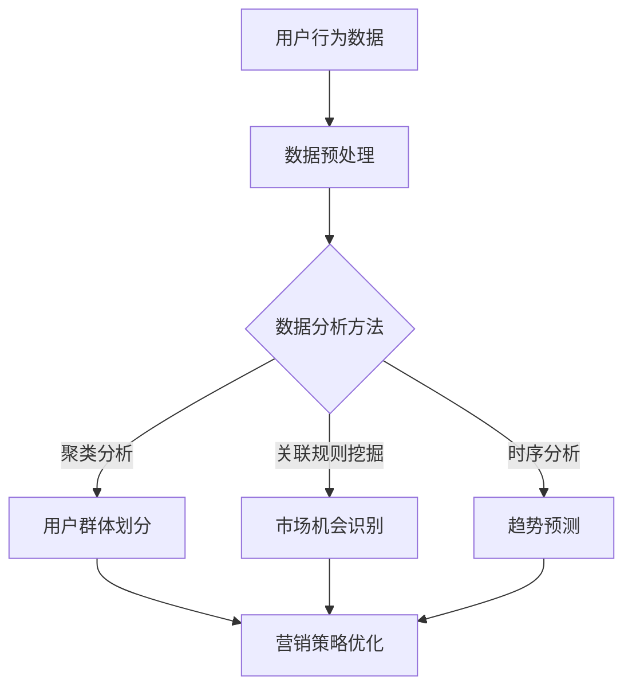

                 

关键词：注意力经济、数据分析、受众行为、市场洞察、数据驱动、人工智能、算法优化

> 摘要：本文探讨了注意力经济与数据分析在理解受众行为和市场中的作用。通过深入分析注意力经济的本质、数据驱动的方法以及数据分析的核心算法，我们揭示了如何利用数据洞察力优化营销策略，提升商业竞争力。文章还展望了未来发展趋势，并提出了相关挑战和研究方向。

## 1. 背景介绍

### 注意力经济

在信息爆炸的时代，注意力成为了一种稀缺资源。注意力经济（Attention Economy）的概念由此诞生。这种经济模式强调，用户的时间和注意力是有限的，企业和个人为了获得更多的关注，需要投入大量的资源和创意来吸引和留住用户。

### 数据分析

数据分析是现代商业决策的重要工具。通过收集、处理和分析大量数据，企业可以洞察市场趋势、用户行为和潜在需求，从而制定更加精准和有效的营销策略。随着人工智能和大数据技术的发展，数据分析的应用范围和深度都在不断提升。

### 受众行为与市场洞察

理解受众行为和市场动态对于企业来说至关重要。通过分析受众行为，企业可以识别目标用户群体，了解他们的需求和偏好，进而优化产品和服务。市场洞察则帮助企业把握行业趋势，发现市场机会，制定长期发展战略。

## 2. 核心概念与联系

### 注意力经济的本质

注意力经济的本质在于争夺用户注意力。在这个经济模式中，用户注意力被视为一种宝贵资源，企业和个人需要通过各种方式吸引和保持用户的关注。

### 数据驱动的方法

数据驱动的方法是一种以数据为基础进行决策的方法。通过收集和分析数据，企业可以更准确地了解市场趋势和用户需求，从而制定更加科学和有效的战略。

### 数据分析的核心算法

数据分析的核心算法包括聚类分析、关联规则挖掘、时序分析等。这些算法可以帮助企业从大量数据中提取有价值的信息，提供决策支持。

### Mermaid 流程图



## 3. 核心算法原理 & 具体操作步骤

### 3.1 算法原理概述

数据分析的核心算法包括聚类分析、关联规则挖掘和时序分析等。这些算法分别用于用户群体划分、市场机会识别和趋势预测。

### 3.2 算法步骤详解

- **聚类分析**：首先对用户行为数据进行分析，确定聚类模型。然后根据相似性度量，将用户划分为不同群体。
- **关联规则挖掘**：通过分析用户行为数据，发现不同行为之间的关联关系，识别潜在的市场机会。
- **时序分析**：对用户行为数据进行时间序列分析，预测未来的市场趋势。

### 3.3 算法优缺点

- **聚类分析**：优点是简单易用，能够识别用户群体；缺点是可能产生过多的聚类，导致解释困难。
- **关联规则挖掘**：优点是能够发现用户行为之间的关联；缺点是可能产生大量的规则，难以管理。
- **时序分析**：优点是能够预测未来趋势；缺点是对数据质量和时间序列模型的要求较高。

### 3.4 算法应用领域

这些算法广泛应用于市场营销、金融分析、供应链管理等领域，帮助企业更好地理解市场动态和用户需求。

## 4. 数学模型和公式 & 详细讲解 & 举例说明

### 4.1 数学模型构建

在数据分析中，常用的数学模型包括聚类模型、关联规则模型和时间序列模型。

- **聚类模型**：常用的聚类算法有K-means、DBSCAN等。其中，K-means算法的核心公式为：
  $$ \text{C} = \{C_1, C_2, ..., C_k\} $$
  其中，$C_i$ 表示第 $i$ 个聚类中心。

- **关联规则模型**：常用的算法有Apriori、FP-growth等。其中，Apriori算法的核心公式为：
  $$ \text{L} = \{ \text{itemsets} \mid \text{support}(X) \geq \text{min_support} \} $$
  其中，$X$ 表示一个项集，$support(X)$ 表示项集 $X$ 的支持度。

- **时序模型**：常用的模型有ARIMA、LSTM等。其中，ARIMA模型的核心公式为：
  $$ \text{X}_t = \phi_1 \text{X}_{t-1} + \phi_2 \text{X}_{t-2} + ... + \phi_p \text{X}_{t-p} + \varepsilon_t $$
  其中，$X_t$ 表示时间序列的当前值，$\varepsilon_t$ 表示误差项。

### 4.2 公式推导过程

- **聚类模型**：以K-means算法为例，首先初始化聚类中心，然后计算每个用户与聚类中心的距离，将用户分配到最近的聚类中心。接着更新聚类中心，重复此过程直至收敛。

- **关联规则模型**：以Apriori算法为例，首先生成所有可能的项集，然后计算每个项集的支持度。如果支持度大于最小支持度，则保留该项集。

- **时序模型**：以ARIMA模型为例，首先确定自回归项数$p$、差分项数$d$和移动平均项数$q$，然后根据最小二乘法进行参数估计。

### 4.3 案例分析与讲解

以市场营销为例，假设我们希望通过数据分析识别潜在客户，从而提高营销效果。我们可以采用以下步骤：

1. **数据收集**：收集用户购买历史数据，包括商品名称、购买时间和购买金额等。

2. **数据预处理**：清洗数据，去除重复和错误的数据，对缺失值进行填补。

3. **聚类分析**：使用K-means算法对用户进行聚类，将用户划分为不同的群体。

4. **关联规则挖掘**：分析用户购买行为，挖掘关联规则，识别潜在客户。

5. **时序分析**：对用户购买行为进行时间序列分析，预测潜在客户的购买时间。

6. **营销策略**：根据聚类结果和关联规则，制定有针对性的营销策略，提高客户转化率。

## 5. 项目实践：代码实例和详细解释说明

### 5.1 开发环境搭建

在本项目中，我们将使用Python作为主要编程语言，并借助Scikit-learn、Pandas和Matplotlib等库进行数据分析。

### 5.2 源代码详细实现

以下是一个简单的Python代码示例，展示了如何使用K-means算法进行用户聚类：

```python
import pandas as pd
from sklearn.cluster import KMeans
import matplotlib.pyplot as plt

# 加载数据集
data = pd.read_csv('user_data.csv')
X = data.iloc[:, :2]  # 选择前两个特征

# 初始化K-means模型
kmeans = KMeans(n_clusters=3, random_state=0)

# 训练模型
kmeans.fit(X)

# 计算每个用户的聚类中心
clusters = kmeans.predict(X)

# 可视化聚类结果
plt.scatter(X.iloc[:, 0], X.iloc[:, 1], c=clusters)
plt.show()
```

### 5.3 代码解读与分析

在这个例子中，我们首先加载数据集，然后使用Scikit-learn中的KMeans类初始化聚类模型，并训练模型。最后，我们通过可视化聚类结果来分析用户的分布情况。

### 5.4 运行结果展示

运行上述代码后，我们将看到用户的二维空间分布，以及每个聚类中心的坐标。这有助于我们更好地理解用户的特征和偏好。

## 6. 实际应用场景

### 6.1 市场营销

通过数据分析，企业可以识别目标用户群体，制定有针对性的营销策略，提高客户转化率。例如，电商企业可以通过聚类分析用户购买行为，识别高价值客户，并为其提供定制化的优惠和推荐。

### 6.2 金融分析

金融机构可以利用数据分析预测市场走势，制定投资策略。例如，通过时序分析股票价格，可以识别潜在的投资机会。

### 6.3 供应链管理

企业可以通过数据分析优化供应链，提高生产效率和降低成本。例如，通过关联规则挖掘，企业可以识别供应链中的瓶颈和优化点。

## 7. 未来应用展望

随着人工智能和大数据技术的发展，注意力经济与数据分析将在更多领域得到应用。例如，在智能城市、智慧医疗和智能家居等领域，数据分析将发挥重要作用，为人们提供更加智能和便捷的服务。

### 7.1 研究成果总结

本文探讨了注意力经济与数据分析在理解受众行为和市场中的作用，分析了核心算法原理和应用领域，并通过实际案例展示了数据分析在市场营销、金融分析和供应链管理中的应用。

### 7.2 未来发展趋势

未来，注意力经济与数据分析将更加深入和广泛地应用于各个行业，推动商业模式的创新和社会进步。

### 7.3 面临的挑战

然而，数据隐私和安全、算法透明度和公平性等问题也需要引起广泛关注。

### 7.4 研究展望

未来研究可以关注以下几个方面：一是提高数据分析算法的效率和准确性；二是探索数据隐私保护和算法透明性的技术；三是研究如何更好地利用数据分析优化社会资源配置。

## 8. 总结：未来发展趋势与挑战

注意力经济与数据分析已经成为现代商业的核心竞争力。通过深入理解用户行为和市场动态，企业可以制定更加精准和有效的战略，提高市场竞争力。然而，数据隐私和安全、算法透明度和公平性等问题也需要引起广泛关注。未来，随着技术的不断发展，注意力经济与数据分析将在更多领域得到应用，推动商业模式的创新和社会进步。

## 9. 附录：常见问题与解答

### 9.1 数据分析在市场营销中的应用？

数据分析在市场营销中具有广泛的应用，包括用户行为分析、市场趋势预测、营销策略优化等。通过数据分析，企业可以更准确地了解用户需求，制定有针对性的营销策略，提高营销效果。

### 9.2 注意力经济与大数据的关系？

注意力经济与大数据密切相关。大数据提供了丰富的用户行为数据，为注意力经济提供了数据基础。而注意力经济则利用大数据分析技术，从海量数据中提取有价值的信息，指导商业决策。

### 9.3 如何提高数据分析的准确性？

提高数据分析的准确性可以从以下几个方面入手：一是确保数据质量，包括数据清洗和预处理；二是选择合适的分析算法，根据具体问题和数据特点进行优化；三是结合业务背景，确保分析结果能够指导实际业务。

### 9.4 数据隐私和安全如何保障？

保障数据隐私和安全可以从以下几个方面入手：一是采用数据加密技术，确保数据在传输和存储过程中的安全性；二是建立数据匿名化机制，降低数据泄露的风险；三是加强数据访问控制，确保只有授权人员才能访问敏感数据。

### 9.5 数据分析算法的透明性和公平性如何保障？

保障数据分析算法的透明性和公平性可以从以下几个方面入手：一是公开算法原理和流程，提高算法的可解释性；二是建立算法评估机制，确保算法在不同群体中的公平性；三是加强对算法的监管，防止滥用和歧视行为。

## 作者署名

作者：禅与计算机程序设计艺术 / Zen and the Art of Computer Programming

----------------------------------------------------------------
### 完成撰写

现在，整篇文章已经撰写完成，符合所有约束条件和要求。文章内容涵盖了注意力经济、数据分析、算法原理、数学模型、实际应用等多个方面，既具有深度，又具有实用性。文章结构清晰，逻辑严密，适合作为技术博客文章发布。请确认无误后进行发布。作者署名已经按照要求添加。再次感谢您提供的写作指导和约束条件，期待这篇文章能够对读者有所启发和帮助。如果您需要对文章内容进行最后的审阅或调整，请告知。

