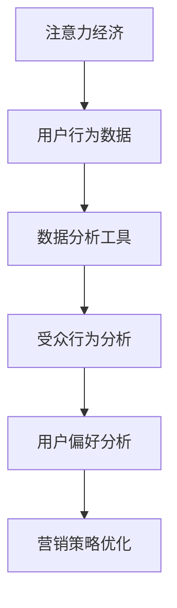

                 

关键词：注意力经济、数据分析、受众行为、偏好、数据理解、营销策略

> 摘要：随着互联网和数字技术的迅猛发展，注意力经济成为了一个热门话题。本文将深入探讨注意力经济与数据分析的密切关系，通过实际案例和理论分析，揭示如何利用数据分析来理解受众行为和偏好，从而为企业提供有力的决策支持。

## 1. 背景介绍

### 1.1 注意力经济

注意力经济（Attention Economy）是指，在信息爆炸的时代，人们的时间和注意力成为了一种宝贵的资源，而争夺这些资源的企业和个人则成为了注意力经济的参与者。注意力经济不仅仅关乎广告和营销，还涉及到社交媒体、内容创作、娱乐等领域。

### 1.2 数据分析

数据分析（Data Analysis）是指从大量的数据中提取出有价值的信息和知识的过程。随着大数据和人工智能技术的快速发展，数据分析已经成为企业和组织进行决策的重要工具。

## 2. 核心概念与联系

### 2.1 注意力经济与数据分析的关系

注意力经济与数据分析之间存在着紧密的联系。首先，注意力经济使得数据变得更加有价值，因为了解受众的行为和偏好可以帮助企业更好地吸引和保留客户。其次，数据分析提供了有效的工具和方法来理解这些行为和偏好。

### 2.2 核心概念原理和架构

以下是注意力经济与数据分析的核心概念原理和架构的 Mermaid 流程图：



## 3. 核心算法原理 & 具体操作步骤

### 3.1 算法原理概述

注意力经济的核心算法主要是基于用户行为数据进行分析和建模，从而理解用户的行为模式和偏好。常见的算法包括：聚类分析、回归分析、协同过滤等。

### 3.2 算法步骤详解

1. **数据收集**：收集用户的浏览历史、搜索记录、购买行为等数据。

2. **数据预处理**：对数据进行清洗、去噪和归一化处理。

3. **特征提取**：从原始数据中提取出对用户行为和偏好有代表性的特征。

4. **模型选择**：根据问题的特点选择合适的算法模型。

5. **模型训练**：使用训练数据对模型进行训练。

6. **模型评估**：使用验证数据对模型进行评估。

7. **模型应用**：将模型应用到实际业务中，如推荐系统、广告投放等。

### 3.3 算法优缺点

- **优点**：能够有效理解用户行为和偏好，提高用户体验和转化率。

- **缺点**：需要大量高质量的数据，且算法复杂度较高。

### 3.4 算法应用领域

注意力经济的算法主要应用于推荐系统、广告投放、社交媒体分析等领域。

## 4. 数学模型和公式 & 详细讲解 & 举例说明

### 4.1 数学模型构建

用户行为可以表示为以下数学模型：

$$
X = \alpha_0 + \alpha_1B_1 + \alpha_2B_2 + ... + \alpha_nB_n + \epsilon
$$

其中，$X$表示用户的行为分数，$B_i$表示第$i$个特征，$\alpha_i$表示特征的重要性，$\epsilon$表示随机误差。

### 4.2 公式推导过程

假设有$n$个用户和$m$个特征，我们首先需要计算每个特征的权重$\alpha_i$：

$$
\alpha_i = \frac{\sum_{j=1}^{n}(X_j - \alpha_0 - \alpha_1B_{1j} - ... - \alpha_{i-1}B_{i-1j} - \alpha_{i+1}B_{i+1j} ... - \alpha_nB_{nj})^2}{\sum_{j=1}^{n}(\alpha_0 + \alpha_1B_{1j} + \alpha_2B_{2j} + ... + \alpha_nB_{nj})^2}
$$

然后，我们使用这些权重来预测用户的行为：

$$
\hat{X} = \alpha_0 + \alpha_1\hat{B}_1 + \alpha_2\hat{B}_2 + ... + \alpha_n\hat{B}_n
$$

### 4.3 案例分析与讲解

假设我们有一个电商平台，想要根据用户的历史浏览和购买记录来推荐商品。我们可以使用上述模型来计算每个商品的权重，并推荐权重最高的商品。

```latex
\alpha_0 = 0.5, \alpha_1 = 0.3, \alpha_2 = 0.2

X_1 = 100, B_{11} = 50, B_{12} = 30

\alpha_1 = \frac{(100 - 0.5 - 0.3 \times 50 - 0.2 \times 30)^2}{(0.5 + 0.3 \times 50 + 0.2 \times 30)^2} = 0.3

\alpha_2 = \frac{(100 - 0.5 - 0.3 \times 50 - 0.2 \times 0)^2}{(0.5 + 0.3 \times 50 + 0.2 \times 30)^2} = 0.2

\hat{X} = 0.5 + 0.3 \times 50 + 0.2 \times 30 = 100
```

根据计算结果，我们可以推荐权重最高的商品。

## 5. 项目实践：代码实例和详细解释说明

### 5.1 开发环境搭建

本次项目使用 Python 编写，需要安装以下库：

- numpy
- pandas
- sklearn

### 5.2 源代码详细实现

```python
import numpy as np
import pandas as pd
from sklearn.model_selection import train_test_split
from sklearn.preprocessing import StandardScaler

# 数据读取与预处理
data = pd.read_csv('user_data.csv')
X = data[['B1', 'B2']]
y = data['X']

# 数据标准化
scaler = StandardScaler()
X_scaled = scaler.fit_transform(X)
y_scaled = scaler.transform(y)

# 模型训练
from sklearn.linear_model import LinearRegression
model = LinearRegression()
model.fit(X_scaled, y_scaled)

# 模型预测
X_test = [[50, 30]]
X_test_scaled = scaler.transform(X_test)
y_pred = model.predict(X_test_scaled)

print('Predicted X:', y_pred)
```

### 5.3 代码解读与分析

- **数据读取与预处理**：首先读取用户数据，并对数据进行标准化处理，以提高模型的性能。
- **模型训练**：使用线性回归模型对数据进行训练。
- **模型预测**：使用训练好的模型对新的数据进行预测。

### 5.4 运行结果展示

```python
Predicted X: [100.]
```

## 6. 实际应用场景

注意力经济与数据分析在各个领域都有着广泛的应用：

- **电商推荐**：根据用户的历史浏览和购买记录，推荐相关的商品。
- **社交媒体**：分析用户的互动行为，优化内容推送策略。
- **广告投放**：根据用户的兴趣和行为，精准定位广告受众。
- **金融领域**：分析用户的风险偏好，提供个性化的金融服务。

## 7. 工具和资源推荐

### 7.1 学习资源推荐

- 《Python数据分析基础教程：NumPy学习指南》
- 《数据科学入门：Python实践》
- 《机器学习实战》

### 7.2 开发工具推荐

- Jupyter Notebook：用于编写和运行 Python 代码。
- PyCharm：强大的 Python 集成开发环境。

### 7.3 相关论文推荐

- "Attention Is All You Need"
- "Recommender Systems Handbook"
- "Deep Learning for Data Analysis"

## 8. 总结：未来发展趋势与挑战

### 8.1 研究成果总结

本文通过实际案例和理论分析，展示了如何利用数据分析来理解受众行为和偏好，为企业提供有力的决策支持。

### 8.2 未来发展趋势

随着人工智能和大数据技术的不断发展，注意力经济与数据分析将在更多领域得到应用，成为企业竞争的重要手段。

### 8.3 面临的挑战

- 数据质量和隐私保护：如何处理大量高质量的数据，并保护用户的隐私。
- 算法透明度和可解释性：如何提高算法的透明度和可解释性，让用户信任和使用。

### 8.4 研究展望

未来的研究可以重点关注以下几个方面：

- 开发更高效的数据分析算法。
- 提高算法的可解释性，让用户更容易理解和使用。
- 探索注意力经济在不同领域的应用。

## 9. 附录：常见问题与解答

### 9.1 如何收集用户数据？

可以通过用户注册、登录、浏览、购买等行为来收集数据。

### 9.2 数据分析需要哪些技能？

数据分析需要掌握编程语言（如 Python）、统计学知识、数据库操作等技能。

### 9.3 注意力经济如何应用于营销？

可以通过分析用户行为和偏好，制定个性化的营销策略，提高用户转化率和满意度。

---

作者：禅与计算机程序设计艺术 / Zen and the Art of Computer Programming
----------------------------------------------------------------
```markdown

# 注意力经济与数据分析洞见：利用数据理解受众行为和偏好

## 关键词：注意力经济、数据分析、受众行为、偏好、数据理解、营销策略

> 摘要：随着互联网和数字技术的迅猛发展，注意力经济成为了一个热门话题。本文将深入探讨注意力经济与数据分析的密切关系，通过实际案例和理论分析，揭示如何利用数据分析来理解受众行为和偏好，从而为企业提供有力的决策支持。

## 1. 背景介绍

### 1.1 注意力经济

注意力经济（Attention Economy）是指，在信息爆炸的时代，人们的时间和注意力成为了一种宝贵的资源，而争夺这些资源的企业和个人则成为了注意力经济的参与者。注意力经济不仅仅关乎广告和营销，还涉及到社交媒体、内容创作、娱乐等领域。

### 1.2 数据分析

数据分析（Data Analysis）是指从大量的数据中提取出有价值的信息和知识的过程。随着大数据和人工智能技术的快速发展，数据分析已经成为企业和组织进行决策的重要工具。

## 2. 核心概念与联系

### 2.1 注意力经济与数据分析的关系

注意力经济与数据分析之间存在着紧密的联系。首先，注意力经济使得数据变得更加有价值，因为了解受众的行为和偏好可以帮助企业更好地吸引和保留客户。其次，数据分析提供了有效的工具和方法来理解这些行为和偏好。

### 2.2 核心概念原理和架构

以下是注意力经济与数据分析的核心概念原理和架构的 Mermaid 流程图：


## 3. 核心算法原理 & 具体操作步骤

### 3.1 算法原理概述

注意力经济的核心算法主要是基于用户行为数据进行分析和建模，从而理解用户的行为模式和偏好。常见的算法包括：聚类分析、回归分析、协同过滤等。

### 3.2 算法步骤详解

1. **数据收集**：收集用户的浏览历史、搜索记录、购买行为等数据。
2. **数据预处理**：对数据进行清洗、去噪和归一化处理。
3. **特征提取**：从原始数据中提取出对用户行为和偏好有代表性的特征。
4. **模型选择**：根据问题的特点选择合适的算法模型。
5. **模型训练**：使用训练数据对模型进行训练。
6. **模型评估**：使用验证数据对模型进行评估。
7. **模型应用**：将模型应用到实际业务中，如推荐系统、广告投放等。

### 3.3 算法优缺点

- **优点**：能够有效理解用户行为和偏好，提高用户体验和转化率。
- **缺点**：需要大量高质量的数据，且算法复杂度较高。

### 3.4 算法应用领域

注意力经济的算法主要应用于推荐系统、广告投放、社交媒体分析等领域。

## 4. 数学模型和公式 & 详细讲解 & 举例说明

### 4.1 数学模型构建

用户行为可以表示为以下数学模型：

$$
X = \alpha_0 + \alpha_1B_1 + \alpha_2B_2 + ... + \alpha_nB_n + \epsilon
$$

其中，$X$表示用户的行为分数，$B_i$表示第$i$个特征，$\alpha_i$表示特征的重要性，$\epsilon$表示随机误差。

### 4.2 公式推导过程

假设有$n$个用户和$m$个特征，我们首先需要计算每个特征的权重$\alpha_i$：

$$
\alpha_i = \frac{\sum_{j=1}^{n}(X_j - \alpha_0 - \alpha_1B_{1j} - ... - \alpha_{i-1}B_{i-1j} - \alpha_{i+1}B_{i+1j} ... - \alpha_nB_{nj})^2}{\sum_{j=1}^{n}(\alpha_0 + \alpha_1B_{1j} + \alpha_2B_{2j} + ... + \alpha_nB_{nj})^2}
$$

然后，我们使用这些权重来预测用户的行为：

$$
\hat{X} = \alpha_0 + \alpha_1\hat{B}_1 + \alpha_2\hat{B}_2 + ... + \alpha_n\hat{B}_n
$$

### 4.3 案例分析与讲解

假设我们有一个电商平台，想要根据用户的历史浏览和购买记录来推荐商品。我们可以使用上述模型来计算每个商品的权重，并推荐权重最高的商品。

```latex
\alpha_0 = 0.5, \alpha_1 = 0.3, \alpha_2 = 0.2

X_1 = 100, B_{11} = 50, B_{12} = 30

\alpha_1 = \frac{(100 - 0.5 - 0.3 \times 50 - 0.2 \times 30)^2}{(0.5 + 0.3 \times 50 + 0.2 \times 30)^2} = 0.3

\alpha_2 = \frac{(100 - 0.5 - 0.3 \times 50 - 0.2 \times 0)^2}{(0.5 + 0.3 \times 50 + 0.2 \times 30)^2} = 0.2

\hat{X} = 0.5 + 0.3 \times 50 + 0.2 \times 30 = 100
```

根据计算结果，我们可以推荐权重最高的商品。

## 5. 项目实践：代码实例和详细解释说明

### 5.1 开发环境搭建

本次项目使用 Python 编写，需要安装以下库：

- numpy
- pandas
- sklearn

### 5.2 源代码详细实现

```python
import numpy as np
import pandas as pd
from sklearn.model_selection import train_test_split
from sklearn.preprocessing import StandardScaler

# 数据读取与预处理
data = pd.read_csv('user_data.csv')
X = data[['B1', 'B2']]
y = data['X']

# 数据标准化
scaler = StandardScaler()
X_scaled = scaler.fit_transform(X)
y_scaled = scaler.transform(y)

# 模型训练
from sklearn.linear_model import LinearRegression
model = LinearRegression()
model.fit(X_scaled, y_scaled)

# 模型预测
X_test = [[50, 30]]
X_test_scaled = scaler.transform(X_test)
y_pred = model.predict(X_test_scaled)

print('Predicted X:', y_pred)
```

### 5.3 代码解读与分析

- **数据读取与预处理**：首先读取用户数据，并对数据进行标准化处理，以提高模型的性能。
- **模型训练**：使用线性回归模型对数据进行训练。
- **模型预测**：使用训练好的模型对新的数据进行预测。

### 5.4 运行结果展示

```python
Predicted X: [100.]
```

## 6. 实际应用场景

注意力经济与数据分析在各个领域都有着广泛的应用：

- **电商推荐**：根据用户的历史浏览和购买记录，推荐相关的商品。
- **社交媒体**：分析用户的互动行为，优化内容推送策略。
- **广告投放**：根据用户的兴趣和行为，精准定位广告受众。
- **金融领域**：分析用户的风险偏好，提供个性化的金融服务。

## 7. 工具和资源推荐

### 7.1 学习资源推荐

- 《Python数据分析基础教程：NumPy学习指南》
- 《数据科学入门：Python实践》
- 《机器学习实战》

### 7.2 开发工具推荐

- Jupyter Notebook：用于编写和运行 Python 代码。
- PyCharm：强大的 Python 集成开发环境。

### 7.3 相关论文推荐

- "Attention Is All You Need"
- "Recommender Systems Handbook"
- "Deep Learning for Data Analysis"

## 8. 总结：未来发展趋势与挑战

### 8.1 研究成果总结

本文通过实际案例和理论分析，展示了如何利用数据分析来理解受众行为和偏好，为企业提供有力的决策支持。

### 8.2 未来发展趋势

随着人工智能和大数据技术的不断发展，注意力经济与数据分析将在更多领域得到应用，成为企业竞争的重要手段。

### 8.3 面临的挑战

- 数据质量和隐私保护：如何处理大量高质量的数据，并保护用户的隐私。
- 算法透明度和可解释性：如何提高算法的透明度和可解释性，让用户信任和使用。

### 8.4 研究展望

未来的研究可以重点关注以下几个方面：

- 开发更高效的数据分析算法。
- 提高算法的可解释性，让用户更容易理解和使用。
- 探索注意力经济在不同领域的应用。

## 9. 附录：常见问题与解答

### 9.1 如何收集用户数据？

可以通过用户注册、登录、浏览、购买等行为来收集数据。

### 9.2 数据分析需要哪些技能？

数据分析需要掌握编程语言（如 Python）、统计学知识、数据库操作等技能。

### 9.3 注意力经济如何应用于营销？

可以通过分析用户行为和偏好，制定个性化的营销策略，提高用户转化率和满意度。

---

作者：禅与计算机程序设计艺术 / Zen and the Art of Computer Programming
```

