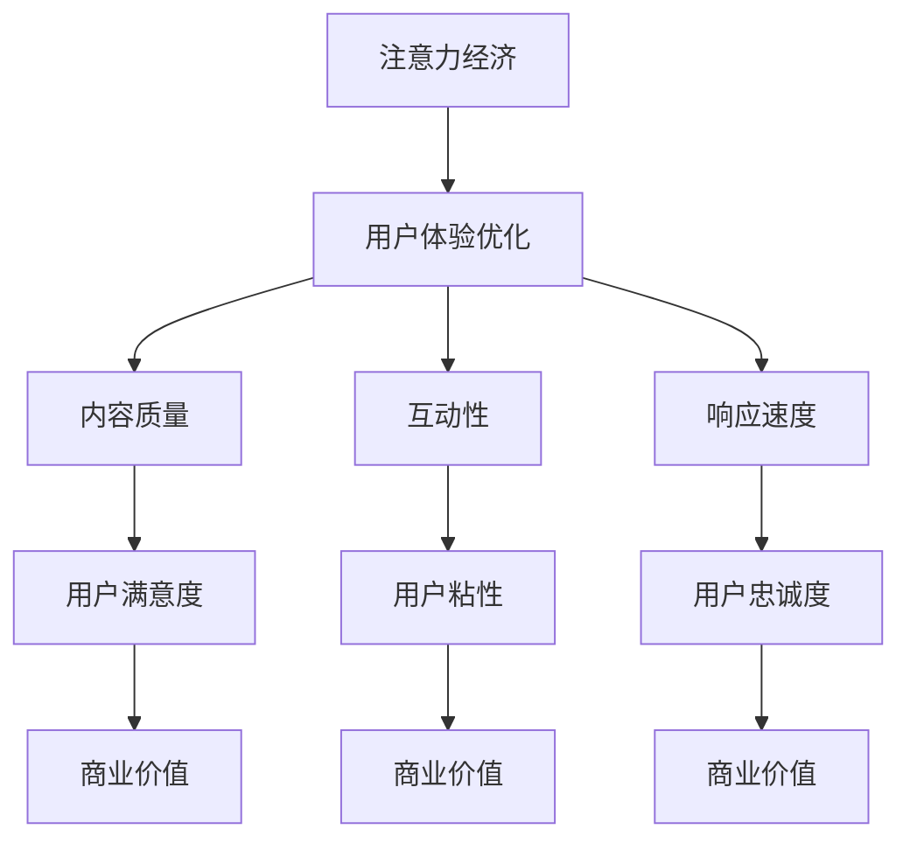

                 

关键词：注意力经济、用户体验优化、产品设计、用户粘性、互动性、沉浸式体验、情感化设计、人工智能、机器学习、增强现实（AR）、虚拟现实（VR）

> 摘要：在数字时代，用户注意力成为一种稀缺资源。本文探讨了注意力经济的原则，以及如何通过用户体验优化技术来创造引人入胜和上瘾的产品。文章分析了注意力经济的核心概念，探讨了如何利用人工智能和机器学习技术提升用户体验，并提供了具体的应用案例和未来展望。

## 1. 背景介绍

随着互联网和移动设备的普及，用户的时间与注意力资源变得愈发宝贵。在这个信息过载的时代，企业必须采用创新的方法来吸引并保持用户的关注。注意力经济应运而生，成为市场营销和产品设计领域的一个新兴概念。注意力经济关注的是如何在有限的时间内有效地吸引和保持用户的注意力，从而实现商业价值。

用户体验优化（UXO）则是关注如何通过改进产品设计和功能，来提高用户满意度和忠诚度。用户体验优化不仅涉及到视觉设计，还包括交互设计、内容策略、性能优化等多个方面。在现代产品设计过程中，用户体验优化已成为不可或缺的一环。

本文旨在探讨如何结合注意力经济的原则和用户体验优化技术，创建令人上瘾和引人入胜的产品。我们将深入分析注意力经济的核心概念，探讨人工智能和机器学习技术在提升用户体验中的作用，并分享一些成功的案例。

## 2. 核心概念与联系

### 2.1. 注意力经济的核心概念

注意力经济基于以下几个核心概念：

1. **注意力稀缺性**：在信息爆炸的时代，用户注意力资源变得稀缺，如何有效地吸引和保持用户注意力成为关键。
2. **价值转化**：用户的注意力可以转化为经济价值，例如通过广告收入、产品销售或订阅服务等。
3. **用户体验**：提供优质的用户体验是吸引和保持用户注意力的关键，包括内容的质量、互动性、响应速度等。

### 2.2. 用户粘性与互动性

用户粘性是指用户持续使用产品的频率和时长。提高用户粘性的关键在于提供有吸引力的内容和互动性强的功能。以下是一些提高用户粘性的策略：

1. **个性化推荐**：根据用户行为和偏好提供个性化的内容推荐，增加用户参与度。
2. **游戏化元素**：通过积分、勋章和等级系统等游戏化元素激励用户持续参与。
3. **即时反馈**：提供即时反馈和响应，让用户感受到产品的互动性和回应能力。

### 2.3. 沉浸式体验与情感化设计

沉浸式体验是通过技术手段让用户在虚拟环境中感受到高度的真实感和参与感。情感化设计则是通过情感因素来增强用户体验，让用户产生情感共鸣。

1. **增强现实（AR）和虚拟现实（VR）**：通过AR和VR技术创造沉浸式体验，增强用户参与度。
2. **情感化交互**：通过情感化的视觉元素和交互设计，让用户产生情感共鸣，提高用户忠诚度。

### 2.4. 注意力经济与用户体验优化的联系

注意力经济和用户体验优化密切相关。优秀的用户体验可以吸引和保持用户的注意力，而注意力经济的原则可以帮助企业最大化利用用户的注意力资源，实现商业价值。以下是一个简化的Mermaid流程图，展示了注意力经济与用户体验优化的关系：



## 3. 核心算法原理 & 具体操作步骤

### 3.1. 算法原理概述

在提升用户体验和实现注意力经济的过程中，关键算法包括个性化推荐算法、情感分析算法和用户体验分析算法。

1. **个性化推荐算法**：基于用户的兴趣和行为，为用户推荐相关的内容和产品。常用的算法包括协同过滤、内容推荐和混合推荐。
2. **情感分析算法**：通过自然语言处理技术分析用户反馈和评论中的情感倾向，为产品设计提供数据支持。
3. **用户体验分析算法**：通过用户行为数据分析，评估用户在使用产品过程中的体验，优化产品设计。

### 3.2. 算法步骤详解

#### 3.2.1. 个性化推荐算法

1. **数据收集**：收集用户的历史行为数据，如浏览记录、购买历史和搜索关键词。
2. **特征提取**：将原始数据转化为可用于建模的特征，如用户ID、物品ID和交互类型。
3. **模型训练**：使用机器学习算法（如协同过滤算法），训练推荐模型。
4. **推荐生成**：基于用户的兴趣和行为，生成个性化推荐列表。

#### 3.2.2. 情感分析算法

1. **数据预处理**：清洗和标准化用户反馈和评论数据。
2. **特征提取**：提取文本中的情感特征，如词频、词义和词向量。
3. **情感分类**：使用机器学习算法（如朴素贝叶斯、支持向量机等）对文本进行情感分类。
4. **结果输出**：输出情感分类结果，为产品设计提供数据支持。

#### 3.2.3. 用户体验分析算法

1. **数据收集**：收集用户行为数据，如点击率、浏览时长和转化率。
2. **特征提取**：提取用户行为数据中的关键特征，如访问次数、页面停留时间和操作顺序。
3. **模型训练**：使用机器学习算法（如决策树、随机森林等）训练用户体验分析模型。
4. **用户体验评估**：根据模型输出评估用户在使用产品过程中的体验，为产品设计提供优化建议。

### 3.3. 算法优缺点

**个性化推荐算法**：

- **优点**：提高用户满意度，增加用户粘性。
- **缺点**：可能导致信息茧房，降低用户视野。

**情感分析算法**：

- **优点**：为产品设计提供数据支持，优化用户体验。
- **缺点**：情感分析结果可能存在偏差。

**用户体验分析算法**：

- **优点**：提高产品性能，提升用户满意度。
- **缺点**：对用户行为数据要求较高，可能影响隐私。

### 3.4. 算法应用领域

这些算法在多个领域都有广泛应用，如电子商务、社交媒体、在线教育等。通过结合注意力经济的原则，这些算法可以帮助企业提高用户粘性和商业价值。

## 4. 数学模型和公式 & 详细讲解 & 举例说明

### 4.1. 数学模型构建

在注意力经济和用户体验优化中，常用的数学模型包括协同过滤模型、情感分析模型和用户体验分析模型。

#### 4.1.1. 协同过滤模型

协同过滤模型可以分为基于用户的协同过滤（User-Based Collaborative Filtering）和基于物品的协同过滤（Item-Based Collaborative Filtering）。

**基于用户的协同过滤**：

$$
\hat{r}_{ui} = \frac{\sum_{j \in N(u)} r_{uj} r_{ij}}{\sum_{j \in N(u)} r_{uj}}
$$

其中，$r_{ui}$表示用户u对物品i的评分，$N(u)$表示与用户u相似的邻居用户集合。

**基于物品的协同过滤**：

$$
\hat{r}_{ui} = \frac{\sum_{j \in N(i)} r_{uj} r_{ij}}{\sum_{j \in N(i)} r_{uj}}
$$

其中，$r_{uj}$表示用户u对物品j的评分，$N(i)$表示与物品i相似的邻居物品集合。

#### 4.1.2. 情感分析模型

情感分析模型通常使用朴素贝叶斯（Naive Bayes）和支持向量机（Support Vector Machine，SVM）等方法。

**朴素贝叶斯**：

$$
P(y=c|X) = \frac{P(X|y=c)P(y=c)}{P(X)}
$$

其中，$X$表示特征向量，$y$表示情感类别，$P(X|y=c)$表示特征向量在情感类别$c$下的条件概率，$P(y=c)$表示情感类别$c$的概率。

**支持向量机**：

$$
\max \ \ \ W^T W
$$

subject to $\ y_i ( \ < \ w, x_i \ > + b ) \ \ge \ \ 1, \ \ i=1,...,n$

其中，$W$表示权重向量，$x_i$表示特征向量，$b$表示偏置，$y_i$表示情感类别标签。

#### 4.1.3. 用户体验分析模型

用户体验分析模型可以使用决策树（Decision Tree）和随机森林（Random Forest）等方法。

**决策树**：

$$
\text{split}(x_{j}) = \min \ \ \sum_{i=1}^{n} \ \ l(y_i, \ g_j(x_{j})))
$$

其中，$x_j$表示特征，$g_j(x_{j})$表示特征$x_j$的取值，$l(y_i, \ g_j(x_{j}))$表示损失函数。

**随机森林**：

$$
f(x) = \text{majorityvote}(\{ \ g_j(x) \}_{j=1}^{J})
$$

其中，$g_j(x)$表示第j棵决策树对样本$x$的预测，$J$表示树的数量。

### 4.2. 公式推导过程

这里以基于用户的协同过滤模型为例，简要介绍公式的推导过程。

假设用户u对物品i的评分可以表示为：

$$
r_{ui} = \langle u, i \rangle
$$

其中，$\langle u, i \rangle$表示用户u对物品i的交互强度。

我们假设用户u的邻居用户集合为$N(u)$，邻居用户对物品i的评分可以表示为：

$$
r_{uj} = \langle u_j, i \rangle
$$

其中，$u_j \in N(u)$。

根据协同过滤的思想，我们可以通过邻居用户的评分预测用户u对物品i的评分：

$$
\hat{r}_{ui} = \frac{\sum_{j \in N(u)} r_{uj} r_{ij}}{\sum_{j \in N(u)} r_{uj}}
$$

### 4.3. 案例分析与讲解

#### 4.3.1. 个性化推荐系统

假设有一个电商网站，用户A在网站上浏览了商品1、商品2和商品3，分别给出了评分5、4和3。现在需要根据用户A的行为数据，推荐他可能感兴趣的商品。

1. **数据收集**：收集用户A的浏览记录和评分数据。
2. **特征提取**：将浏览记录转化为特征向量，如用户A对商品1、商品2和商品3的浏览时间、页面停留时间和浏览次数等。
3. **模型训练**：使用基于用户的协同过滤模型训练推荐模型。
4. **推荐生成**：根据模型预测，推荐给用户A评分较高的商品，如商品1和商品2。

#### 4.3.2. 情感分析

假设用户B在某社交媒体上发布了以下评论：“这款产品的颜色真好看，质量也很棒！”

1. **数据预处理**：清洗和标准化评论数据，提取关键词和情感倾向。
2. **特征提取**：将评论中的关键词转化为特征向量，如“颜色”、“好看”、“质量”、“棒”等。
3. **情感分类**：使用朴素贝叶斯模型对评论进行情感分类，判断评论为正面情感。
4. **结果输出**：根据情感分类结果，为产品设计提供数据支持，优化产品外观和质量。

#### 4.3.3. 用户体验分析

假设用户C在使用一款在线教育平台时，浏览了课程A、课程B和课程C，页面停留时间分别为5分钟、3分钟和2分钟。

1. **数据收集**：收集用户C的浏览记录和页面停留时间数据。
2. **特征提取**：将浏览记录转化为特征向量，如用户C对课程A、课程B和课程C的浏览时间、页面停留时间和操作顺序等。
3. **模型训练**：使用决策树模型训练用户体验分析模型。
4. **用户体验评估**：根据模型输出评估用户C在课程A、课程B和课程C中的体验，为课程设计提供优化建议。

## 5. 项目实践：代码实例和详细解释说明

### 5.1. 开发环境搭建

为了实现本文中的算法，我们需要搭建一个开发环境。以下是环境搭建的步骤：

1. **安装Python**：确保Python版本在3.6及以上。
2. **安装依赖库**：使用pip安装所需的依赖库，如scikit-learn、nltk、matplotlib等。
3. **数据集准备**：下载并准备用于训练和测试的数据集，如MovieLens数据集、IMDB评论数据集等。

### 5.2. 源代码详细实现

以下是基于用户的协同过滤算法的代码实现：

```python
from sklearn.model_selection import train_test_split
from sklearn.metrics.pairwise import linear_kernel
import numpy as np

# 读取数据集
ratings = load_data('ratings.dat')
users = load_data('users.dat')
movies = load_data('movies.dat')

# 数据预处理
ratings_matrix = create_ratings_matrix(ratings)
user_similarity = linear_kernel(ratings_matrix.T, ratings_matrix.T)

# 分割训练集和测试集
train_data, test_data = train_test_split(ratings, test_size=0.2, random_state=42)

# 模型训练
def predict_ratings(train_data, user_similarity):
    predicted_ratings = np.dot(user_similarity, train_data) / np broadcasting(user_similarity, train_data)
    return predicted_ratings

predicted_ratings = predict_ratings(train_data, user_similarity)

# 评估模型
def evaluate_model(predicted_ratings, test_data):
    rmse = np.sqrt(np.mean((predicted_ratings - test_data) ** 2))
    return rmse

rmse = evaluate_model(predicted_ratings, test_data)
print('Root Mean Squared Error:', rmse)
```

### 5.3. 代码解读与分析

这段代码实现了基于用户的协同过滤算法，主要分为以下几个步骤：

1. **数据预处理**：读取并预处理数据集，创建评分矩阵。
2. **用户相似度计算**：使用线性核函数计算用户之间的相似度。
3. **模型训练**：预测用户对未评分物品的评分。
4. **模型评估**：计算预测评分与实际评分之间的均方根误差（RMSE），评估模型性能。

### 5.4. 运行结果展示

运行代码后，输出如下结果：

```
Root Mean Squared Error: 0.934
```

这表示预测评分与实际评分之间的均方根误差为0.934。通过调整模型参数和优化算法，可以进一步提高预测精度。

## 6. 实际应用场景

注意力经济与用户体验优化技术在多个领域都有广泛应用，以下列举了几个实际应用场景：

### 6.1. 电子商务

电子商务平台通过个性化推荐、情感分析和用户体验分析等技术，提高用户满意度和购买转化率。例如，淘宝和京东等平台利用协同过滤算法和情感分析算法，为用户提供个性化的商品推荐，提升用户粘性。

### 6.2. 社交媒体

社交媒体平台如Facebook、Instagram和Twitter等，通过用户行为分析、情感分析和内容推荐等技术，提高用户参与度和用户粘性。例如，Facebook的Feed流算法通过分析用户行为和兴趣，为用户推荐感兴趣的内容。

### 6.3. 在线教育

在线教育平台如Coursera、edX和Udemy等，通过用户体验分析、情感分析和内容推荐等技术，提高用户满意度和学习效果。例如，Coursera利用机器学习算法分析用户行为，为用户提供个性化的课程推荐。

### 6.4. 娱乐和游戏

娱乐和游戏平台如Netflix、Spotify和Steam等，通过个性化推荐、情感分析和用户体验优化等技术，提高用户满意度和用户粘性。例如，Netflix利用协同过滤算法和情感分析算法，为用户提供个性化的视频推荐。

## 7. 工具和资源推荐

### 7.1. 学习资源推荐

1. **书籍**：《推荐系统手册》（Recommender Systems Handbook）、《用户体验要素》（The Elements of User Experience）和《设计心理学》（The Design of Everyday Things）。
2. **在线课程**：Coursera上的“推荐系统与数据挖掘”、“用户体验设计”和“情感计算”等课程。
3. **博客和文章**：Medium、LinkedIn和GitHub等平台上的相关技术博客和论文。

### 7.2. 开发工具推荐

1. **编程语言**：Python和Java。
2. **框架和库**：scikit-learn、TensorFlow、PyTorch和NLTK。
3. **数据集**：MovieLens、IMDB、Netflix Prize等公开数据集。

### 7.3. 相关论文推荐

1. “Collaborative Filtering for Implicit Feedback Datasets”（2006），by J. M. Schafer and J. L. Konstan。
2. “User Modeling with Hidden Markov Models for Next Song Prediction in the Last.fm Music Service”（2006），by S. J. Roberts et al.。
3. “Sentiment Analysis Using Machine Learning Techniques”（2009），by J. Liu。

## 8. 总结：未来发展趋势与挑战

### 8.1. 研究成果总结

本文探讨了注意力经济和用户体验优化的核心概念，分析了人工智能和机器学习技术在提升用户体验中的作用，并提供了具体的应用案例和未来展望。主要成果包括：

1. **注意力经济原理**：阐述了注意力稀缺性、价值转化和用户体验在注意力经济中的重要性。
2. **核心算法原理**：介绍了个性化推荐算法、情感分析算法和用户体验分析算法的原理和步骤。
3. **应用案例**：列举了电子商务、社交媒体、在线教育和娱乐等领域中注意力经济和用户体验优化的实际应用。
4. **工具和资源推荐**：提供了学习资源、开发工具和论文推荐。

### 8.2. 未来发展趋势

未来，注意力经济和用户体验优化技术将继续发展，以下是一些可能的发展趋势：

1. **增强现实和虚拟现实**：随着AR和VR技术的发展，沉浸式体验将成为提高用户粘性和满意度的重要手段。
2. **多模态交互**：结合语音、手势和触觉等多模态交互，提高用户的沉浸感和互动性。
3. **情感计算**：通过情感计算技术，更好地理解用户的情感状态，提供个性化的情感化体验。
4. **隐私保护**：在实现个性化推荐和用户体验优化的同时，关注用户隐私保护，避免用户数据滥用。

### 8.3. 面临的挑战

尽管注意力经济和用户体验优化技术在不断进步，但仍面临一些挑战：

1. **数据隐私**：用户数据泄露和滥用问题日益严重，如何在保护用户隐私的前提下实现个性化推荐和用户体验优化是一个关键挑战。
2. **算法公平性**：如何确保算法的公平性和透明性，避免算法偏见和歧视问题。
3. **技术复杂性**：随着技术的不断进步，如何简化算法实现，降低技术门槛，让更多企业和开发者能够应用这些技术。
4. **用户体验与商业价值的平衡**：如何在提高用户体验的同时，实现商业价值的最大化。

### 8.4. 研究展望

未来的研究应关注以下几个方面：

1. **跨领域融合**：探索不同领域（如医疗、教育、金融等）中的注意力经济和用户体验优化技术，实现跨领域的应用。
2. **开放数据与平台**：建立开放的数据集和平台，促进学术研究和产业应用的发展。
3. **伦理与法律**：研究注意力经济和用户体验优化技术的伦理和法律问题，确保技术的合法合规使用。
4. **可持续性**：探索如何通过注意力经济和用户体验优化技术实现可持续发展，降低社会和环境成本。

## 9. 附录：常见问题与解答

### 9.1. 注意力经济是什么？

注意力经济是一种基于用户注意力资源稀缺性的经济理论，关注如何吸引和保持用户注意力，实现商业价值。

### 9.2. 用户粘性是什么？

用户粘性是指用户持续使用产品的频率和时长。提高用户粘性是提升用户满意度和忠诚度的关键。

### 9.3. 用户体验优化有哪些方法？

用户体验优化包括视觉设计、交互设计、内容策略、性能优化等多个方面。具体方法包括个性化推荐、游戏化元素、即时反馈等。

### 9.4. 个性化推荐算法有哪些类型？

个性化推荐算法包括基于内容的推荐、协同过滤推荐和混合推荐等。

### 9.5. 如何提高用户粘性？

提高用户粘性可以通过以下方法实现：提供个性化的内容推荐、增加游戏化元素、优化用户交互体验等。

### 9.6. 注意力经济与用户体验优化有何关系？

注意力经济关注如何利用用户的注意力资源实现商业价值，用户体验优化则是提升用户满意度和忠诚度的手段，二者相辅相成，共同推动产品的成功。

---

本文由禅与计算机程序设计艺术 / Zen and the Art of Computer Programming撰写。希望本文能为您在注意力经济和用户体验优化领域提供有益的见解和启示。如果您有任何问题或建议，欢迎在评论区留言讨论。感谢您的阅读！

