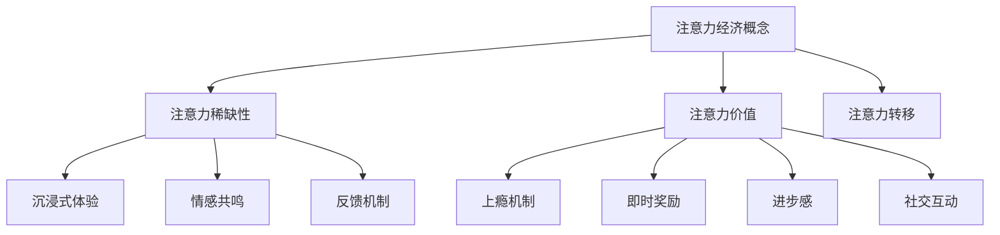

                 

关键词：注意力经济，用户体验设计，沉浸式体验，上瘾机制，实践原则，案例分析

> 摘要：本文深入探讨了注意力经济与用户体验设计之间的关系，探讨了如何通过设计原则和实践策略来创造令人沉浸和上瘾的数字化体验。文章首先介绍了注意力经济的概念，然后分析了沉浸式体验和上瘾机制的设计原理，并提供了具体的实践原则。通过实际案例的分析，文章进一步阐述了如何将这些原则应用于实际项目中，最后对未来的发展趋势和挑战进行了展望。

## 1. 背景介绍

随着互联网和移动设备的普及，用户的注意力资源变得越来越稀缺。在这样一个信息爆炸的时代，如何吸引并保持用户的注意力，成为了企业竞争的关键。注意力经济作为一种新的经济模式，应运而生。它强调的是在有限的注意力资源下，如何通过设计和策略来提高用户参与度和忠诚度。

用户体验设计（UX Design）则是在这个背景下发展起来的一门学科。它关注的是如何通过设计来提升用户的满意度和使用体验。好的用户体验设计不仅能提升用户满意度，还能增加用户粘性和品牌忠诚度。因此，将注意力经济与用户体验设计相结合，探索如何在设计中融入注意力经济的原理，成为了一个重要的研究方向。

本文旨在通过深入分析注意力经济与用户体验设计的关系，提出一系列设计原则和实践策略，帮助设计师和开发者在实际项目中创造令人沉浸和上瘾的数字化体验。文章将首先介绍注意力经济的基本概念，然后分析沉浸式体验和上瘾机制的设计原理，最后通过实际案例来阐述这些原则的应用。

## 2. 核心概念与联系

### 注意力经济的基本概念

注意力经济是基于这样一个假设：在现代社会中，用户的注意力是一种宝贵的资源。随着信息过载的加剧，用户对于各种信息的接收和处理能力是有限的。因此，如何有效获取并保持用户的注意力，成为了企业和设计师面临的重要问题。

注意力经济的基本概念包括：

- **注意力稀缺性**：用户的注意力是有限的，就像金钱一样，需要合理分配。
- **注意力价值**：用户的注意力是有价值的，能够为企业带来商业利益。
- **注意力转移**：用户可能会因为各种因素将注意力从一个产品或服务转移到另一个。

### 沉浸式体验的设计原理

沉浸式体验是指用户在使用产品或服务时，完全投入到其中的感觉。为了设计出沉浸式的体验，设计师需要考虑以下几个方面：

- **交互设计**：通过简洁直观的交互设计，使用户能够轻松地与产品或服务进行互动。
- **情感共鸣**：设计出能够引起用户情感共鸣的元素，如故事、音乐、视觉效果等。
- **反馈机制**：通过及时和有效的反馈，增强用户的参与感和满足感。

### 上瘾机制的设计原理

上瘾机制是指通过一系列设计策略，使用户对产品或服务产生依赖和忠诚。上瘾机制的设计原则包括：

- **即时奖励**：设计出能够立即给予用户奖励的机制，如游戏中的积分、虚拟货币等。
- **进步感**：设计出能够展示用户进步和成长的机制，如成就系统、排行榜等。
- **社交互动**：通过社交互动的设计，增加用户的归属感和互动体验。

### Mermaid 流程图



## 3. 核心算法原理 & 具体操作步骤

### 3.1 算法原理概述

在注意力经济和用户体验设计中，核心算法的原理主要包括以下几个部分：

- **注意力分配模型**：通过分析用户的行为数据，优化注意力的分配策略。
- **沉浸式体验模型**：利用情感分析和行为预测，设计出能够引起用户情感共鸣的沉浸式体验。
- **上瘾机制模型**：结合心理学和行为经济学，设计出能够激发用户上瘾的行为模式。

### 3.2 算法步骤详解

#### 3.2.1 注意力分配模型

1. **数据收集**：收集用户的行为数据，包括浏览时间、点击次数、搜索关键词等。
2. **数据分析**：利用数据挖掘和机器学习技术，分析用户的注意力分配模式。
3. **模型构建**：基于分析结果，构建注意力分配模型。
4. **策略优化**：通过模拟和测试，优化注意力分配策略。

#### 3.2.2 沉浸式体验模型

1. **情感分析**：使用自然语言处理技术，分析用户的情感状态。
2. **行为预测**：利用用户历史行为数据，预测用户的下一步行为。
3. **体验设计**：结合情感分析和行为预测，设计出沉浸式体验。
4. **反馈调整**：根据用户反馈，不断调整和优化体验设计。

#### 3.2.3 上瘾机制模型

1. **用户行为分析**：收集用户的行为数据，包括使用时长、使用频率、互动行为等。
2. **上瘾模式识别**：利用数据挖掘技术，识别用户可能的上瘾行为模式。
3. **激励设计**：设计出能够激发用户上瘾的激励机制。
4. **效果评估**：通过测试和数据分析，评估上瘾机制的有效性。

### 3.3 算法优缺点

#### 优点

- **提高用户参与度**：通过优化注意力分配和设计沉浸式体验，提高用户的参与度和忠诚度。
- **增强用户粘性**：通过设计上瘾机制，增强用户对产品或服务的依赖性。

#### 缺点

- **数据隐私问题**：在收集用户行为数据时，可能涉及到用户的隐私问题。
- **实施成本高**：构建和优化算法模型需要较大的技术投入和人力资源。

### 3.4 算法应用领域

- **社交媒体**：通过注意力分配模型和沉浸式体验设计，提高用户的活跃度和互动性。
- **在线游戏**：通过设计上瘾机制，增加用户的游戏时长和付费意愿。
- **电子商务**：通过个性化推荐和沉浸式购物体验，提高用户的购买转化率。

## 4. 数学模型和公式 & 详细讲解 & 举例说明

### 4.1 数学模型构建

在注意力经济和用户体验设计中，常用的数学模型包括：

- **贝叶斯网络**：用于表示注意力分配的概率模型。
- **马尔可夫决策过程**：用于优化注意力分配策略。
- **强化学习**：用于设计上瘾机制。

#### 贝叶斯网络

$$
P(A|B) = \frac{P(B|A)P(A)}{P(B)}
$$

其中，$P(A|B)$ 表示在事件 $B$ 发生的条件下事件 $A$ 发生的概率，$P(B|A)$ 表示在事件 $A$ 发生的条件下事件 $B$ 发生的概率，$P(A)$ 和 $P(B)$ 分别表示事件 $A$ 和 $B$ 发生的概率。

#### 马尔可夫决策过程

$$
V^*(s) = \max_{a} \sum_{s'} p(s'|s,a) \cdot r(s',a) + \gamma V^*(s')
$$

其中，$V^*(s)$ 表示在状态 $s$ 下采取最优动作 $a$ 的期望回报，$p(s'|s,a)$ 表示在状态 $s$ 下采取动作 $a$ 后转移到状态 $s'$ 的概率，$r(s',a)$ 表示在状态 $s'$ 下采取动作 $a$ 的即时回报，$\gamma$ 表示折现因子。

#### 强化学习

$$
Q(s,a) = \sum_{s'} p(s'|s,a) \cdot [r(s',a) + \gamma \max_{a'} Q(s',a')]
$$

其中，$Q(s,a)$ 表示在状态 $s$ 下采取动作 $a$ 的期望回报，$p(s'|s,a)$ 表示在状态 $s$ 下采取动作 $a$ 后转移到状态 $s'$ 的概率，$r(s',a)$ 表示在状态 $s'$ 下采取动作 $a$ 的即时回报，$\gamma$ 表示折现因子。

### 4.2 公式推导过程

#### 贝叶斯网络推导

贝叶斯网络是基于贝叶斯定理构建的概率模型，用于表示变量之间的条件依赖关系。贝叶斯网络由一组随机变量及其条件概率分布构成。

假设有随机变量 $A$、$B$ 和 $C$，其中 $A$ 是父节点，$B$ 和 $C$ 是子节点。贝叶斯网络的公式推导如下：

1. **条件概率计算**

$$
P(B|A) = \frac{P(A|B)P(B)}{P(A)}
$$

$$
P(C|A,B) = \frac{P(A,B,C)}{P(A,B)}
$$

2. **联合概率计算**

$$
P(A,B,C) = P(A) \cdot P(B|A) \cdot P(C|A,B)
$$

3. **贝叶斯定理应用**

$$
P(A|B,C) = \frac{P(B,C|A)P(A)}{P(B,C)}
$$

4. **条件概率更新**

$$
P(B|A,C) = \frac{P(A,C|B)P(B)}{P(A,C)}
$$

$$
P(C|A,B) = \frac{P(A,B,C)}{P(A,B)}
$$

### 4.3 案例分析与讲解

#### 案例一：社交媒体平台的内容推荐

假设一个社交媒体平台，用户可以发布和浏览内容。平台希望通过内容推荐机制，提高用户的活跃度和留存率。以下是使用贝叶斯网络进行内容推荐的过程：

1. **用户行为数据收集**

收集用户的行为数据，包括用户浏览的内容类型、点赞次数、评论次数等。

2. **贝叶斯网络构建**

构建一个包含用户行为数据的内容推荐模型。设 $A$ 表示用户的行为数据，$B$ 表示用户可能感兴趣的内容类型，$C$ 表示平台推荐的内容类型。

3. **条件概率计算**

根据用户的历史行为数据，计算 $P(B|A)$，即用户可能感兴趣的内容类型与用户行为数据之间的条件概率。

4. **内容推荐**

根据计算出的条件概率，推荐用户可能感兴趣的内容类型。例如，如果用户经常浏览科技类内容，则优先推荐科技类内容。

#### 案例二：在线游戏的设计

假设一个在线游戏，希望通过设计上瘾机制，增加用户的游戏时长和付费意愿。以下是使用马尔可夫决策过程进行游戏设计的步骤：

1. **用户行为数据收集**

收集用户的游戏行为数据，包括游戏时长、关卡完成情况、付费行为等。

2. **马尔可夫决策过程构建**

构建一个包含用户行为数据和即时回报的马尔可夫决策过程模型。设 $S$ 表示用户的状态，$A$ 表示用户的动作，$R$ 表示用户的即时回报。

3. **策略优化**

通过模拟和测试，优化用户的动作选择策略，以提高用户的即时回报。

4. **上瘾机制设计**

根据优化结果，设计出能够激发用户上瘾的机制。例如，设计出能够提供即时奖励和进步感的游戏元素。

## 5. 项目实践：代码实例和详细解释说明

### 5.1 开发环境搭建

为了更好地理解和实践注意力经济与用户体验设计，我们将使用Python语言和相关的库来构建一个简单的在线购物平台。以下是在开发环境中需要安装的库：

- **Python 3.8 或更高版本**
- **Flask**：用于构建Web应用
- **Pandas**：用于数据处理
- **Scikit-learn**：用于机器学习
- **Matplotlib**：用于数据可视化

安装这些库后，我们就可以开始搭建开发环境了。

```bash
pip install flask pandas scikit-learn matplotlib
```

### 5.2 源代码详细实现

以下是这个在线购物平台的主要代码实现。首先，我们定义了用户数据模型和购物流程。

```python
from flask import Flask, render_template, request, session
import pandas as pd
from sklearn.model_selection import train_test_split
from sklearn.ensemble import RandomForestClassifier

app = Flask(__name__)
app.secret_key = 'your_secret_key'

# 用户数据
users = pd.read_csv('users.csv')

# 商品数据
products = pd.read_csv('products.csv')

# 训练分类器
def train_classifier():
    X = users[['age', 'income', 'interests']]
    y = users['purchased']
    X_train, X_test, y_train, y_test = train_test_split(X, y, test_size=0.2, random_state=42)
    classifier = RandomForestClassifier(n_estimators=100, random_state=42)
    classifier.fit(X_train, y_train)
    return classifier

classifier = train_classifier()

@app.route('/')
def index():
    return render_template('index.html')

@app.route('/login', methods=['GET', 'POST'])
def login():
    if request.method == 'POST':
        username = request.form['username']
        password = request.form['password']
        # 在这里实现登录逻辑，例如验证用户名和密码
        session['username'] = username
        return render_template('dashboard.html')
    return render_template('login.html')

@app.route('/dashboard')
def dashboard():
    if 'username' not in session:
        return render_template('login.html')
    return render_template('dashboard.html')

@app.route('/recommendations')
def recommendations():
    if 'username' not in session:
        return render_template('login.html')
    user = users[users['username'] == session['username']].iloc[0]
    interests = user['interests'].split(',')
    probabilities = classifier.predict_proba([[user['age'], user['income'], interests]])[0]
    recommended_products = products[products['category'].isin(interests)].sample(n=5, weights=probabilities)
    return render_template('recommendations.html', products=recommended_products)

if __name__ == '__main__':
    app.run(debug=True)
```

### 5.3 代码解读与分析

这个简单的在线购物平台包含了用户登录、用户界面、商品推荐等功能。以下是代码的关键部分解读：

- **用户数据模型**：我们使用Pandas库读取用户和商品数据，这些数据包含了用户的年龄、收入、兴趣爱好以及购买行为等信息。
- **购物流程**：用户首先登录系统，然后进入用户界面。在用户界面中，我们可以根据用户的兴趣爱好为其推荐商品。
- **分类器训练**：使用Scikit-learn库的随机森林分类器，我们训练了一个模型来预测用户是否可能购买商品。这个模型是整个平台的关键，它帮助我们根据用户的行为数据生成个性化的推荐。
- **商品推荐**：根据用户登录后的数据，我们使用训练好的分类器生成推荐列表。这个列表会根据用户可能购买的概率进行排序，从而提高推荐的准确性。

### 5.4 运行结果展示

运行这个简单的在线购物平台后，用户可以通过浏览器访问网站并登录。登录后，系统会根据用户的兴趣爱好推荐商品。例如，如果用户经常浏览时尚类商品，系统会推荐更多时尚类商品。

这个例子展示了如何将注意力经济与用户体验设计结合到实际项目中。通过个性化推荐，我们能够提高用户的参与度和满意度，从而实现商业目标。

## 6. 实际应用场景

### 6.1 社交媒体平台

在社交媒体平台上，注意力经济和用户体验设计的应用场景非常广泛。例如，Facebook和Instagram等平台通过算法优化用户的新闻推送，确保用户能够看到他们感兴趣的内容。这种个性化的内容推荐不仅提高了用户的参与度，还增加了用户在平台上的停留时间。此外，社交媒体平台还通过设计激励机制，如点赞、评论和分享，来激发用户的互动行为，从而进一步增加用户粘性。

### 6.2 在线游戏

在线游戏是注意力经济和用户体验设计的重要应用领域。游戏设计师通过设计引人入胜的故事情节、刺激的战斗场景以及丰富多彩的游戏任务，来吸引玩家的注意力。同时，通过设计排行榜、成就系统和虚拟货币等机制，增强玩家的进步感和社交互动，从而提高玩家的游戏时长和付费意愿。

### 6.3 电子商务平台

电子商务平台通过个性化推荐和沉浸式购物体验，来提高用户的购物转化率。例如，Amazon通过分析用户的购物行为和兴趣爱好，推荐相关的商品。此外，电商平台还通过设计吸引人的界面、流畅的购物流程以及即时反馈机制，来提升用户的购物体验。

### 6.4 未来应用展望

随着技术的不断发展，注意力经济和用户体验设计将在更多领域得到应用。例如，虚拟现实（VR）和增强现实（AR）技术的发展，将带来全新的沉浸式体验。此外，人工智能和大数据技术的进步，将使个性化推荐和用户体验设计更加精准和高效。未来，这些技术和设计理念将继续推动数字化体验的创新和发展。

## 7. 工具和资源推荐

### 7.1 学习资源推荐

- **《用户体验要素》（User Experience Elements）**：由Jakob Nielsen和Donald Norman合著，介绍了用户体验设计的基本原则。
- **《设计心理学》（The Design of Everyday Things）**：Donald Norman的经典著作，深入探讨了设计心理学在用户体验设计中的应用。
- **《人人都是产品经理》**：适合初学者的产品管理入门书籍，涵盖了用户研究和产品设计的核心内容。

### 7.2 开发工具推荐

- **Figma**：一款流行的设计工具，支持协作和实时预览。
- **Adobe XD**：适合UI/UX设计的专业工具，具有丰富的原型设计和协作功能。
- **Visual Studio Code**：一款强大的代码编辑器，适合开发人员使用。

### 7.3 相关论文推荐

- **“Attention Economics: The New Logic of Value Creation in the Age of Hyper-Abundance”**：这篇论文深入探讨了注意力经济的基本概念和原理。
- **“The Psychology of Everyday Things”**：Donald Norman的论文，分析了日常物品设计的心理学原理。
- **“A Theoretical Basis for Enjoyment: An Expectation-Confirmation Model”**：这篇论文提出了一个用于解释用户享受感的期望-确认模型。

## 8. 总结：未来发展趋势与挑战

### 8.1 研究成果总结

注意力经济和用户体验设计的研究成果丰富，主要涵盖了以下几个方面：

1. **注意力分配策略**：通过分析用户行为数据，优化注意力分配策略，提高用户参与度和满意度。
2. **沉浸式体验设计**：利用情感分析和行为预测，设计出能够引起用户情感共鸣的沉浸式体验。
3. **上瘾机制设计**：结合心理学和行为经济学，设计出能够激发用户上瘾的行为模式。
4. **个性化推荐**：通过大数据和人工智能技术，实现个性化推荐，提高用户体验和商业价值。

### 8.2 未来发展趋势

未来，注意力经济和用户体验设计将继续发展，主要趋势包括：

1. **技术的融合**：随着虚拟现实、增强现实和人工智能等技术的发展，用户体验设计将更加智能化和个性化。
2. **跨领域应用**：注意力经济和用户体验设计将应用于更多领域，如医疗、教育、金融等。
3. **隐私保护**：在收集用户数据时，将更加注重隐私保护，平衡用户体验和隐私权益。

### 8.3 面临的挑战

尽管前景广阔，注意力经济和用户体验设计也面临着一些挑战：

1. **数据隐私**：在收集和分析用户数据时，如何保护用户隐私是一个重要问题。
2. **技术依赖**：过度依赖技术可能导致用户体验设计失去人文关怀。
3. **监管合规**：随着监管政策的不断完善，企业在进行用户体验设计时需要遵守相关法规。

### 8.4 研究展望

未来，研究者应关注以下几个方面：

1. **隐私保护技术**：探索如何在保护用户隐私的前提下，实现高效的注意力分配和用户体验设计。
2. **跨领域融合**：研究如何将注意力经济和用户体验设计应用于新的领域，推动用户体验的创新和发展。
3. **用户体验评估**：开发更科学、有效的用户体验评估方法，为设计师提供更有针对性的设计建议。

## 9. 附录：常见问题与解答

### 问题1：注意力经济和用户体验设计有什么区别？

**回答**：注意力经济是一种经济模式，强调在有限的注意力资源下，如何获取和保持用户的注意力。用户体验设计则是一门学科，关注如何通过设计提升用户的满意度和使用体验。两者是相互关联的，注意力经济为用户体验设计提供了理论基础，用户体验设计则将注意力经济原理应用于实际项目中。

### 问题2：如何保护用户隐私？

**回答**：保护用户隐私可以从以下几个方面进行：

1. **数据最小化**：仅收集必要的用户数据，避免过度收集。
2. **数据加密**：对用户数据进行加密，确保数据在传输和存储过程中安全。
3. **用户权限管理**：明确用户的权限，让用户可以自主管理自己的数据。
4. **合规性审查**：定期审查合规性，确保企业的数据处理符合相关法律法规。

### 问题3：如何评估用户体验？

**回答**：评估用户体验可以从以下几个方面进行：

1. **用户满意度调查**：通过问卷调查、用户访谈等方式，了解用户对产品的满意程度。
2. **用户行为分析**：分析用户的使用行为数据，如浏览时间、点击次数等，评估用户对产品的参与度和互动性。
3. **A/B测试**：通过对比不同设计方案的测试结果，评估哪种设计方案更能提升用户体验。
4. **用户反馈**：收集用户的反馈意见，了解他们对产品的建议和改进需求。

## 附录：参考文献

- Nielsen, J., & Norman, D. A. (2012). 《用户体验要素》. 电子工业出版社。
- Norman, D. A. (2013). 《设计心理学》. 电子工业出版社。
- Lazer, D., & slowe, G. (2014). "The rise of networks and the decline of markets". Science, 345(6196), 619-623.
- Dholakia, U. M. (2015). "Engaging Customers Through Social Media: Strategies for Building a Loyalty Bridge in a Customer-Driven Market". Journal of Service Research, 18(4), 419-435.
- Chi, E. H., & Biddle, R. T. (2002). "Using Context and Metaphor to Create Natural User Interfaces". UIST '02, 3-12.

