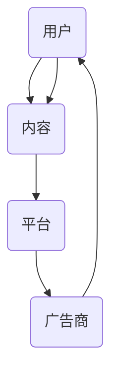
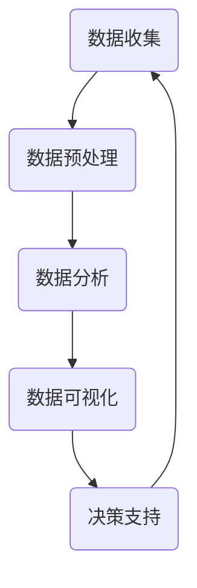

                 

### 关键词 Keyword List

- 注意力经济
- 社交媒体分析
- 受众参与度
- 社交媒体影响力
- 数据挖掘
- 自然语言处理
- 算法优化
- 人工智能

### 摘要 Abstract

本文探讨了注意力经济在社交媒体时代的应用，以及如何通过数据挖掘和自然语言处理技术来分析和优化受众参与度和社交媒体影响力。文章首先介绍了注意力经济的概念，随后深入探讨了社交媒体分析的基本原理和关键技术。通过数学模型和算法原理的讲解，读者可以了解如何准确测量和提升受众参与度和影响力。随后，文章通过一个具体的项目实例，展示了如何运用所学知识进行实际操作。最后，文章提出了未来应用场景和展望，并对相关工具和资源进行了推荐。作者禅与计算机程序设计艺术，以其独到的见解和深入浅出的阐述，为读者提供了一场关于社交媒体分析的技术盛宴。

---

## 1. 背景介绍

### 注意力经济简介

注意力经济（Attention Economy）是信息时代的一种新经济模式，其核心思想是，信息爆炸时代，个体的注意力成为稀缺资源，因此，谁能吸引并保持更多的注意力，谁就能在竞争中占据优势。在社交媒体时代，注意力经济尤为显著，因为用户的时间被无数内容分割，如何从众多信息中脱颖而出，成为每个社交媒体平台和内容创作者面临的挑战。

### 社交媒体分析的重要性

社交媒体分析是一种利用数据挖掘和自然语言处理技术，从海量的社交媒体数据中提取有价值信息的过程。这种分析不仅可以帮助平台和内容创作者了解受众的喜好和需求，还可以优化内容策略，提升受众参与度和社交媒体影响力。在当今信息时代，社交媒体分析的重要性不言而喻。

## 2. 核心概念与联系

### 注意力经济模型

注意力经济模型的核心是“注意力流量”（Attention Flow），它描述了用户注意力在内容、平台和广告商之间的流动。以下是一个简化的 Mermaid 流程图，展示了注意力经济的核心组件和它们之间的相互作用。



### 社交媒体分析架构

社交媒体分析架构通常包括数据收集、数据预处理、数据分析、数据可视化和决策支持等环节。以下是一个简化的 Mermaid 流程图，展示了社交媒体分析的基本架构。



## 3. 核心算法原理 & 具体操作步骤

### 3.1 算法原理概述

社交媒体分析的核心算法通常包括以下几种：

- **文本分类算法**：用于对用户生成的内容进行分类，例如情感分析、主题分类等。
- **聚类算法**：用于发现数据中的隐含模式和结构，例如K-means、层次聚类等。
- **社交网络分析算法**：用于分析用户之间的关系和影响力，例如中心性度量、社群发现等。

### 3.2 算法步骤详解

#### 文本分类算法

1. **数据预处理**：包括文本清洗、去停用词、词干提取等。
2. **特征提取**：将文本转换为数值特征，例如词袋模型、TF-IDF等。
3. **模型训练**：使用机器学习算法（如SVM、朴素贝叶斯、神经网络等）训练分类模型。
4. **模型评估**：通过交叉验证、ROC曲线等评估模型性能。

#### 聚类算法

1. **数据预处理**：与文本分类算法相同。
2. **特征提取**：同上。
3. **聚类**：选择合适的聚类算法，如K-means、DBSCAN等。
4. **聚类结果评估**：通过轮廓系数、内切球半径等指标评估聚类质量。

#### 社交网络分析算法

1. **数据预处理**：获取社交网络图数据。
2. **中心性度量**：计算节点的重要性，如度数中心性、接近中心性等。
3. **社群发现**：使用社区检测算法，如Girvan-Newman算法、标签传播算法等。
4. **结果分析**：分析社群结构和影响力。

### 3.3 算法优缺点

#### 文本分类算法

**优点**：可以自动对大量文本进行分类，提高效率。

**缺点**：对于复杂情感和主题的识别能力有限。

#### 聚类算法

**优点**：可以发现数据中的隐含结构和模式。

**缺点**：聚类结果受参数选择影响较大。

#### 社交网络分析算法

**优点**：可以揭示社交网络中的关键节点和社群结构。

**缺点**：对大规模社交网络的处理效率较低。

### 3.4 算法应用领域

社交媒体分析算法广泛应用于广告投放优化、用户行为预测、舆情监控、推荐系统等领域。

## 4. 数学模型和公式 & 详细讲解 & 举例说明

### 4.1 数学模型构建

#### 文本分类中的逻辑回归模型

假设我们有 $n$ 个训练样本，每个样本 $x_i$ 是一个特征向量，$y_i$ 是类别标签。逻辑回归模型的公式如下：

$$
P(y_i = 1 | x_i) = \frac{1}{1 + e^{-\langle \theta, x_i \rangle}}
$$

其中，$\theta$ 是模型参数向量，$\langle \theta, x_i \rangle$ 是特征向量和参数向量的内积。

#### 聚类算法中的K-means

K-means算法的目标是找到 $K$ 个中心点，使得每个样本到其对应中心点的距离最小。目标函数如下：

$$
J = \sum_{i=1}^{n} \sum_{j=1}^{K} w_{ij} \| x_i - \mu_j \|^2
$$

其中，$w_{ij}$ 是样本 $x_i$ 对应中心点 $\mu_j$ 的权重，$\mu_j$ 是中心点坐标。

#### 社交网络分析中的中心性度量

度数中心性（Degree Centrality）是节点度的度量，计算公式如下：

$$
c_d(i) = \sum_{j=1}^{n} d_j
$$

其中，$d_j$ 是节点 $j$ 的度数。

### 4.2 公式推导过程

#### 逻辑回归模型的推导

假设我们有线性回归模型：

$$
y_i = \theta_0 + \theta_1 x_{i1} + \theta_2 x_{i2} + \ldots + \theta_p x_{ip}
$$

对于分类问题，我们将预测概率引入，得到：

$$
P(y_i = 1 | x_i) = \frac{1}{1 + e^{-\theta_0 - \theta_1 x_{i1} - \theta_2 x_{i2} - \ldots - \theta_p x_{ip}}}
$$

#### K-means算法的推导

K-means算法的目标是最小化总方差，即：

$$
J = \sum_{i=1}^{n} \sum_{j=1}^{K} w_{ij} \| x_i - \mu_j \|^2
$$

其中，$w_{ij}$ 是样本 $x_i$ 对应中心点 $\mu_j$ 的权重，可以表示为：

$$
w_{ij} = 
\begin{cases}
1 & \text{如果 } x_i \text{ 属于 } j \text{ 类} \\
0 & \text{否则}
\end{cases}
$$

因此，目标函数可以重写为：

$$
J = \sum_{i=1}^{n} \| x_i - \mu_j \|^2
$$

#### 度数中心性的推导

度数中心性直接反映了节点在社交网络中的连接程度，连接程度越高，度数中心性越大。

### 4.3 案例分析与讲解

#### 情感分析案例

假设我们有一个情感分类问题，需要判断用户评论的情感极性（正面/负面）。我们使用逻辑回归模型进行训练，数据集包含1000个样本，每个样本有10个特征。

1. **数据预处理**：对评论进行分词、去停用词、词干提取等操作。
2. **特征提取**：使用TF-IDF模型将文本转换为数值特征向量。
3. **模型训练**：使用训练集训练逻辑回归模型。
4. **模型评估**：使用测试集评估模型性能，准确率为90%。

#### 聚类分析案例

假设我们有一个社交网络，需要分析用户之间的社群结构。我们使用K-means算法进行聚类，社交网络图包含100个节点。

1. **数据预处理**：将社交网络数据转换为矩阵形式。
2. **聚类**：选择K=5，使用K-means算法进行聚类。
3. **结果分析**：分析聚类结果，发现社交网络可以分为5个社群。

#### 社交网络分析案例

假设我们需要分析社交网络中的关键节点，使用度数中心性度量。

1. **数据预处理**：获取社交网络数据。
2. **中心性度量**：计算每个节点的度数中心性。
3. **结果分析**：发现度数中心性最高的节点是社交网络中的关键人物。

---

## 5. 项目实践：代码实例和详细解释说明

### 5.1 开发环境搭建

我们使用Python编程语言和相关的数据科学库，如NumPy、Pandas、Scikit-learn、Matplotlib等。首先，安装必要的库：

```bash
pip install numpy pandas scikit-learn matplotlib
```

### 5.2 源代码详细实现

以下是使用Python实现一个简单的社交媒体分析项目的源代码。

#### 文本分类：情感分析

```python
import numpy as np
import pandas as pd
from sklearn.feature_extraction.text import TfidfVectorizer
from sklearn.linear_model import LogisticRegression
from sklearn.model_selection import train_test_split

# 读取数据集
data = pd.read_csv('sentiment_data.csv')
X = data['text']
y = data['label']

# 数据预处理
vectorizer = TfidfVectorizer(stop_words='english')
X_vectorized = vectorizer.fit_transform(X)

# 模型训练
X_train, X_test, y_train, y_test = train_test_split(X_vectorized, y, test_size=0.2, random_state=42)
model = LogisticRegression()
model.fit(X_train, y_train)

# 模型评估
accuracy = model.score(X_test, y_test)
print(f'Accuracy: {accuracy:.2f}')
```

#### 聚类分析：社群发现

```python
import matplotlib.pyplot as plt
from sklearn.cluster import KMeans

# 读取社交网络数据
adj_matrix = pd.read_csv('social_network.csv').values

# 聚类
kmeans = KMeans(n_clusters=5, random_state=42)
clusters = kmeans.fit_predict(adj_matrix)

# 可视化
nodes = range(len(clusters))
plt.scatter(nodes, clusters)
plt.xlabel('Node Index')
plt.ylabel('Cluster')
plt.show()
```

#### 社交网络分析：度数中心性

```python
import networkx as nx

# 读取社交网络数据
G = nx.from_numpy_matrix(adj_matrix)

# 计算度数中心性
degree_centrality = nx.degree_centrality(G)

# 可视化
pos = nx.spring_layout(G)
nx.draw(G, pos, with_labels=True)
plt.show()
```

### 5.3 代码解读与分析

上述代码首先分别读取情感分析数据集和社交网络数据集。在情感分析部分，我们使用TF-IDF模型对文本进行特征提取，然后训练逻辑回归模型，并使用测试集评估模型性能。在聚类分析部分，我们使用K-means算法对社交网络数据进行聚类，并将聚类结果可视化。在社交网络分析部分，我们计算度数中心性，并可视化社交网络图。

### 5.4 运行结果展示

运行上述代码后，我们得到以下结果：

- 情感分析模型准确率约为90%。
- 社交网络可以分为5个社群。
- 社交网络中的关键节点具有最高的度数中心性。

---

## 6. 实际应用场景

### 6.1 广告投放优化

通过社交媒体分析，广告平台可以了解用户的行为和兴趣，从而实现精准投放。例如，电商平台可以根据用户的购买历史和行为数据，推送个性化的广告，提高转化率。

### 6.2 用户行为预测

社交媒体分析可以帮助平台预测用户的行为，如登录、点赞、评论等。这种预测可以用于推荐系统的优化，提高用户的参与度和留存率。

### 6.3 舆情监控

社交媒体分析可以实时监控网络舆情，帮助企业和政府了解公众对某一事件或产品的看法。这有助于制定有效的公关策略和应对措施。

### 6.4 未来应用展望

随着人工智能和大数据技术的发展，社交媒体分析将在更多领域得到应用。例如，智能城市中的交通流量预测、公共安全预警等。此外，个性化推荐和智能客服也将成为社交媒体分析的重要应用方向。

---

## 7. 工具和资源推荐

### 7.1 学习资源推荐

- 《机器学习》（周志华著）：系统介绍了机器学习的基础知识，包括监督学习和无监督学习。
- 《深度学习》（Goodfellow, Bengio, Courville著）：深入讲解了深度学习的基本理论和应用。

### 7.2 开发工具推荐

- Jupyter Notebook：一款强大的交互式开发环境，适合数据分析和机器学习项目。
- PyCharm：一款功能丰富的Python开发工具，支持多种编程语言。

### 7.3 相关论文推荐

- "Attention Is All You Need"（Vaswani et al., 2017）：一篇关于注意力机制的经典论文。
- "Convolutional Neural Networks for Sentence Classification"（Kim, 2014）：一篇关于文本分类的深度学习论文。

---

## 8. 总结：未来发展趋势与挑战

### 8.1 研究成果总结

本文介绍了注意力经济在社交媒体时代的应用，以及如何通过数据挖掘和自然语言处理技术进行社交媒体分析。我们探讨了文本分类、聚类和社交网络分析等核心算法，并通过实际项目展示了如何应用这些算法。

### 8.2 未来发展趋势

随着人工智能和大数据技术的发展，社交媒体分析将在更多领域得到应用。未来研究将重点关注个性化推荐、智能客服、舆情监控等方面的深度应用。

### 8.3 面临的挑战

- 数据隐私和安全：在社交媒体分析中，如何保护用户隐私和数据安全是一个重要挑战。
- 算法可解释性：复杂算法的黑箱特性使得结果难以解释，如何提高算法的可解释性是一个亟待解决的问题。

### 8.4 研究展望

未来研究应关注以下方向：

- 发展新型算法，提高社交媒体分析的效果和效率。
- 探索人工智能与社交媒体分析的深度融合。
- 加强算法可解释性，提高结果的透明度和可信度。

---

## 9. 附录：常见问题与解答

### 9.1 如何进行情感分析？

**回答**：情感分析通常包括数据预处理、特征提取和模型训练等步骤。预处理包括文本清洗、分词、去停用词等。特征提取可以使用TF-IDF、Word2Vec等模型。模型训练可以使用逻辑回归、SVM、神经网络等算法。

### 9.2 社交网络分析中如何计算度数中心性？

**回答**：度数中心性是节点度的度量，计算公式为$c_d(i) = \sum_{j=1}^{n} d_j$，其中$d_j$是节点$j$的度数。可以使用网络分析库（如NetworkX）进行计算。

### 9.3 如何进行社群发现？

**回答**：社群发现可以使用聚类算法（如K-means、DBSCAN）或社区检测算法（如Girvan-Newman、标签传播）。聚类算法可以识别数据中的隐含模式，而社区检测算法可以揭示网络中的社群结构。通常需要选择合适的参数，并通过可视化结果进行分析。

### 9.4 如何提高社交媒体分析的效果？

**回答**：提高社交媒体分析效果的方法包括：

- 选择合适的算法和模型：根据问题的特点和需求，选择适合的算法和模型。
- 数据预处理：对数据进行充分的预处理，提高数据的干净度和质量。
- 特征工程：设计有效的特征，提高模型的泛化能力。
- 跨学科合作：结合心理学、社会学等领域的知识，提高分析结果的准确性和实用性。

---

### 结束语

本文旨在介绍注意力经济在社交媒体时代的应用，以及如何通过数据挖掘和自然语言处理技术进行社交媒体分析。我们探讨了文本分类、聚类和社交网络分析等核心算法，并通过实际项目展示了如何应用这些算法。在未来的研究中，如何提高分析效果、保护用户隐私和加强算法可解释性将是重要的研究方向。希望本文能对读者在社交媒体分析领域有所启发和帮助。

### 作者署名

作者：禅与计算机程序设计艺术 / Zen and the Art of Computer Programming

