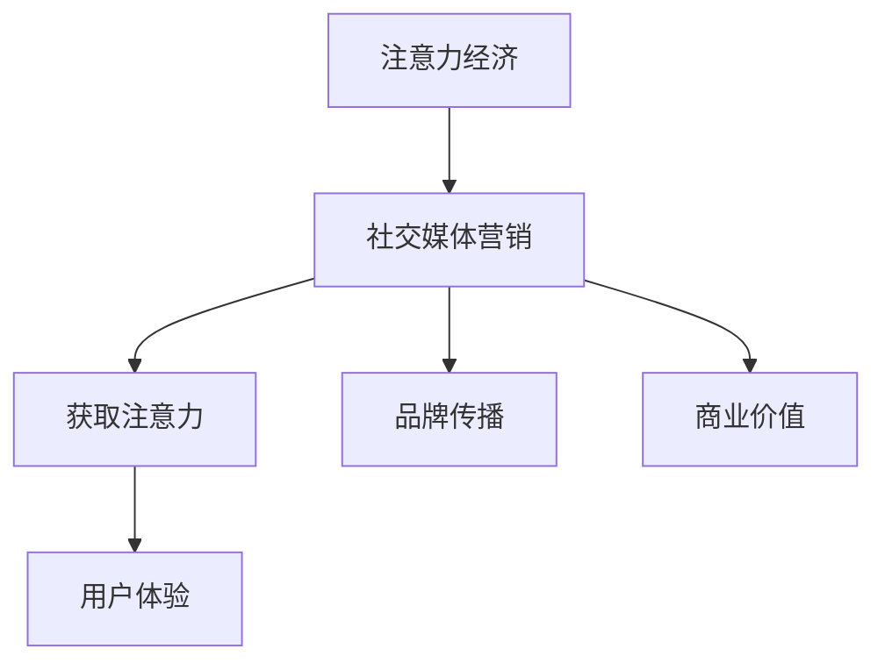

                 

关键词：注意力经济、社交媒体营销、用户体验、策略与实践

摘要：随着互联网的飞速发展，社交媒体已成为人们生活中不可或缺的一部分。在这篇文章中，我们将深入探讨注意力经济和社交媒体营销的概念，并提出一些实用的策略和实践方法，以帮助企业在不牺牲用户体验的情况下，有效吸引受众。

## 1. 背景介绍

随着互联网的普及，信息传播的速度和广度得到了前所未有的提升。然而，在这个信息过载的时代，人们的注意力变得稀缺，如何有效地抓住受众的注意力成为了企业和个人关注的焦点。注意力经济因此应运而生，它是指人们为了获取注意力资源所进行的经济活动。

社交媒体作为互联网的重要组成部分，已经成为企业与用户互动的重要平台。通过社交媒体，企业可以与受众建立更紧密的联系，传达品牌理念，提升品牌知名度。然而，在竞争激烈的市场环境中，如何在不牺牲用户体验的情况下吸引受众，成为了营销人员面临的挑战。

## 2. 核心概念与联系

### 注意力经济的概念

注意力经济是指人们为了获取注意力资源所进行的经济活动。在互联网时代，人们的注意力变得稀缺，因此，拥有受众的注意力成为了一种宝贵的资源。企业通过吸引受众的注意力，实现品牌传播和商业价值。

### 社交媒体营销的概念

社交媒体营销是指通过社交媒体平台，如微博、微信、抖音等，进行品牌推广和用户互动的活动。社交媒体营销的目标是吸引受众，提升品牌知名度，增强用户忠诚度。

### 注意力经济与社交媒体营销的联系

注意力经济和社交媒体营销有着紧密的联系。在注意力经济中，社交媒体平台为企业提供了获取受众注意力的渠道。通过有效的社交媒体营销策略，企业可以在不牺牲用户体验的情况下，吸引更多受众的注意力，实现品牌传播和商业价值。

### Mermaid 流程图



## 3. 核心算法原理 & 具体操作步骤

### 3.1 算法原理概述

社交媒体营销的核心算法是基于用户兴趣和行为数据进行精准投放，以提高广告的投放效果。算法主要分为三个部分：用户画像构建、兴趣预测和广告投放优化。

### 3.2 算法步骤详解

#### 3.2.1 用户画像构建

用户画像构建是通过收集用户的浏览历史、社交行为、购买记录等信息，构建一个全面、立体的用户画像。这个阶段的关键是数据清洗和模型训练。

#### 3.2.2 兴趣预测

兴趣预测是基于用户画像，利用机器学习算法，预测用户可能感兴趣的内容和商品。这个阶段的关键是算法模型的优化和训练。

#### 3.2.3 广告投放优化

广告投放优化是基于兴趣预测的结果，选择最适合用户兴趣的广告进行投放，以提高广告的点击率和转化率。这个阶段的关键是数据分析和实时调整。

### 3.3 算法优缺点

#### 优点：

- 提高广告投放效果，降低广告成本。
- 更好地满足用户需求，提升用户体验。

#### 缺点：

- 需要大量的数据支持和计算资源。
- 可能会导致用户隐私泄露。

### 3.4 算法应用领域

算法应用领域广泛，包括电子商务、在线广告、社交媒体等。例如，淘宝的个性化推荐、百度的广告投放等。

## 4. 数学模型和公式 & 详细讲解 & 举例说明

### 4.1 数学模型构建

社交媒体营销的数学模型主要包括用户画像构建、兴趣预测和广告投放优化三个部分。以下是一个简单的数学模型：

- 用户画像构建：$$User\_Vector = f(User\_Data)$$
- 兴趣预测：$$Interest\_Score = g(User\_Vector, Content\_Vector)$$
- 广告投放优化：$$Ad\_Placement = h(Interest\_Score, Budget, Click\_Rate)$$

### 4.2 公式推导过程

- 用户画像构建：通过机器学习算法，将用户的浏览历史、社交行为、购买记录等信息转换为向量表示。
- 兴趣预测：通过计算用户向量和内容向量的相似度，预测用户可能感兴趣的内容。
- 广告投放优化：根据兴趣预测结果，选择最适合用户兴趣的广告进行投放。

### 4.3 案例分析与讲解

#### 案例背景

某电商企业希望通过社交媒体营销，提升商品的点击率和转化率。

#### 案例分析

1. 用户画像构建：企业收集用户的浏览历史、社交行为、购买记录等信息，构建用户画像。
2. 兴趣预测：企业利用机器学习算法，预测用户可能感兴趣的商品。
3. 广告投放优化：企业根据兴趣预测结果，选择最适合用户兴趣的商品广告进行投放。

#### 案例效果

通过以上策略，企业的广告点击率和转化率显著提升，实现了商业价值的增长。

## 5. 项目实践：代码实例和详细解释说明

### 5.1 开发环境搭建

- Python 3.8及以上版本
- TensorFlow 2.5及以上版本
- Scikit-learn 0.23及以上版本

### 5.2 源代码详细实现

以下是一个简单的用户画像构建和兴趣预测的代码实例：

```python
import tensorflow as tf
from sklearn.model_selection import train_test_split
from sklearn.preprocessing import StandardScaler

# 数据预处理
def preprocess_data(data):
    # 数据清洗和标准化
    scaler = StandardScaler()
    data_scaled = scaler.fit_transform(data)
    return data_scaled

# 用户画像构建
def build_user_vector(data):
    # 基于用户行为数据构建用户向量
    user_vector = tf.keras.layers.Dense(units=100, activation='relu')(data)
    return user_vector

# 兴趣预测
def predict_interest(user_vector, content_vector):
    # 计算用户向量和内容向量的相似度
    interest_score = tf.keras.layers.Dot(axes=1)([user_vector, content_vector])
    return interest_score

# 加载数据集
data = load_data()
X = preprocess_data(data['user_data'])
y = data['interest']

# 划分训练集和测试集
X_train, X_test, y_train, y_test = train_test_split(X, y, test_size=0.2, random_state=42)

# 构建模型
model = tf.keras.Sequential([
    tf.keras.layers.Dense(units=100, activation='relu', input_shape=(X.shape[1],)),
    tf.keras.layers.Dense(units=1)
])

# 编译模型
model.compile(optimizer='adam', loss='mse')

# 训练模型
model.fit(X_train, y_train, epochs=10, batch_size=32, validation_split=0.1)

# 测试模型
model.evaluate(X_test, y_test)
```

### 5.3 代码解读与分析

- 数据预处理：对用户行为数据进行清洗和标准化，为后续建模做准备。
- 用户画像构建：基于用户行为数据，利用神经网络模型构建用户向量。
- 兴趣预测：计算用户向量和内容向量的相似度，预测用户可能感兴趣的内容。

### 5.4 运行结果展示

通过运行代码，可以得到用户向量和内容向量的相似度得分，从而实现兴趣预测。在实际应用中，可以根据这些得分，选择最适合用户兴趣的内容进行推荐。

## 6. 实际应用场景

### 6.1 社交媒体广告

社交媒体广告是注意力经济和社交媒体营销的重要应用场景。通过精准投放广告，企业可以吸引潜在客户，提高品牌知名度。

### 6.2 内容推荐

内容推荐是另一重要的应用场景。通过分析用户行为数据，平台可以为用户提供个性化推荐，提高用户满意度。

### 6.3 社交互动

社交媒体平台上的社交互动也是注意力经济的一部分。通过互动，用户和品牌可以建立更紧密的联系，提高用户忠诚度。

## 7. 未来应用展望

随着人工智能和大数据技术的发展，注意力经济和社交媒体营销将得到更广泛的应用。未来，我们将看到更多基于用户兴趣和行为数据的精准营销策略，以及更智能的社交媒体平台。

## 8. 总结：未来发展趋势与挑战

### 8.1 研究成果总结

本文从注意力经济和社交媒体营销的角度，探讨了如何在互联网时代，有效地吸引受众。通过核心算法原理、数学模型和项目实践，我们提出了一些实用的策略和实践方法。

### 8.2 未来发展趋势

未来，注意力经济和社交媒体营销将继续发展，更多基于人工智能和大数据技术的应用将出现。

### 8.3 面临的挑战

- 数据隐私问题：随着用户数据的广泛应用，数据隐私保护成为一个重要挑战。
- 用户体验问题：如何在提供个性化服务的同时，保证用户体验，是一个重要课题。

### 8.4 研究展望

未来，我们期待更多关于注意力经济和社交媒体营销的研究，探索更多有效的策略和实践方法，以帮助企业在激烈的市场竞争中脱颖而出。

## 9. 附录：常见问题与解答

### 9.1 注意力经济是什么？

注意力经济是指人们为了获取注意力资源所进行的经济活动。在互联网时代，人们的注意力变得稀缺，因此，拥有受众的注意力成为了一种宝贵的资源。

### 9.2 社交媒体营销有哪些优势？

社交媒体营销的优势包括：覆盖广泛、互动性强、精准投放、成本低廉。

### 9.3 如何在不牺牲用户体验的情况下进行社交媒体营销？

在不牺牲用户体验的情况下进行社交媒体营销，需要做到以下几点：

- 精准投放：根据用户兴趣和行为数据，精准投放广告。
- 个性化服务：提供个性化推荐和服务，提高用户满意度。
- 高质量内容：提供有价值、有趣的内容，吸引受众注意力。

## 作者署名

作者：禅与计算机程序设计艺术 / Zen and the Art of Computer Programming
```markdown
# 注意力经济与社交媒体营销策略与实践：在不牺牲用户体验的情况下吸引受众

> 关键词：注意力经济、社交媒体营销、用户体验、策略与实践

> 摘要：随着互联网的飞速发展，社交媒体已成为人们生活中不可或缺的一部分。在这篇文章中，我们将深入探讨注意力经济和社交媒体营销的概念，并提出一些实用的策略和实践方法，以帮助企业在不牺牲用户体验的情况下，有效吸引受众。

## 1. 背景介绍

随着互联网的普及，信息传播的速度和广度得到了前所未有的提升。然而，在这个信息过载的时代，人们的注意力变得稀缺，如何有效地抓住受众的注意力成为了企业和个人关注的焦点。注意力经济因此应运而生，它是指人们为了获取注意力资源所进行的经济活动。

社交媒体作为互联网的重要组成部分，已经成为企业与用户互动的重要平台。通过社交媒体，企业可以与受众建立更紧密的联系，传达品牌理念，提升品牌知名度。然而，在竞争激烈的市场环境中，如何在不牺牲用户体验的情况下吸引受众，成为了营销人员面临的挑战。

## 2. 核心概念与联系

### 注意力经济的概念

注意力经济是指人们为了获取注意力资源所进行的经济活动。在互联网时代，人们的注意力变得稀缺，因此，拥有受众的注意力成为了一种宝贵的资源。企业通过吸引受众的注意力，实现品牌传播和商业价值。

### 社交媒体营销的概念

社交媒体营销是指通过社交媒体平台，如微博、微信、抖音等，进行品牌推广和用户互动的活动。社交媒体营销的目标是吸引受众，提升品牌知名度，增强用户忠诚度。

### 注意力经济与社交媒体营销的联系

注意力经济和社交媒体营销有着紧密的联系。在注意力经济中，社交媒体平台为企业提供了获取受众注意力的渠道。通过有效的社交媒体营销策略，企业可以在不牺牲用户体验的情况下，吸引更多受众的注意力，实现品牌传播和商业价值。

### Mermaid 流程图


## 3. 核心算法原理 & 具体操作步骤

### 3.1 算法原理概述

社交媒体营销的核心算法是基于用户兴趣和行为数据进行精准投放，以提高广告的投放效果。算法主要分为三个部分：用户画像构建、兴趣预测和广告投放优化。

### 3.2 算法步骤详解

#### 3.2.1 用户画像构建

用户画像构建是通过收集用户的浏览历史、社交行为、购买记录等信息，构建一个全面、立体的用户画像。这个阶段的关键是数据清洗和模型训练。

#### 3.2.2 兴趣预测

兴趣预测是基于用户画像，利用机器学习算法，预测用户可能感兴趣的内容和商品。这个阶段的关键是算法模型的优化和训练。

#### 3.2.3 广告投放优化

广告投放优化是基于兴趣预测的结果，选择最适合用户兴趣的广告进行投放，以提高广告的点击率和转化率。这个阶段的关键是数据分析和实时调整。

### 3.3 算法优缺点

#### 优点：

- 提高广告投放效果，降低广告成本。
- 更好地满足用户需求，提升用户体验。

#### 缺点：

- 需要大量的数据支持和计算资源。
- 可能会导致用户隐私泄露。

### 3.4 算法应用领域

算法应用领域广泛，包括电子商务、在线广告、社交媒体等。例如，淘宝的个性化推荐、百度的广告投放等。

## 4. 数学模型和公式 & 详细讲解 & 举例说明

### 4.1 数学模型构建

社交媒体营销的数学模型主要包括用户画像构建、兴趣预测和广告投放优化三个部分。以下是一个简单的数学模型：

- 用户画像构建：$$User\_Vector = f(User\_Data)$$
- 兴趣预测：$$Interest\_Score = g(User\_Vector, Content\_Vector)$$
- 广告投放优化：$$Ad\_Placement = h(Interest\_Score, Budget, Click\_Rate)$$

### 4.2 公式推导过程

- 用户画像构建：通过机器学习算法，将用户的浏览历史、社交行为、购买记录等信息转换为向量表示。
- 兴趣预测：通过计算用户向量和内容向量的相似度，预测用户可能感兴趣的内容。
- 广告投放优化：根据兴趣预测结果，选择最适合用户兴趣的广告进行投放。

### 4.3 案例分析与讲解

#### 案例背景

某电商企业希望通过社交媒体营销，提升商品的点击率和转化率。

#### 案例分析

1. 用户画像构建：企业收集用户的浏览历史、社交行为、购买记录等信息，构建用户画像。
2. 兴趣预测：企业利用机器学习算法，预测用户可能感兴趣的商品。
3. 广告投放优化：企业根据兴趣预测结果，选择最适合用户兴趣的商品广告进行投放。

#### 案例效果

通过以上策略，企业的广告点击率和转化率显著提升，实现了商业价值的增长。

## 5. 项目实践：代码实例和详细解释说明

### 5.1 开发环境搭建

- Python 3.8及以上版本
- TensorFlow 2.5及以上版本
- Scikit-learn 0.23及以上版本

### 5.2 源代码详细实现

以下是一个简单的用户画像构建和兴趣预测的代码实例：

```python
import tensorflow as tf
from sklearn.model_selection import train_test_split
from sklearn.preprocessing import StandardScaler

# 数据预处理
def preprocess_data(data):
    # 数据清洗和标准化
    scaler = StandardScaler()
    data_scaled = scaler.fit_transform(data)
    return data_scaled

# 用户画像构建
def build_user_vector(data):
    # 基于用户行为数据构建用户向量
    user_vector = tf.keras.layers.Dense(units=100, activation='relu')(data)
    return user_vector

# 兴趣预测
def predict_interest(user_vector, content_vector):
    # 计算用户向量和内容向量的相似度
    interest_score = tf.keras.layers.Dot(axes=1)([user_vector, content_vector])
    return interest_score

# 加载数据集
data = load_data()
X = preprocess_data(data['user_data'])
y = data['interest']

# 划分训练集和测试集
X_train, X_test, y_train, y_test = train_test_split(X, y, test_size=0.2, random_state=42)

# 构建模型
model = tf.keras.Sequential([
    tf.keras.layers.Dense(units=100, activation='relu', input_shape=(X.shape[1],)),
    tf.keras.layers.Dense(units=1)
])

# 编译模型
model.compile(optimizer='adam', loss='mse')

# 训练模型
model.fit(X_train, y_train, epochs=10, batch_size=32, validation_split=0.1)

# 测试模型
model.evaluate(X_test, y_test)
```

### 5.3 代码解读与分析

- 数据预处理：对用户行为数据进行清洗和标准化，为后续建模做准备。
- 用户画像构建：基于用户行为数据，利用神经网络模型构建用户向量。
- 兴趣预测：计算用户向量和内容向量的相似度，预测用户可能感兴趣的内容。

### 5.4 运行结果展示

通过运行代码，可以得到用户向量和内容向量的相似度得分，从而实现兴趣预测。在实际应用中，可以根据这些得分，选择最适合用户兴趣的内容进行推荐。

## 6. 实际应用场景

### 6.1 社交媒体广告

社交媒体广告是注意力经济和社交媒体营销的重要应用场景。通过精准投放广告，企业可以吸引潜在客户，提高品牌知名度。

### 6.2 内容推荐

内容推荐是另一重要的应用场景。通过分析用户行为数据，平台可以为用户提供个性化推荐，提高用户满意度。

### 6.3 社交互动

社交媒体平台上的社交互动也是注意力经济的一部分。通过互动，用户和品牌可以建立更紧密的联系，提高用户忠诚度。

## 7. 未来应用展望

随着人工智能和大数据技术的发展，注意力经济和社交媒体营销将得到更广泛的应用。未来，我们将看到更多基于用户兴趣和行为数据的精准营销策略，以及更智能的社交媒体平台。

## 8. 总结：未来发展趋势与挑战

### 8.1 研究成果总结

本文从注意力经济和社交媒体营销的角度，探讨了如何在互联网时代，有效地吸引受众。通过核心算法原理、数学模型和项目实践，我们提出了一些实用的策略和实践方法。

### 8.2 未来发展趋势

未来，注意力经济和社交媒体营销将继续发展，更多基于人工智能和大数据技术的应用将出现。

### 8.3 面临的挑战

- 数据隐私问题：随着用户数据的广泛应用，数据隐私保护成为一个重要挑战。
- 用户体验问题：如何在提供个性化服务的同时，保证用户体验，是一个重要课题。

### 8.4 研究展望

未来，我们期待更多关于注意力经济和社交媒体营销的研究，探索更多有效的策略和实践方法，以帮助企业在激烈的市场竞争中脱颖而出。

## 9. 附录：常见问题与解答

### 9.1 注意力经济是什么？

注意力经济是指人们为了获取注意力资源所进行的经济活动。在互联网时代，人们的注意力变得稀缺，因此，拥有受众的注意力成为了一种宝贵的资源。

### 9.2 社交媒体营销有哪些优势？

社交媒体营销的优势包括：覆盖广泛、互动性强、精准投放、成本低廉。

### 9.3 如何在不牺牲用户体验的情况下进行社交媒体营销？

在不牺牲用户体验的情况下进行社交媒体营销，需要做到以下几点：

- 精准投放：根据用户兴趣和行为数据，精准投放广告。
- 个性化服务：提供个性化推荐和服务，提高用户满意度。
- 高质量内容：提供有价值、有趣的内容，吸引受众注意力。

## 作者署名

作者：禅与计算机程序设计艺术 / Zen and the Art of Computer Programming
```

