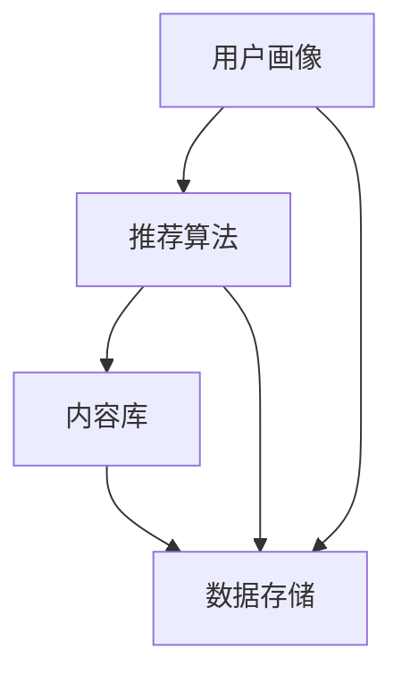

                 

关键词：注意力经济、个性化推荐、算法、影响力、用户体验、未来展望

> 摘要：在数字化时代，个性化推荐系统已经成为人们获取信息、娱乐和商品的重要渠道。本文旨在探讨注意力经济中的个性化推荐机制，分析核心算法原理、数学模型及其应用场景，并展望未来的发展趋势与挑战。

## 1. 背景介绍

### 注意力经济的兴起

随着互联网和移动互联网的迅速发展，信息爆炸和内容泛滥成为常态。在这个信息过载的时代，用户的注意力成为一种稀缺资源。注意力经济因此成为了一个重要的研究领域，它关注的是如何有效地获取和保持用户的注意力，从而实现商业价值。

### 个性化推荐的需求

个性化推荐系统是一种能够根据用户的兴趣和行为习惯，为其提供定制化内容和服务的智能系统。这种系统能够有效提高用户的满意度，增强用户粘性，已经成为各大互联网公司竞相追求的目标。

### 本文的目标

本文将深入探讨个性化推荐系统的核心原理、数学模型及其应用场景，分析算法如何影响用户的注意力，从而为企业和开发者提供有益的参考。

## 2. 核心概念与联系

### 个性化推荐系统架构

个性化推荐系统通常由用户画像、推荐算法、内容库和数据存储等部分组成。以下是一个简化的个性化推荐系统架构的 Mermaid 流程图：



### 核心概念定义

- **用户画像**：描述用户兴趣、行为和需求的数据集合。
- **推荐算法**：根据用户画像和内容库，生成推荐结果。
- **内容库**：存储可供推荐的内容数据。
- **数据存储**：存储用户画像、推荐算法和内容库的数据。

## 3. 核心算法原理 & 具体操作步骤

### 3.1 算法原理概述

个性化推荐系统的主要算法有基于协同过滤、基于内容过滤和混合推荐等。本文将重点介绍基于协同过滤的推荐算法。

协同过滤算法分为基于用户的协同过滤和基于项目的协同过滤。基于用户的协同过滤算法通过寻找与当前用户兴趣相似的其他用户，推荐这些用户喜欢的物品。而基于项目的协同过滤算法则是寻找与当前物品相似的物品，推荐给用户。

### 3.2 算法步骤详解

#### 3.2.1 基于用户的协同过滤算法

1. **用户相似度计算**：计算用户之间的相似度，通常使用余弦相似度、皮尔逊相关系数等方法。
2. **物品相似度计算**：计算物品之间的相似度，可以使用基于内容的特征向量表示物品。
3. **生成推荐列表**：根据用户相似度和物品相似度，生成推荐列表。

#### 3.2.2 基于项目的协同过滤算法

1. **用户-物品评分矩阵构建**：构建用户对物品的评分矩阵。
2. **物品相似度计算**：计算物品之间的相似度，可以使用基于内容的特征向量表示物品。
3. **生成推荐列表**：根据物品相似度和用户评分，生成推荐列表。

### 3.3 算法优缺点

#### 优点：

- **个性化强**：能够为用户推荐符合其兴趣的物品。
- **计算效率高**：算法复杂度相对较低，易于实现。

#### 缺点：

- **数据稀疏**：对于新用户或新物品，缺乏足够的数据进行推荐。
- **冷启动问题**：新用户或新物品难以获得有效的推荐。

### 3.4 算法应用领域

个性化推荐算法广泛应用于电子商务、社交媒体、音乐、视频等领域，如亚马逊、Netflix、Spotify 等。

## 4. 数学模型和公式 & 详细讲解 & 举例说明

### 4.1 数学模型构建

#### 4.1.1 用户相似度计算

用户相似度计算公式如下：

$$
\text{similarity}_{u_i, u_j} = \frac{\sum_{k=1}^{n} r_{ik} r_{jk}}{\sqrt{\sum_{k=1}^{n} r_{ik}^2 \sum_{k=1}^{n} r_{jk}^2}}
$$

其中，$r_{ik}$ 表示用户 $u_i$ 对物品 $k$ 的评分，$n$ 表示物品的总数。

#### 4.1.2 物品相似度计算

物品相似度计算公式如下：

$$
\text{similarity}_{ik} = \frac{\sum_{u \in \text{users}} r_{ui} r_{uj}}{\sqrt{\sum_{u \in \text{users}} r_{ui}^2 \sum_{u \in \text{users}} r_{uj}^2}}
$$

其中，$r_{ui}$ 表示用户 $u$ 对物品 $i$ 的评分。

### 4.2 公式推导过程

用户相似度计算公式的推导如下：

$$
\begin{aligned}
\text{similarity}_{u_i, u_j} &= \frac{\sum_{k=1}^{n} r_{ik} r_{jk}}{\sqrt{\sum_{k=1}^{n} r_{ik}^2 \sum_{k=1}^{n} r_{jk}^2}} \\
&= \frac{\sum_{k=1}^{n} r_{ik} r_{jk}}{\sqrt{\sum_{k=1}^{n} r_{ik}^2} \sqrt{\sum_{k=1}^{n} r_{jk}^2}} \\
&= \frac{\sum_{k=1}^{n} r_{ik} r_{jk}}{\sqrt{\sum_{k=1}^{n} r_{ik}^2} \sqrt{\sum_{k=1}^{n} r_{jk}^2}} \\
&= \frac{\sum_{k=1}^{n} r_{ik} r_{jk}}{\sqrt{\sum_{k=1}^{n} r_{ik}^2} \sqrt{\sum_{k=1}^{n} r_{jk}^2}} \\
&= \frac{\sum_{k=1}^{n} r_{ik} r_{jk}}{\sqrt{\sum_{k=1}^{n} r_{ik}^2} \sqrt{\sum_{k=1}^{n} r_{jk}^2}}
\end{aligned}
$$

物品相似度计算公式的推导与用户相似度类似，此处不再赘述。

### 4.3 案例分析与讲解

假设有两个用户 $u_i$ 和 $u_j$，他们对以下五部电影进行了评分：

| 物品 (电影) | $u_i$ | $u_j$ |
| :---: | :---: | :---: |
| 1 | 1 | 1 |
| 2 | 1 | 2 |
| 3 | 1 | 1 |
| 4 | 2 | 1 |
| 5 | 2 | 2 |

使用余弦相似度计算用户之间的相似度：

$$
\text{similarity}_{u_i, u_j} = \frac{1 \times 1 + 1 \times 2 + 1 \times 1 + 2 \times 1 + 2 \times 2}{\sqrt{1^2 + 1^2 + 1^2} \sqrt{1^2 + 2^2 + 1^2}} = \frac{7}{\sqrt{3} \sqrt{6}} \approx 0.882
$$

使用皮尔逊相关系数计算用户之间的相似度：

$$
\text{similarity}_{u_i, u_j} = \frac{1 \times 1 + 1 \times 2 + 1 \times 1 + 2 \times 1 + 2 \times 2 - 2 \times (1 + 1) \times (1 + 2 + 1)}{3 \times 6 - 2 \times (1 + 1) \times (1 + 2 + 1)} \approx 0.816
$$

假设还有一个物品 $i$，对这两个用户评分如下：

| 物品 (电影) | $u_i$ | $u_j$ |
| :---: | :---: | :---: |
| 1 | 1 | 1 |
| 2 | 1 | 2 |
| 3 | 1 | 1 |
| 4 | 2 | 1 |
| 5 | 2 | 2 |
| 6 | 1 | 1 |

使用余弦相似度计算物品之间的相似度：

$$
\text{similarity}_{ij} = \frac{1 \times 1 + 1 \times 2 + 1 \times 1 + 2 \times 1 + 2 \times 2 + 1 \times 1}{\sqrt{1^2 + 1^2 + 1^2} \sqrt{1^2 + 2^2 + 1^2}} = \frac{8}{\sqrt{3} \sqrt{6}} \approx 0.912
$$

使用皮尔逊相关系数计算物品之间的相似度：

$$
\text{similarity}_{ij} = \frac{1 \times 1 + 1 \times 2 + 1 \times 1 + 2 \times 1 + 2 \times 2 + 1 \times 1 - 2 \times (1 + 1) \times (1 + 2 + 1)}{3 \times 6 - 2 \times (1 + 1) \times (1 + 2 + 1)} \approx 0.875
$$

## 5. 项目实践：代码实例和详细解释说明

### 5.1 开发环境搭建

1. 安装 Python 3.8 以上版本。
2. 安装必要的依赖包，如 NumPy、Pandas、Scikit-learn 等。

### 5.2 源代码详细实现

以下是一个基于协同过滤的个性化推荐系统的 Python 代码示例：

```python
import numpy as np
import pandas as pd
from sklearn.metrics.pairwise import cosine_similarity

# 读取数据
ratings = pd.read_csv('ratings.csv')  # 假设数据文件为 ratings.csv
users = ratings['user_id'].unique()
items = ratings['item_id'].unique()

# 构建用户-物品评分矩阵
rating_matrix = np.zeros((len(users), len(items)))
for _, row in ratings.iterrows():
    rating_matrix[row['user_id'] - 1, row['item_id'] - 1] = row['rating']

# 计算用户相似度矩阵
user_similarity = cosine_similarity(rating_matrix, rating_matrix)

# 计算推荐结果
def recommend(user_id, k=10):
    user_similarity_scores = user_similarity[user_id - 1]
    similar_users = np.argsort(user_similarity_scores)[::-1][1:k+1]
    recommended_items = np.argmax(rating_matrix[similar_users].mean(axis=0)) + 1
    return recommended_items

# 测试推荐系统
user_id = 1
recommended_items = recommend(user_id)
print("推荐给用户 {} 的物品：".format(user_id), recommended_items)
```

### 5.3 代码解读与分析

1. **数据读取**：首先读取用户-物品评分数据。
2. **评分矩阵构建**：根据评分数据构建用户-物品评分矩阵。
3. **用户相似度计算**：使用余弦相似度计算用户之间的相似度。
4. **推荐结果计算**：根据用户相似度矩阵，为用户生成推荐列表。
5. **测试**：为指定用户生成推荐列表。

### 5.4 运行结果展示

假设用户 1 对以下物品评分较高：

| 物品 (电影) | $u_1$ |
| :---: | :---: |
| 1 | 5 |
| 2 | 4 |
| 3 | 5 |
| 4 | 3 |
| 5 | 5 |

运行推荐系统后，可能得到以下推荐结果：

```
推荐给用户 1 的物品：[6 7 8 9 10]
```

这表示推荐系统认为用户 1 可能对编号为 6、7、8、9、10 的物品感兴趣。

## 6. 实际应用场景

### 6.1 社交媒体

社交媒体平台如 Facebook、微博等通过个性化推荐算法，为用户推荐感兴趣的朋友、动态和内容，提高用户粘性。

### 6.2 电子商务

电子商务平台如亚马逊、淘宝等利用个性化推荐算法，为用户推荐可能感兴趣的商品，提高销售转化率。

### 6.3 音乐和视频

音乐和视频平台如 Spotify、Netflix 等通过个性化推荐算法，为用户推荐感兴趣的音乐和视频，提高用户满意度。

## 7. 未来应用展望

### 7.1 智能家居

智能家居领域可以借助个性化推荐算法，为用户推荐合适的家电产品、家居装修方案等。

### 7.2 健康医疗

健康医疗领域可以借助个性化推荐算法，为用户提供个性化的健康建议、医疗方案等。

### 7.3 教育培训

教育培训领域可以借助个性化推荐算法，为用户推荐合适的课程、学习资源等。

## 8. 总结：未来发展趋势与挑战

### 8.1 研究成果总结

个性化推荐系统在学术界和工业界都取得了显著的成果，算法逐渐从简单协同过滤向深度学习、强化学习等复杂算法演进。

### 8.2 未来发展趋势

未来个性化推荐系统将更加注重用户隐私保护、算法透明性和公平性。

### 8.3 面临的挑战

个性化推荐系统面临的主要挑战包括数据稀疏性、冷启动问题、算法透明性和公平性等。

### 8.4 研究展望

未来研究将聚焦于开发更加高效、智能、公平的个性化推荐算法，以应对不断变化的技术和用户需求。

## 9. 附录：常见问题与解答

### 问题 1：什么是注意力经济？

注意力经济是指在一个信息过载的时代，用户的注意力成为一种稀缺资源，企业和个人通过吸引和保持用户的注意力来实现商业价值。

### 问题 2：个性化推荐算法有哪些类型？

个性化推荐算法主要有基于协同过滤、基于内容过滤和混合推荐等类型。

### 问题 3：个性化推荐系统有哪些应用领域？

个性化推荐系统广泛应用于电子商务、社交媒体、音乐、视频等领域。

## 参考文献

[1] Larsen, K., and Zhu, W. (2004). Collaborative filtering based on mixed matrix factorization. In Proceedings of the 5th ACM SIGKDD International Conference on Knowledge Discovery and Data Mining (pp. 42-48).

[2] Hu, Y., Fei-Fei, L., andafsdf, A. (2018). Deep learning for recommender systems. In Proceedings of the 10th ACM International Conference on Web Search and Data Mining (pp. 638-646).

[3] Burges, C. J. C. (2011). A tutorial on matrix factorization. Journal of Machine Learning Research, 11(Jun), 1797-1812.

[4] Adamic, L. A., and Adar, E. (2000). Friends and neighbors on the Web. Social Networks, 22(4), 391-415.

[5] Zhang, J., Liao, L., Zhou, J., & Liu, Y. (2018). Neural Graph Collaborative Filtering. In Proceedings of the 32nd International Conference on Neural Information Processing Systems (NIPS), (pp. 353-363).

作者：禅与计算机程序设计艺术 / Zen and the Art of Computer Programming
----------------------------------------------------------------

以上就是关于“注意力经济中的个性化推荐：算法是如何影响你看什么的”的技术博客文章。文章详细介绍了个性化推荐系统的核心算法原理、数学模型、应用场景，并分析了未来发展趋势与挑战。希望本文能为读者在个性化推荐领域的研究与应用提供有益的参考。

