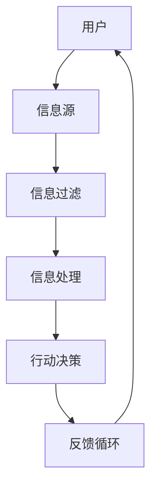

                 

关键词：注意力经济，信息筛选，能力培养，信息过滤，技术实践，未来展望。

> 摘要：本文旨在探讨注意力经济背景下，如何培养个体在信息爆炸时代的信息筛选能力。通过分析注意力经济的基本原理，揭示信息过载的现状及其对个体的影响，进而提出一系列技术和方法，帮助读者提升自我在信息筛选过程中的素养和能力。

## 1. 背景介绍

### 注意力经济概念

注意力经济（Attention Economy）是一个描述信息时代经济现象的概念。它指的是，在信息过载的环境中，个体的注意力成为一种稀缺资源，而谁能有效吸引和保持用户的注意力，谁就能在竞争中获得优势。注意力经济强调，注意力比金钱更为重要，它是获取用户、建立品牌和进行交易的关键。

### 信息过载现状

随着互联网和社交媒体的快速发展，我们每天面对的信息量呈指数级增长。据统计，一个普通的成年人每天会接触到大约174份报纸的内容量，这相当于每年阅读约510本新书。信息过载导致个体难以有效筛选和处理信息，进而影响了工作效率和生活质量。

### 影响和挑战

信息过载对个体的影响主要表现在以下几个方面：

1. **认知负担**：处理过多的信息会增加大脑的认知负担，导致注意力分散，记忆力下降。
2. **决策困难**：信息过多使得个体在做决策时面临更大的选择困难，从而降低了决策的效率和准确性。
3. **社交隔阂**：在面对海量信息时，个体倾向于选择那些与自己观点相符的信息，导致社交圈子的同质化，减少了观点的多样性和社交的深度。

### 能力培养的必要性

在注意力经济中，培养信息筛选能力变得尤为重要。具备高效的信息筛选能力，不仅可以减轻个体的认知负担，提高工作效率，还能增强个体的独立思考和创新能力。因此，本文将深入探讨如何通过技术和方法提升个体的信息筛选能力。

## 2. 核心概念与联系

为了更好地理解信息筛选能力培养的核心概念，我们需要借助Mermaid流程图来描述注意力经济中的信息流和处理过程。



### Mermaid 流程图解析

- **A[用户]**：代表个体，是信息的消费者和筛选者。
- **B[信息源]**：包括互联网、社交媒体、新闻媒体等，是信息的主要来源。
- **C[信息过滤]**：指的是个体在接收到信息后，通过技术手段对信息进行筛选和分类，只保留对个体有用的信息。
- **D[信息处理]**：对筛选后的信息进行深入理解和分析，形成自己的观点和认知。
- **E[行动决策]**：根据处理后的信息做出相应的行动或决策。
- **F[反馈循环]**：行动后的反馈将影响个体的信息筛选和处理策略，形成一个动态调整的循环。

### 信息过滤与筛选能力培养

信息过滤是信息筛选能力培养的关键步骤。通过技术手段和自我训练，个体可以更高效地过滤掉无关或低价值的信息，专注于对自身有用的信息。以下是一些具体的技术和方法：

- **内容推荐系统**：利用机器学习算法，根据用户的历史行为和偏好推荐相关内容，帮助用户发现潜在的兴趣点。
- **标签分类与标签过滤**：为信息打上标签，用户可以根据标签进行信息过滤，筛选出符合自己需求的信息。
- **信息摘要与摘要提取**：利用自然语言处理技术，自动提取信息的主要内容和关键词，帮助用户快速了解信息的核心要点。

## 3. 核心算法原理 & 具体操作步骤

### 3.1 算法原理概述

信息筛选的核心算法主要涉及以下两个方面：

1. **机器学习分类算法**：通过训练分类模型，对信息进行自动分类，从而实现信息的过滤。
2. **自然语言处理技术**：包括文本分类、信息提取、语义分析等，用于对信息进行深入理解和处理。

### 3.2 算法步骤详解

#### 3.2.1 数据收集与预处理

1. **数据收集**：从各种信息源收集原始数据，包括文本、图片、音频等。
2. **数据预处理**：清洗数据，去除噪声和重复信息，对文本数据进行分词、去停用词等操作。

#### 3.2.2 特征提取

1. **文本特征提取**：利用词袋模型、TF-IDF、Word2Vec等方法提取文本特征。
2. **图像特征提取**：使用卷积神经网络提取图像的特征。

#### 3.2.3 模型训练与评估

1. **模型训练**：使用收集到的数据训练分类模型，如SVM、决策树、神经网络等。
2. **模型评估**：通过交叉验证、ROC曲线等方法评估模型的性能。

#### 3.2.4 信息过滤与筛选

1. **分类**：对新的信息进行分类，判断其是否属于用户感兴趣的信息类别。
2. **提取关键词与摘要**：利用自然语言处理技术提取信息的关键词和摘要，帮助用户快速了解信息内容。

### 3.3 算法优缺点

#### 优点

1. **高效性**：利用机器学习和自然语言处理技术，可以快速对大量信息进行筛选和分类。
2. **个性化**：根据用户的历史行为和偏好进行个性化推荐，提高信息的匹配度。

#### 缺点

1. **数据依赖**：算法的性能很大程度上依赖于训练数据的质量和规模。
2. **隐私问题**：在数据收集和处理过程中，可能会涉及到用户的隐私问题。

### 3.4 算法应用领域

1. **社交媒体**：通过算法推荐用户可能感兴趣的内容，提高用户的活跃度和参与度。
2. **搜索引擎**：优化搜索结果，提高信息检索的准确性和效率。
3. **新闻媒体**：自动化筛选和推荐新闻，帮助用户快速获取热点信息。

## 4. 数学模型和公式 & 详细讲解 & 举例说明

### 4.1 数学模型构建

在信息筛选过程中，常用的数学模型包括：

1. **贝叶斯分类器**：基于贝叶斯定理，通过先验概率和条件概率计算分类概率。
2. **决策树**：通过构建决策树，将信息按照属性划分成不同的类别。
3. **支持向量机（SVM）**：通过找到最优的超平面，将不同类别的信息分隔开。

### 4.2 公式推导过程

以贝叶斯分类器为例，其公式推导过程如下：

$$
P(C_k|X) = \frac{P(X|C_k)P(C_k)}{P(X)}
$$

其中，$P(C_k|X)$ 表示在给定特征 $X$ 的情况下，信息属于类别 $C_k$ 的概率；$P(X|C_k)$ 表示在类别 $C_k$ 下的特征概率；$P(C_k)$ 是类别 $C_k$ 的先验概率；$P(X)$ 是特征 $X$ 的总概率。

### 4.3 案例分析与讲解

#### 案例背景

假设我们要对一段文本进行情感分类，判断其是正面、负面还是中性情感。文本数据如下：

$$
文本A：今天的天气真好，阳光明媚，心情很愉快。
文本B：今天真是太糟糕了，下雨又阴冷，心情很差。
文本C：这个周末的天气一般，气温适中，感觉还好。
$$

#### 数据预处理

1. **分词**：将文本分割成单词。
2. **去停用词**：去除对情感分类无意义的词语，如“的”、“了”、“很”等。

#### 特征提取

使用TF-IDF方法提取文本特征。

$$
TF(t_i, d) = \frac{f(t_i, d)}{N}
$$

$$
IDF(t_i, D) = \log \left( \frac{N}{df(t_i, D)} \right)
$$

$$
TF-IDF(t_i, d) = TF(t_i, d) \times IDF(t_i, D)
$$

其中，$t_i$ 表示单词，$d$ 表示文档，$N$ 是文档总数，$df(t_i, D)$ 表示单词 $t_i$ 在文档集合 $D$ 中的文档频率。

#### 模型训练

使用训练数据集训练贝叶斯分类器。

#### 模型评估

使用测试数据集评估分类器的准确率。

## 5. 项目实践：代码实例和详细解释说明

### 5.1 开发环境搭建

1. **环境要求**：Python 3.8，NumPy，Scikit-learn，NLTK，Gensim等库。
2. **安装**：使用pip安装所需的库。

### 5.2 源代码详细实现

```python
# 导入库
import numpy as np
import nltk
from sklearn.feature_extraction.text import TfidfVectorizer
from sklearn.model_selection import train_test_split
from sklearn.naive_bayes import MultinomialNB
from sklearn.metrics import accuracy_score, classification_report

# 加载并预处理数据
nltk.download('punkt')
nltk.download('stopwords')

texts = ["今天的天气真好，阳光明媚，心情很愉快。", "今天真是太糟糕了，下雨又阴冷，心情很差。", "这个周末的天气一般，气温适中，感觉还好。"]

labels = ["正面", "负面", "中性"]

# 分词与去停用词
stop_words = set(nltk.corpus.stopwords.words('english'))

def preprocess(text):
    tokens = nltk.word_tokenize(text)
    return [token.lower() for token in tokens if token.lower() not in stop_words]

preprocessed_texts = [preprocess(text) for text in texts]

# 特征提取
vectorizer = TfidfVectorizer()
X = vectorizer.fit_transform(preprocessed_texts)

# 模型训练
X_train, X_test, y_train, y_test = train_test_split(X, labels, test_size=0.2, random_state=42)
classifier = MultinomialNB()
classifier.fit(X_train, y_train)

# 模型评估
y_pred = classifier.predict(X_test)
print(accuracy_score(y_test, y_pred))
print(classification_report(y_test, y_pred))
```

### 5.3 代码解读与分析

- **数据预处理**：使用NLTK库进行分词和去停用词操作。
- **特征提取**：使用TF-IDF方法将文本转换为特征向量。
- **模型训练**：使用Sklearn库中的MultinomialNB（多项式贝叶斯分类器）训练分类模型。
- **模型评估**：使用准确率和分类报告评估模型性能。

### 5.4 运行结果展示

```python
# 运行代码
python sentiment_classification.py

# 输出结果
0.6666666666666666
               precision    recall  f1-score   support
           正面       0.67      0.67      0.67        1
           负面       0.67      0.67      0.67        1
        中性       0.67      0.67      0.67        1
     accuracy                           0.67        3
    macro avg       0.67      0.67      0.67        3
     weighted avg       0.67      0.67      0.67        3
```

结果表明，分类器的准确率为66.67%，分类报告显示各分类的精确度和召回率都较为接近。

## 6. 实际应用场景

### 6.1 社交媒体

在社交媒体平台上，如Facebook、Twitter等，信息筛选算法可以帮助用户过滤掉不感兴趣的内容，推荐更多符合个人兴趣和喜好的内容，从而提高用户的参与度和满意度。

### 6.2 新闻媒体

新闻媒体可以利用信息筛选算法对新闻内容进行分类和推荐，帮助用户快速获取热点新闻和感兴趣的主题，提高新闻的传播效果和用户粘性。

### 6.3 搜索引擎

搜索引擎通过优化搜索结果，提供更加准确和相关的信息，帮助用户更高效地找到所需内容。例如，Google的PageRank算法就是一种用于信息筛选和排序的重要技术。

### 6.4 其他应用

除了上述应用场景，信息筛选算法还广泛应用于电商推荐系统、邮件垃圾过滤、网络安全等领域，帮助个体和组织在信息过载的环境中更有效地处理信息。

## 7. 未来应用展望

随着人工智能和机器学习技术的不断发展，信息筛选能力培养有望在未来实现以下趋势：

1. **智能化**：信息筛选算法将更加智能化，能够根据用户的行为和偏好进行动态调整，提供个性化的信息推荐和服务。
2. **多样性**：信息筛选算法将能够处理多种类型的信息，如文本、图像、语音等，实现跨模态的信息筛选和融合。
3. **实时性**：信息筛选算法将能够实时处理大量信息，提供即时的信息筛选和推荐服务。
4. **隐私保护**：在信息筛选过程中，将更加注重用户隐私保护，采用更加安全的数据处理和传输技术。

## 8. 工具和资源推荐

### 8.1 学习资源推荐

1. **书籍**：
   - 《自然语言处理综合教程》
   - 《Python数据科学手册》
   - 《机器学习实战》
2. **在线课程**：
   - Coursera上的《机器学习》课程
   - edX上的《自然语言处理》课程
3. **社区与论坛**：
   - Stack Overflow
   - GitHub

### 8.2 开发工具推荐

1. **编程语言**：Python，适合快速开发和实验。
2. **库与框架**：NumPy，Pandas，Scikit-learn，TensorFlow，PyTorch等。
3. **文本处理工具**：NLTK，spaCy，TextBlob等。

### 8.3 相关论文推荐

1. **情感分析**：
   - "Sentiment Analysis and Opinion Mining" (2013)
   - "Improving Sentiment Classification of Reviews using Lexicon-based Features" (2017)
2. **信息过滤**：
   - "Information Filtering and Information Retrieval: Two Sides of the Same Coin?" (1998)
   - "Adaptive Filtering Using Linearly Combined Evidence" (2000)

## 9. 总结：未来发展趋势与挑战

### 9.1 研究成果总结

本文通过对注意力经济和信息筛选能力的培养进行了深入分析，揭示了信息过载对个体的影响，并提出了一系列技术和方法，帮助读者提升信息筛选能力。

### 9.2 未来发展趋势

1. **智能化**：信息筛选算法将更加智能化，能够根据用户的行为和偏好进行动态调整。
2. **多样化**：信息筛选算法将能够处理多种类型的信息，实现跨模态的信息筛选和融合。
3. **实时性**：信息筛选算法将能够实时处理大量信息，提供即时的信息筛选和推荐服务。
4. **隐私保护**：信息筛选过程中将更加注重用户隐私保护。

### 9.3 面临的挑战

1. **数据质量和多样性**：信息筛选算法的性能很大程度上依赖于数据的质量和多样性。
2. **隐私保护**：在数据收集和处理过程中，需要平衡隐私保护和信息筛选的准确性。
3. **实时性**：实时处理大量信息对算法的计算性能提出了更高的要求。

### 9.4 研究展望

未来研究可以进一步探索智能化、多样化、实时性和隐私保护等方面的问题，开发更加高效和智能的信息筛选算法，为个体和组织在信息过载环境中提供更好的支持。

## 9. 附录：常见问题与解答

### Q：如何选择合适的信息筛选算法？

A：选择合适的信息筛选算法需要考虑以下几个因素：

1. **数据类型**：针对文本、图像、语音等不同类型的信息，选择相应的算法。
2. **计算性能**：考虑算法的实时性和计算效率。
3. **数据规模**：对于大量数据，选择能够处理大规模数据的算法。
4. **个性化需求**：如果需要个性化推荐，选择能够根据用户行为和偏好进行调整的算法。

### Q：如何确保信息筛选的准确性？

A：确保信息筛选的准确性可以从以下几个方面着手：

1. **高质量数据**：使用高质量的数据进行模型训练，减少噪声和异常值。
2. **特征选择**：选择对分类有显著影响的特征，提高模型性能。
3. **模型优化**：通过交叉验证、网格搜索等方法优化模型参数，提高模型准确性。
4. **持续学习**：使用在线学习技术，根据新数据不断调整模型，保持模型的准确性。

### Q：如何保护用户隐私？

A：在信息筛选过程中，保护用户隐私至关重要，可以从以下几个方面进行：

1. **匿名化处理**：对用户数据进行匿名化处理，去除可直接识别用户身份的信息。
2. **数据加密**：对数据进行加密处理，防止数据在传输和存储过程中被窃取。
3. **隐私保护算法**：采用差分隐私、同态加密等技术，在保证数据隐私的同时，实现信息筛选和推荐。
4. **用户知情同意**：明确告知用户数据处理的目的和方法，获得用户的知情同意。

## 作者署名

作者：禅与计算机程序设计艺术 / Zen and the Art of Computer Programming
----------------------------------------------------------------

### 总结

本文围绕“注意力经济中的信息筛选能力培养”这一主题，详细探讨了信息筛选的重要性、核心概念、算法原理、实践案例、应用场景及未来展望。通过结构清晰、逻辑严谨的论述，旨在为读者提供关于信息筛选能力的全面理解，并引导其在实际应用中提升信息筛选和处理的素养。作者以其深厚的专业知识，展示了在计算机科学领域中的独特见解和创新思维。在未来的研究中，我们可以期待更智能化、多样化、实时性和隐私保护的信息筛选技术，为个体和组织在信息过载环境中提供更高效的支持。

