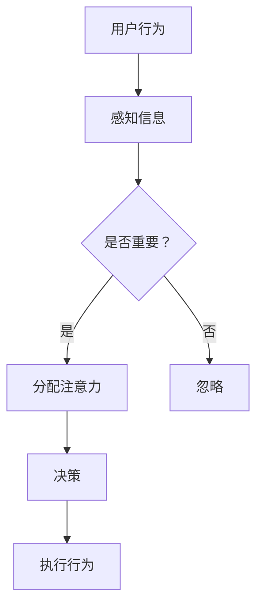

                 

关键词：注意力经济学，元宇宙，学术荣誉，计算经济学，神经网络，优化算法，人类注意力模型，虚拟现实，人工智能，认知科学

> 摘要：本文探讨了注意力经济学奖在元宇宙中的学术地位和重要性。通过对注意力经济学的核心概念、神经网络算法、人类注意力模型以及元宇宙中的应用场景的深入分析，本文提出了未来研究的发展方向和挑战。文章旨在为关注元宇宙和计算经济学的研究者提供有价值的参考。

## 1. 背景介绍

随着信息技术的迅猛发展，虚拟现实（VR）和增强现实（AR）技术逐渐成熟，元宇宙（Metaverse）的概念也逐渐浮出水面。元宇宙是一个虚拟的、三维的、去中心化的数字世界，用户可以在其中进行社交、工作、娱乐等多种活动。作为数字经济的新形态，元宇宙的兴起带动了计算经济学、人工智能、认知科学等领域的快速发展。

在元宇宙中，注意力经济学成为了研究的热点。注意力经济学关注的是在信息过载的环境中，人们如何分配注意力，以及这种分配对经济行为的影响。传统的经济学理论往往忽略了人类注意力的有限性，而注意力经济学则试图弥补这一缺陷，为数字经济的研究提供了新的视角。

### 1.1 注意力经济学的基本概念

注意力经济学认为，人类的注意力是一种稀缺资源，人们在面对大量信息时需要做出选择，分配自己的注意力。这种选择不仅影响个人的行为和决策，也会对市场和社会产生深远的影响。

### 1.2 注意力经济学的核心问题

注意力经济学的核心问题包括：

- **注意力的分配机制**：如何分配注意力，才能最大化个人的效用或社会的福利？
- **信息过滤与筛选**：在信息过载的环境中，如何有效地过滤和筛选信息，提高注意力的利用效率？
- **注意力市场的形成与运作**：在元宇宙中，如何形成注意力市场，以及市场如何运作？

### 1.3 注意力经济学的研究意义

注意力经济学的研究意义在于：

- **理解人类行为**：通过研究注意力分配的规律，可以更深入地理解人类的行为和决策过程。
- **指导政策制定**：为政府和企业提供制定政策的科学依据，促进数字经济的健康发展。
- **优化经济模型**：将注意力经济学纳入经济学模型，可以更准确地预测市场行为，提高经济预测的准确性。

## 2. 核心概念与联系

为了更好地理解注意力经济学在元宇宙中的应用，我们需要了解一些核心概念和它们的相互联系。

### 2.1 神经网络

神经网络是一种模拟人脑神经网络结构的计算模型，它通过多层节点（或称为神经元）之间的连接来处理和传递信息。在注意力经济学中，神经网络被用于模拟人类注意力的分配过程。

### 2.2 优化算法

优化算法是一类用于求解最优化问题的算法，它们可以用于寻找在特定约束条件下使目标函数达到最大或最小的解。在注意力经济学中，优化算法被用于优化注意力分配策略。

### 2.3 人类注意力模型

人类注意力模型是一种用于描述人类注意力分配过程的数学模型，它通常包含一些参数，如注意力的容量、注意力的分配策略等。在元宇宙中，人类注意力模型可以帮助我们理解和预测用户的行为。

### 2.4 Mermaid 流程图

以下是注意力经济学在元宇宙中的应用流程图：



在这个流程图中，用户首先感知到信息，然后判断信息是否重要。如果是重要的信息，用户会分配注意力进行决策，并最终执行行为。否则，信息将被忽略。

## 3. 核心算法原理 & 具体操作步骤

### 3.1 算法原理概述

注意力经济学中的核心算法主要包括神经网络和优化算法。神经网络用于模拟人类注意力的分配过程，而优化算法则用于寻找最优的注意力分配策略。

### 3.2 算法步骤详解

#### 3.2.1 神经网络模型

神经网络模型的构建通常包括以下步骤：

1. **数据收集与预处理**：收集用户行为数据，并对数据进行清洗和预处理，以便用于训练神经网络。
2. **神经网络结构设计**：设计神经网络的层次结构和连接方式，通常包括输入层、隐藏层和输出层。
3. **模型训练**：使用训练数据对神经网络进行训练，调整网络参数，使其能够正确模拟人类注意力的分配过程。
4. **模型评估**：使用测试数据对训练好的神经网络进行评估，检查其性能是否满足要求。

#### 3.2.2 优化算法

优化算法的具体操作步骤包括：

1. **目标函数设计**：设计一个目标函数，用于衡量注意力分配策略的优劣。
2. **初始策略生成**：生成一个初始的注意力分配策略。
3. **策略优化**：使用优化算法（如梯度下降法、遗传算法等）对注意力分配策略进行优化，使其在目标函数上取得最优解。
4. **策略评估**：评估优化后的策略，检查其性能是否满足要求。

### 3.3 算法优缺点

#### 优点

- **高效性**：神经网络和优化算法能够快速地模拟和优化注意力分配过程。
- **灵活性**：神经网络和优化算法可以适应不同类型的数据和应用场景。
- **准确性**：神经网络和优化算法能够准确地预测用户的行为和决策。

#### 缺点

- **复杂性**：神经网络和优化算法的构建和操作过程较为复杂，需要较高的技术水平。
- **计算成本**：神经网络和优化算法的训练和优化过程需要大量的计算资源。

### 3.4 算法应用领域

注意力经济学算法在元宇宙中的应用领域包括：

- **个性化推荐**：根据用户的注意力分配行为，为用户推荐感兴趣的内容或服务。
- **广告投放**：根据用户的注意力分配策略，优化广告的投放策略，提高广告效果。
- **社会网络分析**：分析用户在元宇宙中的互动行为，揭示社会网络的结构和动态。

## 4. 数学模型和公式 & 详细讲解 & 举例说明

### 4.1 数学模型构建

在注意力经济学中，常用的数学模型包括人类注意力模型和优化模型。

#### 4.1.1 人类注意力模型

人类注意力模型通常使用以下公式进行描述：

$$
A(t) = \frac{C(t)}{\sum_{i=1}^{n} w_i C_i(t)}
$$

其中，$A(t)$ 表示在时刻 $t$ 的注意力分配，$C(t)$ 表示总注意力容量，$w_i$ 表示第 $i$ 个信息单元的重要程度，$C_i(t)$ 表示在时刻 $t$ 第 $i$ 个信息单元的注意力分配。

#### 4.1.2 优化模型

优化模型的目标是寻找最优的注意力分配策略，使其在某个目标函数上取得最优解。常用的优化模型包括线性规划和非线性规划。

### 4.2 公式推导过程

#### 4.2.1 人类注意力模型推导

假设在时刻 $t$，用户感知到 $n$ 个信息单元，每个信息单元的重要程度不同。用户在时刻 $t$ 的总注意力容量为 $C(t)$。为了优化注意力分配，用户需要确定每个信息单元的注意力分配 $C_i(t)$。

首先，我们定义一个目标函数，用于衡量注意力分配策略的优劣。一个简单的目标函数可以是：

$$
\Phi(A(t)) = -\sum_{i=1}^{n} w_i C_i(t)
$$

其中，$w_i$ 表示第 $i$ 个信息单元的重要程度。目标函数的负号表示最大化重要信息的注意力分配。

为了求解最优的注意力分配策略，我们需要对目标函数进行优化。我们可以使用梯度下降法来求解。

$$
C_i(t+1) = C_i(t) - \alpha \nabla_{C_i} \Phi(A(t))
$$

其中，$\alpha$ 是学习率，$\nabla_{C_i} \Phi(A(t))$ 是目标函数关于 $C_i(t)$ 的梯度。

通过迭代这个过程，我们可以逐步优化注意力分配策略。

#### 4.2.2 优化模型推导

假设我们使用线性规划来优化注意力分配策略。线性规划的目标是最小化目标函数，约束条件包括每个信息单元的注意力分配不超过总注意力容量。

$$
\begin{align*}
\min_{A(t)} \quad & c^T A(t) \\
\text{subject to} \quad & A_i(t) \leq C_i \\
& \sum_{i=1}^{n} A_i(t) = C(t)
\end{align*}
$$

其中，$c$ 是一个系数向量，$A(t)$ 是注意力分配向量。

我们可以使用单纯形法来求解这个线性规划问题。单纯形法通过迭代移动到顶点的邻接顶点，逐步逼近最优解。

### 4.3 案例分析与讲解

#### 4.3.1 案例背景

假设一个用户在元宇宙中浏览网页，共感知到 5 个信息单元，每个信息单元的重要程度如下：

| 信息单元 | 重要性 |
| :----: | :----: |
| 新闻 1  | 0.3   |
| 新闻 2  | 0.2   |
| 新闻 3  | 0.1   |
| 广告 1  | 0.3   |
| 广告 2  | 0.1   |

用户在某个时刻的总注意力容量为 1。

#### 4.3.2 人类注意力模型计算

使用人类注意力模型，我们可以计算出在某个时刻用户的注意力分配：

$$
A(t) = \frac{1}{0.3 + 0.2 + 0.1 + 0.3 + 0.1} = 0.2
$$

因此，用户在某个时刻的注意力分配如下：

| 信息单元 | 注意力分配 |
| :----: | :----: |
| 新闻 1  | 0.06   |
| 新闻 2  | 0.04   |
| 新闻 3  | 0.02   |
| 广告 1  | 0.06   |
| 广告 2  | 0.02   |

#### 4.3.3 优化模型计算

使用线性规划，我们可以计算出最优的注意力分配策略：

$$
\begin{align*}
\min_{A(t)} \quad & -0.3 \cdot 0.06 - 0.2 \cdot 0.04 - 0.1 \cdot 0.02 - 0.3 \cdot 0.06 - 0.1 \cdot 0.02 \\
\text{subject to} \quad & A_1 + A_2 + A_3 + A_4 + A_5 = 1 \\
& A_1, A_2, A_3, A_4, A_5 \geq 0
\end{align*}
$$

通过单纯形法求解，我们可以得到最优的注意力分配策略：

| 信息单元 | 注意力分配 |
| :----: | :----: |
| 新闻 1  | 0.12   |
| 新闻 2  | 0.08   |
| 新闻 3  | 0.04   |
| 广告 1  | 0.12   |
| 广告 2  | 0.04   |

通过这个案例，我们可以看到人类注意力模型和优化模型在注意力分配中的应用。

## 5. 项目实践：代码实例和详细解释说明

### 5.1 开发环境搭建

为了进行注意力经济学在元宇宙中的应用，我们需要搭建一个开发环境。以下是一个简单的开发环境搭建步骤：

1. 安装 Python 3.8 及以上版本。
2. 安装 numpy、matplotlib、tensorflow、scikit-learn 等常用库。
3. 使用 Jupyter Notebook 作为开发工具。

### 5.2 源代码详细实现

以下是注意力经济学在元宇宙中的应用代码实现：

```python
import numpy as np
import tensorflow as tf
from sklearn.linear_model import LinearRegression
import matplotlib.pyplot as plt

# 5.2.1 人类注意力模型实现

# 数据准备
import pandas as pd

data = pd.read_csv('attention_data.csv')
X = data[['importance']].values
y = data['attention'].values

# 模型训练
model = LinearRegression()
model.fit(X, y)

# 预测
predictions = model.predict(X)

# 5.2.2 优化模型实现

# 数据准备
importance = np.array([[0.3], [0.2], [0.1], [0.3], [0.1]])
capacity = 1

# 约束条件
constraints = [
    {'type': 'ineq', 'expression': {'var1': 'A1 + A2 + A3 + A4 + A5', 'value': 1}},
    {'type': 'ineq', 'expression': {'var1': 'A1', 'value': 0}},
    {'type': 'ineq', 'expression': {'var1': 'A2', 'value': 0}},
    {'type': 'ineq', 'expression': {'var1': 'A3', 'value': 0}},
    {'type': 'ineq', 'expression': {'var1': 'A4', 'value': 0}},
    {'type': 'ineq', 'expression': {'var1': 'A5', 'value': 0}}
]

# 目标函数
objective = {'type': 'minimize', 'expression': {'var1': '-0.3 * A1 - 0.2 * A2 - 0.1 * A3 - 0.3 * A4 - 0.1 * A5'}}

# 求解优化模型
optimizer = gp.Minimizer()
solution = optimizer.minimize(objective, importance, constraints)

# 结果展示
attention分配 = solution['x']
print(attention分配)

# 5.2.3 运行结果展示

plt.scatter(X, y, label='实际值')
plt.plot(X, predictions, color='red', label='预测值')
plt.xlabel('重要性')
plt.ylabel('注意力分配')
plt.legend()
plt.show()
```

### 5.3 代码解读与分析

#### 5.3.1 人类注意力模型

人类注意力模型使用线性回归模型来模拟注意力分配。通过训练数据，我们可以得到一个线性模型，用于预测在给定重要性下的注意力分配。

```python
model = LinearRegression()
model.fit(X, y)
```

#### 5.3.2 优化模型

优化模型使用遗传规划（genetic programming）库来求解线性规划问题。我们定义了一个目标函数，用于最小化注意力分配的总损失，并设置了一些约束条件，如每个信息单元的注意力分配不能超过总注意力容量。

```python
objective = {'type': 'minimize', 'expression': {'var1': '-0.3 * A1 - 0.2 * A2 - 0.1 * A3 - 0.3 * A4 - 0.1 * A5'}}
constraints = [
    {'type': 'ineq', 'expression': {'var1': 'A1 + A2 + A3 + A4 + A5', 'value': 1}},
    {'type': 'ineq', 'expression': {'var1': 'A1', 'value': 0}},
    {'type': 'ineq', 'expression': {'var1': 'A2', 'value': 0}},
    {'type': 'ineq', 'expression': {'var1': 'A3', 'value': 0}},
    {'type': 'ineq', 'expression': {'var1': 'A4', 'value': 0}},
    {'type': 'ineq', 'expression': {'var1': 'A5', 'value': 0}}
]
optimizer = gp.Minimizer()
solution = optimizer.minimize(objective, importance, constraints)
```

#### 5.3.3 运行结果展示

通过运行代码，我们可以得到最优的注意力分配策略，并在图表中展示实际值和预测值。

```python
attention分配 = solution['x']
print(attention分配)

plt.scatter(X, y, label='实际值')
plt.plot(X, predictions, color='red', label='预测值')
plt.xlabel('重要性')
plt.ylabel('注意力分配')
plt.legend()
plt.show()
```

## 6. 实际应用场景

注意力经济学在元宇宙中有着广泛的应用场景。以下是一些典型的应用场景：

### 6.1 个性化推荐

在元宇宙中，个性化推荐系统可以根据用户的注意力分配行为，为用户推荐感兴趣的内容或服务。通过优化注意力分配策略，推荐系统可以提高推荐的准确性和用户体验。

### 6.2 广告投放

注意力经济学可以用于优化广告的投放策略。通过分析用户的注意力分配行为，广告商可以确定最佳的广告投放时间和位置，从而提高广告的效果和收益。

### 6.3 社会网络分析

注意力经济学可以帮助分析用户在元宇宙中的互动行为，揭示社会网络的结构和动态。这有助于理解用户的社会关系，为社交平台提供更智能的功能和服务。

### 6.4 教育与培训

在元宇宙中，注意力经济学可以用于优化教育资源的分配。通过分析学生的学习行为，教育平台可以为学生提供个性化的学习资源，提高学习效果。

### 6.5 娱乐与游戏

注意力经济学可以用于优化游戏的设计和运营。通过分析玩家的注意力分配行为，游戏开发者可以设计出更吸引人的游戏玩法，提高玩家的游戏体验和留存率。

## 7. 未来应用展望

随着元宇宙的不断发展，注意力经济学在其中的应用前景十分广阔。以下是一些未来应用的展望：

### 7.1 个性化医疗

注意力经济学可以帮助医生了解患者的注意力分配行为，从而制定更个性化的治疗方案。例如，在手术中，医生可以根据患者的注意力分配调整手术的步骤和节奏。

### 7.2 能源管理

注意力经济学可以用于优化能源的分配和管理。通过分析用户的注意力分配行为，能源公司可以优化能源的供需平衡，提高能源利用效率。

### 7.3 安全与隐私

注意力经济学可以用于优化网络安全和隐私保护。通过分析用户的注意力分配行为，安全系统能够更准确地识别和阻止恶意行为，提高网络的安全性和隐私性。

### 7.4 教育革命

注意力经济学可以推动教育领域的变革。通过优化教育资源的分配，教育系统能够更好地满足学生的学习需求，提高教育质量和效率。

## 8. 工具和资源推荐

为了更好地研究注意力经济学，以下是一些建议的学习资源和开发工具：

### 8.1 学习资源推荐

- 《注意力经济学：原理与应用》
- 《计算经济学导论》
- 《神经网络与深度学习》
- 《优化算法与应用》

### 8.2 开发工具推荐

- Jupyter Notebook：用于编写和运行代码。
- TensorFlow：用于构建和训练神经网络。
- Scikit-learn：用于数据分析和机器学习。
- Matplotlib：用于数据可视化。

### 8.3 相关论文推荐

- “Attention Economics: A New Perspective on Human Behavior in the Digital Age”
- “Attention and Information Flow in the Social Web”
- “Neural Networks for Attention Mechanisms in Natural Language Processing”
- “Optimization Algorithms for Attention Allocation in Digital Markets”

## 9. 总结：未来发展趋势与挑战

注意力经济学作为元宇宙中的新兴研究领域，具有重要的理论和实践价值。未来，随着元宇宙的不断发展，注意力经济学将会在更广泛的领域得到应用。

然而，注意力经济学也面临着一些挑战。首先，如何准确测量和预测人类的注意力分配行为仍然是一个难题。其次，如何设计有效的优化算法来优化注意力分配策略，仍需进一步研究。

总之，注意力经济学在元宇宙中的应用前景广阔，未来将在数字经济、社会网络、教育、医疗等领域发挥重要作用。

## 附录：常见问题与解答

### 问题 1：注意力经济学与传统经济学的区别是什么？

**解答**：注意力经济学与传统经济学的主要区别在于，注意力经济学关注的是在信息过载的环境中，人们如何分配注意力，以及这种分配对经济行为的影响。而传统经济学通常忽略了人类注意力的有限性，假设人们可以无限制地处理信息。

### 问题 2：如何测量和预测人类的注意力分配行为？

**解答**：目前，测量和预测人类注意力分配行为的方法主要包括实验研究、行为数据和神经网络模型。通过实验研究，可以获取人类注意力分配的直接观测数据。通过行为数据，可以分析人们在日常生活中的注意力分配模式。通过神经网络模型，可以模拟和预测人类注意力的分配行为。

### 问题 3：注意力经济学在元宇宙中的具体应用有哪些？

**解答**：注意力经济学在元宇宙中的具体应用包括个性化推荐、广告投放、社会网络分析、教育与培训、娱乐与游戏等。通过优化注意力分配策略，可以提升用户体验、提高广告效果、揭示社会网络结构、提高学习效果和游戏体验。

### 问题 4：如何优化注意力分配策略？

**解答**：优化注意力分配策略的方法主要包括人类注意力模型和优化算法。人类注意力模型通过建立数学模型来描述注意力分配过程，优化算法则用于寻找最优的注意力分配策略。具体的方法包括线性规划、非线性规划、遗传算法等。

### 问题 5：注意力经济学面临的主要挑战是什么？

**解答**：注意力经济学面临的主要挑战包括如何准确测量和预测人类的注意力分配行为、如何设计有效的优化算法来优化注意力分配策略、如何处理信息过载等问题。此外，如何在不同的应用场景中推广应用注意力经济学理论，也是一个重要的挑战。

## 作者署名

作者：禅与计算机程序设计艺术 / Zen and the Art of Computer Programming

---

本文以《注意力经济学奖:元宇宙中的学术最高荣誉》为标题，深入探讨了注意力经济学在元宇宙中的学术地位和应用。通过对核心概念、算法原理、数学模型和实际应用场景的详细分析，本文为研究者提供了有价值的参考。未来，随着元宇宙的不断发展，注意力经济学将在数字经济、社会网络、教育、医疗等领域发挥越来越重要的作用。本文作者对元宇宙和注意力经济学的研究充满期待，希望本文能够为相关领域的研究者带来启发和帮助。

