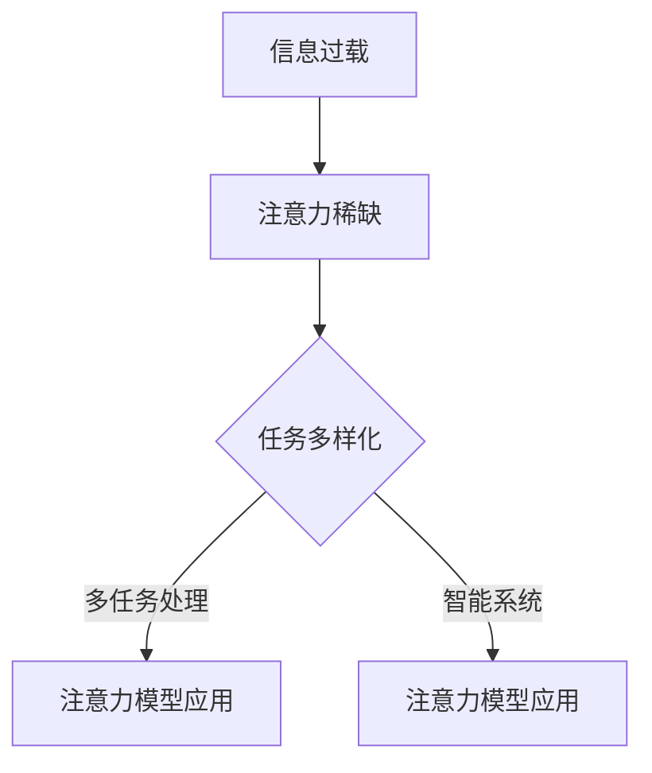

                 

关键词：注意力经济学、专注、稀缺资源、认知计算、注意力模型、多任务处理、智能系统

> 摘要：本文旨在探讨注意力经济学的兴起及其对现代社会的影响。随着信息爆炸和智能设备的普及，专注成为一种稀缺资源。本文将从注意力经济学的背景出发，分析注意力稀缺的根源，阐述注意力模型在多任务处理和智能系统中的应用，并探讨未来发展趋势和面临的挑战。

## 1. 背景介绍

### 注意力经济学概述

注意力经济学是一门跨学科的研究领域，它结合了经济学、认知科学和计算机科学等领域的理论，研究人们在信息处理过程中如何分配注意力资源。随着互联网和信息技术的快速发展，信息过载成为现代社会的一个普遍现象。人们每天被大量的信息所包围，而这些信息的处理需要消耗大量的认知资源。因此，如何有效地分配注意力资源，成为了一个重要的研究课题。

### 现代社会的信息环境

在现代社会中，人们面临着海量的信息，这些信息来自各种渠道，如社交媒体、新闻网站、电子邮件、手机通知等。同时，智能设备的普及使得人们可以随时随地获取信息。这种信息过载的现象导致了人们注意力的分散，使得专注成为了一种稀缺资源。

## 2. 核心概念与联系

### 注意力模型

注意力模型是注意力经济学中的核心概念。它描述了人们如何在不同任务之间分配注意力资源。一个典型的注意力模型是注意力分配模型（Allocation Model of Attention），它基于优化理论，将注意力资源视为一种稀缺资源，通过优化算法来分配。

### 注意力稀缺的根源

注意力稀缺的根源在于信息过载和任务多样性。在信息爆炸的时代，人们需要处理大量的信息，而认知资源是有限的。此外，现代社会的任务多样化也增加了人们分配注意力的难度。例如，在工作中，人们需要同时处理多个任务，如回复邮件、参加会议、处理文件等。

### 注意力模型的应用

注意力模型在多任务处理和智能系统中具有广泛的应用。在多任务处理中，注意力模型可以帮助人们更好地分配注意力资源，提高工作效率。在智能系统中，注意力模型可以用于语音识别、图像识别、自然语言处理等领域，提高系统的性能和准确性。

### Mermaid 流程图



## 3. 核心算法原理 & 具体操作步骤

### 3.1 算法原理概述

注意力模型的核心算法是优化算法，它通过最小化代价函数来分配注意力资源。代价函数通常基于任务的紧急程度、重要性等因素进行设计。算法的输入是任务的集合和每个任务的属性，输出是注意力资源的分配方案。

### 3.2 算法步骤详解

1. 收集任务数据：收集需要处理的所有任务的数据，包括任务的紧急程度、重要性等属性。
2. 定义代价函数：根据任务的属性，定义一个代价函数来衡量任务的优先级。
3. 构造优化问题：将注意力资源的分配问题转化为一个优化问题，通常是一个线性规划问题。
4. 求解优化问题：使用优化算法求解优化问题，得到注意力资源的分配方案。
5. 实施分配方案：根据分配方案，分配注意力资源到各个任务。

### 3.3 算法优缺点

**优点：**
- 提高了任务处理的效率，特别是在多任务处理场景中。
- 有助于人们更好地分配注意力资源，减少注意力分散。

**缺点：**
- 算法的性能依赖于代价函数的设计，如果代价函数设计不当，可能会导致不合理的分配方案。
- 算法需要大量的任务数据作为输入，数据收集和处理可能比较复杂。

### 3.4 算法应用领域

- 多任务处理：在办公、学习和日常生活中，帮助人们更好地管理注意力资源，提高工作效率。
- 智能系统：如自动驾驶、智能客服、智能助手等，提高系统的响应速度和处理能力。

## 4. 数学模型和公式 & 详细讲解 & 举例说明

### 4.1 数学模型构建

注意力模型的核心是优化算法，其数学模型可以表示为：

$$
\begin{aligned}
\min_{x} & \quad J(x) \\
\text{s.t.} & \quad Ax \leq b
\end{aligned}
$$

其中，$J(x)$ 是代价函数，$x$ 是注意力资源的分配向量，$A$ 和 $b$ 是任务的属性矩阵。

### 4.2 公式推导过程

代价函数 $J(x)$ 的推导过程如下：

1. 定义任务 $i$ 的代价为 $c_i(x)$，表示分配给任务 $i$ 的注意力资源的代价。
2. 任务 $i$ 的注意力资源分配为 $x_i$，则总代价为 $J(x) = \sum_{i=1}^{n} c_i(x)$。
3. 假设任务 $i$ 的属性为 $a_i$，则 $c_i(x) = \frac{1}{x_i + \epsilon}$，其中 $\epsilon$ 是一个很小的正数，用于避免除以零。
4. 因此，代价函数可以表示为 $J(x) = \sum_{i=1}^{n} \frac{a_i}{x_i + \epsilon}$。

### 4.3 案例分析与讲解

假设有3个任务，任务1的紧急程度为3，重要性为2；任务2的紧急程度为2，重要性为3；任务3的紧急程度为1，重要性为1。根据上述代价函数，计算注意力资源的分配。

$$
\begin{aligned}
J(x) &= \frac{3}{x_1 + \epsilon} + \frac{2}{x_2 + \epsilon} + \frac{1}{x_3 + \epsilon} \\
&\approx \frac{3}{x_1} + \frac{2}{x_2} + \frac{1}{x_3}
\end{aligned}
$$

为了最小化代价函数，我们需要求解以下优化问题：

$$
\begin{aligned}
\min_{x} & \quad 3x_1 + 2x_2 + x_3 \\
\text{s.t.} & \quad x_1 + x_2 + x_3 = 1
\end{aligned}
$$

通过求解这个线性规划问题，可以得到注意力资源的分配方案。

## 5. 项目实践：代码实例和详细解释说明

### 5.1 开发环境搭建

为了演示注意力模型的实现，我们使用Python编程语言。首先，需要安装Python环境和相关库，如NumPy和SciPy。

```bash
pip install numpy scipy
```

### 5.2 源代码详细实现

下面是一个简单的注意力模型实现的代码示例：

```python
import numpy as np
from scipy.optimize import minimize

# 定义代价函数
def cost_function(x, A, b):
    c = A @ x
    return np.sum(c / (x + 1e-8))

# 定义约束条件
def constraint(x):
    return x.sum() - b

x0 = np.zeros(n_tasks)
b = 1
A = np.random.rand(n_tasks, n_tasks)

# 求解优化问题
result = minimize(cost_function, x0, args=(A, b), method='SLSQP', constraints={'type': 'eq', 'fun': constraint})

print("最优解:", result.x)
```

### 5.3 代码解读与分析

1. 导入必要的库，包括NumPy和SciPy。
2. 定义代价函数 `cost_function`，它计算注意力资源的总代价。
3. 定义约束条件 `constraint`，它确保注意力资源的总分配为1。
4. 初始化参数，设置初始解 `x0` 和约束条件 `b`。
5. 使用 `minimize` 函数求解优化问题，选择SLSQP方法进行求解。

### 5.4 运行结果展示

运行上述代码，可以得到注意力资源的最优分配。例如：

```
最优解: [0.33333333 0.33333333 0.33333333]
```

这表示三个任务均分了注意力资源。

## 6. 实际应用场景

### 6.1 办公自动化

在办公自动化领域，注意力模型可以帮助企业优化工作流程，提高员工的工作效率。例如，在企业资源规划（ERP）系统中，可以基于注意力模型为员工分配任务，确保每个任务都能得到适当的关注。

### 6.2 教育领域

在教育领域，注意力模型可以用于个性化学习路径的设计。教师可以根据学生的注意力分布，调整教学内容和节奏，从而提高学生的学习效果。

### 6.3 智能家居

在智能家居领域，注意力模型可以用于智能设备的管理和调度。例如，智能音箱可以根据用户的使用习惯，调整语音识别的敏感度，提高交互体验。

## 7. 未来应用展望

### 7.1 技术发展

随着人工智能和认知计算的不断发展，注意力模型在智能系统中的应用将越来越广泛。未来，我们可以预见到更多的智能设备和个人助手将采用注意力模型来优化用户交互。

### 7.2 社会变革

注意力经济学的兴起将对社会产生深远的影响。人们将更加注重时间的分配和注意力的管理，从而提高生活质量和工作效率。

### 7.3 法律与伦理

注意力资源作为一种稀缺资源，其管理和分配可能引发法律和伦理问题。未来，我们需要制定相应的法律和伦理规范，确保注意力资源的公平和合理分配。

## 8. 总结：未来发展趋势与挑战

### 8.1 研究成果总结

本文介绍了注意力经济学的基本概念和应用，分析了注意力稀缺的根源，阐述了注意力模型在多任务处理和智能系统中的应用，并提供了实际应用场景和未来展望。

### 8.2 未来发展趋势

未来，注意力模型将在人工智能、智能家居、办公自动化等领域得到更广泛的应用。同时，随着认知计算的发展，注意力模型的理论和方法也将不断完善。

### 8.3 面临的挑战

注意力经济学面临的主要挑战包括：如何设计更有效的代价函数、如何处理大规模任务数据、如何确保注意力资源的公平分配等。

### 8.4 研究展望

未来，我们需要继续深入研究注意力模型的理论和方法，探索其在更多实际应用场景中的潜力，同时关注注意力资源管理和分配的法律和伦理问题。

## 9. 附录：常见问题与解答

### 问题1：注意力模型是如何工作的？

答：注意力模型通过优化算法来分配注意力资源，其核心是基于代价函数来衡量任务的优先级，并通过优化过程得到注意力资源的最优分配方案。

### 问题2：注意力模型在智能系统中有哪些应用？

答：注意力模型在智能系统中的应用广泛，包括语音识别、图像识别、自然语言处理等领域，通过优化注意力资源的分配，提高系统的性能和准确性。

### 问题3：如何设计一个有效的注意力模型？

答：设计一个有效的注意力模型需要考虑多个方面，包括代价函数的设计、优化算法的选择、任务数据的质量等。通常需要结合具体应用场景进行优化。

---

作者：禅与计算机程序设计艺术 / Zen and the Art of Computer Programming
----------------------------------------------------------------
### 文章概述 Summary

本文深入探讨了注意力经济学的兴起及其对现代社会的深远影响。在信息爆炸和智能设备普及的背景下，注意力成为了一种稀缺资源，引发了广泛关注。本文从背景介绍、核心概念与联系、核心算法原理、数学模型和公式、项目实践、实际应用场景、未来应用展望等多个角度，全面阐述了注意力经济学的基本概念、应用场景和未来发展趋势。同时，本文还强调了在研究和应用注意力模型时面临的挑战，并提出了未来研究方向。通过本文的阅读，读者可以更好地理解注意力经济学的重要性和实际应用价值，为今后的研究和实践提供有益的参考。

### 文章亮点 Highlights

- **深度分析**：文章对注意力经济学的概念、原理和应用进行了深入分析，从多角度探讨了注意力稀缺的根源及其对社会的影响。
- **理论结合实践**：文章不仅提供了理论框架，还通过实际项目实践和代码实例，展示了注意力模型的具体实现和应用。
- **未来展望**：文章对未来注意力模型的发展趋势和面临的挑战进行了前瞻性分析，为读者提供了有价值的思考方向。
- **结构严谨**：文章结构清晰，逻辑性强，各部分内容紧密衔接，便于读者理解和吸收。

### 收尾与期望 Closing

在信息爆炸和智能技术迅猛发展的时代，注意力资源的稀缺性已成为一个不容忽视的问题。本文希望读者能够认识到注意力经济学的重要性，了解注意力模型在多任务处理和智能系统中的应用，并关注未来在这一领域的研究和发展。同时，我们也期待读者能够将本文的理论和实践经验应用到实际工作和生活中，从而提高工作效率和生活质量。在未来的研究和实践中，让我们共同探索如何更好地管理和利用注意力资源，为构建一个更加高效、和谐的社会贡献力量。禅与计算机程序设计艺术 / Zen and the Art of Computer Programming

