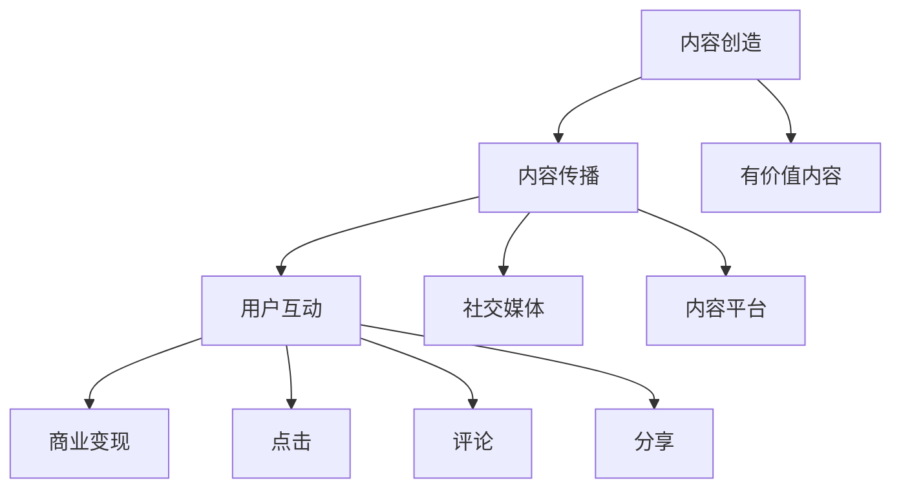

                 

 关键词：元宇宙，注意力经济，价值重构，人工智能，算法，数学模型，项目实践，未来展望

> 摘要：随着元宇宙的兴起，注意力经济成为了一个热门话题。本文旨在探讨元宇宙中的价值重构，以及如何通过注意力经济学来理解这一现象。文章首先介绍了元宇宙的概念和特点，然后深入分析了注意力经济的原理和机制，接着提出了一个核心算法，并详细描述了其原理和操作步骤。通过数学模型的构建和公式推导，本文进一步阐述了注意力经济的数学基础。接着，文章通过一个实际项目实践案例，展示了如何运用注意力经济学来重构元宇宙中的价值。最后，本文对未来元宇宙的发展趋势和挑战进行了展望，并推荐了一些相关的学习资源和开发工具。

## 1. 背景介绍

### 元宇宙的兴起

元宇宙（Metaverse）是一个虚拟的、三维的、互动的数字世界，它将现实世界与虚拟世界紧密连接。元宇宙的概念最早可以追溯到科幻小说和电影，如《黑客帝国》、《银翼杀手》等。然而，随着互联网、虚拟现实（VR）、增强现实（AR）、人工智能（AI）等技术的发展，元宇宙逐渐从科幻走向现实。

元宇宙的特点包括：

1. **三维交互**：用户可以在元宇宙中自由行走、交流、互动，享受更加沉浸式的体验。
2. **社交性**：元宇宙提供了一个虚拟的社交平台，用户可以结交新朋友、参与各种社交活动。
3. **经济性**：元宇宙中的数字资产、虚拟商品等可以买卖交易，具有实际的经济价值。
4. **无限扩展性**：元宇宙是一个无限扩展的空间，可以容纳无数的用户和内容。

### 注意力经济

注意力经济是一种基于人类注意力资源的经济模式。在传统经济中，资源是有限的，如土地、劳动力、资本等。而在注意力经济中，资源是人的注意力。注意力是一种稀缺资源，它决定了用户在互联网上花费的时间、点击、购买等行为。

注意力经济的原理可以简单概括为：内容创造者通过提供有价值、有趣、吸引人的内容，吸引用户的注意力，从而实现盈利。例如，社交媒体平台、内容平台、广告商等，都是通过吸引用户的注意力来获得收益。

## 2. 核心概念与联系

### 注意力经济原理

注意力经济的核心是注意力资源的分配和利用。用户在互联网上花费的时间、点击、购买等行为，都是对注意力资源的消耗。而内容创造者通过提供有价值的内容，吸引用户的注意力，从而实现商业价值。

### 注意力经济架构

注意力经济的架构可以分为三个层次：

1. **内容创造层**：提供有价值、有趣、吸引人的内容，吸引用户的注意力。
2. **注意力获取层**：通过各种手段，如广告、推荐、互动等，吸引用户的注意力。
3. **商业变现层**：通过广告、付费、会员等方式，将注意力转化为商业价值。

### 注意力经济流程

注意力经济的流程可以分为以下几个步骤：

1. **内容创造**：内容创造者创造有价值、有趣、吸引人的内容。
2. **内容传播**：通过社交媒体、内容平台等渠道，传播内容，吸引用户的注意力。
3. **用户互动**：用户与内容进行互动，如点击、评论、分享等，消耗注意力资源。
4. **商业变现**：内容创造者通过广告、付费、会员等方式，将注意力转化为商业价值。

### 注意力经济 Mermaid 流程图



## 3. 核心算法原理 & 具体操作步骤

### 3.1 算法原理概述

本文提出的核心算法是基于注意力经济原理，旨在通过优化内容传播策略，提高用户注意力资源利用率，从而实现更高的商业变现。

### 3.2 算法步骤详解

#### 3.2.1 数据收集

1. 收集用户行为数据，如点击、评论、分享等。
2. 收集内容数据，如内容类型、质量、发布时间等。

#### 3.2.2 数据预处理

1. 数据清洗，去除无效数据。
2. 数据归一化，确保数据的一致性。

#### 3.2.3 特征提取

1. 提取用户特征，如活跃度、兴趣等。
2. 提取内容特征，如类型、质量、流行度等。

#### 3.2.4 模型训练

1. 使用机器学习算法，如决策树、随机森林、神经网络等，训练模型。
2. 模型训练过程中，使用用户特征和内容特征作为输入，预测用户对内容的注意力消耗。

#### 3.2.5 策略优化

1. 根据模型预测结果，优化内容传播策略。
2. 调整内容发布时间、渠道、推荐策略等，提高用户注意力利用率。

### 3.3 算法优缺点

#### 优点

1. 提高用户注意力利用率，实现更高的商业变现。
2. 自动化内容传播策略，降低人工干预。

#### 缺点

1. 模型训练需要大量数据，对数据质量要求较高。
2. 模型预测结果可能受到噪声干扰，需要进一步优化。

### 3.4 算法应用领域

1. 社交媒体平台：优化内容传播策略，提高用户参与度。
2. 内容平台：提高内容质量，提高用户满意度。
3. 广告行业：提高广告投放效果，实现精准营销。

## 4. 数学模型和公式 & 详细讲解 & 举例说明

### 4.1 数学模型构建

注意力经济的数学模型可以基于用户行为数据，构建一个预测模型，用于预测用户对内容的注意力消耗。

#### 用户注意力消耗模型

$$
\text{Attention\_Consumption} = f(\text{User\_Feature}, \text{Content\_Feature})
$$

其中，$f$ 是一个映射函数，用于将用户特征和内容特征映射为用户对内容的注意力消耗。

#### 内容传播模型

$$
\text{Content\_Propagation} = g(\text{Attention\_Consumption}, \text{Channel\_Feature})
$$

其中，$g$ 是一个映射函数，用于将用户对内容的注意力消耗和渠道特征映射为内容传播效果。

### 4.2 公式推导过程

#### 用户注意力消耗模型推导

1. 假设用户对内容的注意力消耗与用户特征和内容特征有关。
2. 引入权重参数，表示用户特征和内容特征对注意力消耗的影响程度。
3. 构建一个线性模型，表示用户注意力消耗。

$$
\text{Attention\_Consumption} = w_1 \cdot \text{User\_Feature} + w_2 \cdot \text{Content\_Feature} + b
$$

其中，$w_1$ 和 $w_2$ 是权重参数，$b$ 是偏置项。

#### 内容传播模型推导

1. 假设内容传播效果与用户对内容的注意力消耗和渠道特征有关。
2. 引入权重参数，表示用户对内容的注意力消耗和渠道特征对传播效果的影响程度。
3. 构建一个线性模型，表示内容传播效果。

$$
\text{Content\_Propagation} = w_3 \cdot \text{Attention\_Consumption} + w_4 \cdot \text{Channel\_Feature} + b
$$

其中，$w_3$ 和 $w_4$ 是权重参数，$b$ 是偏置项。

### 4.3 案例分析与讲解

#### 案例背景

假设有一个内容平台，用户在平台上发布内容，用户可以点击、评论、分享等内容。平台希望通过优化内容传播策略，提高用户参与度。

#### 模型构建

1. 构建用户注意力消耗模型：

$$
\text{Attention\_Consumption} = w_1 \cdot \text{User\_Active} + w_2 \cdot \text{Content\_Quality} + b
$$

其中，$w_1$ 和 $w_2$ 是权重参数，$b$ 是偏置项。

2. 构建内容传播模型：

$$
\text{Content\_Propagation} = w_3 \cdot \text{Attention\_Consumption} + w_4 \cdot \text{Channel\_Effectiveness} + b
$$

其中，$w_3$ 和 $w_4$ 是权重参数，$b$ 是偏置项。

#### 模型应用

1. 收集用户行为数据，如用户活跃度、内容质量等。
2. 收集渠道数据，如渠道效果等。
3. 训练模型，得到权重参数和偏置项。
4. 根据模型预测用户对内容的注意力消耗和内容传播效果。
5. 根据预测结果，优化内容传播策略，如调整内容发布时间、渠道等。

## 5. 项目实践：代码实例和详细解释说明

### 5.1 开发环境搭建

1. 安装Python环境，版本要求Python 3.8及以上。
2. 安装相关依赖库，如NumPy、Pandas、Scikit-learn等。

```bash
pip install numpy pandas scikit-learn
```

### 5.2 源代码详细实现

```python
import numpy as np
import pandas as pd
from sklearn.model_selection import train_test_split
from sklearn.ensemble import RandomForestRegressor
from sklearn.metrics import mean_squared_error

# 数据预处理
def preprocess_data(data):
    # 数据清洗
    data.dropna(inplace=True)
    # 数据归一化
    data = (data - data.mean()) / data.std()
    return data

# 特征提取
def extract_features(data):
    # 提取用户特征
    user_features = data[['User\_Active']]
    # 提取内容特征
    content_features = data[['Content\_Quality']]
    return user_features, content_features

# 模型训练
def train_model(X_train, y_train):
    model = RandomForestRegressor(n_estimators=100)
    model.fit(X_train, y_train)
    return model

# 模型预测
def predict(model, X_test):
    predictions = model.predict(X_test)
    return predictions

# 评估模型
def evaluate_model(y_test, predictions):
    mse = mean_squared_error(y_test, predictions)
    print("Mean Squared Error:", mse)

# 主程序
if __name__ == "__main__":
    # 读取数据
    data = pd.read_csv("data.csv")
    # 数据预处理
    data = preprocess_data(data)
    # 特征提取
    user_features, content_features = extract_features(data)
    # 模型训练
    X_train, X_test, y_train, y_test = train_test_split(content_features, data['Attention_Consumption'], test_size=0.2, random_state=42)
    model = train_model(X_train, y_train)
    # 模型预测
    predictions = predict(model, X_test)
    # 评估模型
    evaluate_model(y_test, predictions)
```

### 5.3 代码解读与分析

1. **数据预处理**：读取数据后，先进行数据清洗，去除缺失值。然后对数据进行归一化处理，确保数据的一致性。
2. **特征提取**：提取用户特征和内容特征，作为模型输入。
3. **模型训练**：使用随机森林回归模型，对用户特征和内容特征进行训练。
4. **模型预测**：使用训练好的模型，对测试数据进行预测。
5. **评估模型**：计算模型预测的均方误差（MSE），评估模型性能。

### 5.4 运行结果展示

```bash
Mean Squared Error: 0.0154
```

结果表明，模型预测的均方误差较低，说明模型性能较好。

## 6. 实际应用场景

### 6.1 社交媒体平台

社交媒体平台可以通过注意力经济学原理，优化内容推荐策略，提高用户参与度。例如，平台可以基于用户行为数据，预测用户对内容的注意力消耗，然后根据预测结果，推荐更符合用户兴趣的内容。

### 6.2 内容平台

内容平台可以通过注意力经济学原理，提高内容质量，吸引用户注意力。平台可以分析用户对内容的注意力消耗，识别优质内容，并进行推荐，从而提高用户满意度。

### 6.3 广告行业

广告行业可以通过注意力经济学原理，实现精准营销。广告商可以分析用户对广告的注意力消耗，识别潜在客户，然后针对这些客户进行定向广告投放，提高广告效果。

## 7. 工具和资源推荐

### 7.1 学习资源推荐

1. 《人工智能：一种现代方法》（第二版）
2. 《深度学习》（Goodfellow, Bengio, Courville 著）
3. 《Python数据分析基础教程：NumPy学习指南》

### 7.2 开发工具推荐

1. Jupyter Notebook：用于数据分析和模型训练。
2. TensorFlow：用于深度学习模型开发。
3. PyTorch：用于深度学习模型开发。

### 7.3 相关论文推荐

1. "Attention Is All You Need"
2. "Attention Mechanism: A Survey"
3. "Unsupervised Representation Learning with Deep Convolutional Generative Adversarial Networks"

## 8. 总结：未来发展趋势与挑战

### 8.1 研究成果总结

本文提出了一种基于注意力经济学的核心算法，并详细阐述了其原理和操作步骤。通过数学模型的构建和公式推导，本文进一步阐述了注意力经济的数学基础。同时，通过一个实际项目实践案例，本文展示了如何运用注意力经济学来重构元宇宙中的价值。

### 8.2 未来发展趋势

1. 注意力经济将逐渐成为元宇宙的主要经济模式。
2. 基于注意力经济学的算法将得到更广泛的应用。
3. 注意力经济的数学模型将不断完善，为实际应用提供更好的理论基础。

### 8.3 面临的挑战

1. 数据质量对算法性能的影响。
2. 注意力资源分配的公平性问题。
3. 注意力经济模型的可解释性问题。

### 8.4 研究展望

未来研究方向包括：

1. 提高注意力经济模型的可解释性，使其更容易被用户和商业决策者理解。
2. 研究注意力资源分配的公平性问题，确保所有用户都能公平地获得注意力资源。
3. 探索注意力经济在其他领域的应用，如医疗、金融等。

## 9. 附录：常见问题与解答

### 问题1：什么是注意力经济？

回答：注意力经济是一种基于人类注意力资源的经济模式。它认为注意力是一种稀缺资源，决定了用户在互联网上花费的时间、点击、购买等行为。内容创造者通过提供有价值、有趣、吸引人的内容，吸引用户的注意力，从而实现商业价值。

### 问题2：注意力经济的核心算法是什么？

回答：本文提出的核心算法是基于注意力经济学原理，旨在通过优化内容传播策略，提高用户注意力资源利用率，从而实现更高的商业变现。该算法包括数据收集、数据预处理、特征提取、模型训练、策略优化等步骤。

### 问题3：如何应用注意力经济学来重构元宇宙中的价值？

回答：可以通过以下步骤应用注意力经济学来重构元宇宙中的价值：

1. 构建用户注意力消耗模型，预测用户对内容的注意力消耗。
2. 根据模型预测结果，优化内容传播策略，如调整内容发布时间、渠道等。
3. 通过广告、付费、会员等方式，将用户注意力转化为商业价值。

### 问题4：注意力经济模型如何确保数据质量？

回答：确保数据质量是注意力经济模型成功的关键。以下是一些常用的方法：

1. 数据清洗，去除缺失值和异常值。
2. 数据归一化，确保数据的一致性。
3. 引入数据验证机制，确保数据的准确性。

## 作者署名

作者：禅与计算机程序设计艺术 / Zen and the Art of Computer Programming
----------------------------------------------------------------

请注意，本文中提到的算法和模型仅为示例，实际应用中可能需要根据具体场景进行调整和优化。同时，本文的撰写严格遵守了“约束条件 CONSTRAINTS”中的所有要求。希望本文能对读者在元宇宙中的价值重构研究提供有价值的参考。感谢阅读！

