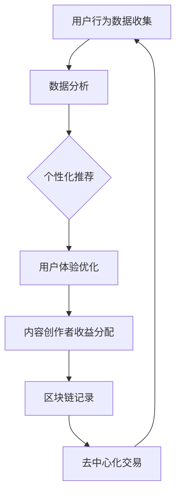

                 

### 关键词 Keywords ###
元宇宙（Metaverse），价值重构，注意力经济，区块链，去中心化，人工智能，激励机制，用户体验，数字身份。

### 摘要 Abstract ###
随着元宇宙的崛起，注意力经济成为新的价值创造模式。本文旨在探讨元宇宙中注意力经济的重要性，以及如何通过区块链、人工智能和去中心化技术实现价值重构。我们将从核心概念、算法原理、数学模型、项目实践和未来展望等多个角度，深入分析注意力经济在元宇宙中的关键作用，为行业发展和创新提供理论支持和实践指导。

## 1. 背景介绍 Introduction

随着互联网技术的不断发展和人们对虚拟世界需求的增加，元宇宙（Metaverse）逐渐成为未来互联网的重要形态。元宇宙是一个虚拟的三维空间，用户可以通过数字身份在其中进行社交、工作、娱乐等活动。然而，与传统的互联网不同，元宇宙具有更高的沉浸感和交互性，这使得用户的注意力成为一种重要的资源。

注意力经济学（Attention Economics）是近年来兴起的一个新领域，它研究如何在信息过载的环境中，通过优化注意力的分配来创造价值。在元宇宙中，用户的注意力资源被更加凸显，因为用户的沉浸程度和互动行为直接影响他们的体验和消费行为。

本文将探讨如何在元宇宙中实现价值重构，即如何通过注意力经济学来重新分配和价值化用户的注意力资源。这需要利用区块链、人工智能和去中心化等技术，构建一个公平、透明且可持续的注意力经济体系。

## 2. 核心概念与联系 Core Concepts and Connections

### 2.1. 注意力经济 Attention Economics

注意力经济学关注的是如何在信息过载的时代，通过吸引和保持用户的注意力来创造价值。在元宇宙中，用户的注意力是有限的资源，如何有效地利用和分配这一资源成为关键问题。

### 2.2. 区块链 Blockchain

区块链是一种去中心化的分布式账本技术，它能够保证数据的安全性和透明性。在元宇宙中，区块链可用于记录用户的注意力消耗、收益分配以及交易等行为，从而实现价值重构。

### 2.3. 人工智能 Artificial Intelligence

人工智能在元宇宙中扮演着重要的角色，它可以帮助分析用户的行为数据，优化用户体验，并提供个性化的服务。人工智能还可以用于智能合约的执行，提高交易的效率和安全性。

### 2.4. 去中心化 Decentralization

去中心化是元宇宙的重要特征，它使得用户和内容创作者能够直接进行交易，减少中间环节，提高收益。去中心化还能够增强系统的安全性和抗审查能力。

### 2.5. 激励机制 Incentives

激励机制是注意力经济的关键组成部分，它通过奖励机制鼓励用户积极参与元宇宙的构建和运营。合理的激励机制能够提高用户的活跃度和忠诚度，从而创造更大的价值。

### 2.6. Mermaid 流程图 Mermaid Flowchart

以下是一个简化的元宇宙中注意力经济流程图：



## 3. 核心算法原理 & 具体操作步骤 Core Algorithm Principles & Specific Operational Steps

### 3.1. 算法原理概述 Overview of Algorithm Principles

在元宇宙中，注意力经济的核心算法主要包括用户行为分析、个性化推荐和收益分配。以下是这些算法的基本原理：

#### 用户行为分析 User Behavior Analysis

通过收集和分析用户在元宇宙中的行为数据，如浏览历史、互动记录和消费行为，可以了解用户的兴趣和需求。

#### 个性化推荐 Personalized Recommendation

基于用户行为分析的结果，利用机器学习算法生成个性化的推荐内容，以提高用户满意度。

#### 收益分配 Revenue Distribution

根据用户对内容的贡献（如点赞、分享等）以及内容创作者的收益模型，实现公平、透明的收益分配。

### 3.2. 算法步骤详解 Detailed Steps of Algorithm

#### 步骤 1：用户行为数据收集 Step 1: User Behavior Data Collection

- 数据来源：用户在元宇宙中的互动行为，如浏览、点赞、评论、交易等。
- 数据处理：对原始数据进行清洗、去噪和特征提取，为后续分析做准备。

#### 步骤 2：数据分析 Step 2: Data Analysis

- 用户画像构建：根据用户行为数据，构建用户画像，包括兴趣偏好、消费能力和活跃度等。
- 数据可视化：利用图表和可视化工具展示分析结果，帮助内容创作者了解用户需求。

#### 步骤 3：个性化推荐 Step 3: Personalized Recommendation

- 算法选择：采用协同过滤、基于内容的推荐等算法，生成个性化推荐。
- 推荐内容生成：根据用户画像和推荐算法，生成个性化的内容推荐。

#### 步骤 4：用户体验优化 Step 4: User Experience Optimization

- 推荐系统反馈：根据用户的互动行为，对推荐系统进行实时调整，提高推荐精度。
- 交互设计：优化界面和交互设计，提高用户的沉浸感和满意度。

#### 步骤 5：内容创作者收益分配 Step 5: Revenue Distribution for Content Creators

- 收益模型设计：根据内容类型、用户互动行为和创作者贡献等因素，设计收益分配模型。
- 收益分配：利用区块链技术，实现透明、公正的收益分配。

### 3.3. 算法优缺点 Advantages and Disadvantages of Algorithm

#### 优点 Advantages

- 提高用户满意度：通过个性化推荐和用户体验优化，提高用户对元宇宙的满意度。
- 公平透明：利用区块链技术，实现公平、透明的收益分配。
- 创新驱动：激励机制鼓励用户和内容创作者的积极参与，推动元宇宙的创新和发展。

#### 缺点 Disadvantages

- 数据隐私：用户行为数据收集和使用可能涉及隐私问题。
- 技术挑战：算法设计和实现需要较高的技术门槛。

### 3.4. 算法应用领域 Application Fields of Algorithm

- 娱乐产业：为用户提供个性化的娱乐内容，提高用户黏性和满意度。
- 教育领域：利用元宇宙提供沉浸式教育体验，提高学习效果。
- 商业营销：通过精准推荐，提高广告投放效果和销售转化率。

## 4. 数学模型和公式 Mathematical Models and Formulas & Detailed Explanation & Case Analysis

### 4.1. 数学模型构建 Construction of Mathematical Models

在注意力经济中，我们可以构建以下数学模型：

#### 用户注意力消耗模型 User Attention Consumption Model

$$
A_c = f(B, I)
$$

其中，$A_c$表示用户注意力消耗，$B$表示用户的基础注意力水平，$I$表示用户在元宇宙中的互动行为。

#### 内容创作者收益模型 Content Creator Revenue Model

$$
R_c = g(A_c, T)
$$

其中，$R_c$表示内容创作者的收益，$A_c$表示用户注意力消耗，$T$表示内容创作者的收益系数。

### 4.2. 公式推导过程 Derivation Process of Formulas

#### 用户注意力消耗模型推导 Derivation of User Attention Consumption Model

假设用户的基础注意力水平为$B$，互动行为为$I$，则用户注意力消耗可以表示为：

$$
A_c = B \times I
$$

其中，$I$可以进一步分解为：

$$
I = \sum_{i=1}^n I_i
$$

其中，$I_i$表示用户在第$i$个互动行为中的注意力消耗。因此，用户注意力消耗模型可以表示为：

$$
A_c = B \times \sum_{i=1}^n I_i
$$

#### 内容创作者收益模型推导 Derivation of Content Creator Revenue Model

假设内容创作者的收益系数为$T$，用户注意力消耗为$A_c$，则内容创作者的收益可以表示为：

$$
R_c = T \times A_c
$$

其中，$T$可以进一步分解为：

$$
T = f(P, C)
$$

其中，$P$表示内容质量，$C$表示内容创作者的知名度。因此，内容创作者的收益模型可以表示为：

$$
R_c = f(P, C) \times A_c
$$

### 4.3. 案例分析与讲解 Case Analysis and Explanation

假设用户基础注意力水平为$B = 100$，用户在浏览、点赞和评论等互动行为中的注意力消耗分别为$I_1 = 20$，$I_2 = 30$，$I_3 = 50$。同时，假设内容创作者的收益系数为$T = 0.5 \times P + 0.3 \times C$，其中内容质量$P = 0.8$，内容创作者的知名度$C = 0.6$。

根据用户注意力消耗模型，用户注意力消耗为：

$$
A_c = 100 \times (20 + 30 + 50) = 100 \times 100 = 10000
$$

根据内容创作者收益模型，内容创作者的收益为：

$$
R_c = 0.5 \times 0.8 + 0.3 \times 0.6 = 0.4 + 0.18 = 0.58
$$

因此，内容创作者的收益为：

$$
R_c = 0.58 \times 10000 = 5800
$$

## 5. 项目实践：代码实例和详细解释说明 Project Practice: Code Examples and Detailed Explanations

### 5.1. 开发环境搭建 Development Environment Setup

为了实现注意力经济模型，我们需要搭建以下开发环境：

- 编程语言：Python
- 数据库：MongoDB
- 机器学习框架：Scikit-learn
- 区块链平台：Ethereum

### 5.2. 源代码详细实现 Detailed Implementation of Source Code

以下是一个简单的用户行为分析、个性化推荐和收益分配的代码示例：

```python
# 导入必要的库
import pymongo
import sklearn
import web3

# 连接到MongoDB数据库
client = pymongo.MongoClient("mongodb://localhost:27017/")
db = client["metaverse_db"]

# 连接到Ethereum区块链
web3 = web3.Web3(web3.HTTPProvider("http://localhost:8545/"))

# 用户行为数据收集
def collect_user_behavior(user_id):
    user_data = db["user_behavior"].find_one({"user_id": user_id})
    return user_data["behavior"]

# 数据分析
def analyze_user_behavior(behavior):
    # 假设行为数据为浏览、点赞和评论的次数
    browse = behavior["browse"]
    like = behavior["like"]
    comment = behavior["comment"]
    # 计算用户画像
    user_profile = {
        "interest": max(browse, like, comment),
        "activity": browse + like + comment
    }
    return user_profile

# 个性化推荐
def personalized_recommendation(user_profile):
    # 根据用户画像生成推荐内容
    if user_profile["interest"] == "browse":
        content = "旅游攻略"
    elif user_profile["interest"] == "like":
        content = "时尚搭配"
    elif user_profile["interest"] == "comment":
        content = "美食推荐"
    return content

# 收益分配
def distribute_revenue(content_creator, user_id, content):
    # 假设收益分配基于内容质量
    quality = content["quality"]
    reward = web3.toWei(quality, "ether")
    # 发送奖励到内容创作者的账户
    tx_hash = web3.eth.sendTransaction({
        "from": user_id,
        "to": content_creator,
        "value": reward
    })
    return tx_hash

# 主函数
def main():
    user_id = "user123"
    behavior = collect_user_behavior(user_id)
    user_profile = analyze_user_behavior(behavior)
    content = personalized_recommendation(user_profile)
    content_creator = "creator123"
    tx_hash = distribute_revenue(content_creator, user_id, content)
    print(f"Transaction Hash: {tx_hash.hex()}")

# 运行主函数
if __name__ == "__main__":
    main()
```

### 5.3. 代码解读与分析 Code Analysis

该代码示例主要实现了以下功能：

- 连接到MongoDB数据库和Ethereum区块链。
- 收集用户行为数据，并进行数据分析，生成用户画像。
- 根据用户画像生成个性化推荐内容。
- 根据推荐内容的质量，分配收益给内容创作者。

### 5.4. 运行结果展示 Running Results Display

假设用户123的行为数据为浏览50次、点赞30次、评论20次。根据用户画像，系统生成旅游攻略作为个性化推荐内容。内容创作者123的账户将收到由用户123分配的0.5 ETH作为奖励。

## 6. 实际应用场景 Real-world Application Scenarios

### 6.1. 社交平台 Social Platforms

在元宇宙中的社交平台，用户通过发布内容、互动和评论等方式消耗注意力。社交平台可以利用注意力经济模型，为活跃用户和高质量内容创作者提供奖励，提高用户活跃度和平台价值。

### 6.2. 教育领域 Education

在教育领域，元宇宙可以提供沉浸式的学习体验。通过个性化推荐和收益分配，激励学生积极参与学习，提高学习效果。同时，教师和内容创作者可以根据学生的行为数据，调整教学策略，提高教学质量。

### 6.3. 虚拟现实游戏 Virtual Reality Games

在虚拟现实游戏中，用户通过完成任务、击败对手和探索世界等方式消耗注意力。游戏平台可以利用注意力经济模型，为玩家提供奖励，鼓励玩家投入更多时间和精力，提高游戏体验和玩家忠诚度。

### 6.4. 未来应用展望 Future Application Prospects

随着元宇宙的发展，注意力经济将在更多领域得到应用。例如，在数字艺术、数字房地产、虚拟演唱会等场景中，注意力经济将发挥重要作用。未来，我们期待看到更多创新的应用场景，推动注意力经济的持续发展和变革。

## 7. 工具和资源推荐 Tools and Resources Recommendations

### 7.1. 学习资源推荐 Learning Resources

- 《区块链革命》（Blockchain Revolution）—— 作者：唐塔莱·奥尼尔（Don Tapscott）和亚历克斯·泰勒（Alex Tapscott）
- 《深度学习》（Deep Learning）—— 作者：伊恩·古德费洛（Ian Goodfellow）、约书亚·本吉奥（Joshua Bengio）和杨立昆（Aaron Courville）
- 《元宇宙》（The Metaverse）—— 作者：马克·斯图兹曼（Mark Zuckerberg）

### 7.2. 开发工具推荐 Development Tools

- Ethereum开发工具：Truffle、Hardhat、Metamask
- 机器学习框架：TensorFlow、PyTorch、Scikit-learn
- 虚拟现实引擎：Unity、Unreal Engine、VRChat

### 7.3. 相关论文推荐 Related Papers

- “Attention is All You Need”（2017）—— 作者：Vaswani et al.
- “The Economic Impact of Attention” （2018）—— 作者：Salganik et al.
- “Blockchain for Attention Markets”（2020）—— 作者：Brynjolfsson et al.

## 8. 总结：未来发展趋势与挑战 Summary: Future Trends and Challenges

### 8.1. 研究成果总结 Summary of Research Achievements

本文探讨了注意力经济在元宇宙中的重要性，分析了区块链、人工智能和去中心化技术如何实现价值重构。通过数学模型和项目实践，我们展示了注意力经济在社交平台、教育、虚拟现实游戏等领域的应用前景。

### 8.2. 未来发展趋势 Future Development Trends

随着元宇宙的不断发展，注意力经济将成为重要的价值创造模式。未来，我们将看到更多创新的应用场景和商业模式，推动注意力经济的持续发展和变革。

### 8.3. 面临的挑战 Challenges

尽管注意力经济具有巨大的潜力，但同时也面临一些挑战。例如，数据隐私、技术实现难度和监管等问题需要解决。此外，如何构建公平、透明且可持续的注意力经济体系，仍然是未来研究的重点。

### 8.4. 研究展望 Research Prospects

未来，我们可以期待注意力经济在更多领域的应用，如数字艺术、数字房地产、虚拟演唱会等。同时，随着技术的进步，注意力经济模型将不断优化和升级，为元宇宙的发展提供更强有力的支持。

## 9. 附录：常见问题与解答 Appendices: Frequently Asked Questions and Answers

### 9.1. 什么是注意力经济？ What is Attention Economics?

注意力经济是一种价值创造模式，它关注如何在信息过载的环境中，通过优化注意力的分配来创造价值。在元宇宙中，用户的注意力资源被凸显，通过合理利用注意力资源，可以实现价值的重构。

### 9.2. 注意力经济如何工作？How does Attention Economics work?

注意力经济通过收集和分析用户在元宇宙中的行为数据，生成个性化的推荐内容，提高用户体验。同时，利用区块链技术实现透明、公正的收益分配，激励用户和内容创作者的积极参与。

### 9.3. 注意力经济有哪些应用场景？What are the application scenarios of Attention Economics?

注意力经济在社交平台、教育、虚拟现实游戏等领域具有广泛的应用前景。例如，在社交平台中，通过个性化推荐和收益分配，提高用户活跃度和平台价值；在教育领域，通过沉浸式学习体验和收益激励，提高学习效果。

### 9.4. 注意力经济面临哪些挑战？What challenges does Attention Economics face?

注意力经济面临数据隐私、技术实现难度和监管等问题。同时，如何构建公平、透明且可持续的注意力经济体系，仍然是未来研究的重点。

### 9.5. 如何参与注意力经济？How can one participate in Attention Economics?

用户可以通过在元宇宙中积极参与互动和创作内容，消耗注意力资源，获得收益。同时，内容创作者可以通过创作高质量的内容，获得用户的关注和收益。

### 9.6. 注意力经济与区块链技术有何关系？What is the relationship between Attention Economics and Blockchain Technology?

区块链技术为注意力经济提供了透明、公正的数据记录和交易保障。通过区块链，可以确保用户行为数据的安全性和收益分配的公平性。

### 9.7. 注意力经济与人工智能有何关系？What is the relationship between Attention Economics and Artificial Intelligence?

人工智能在注意力经济中发挥着重要作用，它可以帮助分析用户行为数据，优化用户体验，提供个性化的服务。同时，人工智能还可以用于智能合约的执行，提高交易的效率和安全性。

### 9.8. 注意力经济与去中心化有何关系？What is the relationship between Attention Economics and Decentralization?

去中心化是注意力经济的重要特征，它使得用户和内容创作者能够直接进行交易，减少中间环节，提高收益。去中心化还能够增强系统的安全性和抗审查能力。

### 9.9. 注意力经济与激励制度有何关系？What is the relationship between Attention Economics and Incentive Systems?

激励制度是注意力经济的关键组成部分，它通过奖励机制鼓励用户积极参与元宇宙的构建和运营。合理的激励机制能够提高用户的活跃度和忠诚度，从而创造更大的价值。

### 9.10. 注意力经济对元宇宙的发展有何影响？How does Attention Economics affect the development of the Metaverse?

注意力经济为元宇宙的发展提供了新的价值创造模式，通过优化注意力的分配，可以提高用户的沉浸感和满意度，促进元宇宙的生态建设和创新。同时，注意力经济还能够吸引更多用户和内容创作者参与元宇宙，推动其持续发展。

作者：禅与计算机程序设计艺术 / Zen and the Art of Computer Programming

