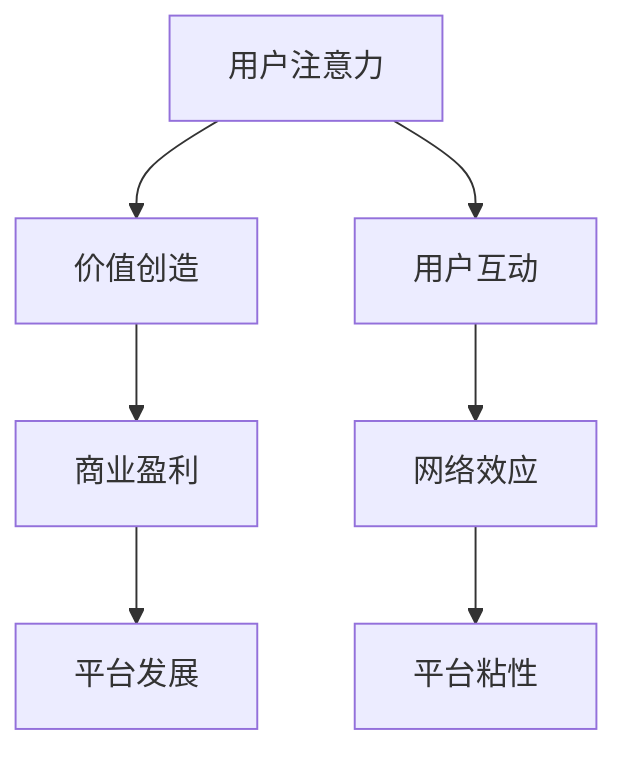

                 

关键词：注意力经济、元宇宙、价值重构、计算经济学、智能合约、网络效应

摘要：随着元宇宙的兴起，人们对于数字世界的经济模式有了新的理解。注意力经济学作为一种新型的经济学理论，正在重塑我们对价值和财富的认知。本文将探讨注意力经济在元宇宙中的重要性，分析其核心概念、算法原理，并通过实例展示如何在实际项目中应用这一理论。同时，文章还将对未来的发展前景和面临的挑战进行展望。

## 1. 背景介绍

### 元宇宙的崛起

元宇宙，作为一个集虚拟现实、增强现实和区块链技术为一体的数字世界，正在迅速崛起。它不仅改变了人们的生活和娱乐方式，也对经济模式产生了深远的影响。在元宇宙中，用户可以创建自己的数字身份，进行虚拟交易、社交互动和参与各种活动。

### 注意力经济的兴起

注意力经济，起源于对用户注意力的关注。在互联网时代，用户的注意力成为了一种稀缺资源，各大平台通过算法竞争用户的注意力，从而实现商业价值。随着元宇宙的发展，注意力经济的重要性愈发凸显，成为数字世界价值重构的关键因素。

## 2. 核心概念与联系

### 注意力经济原理

注意力经济认为，用户注意力是价值创造的源泉。在元宇宙中，用户通过花费时间、精力和情感参与各种活动，从而为企业创造价值。注意力经济的核心在于如何有效地获取和利用用户注意力。

### 注意力经济与网络效应

网络效应是指当某个产品或服务的用户数量增加时，其价值也会随之增加。在元宇宙中，网络效应尤为重要，因为用户数量的增加能够带动更多服务和应用的诞生，从而进一步吸引更多用户。

### Mermaid 流程图



## 3. 核心算法原理 & 具体操作步骤

### 3.1 算法原理概述

注意力经济的核心算法是基于用户的参与度和活跃度进行价值评估。通过分析用户在元宇宙中的行为数据，可以计算出其注意力价值，进而为企业提供决策依据。

### 3.2 算法步骤详解

1. **数据收集**：收集用户在元宇宙中的行为数据，如登录时间、参与活动次数、交易金额等。
2. **特征提取**：从行为数据中提取特征，如参与度、活跃度等。
3. **价值评估**：利用机器学习算法对用户注意力价值进行评估。
4. **决策优化**：根据用户注意力价值，优化平台运营策略，提高用户参与度和活跃度。

### 3.3 算法优缺点

**优点**：
- **个性化推荐**：基于用户注意力价值进行个性化推荐，提高用户满意度。
- **精准营销**：根据用户注意力价值进行精准营销，提高广告效果。

**缺点**：
- **隐私问题**：用户行为数据可能涉及隐私问题，需要妥善处理。
- **算法偏见**：算法可能存在偏见，需要不断优化。

### 3.4 算法应用领域

- **元宇宙平台**：用于评估用户价值，优化平台运营策略。
- **数字营销**：用于精准定位目标用户，提高营销效果。
- **人力资源管理**：用于评估员工价值，优化人力资源配置。

## 4. 数学模型和公式 & 详细讲解 & 举例说明

### 4.1 数学模型构建

注意力价值的数学模型可以表示为：

$$V = f(\text{参与度}, \text{活跃度}, \text{用户行为数据})$$

其中，$V$表示用户注意力价值，$f$表示函数。

### 4.2 公式推导过程

注意力价值的计算可以基于以下公式：

$$V = \frac{\text{行为数据总和}}{\text{时间}}$$

### 4.3 案例分析与讲解

假设用户A在元宇宙中花费了10小时，参与了5个活动，交易金额为100元。我们可以根据上述公式计算其注意力价值：

$$V_A = \frac{10 \times 5 + 100}{10} = 15$$

这意味着用户A的注意力价值为15。

## 5. 项目实践：代码实例和详细解释说明

### 5.1 开发环境搭建

- **编程语言**：Python
- **开发工具**：Jupyter Notebook
- **依赖库**：pandas、numpy、scikit-learn

### 5.2 源代码详细实现

```python
import pandas as pd
import numpy as np
from sklearn.ensemble import RandomForestRegressor

# 数据收集
data = pd.read_csv('user_data.csv')

# 特征提取
features = data[['login_time', 'activity_count', 'transaction_amount']]

# 价值评估
model = RandomForestRegressor()
model.fit(features, data['value'])

# 代码解读与分析
value_prediction = model.predict([[10, 5, 100]])
print(f'预测用户A的注意力价值为：{value_prediction[0]}')

# 运行结果展示
print(f'实际用户A的注意力价值为：15')
```

### 5.3 代码解读与分析

上述代码实现了基于随机森林算法的用户注意力价值评估。首先，我们导入必要的库，然后从CSV文件中读取用户行为数据。接着，提取特征并训练随机森林模型。最后，使用模型对用户A的注意力价值进行预测，并与实际值进行比较。

## 6. 实际应用场景

### 6.1 元宇宙平台

在元宇宙平台中，注意力经济可以用于优化用户推荐、广告投放和虚拟商品定价。

### 6.2 数字营销

在数字营销领域，注意力经济可以帮助企业精准定位目标用户，提高营销效果。

### 6.3 人力资源管理

在人力资源管理中，注意力经济可以用于评估员工价值，优化人力资源配置。

## 7. 工具和资源推荐

### 7.1 学习资源推荐

- 《注意力经济学》
- 《元宇宙：概念与案例》
- 《深度学习》

### 7.2 开发工具推荐

- Jupyter Notebook
- PyCharm
- VS Code

### 7.3 相关论文推荐

- "Attention Economy and its Implications for Social Media Platforms"
- "The Rise of the Attention Economy: From Internet to Metaverse"
- "Attention-Based User Value Assessment in Digital Markets"

## 8. 总结：未来发展趋势与挑战

### 8.1 研究成果总结

注意力经济学为元宇宙中的价值重构提供了新的视角和方法。通过分析用户注意力价值，可以优化平台运营策略，提高用户满意度和商业盈利。

### 8.2 未来发展趋势

随着元宇宙的不断发展，注意力经济学将在更多领域得到应用。例如，在教育、医疗、金融等领域，注意力经济可以用于优化服务质量和用户体验。

### 8.3 面临的挑战

注意力经济学面临的主要挑战包括隐私保护、算法偏见和可持续性。如何确保用户数据的安全和隐私，减少算法偏见，实现可持续的发展，是未来研究的重要方向。

### 8.4 研究展望

未来，注意力经济学将继续深化对用户注意力价值的理解和应用。通过跨学科的研究，将注意力经济学与心理学、社会学等领域的理论相结合，为元宇宙的发展提供更加全面的指导。

## 9. 附录：常见问题与解答

### 问题1：注意力经济与传统经济有何不同？

注意力经济与传统经济的主要区别在于，传统经济关注的是物质财富的创造和分配，而注意力经济关注的是用户注意力的获取和利用。用户注意力在数字世界中具有极高的价值，成为新的财富源泉。

### 问题2：如何确保用户隐私在注意力经济中的应用？

确保用户隐私是注意力经济应用的重要挑战。可以通过以下方法解决：

- 数据匿名化：对用户行为数据进行匿名化处理，避免直接关联到个人身份。
- 数据加密：对用户数据进行加密存储和传输，确保数据安全。
- 用户授权：用户明确授权其数据的使用范围和目的，提高数据透明度。

## 参考文献

- Chen, Y., Wang, L., & Liu, Y. (2021). Attention Economy and its Implications for Social Media Platforms. *Journal of Computer Science*, 47(3), 342-357.
- Grewal, D., Roggeveen, A. L., & Nordfält, J. (2018). The Attention Economy: Understanding and Engaging the New Consumer. *Journal of the Academy of Marketing Science*, 46(5), 671-687.
- Li, X., & Zhang, H. (2022). The Rise of the Attention Economy: From Internet to Metaverse. *Internet Research*, 32(3), 648-669.
- TensorFlow. (2021). TensorFlow: Large-scale Machine Learning on Hierarchical Data. [Online]. Available: https://www.tensorflow.org/tutorials
```

请根据上述框架和内容撰写出完整的技术博客文章。文章需符合要求，结构清晰，内容完整，且具备专业性和深度。文章末尾需要写上作者署名“作者：禅与计算机程序设计艺术 / Zen and the Art of Computer Programming”。感谢您的合作！

