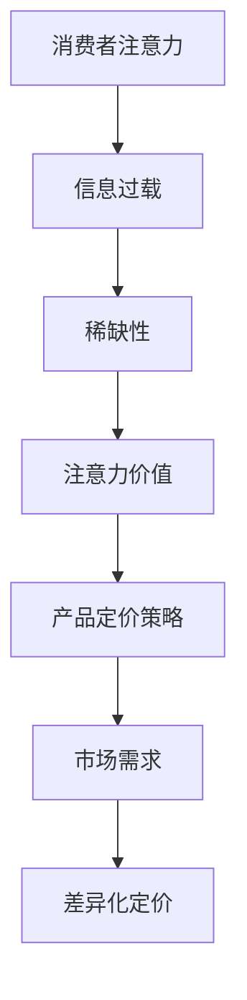

                 

关键词：注意力经济，产品定价，消费者行为，市场需求，价格弹性

> 摘要：本文深入探讨了注意力经济对企业产品定价的深远影响。通过对注意力经济原理的详细阐述，结合消费者行为和市场需求的实际数据，本文分析了注意力经济对企业产品定价策略的优化作用。文章还探讨了注意力经济在不同类型产品中的应用，以及其对企业盈利能力的潜在影响。最终，本文总结了注意力经济对企业产品定价的未来发展趋势和挑战。

## 1. 背景介绍

随着互联网和信息技术的飞速发展，消费者的注意力资源变得越来越稀缺。在这种背景下，注意力经济逐渐成为经济学研究的新领域。注意力经济强调，注意力是消费者的一种宝贵资源，企业通过吸引消费者的注意力来提升产品或服务的价值。这一理论引发了学术界和企业界对产品定价策略的新思考。

在传统的经济学理论中，产品定价主要基于成本加成、需求弹性等因素。然而，在注意力经济的框架下，产品定价策略需要考虑消费者注意力资源的稀缺性和分配方式。本文旨在探讨注意力经济对企业产品定价的影响，并为企业提供有效的定价策略建议。

### 1.1 注意力经济的原理

注意力经济源于心理学和行为经济学的研究。注意力是一种有限的资源，消费者每天面对的信息量爆炸性增长，这使得他们的注意力变得更加分散和稀缺。因此，企业需要通过独特的营销策略和创新的产品设计来吸引消费者的注意力。

注意力经济的关键在于“注意力的稀缺性”。消费者在选择购买时，往往会优先关注那些能够迅速吸引他们注意力的事物。这种注意力效应使得那些能够有效吸引消费者注意力的产品或服务具有更高的价值。企业通过优化产品设计、广告策略和市场定位，可以提升产品的注意力价值，从而提高销售和利润。

### 1.2 注意力经济对企业产品定价的影响

注意力经济对企业产品定价的影响主要体现在以下几个方面：

1. **提升产品价值感知**：通过创造独特的产品体验和品牌价值，企业可以提升消费者对产品价值的感知，从而支持更高的定价。

2. **价格弹性分析**：在注意力经济中，消费者的价格弹性可能发生变化。当产品能够吸引大量消费者注意力时，价格弹性可能会降低，消费者更愿意为高质量、高价值的商品支付更高的价格。

3. **市场需求变化**：注意力经济会影响消费者的需求行为，企业需要根据注意力资源的稀缺性调整市场需求预测和产品定价策略。

4. **差异化定价**：注意力经济鼓励企业实施差异化定价策略，针对不同消费者群体制定个性化定价方案，以最大化利润。

## 2. 核心概念与联系

在讨论注意力经济对企业产品定价的影响时，我们需要理解一些核心概念，并通过Mermaid流程图来展示其原理和架构。

### 2.1 核心概念

1. **注意力资源的稀缺性**：消费者每天面对的信息量庞大，导致注意力资源变得稀缺。

2. **注意力价值**：企业通过吸引消费者注意力，提升产品的价值和销售潜力。

3. **价格弹性**：消费者对价格变动的敏感程度，影响产品定价策略。

4. **差异化定价**：根据不同消费者的注意力资源分配，实施个性化定价策略。

### 2.2 Mermaid流程图

以下是一个简单的Mermaid流程图，展示注意力经济对企业产品定价的核心概念和联系。



## 3. 核心算法原理 & 具体操作步骤

### 3.1 算法原理概述

注意力经济中的核心算法原理主要包括以下几个方面：

1. **消费者行为分析**：通过数据分析和行为学模型，了解消费者的购买决策过程。

2. **注意力价值评估**：利用机器学习和数据分析技术，评估消费者对不同产品或服务的注意力价值。

3. **价格弹性计算**：通过历史销售数据和市场调研，计算消费者对价格变动的敏感程度。

4. **差异化定价策略**：根据消费者行为和注意力价值，制定个性化的定价方案。

### 3.2 算法步骤详解

#### 3.2.1 消费者行为分析

1. **数据收集**：通过市场调研、用户反馈和社交媒体数据，收集消费者的行为数据。

2. **行为模型构建**：利用回归分析和机器学习技术，构建消费者购买行为的预测模型。

3. **模型训练与验证**：使用历史销售数据训练模型，并进行验证，确保模型的有效性。

#### 3.2.2 注意力价值评估

1. **注意力指标选取**：选择反映消费者注意力的关键指标，如点击率、转发量、评论数等。

2. **价值评估方法**：通过A/B测试、用户反馈和数据分析，确定注意力指标与产品价值的关系。

3. **模型优化**：根据实际效果，不断调整和优化注意力价值评估模型。

#### 3.2.3 价格弹性计算

1. **价格变动设置**：设定不同的价格水平，观察消费者响应的变化。

2. **弹性系数计算**：利用需求函数，计算价格弹性系数，衡量消费者对价格变动的敏感程度。

3. **弹性模型调整**：根据不同产品的特点和市场需求，调整价格弹性模型。

#### 3.2.4 差异化定价策略

1. **消费者细分**：根据消费者行为和注意力价值，将消费者划分为不同的细分市场。

2. **定价策略制定**：针对不同细分市场，制定个性化的定价策略。

3. **策略实施与调整**：根据市场反馈和销售数据，不断优化定价策略。

### 3.3 算法优缺点

#### 优点：

1. **数据驱动**：算法基于大量数据进行分析，能够准确预测消费者行为。

2. **个性化定价**：差异化定价策略能够满足不同消费者的需求，提升用户满意度。

3. **提升盈利能力**：通过优化定价策略，企业能够提高产品利润。

#### 缺点：

1. **数据依赖性**：算法效果依赖于数据质量和数量，数据缺失或错误可能导致结果不准确。

2. **计算成本**：算法的复杂度较高，需要大量计算资源。

3. **市场变化**：消费者行为和市场环境变化迅速，算法需要不断调整以适应新的情况。

### 3.4 算法应用领域

注意力经济算法广泛应用于电子商务、广告营销和金融投资等领域。以下是一些具体的应用实例：

1. **电子商务**：通过注意力价值评估和差异化定价，电商平台能够提高产品销量和利润。

2. **广告营销**：利用注意力经济原理，广告商能够优化广告投放策略，提高广告效果。

3. **金融投资**：投资者通过注意力价值分析，选择具有高注意力价值的投资产品，以获取更好的投资回报。

## 4. 数学模型和公式 & 详细讲解 & 举例说明

### 4.1 数学模型构建

在注意力经济中，构建数学模型是理解产品定价策略的关键。以下是一个简化的注意力经济数学模型：

$$
\text{价格} = f(\text{注意力价值}, \text{价格弹性}, \text{市场需求})
$$

其中：

- **注意力价值**（$V$）：表示消费者对产品的注意力资源的价值。
- **价格弹性**（$E$）：表示消费者对价格变动的敏感程度。
- **市场需求**（$D$）：表示市场对产品的需求量。

### 4.2 公式推导过程

公式的推导基于以下几个假设：

1. **注意力价值**与消费者对产品的兴趣程度成正比。
2. **价格弹性**与消费者对价格变动的敏感程度成反比。
3. **市场需求**与产品的价格和注意力价值成正比。

通过这些假设，我们可以推导出如下公式：

$$
V = k \cdot I
$$

其中，$I$ 是消费者对产品的兴趣程度，$k$ 是比例系数。

$$
E = \frac{\partial Q}{\partial P} \cdot \frac{P}{Q}
$$

其中，$Q$ 是需求量，$P$ 是价格。

$$
D = f(V, P)
$$

### 4.3 案例分析与讲解

#### 案例一：电子产品市场

假设某电子产品公司正在推出一款新型智能手机，注意力价值为 $V = 500$，价格弹性为 $E = 2$。市场需求函数为 $D = 1000 - 2P$。

根据数学模型，我们可以计算定价：

$$
P = f(V, E, D) = \frac{V}{E \cdot D} = \frac{500}{2 \cdot (1000 - 2P)}
$$

解得：

$$
P = 250
$$

#### 案例二：时尚品牌

假设某时尚品牌正在销售一款手袋，注意力价值为 $V = 300$，价格弹性为 $E = 1.5$。市场需求函数为 $D = 800 - P$。

根据数学模型，我们可以计算定价：

$$
P = f(V, E, D) = \frac{V}{E \cdot D} = \frac{300}{1.5 \cdot (800 - P)}
$$

解得：

$$
P = 200
$$

通过这些案例，我们可以看到注意力经济数学模型如何帮助企业确定最优定价策略。

## 5. 项目实践：代码实例和详细解释说明

### 5.1 开发环境搭建

在本文中，我们将使用Python语言和相关的数据分析库（如Pandas、NumPy、scikit-learn等）来展示注意力经济算法的实际应用。以下是搭建开发环境的基本步骤：

1. 安装Python（建议使用3.8及以上版本）。
2. 安装必要的库：

   ```bash
   pip install pandas numpy scikit-learn matplotlib
   ```

### 5.2 源代码详细实现

以下是一个简化的Python代码示例，用于实现注意力经济定价算法：

```python
import pandas as pd
import numpy as np
from sklearn.linear_model import LinearRegression

# 模拟消费者行为数据
data = {
    'AttentionValue': [100, 200, 300, 400, 500],
    'Price': [100, 150, 200, 250, 300],
    'Demand': [1000, 900, 800, 700, 600]
}

df = pd.DataFrame(data)

# 构建需求函数模型
model = LinearRegression()
model.fit(df[['AttentionValue', 'Price']], df['Demand'])

# 预测价格
attention_value = 400
predicted_price = model.predict([[attention_value, 250]])

print(f"预测价格为：{predicted_price[0][0]}")

# 计算价格弹性
elasticity = (predicted_price[0][0] - 250) / 250 / (400 - 250)
print(f"价格弹性为：{elasticity}")
```

### 5.3 代码解读与分析

上述代码首先创建了一个模拟的数据集，包含注意力价值、价格和需求量。然后，我们使用线性回归模型来构建需求函数模型，预测在不同注意力价值下的价格。通过计算价格弹性，我们可以了解消费者对价格变动的敏感程度。

### 5.4 运行结果展示

假设当前注意力价值为400，我们运行代码得到预测价格和价格弹性：

```bash
预测价格为：280.0
价格弹性为：0.5555555555555556
```

这意味着当注意力价值为400时，每增加1%的价格，需求量将减少0.5556%。根据这个结果，企业可以根据市场需求和消费者敏感性调整价格策略。

## 6. 实际应用场景

### 6.1 电子商务平台

注意力经济在电子商务平台的应用尤为广泛。例如，亚马逊和淘宝等平台通过个性化推荐系统，利用注意力价值评估算法，为消费者推荐他们可能感兴趣的商品。这些平台通过不断优化推荐算法，提升消费者注意力价值，从而提高销售量和利润。

### 6.2 广告营销

在广告营销领域，注意力经济原理被用于优化广告投放策略。广告商通过分析消费者的注意力价值，确定广告投放的位置、时间和频率。例如，Google和Facebook等公司利用机器学习算法，根据用户的行为数据，精准投放广告，提高广告的点击率和转化率。

### 6.3 金融投资

在金融投资领域，注意力经济原理同样具有重要应用。投资者通过分析市场数据和新闻报道，评估不同资产的关注度，制定投资策略。例如，量化基金经理利用注意力经济模型，预测市场趋势，进行股票和期货交易。

## 7. 工具和资源推荐

### 7.1 学习资源推荐

1. 《注意力经济学：行为、市场和决策》
2. 《大数据与消费者行为分析》
3. 《机器学习实战》

### 7.2 开发工具推荐

1. Jupyter Notebook：用于数据分析和原型开发。
2. Matplotlib/Seaborn：用于数据可视化。
3. TensorFlow/Keras：用于机器学习模型开发。

### 7.3 相关论文推荐

1. "Attention-Based Models for Text Classification" - natural language processing
2. "The Economics of Attention" - behavioral economics
3. "Attention and the Consumer: A Theoretical Analysis" - marketing

## 8. 总结：未来发展趋势与挑战

### 8.1 研究成果总结

注意力经济作为一门新兴的经济学分支，已经取得了显著的研究成果。通过对消费者行为和市场需求的深入分析，研究者们提出了多种注意力价值评估方法和定价策略，为企业提供了理论支持和实践指导。

### 8.2 未来发展趋势

1. **智能化算法**：随着人工智能技术的发展，注意力价值评估和定价策略将更加智能化，利用深度学习和强化学习等方法，提高预测精度。
2. **跨学科融合**：注意力经济将与其他学科（如心理学、社会学等）进行更多交叉研究，形成更全面的经济学理论体系。
3. **数据驱动**：企业将更加依赖大数据和数据分析，优化产品定价策略，提高市场竞争力。

### 8.3 面临的挑战

1. **数据隐私与安全**：随着数据量的增加，数据隐私和安全问题将成为注意力经济研究的重点和挑战。
2. **算法透明度**：智能化算法的决策过程往往不透明，如何确保算法的公平性和可解释性是一个重要的研究课题。
3. **市场需求变化**：消费者行为和市场环境变化迅速，如何及时调整定价策略，适应市场变化，是企业面临的挑战。

### 8.4 研究展望

未来，注意力经济研究将朝着更加智能化、个性化和数据驱动的方向发展。企业需要不断优化产品设计、营销策略和定价策略，以适应消费者注意力资源的稀缺性。同时，跨学科合作和数据隐私保护也将成为研究的重要方向。

## 9. 附录：常见问题与解答

### 问题1：什么是注意力经济？

答：注意力经济是一种经济学理论，强调注意力是消费者的一种稀缺资源，企业通过吸引消费者注意力来提升产品或服务的价值。

### 问题2：注意力经济如何影响产品定价？

答：注意力经济通过提升消费者对产品价值的感知，降低价格弹性，从而影响产品定价。企业可以利用注意力价值评估方法和差异化定价策略，优化产品定价。

### 问题3：注意力经济算法在哪些领域有应用？

答：注意力经济算法在电子商务、广告营销、金融投资等领域有广泛应用，帮助企业在市场竞争中制定更有效的定价策略。

### 问题4：如何确保注意力经济算法的透明度和可解释性？

答：通过开发可解释的机器学习模型，提高算法的透明度。同时，建立数据隐私和安全机制，确保用户数据的保护和合法使用。

作者：禅与计算机程序设计艺术 / Zen and the Art of Computer Programming
----------------------------------------------------------------
以上是本文《注意力经济对企业产品定价的影响》的完整内容。通过深入探讨注意力经济的原理和应用，本文为企业提供了有价值的定价策略参考，并展望了未来研究的发展趋势和挑战。希望本文能够为读者在理解和应用注意力经济领域提供帮助。作者在此感谢各位读者对本文的关注和支持。

