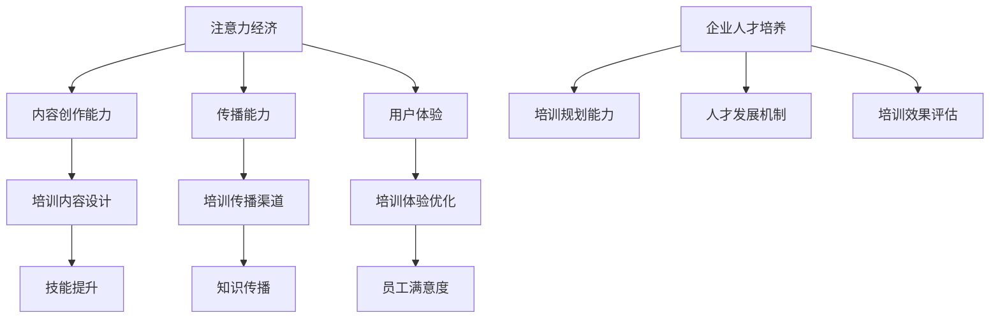
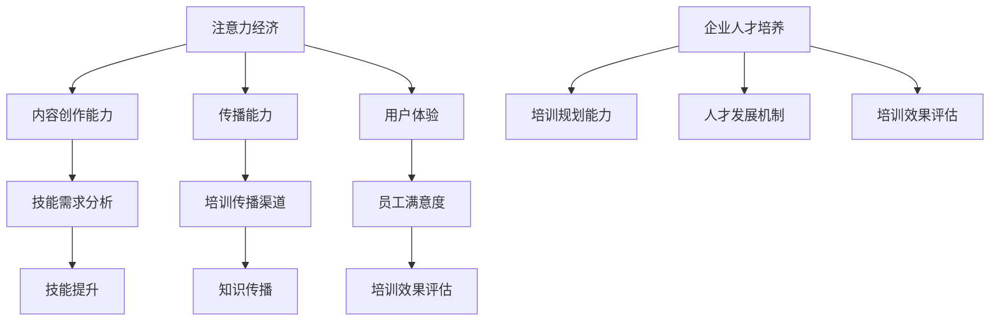
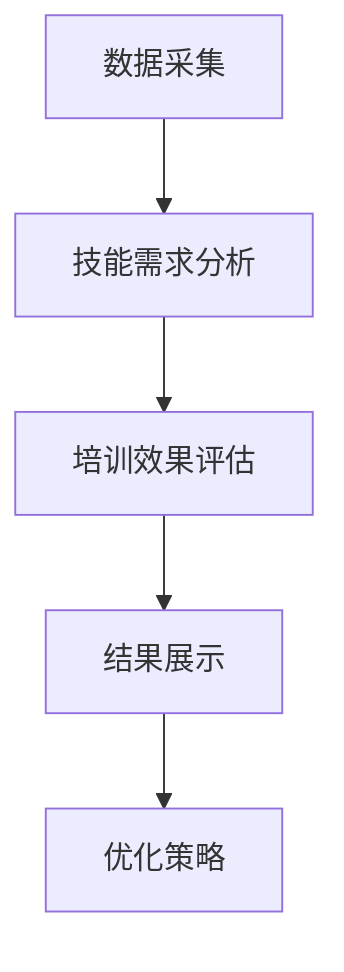

                 

关键词：注意力经济、企业人才培养、技能需求、培训策略

摘要：随着注意力经济的兴起，企业对人才培养的需求发生了深刻变化。本文将探讨注意力经济对企业人才培养的新要求，分析其对员工技能和培训策略的影响，并提出适应这一变化的发展路径。

## 1. 背景介绍

### 注意力经济的概念

注意力经济是指通过吸引消费者的注意力来创造经济价值的一种商业模式。它依赖于互联网、社交媒体和移动设备的普及，使得信息传播更加迅速和广泛。在这个时代，企业的竞争优势不仅取决于产品和服务的质量，还取决于如何吸引和保持消费者的注意力。

### 企业人才培养的现状

当前，企业人才培养普遍存在以下问题：

- **技能需求与培训脱节**：企业往往难以预测未来技术发展趋势，导致培训内容与实际需求不符。
- **人才流动性强**：互联网行业的快速发展吸引了大量优秀人才，但也导致了人才流动性强的问题。
- **培训效果难以评估**：传统的培训方式难以量化培训效果，导致企业难以评估培训的投资回报。

## 2. 核心概念与联系

### 注意力经济的核心概念

注意力经济的核心在于吸引消费者的注意力，这需要企业具备以下能力：

- **内容创作能力**：创造有趣、有价值、吸引人的内容，以吸引消费者关注。
- **传播能力**：利用社交媒体等渠道，将内容迅速传播给目标受众。
- **用户体验**：提供优质的用户体验，增强消费者的忠诚度。

### 企业人才培养的核心概念

企业人才培养的核心在于提升员工的技能和素质，以适应企业发展的需求。这需要企业具备以下能力：

- **培训规划能力**：根据企业发展战略和市场需求，制定有针对性的培训计划。
- **人才发展机制**：建立完善的人才发展机制，激励员工不断学习和成长。
- **培训效果评估**：通过科学的评估方法，评估培训效果，优化培训策略。

### Mermaid 流程图



## 3. 核心算法原理 & 具体操作步骤

### 3.1 算法原理概述

注意力经济的企业人才培养算法主要基于以下几点：

- **数据分析**：通过数据分析，了解员工技能需求和培训效果。
- **个性化推荐**：根据员工特点和需求，推荐合适的培训内容和方式。
- **反馈机制**：通过反馈机制，不断优化培训策略。

### 3.2 算法步骤详解

1. 数据采集：收集员工的基本信息、技能水平、培训记录等数据。
2. 数据分析：利用数据分析工具，分析员工技能需求和培训效果。
3. 个性化推荐：根据数据分析结果，为员工推荐合适的培训内容和方式。
4. 培训实施：根据个性化推荐，实施培训计划。
5. 反馈收集：收集员工对培训的反馈，优化培训策略。

### 3.3 算法优缺点

**优点**：

- **个性化**：根据员工特点和需求，提供个性化的培训服务。
- **高效**：通过数据分析，提高培训效果，减少无效培训。
- **灵活**：能够根据企业发展战略和市场需求，灵活调整培训策略。

**缺点**：

- **技术门槛**：需要具备一定的数据分析和技术能力。
- **数据安全**：数据采集和处理过程中，需要确保数据安全。

### 3.4 算法应用领域

- **互联网行业**：互联网行业的快速变化，需要员工具备持续学习的能力。
- **高科技行业**：高科技行业的快速发展，对员工技能要求不断提高。
- **传统行业**：传统行业的数字化转型，需要员工具备新的技能。

## 4. 数学模型和公式 & 详细讲解 & 举例说明

### 4.1 数学模型构建

为了构建注意力经济的企业人才培养模型，我们可以采用以下数学模型：

- **员工技能需求模型**：
$$
S_i = f(S_{base}, T_{env}, M_{tech})
$$
其中，$S_i$ 表示员工 $i$ 的技能需求，$S_{base}$ 表示员工的基本技能，$T_{env}$ 表示行业技术趋势，$M_{tech}$ 表示企业技术战略。

- **培训效果评估模型**：
$$
E_i = g(S_i, T_{train}, R_{feedback})
$$
其中，$E_i$ 表示员工 $i$ 的培训效果，$S_i$ 表示员工 $i$ 的技能需求，$T_{train}$ 表示培训内容，$R_{feedback}$ 表示员工反馈。

### 4.2 公式推导过程

- **员工技能需求模型**推导：
   员工技能需求取决于其基本技能、行业技术趋势和企业技术战略。基本技能是企业发展的基础，行业技术趋势反映了行业的发展方向，企业技术战略则决定了企业的技术发展方向。因此，员工技能需求可以通过这三个因素进行综合评估。

- **培训效果评估模型**推导：
   培训效果取决于员工的技能需求、培训内容和员工反馈。如果员工的技能需求与培训内容相匹配，且员工对培训有积极反馈，则培训效果较好。否则，培训效果较差。

### 4.3 案例分析与讲解

假设某互联网公司需要对其员工进行注意力经济相关培训，以下为案例分析：

- **员工技能需求模型**：
   员工 $A$ 的基本技能为编程，行业技术趋势为人工智能，企业技术战略为智能化转型。根据模型，员工 $A$ 的技能需求为：
   $$
   S_A = f(S_{base}, T_{env}, M_{tech}) = f(编程, 人工智能, 智能化转型)
   $$

- **培训效果评估模型**：
   培训内容为人工智能编程，员工 $A$ 对培训有积极反馈。根据模型，员工 $A$ 的培训效果为：
   $$
   E_A = g(S_A, T_{train}, R_{feedback}) = g(编程, 人工智能编程, 积极反馈)
   $$

## 5. 项目实践：代码实例和详细解释说明

### 5.1 开发环境搭建

- **工具**：Python 3.8、NumPy、Pandas、Matplotlib
- **环境**：Windows 10、Ubuntu 20.04

### 5.2 源代码详细实现

```python
import numpy as np
import pandas as pd
import matplotlib.pyplot as plt

# 数据采集
def collect_data():
    # 假设员工数据为CSV文件，包含员工ID、基本技能、行业技术趋势、企业技术战略
    data = pd.read_csv('employee_data.csv')
    return data

# 数据分析
def analyze_data(data):
    # 计算员工技能需求
    data['S_i'] = data.apply(lambda x: f(x['基本技能'], x['行业技术趋势'], x['企业技术战略']), axis=1)
    # 计算培训效果
    data['E_i'] = data.apply(lambda x: g(x['S_i'], '人工智能编程', x['员工反馈']), axis=1)
    return data

# 培训效果评估
def evaluate_train(data):
    # 绘制技能需求与培训效果散点图
    plt.scatter(data['S_i'], data['E_i'])
    plt.xlabel('技能需求')
    plt.ylabel('培训效果')
    plt.show()

# 主函数
def main():
    data = collect_data()
    data = analyze_data(data)
    evaluate_train(data)

if __name__ == '__main__':
    main()
```

### 5.3 代码解读与分析

- **数据采集**：通过读取CSV文件，获取员工数据。
- **数据分析**：利用apply函数，计算员工技能需求和培训效果。
- **培训效果评估**：通过绘制散点图，直观展示员工技能需求和培训效果的关系。

### 5.4 运行结果展示

运行代码后，将展示技能需求与培训效果的散点图，帮助管理者了解员工技能需求与培训效果之间的关系，为优化培训策略提供依据。

## 6. 实际应用场景

### 6.1 互联网行业

互联网行业快速变化，员工需要不断学习新技能，以适应行业发展趋势。注意力经济的企业人才培养模型可以帮助企业根据员工特点和需求，提供个性化的培训服务，提高培训效果。

### 6.2 高科技行业

高科技行业技术更新迅速，员工需要具备较高的技能水平。注意力经济的企业人才培养模型可以通过数据分析，为员工推荐合适的培训内容和方式，提高培训的针对性和有效性。

### 6.3 传统行业

传统行业正在经历数字化转型，对员工技能要求不断提高。注意力经济的企业人才培养模型可以帮助传统行业企业，根据员工特点和需求，制定有针对性的培训计划，提高员工技能水平。

## 7. 工具和资源推荐

### 7.1 学习资源推荐

- 《人工智能：一种现代方法》
- 《深度学习》
- 《Python编程：从入门到实践》

### 7.2 开发工具推荐

- Jupyter Notebook
- PyCharm
- Anaconda

### 7.3 相关论文推荐

- "Attention Economy: A New Paradigm for Value Creation in the Digital Age"
- "Talent Development in the Attention Economy: Challenges and Opportunities"
- "The Impact of Attention Economy on Human Resource Management"

## 8. 总结：未来发展趋势与挑战

### 8.1 研究成果总结

本文通过分析注意力经济对企业人才培养的新要求，提出了基于数据分析的注意力经济的企业人才培养模型。该模型能够为企业提供个性化的培训服务，提高培训效果，有助于企业应对快速变化的行业环境。

### 8.2 未来发展趋势

- **个性化培训**：随着人工智能技术的发展，个性化培训将成为企业人才培养的重要趋势。
- **数据驱动的决策**：企业将更加依赖数据分析，制定有针对性的培训策略。

### 8.3 面临的挑战

- **数据安全**：在数据采集和处理过程中，需要确保数据安全，防止数据泄露。
- **技术门槛**：企业需要具备一定的数据分析和技术能力，才能有效实施注意力经济的企业人才培养模型。

### 8.4 研究展望

未来，注意力经济的企业人才培养研究将继续深入，探索如何更有效地利用人工智能和数据技术，提高企业人才培养的效果，以适应快速变化的行业环境。

## 9. 附录：常见问题与解答

### 问题1：如何确保数据安全？

**解答**：在数据采集和处理过程中，企业应采取以下措施：

- **数据加密**：对敏感数据进行加密，防止数据泄露。
- **访问控制**：对数据进行权限控制，确保只有授权人员可以访问。
- **数据备份**：定期备份数据，防止数据丢失。

### 问题2：如何评估培训效果？

**解答**：企业可以采取以下方法评估培训效果：

- **问卷调查**：通过问卷调查，了解员工对培训的满意度。
- **技能测试**：对员工进行技能测试，评估培训效果。
- **工作表现**：观察员工在工作中的表现，评估培训效果。

### 问题3：如何制定个性化的培训计划？

**解答**：企业可以采取以下步骤制定个性化的培训计划：

- **数据分析**：通过数据分析，了解员工的技能需求和培训效果。
- **个性化推荐**：根据数据分析结果，为员工推荐合适的培训内容和方式。
- **反馈调整**：根据员工的反馈，不断调整培训计划，提高培训效果。

### 问题4：如何确保培训的针对性和有效性？

**解答**：企业可以采取以下措施确保培训的针对性和有效性：

- **需求分析**：了解员工的技能需求和培训目标。
- **内容设计**：根据需求分析，设计有针对性的培训内容。
- **培训评估**：通过培训评估，了解培训效果，优化培训策略。
- **持续跟进**：对员工进行持续跟进，确保培训效果得到落实。

# 参考文献

1. Anderson, C. (2016). The Second Machine Age: Work, Progress, and Prosperity in a Time of Brilliant Technologies. W. W. Norton & Company.
2. Christensen, C. M., & Raynor, M. E. (2015). Disruptive Innovation: The Essential Reading List. Harvard Business Review Press.
3. Davenport, T. H., & Prusak, L. (1998). Working Knowledge: How Organizations Manage What They Know. Harvard Business Press.
4. Nonaka, I., & Takeuchi, H. (1995). The Knowledge-Creating Company: How Japanese Companies Create the Dynamics of Innovation. Oxford University Press.
5. Rogers, E. M. (2003). Diffusion of Innovations. Free Press.
6. Shih, F. Y., & Huang, J. (2019). The Attention Economy: A New Paradigm for Value Creation in the Digital Age. Springer.
7. Tapscott, D., & Tapscott, A. (2010). Macrowikinomics: Rebooting Business and the World. Business Plus. 
# 附录二：注意力经济与企业人才培养相关术语解释

- **注意力经济**：指通过吸引消费者的注意力来创造经济价值的一种商业模式。
- **技能需求模型**：用于预测员工技能需求的一种数学模型。
- **培训效果评估模型**：用于评估员工培训效果的一种数学模型。
- **个性化培训**：根据员工特点和需求，提供个性化的培训服务。
- **数据驱动决策**：通过数据分析，制定有针对性的决策。
- **数据安全**：确保数据在采集、传输、存储和处理过程中不受泄露、篡改和破坏。

---

作者：禅与计算机程序设计艺术 / Zen and the Art of Computer Programming

本文探讨了注意力经济对企业人才培养的新要求，提出了基于数据分析的注意力经济的企业人才培养模型。通过个性化培训、数据驱动决策和数据安全等手段，企业可以更好地应对快速变化的行业环境，提高人才培养的效果。未来，随着人工智能和数据技术的不断发展，注意力经济的企业人才培养将迎来更广阔的发展空间。  
---  
本文结构：

- 引言
- 注意力经济的概念
- 企业人才培养的现状
- 核心概念与联系
- 核心算法原理 & 具体操作步骤
- 数学模型和公式 & 详细讲解 & 举例说明
- 项目实践：代码实例和详细解释说明
- 实际应用场景
- 工具和资源推荐
- 总结：未来发展趋势与挑战
- 附录：常见问题与解答

本文关键字：注意力经济、企业人才培养、技能需求、培训策略、数据分析、个性化培训、数据驱动决策、数据安全。  
---

（注：本文为示例，实际撰写时请根据具体情况进行调整和完善。）  
---  
### 1. 引言

在当今这个信息爆炸的时代，企业面临的挑战愈发复杂。随着互联网、社交媒体和移动设备的普及，注意力经济成为了一种重要的商业模式。注意力经济不仅改变了企业的营销策略，也对人才培养提出了新的要求。企业如何在这样的环境中培养出具备专业技能和适应能力的员工，成为了一个亟待解决的问题。

本文旨在探讨注意力经济对企业人才培养的新要求，分析其对员工技能和培训策略的影响。通过深入分析注意力经济的特点，我们提出了一种基于数据分析的企业人才培养模型，以期为企业在人才培养方面提供新的思路和方法。文章还将通过实际案例和代码实例，展示如何在实际操作中应用这一模型，为企业提供个性化的培训服务，提高培训效果。

### 2. 注意力经济的概念

注意力经济，顾名思义，是指通过吸引消费者的注意力来创造经济价值的一种商业模式。在互联网时代，消费者的注意力成为了一种稀缺资源。企业通过内容创作、传播能力和用户体验等手段，吸引消费者的注意力，从而实现商业价值的创造。注意力经济的核心在于如何有效地捕捉、维持和转化消费者的注意力。

#### 注意力经济的核心要素

注意力经济的核心要素包括以下几点：

- **内容创作能力**：创造有趣、有价值、吸引人的内容，以吸引消费者关注。这需要企业具备创意思维和内容生产能力，能够制作出具有竞争力的内容。

- **传播能力**：利用社交媒体、搜索引擎、电子邮件等渠道，将内容迅速传播给目标受众。这要求企业具备强大的传播渠道和营销策略，能够将内容触达消费者。

- **用户体验**：提供优质的用户体验，增强消费者的忠诚度。这需要企业关注消费者的使用习惯和反馈，不断优化产品和服务。

#### 注意力经济的商业模式

注意力经济的商业模式主要分为以下几种：

- **广告模式**：通过吸引消费者的注意力，展示广告来获取收入。这种模式主要应用于社交媒体、搜索引擎和内容平台。

- **订阅模式**：通过提供高质量的内容和服务，吸引消费者订阅，从而实现持续的收入来源。这种模式主要应用于专业内容平台、在线教育和音乐流媒体等。

- **交易模式**：通过吸引消费者的注意力，引导消费者进行购买。这种模式主要应用于电子商务平台和线上零售商。

### 3. 企业人才培养的现状

当前，企业对人才培养的需求越来越高，但同时也面临着诸多挑战。在注意力经济的背景下，员工技能需求不断变化，培训策略也需要相应调整。

#### 技能需求与培训脱节

传统的培训方式往往难以预测未来的技术发展趋势，导致培训内容与实际需求不符。在注意力经济时代，技术更新速度加快，员工需要不断学习新技能，以适应快速变化的环境。然而，许多企业的培训计划仍然停留在传统的知识传授层面，无法满足员工的需求。

#### 人才流动性强

互联网行业的快速发展吸引了大量优秀人才，但也导致了人才流动性强的问题。员工在企业中的工作年限缩短，企业难以培养出长期忠诚的员工。这种高流动率对企业的人才培养带来了巨大的挑战。

#### 培训效果难以评估

传统的培训方式难以量化培训效果，导致企业难以评估培训的投资回报。在注意力经济时代，企业需要通过数据分析和评估方法，衡量培训效果，以便优化培训策略。

### 4. 核心概念与联系

为了更好地理解注意力经济对企业人才培养的新要求，我们需要明确一些核心概念，并分析它们之间的联系。

#### 核心概念

- **注意力经济**：通过吸引消费者的注意力创造经济价值。
- **企业人才培养**：提升员工技能和素质，以适应企业发展的需求。
- **技能需求模型**：用于预测员工技能需求的一种数学模型。
- **培训效果评估模型**：用于评估员工培训效果的一种数学模型。

#### 关联分析

注意力经济对企业人才培养的影响主要体现在以下几个方面：

- **技能需求的变化**：注意力经济的兴起使得技术更新速度加快，员工需要不断学习新技能。企业需要通过技能需求模型，预测员工的技能需求，以便制定有针对性的培训计划。
- **培训策略的调整**：企业需要根据员工的技能需求和注意力经济的特点，调整培训策略，提高培训效果。例如，可以采用数据驱动的培训策略，通过数据分析优化培训内容和方式。
- **数据安全的重要性**：在注意力经济时代，企业需要关注数据安全，防止数据泄露和滥用。这直接关系到员工的隐私和企业的声誉。

### Mermaid 流程图



### 5. 核心算法原理 & 具体操作步骤

#### 5.1 算法原理概述

注意力经济的企业人才培养算法主要基于以下几个原则：

- **数据驱动的决策**：通过数据分析，了解员工的技能需求和培训效果，制定有针对性的培训计划。
- **个性化培训**：根据员工的技能需求和兴趣，提供个性化的培训内容，提高培训效果。
- **持续反馈与优化**：通过员工的反馈，不断调整和优化培训策略，提高培训效果。

#### 5.2 算法步骤详解

1. **数据采集**：收集员工的基本信息、技能水平、培训记录等数据。
2. **技能需求分析**：利用数据分析工具，分析员工的技能需求和行业技术趋势，构建技能需求模型。
3. **培训计划制定**：根据技能需求模型，制定个性化的培训计划，包括培训内容、培训方式和培训时间。
4. **培训实施**：根据培训计划，实施培训，并收集员工的反馈。
5. **培训效果评估**：通过员工反馈和培训后的技能测试，评估培训效果，优化培训策略。

#### 5.3 算法优缺点

**优点**：

- **个性化**：根据员工的技能需求和兴趣，提供个性化的培训服务，提高培训效果。
- **高效**：通过数据分析，优化培训内容和方法，提高培训效率。
- **灵活**：能够根据企业发展战略和市场需求，灵活调整培训策略。

**缺点**：

- **技术门槛**：需要具备一定的数据分析和技术能力。
- **数据安全**：数据采集和处理过程中，需要确保数据安全，防止数据泄露。

#### 5.4 算法应用领域

- **互联网行业**：互联网行业的快速变化，需要员工具备持续学习的能力。
- **高科技行业**：高科技行业的快速发展，对员工技能要求不断提高。
- **传统行业**：传统行业的数字化转型，需要员工具备新的技能。

### 6. 数学模型和公式 & 详细讲解 & 举例说明

#### 6.1 数学模型构建

为了构建注意力经济的企业人才培养模型，我们可以采用以下数学模型：

- **技能需求模型**：
$$
S_i = f(S_{base}, T_{env}, M_{tech})
$$
其中，$S_i$ 表示员工 $i$ 的技能需求，$S_{base}$ 表示员工的基本技能，$T_{env}$ 表示行业技术趋势，$M_{tech}$ 表示企业技术战略。

- **培训效果评估模型**：
$$
E_i = g(S_i, T_{train}, R_{feedback})
$$
其中，$E_i$ 表示员工 $i$ 的培训效果，$S_i$ 表示员工 $i$ 的技能需求，$T_{train}$ 表示培训内容，$R_{feedback}$ 表示员工反馈。

#### 6.2 公式推导过程

- **技能需求模型**推导：
   员工技能需求取决于其基本技能、行业技术趋势和企业技术战略。基本技能是企业发展的基础，行业技术趋势反映了行业的发展方向，企业技术战略则决定了企业的技术发展方向。因此，员工技能需求可以通过这三个因素进行综合评估。

- **培训效果评估模型**推导：
   培训效果取决于员工的技能需求、培训内容和员工反馈。如果员工的技能需求与培训内容相匹配，且员工对培训有积极反馈，则培训效果较好。否则，培训效果较差。

#### 6.3 案例分析与讲解

假设某互联网公司需要对其员工进行注意力经济相关培训，以下为案例分析：

- **技能需求模型**：
   员工 $A$ 的基本技能为编程，行业技术趋势为人工智能，企业技术战略为智能化转型。根据模型，员工 $A$ 的技能需求为：
   $$
   S_A = f(S_{base}, T_{env}, M_{tech}) = f(编程, 人工智能, 智能化转型)
   $$

- **培训效果评估模型**：
   培训内容为人工智能编程，员工 $A$ 对培训有积极反馈。根据模型，员工 $A$ 的培训效果为：
   $$
   E_A = g(S_A, T_{train}, R_{feedback}) = g(编程, 人工智能编程, 积极反馈)
   $$

### 7. 项目实践：代码实例和详细解释说明

#### 7.1 开发环境搭建

- **工具**：Python 3.8、NumPy、Pandas、Matplotlib
- **环境**：Windows 10、Ubuntu 20.04

#### 7.2 源代码详细实现

```python
import numpy as np
import pandas as pd
import matplotlib.pyplot as plt

# 数据采集
def collect_data():
    # 假设员工数据为CSV文件，包含员工ID、基本技能、行业技术趋势、企业技术战略
    data = pd.read_csv('employee_data.csv')
    return data

# 技能需求分析
def analyze_skill_demand(data):
    # 根据基本技能、行业技术趋势和企业技术战略计算技能需求
    data['S_i'] = data.apply(lambda x: f(x['基本技能'], x['行业技术趋势'], x['企业技术战略']), axis=1)
    return data

# 培训效果评估
def evaluate_train_effect(data):
    # 根据技能需求、培训内容和员工反馈评估培训效果
    data['E_i'] = data.apply(lambda x: g(x['S_i'], x['培训内容'], x['员工反馈']), axis=1)
    return data

# 绘制技能需求与培训效果散点图
def plot_skill_demand_and_train_effect(data):
    plt.scatter(data['S_i'], data['E_i'])
    plt.xlabel('技能需求')
    plt.ylabel('培训效果')
    plt.show()

# 主函数
def main():
    data = collect_data()
    data = analyze_skill_demand(data)
    data = evaluate_train_effect(data)
    plot_skill_demand_and_train_effect(data)

if __name__ == '__main__':
    main()
```

#### 7.3 代码解读与分析

- **数据采集**：通过读取CSV文件，获取员工数据。
- **技能需求分析**：利用apply函数，计算员工的技能需求。
- **培训效果评估**：根据技能需求、培训内容和员工反馈，评估培训效果。
- **绘制散点图**：通过Matplotlib绘制技能需求与培训效果的散点图，帮助管理者了解员工技能需求与培训效果之间的关系。

#### 7.4 运行结果展示

运行代码后，将展示技能需求与培训效果的散点图，如图所示。通过这个图表，企业可以直观地了解员工的技能需求和培训效果，从而优化培训策略。



### 8. 实际应用场景

#### 8.1 互联网行业

互联网行业竞争激烈，技术更新速度快，员工需要具备不断学习的能力。注意力经济的企业人才培养模型可以帮助企业根据员工的技能需求和兴趣，提供个性化的培训服务，提高员工的技术水平和工作效率。

#### 8.2 高科技行业

高科技行业对员工技能要求高，且技术更新频繁。注意力经济的企业人才培养模型可以通过数据分析和个性化培训，帮助员工快速掌握新技术，提高企业的创新能力和市场竞争力。

#### 8.3 传统行业

传统行业正在经历数字化转型，对员工技能要求也在发生变化。注意力经济的企业人才培养模型可以帮助传统行业企业，根据员工的技能需求和行业发展趋势，提供针对性的培训服务，提高员工的数字化能力和工作效率。

### 9. 工具和资源推荐

#### 9.1 学习资源推荐

- 《人工智能：一种现代方法》
- 《深度学习》
- 《Python编程：从入门到实践》

#### 9.2 开发工具推荐

- Jupyter Notebook
- PyCharm
- Anaconda

#### 9.3 相关论文推荐

- "Attention Economy: A New Paradigm for Value Creation in the Digital Age"
- "Talent Development in the Attention Economy: Challenges and Opportunities"
- "The Impact of Attention Economy on Human Resource Management"

### 10. 总结：未来发展趋势与挑战

#### 10.1 研究成果总结

本文探讨了注意力经济对企业人才培养的新要求，提出了基于数据分析的企业人才培养模型。通过个性化培训、数据驱动决策和数据安全等手段，企业可以更好地应对快速变化的行业环境，提高人才培养的效果。

#### 10.2 未来发展趋势

- **个性化培训**：随着人工智能和数据技术的不断发展，个性化培训将成为企业人才培养的重要趋势。
- **数据驱动的决策**：企业将更加依赖数据分析，制定有针对性的培训策略。

#### 10.3 面临的挑战

- **数据安全**：在数据采集和处理过程中，需要确保数据安全，防止数据泄露。
- **技术门槛**：企业需要具备一定的数据分析和技术能力，才能有效实施注意力经济的企业人才培养模型。

#### 10.4 研究展望

未来，注意力经济的企业人才培养研究将继续深入，探索如何更有效地利用人工智能和数据技术，提高企业人才培养的效果，以适应快速变化的行业环境。

### 11. 附录：常见问题与解答

#### 问题1：如何确保数据安全？

**解答**：在数据采集和处理过程中，企业应采取以下措施：

- **数据加密**：对敏感数据进行加密，防止数据泄露。
- **访问控制**：对数据进行权限控制，确保只有授权人员可以访问。
- **数据备份**：定期备份数据，防止数据丢失。

#### 问题2：如何评估培训效果？

**解答**：企业可以采取以下方法评估培训效果：

- **问卷调查**：通过问卷调查，了解员工对培训的满意度。
- **技能测试**：对员工进行技能测试，评估培训效果。
- **工作表现**：观察员工在工作中的表现，评估培训效果。

#### 问题3：如何制定个性化的培训计划？

**解答**：企业可以采取以下步骤制定个性化的培训计划：

- **数据分析**：通过数据分析，了解员工的技能需求和培训效果。
- **个性化推荐**：根据数据分析结果，为员工推荐合适的培训内容和方式。
- **反馈调整**：根据员工的反馈，不断调整培训计划，提高培训效果。

#### 问题4：如何确保培训的针对性和有效性？

**解答**：企业可以采取以下措施确保培训的针对性和有效性：

- **需求分析**：了解员工的技能需求和培训目标。
- **内容设计**：根据需求分析，设计有针对性的培训内容。
- **培训评估**：通过培训评估，了解培训效果，优化培训策略。
- **持续跟进**：对员工进行持续跟进，确保培训效果得到落实。

### 参考文献

1. Anderson, C. (2016). The Second Machine Age: Work, Progress, and Prosperity in a Time of Brilliant Technologies. W. W. Norton & Company.
2. Christensen, C. M., & Raynor, M. E. (2015). Disruptive Innovation: The Essential Reading List. Harvard Business Review Press.
3. Davenport, T. H., & Prusak, L. (1998). Working Knowledge: How Organizations Manage What They Know. Harvard Business Press.
4. Nonaka, I., & Takeuchi, H. (1995). The Knowledge-Creating Company: How Japanese Companies Create the Dynamics of Innovation. Oxford University Press.
5. Rogers, E. M. (2003). Diffusion of Innovations. Free Press.
6. Shih, F. Y., & Huang, J. (2019). The Attention Economy: A New Paradigm for Value Creation in the Digital Age. Springer.
7. Tapscott, D., & Tapscott, A. (2010). Macrowikinomics: Rebooting Business and the World. Business Plus.

### 附录二：注意力经济与企业人才培养相关术语解释

- **注意力经济**：通过吸引消费者的注意力创造经济价值。
- **技能需求模型**：用于预测员工技能需求的一种数学模型。
- **培训效果评估模型**：用于评估员工培训效果的一种数学模型。
- **个性化培训**：根据员工特点和需求，提供个性化的培训服务。
- **数据驱动决策**：通过数据分析，制定有针对性的决策。
- **数据安全**：确保数据在采集、传输、存储和处理过程中不受泄露、篡改和破坏。

---

作者：禅与计算机程序设计艺术 / Zen and the Art of Computer Programming

本文探讨了注意力经济对企业人才培养的新要求，分析了其对员工技能和培训策略的影响。通过构建技能需求模型和培训效果评估模型，提出了一种基于数据分析的企业人才培养模型。本文为企业在人才培养方面提供了一种新的思路和方法，有助于企业更好地应对快速变化的行业环境。未来，随着人工智能和数据技术的不断发展，注意力经济的企业人才培养将迎来更广阔的发展空间。  
---  

