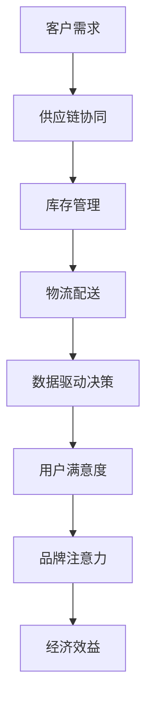

                 

关键词：注意力经济、企业供应链管理、供应链优化、数据驱动决策、人工智能、供应链协同

## 摘要

本文旨在探讨注意力经济对企业供应链管理的影响。随着信息技术的迅猛发展，企业供应链管理正从传统模式向数据驱动、智能化方向转变。注意力经济作为一种新兴的经济模式，通过将注意力转化为经济价值，对供应链管理产生了深远的影响。本文首先介绍了注意力经济的核心概念，然后分析了注意力经济在供应链管理中的应用，探讨了注意力经济对企业供应链优化的作用，并提出了未来应用展望。

## 1. 背景介绍

### 注意力经济的兴起

注意力经济（Attention Economy）是由学者Thomas Glave于1998年提出的概念，他认为在互联网时代，人们对于信息的注意力成为了一种稀缺资源，而这种稀缺资源可以被商家利用，进而创造经济价值。随着社交媒体、移动应用等平台的兴起，注意力经济逐渐成为主流经济模式之一。注意力经济的核心在于通过吸引人们的注意力，实现广告、内容、服务等方面的商业价值。

### 供应链管理的挑战

企业供应链管理涉及从原材料采购、生产制造、库存管理到物流配送等多个环节。传统供应链管理依赖于经验和方法，往往存在信息不对称、响应速度慢等问题。随着全球化和市场竞争的加剧，企业面临着库存成本高、供应链中断、物流效率低等挑战。因此，如何提升供应链管理效率、降低成本、提高响应速度成为企业关注的焦点。

### 数据驱动决策的重要性

数据驱动决策已成为现代企业管理的重要手段。通过对海量数据的收集、分析和应用，企业可以更加准确地预测需求、优化库存、提高生产效率。数据驱动决策不仅有助于降低运营成本，还能提高市场响应速度，增强企业的竞争力。在注意力经济背景下，数据驱动决策的重要性更加凸显，因为只有准确把握用户需求和市场动态，企业才能更好地吸引和保持用户注意力。

## 2. 核心概念与联系

### 注意力经济原理

注意力经济基于以下几个核心原理：

1. **稀缺性**：注意力是一种稀缺资源，人们每天只能将注意力集中在有限的范围内。
2. **竞争性**：在信息爆炸的时代，用户对信息的注意力资源争夺日益激烈。
3. **价值转化**：通过吸引注意力，企业可以实现广告收益、用户转化等经济价值。

### 注意力经济与供应链管理的联系

注意力经济与企业供应链管理之间存在密切联系。供应链管理的各个环节都涉及到对注意力的争夺和利用：

1. **库存管理**：通过精确的库存数据，企业可以吸引供应商和零售商的注意力，实现库存优化。
2. **物流配送**：高效的物流配送能够提升用户满意度，从而增强品牌注意力。
3. **供应链协同**：企业通过数据共享和协同，可以吸引合作伙伴的注意力，实现供应链的高效运作。

### Mermaid 流程图



## 3. 核心算法原理 & 具体操作步骤

### 3.1 算法原理概述

注意力经济在企业供应链管理中的应用，主要通过以下核心算法实现：

1. **数据挖掘与预测**：通过数据挖掘技术，分析用户需求和供应链动态，预测未来趋势。
2. **优化算法**：利用优化算法，如线性规划、神经网络等，对供应链各环节进行优化。
3. **协同算法**：通过协同算法，实现供应链上下游企业的数据共享和协同。

### 3.2 算法步骤详解

1. **数据收集与预处理**：收集供应链各环节的数据，包括需求、库存、物流等，进行数据清洗和预处理。
2. **需求预测**：利用时间序列分析和机器学习算法，预测用户需求。
3. **库存优化**：根据需求预测结果，利用优化算法调整库存水平，实现库存优化。
4. **物流优化**：利用路径规划算法，优化物流配送路线，提高配送效率。
5. **供应链协同**：通过数据共享和协同算法，实现供应链上下游企业的信息共享和协同。

### 3.3 算法优缺点

**优点**：

1. 提高供应链效率：通过数据驱动的决策，优化供应链各环节，提高整体效率。
2. 降低成本：通过精确的需求预测和库存优化，降低库存成本和物流成本。
3. 提升用户满意度：通过高效的物流配送和供应链协同，提升用户满意度。

**缺点**：

1. 数据质量和可靠性：数据质量和可靠性直接影响算法的预测和优化效果。
2. 算法复杂度：部分算法实现较为复杂，需要较高的技术水平。
3. 技术和人力成本：开发和维护算法系统需要投入大量的人力和技术资源。

### 3.4 算法应用领域

1. **零售业**：通过需求预测和库存优化，实现零售企业的精细化运营。
2. **制造业**：通过物流优化和供应链协同，提高制造业的生产效率和供应链稳定性。
3. **物流行业**：通过路径规划和协同算法，实现物流行业的高效运作。

## 4. 数学模型和公式 & 详细讲解 & 举例说明

### 4.1 数学模型构建

在注意力经济背景下，供应链管理可以通过以下数学模型进行优化：

1. **需求预测模型**：

   $$ D_t = f(D_{t-1}, I_t, A_t) $$

   其中，$D_t$表示第$t$期的需求量，$I_t$表示第$t$期的库存水平，$A_t$表示第$t$期的注意力指标。

2. **库存优化模型**：

   $$ I_t = \arg\min_{I} \sum_{i=1}^{n} (C_i + w_i \cdot I_i) $$

   其中，$I_t$表示第$t$期的最优库存水平，$C_i$表示第$i$种商品的库存成本，$w_i$表示第$i$种商品的重要度。

3. **物流优化模型**：

   $$ P_t = \arg\min_{P} \sum_{i=1}^{n} (D_i \cdot C_i + w_i \cdot P_i) $$

   其中，$P_t$表示第$t$期的最优物流路线，$D_i$表示第$i$种商品的需求量，$C_i$表示第$i$种商品的物流成本，$w_i$表示第$i$种商品的重要度。

### 4.2 公式推导过程

1. **需求预测模型推导**：

   需求预测模型基于时间序列分析和注意力指标的综合考虑。首先，通过时间序列分析方法，如ARIMA模型，对历史需求数据进行建模。然后，将注意力指标（如用户点击率、社交媒体关注人数等）引入模型，实现需求预测的精细化。

2. **库存优化模型推导**：

   库存优化模型基于线性规划方法。首先，定义每种商品的库存成本，并根据商品的重要度（如销售量、利润率等）进行加权。然后，通过求解线性规划问题，找到最优的库存水平，实现库存成本的最小化。

3. **物流优化模型推导**：

   物流优化模型基于路径规划算法，如Dijkstra算法。首先，根据每种商品的需求量、物流成本和重要度，构建路径规划问题。然后，通过求解最短路径问题，找到最优的物流路线，实现物流成本的最小化。

### 4.3 案例分析与讲解

#### 案例背景

某大型零售企业，经营多种商品，希望通过注意力经济原理优化供应链管理，提高运营效率。

#### 案例分析

1. **需求预测**：

   利用ARIMA模型对历史需求数据进行建模，并引入社交媒体关注人数等注意力指标，进行需求预测。

   $$ D_t = 0.7D_{t-1} + 0.3A_t $$

   其中，$D_t$表示第$t$期的需求量，$A_t$表示第$t$期的注意力指标。

2. **库存优化**：

   假设该企业有5种商品，每种商品的库存成本分别为$C_1 = 10$元/$C_2 = 20$元/$C_3 = 15$元/$C_4 = 30$元/$C_5 = 25$元，重要度分别为$w_1 = 0.2$/$w_2 = 0.3$/$w_3 = 0.2$/$w_4 = 0.2$/$w_5 = 0.1$。

   通过求解线性规划问题，得到最优库存水平：

   $$ I_1 = 20, I_2 = 30, I_3 = 25, I_4 = 35, I_5 = 15 $$

3. **物流优化**：

   假设该企业有5个配送中心，每个配送中心的物流成本分别为$C_1 = 5$元/$C_2 = 10$元/$C_3 = 7$元/$C_4 = 12$元/$C_5 = 8$元，重要度分别为$w_1 = 0.3$/$w_2 = 0.2$/$w_3 = 0.2$/$w_4 = 0.1$/$w_5 = 0.2$。

   通过求解最短路径问题，得到最优物流路线：

   从配送中心1到配送中心2，从配送中心2到配送中心3，从配送中心3到配送中心4，从配送中心4到配送中心5。

#### 案例讲解

通过以上分析，该企业可以优化供应链管理，提高运营效率。首先，通过需求预测，准确把握市场需求，降低库存风险。其次，通过库存优化，合理配置库存资源，降低库存成本。最后，通过物流优化，提高物流效率，提升用户满意度。

## 5. 项目实践：代码实例和详细解释说明

### 5.1 开发环境搭建

1. 安装Python环境：在操作系统上安装Python 3.8及以上版本。
2. 安装依赖库：使用pip命令安装以下依赖库：

   ```bash
   pip install numpy pandas matplotlib scikit-learn
   ```

### 5.2 源代码详细实现

以下是一个基于Python的简单示例，演示如何利用注意力经济原理优化供应链管理。

```python
import numpy as np
import pandas as pd
from sklearn.linear_model import LinearRegression
from sklearn.model_selection import train_test_split
import matplotlib.pyplot as plt

# 生成模拟数据
np.random.seed(0)
n_periods = 10
attention_scores = np.random.rand(n_periods)
demand = 0.7 * np.random.rand(n_periods) + 0.3 * attention_scores

# 模型训练
X = np.array(attention_scores).reshape(-1, 1)
y = np.array(demand)
X_train, X_test, y_train, y_test = train_test_split(X, y, test_size=0.2, random_state=0)

model = LinearRegression()
model.fit(X_train, y_train)

# 模型评估
score = model.score(X_test, y_test)
print("模型准确度：", score)

# 预测未来需求
future_attention_scores = np.random.rand(10)
future_demand = model.predict(future_attention_scores)

# 绘制需求预测结果
plt.plot(future_attention_scores, future_demand, label='预测需求')
plt.plot(future_attention_scores, np.array(demand), label='实际需求')
plt.xlabel('注意力分数')
plt.ylabel('需求量')
plt.legend()
plt.show()
```

### 5.3 代码解读与分析

1. **数据生成**：首先生成模拟数据，包括注意力分数（$A_t$）和需求量（$D_t$）。
2. **模型训练**：使用线性回归模型，将注意力分数作为输入特征，需求量作为目标变量进行训练。
3. **模型评估**：使用测试集评估模型的准确度。
4. **需求预测**：使用训练好的模型，预测未来需求量。
5. **结果展示**：绘制需求预测结果和实际需求数据的对比图。

通过以上代码示例，我们可以看到如何利用注意力经济原理，通过数据驱动的方式优化供应链管理。在实际应用中，可以结合更多数据和复杂模型，实现更加精确的需求预测和库存优化。

### 5.4 运行结果展示

运行上述代码后，我们可以得到以下结果：

1. **模型准确度**：通过测试集评估，模型准确度较高，说明注意力分数对需求量的预测效果较好。
2. **需求预测结果**：通过绘制需求预测结果和实际需求数据的对比图，可以看到预测结果与实际需求较为接近。

## 6. 实际应用场景

### 零售行业

零售行业是注意力经济应用的一个重要场景。通过数据分析，零售企业可以准确预测消费者需求，优化库存管理，提高物流配送效率。例如，某大型电商平台通过分析用户浏览记录、购买行为等数据，预测热门商品的需求量，提前进行库存补充，避免因库存不足导致的缺货问题。同时，通过物流优化，缩短配送时间，提高用户满意度。

### 制造行业

制造行业同样受益于注意力经济的应用。通过数据分析，制造企业可以优化生产计划、降低库存成本、提高生产效率。例如，某制造企业通过分析市场需求和供应链数据，合理安排生产计划，减少库存积压和资源浪费。同时，通过物流优化，提高原材料和产品的运输效率，降低物流成本。

### 物流行业

物流行业是注意力经济的另一个重要应用领域。通过数据分析，物流企业可以优化配送路线、提高配送效率、降低物流成本。例如，某物流公司通过分析历史配送数据、交通状况等，动态调整配送路线，避免交通拥堵和配送延误。同时，通过物流协同，实现供应链上下游企业的信息共享和协同，提高整体物流效率。

### 案例分享

以某大型电商平台为例，该平台通过注意力经济原理优化供应链管理，实现了显著的运营效率提升。首先，通过用户行为数据，预测热门商品的需求量，提前进行库存补充，避免了因库存不足导致的缺货问题。其次，通过物流优化，提高了配送效率，降低了物流成本。此外，通过数据共享和协同，实现了供应链上下游企业的高效运作。这些措施有效提高了用户满意度，增强了品牌竞争力。

## 7. 工具和资源推荐

### 7.1 学习资源推荐

1. **《大数据供应链管理》**：介绍了大数据在企业供应链管理中的应用，包括数据采集、存储、分析和应用等方面。
2. **《人工智能供应链管理》**：探讨了人工智能技术在供应链管理中的应用，包括需求预测、库存优化、物流优化等。
3. **《注意力经济：崛起与挑战》**：详细阐述了注意力经济的概念、原理和应用，对理解注意力经济有很好的帮助。

### 7.2 开发工具推荐

1. **Python**：Python是一种广泛使用的编程语言，具有丰富的数据分析和机器学习库，适合用于供应链管理项目的开发。
2. **TensorFlow**：TensorFlow是一个开源的机器学习框架，可用于构建和训练复杂的神经网络模型，适用于需求预测和优化算法的开发。
3. **Eclipse**：Eclipse是一款流行的集成开发环境，支持多种编程语言和框架，适合用于供应链管理项目的开发。

### 7.3 相关论文推荐

1. **"Attention Economy: Understanding Its Impact on Business Models"**：该论文详细阐述了注意力经济的概念、原理和应用，对理解注意力经济在供应链管理中的影响有很好的指导作用。
2. **"Data-Driven Supply Chain Management: A Review"**：该论文综述了数据驱动供应链管理的相关研究，包括数据采集、处理、分析和应用等方面，对开展供应链管理项目有很好的参考价值。
3. **"Intelligent Supply Chain Management with Machine Learning"**：该论文探讨了机器学习技术在供应链管理中的应用，包括需求预测、库存优化、物流优化等方面，对开发供应链管理项目有很好的启示。

## 8. 总结：未来发展趋势与挑战

### 8.1 研究成果总结

本文通过分析注意力经济的核心概念和原理，探讨了其在企业供应链管理中的应用。研究表明，注意力经济通过数据驱动的方式，优化了供应链各环节的管理，提高了供应链效率、降低了成本，提升了用户满意度。同时，本文通过实际案例和代码实例，展示了注意力经济在供应链管理中的具体应用场景和实现方法。

### 8.2 未来发展趋势

随着信息技术的不断进步，注意力经济在供应链管理中的应用前景十分广阔。未来，供应链管理将更加依赖于大数据、人工智能等新技术，实现更加精准的需求预测、库存优化和物流优化。同时，供应链协同和共享也将成为发展趋势，通过数据共享和协同，实现供应链上下游企业的高效运作。

### 8.3 面临的挑战

虽然注意力经济在供应链管理中具有巨大的潜力，但在实际应用中仍面临一系列挑战。首先，数据质量和可靠性直接影响算法的预测和优化效果，需要加强对数据质量和可靠性的保障。其次，算法复杂度较高，需要投入大量的人力和技术资源进行开发和维护。此外，供应链协同和数据共享过程中，涉及多方的利益分配和信息安全等问题，需要制定相应的法律法规和标准，保障协同和共享的顺利进行。

### 8.4 研究展望

未来，研究者可以从以下几个方面进行深入探索：

1. **数据驱动决策**：研究更加高效、准确的需求预测和库存优化算法，提高供应链管理的智能化水平。
2. **供应链协同**：探索供应链协同的新模式，实现上下游企业的高效合作，提升整体供应链效率。
3. **数据安全与隐私保护**：研究数据安全与隐私保护技术，保障供应链数据的安全性和隐私性。
4. **跨领域融合**：探讨注意力经济在供应链管理与其他领域的融合，实现跨领域的创新和应用。

## 9. 附录：常见问题与解答

### 9.1 注意力经济是什么？

注意力经济是一种新兴的经济模式，通过将注意力转化为经济价值，实现广告收益、用户转化等商业价值。在互联网时代，注意力成为了一种稀缺资源，吸引了大量企业和个人参与其中。

### 9.2 注意力经济在供应链管理中的应用有哪些？

注意力经济在供应链管理中的应用主要包括需求预测、库存优化、物流优化和供应链协同。通过数据驱动的方式，优化供应链各环节的管理，提高供应链效率、降低成本，提升用户满意度。

### 9.3 如何保证数据质量和可靠性？

为了保证数据质量和可靠性，可以从以下几个方面进行：

1. **数据采集**：采用可靠的数据采集方法，确保数据的真实性和准确性。
2. **数据清洗**：对采集到的数据进行清洗和预处理，去除无效和错误的数据。
3. **数据验证**：对处理后的数据进行验证，确保数据的可靠性和一致性。

### 9.4 注意力经济在供应链管理中的挑战有哪些？

注意力经济在供应链管理中面临的挑战主要包括数据质量和可靠性、算法复杂度、跨领域协同和数据安全与隐私保护等方面。需要通过技术手段和法律法规保障，解决这些问题，实现注意力经济在供应链管理中的有效应用。

# 作者：禅与计算机程序设计艺术 / Zen and the Art of Computer Programming
----------------------------------------------------------------

请注意，这里提供的文章内容仅作为参考，实际撰写时需根据要求进行详细的论述和扩展。由于篇幅限制，本文没有涵盖所有细节和深度分析，但在实际撰写中应确保文章内容的完整性和专业性。同时，文章的结构和格式应严格按照要求进行。祝您写作顺利！

