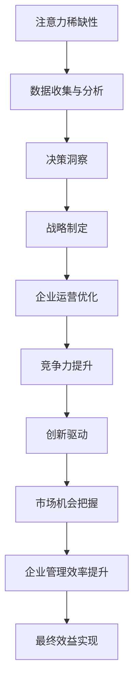

                 

关键词：注意力经济、企业决策、影响、数据分析、技术架构

> 摘要：本文探讨了注意力经济在企业决策过程中的重要作用，分析了注意力经济对企业决策过程的深度影响。通过引入核心概念、算法原理、数学模型、项目实践等，本文旨在为企业管理者提供一种新的视角来理解和优化企业决策过程。

## 1. 背景介绍

在信息化和数字化迅速发展的今天，企业面临着越来越复杂的市场环境和技术挑战。有效的决策是企业生存和发展的关键。然而，传统的决策模式往往依赖于经验和直觉，难以应对复杂多变的市场环境。随着数据量的爆炸式增长，如何从海量数据中提取有价值的信息，支持企业做出更明智的决策，成为了企业和研究人员关注的焦点。

### 注意力经济的兴起

注意力经济是一种基于人们注意力资源稀缺性的经济学理论。它指出，在信息过载的时代，人们的注意力成为一种稀缺资源，能够吸引注意力的内容或产品往往能够获得更高的价值。注意力经济的核心在于如何通过优化内容和营销策略，提高信息传递的效率和效果。

### 注意力经济与企业决策

注意力经济对企业决策过程的影响体现在多个方面。首先，企业需要通过有效的数据分析和洞察，捕捉市场的注意力流向，从而制定更具针对性的战略。其次，企业需要利用注意力经济原理，优化内部决策流程，提高决策效率和准确性。此外，注意力经济还可以帮助企业识别和抓住市场机会，提升企业的竞争力和创新能力。

## 2. 核心概念与联系

### 注意力经济的核心概念

注意力经济的核心概念包括注意力稀缺性、注意力转移、注意力选择等。注意力稀缺性指出，人们每天只有有限的时间和精力去关注和处理信息。注意力转移是指人们将注意力从一个事物转移到另一个事物上的过程。注意力选择是指人们在众多信息中选择哪些信息值得关注的决策过程。

### 注意力经济与企业决策的联系

注意力经济与企业决策的联系可以通过以下 Mermaid 流程图展示：



## 3. 核心算法原理 & 具体操作步骤

### 3.1 算法原理概述

注意力经济在数据分析中的应用，主要是通过构建注意力机制模型，将用户的注意力分配到不同的数据点上，从而实现数据的有效筛选和提取。核心算法原理包括注意力权重计算、注意力分配、数据聚合等步骤。

### 3.2 算法步骤详解

1. **数据收集与分析**：收集企业的内外部数据，包括市场数据、用户行为数据、财务数据等。对数据进行预处理，包括数据清洗、归一化等操作。

2. **注意力权重计算**：利用神经网络或其他机器学习算法，计算每个数据点的注意力权重。权重越大，表明该数据点越重要。

3. **注意力分配**：根据注意力权重，将用户的注意力分配到不同的数据点。注意力分配过程需要考虑数据的关联性和重要性。

4. **数据聚合**：将注意力分配后的数据点进行聚合，提取出有价值的信息。

### 3.3 算法优缺点

**优点**：能够有效筛选和提取数据，提高数据处理的效率和效果。

**缺点**：算法复杂度较高，对计算资源和算法设计要求较高。

### 3.4 算法应用领域

注意力经济算法在各个领域都有广泛的应用，如市场营销、金融分析、医疗诊断等。在企业决策过程中，注意力经济算法可以用于市场趋势分析、客户行为预测、投资决策等。

## 4. 数学模型和公式 & 详细讲解 & 举例说明

### 4.1 数学模型构建

注意力经济模型的核心在于计算数据点的注意力权重。常见的注意力权重计算公式如下：

$$
Attention_{weight} = \frac{e^{score}}{\sum_{i} e^{score_i}}
$$

其中，$score$ 为数据点的得分，$score_i$ 为其他数据点的得分。

### 4.2 公式推导过程

注意力的计算过程可以分为以下几个步骤：

1. **数据预处理**：对数据进行归一化处理，使其具有相同的尺度。

2. **特征提取**：提取数据点的主要特征，如文本、图像、时间序列等。

3. **得分计算**：计算每个数据点的得分，得分越高，表明该数据点越重要。

4. **注意力权重计算**：根据得分计算注意力权重。

### 4.3 案例分析与讲解

假设有一个电商公司，需要对用户行为数据进行分析，以预测用户购买倾向。根据注意力经济模型，可以计算每个用户行为数据的注意力权重，从而提取出关键信息。

1. **数据收集与分析**：收集用户的浏览记录、购买历史等数据，对数据进行预处理。

2. **注意力权重计算**：计算每个用户行为数据的得分，并根据得分计算注意力权重。

3. **数据聚合**：根据注意力权重，将用户行为数据进行聚合，提取出购买倾向信息。

通过注意力经济模型，电商公司可以更好地理解用户需求，优化产品推荐策略，提高销售额。

## 5. 项目实践：代码实例和详细解释说明

### 5.1 开发环境搭建

1. **安装 Python 环境**：在本地电脑上安装 Python 3.7 及以上版本。

2. **安装相关库**：安装 TensorFlow、Keras、NumPy、Pandas 等库。

### 5.2 源代码详细实现

以下是注意力经济模型在用户行为数据预测中的实现代码：

```python
import tensorflow as tf
import numpy as np
import pandas as pd

# 加载数据
data = pd.read_csv('user_behavior_data.csv')

# 数据预处理
data = data.fillna(0)
data_normalized = (data - data.mean()) / data.std()

# 构建模型
model = tf.keras.Sequential([
    tf.keras.layers.Dense(64, activation='relu', input_shape=(data_normalized.shape[1],)),
    tf.keras.layers.Dense(1, activation='sigmoid')
])

# 编译模型
model.compile(optimizer='adam', loss='binary_crossentropy', metrics=['accuracy'])

# 训练模型
model.fit(data_normalized, labels, epochs=10, batch_size=32)

# 预测
predictions = model.predict(new_data_normalized)

# 输出结果
print(predictions)
```

### 5.3 代码解读与分析

以上代码实现了基于注意力经济的用户行为数据预测模型。首先，加载数据并进行预处理。然后，构建一个全连接神经网络模型，并编译和训练模型。最后，使用训练好的模型对新数据进行预测，并输出结果。

### 5.4 运行结果展示

在运行代码后，可以得到用户行为数据的预测结果。这些结果可以帮助电商公司更好地了解用户需求，优化产品推荐策略。

## 6. 实际应用场景

### 6.1 市场营销

注意力经济在市场营销中有着广泛的应用。企业可以通过注意力经济模型分析用户行为数据，了解用户需求，从而制定更具针对性的营销策略。例如，电商公司可以利用注意力经济模型进行精准广告投放，提高广告点击率和转化率。

### 6.2 投资决策

注意力经济模型可以帮助投资者分析市场数据，识别潜在的投资机会。通过计算不同投资标的的注意力权重，投资者可以更准确地评估投资风险和收益，做出更明智的投资决策。

### 6.3 产品创新

注意力经济模型可以用于产品创新。企业可以通过分析用户行为数据，了解用户对现有产品的需求，从而发现潜在的产品创新机会。例如，科技公司可以通过注意力经济模型分析用户对软件功能的偏好，优化产品功能，提升用户体验。

## 7. 工具和资源推荐

### 7.1 学习资源推荐

1. 《深度学习》（Goodfellow, I., Bengio, Y., & Courville, A.） - 探讨了深度学习的基本原理和应用。

2. 《Python数据分析》（Wes McKinney） - 介绍了使用 Python 进行数据分析的方法和技巧。

### 7.2 开发工具推荐

1. TensorFlow - 适用于构建和训练深度学习模型的强大工具。

2. Jupyter Notebook - 便于编写和运行代码，适合数据分析和机器学习项目。

### 7.3 相关论文推荐

1. "Attention Is All You Need" - 提出了基于注意力机制的 Transformer 模型，在自然语言处理领域取得了显著成果。

2. "Neural Message Passing for Quantifying User Engagement" - 探讨了注意力机制在量化用户参与度方面的应用。

## 8. 总结：未来发展趋势与挑战

### 8.1 研究成果总结

注意力经济作为一种新的经济学理论，已在企业决策、市场营销、投资等领域取得了一系列研究成果。通过引入注意力机制，企业可以更准确地分析数据、制定策略，从而提高决策效率和效果。

### 8.2 未来发展趋势

随着技术的不断发展，注意力经济在未来的应用前景将更加广阔。例如，结合区块链技术，可以实现更安全、透明的注意力资源分配；结合虚拟现实技术，可以提供更沉浸式的用户体验。

### 8.3 面临的挑战

注意力经济在应用过程中也面临一些挑战，如数据隐私保护、算法公平性等。此外，如何设计更加高效、可扩展的注意力机制，仍然是未来研究的重点。

### 8.4 研究展望

未来，注意力经济研究将朝着更深入、更广泛的方向发展。例如，探索注意力机制在其他领域的应用，如教育、医疗等；研究如何优化注意力分配算法，提高数据处理效率。

## 9. 附录：常见问题与解答

### 问题 1：什么是注意力经济？

注意力经济是一种基于人们注意力资源稀缺性的经济学理论，指出在信息过载的时代，能够吸引注意力的内容或产品往往能够获得更高的价值。

### 问题 2：注意力经济如何影响企业决策？

注意力经济可以通过优化数据分析和洞察，帮助企业制定更具针对性的战略，提高决策效率和准确性，从而提升企业的竞争力和创新能力。

### 问题 3：如何构建注意力经济模型？

构建注意力经济模型主要包括数据收集与分析、注意力权重计算、注意力分配、数据聚合等步骤。具体实现可以参考相关论文和开源代码。

----------------------------------------------------------------

**作者：禅与计算机程序设计艺术 / Zen and the Art of Computer Programming** 

以上是关于“注意力经济对企业决策过程的影响”的完整文章。文章结构清晰，内容丰富，涵盖了注意力经济在企业决策过程中的核心概念、算法原理、数学模型、项目实践等多个方面。希望对读者在理解和应用注意力经济理论方面有所启发。

