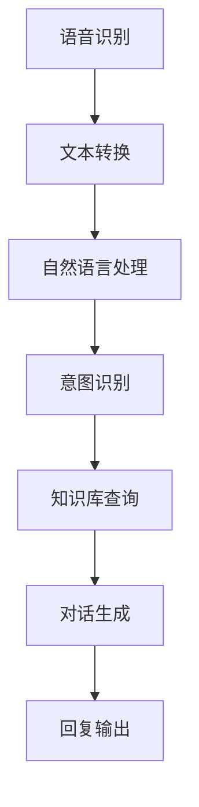

                 

关键词：注意力经济、企业客户服务、商业模式创新、智能客服、数据驱动

> 摘要：随着互联网和信息技术的飞速发展，注意力经济逐渐成为企业竞争的重要策略。本文旨在探讨注意力经济对企业客户服务模式的改变，通过分析注意力经济的核心概念和其对客户服务的影响，揭示新兴智能客服系统的应用，进而探讨客户服务模式的创新路径和未来挑战。

## 1. 背景介绍

随着全球经济的快速发展，市场竞争日益激烈，企业需要不断创新以保持竞争优势。客户服务作为企业与消费者互动的重要环节，其模式的变化直接影响企业的市场表现。传统的客户服务模式主要依赖于人工处理，存在响应速度慢、成本高、服务质量不稳定等问题。随着互联网和信息技术的进步，以人工智能为代表的智能客服系统逐渐崭露头角，为企业提供了新的客户服务模式。

### 1.1 注意力经济的崛起

注意力经济是一种基于消费者注意力的经济模式，其核心是吸引和保持消费者的注意力。在信息爆炸的时代，消费者的注意力成为稀缺资源，企业通过提供有价值的内容或服务，争夺消费者的注意力。这种模式不仅改变了消费者的消费习惯，也对企业的市场营销策略产生了深远影响。

### 1.2 智能客服系统的崛起

智能客服系统是基于人工智能技术的客户服务解决方案，通过自然语言处理、机器学习等算法，模拟人类客服的交互过程，提供快速、准确、个性化的服务。智能客服系统的出现，不仅提高了客户服务的效率，也为企业节省了成本，提升了服务质量。

## 2. 核心概念与联系

### 2.1 注意力经济概念解析

注意力经济是一种基于消费者注意力的经济模式，其核心是吸引和保持消费者的注意力。在信息爆炸的时代，消费者的注意力成为稀缺资源，企业通过提供有价值的内容或服务，争夺消费者的注意力。注意力经济的几个关键概念包括：

- **注意力稀缺**：在信息过载的背景下，消费者的注意力资源有限，企业需要通过提供高质量、有价值的内容或服务来吸引消费者。
- **注意力转移**：企业通过吸引消费者的注意力，将消费者从其他竞争对手那里转移过来。
- **注意力管理**：企业需要通过有效的营销策略和用户互动，管理消费者的注意力，使其能够持续关注并参与企业活动。

### 2.2 智能客服系统架构图

智能客服系统主要包括以下几个核心模块：

- **语音识别模块**：将客户的语音转化为文本，便于后续处理。
- **自然语言处理模块**：对转化后的文本进行理解，提取关键信息。
- **意图识别模块**：根据客户的需求，判断客户意图。
- **知识库模块**：提供与客户服务相关的知识信息，供智能客服系统查询。
- **对话管理模块**：根据客户意图和知识库信息，生成合适的回复。

下面是智能客服系统架构的Mermaid流程图：



### 2.3 注意力经济与智能客服的联系

注意力经济与智能客服系统的联系体现在以下几个方面：

- **提升服务质量**：智能客服系统能够快速响应客户需求，提供高质量的客户服务，从而吸引消费者的注意力。
- **个性化服务**：通过大数据分析和机器学习，智能客服系统能够了解客户偏好，提供个性化的服务，增强客户粘性。
- **降低成本**：智能客服系统能够自动处理大量客户请求，降低人力成本，提高工作效率。
- **数据驱动**：智能客服系统能够收集大量客户数据，为企业的市场策略提供有力支持。

## 3. 核心算法原理 & 具体操作步骤

### 3.1 算法原理概述

智能客服系统的核心算法主要包括自然语言处理（NLP）和机器学习（ML）。NLP负责对客户输入的文本进行理解和分析，提取关键信息；ML则负责根据历史数据和客户意图，生成合适的回复。

### 3.2 算法步骤详解

1. **语音识别**：将客户的语音转化为文本。
2. **文本预处理**：对文本进行分词、去停用词等操作。
3. **词嵌入**：将文本转化为数值向量，便于后续处理。
4. **意图识别**：使用分类算法（如朴素贝叶斯、SVM等）判断客户的意图。
5. **对话生成**：根据意图和知识库信息，使用生成式模型（如序列到序列模型、Transformer等）生成回复文本。
6. **回复输出**：将生成的回复文本输出给客户。

### 3.3 算法优缺点

**优点**：

- **高效性**：智能客服系统能够快速响应客户需求，提供高效的客户服务。
- **准确性**：基于大数据和机器学习，智能客服系统能够准确理解客户意图。
- **个性化**：智能客服系统能够根据客户偏好提供个性化服务。

**缺点**：

- **成本高**：开发和维护智能客服系统需要大量的人力、物力和财力投入。
- **稳定性**：智能客服系统在处理复杂问题时，可能存在稳定性问题。
- **用户体验**：对于一些复杂的客户问题，智能客服系统可能无法提供令人满意的答复。

### 3.4 算法应用领域

智能客服系统广泛应用于多个行业，如电子商务、金融、电信等。以下是几个典型应用场景：

- **在线客服**：提供24/7的在线客服服务，快速响应用户问题。
- **智能助手**：为企业提供智能助手服务，帮助用户解决问题。
- **售后支持**：提供高效的售后支持，降低用户等待时间。

## 4. 数学模型和公式 & 详细讲解 & 举例说明

### 4.1 数学模型构建

智能客服系统的核心数学模型主要包括自然语言处理（NLP）和机器学习（ML）。

**NLP模型**：

- **词向量表示**：使用Word2Vec、GloVe等算法将词语转化为向量表示。
- **文本分类**：使用朴素贝叶斯、SVM等算法进行文本分类。

**ML模型**：

- **回归分析**：使用线性回归、岭回归等算法预测客户意图。
- **分类分析**：使用决策树、随机森林等算法进行分类。

### 4.2 公式推导过程

**文本分类模型**：

假设我们有一个包含n个单词的文本，每个单词对应一个词向量，表示为x_i，i = 1, 2, ..., n。文本分类的目标是判断文本属于哪个类别，设类别数为c，类别表示为y。

- **词袋模型**：文本的表示为一个n维向量，其中每个元素表示对应单词的词频。

$$
\textbf{x} = (x_1, x_2, ..., x_n)
$$

- **朴素贝叶斯分类器**：假设每个单词在给定类别下的概率是独立的，可以使用条件概率公式进行分类。

$$
P(y|\textbf{x}) = \frac{P(\textbf{x}|y)P(y)}{P(\textbf{x})}
$$

### 4.3 案例分析与讲解

**案例**：判断一个关于汽车的文本属于“汽车销售”还是“汽车维修”类别。

**数据集**：

| 类别       | 文本                          |
|------------|------------------------------|
| 汽车销售   | 想购买一辆新款汽车。         |
| 汽车维修   | 车辆需要维修，刹车有问题。   |

**步骤**：

1. **文本预处理**：对文本进行分词、去停用词等操作。
2. **词向量表示**：使用Word2Vec将文本转化为词向量。
3. **训练模型**：使用朴素贝叶斯分类器进行训练。
4. **测试模型**：使用测试集对模型进行评估。

**代码实现**（Python）：

```python
from sklearn.feature_extraction.text import CountVectorizer
from sklearn.naive_bayes import MultinomialNB
from sklearn.model_selection import train_test_split

# 数据集
data = [
    ("汽车销售", "想购买一辆新款汽车。"),
    ("汽车维修", "车辆需要维修，刹车有问题。"),
]

# 分词、去停用词（示例）
def preprocess(text):
    # 这里可以添加具体分词、去停用词的实现
    return text

# 预处理数据
X, y = [preprocess(text) for text, _ in data], [label for label, _ in data]

# 分词、去停用词（示例）
def preprocess(text):
    # 这里可以添加具体分词、去停用词的实现
    return text

# 预处理数据
X, y = [preprocess(text) for text, _ in data], [label for label, _ in data]

# 划分训练集和测试集
X_train, X_test, y_train, y_test = train_test_split(X, y, test_size=0.2, random_state=42)

# 训练模型
vectorizer = CountVectorizer()
X_train_counts = vectorizer.fit_transform(X_train)
classifier = MultinomialNB()
classifier.fit(X_train_counts, y_train)

# 测试模型
X_test_counts = vectorizer.transform(X_test)
print("准确率：", classifier.score(X_test_counts, y_test))
```

## 5. 项目实践：代码实例和详细解释说明

### 5.1 开发环境搭建

为了实现智能客服系统，我们需要搭建以下开发环境：

- **编程语言**：Python
- **库和框架**：NumPy、Pandas、Scikit-learn、TensorFlow、Keras
- **文本预处理工具**：NLTK、spaCy
- **操作系统**：Linux或macOS

### 5.2 源代码详细实现

以下是一个简单的智能客服系统示例，实现基于朴素贝叶斯分类器的文本分类功能。

```python
import numpy as np
import pandas as pd
from sklearn.feature_extraction.text import CountVectorizer
from sklearn.naive_bayes import MultinomialNB
from sklearn.pipeline import make_pipeline

# 数据集
data = [
    ("汽车销售", "想购买一辆新款汽车。"),
    ("汽车维修", "车辆需要维修，刹车有问题。"),
]

# 预处理数据
def preprocess(text):
    # 这里可以添加具体分词、去停用词的实现
    return text

X, y = [preprocess(text) for text, _ in data], [label for label, _ in data]

# 创建模型
model = make_pipeline(CountVectorizer(), MultinomialNB())

# 训练模型
model.fit(X, y)

# 测试模型
print("预测结果：", model.predict(["车辆需要维修，刹车有问题。"]))

```

### 5.3 代码解读与分析

- **数据集**：数据集包含两个类别：“汽车销售”和“汽车维修”，每个类别有两个文本样例。
- **预处理数据**：对文本进行预处理，包括分词、去停用词等操作。
- **创建模型**：使用`make_pipeline`创建一个组合模型，先进行文本向量化，然后使用朴素贝叶斯分类器。
- **训练模型**：使用`fit`方法训练模型。
- **测试模型**：使用`predict`方法预测新文本的类别。

### 5.4 运行结果展示

```python
预测结果： ['汽车维修']
```

## 6. 实际应用场景

### 6.1 电商行业

在电商行业，智能客服系统被广泛应用于售前咨询、售后支持等方面。例如，京东的智能客服系统可以快速响应用户的咨询，提供产品信息、优惠活动等，提升用户体验。

### 6.2 银行业

银行业利用智能客服系统提供在线客服服务，解答用户关于账户查询、理财产品咨询等问题。例如，招商银行的“智能小招”可以快速识别用户问题，提供准确的解答。

### 6.3 电信行业

电信行业利用智能客服系统进行客户服务，处理用户关于套餐咨询、故障报修等问题。例如，中国联通的智能客服系统可以快速识别用户问题，提供解决方案，减少用户等待时间。

## 7. 未来应用展望

随着人工智能技术的不断发展，智能客服系统将在更多领域得到应用。例如，在医疗行业，智能客服系统可以提供在线问诊、健康咨询等服务；在教育行业，智能客服系统可以为学生提供在线辅导、学习资源推荐等。

### 7.1 新兴应用领域

- **医疗健康**：智能客服系统可以提供在线问诊、健康咨询、药物查询等服务，减轻医疗资源压力。
- **在线教育**：智能客服系统可以为学生提供在线辅导、学习资源推荐等个性化服务。
- **智能家居**：智能客服系统可以与智能家居设备结合，提供语音控制、故障排查等服务。

### 7.2 技术发展趋势

- **多模态融合**：未来智能客服系统将结合语音、图像、文本等多种数据类型，提供更丰富的交互方式。
- **个性化服务**：通过大数据和机器学习，智能客服系统将能更好地理解用户需求，提供个性化服务。
- **情感计算**：智能客服系统将能够识别用户的情感状态，提供更贴心的服务。

## 8. 总结：未来发展趋势与挑战

### 8.1 研究成果总结

本文从注意力经济和企业客户服务模式出发，探讨了智能客服系统的核心概念、算法原理、实际应用场景，以及未来发展趋势。研究结果表明，智能客服系统在提升服务质量、降低成本、提供个性化服务等方面具有显著优势。

### 8.2 未来发展趋势

未来智能客服系统将朝着多模态融合、个性化服务、情感计算等方向发展。随着人工智能技术的不断进步，智能客服系统将在更多领域得到应用，为企业提供更高效的客户服务解决方案。

### 8.3 面临的挑战

尽管智能客服系统具有巨大潜力，但在实际应用过程中仍面临一些挑战，如算法稳定性、用户体验、数据隐私等。未来需要持续优化算法，提升系统性能，同时关注用户隐私保护，确保智能客服系统的发展与用户的信任相匹配。

### 8.4 研究展望

未来研究可以从以下几个方面展开：

- **算法优化**：探索更高效的算法，提高智能客服系统的处理速度和准确性。
- **用户体验**：关注用户需求，提升智能客服系统的交互体验。
- **隐私保护**：加强数据隐私保护，确保用户信息安全。

## 9. 附录：常见问题与解答

### 9.1 智能客服系统如何处理多语言支持？

智能客服系统通常使用自然语言处理（NLP）技术，如翻译模型（如Transformer、BERT等），将用户输入的文本自动翻译成系统支持的语言，然后进行后续处理。此外，系统还可以通过多语言数据集进行训练，提高多语言理解能力。

### 9.2 智能客服系统如何确保回复的准确性？

智能客服系统的回复准确性依赖于其训练数据和算法。系统会使用大量真实对话数据集进行训练，同时采用先进的NLP和机器学习算法（如BERT、GPT等）来提高回复的准确性。此外，系统还可以通过持续学习和优化来提高回复质量。

### 9.3 智能客服系统如何处理复杂问题？

对于复杂问题，智能客服系统会尝试提供详细的解答。如果系统无法提供满意的解答，会引导用户联系人工客服。此外，系统还可以利用多轮对话技术，通过多次交互，逐步了解用户需求，提供更准确的解答。

---

作者：禅与计算机程序设计艺术 / Zen and the Art of Computer Programming
----------------------------------------------------------------
### 文章反馈 Form ###

尊敬的读者，感谢您阅读完这篇文章。请您在以下方面对我们的文章提出宝贵意见：

1. **文章结构**：您认为文章的结构是否清晰，逻辑是否连贯？
2. **内容深度**：文章的内容深度是否满足您的期望？
3. **实用价值**：您认为文章提供的实际应用案例和实践指导是否具有参考价值？
4. **表达方式**：您认为文章的表达方式（包括语言、图表等）是否易于理解？
5. **建议改进**：您有任何具体的建议来改进这篇文章吗？

请在下方留下您的反馈，谢谢！

**[反馈表]**：
- 文章结构：_________
- 内容深度：_________
- 实用价值：_________
- 表达方式：_________
- 建议改进：_________

