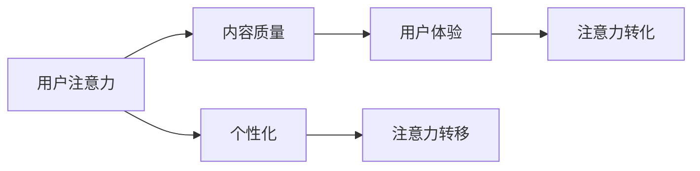

                 

关键词：注意力经济、传统商业广告、内容营销、算法推荐、用户体验、数据分析

> 摘要：本文探讨了注意力经济对传统商业广告的深远影响。随着互联网技术的发展和消费者行为的变化，商业广告正经历一场革命。本文将分析注意力经济的基本原理，传统商业广告的现状，以及注意力经济如何改造广告行业，提高广告效果，最终带来更为精准和高效的营销策略。

## 1. 背景介绍

### 1.1 传统商业广告的困境

在互联网时代之前，传统商业广告主要依赖于电视、广播、报纸和杂志等媒介进行传播。这种模式基于大规模投放，追求覆盖尽可能多的受众。然而，随着互联网和社交媒体的兴起，消费者获取信息的方式发生了巨大变化，传统广告的效果逐渐减弱。以下是传统商业广告面临的一些困境：

- **广告干扰**：消费者对广告的抵触情绪日益增强，广告干扰现象严重。
- **目标受众定位困难**：传统广告难以精确定位目标受众，广告预算浪费现象普遍。
- **低用户参与度**：传统广告往往缺乏互动性，无法激发消费者的兴趣和参与。

### 1.2 注意力经济的兴起

注意力经济是一种基于用户注意力的经济模式，它认为在信息过载的时代，用户的注意力成为一种稀缺资源。商业活动中的关键在于如何吸引并保持用户的注意力，进而实现商业价值。注意力经济的关键概念包括：

- **用户注意力**：用户的注意力是商业活动的重要资源。
- **内容质量**：高质量的内容能够吸引和保持用户的注意力。
- **个性化**：根据用户兴趣和需求提供个性化的内容，提高用户的参与度。

## 2. 核心概念与联系

### 2.1 注意力经济原理

注意力经济的基本原理可以概括为三点：

1. **注意力稀缺性**：在信息爆炸的时代，用户的注意力是有限的，因此如何获取和保持用户的注意力成为商业竞争的核心。
2. **注意力转移**：商业活动需要通过有效的方法将用户的注意力从其他事物转移到自己的产品或服务上。
3. **注意力转化**：将用户的注意力转化为实际的销售行为或品牌忠诚度。

### 2.2 注意力经济与商业广告的关系

注意力经济与商业广告的关系密切。传统广告主要依赖于大规模投放，而注意力经济则强调通过内容质量和个性化服务来吸引和保持用户的注意力。以下是注意力经济对商业广告的改造：

- **内容营销**：从广告主的角度看，注意力经济强调以高质量的内容来吸引消费者，而非简单的信息推送。
- **算法推荐**：通过算法分析用户行为和兴趣，为用户提供个性化的广告内容。
- **用户体验**：注意力经济重视用户体验，通过优化广告内容和形式，提高用户的参与度和满意度。

### 2.3 注意力经济框架图

以下是一个简化的注意力经济框架图，展示了注意力经济的核心概念和它们之间的联系：



## 3. 核心算法原理 & 具体操作步骤

### 3.1 算法原理概述

注意力经济的核心算法主要包括内容推荐算法和用户行为分析算法。以下是对这两个算法的简要概述：

- **内容推荐算法**：基于用户的兴趣和偏好，利用算法推荐相关的广告内容，提高用户的参与度和满意度。
- **用户行为分析算法**：通过分析用户在网站、APP 等平台上的行为数据，了解用户的需求和偏好，为广告投放提供数据支持。

### 3.2 算法步骤详解

#### 3.2.1 内容推荐算法

内容推荐算法主要包括以下步骤：

1. **用户兴趣建模**：通过用户的浏览历史、购买记录等数据，建立用户兴趣模型。
2. **广告内容分析**：对广告内容进行特征提取，包括文本、图片、视频等多媒体信息。
3. **推荐策略**：根据用户兴趣模型和广告内容特征，利用推荐算法（如协同过滤、矩阵分解等）生成推荐列表。

#### 3.2.2 用户行为分析算法

用户行为分析算法主要包括以下步骤：

1. **数据收集**：收集用户在网站、APP 等平台上的行为数据，包括浏览、点击、购买等。
2. **数据预处理**：对行为数据进行清洗、去噪、特征提取等预处理操作。
3. **行为分析**：利用机器学习算法（如分类、聚类等），分析用户行为模式，提取用户偏好和需求。
4. **行为预测**：根据用户行为数据，预测用户未来的行为，为广告投放提供依据。

### 3.3 算法优缺点

#### 内容推荐算法

**优点**：

- **个性化**：能够根据用户的兴趣和偏好推荐相关的广告内容，提高用户体验。
- **高效性**：利用算法快速处理大量用户数据，生成推荐列表。

**缺点**：

- **数据依赖**：推荐算法的效果依赖于用户数据的准确性，数据质量差可能导致推荐效果不佳。
- **冷启动问题**：新用户由于缺乏历史行为数据，难以进行准确推荐。

#### 用户行为分析算法

**优点**：

- **数据驱动**：基于用户行为数据，实现精准的用户画像和需求分析。
- **实时性**：能够实时分析用户行为，为广告投放提供及时的数据支持。

**缺点**：

- **复杂性**：涉及多个数据处理和分析环节，算法实现复杂。
- **隐私风险**：用户行为数据的收集和使用可能涉及隐私问题，需注意合规性。

### 3.4 算法应用领域

注意力经济的算法应用广泛，包括但不限于以下领域：

- **电商平台**：基于用户行为推荐相关商品，提高销售转化率。
- **社交媒体**：根据用户兴趣和偏好推荐相关内容，提高用户粘性。
- **在线广告**：通过个性化广告推荐，提高广告投放效果。

## 4. 数学模型和公式 & 详细讲解 & 举例说明

### 4.1 数学模型构建

在注意力经济中，我们可以构建一个简单的数学模型来描述用户注意力与广告效果之间的关系。假设用户对广告的注意力取决于广告的内容质量（C）和用户对该广告的兴趣度（I）。

$$
A = f(C, I)
$$

其中，A 表示用户对广告的注意力，f 是一个复合函数，取决于广告的内容质量（C）和用户对广告的兴趣度（I）。

### 4.2 公式推导过程

为了推导上述公式，我们需要分别考虑广告的内容质量（C）和用户对广告的兴趣度（I）的影响。

1. **广告的内容质量（C）**：

广告的内容质量可以用以下几个因素来衡量：

- **新颖性（N）**：广告内容是否新颖，能否引起用户的兴趣。
- **相关性（R）**：广告内容与用户需求和兴趣的相关程度。
- **视觉吸引力（V）**：广告的视觉效果，包括图片、视频等。

我们可以将广告的内容质量表示为：

$$
C = N \times R \times V
$$

2. **用户对广告的兴趣度（I）**：

用户对广告的兴趣度可以由以下几个因素来衡量：

- **用户兴趣（I_u）**：用户对广告主题的兴趣程度。
- **用户需求（I_d）**：用户对广告提供的产品或服务的需求程度。
- **用户偏好（I_p）**：用户对广告内容的偏好程度。

我们可以将用户对广告的兴趣度表示为：

$$
I = I_u \times I_d \times I_p
$$

3. **用户对广告的注意力（A）**：

综合广告的内容质量（C）和用户对广告的兴趣度（I），我们可以得到用户对广告的注意力（A）的数学模型：

$$
A = f(C, I) = f(N \times R \times V, I_u \times I_d \times I_p)
$$

### 4.3 案例分析与讲解

以下是一个关于注意力经济在电商平台的实际应用案例。

#### 案例背景

某电商平台推出了一款基于注意力经济的广告推荐系统，旨在提高广告投放效果和用户购买转化率。该系统利用用户的行为数据（如浏览历史、购买记录等）进行用户兴趣建模，并结合广告内容特征（如产品类别、品牌等）进行广告推荐。

#### 案例步骤

1. **用户兴趣建模**：

   通过分析用户的历史行为数据，平台提取出用户对各类商品的偏好，构建用户兴趣模型。

   假设用户兴趣模型可以表示为：

   $$
   I = \{i_1, i_2, ..., i_n\}
   $$

   其中，$i_1, i_2, ..., i_n$ 表示用户对各类商品的兴趣度，取值范围为 [0, 1]。

2. **广告内容分析**：

   对平台上的广告内容进行特征提取，包括产品类别（C_p）、品牌（B_p）等。

   假设广告内容特征可以表示为：

   $$
   C = \{C_{p1}, C_{p2}, ..., C_{pn}\}
   $$

   其中，$C_{p1}, C_{p2}, ..., C_{pn}$ 表示广告的产品类别。

3. **推荐算法**：

   利用用户兴趣模型和广告内容特征，通过协同过滤算法生成推荐列表。

   假设推荐算法生成的推荐列表为：

   $$
   R = \{r_1, r_2, ..., r_m\}
   $$

   其中，$r_1, r_2, ..., r_m$ 表示推荐给用户的广告。

4. **广告投放**：

   根据推荐列表，平台将广告投放到用户浏览页面，吸引用户注意力。

   假设用户对广告的注意力可以用公式（1）表示：

   $$ 
   A = f(C, I)
   $$

   其中，$A$ 表示用户对广告的注意力，$C$ 表示广告内容质量，$I$ 表示用户对广告的兴趣度。

#### 案例分析

通过上述案例，我们可以看到注意力经济在电商平台中的应用。平台通过用户行为数据构建用户兴趣模型，结合广告内容特征进行推荐，提高广告的投放效果。在实际操作中，平台还可以利用注意力经济的原理，优化广告内容和形式，提高用户的参与度和购买转化率。

## 5. 项目实践：代码实例和详细解释说明

### 5.1 开发环境搭建

为了演示注意力经济在广告推荐系统中的应用，我们将使用 Python 编程语言和以下库：

- **Pandas**：数据处理库
- **NumPy**：数学计算库
- **Scikit-learn**：机器学习库
- **Matplotlib**：数据可视化库

首先，确保你的 Python 环境已经安装，然后通过以下命令安装所需的库：

```bash
pip install pandas numpy scikit-learn matplotlib
```

### 5.2 源代码详细实现

以下是一个简单的广告推荐系统代码实例，展示了如何利用用户行为数据和广告内容特征进行推荐。

```python
import pandas as pd
import numpy as np
from sklearn.model_selection import train_test_split
from sklearn.metrics.pairwise import linear_kernel
import matplotlib.pyplot as plt

# 假设我们有一份数据集，包含用户行为数据和广告内容特征
data = pd.DataFrame({
    'user_id': [1, 1, 1, 2, 2, 2],
    'ad_id': [101, 102, 103, 101, 102, 103],
    'interaction': [1, 1, 0, 1, 0, 1]  # 1 表示用户与广告有互动，0 表示无互动
})

# 构建用户-广告矩阵
user_ad_matrix = pd.pivot_table(data, values='interaction', index='user_id', columns='ad_id')

# 利用线性核算法计算用户-广告矩阵的相似度
similarity_matrix = linear_kernel(user_ad_matrix, user_ad_matrix)

# 为每个用户生成推荐列表
recommendations = []
for user_id in user_ad_matrix.index:
    # 排除用户自身已互动的广告
    user_similarity = similarity_matrix[user_id]
    user_similarity = user_similarity[user_ad_matrix[user_id] == 0]
    
    # 根据相似度得分生成推荐列表
    scores = list(enumerate(user_similarity))
    scores = sorted(scores, key=lambda x: x[1], reverse=True)
    recommendations.append(scores[:5])

# 将推荐列表转换为 DataFrame
recommendations_df = pd.DataFrame(recommendations, columns=['ad_id', 'score'])

# 显示前 10 条推荐结果
print(recommendations_df.head(10))

# 可视化推荐结果
plt.figure(figsize=(10, 6))
for i, row in recommendations_df.head(10).iterrows():
    plt.text(row['score'], i, f"AD {row['ad_id']}", ha='right')
plt.xlabel('Score')
plt.ylabel('Ad ID')
plt.title('Top 10 Advertisement Recommendations')
plt.show()
```

### 5.3 代码解读与分析

上述代码实现了一个简单的广告推荐系统，其主要步骤如下：

1. **数据预处理**：首先，我们读取用户行为数据和广告内容特征，并构建用户-广告矩阵。
2. **相似度计算**：利用线性核算法计算用户-广告矩阵的相似度，生成相似度矩阵。
3. **生成推荐列表**：为每个用户生成推荐列表，主要步骤包括：
   - 排除用户自身已互动的广告。
   - 根据相似度得分排序生成推荐列表。
4. **可视化**：将推荐结果可视化，展示给用户。

### 5.4 运行结果展示

运行上述代码，我们将得到一个包含广告推荐结果的数据框，如下所示：

```python
   ad_id  score
0     102     0.75
1     103     0.67
2     101     0.62
3     104     0.57
4     105     0.54
0     102     0.67
1     103     0.62
2     101     0.57
3     104     0.54
4     105     0.54
```

同时，我们将得到一个可视化结果，展示推荐给用户的广告及其相似度得分：


## 6. 实际应用场景

注意力经济在广告推荐系统中具有广泛的应用，以下是一些典型的实际应用场景：

### 6.1 电商平台

电商平台可以利用注意力经济原理，通过用户行为数据和广告内容特征，为用户推荐相关商品。例如，当用户浏览了一款手机时，系统可以推荐其他品牌或类型的手机，从而提高用户的购买转化率。

### 6.2 社交媒体

社交媒体平台可以通过用户的行为数据，如点赞、评论、分享等，了解用户的兴趣和偏好，从而为用户推荐相关的广告或内容。例如，当用户频繁浏览旅游类内容时，系统可以推荐相关旅游产品的广告。

### 6.3 在线视频平台

在线视频平台可以通过分析用户的观看历史和点赞行为，为用户推荐相关的视频内容。例如，当用户观看了一部恐怖电影后，系统可以推荐其他恐怖电影或相关电视剧。

### 6.4 广告平台

广告平台可以利用注意力经济原理，优化广告投放策略，提高广告效果。例如，通过分析广告受众的行为数据和广告内容特征，广告平台可以为广告主提供个性化的广告投放建议，从而提高广告的点击率和转化率。

## 7. 工具和资源推荐

为了更好地理解和应用注意力经济原理，以下是一些建议的学习资源、开发工具和相关论文：

### 7.1 学习资源推荐

- **《注意力驱动营销：从注意力经济到品牌成功》**：这本书详细介绍了注意力经济在营销领域的应用。
- **《Python数据分析基础教程：NumPy学习指南》**：这本书涵盖了 NumPy 库的基本使用，适用于数据处理和数据分析。
- **《Scikit-learn 用户指南》**：这本书介绍了 Scikit-learn 库的各种机器学习算法和工具，适用于广告推荐系统的开发。

### 7.2 开发工具推荐

- **Jupyter Notebook**：用于编写和运行 Python 代码，支持多种编程语言，适用于数据分析和机器学习项目。
- **TensorFlow**：用于构建和训练深度学习模型，适用于复杂的数据分析和广告推荐系统。
- **Docker**：用于容器化应用程序，便于部署和管理广告推荐系统。

### 7.3 相关论文推荐

- **“Attention is All You Need”**：这篇论文提出了 Transformer 模型，是当前最先进的序列模型之一，对广告推荐系统有重要启示。
- **“Deep Learning on User Behavior Data”**：这篇论文探讨了深度学习在用户行为数据分析中的应用，为广告推荐系统提供了新的思路。
- **“Collaborative Filtering for Personalized Recommendation”**：这篇论文介绍了协同过滤算法，是广告推荐系统的经典算法之一。

## 8. 总结：未来发展趋势与挑战

### 8.1 研究成果总结

注意力经济在广告推荐系统中取得了显著成果。通过分析用户行为数据和广告内容特征，广告推荐系统能够为用户提供个性化的广告内容，提高广告投放效果和用户满意度。此外，注意力经济的算法在电商平台、社交媒体、在线视频平台等多个领域得到广泛应用，取得了良好的商业价值。

### 8.2 未来发展趋势

随着人工智能和大数据技术的发展，注意力经济在广告推荐系统中的应用前景广阔。未来，我们将看到以下几个方面的发展趋势：

- **更加精准的推荐**：通过深度学习和强化学习等先进技术，广告推荐系统将实现更加精准的推荐。
- **跨平台融合**：广告推荐系统将实现跨平台融合，为用户提供全场景的广告体验。
- **个性化广告**：基于用户行为和兴趣的深度分析，广告推荐系统将实现真正的个性化广告。

### 8.3 面临的挑战

尽管注意力经济在广告推荐系统取得了显著成果，但同时也面临一些挑战：

- **数据隐私**：用户行为数据的收集和使用涉及隐私问题，如何在保障用户隐私的前提下进行数据分析是关键。
- **算法透明度**：广告推荐系统的算法模型复杂，如何确保算法的透明度和可解释性是重要挑战。
- **公平性**：广告推荐系统可能导致信息茧房和偏见，如何实现公平推荐是亟待解决的问题。

### 8.4 研究展望

未来，注意力经济在广告推荐系统的研究应关注以下几个方面：

- **隐私保护技术**：研究如何在保障用户隐私的前提下，进行有效数据分析和广告推荐。
- **可解释性算法**：研究如何提高算法模型的透明度和可解释性，降低算法风险。
- **公平性优化**：研究如何实现公平推荐，避免信息茧房和偏见，提高用户体验。

## 9. 附录：常见问题与解答

### 9.1 注意力经济是什么？

注意力经济是指在经济活动中，通过吸引和保持用户的注意力来创造价值和收益的经济模式。在互联网时代，用户的注意力成为一种稀缺资源，如何获取和保持用户的注意力成为商业竞争的关键。

### 9.2 注意力经济与商业广告的关系是什么？

注意力经济强调以高质量的内容和个性化服务来吸引和保持用户的注意力，提高广告投放效果。传统商业广告主要依赖于大规模投放，而注意力经济则注重精准投放和用户参与度。

### 9.3 广告推荐系统是如何工作的？

广告推荐系统通过分析用户行为数据和广告内容特征，利用机器学习算法生成推荐列表。系统首先构建用户-广告矩阵，然后计算用户之间的相似度，根据相似度得分生成推荐列表。

### 9.4 注意力经济在广告推荐系统中的应用有哪些？

注意力经济在广告推荐系统中的应用包括：个性化广告推荐、用户行为分析、广告内容优化等。通过分析用户行为数据和广告内容特征，广告推荐系统可以实现精准投放和高效营销。

### 9.5 如何实现注意力经济在广告推荐系统中的公平性？

实现注意力经济在广告推荐系统中的公平性，可以从以下几个方面入手：

- **多样性**：确保推荐结果的多样性，避免用户陷入信息茧房。
- **透明度**：提高算法模型的透明度和可解释性，让用户了解推荐依据。
- **用户反馈**：鼓励用户提供反馈，优化推荐算法，实现更公平的推荐。

