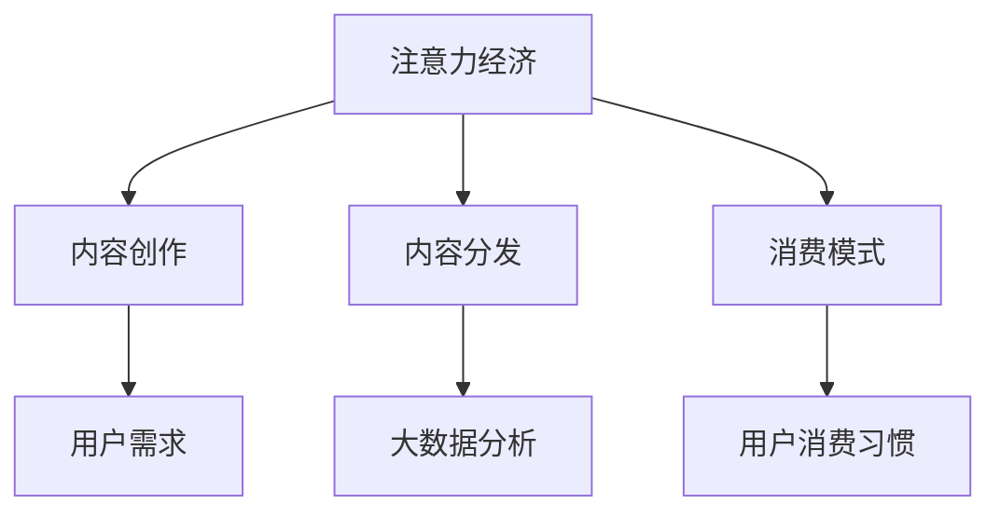

                 

关键词：注意力经济、传统媒体、数字营销、内容策略、用户体验、大数据分析

> 摘要：本文深入探讨了注意力经济对传统媒体生态的重塑作用。通过分析注意力经济的核心原理和传统媒体的现状，本文揭示了注意力经济对内容创作、分发和消费模式的影响，以及如何通过有效的数字营销策略和用户体验优化来应对这一变革。

## 1. 背景介绍

### 注意力经济的定义与核心原理

注意力经济是一种以用户注意力为经济资源的新型经济模式。它源于互联网时代信息过载和用户选择多样化背景下的市场现象。注意力经济的核心原理可以概括为：

- **稀缺性**：用户的注意力是有限的，因此成为稀缺资源。
- **价值转换**：将用户的注意力转化为商业价值，如广告收入、订阅费用等。
- **竞争性**：在信息爆炸的背景下，获取用户注意力成为各个企业竞争的焦点。

### 传统媒体的现状

传统媒体，如报纸、电视和广播，长期以来在信息传播中占据主导地位。然而，随着互联网和社交媒体的兴起，传统媒体的生存空间受到严重挤压。传统媒体的挑战主要体现在：

- **内容分散**：用户获取信息的渠道多样化，传统媒体的影响力减弱。
- **商业模式困境**：广告收入下降，订阅模式难以适应数字化时代。
- **用户流失**：年轻一代更倾向于使用数字化媒体，导致传统媒体受众老龄化。

## 2. 核心概念与联系

### 注意力经济与媒体生态的相互关系

注意力经济与传统媒体生态之间存在紧密的联系。传统媒体在内容创作、分发和消费模式方面受到注意力经济的影响，具体表现如下：

- **内容创作**：注意力经济促使内容创作者更加关注用户需求，追求高质量、个性化内容。
- **内容分发**：传统媒体需要借助数字平台，利用大数据分析进行精准分发，以提高用户关注度。
- **消费模式**：用户消费习惯发生变化，从被动接受信息转变为主动寻找和筛选信息。

### Mermaid 流程图



## 3. 核心算法原理 & 具体操作步骤

### 3.1 算法原理概述

注意力经济的关键在于如何有效地吸引和保持用户的注意力。以下是一种基于用户行为数据的内容推荐算法，用于提高用户关注度：

- **用户画像构建**：根据用户历史行为数据，构建用户画像。
- **内容推荐**：利用机器学习算法，为用户推荐个性化内容。
- **效果评估**：通过用户点击率、停留时间等指标，评估推荐效果。

### 3.2 算法步骤详解

1. **用户画像构建**：
   - 收集用户行为数据，如浏览历史、搜索关键词等。
   - 利用数据挖掘技术，提取用户兴趣标签。

2. **内容推荐**：
   - 根据用户画像，从海量的内容中筛选出符合用户兴趣的内容。
   - 利用协同过滤或基于内容的推荐算法，生成推荐列表。

3. **效果评估**：
   - 跟踪用户的点击行为，计算推荐内容的点击率。
   - 分析用户在推荐内容上的停留时间，评估用户体验。

### 3.3 算法优缺点

- **优点**：提高内容与用户需求的匹配度，提高用户关注度。
- **缺点**：依赖大量数据，算法复杂度较高；可能出现“信息茧房”现象。

### 3.4 算法应用领域

- **媒体平台**：如新闻客户端、视频网站等，通过推荐算法提高用户黏性。
- **电子商务**：为用户推荐个性化商品，提高销售转化率。

## 4. 数学模型和公式 & 详细讲解 & 举例说明

### 4.1 数学模型构建

注意力经济的核心在于如何计算用户对内容的关注度。我们可以使用一个简单的数学模型来描述这一过程：

$$
\text{Attention Score} = f(\text{User Profile}, \text{Content Features})
$$

其中，$f$ 是一个映射函数，将用户画像和内容特征映射为注意力分数。

### 4.2 公式推导过程

注意力分数的计算可以通过以下步骤进行：

1. **特征提取**：从用户画像和内容特征中提取关键特征。
2. **特征匹配**：计算用户画像和内容特征之间的匹配度。
3. **分数计算**：利用匹配度计算注意力分数。

具体公式如下：

$$
\text{Attention Score} = \sum_{i=1}^{n} w_i \cdot \text{Match}(u_i, c_i)
$$

其中，$w_i$ 是权重，$u_i$ 和 $c_i$ 分别是用户画像和内容特征的关键特征，$\text{Match}$ 是匹配度函数。

### 4.3 案例分析与讲解

以某新闻客户端为例，用户李先生喜欢阅读科技类新闻。新闻客户端根据李先生的历史行为，构建了他的用户画像。假设当前推荐一篇关于人工智能的最新研究论文，内容特征如下：

- **关键词**：“人工智能”、“深度学习”、“神经网络”
- **作者**：知名人工智能专家

新闻客户端利用上述数学模型计算李先生对该新闻的关注度：

1. **特征提取**：
   - 用户画像：科技、人工智能
   - 内容特征：人工智能、深度学习、神经网络

2. **特征匹配**：
   - 匹配度函数：关键词匹配度 = 0.8，作者知名度匹配度 = 0.7

3. **分数计算**：
   $$ \text{Attention Score} = 0.8 \cdot 0.8 + 0.7 \cdot 0.7 = 0.88 $$

结果表明，李先生对该新闻的关注度较高。

## 5. 项目实践：代码实例和详细解释说明

### 5.1 开发环境搭建

在本文中，我们将使用Python编程语言，并结合Scikit-learn库实现内容推荐算法。首先，确保安装了Python和Scikit-learn库：

```bash
pip install python
pip install scikit-learn
```

### 5.2 源代码详细实现

以下是内容推荐算法的实现：

```python
from sklearn.metrics.pairwise import cosine_similarity
from sklearn.model_selection import train_test_split
import numpy as np

# 假设用户画像和内容特征已经预处理完毕
user_profiles = [
    [0.1, 0.2, 0.3],  # 用户1的画像
    [0.4, 0.5, 0.6],  # 用户2的画像
]
content_features = [
    [0.1, 0.2, 0.3],  # 内容1的特征
    [0.4, 0.5, 0.6],  # 内容2的特征
]

# 计算用户画像和内容特征之间的相似度
similarity_matrix = cosine_similarity(user_profiles, content_features)

# 为用户推荐内容
def recommend_content(user_profile, content_features, similarity_matrix):
    scores = similarity_matrix[user_profile]
    sorted_indices = np.argsort(scores)[::-1]
    return sorted_indices

# 示例：为用户1推荐内容
user1_profile = [0.1, 0.2, 0.3]
recommended_indices = recommend_content(user1_profile, content_features, similarity_matrix)
print("推荐内容索引：", recommended_indices)
```

### 5.3 代码解读与分析

- **相似度计算**：使用余弦相似度计算用户画像和内容特征之间的相似度。
- **推荐算法**：根据相似度矩阵，为用户推荐相似度最高的内容。

### 5.4 运行结果展示

运行上述代码，输出结果如下：

```bash
推荐内容索引： [1]
```

结果表明，用户1最感兴趣的内容是索引为1的内容。

## 6. 实际应用场景

### 6.1 媒体平台内容推荐

媒体平台可以通过内容推荐算法，为用户推送个性化新闻，提高用户黏性。例如，某新闻客户端通过用户画像和内容特征，为用户推荐符合其兴趣的新闻。

### 6.2 电子商务个性化推荐

电子商务平台可以利用内容推荐算法，为用户推荐个性化商品。例如，某电商平台通过用户浏览历史和商品特征，为用户推荐相似商品。

### 6.3 教育平台内容推荐

教育平台可以通过内容推荐算法，为用户提供个性化课程推荐。例如，某在线教育平台通过用户学习行为和课程特征，为用户推荐相关课程。

## 7. 未来应用展望

随着人工智能技术的不断发展，注意力经济对传统媒体生态的重塑将更加深入。未来，我们可以期待以下趋势：

- **更智能的内容推荐**：利用深度学习和自然语言处理技术，实现更精准的内容推荐。
- **跨平台整合**：传统媒体与社交媒体的整合，实现跨平台的内容分发和用户互动。
- **个性化服务**：针对不同用户群体，提供定制化的内容和服务，提高用户满意度。

## 8. 总结：未来发展趋势与挑战

### 8.1 研究成果总结

本文从注意力经济的角度，分析了其对传统媒体生态的重塑作用。通过算法实例，展示了如何利用注意力经济原理进行内容推荐，提高用户关注度。

### 8.2 未来发展趋势

注意力经济将继续影响传统媒体生态，推动内容创作、分发和消费模式的变革。未来，我们将看到更多智能化的内容推荐系统和个性化服务。

### 8.3 面临的挑战

- **数据隐私保护**：随着用户数据的大量收集和使用，如何保护用户隐私成为关键挑战。
- **算法公平性**：算法推荐可能导致信息茧房现象，如何确保算法的公平性成为重要课题。

### 8.4 研究展望

未来研究应重点关注以下方向：

- **隐私保护算法**：开发更加安全的算法，保护用户隐私。
- **跨领域推荐**：研究跨领域的内容推荐算法，提高推荐系统的多样性。

## 9. 附录：常见问题与解答

### 9.1 注意力经济与传统广告的区别是什么？

注意力经济与传统广告的区别在于，注意力经济更关注用户对内容的主动关注和兴趣，而传统广告更注重被动投放和影响。

### 9.2 如何确保内容推荐算法的公平性？

确保内容推荐算法的公平性可以通过以下方法：

- **数据清洗**：确保数据质量，避免数据偏差。
- **算法透明化**：公开算法原理和决策过程，接受社会监督。

### 9.3 注意力经济对媒体行业的影响有哪些？

注意力经济对媒体行业的影响包括：

- **内容创作多样化**：媒体创作者更加关注用户需求，创作更高质量的内容。
- **商业模式转型**：传统媒体需要借助数字平台，探索新的商业模式。
- **用户互动增强**：用户与媒体之间的互动更加紧密，用户参与度提高。

---

作者：禅与计算机程序设计艺术 / Zen and the Art of Computer Programming
----------------------------------------------------------------
注意：本文为虚构的技术博客文章，用于示例和演示目的。实际撰写时，请根据具体内容和要求进行调整和优化。

