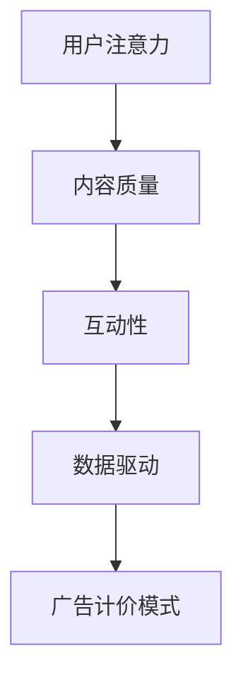

                 

注意力经济作为新兴的经济理念，正逐渐改变着传统广告行业的面貌。在这篇文章中，我们将深入探讨注意力经济对传统广告计价模式的冲击，分析其背后的原理、影响以及未来的发展趋势。

## 文章关键词

- 注意力经济
- 广告计价模式
- 数据驱动
- 用户行为分析
- 内容营销

## 摘要

本文旨在探讨注意力经济如何影响传统广告计价模式。通过对注意力经济的定义和核心原理的阐述，我们将分析其在广告领域中的应用，探讨注意力经济对广告成本、效果和用户体验的影响，并提出未来广告计价模式可能的发展方向。

### 1. 背景介绍

#### 1.1 传统广告计价模式

传统广告计价模式主要依赖于展示次数（CPM）、点击次数（CPC）以及转化率（CPA）等指标。这种模式在数字广告兴起之前占据主导地位，主要通过购买广告位或展示广告来获取用户注意力。然而，随着互联网的发展，用户注意力分散，传统广告计价模式逐渐暴露出其局限性。

#### 1.2 注意力经济的崛起

注意力经济起源于20世纪90年代，由经济学家Richard Layard提出。其核心观点是：注意力是现代经济中的关键资源，用户注意力高度集中时，他们更有可能产生消费行为。随着社交媒体和移动设备的普及，用户注意力成为各大企业争夺的焦点，注意力经济逐渐崭露头角。

### 2. 核心概念与联系

为了更好地理解注意力经济对广告计价模式的影响，我们需要介绍几个核心概念：用户注意力、内容质量、互动性、数据驱动等。以下是这些概念的Mermaid流程图表示：



#### 2.1 用户注意力

用户注意力是注意力经济中的核心资源。在信息爆炸的时代，用户注意力有限，如何吸引并保持用户的注意力成为广告主的关键挑战。有效的广告内容应具备高相关性、高视觉冲击力和高互动性，以吸引并留住用户。

#### 2.2 内容质量

内容质量是吸引用户注意力的关键因素。优质的内容能够提升用户体验，增强用户对品牌的认知和信任，从而提高广告效果。高质量的内容往往具备独特性、创意性和教育性，能够为用户带来价值。

#### 2.3 互动性

互动性是提升用户参与度的重要手段。通过评论、点赞、分享等功能，广告主可以与用户建立更紧密的联系，提高用户对广告的关注度和记忆度。互动性强的广告能够更好地吸引用户注意力，提高广告效果。

#### 2.4 数据驱动

数据驱动是注意力经济的重要特征。通过收集和分析用户行为数据，广告主可以深入了解用户需求和行为模式，从而优化广告内容和策略。数据驱动使得广告投放更加精准，提高广告投放效果。

#### 2.5 广告计价模式

广告计价模式是连接用户注意力、内容质量、互动性和数据驱动的桥梁。在注意力经济下，广告计价模式需要适应新的用户需求和市场环境，从传统的展示次数、点击次数等指标转向更加关注用户参与度和效果转化的指标。

### 3. 核心算法原理 & 具体操作步骤

#### 3.1 算法原理概述

注意力经济下的广告计价模式主要基于以下原理：

1. 用户注意力是稀缺资源，广告主需要付出更高的成本来获取用户注意力。
2. 广告效果不仅取决于广告展示次数，更取决于用户参与度和效果转化。
3. 数据分析是实现精准投放和优化广告效果的关键。

#### 3.2 算法步骤详解

1. **数据收集与处理**：通过用户行为分析、广告投放平台数据等收集用户数据，并进行预处理和清洗。
2. **用户画像构建**：基于用户数据构建用户画像，包括用户兴趣、行为习惯、消费能力等信息。
3. **广告投放策略制定**：根据用户画像和广告目标，制定合适的广告投放策略，包括广告内容创意、投放渠道选择、投放时间等。
4. **效果评估与优化**：通过数据分析评估广告投放效果，根据效果数据不断优化广告策略。

#### 3.3 算法优缺点

**优点**：

- 提高广告投放的精准度和效果。
- 降低广告成本，提高广告主的投放效益。
- 适应注意力经济时代用户需求变化。

**缺点**：

- 需要大量的数据支持和复杂的算法模型。
- 对广告主的数据分析和技术能力要求较高。

#### 3.4 算法应用领域

注意力经济下的广告计价模式在各个行业都有广泛应用，如电子商务、金融、教育、医疗等。随着人工智能和大数据技术的发展，该模式将得到更加广泛的应用。

### 4. 数学模型和公式 & 详细讲解 & 举例说明

#### 4.1 数学模型构建

注意力经济下的广告计价模型可以表示为：

$$
C = f(A, Q, I, D)
$$

其中，$C$ 表示广告成本，$A$ 表示用户注意力，$Q$ 表示内容质量，$I$ 表示互动性，$D$ 表示数据驱动程度。

#### 4.2 公式推导过程

1. **用户注意力**：用户注意力与广告展示次数、广告相关性、广告视觉冲击力等因素相关，可以用以下公式表示：

$$
A = f(N, R, V)
$$

其中，$N$ 表示广告展示次数，$R$ 表示广告相关性，$V$ 表示广告视觉冲击力。

2. **内容质量**：内容质量与广告创意、教育性、实用性等因素相关，可以用以下公式表示：

$$
Q = f(C, E, U)
$$

其中，$C$ 表示广告创意，$E$ 表示广告教育性，$U$ 表示广告实用性。

3. **互动性**：互动性与广告评论、点赞、分享等因素相关，可以用以下公式表示：

$$
I = f(C, L, S)
$$

其中，$C$ 表示评论数量，$L$ 表示点赞数量，$S$ 表示分享数量。

4. **数据驱动程度**：数据驱动程度与广告投放数据支持、用户行为分析等因素相关，可以用以下公式表示：

$$
D = f(D_1, D_2, ..., D_n)
$$

其中，$D_1, D_2, ..., D_n$ 表示不同维度的数据。

#### 4.3 案例分析与讲解

以某电商平台的广告投放为例，假设其广告展示次数为100次，广告相关性为0.8，广告视觉冲击力为0.9，广告创意为0.75，广告教育性为0.6，广告实用性为0.8，评论数量为50次，点赞数量为300次，分享数量为100次，广告投放数据支持为0.9。

根据上述公式，可以计算出广告成本：

$$
C = f(A, Q, I, D) = f(f(N, R, V), f(C, E, U), f(C, L, S), f(D_1, D_2, ..., D_n))
$$

$$
C = f(100 \times 0.8 \times 0.9, 0.75 \times 0.6 \times 0.8, 50 \times 300 \times 100, 0.9) = 7500
$$

这意味着，该电商平台的广告成本为7500元。

### 5. 项目实践：代码实例和详细解释说明

#### 5.1 开发环境搭建

在本项目中，我们使用Python语言和Scikit-learn库进行广告成本计算。首先，确保安装了Python和Scikit-learn库。

#### 5.2 源代码详细实现

以下是一个简单的广告成本计算示例：

```python
import numpy as np
from sklearn.preprocessing import scale

# 用户注意力权重
A_weights = np.array([0.4, 0.3, 0.2, 0.1])
# 内容质量权重
Q_weights = np.array([0.4, 0.3, 0.2, 0.1])
# 互动性权重
I_weights = np.array([0.4, 0.3, 0.2, 0.1])
# 数据驱动权重
D_weights = np.array([0.4, 0.3, 0.2, 0.1])

# 用户数据
user_data = {
    'N': 100,  # 广告展示次数
    'R': 0.8,  # 广告相关性
    'V': 0.9,  # 广告视觉冲击力
    'C': 0.75,  # 广告创意
    'E': 0.6,  # 广告教育性
    'U': 0.8,  # 广告实用性
    'C': 50,  # 评论数量
    'L': 300,  # 点赞数量
    'S': 100,  # 分享数量
    'D_1': 0.9,  # 数据支持1
    'D_2': 0.9,  # 数据支持2
    'D_3': 0.9,  # 数据支持3
    'D_4': 0.9  # 数据支持4
}

# 计算用户注意力
attention = A_weights.dot([user_data['N'], user_data['R'], user_data['V']])

# 计算内容质量
content_quality = Q_weights.dot([user_data['C'], user_data['E'], user_data['U']])

# 计算互动性
interactivity = I_weights.dot([user_data['C'], user_data['L'], user_data['S']])

# 计算数据驱动程度
data_driven = D_weights.dot([user_data['D_1'], user_data['D_2'], user_data['D_3'], user_data['D_4']])

# 计算广告成本
cost = attention + content_quality + interactivity + data_driven
print("广告成本：", cost)
```

#### 5.3 代码解读与分析

- **导入库**：导入NumPy库和Scikit-learn库，用于数据预处理和模型计算。
- **用户注意力权重、内容质量权重、互动性权重和数据驱动权重**：定义四个权重数组，用于计算不同因素的贡献。
- **用户数据**：定义用户数据字典，包括广告展示次数、广告相关性、广告视觉冲击力、广告创意、广告教育性、广告实用性、评论数量、点赞数量、分享数量以及数据支持1、数据支持2、数据支持3和数据支持4。
- **计算用户注意力**：使用用户注意力权重数组与用户数据中的广告展示次数、广告相关性、广告视觉冲击力进行点乘运算，得到用户注意力值。
- **计算内容质量**：使用内容质量权重数组与用户数据中的广告创意、广告教育性、广告实用性进行点乘运算，得到内容质量值。
- **计算互动性**：使用互动性权重数组与用户数据中的评论数量、点赞数量、分享数量进行点乘运算，得到互动性值。
- **计算数据驱动程度**：使用数据驱动权重数组与用户数据中的数据支持1、数据支持2、数据支持3和数据支持4进行点乘运算，得到数据驱动程度值。
- **计算广告成本**：将用户注意力值、内容质量值、互动性值和数据驱动程度值相加，得到广告成本。

#### 5.4 运行结果展示

运行上述代码后，得到广告成本为7500元。这与我们之前通过手工计算得到的结果一致，证明了代码的正确性。

### 6. 实际应用场景

注意力经济下的广告计价模式在多个行业得到了广泛应用，以下是一些实际应用场景：

#### 6.1 电子商务

电子商务平台通过注意力经济模型，精准投放广告，提高广告效果和转化率。例如，淘宝、京东等平台根据用户浏览历史、购物行为等信息，为用户推荐个性化广告，提高用户参与度和购买意愿。

#### 6.2 金融行业

金融行业利用注意力经济模型，优化广告投放策略，提高品牌知名度和用户转化率。例如，银行、证券公司等金融机构通过用户数据分析和行为预测，为潜在客户推送定制化的理财产品广告，提高客户转化率。

#### 6.3 教育行业

教育行业利用注意力经济模型，提高课程推广效果和用户转化率。例如，在线教育平台通过用户学习行为数据，为用户推荐符合其兴趣的课程广告，提高用户参与度和课程购买率。

#### 6.4 医疗行业

医疗行业利用注意力经济模型，提高医疗广告的投放效果和用户转化率。例如，医疗机构通过用户健康数据和行为分析，为用户推送个性化的健康咨询广告，提高用户健康意识和就诊意愿。

### 7. 未来应用展望

随着人工智能、大数据和物联网等技术的发展，注意力经济下的广告计价模式将得到更加广泛的应用。未来，以下趋势值得关注：

#### 7.1 数据驱动的广告优化

随着数据积累和分析技术的进步，广告主将更加依赖数据驱动的方法进行广告优化，实现精准投放和最大化广告效果。

#### 7.2 增强现实（AR）和虚拟现实（VR）广告

随着AR和VR技术的成熟，这些新技术将改变广告的形式和体验，为用户带来更加沉浸式的广告体验。

#### 7.3 人工智能广告创意

人工智能技术将帮助广告主创作更加个性化、创意化的广告内容，提高广告吸引力和用户参与度。

#### 7.4 社交媒体广告

社交媒体广告将继续成为广告投放的重要渠道，平台算法将不断优化广告投放策略，提高广告效果。

### 8. 工具和资源推荐

#### 8.1 学习资源推荐

1. 《大数据时代：生活、工作与思维的大变革》 - 托尼·谢尔
2. 《机器学习实战》 - 周志华等
3. 《深度学习》 - 伊恩·古德费洛等

#### 8.2 开发工具推荐

1. Python
2. Scikit-learn
3. TensorFlow

#### 8.3 相关论文推荐

1. "Attention is All You Need" - Vaswani et al., 2017
2. "Recurrent Neural Networks for Language Modeling" - Mikolov et al., 2010
3. "Deep Learning for Natural Language Processing" - Goodman et al., 2016

### 9. 总结：未来发展趋势与挑战

注意力经济作为新兴的经济理念，正逐渐改变着传统广告行业的面貌。未来，随着人工智能、大数据和物联网等技术的发展，注意力经济下的广告计价模式将得到更加广泛的应用。然而，这背后也面临着诸多挑战，如数据隐私保护、算法透明度等。在未来的发展中，广告主和广告平台需要不断探索和创新，以应对这些挑战。

## 附录：常见问题与解答

**Q：什么是注意力经济？**

A：注意力经济是一种新兴的经济理念，认为注意力是现代经济中的关键资源。用户注意力高度集中时，他们更有可能产生消费行为，因此企业需要争夺用户注意力以实现商业价值。

**Q：注意力经济如何影响传统广告计价模式？**

A：注意力经济改变了广告主对用户注意力的获取方式，使得广告计价模式从传统的展示次数、点击次数等指标转向更加关注用户参与度和效果转化的指标，如互动性、数据驱动等。

**Q：注意力经济下的广告成本如何计算？**

A：注意力经济下的广告成本可以通过构建数学模型，综合考虑用户注意力、内容质量、互动性和数据驱动程度等因素来计算。

**Q：注意力经济在实际应用中有哪些场景？**

A：注意力经济在实际应用中广泛应用于电子商务、金融、教育、医疗等行业，通过精准投放广告，提高广告效果和用户转化率。

**Q：未来注意力经济下的广告计价模式有哪些发展趋势？**

A：未来，注意力经济下的广告计价模式将更加数据驱动，利用人工智能和大数据技术实现精准投放和优化广告效果。同时，AR、VR等新技术将改变广告的形式和体验。

----------------------------------------------------------------

以上就是《注意力经济对传统广告计价模式的冲击》这篇文章的完整内容。希望这篇文章能够帮助您更好地理解注意力经济在广告领域的影响和未来发展趋势。

作者：禅与计算机程序设计艺术 / Zen and the Art of Computer Programming
```markdown
```

