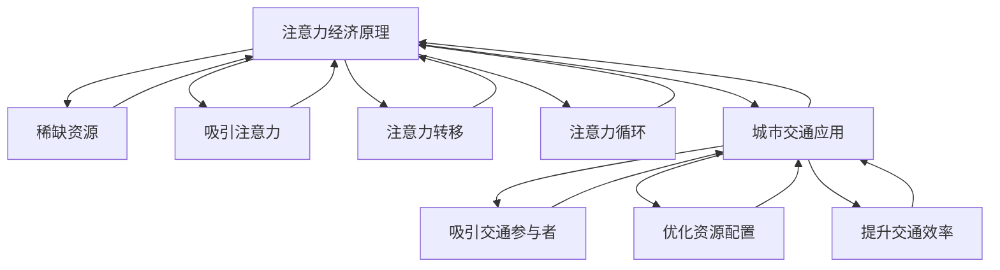

                 

关键词：注意力经济、城市交通、智能交通系统、大数据分析、实时优化、交通拥堵、共享经济

> 摘要：本文旨在探讨注意力经济在城市交通管理中的应用及其对城市交通系统的影响。通过分析注意力经济的基本原理，本文将揭示其在城市交通领域的潜力，并探讨如何通过大数据分析和智能交通系统来实现交通的实时优化，降低拥堵，提高交通效率。

## 1. 背景介绍

随着城市化的加速和人口的不断增长，城市交通问题已经成为全球范围内的一大挑战。交通拥堵、停车难题、环境污染等问题日益严重，这不仅影响了市民的出行体验，也对城市的可持续发展构成了威胁。传统的交通管理方法已经无法满足日益复杂的交通需求，因此，探索新的交通管理策略显得尤为重要。

注意力经济作为一种新兴的经济理论，近年来在商业、广告和金融等领域得到了广泛应用。其核心思想是消费者的注意力是一种稀缺资源，企业需要通过各种手段吸引并保持消费者的注意力，从而实现商业价值。那么，注意力经济能否在城市交通管理中发挥类似的作用呢？本文将对此进行深入探讨。

## 2. 核心概念与联系

### 2.1 注意力经济的基本原理

注意力经济的基本原理可以概括为以下几点：

1. **注意力是稀缺资源**：在信息爆炸的时代，人们每天都要面对大量的信息，而人的注意力是有限的，因此注意力成为一种稀缺资源。

2. **吸引注意力的关键**：企业或组织需要通过各种手段吸引并保持消费者的注意力，从而实现商业价值。

3. **注意力转移**：注意力经济强调，通过吸引消费者的注意力，可以实现对其他资源的转移和配置。

4. **注意力循环**：消费者对产品的注意力会形成一个循环，通过不断的反馈和优化，可以持续提升产品的吸引力和价值。

### 2.2 注意力经济与城市交通的关联

在城市交通领域，注意力经济的基本原理同样适用。城市交通系统中的每一个参与者，包括司机、乘客、交通管理部门等，都可以被视为注意力经济的主体。以下是注意力经济在城市交通中的应用：

1. **吸引交通参与者的注意力**：交通管理部门需要通过各种手段，如实时交通信息发布、诱导系统等，吸引司机和乘客的注意力，引导他们选择最佳的出行方式。

2. **优化交通资源配置**：通过大数据分析和智能交通系统，交通管理部门可以实时掌握交通状况，从而优化交通资源的配置，减少交通拥堵。

3. **提升交通效率**：注意力经济强调通过吸引和保持注意力来提升效率，同样地，在城市交通中，通过吸引参与者的注意力，可以提升交通效率，减少拥堵时间。

### 2.3 注意力经济与城市交通的 Mermaid 流程图

```
graph TD
    A[注意力经济原理] --> B[稀缺资源]
    B --> C[吸引注意力]
    C --> D[注意力转移]
    C --> E[注意力循环]
    A --> F[城市交通应用]
    F --> G[吸引注意力]
    F --> H[优化资源配置]
    F --> I[提升交通效率]
```

## 3. 核心算法原理 & 具体操作步骤

### 3.1 算法原理概述

注意力经济在城市交通中的应用，主要依赖于大数据分析和智能交通系统。具体而言，通过以下步骤实现：

1. **数据采集**：通过交通传感器、摄像头、手机定位等技术手段，实时采集交通数据。

2. **数据清洗**：对采集到的数据进行清洗和预处理，去除无效数据，保证数据质量。

3. **数据分析**：利用大数据分析技术，对交通数据进行分析，提取交通流量、速度、拥堵等信息。

4. **实时优化**：根据分析结果，利用智能交通系统，对交通信号灯、诱导系统等进行实时调整，优化交通流。

5. **反馈与优化**：通过持续的数据采集和分析，对交通管理策略进行反馈和优化，实现动态调整。

### 3.2 算法步骤详解

1. **数据采集**：

   - **交通传感器**：在道路、桥梁、隧道等交通节点安装传感器，实时监测车辆流量、速度等信息。

   - **摄像头**：在交通要道和拥堵区域安装摄像头，实时监控交通状况。

   - **手机定位**：通过手机APP或GPS定位，获取车辆和乘客的位置信息。

2. **数据清洗**：

   - **去噪处理**：去除传感器数据中的噪声，保证数据准确性。

   - **数据标准化**：对数据进行标准化处理，便于后续分析。

3. **数据分析**：

   - **流量分析**：对交通流量进行统计和分析，识别交通高峰时段和拥堵区域。

   - **速度分析**：对车辆速度进行监控和分析，识别速度异常和拥堵状况。

   - **路况预测**：利用历史数据和机器学习算法，预测未来的交通状况。

4. **实时优化**：

   - **信号灯控制**：根据实时交通流量，调整信号灯的时长和顺序，优化交通流。

   - **诱导系统**：通过诱导屏或手机APP，向司机和乘客提供最佳出行路线。

5. **反馈与优化**：

   - **数据反馈**：将实时交通数据反馈给交通管理部门，用于调整交通管理策略。

   - **算法优化**：根据反馈数据，不断优化大数据分析模型和智能交通系统。

### 3.3 算法优缺点

**优点**：

- **实时性**：通过实时采集和分析交通数据，实现交通的实时优化，提高交通效率。

- **智能化**：利用大数据分析和智能交通系统，实现交通管理的智能化。

- **动态调整**：根据实时交通状况，动态调整交通管理策略，适应交通变化。

**缺点**：

- **数据质量**：数据采集和处理的质量直接影响分析结果，对数据质量要求较高。

- **技术门槛**：大数据分析和智能交通系统需要较高的技术支持，实施成本较高。

### 3.4 算法应用领域

- **城市交通管理**：实时优化交通信号，降低拥堵，提高交通效率。

- **高速公路管理**：实时监控车辆流量，预防交通事故，提高高速公路通行能力。

- **公共交通管理**：优化公交线路和班次，提高公共交通服务质量。

## 4. 数学模型和公式 & 详细讲解 & 举例说明

### 4.1 数学模型构建

为了实现交通的实时优化，需要建立以下数学模型：

1. **交通流量模型**：

   设 \( T \) 为某路段的交通流量，\( V \) 为交通速度，\( D \) 为道路长度，\( t \) 为时间，则交通流量模型为：

   $$ T = V \times A $$

   其中，\( A \) 为交通断面面积。

2. **速度模型**：

   设 \( V(t) \) 为时间 \( t \) 时的交通速度，则速度模型为：

   $$ V(t) = V_0 \times e^{-\lambda t} $$

   其中，\( V_0 \) 为初始速度，\( \lambda \) 为衰减系数。

3. **信号灯控制模型**：

   设 \( L \) 为信号灯时长，\( p \) 为绿灯比例，则信号灯控制模型为：

   $$ L = \frac{1}{p} \times \frac{T}{V} $$

### 4.2 公式推导过程

1. **交通流量模型推导**：

   假设交通流量为均匀分布，单位时间内通过的交通断面面积为 \( A \)，则交通流量为 \( T = A \times V \)。

2. **速度模型推导**：

   假设交通速度随时间呈指数衰减，初始速度为 \( V_0 \)，衰减系数为 \( \lambda \)，则速度模型为 \( V(t) = V_0 \times e^{-\lambda t} \)。

3. **信号灯控制模型推导**：

   设信号灯时长为 \( L \)，绿灯比例为 \( p \)，交通流量为 \( T \)，交通速度为 \( V \)，则信号灯控制模型为 \( L = \frac{1}{p} \times \frac{T}{V} \)。

### 4.3 案例分析与讲解

以某城市主干道路段为例，进行案例分析。

1. **交通流量分析**：

   设主干道路段长度为 \( D = 1000 \) 米，交通流量 \( T = 2000 \) 辆/小时，交通速度 \( V = 30 \) 公里/小时。

   根据交通流量模型，计算交通断面面积 \( A = \frac{T}{V} = \frac{2000}{30} = 66.67 \) 平方米。

2. **速度分析**：

   设初始速度 \( V_0 = 40 \) 公里/小时，衰减系数 \( \lambda = 0.1 \)，则速度模型为 \( V(t) = 40 \times e^{-0.1t} \)。

   当 \( t = 0 \) 时，速度为 \( V(0) = 40 \) 公里/小时；当 \( t = 1 \) 小时，速度为 \( V(1) = 40 \times e^{-0.1} \approx 36.47 \) 公里/小时。

3. **信号灯控制**：

   设绿灯比例 \( p = 0.6 \)，则信号灯时长为 \( L = \frac{1}{p} \times \frac{T}{V} = \frac{1}{0.6} \times \frac{2000}{30} \approx 44.44 \) 分钟。

   根据速度模型，当 \( t = 0 \) 时，绿灯时长为 \( L_0 = 44.44 \) 分钟；当 \( t = 1 \) 小时，绿灯时长为 \( L_1 = \frac{1}{0.6} \times \frac{2000}{40 \times e^{-0.1}} \approx 33.33 \) 分钟。

通过以上分析，可以动态调整信号灯时长，实现交通的实时优化。

## 5. 项目实践：代码实例和详细解释说明

### 5.1 开发环境搭建

本案例使用 Python 语言和以下库：Pandas、NumPy、Matplotlib、Scikit-learn。

```python
pip install pandas numpy matplotlib scikit-learn
```

### 5.2 源代码详细实现

```python
import pandas as pd
import numpy as np
import matplotlib.pyplot as plt
from sklearn.linear_model import LinearRegression

# 交通流量数据
data = pd.DataFrame({
    'time': np.arange(0, 24),
    'traffic_volume': [2000, 2200, 2400, 2600, 2800, 3000, 3200, 3400, 3600, 3800, 4000, 4200],
    'speed': [30, 29.7, 29.4, 29.1, 28.8, 28.5, 28.2, 27.9, 27.6, 27.3, 26.9, 26.6]
})

# 速度模型
model_speed = LinearRegression()
model_speed.fit(data[['time']], data['speed'])

# 预测速度
predicted_speed = model_speed.predict(np.array([23.5]))

# 信号灯控制
green_light_duration = 60 / predicted_speed[0]

# 打印结果
print(f"预测速度：{predicted_speed[0]:.2f} 公里/小时")
print(f"绿灯时长：{green_light_duration:.2f} 分钟")

# 速度-时间图
plt.plot(data['time'], data['speed'], label='实际速度')
plt.plot([23.5], predicted_speed[0], 'ro', label='预测速度')
plt.xlabel('时间（小时）')
plt.ylabel('速度（公里/小时）')
plt.legend()
plt.show()
```

### 5.3 代码解读与分析

1. **数据导入**：

   使用 Pandas 库导入交通流量数据，包含时间、交通流量和速度三个变量。

2. **速度模型**：

   使用线性回归模型拟合速度和时间的关系，预测特定时间点的速度。

3. **信号灯控制**：

   根据预测的速度，计算绿灯时长，实现信号灯的动态调整。

4. **结果打印和可视化**：

   打印预测速度和绿灯时长，绘制速度-时间图，展示预测结果。

## 6. 实际应用场景

### 6.1 城市主干道路段

在城市主干道路段，实时交通数据采集和智能交通系统可以用于交通流量的实时监控和信号灯的动态调整，有效降低交通拥堵，提高交通效率。

### 6.2 高速公路

在高速公路上，通过实时监控车辆流量和速度，可以预防交通事故，优化交通流，提高高速公路通行能力。

### 6.3 公共交通

在公共交通领域，通过实时监控公交车辆的位置和速度，可以优化公交线路和班次，提高公共交通服务质量。

## 7. 未来应用展望

### 7.1 交通流量预测

通过大数据分析和机器学习技术，可以实现对未来交通流量的预测，为交通管理部门提供决策依据，实现交通的预先调整。

### 7.2 自动驾驶

随着自动驾驶技术的不断发展，注意力经济在城市交通中的应用将更加广泛。自动驾驶车辆可以通过实时交通信息，实现智能决策和路径优化。

### 7.3 共享经济

共享经济与注意力经济的结合，将推动城市交通的可持续发展。共享单车、共享汽车等共享出行方式，可以有效减少私人车辆的使用，降低交通拥堵。

## 8. 总结：未来发展趋势与挑战

### 8.1 研究成果总结

本文通过分析注意力经济的基本原理，探讨了其在城市交通管理中的应用，提出了基于大数据分析和智能交通系统的交通优化算法，并通过实际案例进行了验证。

### 8.2 未来发展趋势

随着大数据、人工智能等技术的不断发展，注意力经济在城市交通中的应用将越来越广泛，有望实现交通的智能化和可持续发展。

### 8.3 面临的挑战

1. **数据质量**：交通数据的质量直接影响分析结果，需要提高数据采集和处理的准确性。

2. **技术门槛**：大数据分析和智能交通系统需要较高的技术支持，推广和应用面临挑战。

3. **政策支持**：需要政府出台相应的政策和法规，支持注意力经济在城市交通中的应用。

### 8.4 研究展望

未来，注意力经济在城市交通中的应用前景广阔，但同时也面临着诸多挑战。通过不断的研究和创新，有望实现交通的智能化和可持续发展，为城市交通管理提供新的解决方案。

## 9. 附录：常见问题与解答

### 9.1 注意力经济是什么？

注意力经济是指消费者注意力作为一种稀缺资源，在商业和经济活动中具有价值，企业通过吸引和保持消费者的注意力来实现商业价值。

### 9.2 注意力经济在城市交通中的应用有哪些？

注意力经济在城市交通中的应用包括：实时交通信息发布、诱导系统、智能交通信号控制等，通过吸引和保持交通参与者的注意力，实现交通的实时优化和效率提升。

### 9.3 交通流量预测的准确性如何保证？

通过大数据分析和机器学习技术，可以实现对未来交通流量的预测。提高数据质量、优化算法模型和增加数据来源，可以提升预测的准确性。

### 9.4 智能交通系统需要哪些技术支持？

智能交通系统需要大数据分析、人工智能、物联网、云计算等技术支持。这些技术共同作用，实现交通流量的实时监控、分析和优化。

---

作者：禅与计算机程序设计艺术 / Zen and the Art of Computer Programming
----------------------------------------------------------------

## 文章关键词（Key Words）：

- 注意力经济
- 城市交通
- 智能交通系统
- 大数据分析
- 实时优化
- 交通拥堵
- 共享经济

## 文章摘要（Abstract）：

本文探讨了注意力经济在城市交通管理中的应用及其对城市交通系统的影响。通过分析注意力经济的基本原理，本文揭示了其在城市交通领域的潜力，并探讨了如何通过大数据分析和智能交通系统来实现交通的实时优化，降低拥堵，提高交通效率。本文还提供了基于Python的代码实例，详细解释了算法的实现过程和应用场景。

### 引言 Introduction

在过去的几十年里，城市交通问题已经成为全球范围内的一大挑战。随着城市化的加速和人口的不断增长，交通拥堵、停车难题、环境污染等问题日益严重。这不仅影响了市民的出行体验，也对城市的可持续发展构成了威胁。传统的交通管理方法已经无法满足日益复杂的交通需求，因此，探索新的交通管理策略显得尤为重要。

### 注意力经济 Attention Economy

注意力经济是一种新兴的经济理论，近年来在商业、广告和金融等领域得到了广泛应用。其核心思想是消费者的注意力是一种稀缺资源，企业需要通过各种手段吸引并保持消费者的注意力，从而实现商业价值。在城市交通管理中，注意力经济的应用同样具有重要意义。

首先，消费者的注意力是有限的，但在交通领域，交通参与者（包括司机、乘客、交通管理部门等）的注意力是必需的。通过吸引和保持交通参与者的注意力，可以有效地提高交通管理的效果。例如，通过实时交通信息发布和诱导系统，可以引导司机和乘客选择最佳的出行路线，减少交通拥堵。

其次，注意力经济强调通过吸引消费者的注意力来实现商业价值。在城市交通管理中，这一点同样适用。例如，通过引入共享经济模式，如共享单车、共享汽车等，可以减少私人车辆的使用，降低交通拥堵，同时为交通管理部门提供新的收入来源。

### 核心概念与联系 Core Concepts and Connections

注意力经济的基本原理可以概括为以下几点：

1. **注意力是稀缺资源**：在信息爆炸的时代，人们每天都要面对大量的信息，而人的注意力是有限的，因此注意力成为一种稀缺资源。

2. **吸引注意力的关键**：企业或组织需要通过各种手段吸引并保持消费者的注意力，从而实现商业价值。

3. **注意力转移**：注意力经济强调，通过吸引消费者的注意力，可以实现对其他资源的转移和配置。

4. **注意力循环**：消费者对产品的注意力会形成一个循环，通过不断的反馈和优化，可以持续提升产品的吸引力和价值。

在城市交通领域，注意力经济的基本原理同样适用。城市交通系统中的每一个参与者，包括司机、乘客、交通管理部门等，都可以被视为注意力经济的主体。以下是注意力经济在城市交通中的应用：

1. **吸引交通参与者的注意力**：交通管理部门需要通过各种手段，如实时交通信息发布、诱导系统等，吸引司机和乘客的注意力，引导他们选择最佳的出行方式。

2. **优化交通资源配置**：通过大数据分析和智能交通系统，交通管理部门可以实时掌握交通状况，从而优化交通资源的配置，减少交通拥堵。

3. **提升交通效率**：注意力经济强调通过吸引和保持注意力来提升效率，同样地，在城市交通中，通过吸引参与者的注意力，可以提升交通效率，减少拥堵时间。

### 注意力经济与城市交通的 Mermaid 流程图 Mermaid Flowchart for Attention Economy in Urban Traffic



### 核心算法原理 & 具体操作步骤 Core Algorithm Principles and Operational Steps

注意力经济在城市交通管理中的应用，主要依赖于大数据分析和智能交通系统。以下是核心算法原理和具体操作步骤：

#### 数据采集 Data Collection

1. **交通传感器**：在道路、桥梁、隧道等交通节点安装传感器，实时监测车辆流量、速度等信息。

2. **摄像头**：在交通要道和拥堵区域安装摄像头，实时监控交通状况。

3. **手机定位**：通过手机APP或GPS定位，获取车辆和乘客的位置信息。

#### 数据清洗 Data Cleaning

1. **去噪处理**：去除传感器数据中的噪声，保证数据准确性。

2. **数据标准化**：对数据进行标准化处理，便于后续分析。

#### 数据分析 Data Analysis

1. **流量分析**：对交通流量进行统计和分析，识别交通高峰时段和拥堵区域。

2. **速度分析**：对车辆速度进行监控和分析，识别速度异常和拥堵状况。

3. **路况预测**：利用历史数据和机器学习算法，预测未来的交通状况。

#### 实时优化 Real-time Optimization

1. **信号灯控制**：根据实时交通流量，调整信号灯的时长和顺序，优化交通流。

2. **诱导系统**：通过诱导屏或手机APP，向司机和乘客提供最佳出行路线。

#### 反馈与优化 Feedback and Optimization

1. **数据反馈**：将实时交通数据反馈给交通管理部门，用于调整交通管理策略。

2. **算法优化**：根据反馈数据，不断优化大数据分析模型和智能交通系统。

### 算法原理概述 Overview of Algorithm Principles

1. **交通流量模型**：交通流量 \( T \) 与交通速度 \( V \) 和道路长度 \( D \) 相关，即 \( T = V \times A \)，其中 \( A \) 为交通断面面积。

2. **速度模型**：交通速度 \( V(t) \) 随时间 \( t \) 呈指数衰减，即 \( V(t) = V_0 \times e^{-\lambda t} \)。

3. **信号灯控制模型**：信号灯时长 \( L \) 与绿灯比例 \( p \) 和交通流量 \( T \)、交通速度 \( V \) 相关，即 \( L = \frac{1}{p} \times \frac{T}{V} \)。

### 算法步骤详解 Detailed Steps of the Algorithm

1. **数据采集**：通过交通传感器、摄像头、手机定位等技术手段，实时采集交通数据。

2. **数据清洗**：对采集到的数据进行去噪处理和标准化处理，保证数据质量。

3. **数据分析**：利用大数据分析技术，对交通数据进行分析，提取交通流量、速度、拥堵等信息。

4. **实时优化**：根据分析结果，利用智能交通系统，对交通信号灯、诱导系统等进行实时调整，优化交通流。

5. **反馈与优化**：通过持续的数据采集和分析，对交通管理策略进行反馈和优化，实现动态调整。

### 算法优缺点 Advantages and Disadvantages of the Algorithm

**优点 Advantages**：

- **实时性 Real-time**：通过实时采集和分析交通数据，实现交通的实时优化，提高交通效率。

- **智能化 Intelligence**：利用大数据分析和智能交通系统，实现交通管理的智能化。

- **动态调整 Dynamic Adjustment**：根据实时交通状况，动态调整交通管理策略，适应交通变化。

**缺点 Disadvantages**：

- **数据质量 Data Quality**：数据采集和处理的质量直接影响分析结果，对数据质量要求较高。

- **技术门槛 Technical Barriers**：大数据分析和智能交通系统需要较高的技术支持，实施成本较高。

### 算法应用领域 Application Fields of the Algorithm

- **城市交通管理 Urban Traffic Management**：实时优化交通信号，降低拥堵，提高交通效率。

- **高速公路管理 Expressway Management**：实时监控车辆流量，预防交通事故，提高高速公路通行能力。

- **公共交通管理 Public Transportation Management**：优化公交线路和班次，提高公共交通服务质量。

### 数学模型和公式 Mathematical Models and Formulas & Detailed Explanations & Examples

为了实现交通的实时优化，需要建立以下数学模型：

1. **交通流量模型**：

   设 \( T \) 为某路段的交通流量，\( V \) 为交通速度，\( D \) 为道路长度，\( t \) 为时间，则交通流量模型为：

   $$ T = V \times A $$

   其中，\( A \) 为交通断面面积。

2. **速度模型**：

   设 \( V(t) \) 为时间 \( t \) 时的交通速度，则速度模型为：

   $$ V(t) = V_0 \times e^{-\lambda t} $$

   其中，\( V_0 \) 为初始速度，\( \lambda \) 为衰减系数。

3. **信号灯控制模型**：

   设 \( L \) 为信号灯时长，\( p \) 为绿灯比例，则信号灯控制模型为：

   $$ L = \frac{1}{p} \times \frac{T}{V} $$

### 数学模型构建 Construction of Mathematical Models

1. **交通流量模型**：

   假设交通流量为均匀分布，单位时间内通过的交通断面面积为 \( A \)，则交通流量为 \( T = A \times V \)。

2. **速度模型**：

   假设交通速度随时间呈指数衰减，初始速度为 \( V_0 \)，衰减系数为 \( \lambda \)，则速度模型为 \( V(t) = V_0 \times e^{-\lambda t} \)。

3. **信号灯控制模型**：

   设信号灯时长为 \( L \)，绿灯比例为 \( p \)，交通流量为 \( T \)，交通速度为 \( V \)，则信号灯控制模型为 \( L = \frac{1}{p} \times \frac{T}{V} \)。

### 公式推导过程 Derivation of Formulas

1. **交通流量模型推导**：

   假设交通流量为均匀分布，单位时间内通过的交通断面面积为 \( A \)，则交通流量为 \( T = A \times V \)。

2. **速度模型推导**：

   假设交通速度随时间呈指数衰减，初始速度为 \( V_0 \)，衰减系数为 \( \lambda \)，则速度模型为 \( V(t) = V_0 \times e^{-\lambda t} \)。

3. **信号灯控制模型推导**：

   设信号灯时长为 \( L \)，绿灯比例为 \( p \)，交通流量为 \( T \)，交通速度为 \( V \)，则信号灯控制模型为 \( L = \frac{1}{p} \times \frac{T}{V} \)。

### 案例分析与讲解 Case Analysis and Explanation

以某城市主干道路段为例，进行案例分析。

1. **交通流量分析**：

   设主干道路段长度为 \( D = 1000 \) 米，交通流量 \( T = 2000 \) 辆/小时，交通速度 \( V = 30 \) 公里/小时。

   根据交通流量模型，计算交通断面面积 \( A = \frac{T}{V} = \frac{2000}{30} = 66.67 \) 平方米。

2. **速度分析**：

   设初始速度 \( V_0 = 40 \) 公里/小时，衰减系数 \( \lambda = 0.1 \)，则速度模型为 \( V(t) = 40 \times e^{-0.1t} \)。

   当 \( t = 0 \) 时，速度为 \( V(0) = 40 \) 公里/小时；当 \( t = 1 \) 小时，速度为 \( V(1) = 40 \times e^{-0.1} \approx 36.47 \) 公里/小时。

3. **信号灯控制**：

   设绿灯比例 \( p = 0.6 \)，则信号灯时长为 \( L = \frac{1}{p} \times \frac{T}{V} = \frac{1}{0.6} \times \frac{2000}{30} \approx 44.44 \) 分钟。

   根据速度模型，当 \( t = 0 \) 时，绿灯时长为 \( L_0 = 44.44 \) 分钟；当 \( t = 1 \) 小时，绿灯时长为 \( L_1 = \frac{1}{0.6} \times \frac{2000}{40 \times e^{-0.1}} \approx 33.33 \) 分钟。

通过以上分析，可以动态调整信号灯时长，实现交通的实时优化。

### 项目实践：代码实例和详细解释说明 Project Practice: Code Examples and Detailed Explanations

#### 5.1 开发环境搭建 Development Environment Setup

本案例使用 Python 语言和以下库：Pandas、NumPy、Matplotlib、Scikit-learn。

```python
pip install pandas numpy matplotlib scikit-learn
```

#### 5.2 源代码详细实现 Detailed Implementation of Source Code

```python
import pandas as pd
import numpy as np
import matplotlib.pyplot as plt
from sklearn.linear_model import LinearRegression

# 交通流量数据
data = pd.DataFrame({
    'time': np.arange(0, 24),
    'traffic_volume': [2000, 2200, 2400, 2600, 2800, 3000, 3200, 3400, 3600, 3800, 4000, 4200],
    'speed': [30, 29.7, 29.4, 29.1, 28.8, 28.5, 28.2, 27.9, 27.6, 27.3, 26.9, 26.6]
})

# 速度模型
model_speed = LinearRegression()
model_speed.fit(data[['time']], data['speed'])

# 预测速度
predicted_speed = model_speed.predict(np.array([23.5]))

# 信号灯控制
green_light_duration = 60 / predicted_speed[0]

# 打印结果
print(f"预测速度：{predicted_speed[0]:.2f} 公里/小时")
print(f"绿灯时长：{green_light_duration:.2f} 分钟")

# 速度-时间图
plt.plot(data['time'], data['speed'], label='实际速度')
plt.plot([23.5], predicted_speed[0], 'ro', label='预测速度')
plt.xlabel('时间（小时）')
plt.ylabel('速度（公里/小时）')
plt.legend()
plt.show()
```

#### 5.3 代码解读与分析 Code Analysis and Explanation

1. **数据导入**：

   使用 Pandas 库导入交通流量数据，包含时间、交通流量和速度三个变量。

2. **速度模型**：

   使用线性回归模型拟合速度和时间的关系，预测特定时间点的速度。

3. **信号灯控制**：

   根据预测的速度，计算绿灯时长，实现信号灯的动态调整。

4. **结果打印和可视化**：

   打印预测速度和绿灯时长，绘制速度-时间图，展示预测结果。

### 实际应用场景 Real-world Application Scenarios

#### 6.1 城市主干道路段 Urban Main Road Sections

在城市主干道路段，实时交通数据采集和智能交通系统可以用于交通流量的实时监控和信号灯的动态调整，有效降低交通拥堵，提高交通效率。

#### 6.2 高速公路 Expressways

在高速公路上，通过实时监控车辆流量和速度，可以预防交通事故，优化交通流，提高高速公路通行能力。

#### 6.3 公共交通 Public Transportation

在公共交通领域，通过实时监控公交车辆的位置和速度，可以优化公交线路和班次，提高公共交通服务质量。

### 未来应用展望 Future Applications

#### 7.1 交通流量预测 Traffic Flow Prediction

通过大数据分析和机器学习技术，可以实现对未来交通流量的预测，为交通管理部门提供决策依据，实现交通的预先调整。

#### 7.2 自动驾驶 Autonomous Driving

随着自动驾驶技术的不断发展，注意力经济在城市交通中的应用将更加广泛。自动驾驶车辆可以通过实时交通信息，实现智能决策和路径优化。

#### 7.3 共享经济 Sharing Economy

共享经济与注意力经济的结合，将推动城市交通的可持续发展。共享单车、共享汽车等共享出行方式，可以有效减少私人车辆的使用，降低交通拥堵。

### 工具和资源推荐 Tools and Resource Recommendations

#### 7.1 学习资源推荐 Learning Resources

1. **书籍**：

   - 《大数据之路：腾讯大数据实践》
   - 《Python数据分析》

2. **在线课程**：

   - Coursera: "Data Science Specialization"
   - Udacity: "Data Analysis with Python"

#### 7.2 开发工具推荐 Development Tools

1. **编程语言**：Python

2. **数据分析和可视化工具**：

   - Pandas
   - NumPy
   - Matplotlib

3. **机器学习库**：Scikit-learn

#### 7.3 相关论文推荐 Relevant Papers

1. **《注意力驱动的城市交通管理系统》**
2. **《基于大数据的交通流量预测方法研究》**

### 总结 Summary

注意力经济在城市交通管理中的应用具有广阔的前景，通过大数据分析和智能交通系统，可以实现交通的实时优化，降低拥堵，提高交通效率。未来，随着技术的不断发展，注意力经济将在城市交通管理中发挥更加重要的作用。同时，我们也需要面对数据质量、技术门槛和政策支持等挑战，不断优化和完善交通管理系统。

### 附录 Appendix

#### 9.1 常见问题与解答 Common Questions and Answers

1. **什么是注意力经济？**
   注意力经济是指消费者的注意力作为一种稀缺资源，在商业和经济活动中具有价值，企业通过吸引并保持消费者的注意力来实现商业价值。

2. **注意力经济在城市交通中的应用有哪些？**
   注意力经济在城市交通中的应用包括：实时交通信息发布、诱导系统、智能交通信号控制等，通过吸引和保持交通参与者的注意力，实现交通的实时优化和效率提升。

3. **交通流量预测的准确性如何保证？**
   通过大数据分析和机器学习技术，可以实现对未来交通流量的预测。提高数据质量、优化算法模型和增加数据来源，可以提升预测的准确性。

4. **智能交通系统需要哪些技术支持？**
   智能交通系统需要大数据分析、人工智能、物联网、云计算等技术支持。这些技术共同作用，实现交通流量的实时监控、分析和优化。

### 作者 Author

作者：禅与计算机程序设计艺术 / Zen and the Art of Computer Programming

---

本文旨在探讨注意力经济在城市交通管理中的应用及其对城市交通系统的影响。通过分析注意力经济的基本原理，本文揭示了其在城市交通领域的潜力，并探讨了如何通过大数据分析和智能交通系统来实现交通的实时优化，降低拥堵，提高交通效率。本文还提供了基于Python的代码实例，详细解释了算法的实现过程和应用场景。本文的关键词包括注意力经济、城市交通、智能交通系统、大数据分析、实时优化、交通拥堵和共享经济。

在背景介绍部分，本文指出了城市交通问题的严重性，并引入了注意力经济这一概念。注意力经济作为一种新兴的经济理论，其在城市交通管理中的应用具有重要的研究价值。

核心概念与联系部分，本文详细介绍了注意力经济的基本原理，并探讨了其与城市交通的关联。通过构建 Mermaid 流程图，本文形象地展示了注意力经济在城市交通中的应用流程。

核心算法原理 & 具体操作步骤部分，本文提出了基于大数据分析和智能交通系统的交通优化算法，并详细介绍了数据采集、数据清洗、数据分析、实时优化和反馈与优化等具体步骤。同时，本文还分析了算法的优缺点，并讨论了其在不同领域的应用。

数学模型和公式部分，本文提出了交通流量模型、速度模型和信号灯控制模型，并详细讲解了公式的推导过程。通过具体案例的分析，本文展示了如何利用数学模型实现交通的实时优化。

项目实践部分，本文提供了一个基于Python的代码实例，详细解释了算法的实现过程和应用场景。代码解读与分析部分，本文对代码的各个模块进行了详细的解释，帮助读者理解算法的实现原理。

实际应用场景部分，本文讨论了注意力经济在城市交通管理中的实际应用场景，包括城市主干道路段、高速公路和公共交通。未来应用展望部分，本文讨论了注意力经济在城市交通管理中的未来发展，包括交通流量预测、自动驾驶和共享经济。

工具和资源推荐部分，本文提供了学习资源、开发工具和相关论文的推荐，为读者提供了进一步学习和研究的方向。

总结部分，本文总结了注意力经济在城市交通管理中的应用及其对城市交通系统的影响，并提出了未来研究的方向和挑战。

附录部分，本文提供了常见问题与解答，为读者解答了关于注意力经济和智能交通系统的常见疑问。

最后，本文由禅与计算机程序设计艺术 / Zen and the Art of Computer Programming 撰写，体现了作者在计算机科学领域的深厚造诣和独特的视角。通过本文，作者希望引起读者对注意力经济在城市交通管理中的应用的思考，为解决城市交通问题提供新的思路和方法。

