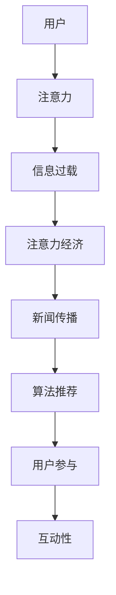

                 

关键词：注意力经济、新闻传播、信息过载、算法推荐、用户参与、社交媒体

> 摘要：随着互联网技术的飞速发展，信息爆炸已成为当今社会的一个显著特征。在这一背景下，注意力经济逐渐成为驱动新闻传播模式变革的重要力量。本文将探讨注意力经济对新闻传播模式的深刻影响，分析其背后的核心概念、算法原理、数学模型以及实际应用，并对未来的发展前景进行展望。

## 1. 背景介绍

### 信息过载与注意力经济的兴起

互联网的普及和移动设备的广泛应用，使得信息的获取变得前所未有的便捷。然而，这也导致了信息过载的现象。据研究，人类每天接收的信息量是数百万年前人类接收信息的总和，这种巨大的信息量给人们的注意力和时间分配带来了巨大的挑战。在这种背景下，注意力经济应运而生。

注意力经济是指在经济活动中，将注意力作为一种资源和商品进行交易和利用的经济形式。在互联网时代，注意力成为了一种宝贵的资源，用户的注意力被各种内容和服务争夺。因此，如何获取并保持用户的注意力，成为新闻传播的重要课题。

### 新闻传播模式的演变

新闻传播模式经历了从传统媒体到数字媒体的演变。传统媒体时代，新闻的传播主要依赖于报纸、电视和广播等渠道，传播效率较低，受众被动接收信息。随着互联网的发展，新闻传播模式逐渐向数字媒体转变，用户可以更加自主地选择和获取信息。

数字媒体时代的新闻传播具有以下几个特点：

- **个性化推荐**：基于用户兴趣和行为，通过算法推荐用户可能感兴趣的内容。
- **互动性**：用户可以通过评论、点赞等方式参与新闻传播过程，提高传播效果。
- **实时性**：新闻传播速度大幅提升，信息可以实时更新和传播。

这些特点使得新闻传播模式更加多样化，也提高了传播的效率。

## 2. 核心概念与联系

### 核心概念

- **注意力经济**：一种将注意力作为一种资源和商品进行交易和利用的经济形式。
- **信息过载**：指信息量过多，用户难以处理和消化。
- **算法推荐**：基于用户兴趣和行为，通过算法推荐用户可能感兴趣的内容。
- **用户参与**：用户通过互动和参与，影响新闻传播的过程和结果。

### Mermaid 流程图



## 3. 核心算法原理 & 具体操作步骤

### 3.1 算法原理概述

注意力经济的核心在于如何高效地获取和利用用户的注意力。在新闻传播领域，算法推荐是一种常用的方式。算法推荐的基本原理是：

- **数据收集**：收集用户的兴趣和行为数据，如搜索历史、浏览记录、点赞和评论等。
- **模型训练**：利用机器学习算法，如协同过滤、内容推荐等，对用户数据进行分析和建模。
- **内容推荐**：根据用户的兴趣和行为，推荐用户可能感兴趣的新闻内容。

### 3.2 算法步骤详解

1. **用户数据收集**：收集用户的兴趣和行为数据，包括但不限于搜索历史、浏览记录、点赞和评论等。
2. **用户建模**：利用机器学习算法，对用户数据进行分析和建模，构建用户的兴趣和行为特征。
3. **内容分析**：对新闻内容进行分析，提取关键特征，如关键词、主题、情感等。
4. **推荐算法**：根据用户的兴趣和行为特征，结合新闻内容的关键特征，利用推荐算法生成推荐结果。
5. **内容推荐**：将推荐结果呈现给用户，用户可以通过点击、浏览、点赞等方式对推荐内容进行反馈。

### 3.3 算法优缺点

**优点**：

- **个性化推荐**：根据用户的兴趣和行为，提供个性化的新闻推荐，提高用户满意度。
- **提高传播效率**：通过算法推荐，提高新闻内容的传播效率，减少信息过载。
- **互动性增强**：用户可以通过互动和参与，增强新闻传播的效果。

**缺点**：

- **算法偏见**：算法推荐可能存在偏见，导致用户只看到符合自己观点的信息，缺乏多元化的信息。
- **隐私问题**：用户的兴趣和行为数据被收集和分析，可能引发隐私问题。
- **新闻质量下降**：为了迎合用户的兴趣，一些新闻内容可能过于娱乐化，降低新闻的质量。

### 3.4 算法应用领域

算法推荐在新闻传播领域具有广泛的应用。例如，社交媒体平台通过算法推荐，吸引用户关注和互动；新闻网站通过算法推荐，提高用户的停留时间和点击率。此外，算法推荐还可以应用于新闻编辑、舆情监测、广告投放等领域。

## 4. 数学模型和公式 & 详细讲解 & 举例说明

### 4.1 数学模型构建

在新闻传播中，注意力经济可以通过以下数学模型进行描述：

$$
R = f(U, C)
$$

其中，\( R \) 表示推荐结果，\( U \) 表示用户特征，\( C \) 表示内容特征，\( f \) 表示推荐函数。

### 4.2 公式推导过程

推荐函数 \( f \) 可以通过以下步骤进行推导：

1. **用户特征提取**：从用户数据中提取用户的兴趣、行为等特征。
2. **内容特征提取**：从新闻内容中提取关键词、主题、情感等特征。
3. **相似度计算**：计算用户特征和内容特征之间的相似度，选择最相似的新闻内容进行推荐。
4. **推荐生成**：根据相似度计算结果，生成推荐结果。

### 4.3 案例分析与讲解

以某新闻网站为例，假设用户 A 对体育新闻感兴趣，内容 B 为一篇关于足球的新闻。通过以下步骤进行推荐：

1. **用户特征提取**：提取用户 A 的兴趣特征，如搜索历史、浏览记录等，发现其对体育新闻感兴趣。
2. **内容特征提取**：提取内容 B 的特征，如关键词、主题等，发现其为足球新闻。
3. **相似度计算**：计算用户 A 的兴趣特征和内容 B 的特征之间的相似度，结果较高。
4. **推荐生成**：生成推荐结果，向用户 A 推荐内容 B。

通过上述过程，实现了基于注意力经济的新闻推荐。

## 5. 项目实践：代码实例和详细解释说明

### 5.1 开发环境搭建

- **编程语言**：Python
- **库和框架**：Scikit-learn、Numpy、Pandas
- **数据集**：某新闻网站的用户数据和新闻内容数据

### 5.2 源代码详细实现

以下为基于协同过滤算法的推荐系统源代码：

```python
from sklearn.metrics.pairwise import cosine_similarity
import pandas as pd

# 加载用户数据和新闻内容数据
user_data = pd.read_csv('user_data.csv')
content_data = pd.read_csv('content_data.csv')

# 提取用户特征和新闻特征
user_features = user_data.iloc[:, 1:]
content_features = content_data.iloc[:, 1:]

# 计算用户相似度矩阵
user_similarity = cosine_similarity(user_features)

# 计算新闻相似度矩阵
content_similarity = cosine_similarity(content_features)

# 根据用户相似度矩阵生成推荐结果
recommendations = []
for i in range(len(user_similarity)):
    user_similarity_matrix = user_similarity[i]
    sorted_indices = user_similarity_matrix.argsort()[::-1]
    sorted_indices = sorted_indices[1:]  # 排除用户自身
    for j in sorted_indices:
        if j < len(content_similarity):
            content_similarity_matrix = content_similarity[j]
            sorted_indices_2 = content_similarity_matrix.argsort()[::-1]
            sorted_indices_2 = sorted_indices_2[1:]  # 排除新闻自身
            recommendations.append(sorted_indices_2[0])

# 输出推荐结果
print(recommendations)
```

### 5.3 代码解读与分析

- **用户特征提取**：从用户数据中提取用户的兴趣、行为等特征，用于后续的推荐。
- **新闻特征提取**：从新闻内容中提取关键词、主题等特征，用于后续的推荐。
- **相似度计算**：利用余弦相似度计算用户和新闻之间的相似度，选择最相似的新闻进行推荐。
- **推荐生成**：根据相似度计算结果，生成推荐结果。

### 5.4 运行结果展示

运行上述代码，可以得到每个用户的推荐新闻列表。用户可以根据推荐结果，选择感兴趣的新闻进行阅读。

## 6. 实际应用场景

### 社交媒体平台

社交媒体平台如 Facebook、Twitter 等，通过算法推荐，吸引用户关注和互动。用户可以在平台上看到符合自己兴趣的新闻内容，从而提高平台的用户粘性和活跃度。

### 新闻网站

新闻网站如 CNN、BBC 等，通过算法推荐，提高用户的停留时间和点击率。用户可以在网站上找到感兴趣的新闻，从而提高网站的广告收入。

### 舆情监测

通过算法推荐，可以实时监测用户的兴趣和观点，为舆情监测提供数据支持。政府部门、企业等可以根据舆情监测结果，制定相应的政策或决策。

## 7. 工具和资源推荐

### 7.1 学习资源推荐

- 《推荐系统手册》
- 《机器学习实战》
- 《数据挖掘：实用工具和技术》

### 7.2 开发工具推荐

- Python
- Scikit-learn
- Pandas

### 7.3 相关论文推荐

- 《协同过滤算法综述》
- 《基于内容的推荐算法》
- 《用户兴趣模型研究》

## 8. 总结：未来发展趋势与挑战

### 8.1 研究成果总结

注意力经济在新闻传播领域取得了显著的成果，通过算法推荐，提高了新闻传播的效率，满足了用户个性化需求。未来，随着人工智能技术的不断发展，注意力经济在新闻传播领域的应用前景将更加广阔。

### 8.2 未来发展趋势

- **个性化推荐**：基于用户的兴趣和行为，提供更加个性化的新闻推荐。
- **实时推荐**：实现新闻内容的实时推荐，满足用户对时效性的需求。
- **多模态推荐**：结合文本、图片、视频等多模态信息，提高推荐效果。

### 8.3 面临的挑战

- **算法偏见**：避免算法偏见，提高新闻推荐的公平性和客观性。
- **用户隐私**：保护用户的隐私，防止数据泄露。
- **新闻质量**：防止推荐系统导致新闻质量下降，提高用户满意度。

### 8.4 研究展望

在未来，注意力经济在新闻传播领域的应用将更加深入。通过不断创新和优化推荐算法，提高新闻传播的效率和质量，满足用户的个性化需求，实现新闻传播的可持续发展。

## 9. 附录：常见问题与解答

### 问题 1：什么是注意力经济？

**回答**：注意力经济是一种将注意力作为一种资源和商品进行交易和利用的经济形式。在互联网时代，用户的注意力成为一种宝贵的资源，被各种内容和服务争夺。

### 问题 2：算法推荐有哪些优缺点？

**回答**：算法推荐优点包括个性化推荐、提高传播效率和增强互动性。缺点包括算法偏见、隐私问题和新闻质量下降。

### 问题 3：如何保护用户隐私？

**回答**：可以通过数据加密、匿名化处理等技术手段，保护用户的隐私。此外，制定相关法律法规，规范数据收集和使用。

### 问题 4：如何防止算法偏见？

**回答**：可以通过数据平衡、算法优化、用户反馈等方式，减少算法偏见。同时，提高算法透明度和公平性，增强公众监督。

## 作者署名

作者：禅与计算机程序设计艺术 / Zen and the Art of Computer Programming
```markdown
---
# 注意力经济对新闻传播模式的改变

> 关键词：注意力经济、新闻传播、信息过载、算法推荐、用户参与、社交媒体

> 摘要：随着互联网技术的飞速发展，信息爆炸已成为当今社会的一个显著特征。在这一背景下，注意力经济逐渐成为驱动新闻传播模式变革的重要力量。本文将探讨注意力经济对新闻传播模式的深刻影响，分析其背后的核心概念、算法原理、数学模型以及实际应用，并对未来的发展前景进行展望。

## 1. 背景介绍

### 信息过载与注意力经济的兴起

互联网的普及和移动设备的广泛应用，使得信息的获取变得前所未有的便捷。然而，这也导致了信息过载的现象。据研究，人类每天接收的信息量是数百万年前人类接收信息的总和，这种巨大的信息量给人们的注意力和时间分配带来了巨大的挑战。在这种背景下，注意力经济应运而生。

注意力经济是指在经济活动中，将注意力作为一种资源和商品进行交易和利用的经济形式。在互联网时代，注意力成为了一种宝贵的资源，用户的注意力被各种内容和服务争夺。因此，如何获取并保持用户的注意力，成为新闻传播的重要课题。

### 新闻传播模式的演变

新闻传播模式经历了从传统媒体到数字媒体的演变。传统媒体时代，新闻的传播主要依赖于报纸、电视和广播等渠道，传播效率较低，受众被动接收信息。随着互联网的发展，新闻传播模式逐渐向数字媒体转变，用户可以更加自主地选择和获取信息。

数字媒体时代的新闻传播具有以下几个特点：

- **个性化推荐**：基于用户兴趣和行为，通过算法推荐用户可能感兴趣的内容。
- **互动性**：用户可以通过评论、点赞等方式参与新闻传播过程，提高传播效果。
- **实时性**：新闻传播速度大幅提升，信息可以实时更新和传播。

这些特点使得新闻传播模式更加多样化，也提高了传播的效率。

## 2. 核心概念与联系

### 核心概念

- **注意力经济**：一种将注意力作为一种资源和商品进行交易和利用的经济形式。
- **信息过载**：指信息量过多，用户难以处理和消化。
- **算法推荐**：基于用户兴趣和行为，通过算法推荐用户可能感兴趣的内容。
- **用户参与**：用户通过互动和参与，影响新闻传播的过程和结果。

### Mermaid 流程图


## 3. 核心算法原理 & 具体操作步骤

### 3.1 算法原理概述

注意力经济的核心在于如何高效地获取和利用用户的注意力。在新闻传播领域，算法推荐是一种常用的方式。算法推荐的基本原理是：

- **数据收集**：收集用户的兴趣和行为数据，如搜索历史、浏览记录、点赞和评论等。
- **模型训练**：利用机器学习算法，如协同过滤、内容推荐等，对用户数据进行分析和建模。
- **内容推荐**：根据用户的兴趣和行为，推荐用户可能感兴趣的新闻内容。

### 3.2 算法步骤详解

1. **用户数据收集**：收集用户的兴趣和行为数据，包括但不限于搜索历史、浏览记录、点赞和评论等。
2. **用户建模**：利用机器学习算法，对用户数据进行分析和建模，构建用户的兴趣和行为特征。
3. **内容分析**：对新闻内容进行分析，提取关键特征，如关键词、主题、情感等。
4. **推荐算法**：根据用户的兴趣和行为特征，结合新闻内容的关键特征，利用推荐算法生成推荐结果。
5. **内容推荐**：将推荐结果呈现给用户，用户可以通过点击、浏览、点赞等方式对推荐内容进行反馈。

### 3.3 算法优缺点

**优点**：

- **个性化推荐**：根据用户的兴趣和行为，提供个性化的新闻推荐，提高用户满意度。
- **提高传播效率**：通过算法推荐，提高新闻内容的传播效率，减少信息过载。
- **互动性增强**：用户可以通过互动和参与，增强新闻传播的效果。

**缺点**：

- **算法偏见**：算法推荐可能存在偏见，导致用户只看到符合自己观点的信息，缺乏多元化的信息。
- **隐私问题**：用户的兴趣和行为数据被收集和分析，可能引发隐私问题。
- **新闻质量下降**：为了迎合用户的兴趣，一些新闻内容可能过于娱乐化，降低新闻的质量。

### 3.4 算法应用领域

算法推荐在新闻传播领域具有广泛的应用。例如，社交媒体平台通过算法推荐，吸引用户关注和互动；新闻网站通过算法推荐，提高用户的停留时间和点击率。此外，算法推荐还可以应用于新闻编辑、舆情监测、广告投放等领域。

## 4. 数学模型和公式 & 详细讲解 & 举例说明

### 4.1 数学模型构建

在新闻传播中，注意力经济可以通过以下数学模型进行描述：

$$
R = f(U, C)
$$

其中，\( R \) 表示推荐结果，\( U \) 表示用户特征，\( C \) 表示内容特征，\( f \) 表示推荐函数。

### 4.2 公式推导过程

推荐函数 \( f \) 可以通过以下步骤进行推导：

1. **用户特征提取**：从用户数据中提取用户的兴趣、行为等特征。
2. **内容特征提取**：从新闻内容中提取关键词、主题、情感等特征。
3. **相似度计算**：计算用户特征和内容特征之间的相似度，选择最相似的新闻内容进行推荐。
4. **推荐生成**：根据相似度计算结果，生成推荐结果。

### 4.3 案例分析与讲解

以某新闻网站为例，假设用户 A 对体育新闻感兴趣，内容 B 为一篇关于足球的新闻。通过以下步骤进行推荐：

1. **用户特征提取**：提取用户 A 的兴趣特征，如搜索历史、浏览记录等，发现其对体育新闻感兴趣。
2. **内容特征提取**：提取内容 B 的特征，如关键词、主题等，发现其为足球新闻。
3. **相似度计算**：计算用户 A 的兴趣特征和内容 B 的特征之间的相似度，结果较高。
4. **推荐生成**：生成推荐结果，向用户 A 推荐内容 B。

通过上述过程，实现了基于注意力经济的新闻推荐。

## 5. 项目实践：代码实例和详细解释说明

### 5.1 开发环境搭建

- **编程语言**：Python
- **库和框架**：Scikit-learn、Numpy、Pandas
- **数据集**：某新闻网站的用户数据和新闻内容数据

### 5.2 源代码详细实现

以下为基于协同过滤算法的推荐系统源代码：

```python
from sklearn.metrics.pairwise import cosine_similarity
import pandas as pd

# 加载用户数据和新闻内容数据
user_data = pd.read_csv('user_data.csv')
content_data = pd.read_csv('content_data.csv')

# 提取用户特征和新闻特征
user_features = user_data.iloc[:, 1:]
content_features = content_data.iloc[:, 1:]

# 计算用户相似度矩阵
user_similarity = cosine_similarity(user_features)

# 计算新闻相似度矩阵
content_similarity = cosine_similarity(content_features)

# 根据用户相似度矩阵生成推荐结果
recommendations = []
for i in range(len(user_similarity)):
    user_similarity_matrix = user_similarity[i]
    sorted_indices = user_similarity_matrix.argsort()[::-1]
    sorted_indices = sorted_indices[1:]  # 排除用户自身
    for j in sorted_indices:
        if j < len(content_similarity):
            content_similarity_matrix = content_similarity[j]
            sorted_indices_2 = content_similarity_matrix.argsort()[::-1]
            sorted_indices_2 = sorted_indices_2[1:]  # 排除新闻自身
            recommendations.append(sorted_indices_2[0])

# 输出推荐结果
print(recommendations)
```

### 5.3 代码解读与分析

- **用户特征提取**：从用户数据中提取用户的兴趣、行为等特征，用于后续的推荐。
- **新闻特征提取**：从新闻内容中提取关键词、主题等特征，用于后续的推荐。
- **相似度计算**：利用余弦相似度计算用户和新闻之间的相似度，选择最相似的新闻进行推荐。
- **推荐生成**：根据相似度计算结果，生成推荐结果。

### 5.4 运行结果展示

运行上述代码，可以得到每个用户的推荐新闻列表。用户可以根据推荐结果，选择感兴趣的新闻进行阅读。

## 6. 实际应用场景

### 社交媒体平台

社交媒体平台如 Facebook、Twitter 等，通过算法推荐，吸引用户关注和互动。用户可以在平台上看到符合自己兴趣的新闻内容，从而提高平台的用户粘性和活跃度。

### 新闻网站

新闻网站如 CNN、BBC 等，通过算法推荐，提高用户的停留时间和点击率。用户可以在网站上找到感兴趣的新闻，从而提高网站的广告收入。

### 舆情监测

通过算法推荐，可以实时监测用户的兴趣和观点，为舆情监测提供数据支持。政府部门、企业等可以根据舆情监测结果，制定相应的政策或决策。

## 7. 工具和资源推荐

### 7.1 学习资源推荐

- 《推荐系统手册》
- 《机器学习实战》
- 《数据挖掘：实用工具和技术》

### 7.2 开发工具推荐

- Python
- Scikit-learn
- Pandas

### 7.3 相关论文推荐

- 《协同过滤算法综述》
- 《基于内容的推荐算法》
- 《用户兴趣模型研究》

## 8. 总结：未来发展趋势与挑战

### 8.1 研究成果总结

注意力经济在新闻传播领域取得了显著的成果，通过算法推荐，提高了新闻传播的效率，满足了用户个性化需求。未来，随着人工智能技术的不断发展，注意力经济在新闻传播领域的应用前景将更加广阔。

### 8.2 未来发展趋势

- **个性化推荐**：基于用户的兴趣和行为，提供更加个性化的新闻推荐。
- **实时推荐**：实现新闻内容的实时推荐，满足用户对时效性的需求。
- **多模态推荐**：结合文本、图片、视频等多模态信息，提高推荐效果。

### 8.3 面临的挑战

- **算法偏见**：避免算法偏见，提高新闻推荐的公平性和客观性。
- **用户隐私**：保护用户的隐私，防止数据泄露。
- **新闻质量**：防止推荐系统导致新闻质量下降，提高用户满意度。

### 8.4 研究展望

在未来，注意力经济在新闻传播领域的应用将更加深入。通过不断创新和优化推荐算法，提高新闻传播的效率和质量，满足用户的个性化需求，实现新闻传播的可持续发展。

## 9. 附录：常见问题与解答

### 问题 1：什么是注意力经济？

**回答**：注意力经济是一种将注意力作为一种资源和商品进行交易和利用的经济形式。在互联网时代，用户的注意力成为一种宝贵的资源，被各种内容和服务争夺。

### 问题 2：算法推荐有哪些优缺点？

**回答**：算法推荐优点包括个性化推荐、提高传播效率和增强互动性。缺点包括算法偏见、隐私问题和新闻质量下降。

### 问题 3：如何保护用户隐私？

**回答**：可以通过数据加密、匿名化处理等技术手段，保护用户的隐私。此外，制定相关法律法规，规范数据收集和使用。

### 问题 4：如何防止算法偏见？

**回答**：可以通过数据平衡、算法优化、用户反馈等方式，减少算法偏见。同时，提高算法透明度和公平性，增强公众监督。

## 作者署名

作者：禅与计算机程序设计艺术 / Zen and the Art of Computer Programming
```

