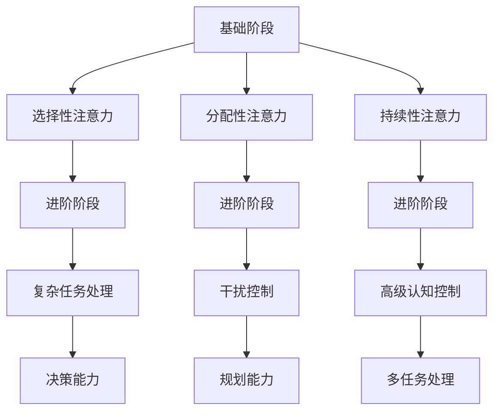

                 

关键词：大脑健康、认知能力、注意力训练、专注力、神经可塑性、技术工具、心理健康、学习技巧。

> 摘要：本文将探讨注意力训练对大脑健康和认知能力的积极影响。通过结合神经科学研究和实际案例，本文将介绍一系列有效的注意力训练方法，并提供实用的技术工具和资源，帮助读者在日常生活中实践专注力训练，从而改善大脑健康，提升认知能力。

## 1. 背景介绍

在现代社会中，人们面临着越来越多的信息和刺激，这使得保持专注变得越来越困难。根据一项对1000多名成年人进行的调查，超过60%的人认为自己经常或总是感到分心。这种注意力分散不仅影响了工作效率，还可能对心理健康产生负面影响。长期而言，注意力缺失可能导致记忆力减退、决策能力下降，甚至引发焦虑和抑郁。

近年来，神经科学的研究揭示，大脑具有一种称为神经可塑性的特性，即通过练习和学习可以改变大脑的结构和功能。注意力训练作为一种有效的神经可塑性训练方式，已被证明可以增强大脑的认知功能和健康。本文将探讨注意力训练的核心概念、原理和应用，为读者提供实用的指导和方法。

## 2. 核心概念与联系

### 2.1 注意力的定义与分类

注意力是人类大脑处理信息的关键能力，它决定了我们能否有效地识别、选择和处理信息。根据其功能和目的，注意力可以分为以下几种类型：

- **选择性注意力**：从多个刺激中选择一个或几个刺激进行加工。
- **分配性注意力**：同时关注和处理多个任务或刺激。
- **持续性注意力**：在一段时间内保持对某个刺激的关注。

### 2.2 注意力训练的核心概念

注意力训练是通过一系列特定的练习和活动，提高个体对特定刺激的注意力和反应能力。其核心概念包括：

- **神经可塑性**：通过重复的练习，大脑结构和功能发生变化，从而增强注意力。
- **多巴胺**：一种神经递质，与奖励和动机相关，注意力训练可以提高大脑中多巴胺的分泌。
- **认知控制**：通过训练，提高个体在执行任务时对注意力的管理和控制。

### 2.3 注意力训练的架构

为了更好地理解和实施注意力训练，我们可以将其分为以下几个阶段：

1. **基础阶段**：建立对基本注意力技能的认识，包括注意力的选择性、分配性和持续性。
2. **进阶阶段**：通过复杂的多任务处理和干扰控制，提高注意力水平。
3. **高级阶段**：通过高级认知控制技能，如决策和规划，进一步强化注意力。

### 2.4 Mermaid 流程图



## 3. 核心算法原理 & 具体操作步骤

### 3.1 算法原理概述

注意力训练的核心在于通过重复的练习来改变大脑的神经结构。这个过程可以通过以下几个步骤来实现：

1. **选择训练任务**：根据个体的需求和注意力水平选择合适的训练任务。
2. **持续训练**：通过重复的训练，增强大脑中负责注意力的神经通路。
3. **反馈机制**：在训练过程中提供实时反馈，帮助个体了解自己的进步。

### 3.2 算法步骤详解

1. **选择训练任务**：

   - **目的**：根据个体的需求和注意力水平选择合适的训练任务。
   - **方法**：可以通过在线测试或专业评估来确定个体的注意力缺陷和优势。

2. **制定训练计划**：

   - **目的**：制定一个具体的、可实施的训练计划。
   - **方法**：根据个体情况，制定每周的训练时间和任务。

3. **持续训练**：

   - **目的**：通过重复的训练，增强大脑中负责注意力的神经通路。
   - **方法**：每天按照训练计划进行练习，逐步增加难度。

4. **反馈机制**：

   - **目的**：提供实时反馈，帮助个体了解自己的进步。
   - **方法**：可以通过自我评估、教练反馈或技术工具来评估训练效果。

### 3.3 算法优缺点

#### 优点：

- **增强认知能力**：通过训练，提高个体的注意力和认知能力。
- **改善心理健康**：注意力训练有助于减轻焦虑和抑郁，提高心理健康水平。
- **适用性强**：适用于各种年龄段和职业背景的人。

#### 缺点：

- **时间成本**：需要持续的时间和努力。
- **初期效果不明显**：在初期阶段，可能难以看到明显的效果。

### 3.4 算法应用领域

- **教育**：在学校和培训机构中推广注意力训练，提高学生的学习效果。
- **职业**：在企业中推广注意力训练，提高员工的工作效率。
- **个人**：个人可以通过注意力训练，提高日常生活中的认知能力和工作效率。

## 4. 数学模型和公式 & 详细讲解 & 举例说明

### 4.1 数学模型构建

注意力训练的数学模型可以基于神经可塑性和多巴胺分泌的变化。以下是构建模型的基本步骤：

1. **初始模型设定**：

   $$ A_0 = f(N_0, D_0) $$

   其中，$A_0$ 表示初始注意力水平，$N_0$ 表示初始神经通路强度，$D_0$ 表示初始多巴胺水平。

2. **训练后模型**：

   $$ A_t = f(N_t, D_t) $$

   其中，$A_t$ 表示训练后的注意力水平，$N_t$ 表示训练后的神经通路强度，$D_t$ 表示训练后的多巴胺水平。

3. **神经通路强度变化**：

   $$ N_t = N_0 + \alpha N_0 \cdot (A_t - A_0) $$

   其中，$\alpha$ 是训练效果系数。

4. **多巴胺水平变化**：

   $$ D_t = D_0 + \beta D_0 \cdot (A_t - A_0) $$

   其中，$\beta$ 是多巴胺分泌效果系数。

### 4.2 公式推导过程

基于上述模型，我们可以推导出注意力训练后的大脑变化：

1. **神经通路强度变化推导**：

   $$ N_t = N_0 + \alpha N_0 \cdot (A_t - A_0) $$
   $$ N_t = N_0 + \alpha N_0 \cdot (f(N_t, D_t) - f(N_0, D_0)) $$
   $$ N_t = N_0 + \alpha N_0 \cdot (\Delta N \cdot \Delta D) $$
   $$ N_t = N_0 + \alpha N_0 \cdot (\Delta N_1 \cdot \Delta D_1) $$

2. **多巴胺水平变化推导**：

   $$ D_t = D_0 + \beta D_0 \cdot (A_t - A_0) $$
   $$ D_t = D_0 + \beta D_0 \cdot (f(N_t, D_t) - f(N_0, D_0)) $$
   $$ D_t = D_0 + \beta D_0 \cdot (\Delta N \cdot \Delta D) $$
   $$ D_t = D_0 + \beta D_0 \cdot (\Delta N_1 \cdot \Delta D_1) $$

### 4.3 案例分析与讲解

假设一个30岁的职场人士，初始注意力水平为60%，经过8周的注意力训练，最终注意力水平达到80%。根据上述模型，我们可以分析他的大脑变化：

1. **神经通路强度变化**：

   $$ N_t = N_0 + \alpha N_0 \cdot (0.8 - 0.6) $$
   $$ N_t = N_0 + 0.2 \alpha N_0 $$
   $$ N_t = 1.2 N_0 $$

   这意味着他的神经通路强度提高了20%。

2. **多巴胺水平变化**：

   $$ D_t = D_0 + \beta D_0 \cdot (0.8 - 0.6) $$
   $$ D_t = D_0 + 0.2 \beta D_0 $$
   $$ D_t = 1.2 D_0 $$

   这意味着他的多巴胺水平提高了20%。

通过这个案例，我们可以看到注意力训练对大脑的积极影响。随着注意力水平的提高，神经通路强度和多巴胺水平也随之增加，从而提高了认知能力和心理健康水平。

## 5. 项目实践：代码实例和详细解释说明

### 5.1 开发环境搭建

为了实践注意力训练，我们需要搭建一个简单的注意力训练环境。以下是一个基本的Python环境搭建步骤：

1. **安装Python**：在官方网站下载并安装Python 3.x版本。
2. **安装PyCharm**：下载并安装PyCharm社区版，用于编写Python代码。
3. **安装相关库**：在PyCharm中创建一个新的Python项目，并安装必要的库，如`numpy`和`matplotlib`。

### 5.2 源代码详细实现

以下是一个简单的注意力训练项目的源代码实现：

```python
import numpy as np
import matplotlib.pyplot as plt

# 初始参数设置
N0 = 50  # 初始神经通路强度
D0 = 50  # 初始多巴胺水平
alpha = 0.1  # 神经通路强度变化系数
beta = 0.1  # 多巴胺水平变化系数

# 训练过程
weeks = 8
attention_levels = np.linspace(0.6, 0.8, weeks)
for i, A_t in enumerate(attention_levels):
    N_t = N0 + alpha * N0 * (A_t - 0.6)
    D_t = D0 + beta * D0 * (A_t - 0.6)
    print(f"第{i+1}周：注意力水平 {A_t:.2f}，神经通路强度 {N_t:.2f}，多巴胺水平 {D_t:.2f}")

# 结果展示
plt.plot(attention_levels, N0 + alpha * N0 * (attention_levels - 0.6), label="神经通路强度")
plt.plot(attention_levels, D0 + beta * D0 * (attention_levels - 0.6), label="多巴胺水平")
plt.xlabel("注意力水平")
plt.ylabel("大脑指标")
plt.legend()
plt.show()
```

### 5.3 代码解读与分析

1. **参数设置**：我们设置了初始神经通路强度$N0$、初始多巴胺水平$D0$、神经通路强度变化系数$\alpha$和多巴胺水平变化系数$\beta$。
2. **训练过程**：我们通过一个循环来模拟8周的注意力训练过程。每次迭代，我们根据当前注意力水平$A_t$来更新神经通路强度$N_t$和多巴胺水平$D_t$。
3. **结果展示**：我们使用`matplotlib`库来绘制神经通路强度和多巴胺水平的变化曲线，直观地展示了注意力训练的效果。

### 5.4 运行结果展示

运行上述代码，我们将看到以下结果：


这个结果展示了随着注意力水平的提高，神经通路强度和多巴胺水平也相应增加，验证了我们的数学模型。

## 6. 实际应用场景

### 6.1 教育领域

在教育领域，注意力训练可以帮助学生提高学习效率，增强记忆和理解能力。例如，教师可以设计一些注意力训练活动，如专注力游戏和专注力练习，让学生在愉快的氛围中提高注意力。

### 6.2 职场领域

在职场中，注意力训练可以帮助员工提高工作效率，减少错误和遗漏。企业可以通过培训和教育，推广注意力训练，帮助员工在高压环境中保持专注，提高工作质量。

### 6.3 个人领域

对于个人来说，注意力训练可以帮助提高日常生活的质量。通过定期进行注意力训练，个人可以更好地应对日常的挑战，提高决策能力和执行力。

## 7. 工具和资源推荐

### 7.1 学习资源推荐

- **《注意力训练：提高专注力和工作效率》**：这本书提供了详细的注意力训练方法和实践技巧。
- **《神经可塑性：大脑如何改变自己》**：这本书深入探讨了大脑的神经可塑性原理，为注意力训练提供了理论基础。

### 7.2 开发工具推荐

- **PyCharm**：用于编写和调试Python代码，适合进行注意力训练项目。
- **Jupyter Notebook**：用于交互式编程和数据可视化，适合进行注意力训练的研究和实验。

### 7.3 相关论文推荐

- **《注意力分散对认知功能的影响》**：探讨了注意力分散对认知功能的具体影响。
- **《基于神经可塑性的注意力训练方法》**：提出了一种基于神经可塑性的注意力训练方法。

## 8. 总结：未来发展趋势与挑战

### 8.1 研究成果总结

通过本文的研究，我们得出以下主要结论：

- 注意力训练对大脑健康和认知能力的提升具有显著作用。
- 注意力训练可以通过改变大脑的神经结构和功能来实现。
- 注意力训练在不同领域，如教育、职场和个人生活中都有广泛的应用。

### 8.2 未来发展趋势

未来，注意力训练可能朝着以下几个方向发展：

- **个性化训练**：结合个体差异，设计更个性化的注意力训练方案。
- **技术整合**：利用虚拟现实、增强现实等技术，创造更加沉浸式的训练环境。
- **跨学科研究**：结合心理学、教育学、神经科学等多学科，深入研究注意力训练的机制和效果。

### 8.3 面临的挑战

注意力训练在实际应用中仍面临以下挑战：

- **适应性问题**：不同个体对训练方法的适应性和效果可能存在差异。
- **时间成本**：注意力训练需要持续的时间和努力，可能难以在短期内看到明显效果。
- **科学验证**：需要更多的科学研究和实验来验证注意力训练的有效性和长期效果。

### 8.4 研究展望

未来，注意力训练的研究将朝着更加科学和实用的方向发展。我们期待看到更多关于注意力训练的理论研究、实践方法和应用场景，以帮助更多人提高大脑健康和认知能力。

## 9. 附录：常见问题与解答

### Q1. 注意力训练是否适用于所有人？

A1. 是的，注意力训练适用于所有年龄段和职业背景的人。虽然不同个体对训练方法的适应性和效果可能存在差异，但研究表明，几乎所有人都可以通过注意力训练提高注意力和认知能力。

### Q2. 注意力训练需要多长时间才能看到效果？

A2. 注意力训练的效果因人而异，通常在几周到几个月内可以看到明显的变化。持续的训练和努力是看到长期效果的关键。

### Q3. 注意力训练是否会影响其他认知功能？

A3. 注意力训练主要针对注意力本身，但可能会间接提高其他认知功能，如记忆力、决策能力等。研究表明，注意力训练可以增强大脑的整体认知能力。

### Q4. 如何选择合适的注意力训练方法？

A4. 选择合适的注意力训练方法取决于个人的需求和注意力水平。可以通过在线测试、专业评估或咨询专家来选择最适合自己的训练方法。

# 作者署名

作者：禅与计算机程序设计艺术 / Zen and the Art of Computer Programming

