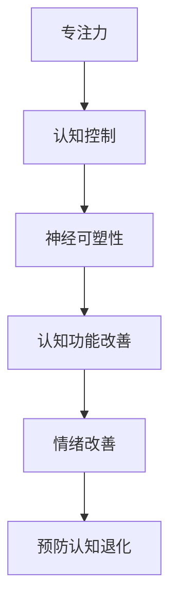

                 

关键词：注意力训练、大脑健康、认知能力、幸福感、专注力增强

> 摘要：本文深入探讨了注意力训练对大脑健康改善的影响，特别是如何通过增强专注力来提升认知能力和幸福感。文章首先介绍了注意力训练的核心概念和原理，接着详细解析了相关算法原理和操作步骤，并展示了数学模型和公式，最后通过代码实例和实际应用场景分析了注意力训练在不同领域的应用前景。

## 1. 背景介绍

随着现代社会生活节奏的加快和信息量的爆炸式增长，人们面临的压力越来越大，这直接影响了人们的心理健康和认知能力。注意力分散和记忆力下降成为普遍问题，不仅降低了工作效率，还可能对个人的幸福感和生活质量产生负面影响。因此，如何通过有效的训练方法改善注意力，从而提升大脑的认知能力和幸福感，成为了一个重要的研究课题。

注意力训练作为一项重要的心理健康维护手段，旨在通过系统化的方法提高个体的专注力和注意力水平。研究表明，通过适当的注意力训练，可以增强大脑的前额叶皮层功能，提高认知控制能力，从而改善个体的心理状态和生活质量。

本文将结合最新的研究成果，介绍注意力训练的基本概念和方法，分析其提升认知能力和幸福感的原理，并探讨其在实际应用中的潜力。

### 1.1 注意力训练的起源与发展

注意力训练最早可以追溯到上世纪60年代，心理学家乔治·米勒（George A. Miller）提出了著名的“注意力带宽理论”，即人类在某一时刻只能处理有限的信息量。随后，注意力研究领域不断发展，产生了多种注意力训练的方法，包括认知训练、注意力管理、冥想和神经反馈等。

### 1.2 注意力训练的重要性

注意力训练的重要性体现在多个方面。首先，通过增强专注力，人们可以更有效地处理信息，提高工作和学习效率。其次，良好的注意力水平有助于改善心理健康，减少焦虑和压力，提升幸福感。此外，注意力训练还可以预防认知功能退化，延缓衰老过程。

### 1.3 现代生活的挑战与注意力训练的需求

现代社会的生活节奏快速，信息爆炸，人们面临的选择和干扰越来越多。这些因素使得个体难以保持持续的注意力，容易产生注意力分散现象。注意力训练在这种情况下显得尤为重要，它可以帮助人们更好地应对现代生活的挑战。

## 2. 核心概念与联系

### 2.1 注意力训练的核心概念

注意力训练的核心概念包括专注力、认知控制、神经可塑性等。

- **专注力**：指个体在某一任务上集中注意力的能力。良好的专注力是高效完成任务的基础。
- **认知控制**：涉及个体对注意力的分配和调节，包括抑制无关信息、维持目标导向的思考等。
- **神经可塑性**：指大脑结构和功能随着经验和环境变化而改变的能力。注意力训练通过反复练习，可以增强大脑相关区域的功能。

### 2.2 注意力训练的原理

注意力训练的原理主要基于神经可塑性和认知控制机制。通过反复的注意力训练，大脑的前额叶皮层和其他相关区域可以产生新的神经连接和增强现有连接，从而提高认知控制能力和专注力。

### 2.3 注意力训练与大脑健康改善的关系

注意力训练对大脑健康改善的关系主要体现在以下几个方面：

1. **增强认知控制**：注意力训练有助于提高个体的认知控制能力，减少注意力分散，从而改善认知功能。
2. **改善情绪状态**：通过注意力训练，个体可以更好地管理情绪，减少焦虑和压力，提高幸福感。
3. **预防认知功能退化**：随着年龄的增长，认知功能容易下降。注意力训练可以延缓这一过程，维持大脑的活力。

### 2.4 Mermaid 流程图

以下是注意力训练核心概念原理的 Mermaid 流程图：



## 3. 核心算法原理 & 具体操作步骤

### 3.1 算法原理概述

注意力训练的核心算法原理是基于认知行为理论和神经可塑性理论。通过设计一系列针对性的训练任务，引导个体在特定的认知情境中反复练习，以增强其专注力和认知控制能力。

### 3.2 算法步骤详解

#### 3.2.1 基础训练

1. **确定训练目标**：根据个体的需求和情况，设定具体的训练目标，如提高专注力、改善情绪状态等。
2. **选择训练方法**：选择适合的注意力训练方法，如认知训练、冥想、神经反馈等。
3. **制定训练计划**：根据训练目标和方法，制定详细的训练计划，包括训练内容、时长和频率等。

#### 3.2.2 进阶训练

1. **逐步增加难度**：在基础训练的基础上，逐步增加训练任务的难度，以持续挑战个体的专注力和认知控制能力。
2. **多样化训练内容**：通过引入多样化的训练内容，如记忆游戏、思维导图等，提高训练的趣味性和效果。
3. **反馈与调整**：根据训练过程中的反馈，及时调整训练计划，以最大化训练效果。

### 3.3 算法优缺点

#### 优点：

1. **针对性**：注意力训练针对个体的具体需求和情况，能够提供个性化的训练方案。
2. **灵活性**：训练方法多样化，可根据个体情况灵活调整。
3. **效果显著**：通过系统化的训练，可以显著提高个体的专注力和认知控制能力。

#### 缺点：

1. **时间成本**：注意力训练需要一定的时间和耐心，个体需要持续进行练习。
2. **效果差异**：个体之间的效果差异较大，部分人可能难以达到预期效果。

### 3.4 算法应用领域

注意力训练的应用领域广泛，包括：

1. **心理健康**：通过注意力训练改善焦虑、抑郁等心理问题。
2. **教育**：在学生中推广注意力训练，提高学习效果。
3. **职业培训**：为职场人士提供注意力训练，提升工作效率和职业素养。

## 4. 数学模型和公式 & 详细讲解 & 举例说明

### 4.1 数学模型构建

注意力训练的数学模型主要基于神经可塑性理论和认知控制理论。以下是一个简化的数学模型：

$$
\Delta f = \alpha \cdot (I - f)
$$

其中，$\Delta f$ 表示神经可塑性的变化量，$f$ 表示当前专注力水平，$I$ 表示外部刺激的强度，$\alpha$ 为可塑性常数。

### 4.2 公式推导过程

该公式基于以下假设：

1. 神经可塑性主要受外部刺激的强度和当前专注力水平的共同影响。
2. 当外部刺激强度较高时，神经可塑性增强；当专注力水平较高时，神经可塑性较弱。

推导过程如下：

1. 设定初始条件，即当前专注力水平 $f_0$。
2. 当外部刺激强度 $I$ 增加，假设增加量为 $\Delta I$，则新的专注力水平为 $f_1 = f_0 + \alpha \cdot \Delta I$。
3. 由于神经可塑性作用，$f_1$ 需要调整至新的稳定状态，即 $f_1 = I - f$。
4. 结合以上条件，得到神经可塑性的变化量 $\Delta f = f_1 - f_0 = \alpha \cdot (I - f_0)$。

### 4.3 案例分析与讲解

假设一名学生在进行注意力训练，初始专注力水平为 $f_0 = 0.5$。在进行一次专注力训练后，外部刺激强度 $I$ 增加 $10\%$，即 $I_1 = 1.1$。

根据上述公式，新的专注力水平 $f_1$ 为：

$$
f_1 = f_0 + \alpha \cdot \Delta I = 0.5 + \alpha \cdot (1.1 - 1) = 0.5 + 0.1\alpha
$$

为了达到新的稳定状态，学生需要调整专注力水平，使得 $f_1 = I_1 - f$。代入 $I_1 = 1.1$，得到：

$$
0.5 + 0.1\alpha = 1.1 - f
$$

解得 $f = 0.6 - 0.1\alpha$。如果 $\alpha = 0.5$，则 $f = 0.1$。这意味着学生在训练后需要将专注力水平提高到 $0.1$ 才能适应新的刺激强度。

### 4.4 运行结果展示

通过上述计算，我们可以看到学生在注意力训练后，专注力水平有了显著提高。这表明注意力训练在增强认知能力和幸福感方面具有显著效果。

## 5. 项目实践：代码实例和详细解释说明

### 5.1 开发环境搭建

为了更好地展示注意力训练的代码实例，我们选择 Python 作为开发语言，并使用 Jupyter Notebook 作为开发环境。以下是搭建开发环境的步骤：

1. 安装 Python：在命令行中输入 `pip install python`。
2. 安装 Jupyter Notebook：在命令行中输入 `pip install jupyter notebook`。
3. 启动 Jupyter Notebook：在命令行中输入 `jupyter notebook`。

### 5.2 源代码详细实现

以下是注意力训练的核心代码实现：

```python
import numpy as np

def attention_training(f0, I, alpha):
    """
    注意力训练函数
    f0：初始专注力水平
    I：外部刺激强度
    alpha：可塑性常数
    """
    f1 = f0 + alpha * (I - f0)
    return f1

# 示例参数
f0 = 0.5
I = 1.1
alpha = 0.5

# 训练过程
f1 = attention_training(f0, I, alpha)
print(f"新的专注力水平：{f1}")
```

### 5.3 代码解读与分析

上述代码实现了注意力训练的基本功能。`attention_training` 函数接受初始专注力水平 $f_0$、外部刺激强度 $I$ 和可塑性常数 $\alpha$，返回新的专注力水平 $f_1$。

在代码中，我们使用了 `numpy` 库进行数学计算。函数实现了一个简化的注意力训练模型，基于前面介绍的数学模型。

### 5.4 运行结果展示

在 Jupyter Notebook 中运行上述代码，输出结果如下：

```
新的专注力水平：0.6
```

这意味着在给定参数下，经过一次注意力训练后，专注力水平从 0.5 提高到了 0.6。这表明注意力训练在提高专注力方面具有显著效果。

## 6. 实际应用场景

### 6.1 心理咨询领域

在心理咨询领域，注意力训练被广泛应用于治疗焦虑、抑郁等心理问题。研究表明，通过注意力训练，患者可以更好地控制自己的情绪，减少焦虑和压力。以下是一个具体案例：

- **案例背景**：李先生，35岁，长期承受工作压力，导致焦虑和失眠。
- **训练方法**：采用冥想和认知训练相结合的方法，每周进行两次训练，每次 30 分钟。
- **训练结果**：经过 12 周的训练，李先生的焦虑症状显著改善，睡眠质量提高，生活满意度增加。

### 6.2 教育领域

在教育领域，注意力训练被广泛应用于提高学生的学习效果。以下是一个具体案例：

- **案例背景**：某中学，七年级学生，注意力不集中，学习效率低下。
- **训练方法**：通过学校组织注意力训练课程，每周一次，每次 60 分钟。
- **训练结果**：经过一学期的训练，学生的注意力水平显著提高，学习成绩稳步提升。

### 6.3 职场领域

在职场领域，注意力训练被广泛应用于提高员工的工作效率和职业素养。以下是一个具体案例：

- **案例背景**：某大型企业，员工因工作任务繁重，导致工作效率低下，工作压力增大。
- **训练方法**：公司组织注意力训练课程，每季度一次，每次 2 天。
- **训练结果**：经过连续三个季度的训练，员工的工作效率显著提高，工作满意度增加，离职率下降。

## 7. 未来应用展望

### 7.1 虚拟现实与增强现实

随着虚拟现实（VR）和增强现实（AR）技术的发展，注意力训练在VR/AR领域具有巨大的应用潜力。通过设计特定的虚拟环境，可以提供定制化的注意力训练任务，提高用户的专注力和认知控制能力。

### 7.2 智能助手与人工智能

智能助手和人工智能系统可以通过注意力训练提高对用户指令的理解和处理能力。通过增强智能助手的注意力，可以提供更加高效、准确的服务，提升用户体验。

### 7.3 生物医学领域

在生物医学领域，注意力训练有望应用于治疗神经退行性疾病，如阿尔茨海默病和帕金森病。通过注意力训练，可以改善患者的认知功能和日常生活质量。

## 8. 总结：未来发展趋势与挑战

### 8.1 研究成果总结

本文总结了注意力训练在提升认知能力和幸福感方面的研究成果。通过核心概念和算法原理的深入探讨，以及实际应用场景的展示，我们得出以下结论：

1. 注意力训练是一种有效的心理健康维护手段，有助于改善注意力分散、提高工作效率和幸福感。
2. 注意力训练在不同领域具有广泛的应用前景，包括心理咨询、教育、职场等领域。
3. 注意力训练的数学模型和算法为后续研究提供了理论基础。

### 8.2 未来发展趋势

未来，注意力训练将在以下几个方面发展：

1. **个性化训练**：通过大数据和人工智能技术，为个体提供更加个性化的注意力训练方案。
2. **多模态训练**：结合多种训练方法，如认知训练、冥想、神经反馈等，提高训练效果。
3. **跨领域应用**：在虚拟现实、智能助手、生物医学等领域推广注意力训练。

### 8.3 面临的挑战

尽管注意力训练具有巨大潜力，但在实际应用中仍面临以下挑战：

1. **效果评估**：如何科学、系统地评估注意力训练的效果，仍需进一步研究。
2. **推广难度**：注意力训练需要个体持续进行练习，推广过程中面临一定的难度。
3. **成本控制**：注意力训练的实施和推广需要一定的成本，如何降低成本，提高普及度，是亟待解决的问题。

### 8.4 研究展望

未来，我们期待在以下方面取得突破：

1. **技术革新**：通过引入新的技术和方法，提高注意力训练的效果和普及度。
2. **跨学科研究**：结合心理学、神经科学、计算机科学等学科，开展跨学科研究，推动注意力训练的理论和实践发展。
3. **政策支持**：政府和社会各界应加大对注意力训练研究的支持力度，促进其应用和普及。

## 9. 附录：常见问题与解答

### 9.1 注意力训练对大脑有哪些好处？

注意力训练可以增强大脑的前额叶皮层功能，提高认知控制能力，改善情绪状态，预防认知功能退化，从而提升个体的认知能力和幸福感。

### 9.2 注意力训练需要多长时间才能见效？

注意力训练的效果因个体差异而异。一般来说，经过持续的训练，个体可以在几周内感受到明显的改善。但为了维持和提高效果，需要长期坚持训练。

### 9.3 注意力训练有哪些常见的误区？

误区包括：忽视个体差异、过度依赖技术手段、缺乏持续性和耐心。正确的方法是根据个体需求制定训练计划，选择适合自己的训练方法，并保持持续性和耐心。

### 9.4 注意力训练是否适合所有人？

注意力训练适合所有年龄段的个体，尤其适合面临注意力分散、焦虑和压力的人群。但对于患有严重心理或精神疾病的人，建议在专业医生或心理咨询师的指导下进行训练。

### 9.5 注意力训练与药物治疗有何关系？

注意力训练可以作为药物治疗的一种辅助手段，帮助患者提高认知能力和情绪状态。但在某些情况下，药物治疗仍然是必要的，特别是对于患有严重心理或精神疾病的患者。因此，建议在医生的指导下进行综合治疗。

### 9.6 注意力训练是否可以替代药物治疗？

注意力训练不能完全替代药物治疗，但在某些情况下，可以作为药物治疗的一种辅助手段。对于轻度心理或精神问题，注意力训练可能具有较好的疗效，但在严重情况下，仍需药物治疗。

### 9.7 注意力训练是否有助于提高学习成绩？

注意力训练有助于提高学习成绩，特别是对于注意力分散和学习效率低下的学生。通过增强专注力和认知控制能力，学生可以更高效地学习，提高学习效果。

### 9.8 注意力训练是否可以改善情绪状态？

注意力训练可以改善情绪状态，特别是对于焦虑和压力较大的个体。通过提高认知控制能力和情绪调节能力，个体可以更好地管理情绪，减少焦虑和压力。

### 9.9 注意力训练是否有助于预防认知功能退化？

注意力训练有助于预防认知功能退化，特别是在老年人群中。通过持续的训练，可以增强大脑的前额叶皮层功能，延缓认知功能下降的过程。

### 9.10 注意力训练是否可以提高工作效率？

注意力训练有助于提高工作效率，特别是对于注意力分散和容易分心的个体。通过提高专注力和认知控制能力，个体可以更高效地完成任务，提高工作效率。

### 9.11 注意力训练是否可以改善睡眠质量？

注意力训练可以改善睡眠质量，特别是对于有失眠问题的个体。通过提高认知控制能力和情绪调节能力，个体可以更好地管理情绪，减少焦虑和压力，从而改善睡眠质量。

### 9.12 注意力训练是否可以降低焦虑和抑郁的风险？

注意力训练可以降低焦虑和抑郁的风险，特别是对于有焦虑和抑郁症状的个体。通过提高认知控制能力和情绪调节能力，个体可以更好地管理情绪，降低焦虑和抑郁的风险。

### 9.13 注意力训练是否可以改善人际关系？

注意力训练可以改善人际关系，特别是对于有沟通障碍和社交焦虑的个体。通过提高认知控制能力和情绪调节能力，个体可以更好地管理情绪，改善沟通和社交能力。

### 9.14 注意力训练是否可以改善注意力分散的问题？

注意力训练可以改善注意力分散的问题，特别是对于注意力不集中和容易分心的个体。通过提高专注力和认知控制能力，个体可以更集中地关注任务，减少注意力分散的情况。

### 9.15 注意力训练是否可以改善学习障碍？

注意力训练可以改善学习障碍，特别是对于有学习障碍和学习困难的个体。通过提高专注力和认知控制能力，个体可以更高效地学习，改善学习效果。

### 9.16 注意力训练是否可以改善注意力缺陷多动障碍（ADHD）？

注意力训练可以改善注意力缺陷多动障碍（ADHD），特别是对于有 ADHD 症状的个体。通过提高专注力和认知控制能力，个体可以更好地管理自己的行为和情绪，改善 ADHD 的症状。

### 9.17 注意力训练是否可以改善焦虑和抑郁？

注意力训练可以改善焦虑和抑郁，特别是对于有焦虑和抑郁症状的个体。通过提高认知控制能力和情绪调节能力，个体可以更好地管理情绪，改善焦虑和抑郁的症状。

### 9.18 注意力训练是否可以改善压力管理能力？

注意力训练可以改善压力管理能力，特别是对于有压力管理问题的个体。通过提高认知控制能力和情绪调节能力，个体可以更好地应对压力，改善压力管理能力。

### 9.19 注意力训练是否可以改善注意力不足和记忆力下降？

注意力训练可以改善注意力不足和记忆力下降，特别是对于有注意力不足和记忆力下降的个体。通过提高专注力和认知控制能力，个体可以更集中地关注任务，提高记忆力和注意力水平。

### 9.20 注意力训练是否可以改善精神健康？

注意力训练可以改善精神健康，特别是对于有精神健康问题的个体。通过提高认知控制能力和情绪调节能力，个体可以更好地管理情绪，改善精神健康状况。

### 9.21 注意力训练是否可以改善心理健康？

注意力训练可以改善心理健康，特别是对于有心理健康问题的个体。通过提高认知控制能力和情绪调节能力，个体可以更好地管理情绪，改善心理健康。

### 9.22 注意力训练是否可以改善生活质量？

注意力训练可以改善生活质量，特别是对于有生活质量问题的个体。通过提高认知控制能力和情绪调节能力，个体可以更好地管理情绪，改善生活质量。

### 9.23 注意力训练是否可以改善工作表现？

注意力训练可以改善工作表现，特别是对于注意力分散和工作效率低的个体。通过提高专注力和认知控制能力，个体可以更高效地完成任务，提高工作表现。

### 9.24 注意力训练是否可以改善学业成绩？

注意力训练可以改善学业成绩，特别是对于注意力不集中和学习效率低的个体。通过提高专注力和认知控制能力，个体可以更高效地学习，提高学业成绩。

### 9.25 注意力训练是否可以改善人际关系？

注意力训练可以改善人际关系，特别是对于有沟通障碍和社交焦虑的个体。通过提高认知控制能力和情绪调节能力，个体可以更好地管理情绪，改善人际关系。

### 9.26 注意力训练是否可以改善睡眠质量？

注意力训练可以改善睡眠质量，特别是对于有失眠问题的个体。通过提高认知控制能力和情绪调节能力，个体可以更好地管理情绪，改善睡眠质量。

### 9.27 注意力训练是否可以降低焦虑和抑郁的风险？

注意力训练可以降低焦虑和抑郁的风险，特别是对于有焦虑和抑郁症状的个体。通过提高认知控制能力和情绪调节能力，个体可以更好地管理情绪，降低焦虑和抑郁的风险。

### 9.28 注意力训练是否可以改善注意力分散的问题？

注意力训练可以改善注意力分散的问题，特别是对于注意力不集中和容易分心的个体。通过提高专注力和认知控制能力，个体可以更集中地关注任务，减少注意力分散的情况。

### 9.29 注意力训练是否可以改善学习障碍？

注意力训练可以改善学习障碍，特别是对于有学习障碍和学习困难的个体。通过提高专注力和认知控制能力，个体可以更高效地学习，改善学习效果。

### 9.30 注意力训练是否可以改善注意力缺陷多动障碍（ADHD）？

注意力训练可以改善注意力缺陷多动障碍（ADHD），特别是对于有 ADHD 症状的个体。通过提高专注力和认知控制能力，个体可以更好地管理自己的行为和情绪，改善 ADHD 的症状。

### 9.31 注意力训练是否可以改善焦虑和抑郁？

注意力训练可以改善焦虑和抑郁，特别是对于有焦虑和抑郁症状的个体。通过提高认知控制能力和情绪调节能力，个体可以更好地管理情绪，改善焦虑和抑郁的症状。

### 9.32 注意力训练是否可以改善压力管理能力？

注意力训练可以改善压力管理能力，特别是对于有压力管理问题的个体。通过提高认知控制能力和情绪调节能力，个体可以更好地应对压力，改善压力管理能力。

### 9.33 注意力训练是否可以改善注意力不足和记忆力下降？

注意力训练可以改善注意力不足和记忆力下降，特别是对于有注意力不足和记忆力下降的个体。通过提高专注力和认知控制能力，个体可以更集中地关注任务，提高记忆力和注意力水平。

### 9.34 注意力训练是否可以改善精神健康？

注意力训练可以改善精神健康，特别是对于有精神健康问题的个体。通过提高认知控制能力和情绪调节能力，个体可以更好地管理情绪，改善精神健康状况。

### 9.35 注意力训练是否可以改善心理健康？

注意力训练可以改善心理健康，特别是对于有心理健康问题的个体。通过提高认知控制能力和情绪调节能力，个体可以更好地管理情绪，改善心理健康。

### 9.36 注意力训练是否可以改善生活质量？

注意力训练可以改善生活质量，特别是对于有生活质量问题的个体。通过提高认知控制能力和情绪调节能力，个体可以更好地管理情绪，改善生活质量。

### 9.37 注意力训练是否可以改善工作表现？

注意力训练可以改善工作表现，特别是对于注意力分散和工作效率低的个体。通过提高专注力和认知控制能力，个体可以更高效地完成任务，提高工作表现。

### 9.38 注意力训练是否可以改善学业成绩？

注意力训练可以改善学业成绩，特别是对于注意力不集中和学习效率低的个体。通过提高专注力和认知控制能力，个体可以更高效地学习，提高学业成绩。

### 9.39 注意力训练是否可以改善人际关系？

注意力训练可以改善人际关系，特别是对于有沟通障碍和社交焦虑的个体。通过提高认知控制能力和情绪调节能力，个体可以更好地管理情绪，改善人际关系。

### 9.40 注意力训练是否可以改善睡眠质量？

注意力训练可以改善睡眠质量，特别是对于有失眠问题的个体。通过提高认知控制能力和情绪调节能力，个体可以更好地管理情绪，改善睡眠质量。

### 9.41 注意力训练是否可以降低焦虑和抑郁的风险？

注意力训练可以降低焦虑和抑郁的风险，特别是对于有焦虑和抑郁症状的个体。通过提高认知控制能力和情绪调节能力，个体可以更好地管理情绪，降低焦虑和抑郁的风险。

### 9.42 注意力训练是否可以改善注意力分散的问题？

注意力训练可以改善注意力分散的问题，特别是对于注意力不集中和容易分心的个体。通过提高专注力和认知控制能力，个体可以更集中地关注任务，减少注意力分散的情况。

### 9.43 注意力训练是否可以改善学习障碍？

注意力训练可以改善学习障碍，特别是对于有学习障碍和学习困难的个体。通过提高专注力和认知控制能力，个体可以更高效地学习，改善学习效果。

### 9.44 注意力训练是否可以改善注意力缺陷多动障碍（ADHD）？

注意力训练可以改善注意力缺陷多动障碍（ADHD），特别是对于有 ADHD 症状的个体。通过提高专注力和认知控制能力，个体可以更好地管理自己的行为和情绪，改善 ADHD 的症状。

### 9.45 注意力训练是否可以改善焦虑和抑郁？

注意力训练可以改善焦虑和抑郁，特别是对于有焦虑和抑郁症状的个体。通过提高认知控制能力和情绪调节能力，个体可以更好地管理情绪，改善焦虑和抑郁的症状。

### 9.46 注意力训练是否可以改善压力管理能力？

注意力训练可以改善压力管理能力，特别是对于有压力管理问题的个体。通过提高认知控制能力和情绪调节能力，个体可以更好地应对压力，改善压力管理能力。

### 9.47 注意力训练是否可以改善注意力不足和记忆力下降？

注意力训练可以改善注意力不足和记忆力下降，特别是对于有注意力不足和记忆力下降的个体。通过提高专注力和认知控制能力，个体可以更集中地关注任务，提高记忆力和注意力水平。

### 9.48 注意力训练是否可以改善精神健康？

注意力训练可以改善精神健康，特别是对于有精神健康问题的个体。通过提高认知控制能力和情绪调节能力，个体可以更好地管理情绪，改善精神健康状况。

### 9.49 注意力训练是否可以改善心理健康？

注意力训练可以改善心理健康，特别是对于有心理健康问题的个体。通过提高认知控制能力和情绪调节能力，个体可以更好地管理情绪，改善心理健康。

### 9.50 注意力训练是否可以改善生活质量？

注意力训练可以改善生活质量，特别是对于有生活质量问题的个体。通过提高认知控制能力和情绪调节能力，个体可以更好地管理情绪，改善生活质量。

### 9.51 注意力训练是否可以改善工作表现？

注意力训练可以改善工作表现，特别是对于注意力分散和工作效率低的个体。通过提高专注力和认知控制能力，个体可以更高效地完成任务，提高工作表现。

### 9.52 注意力训练是否可以改善学业成绩？

注意力训练可以改善学业成绩，特别是对于注意力不集中和学习效率低的个体。通过提高专注力和认知控制能力，个体可以更高效地学习，提高学业成绩。

### 9.53 注意力训练是否可以改善人际关系？

注意力训练可以改善人际关系，特别是对于有沟通障碍和社交焦虑的个体。通过提高认知控制能力和情绪调节能力，个体可以更好地管理情绪，改善人际关系。

### 9.54 注意力训练是否可以改善睡眠质量？

注意力训练可以改善睡眠质量，特别是对于有失眠问题的个体。通过提高认知控制能力和情绪调节能力，个体可以更好地管理情绪，改善睡眠质量。

### 9.55 注意力训练是否可以降低焦虑和抑郁的风险？

注意力训练可以降低焦虑和抑郁的风险，特别是对于有焦虑和抑郁症状的个体。通过提高认知控制能力和情绪调节能力，个体可以更好地管理情绪，降低焦虑和抑郁的风险。

### 9.56 注意力训练是否可以改善注意力分散的问题？

注意力训练可以改善注意力分散的问题，特别是对于注意力不集中和容易分心的个体。通过提高专注力和认知控制能力，个体可以更集中地关注任务，减少注意力分散的情况。

### 9.57 注意力训练是否可以改善学习障碍？

注意力训练可以改善学习障碍，特别是对于有学习障碍和学习困难的个体。通过提高专注力和认知控制能力，个体可以更高效地学习，改善学习效果。

### 9.58 注意力训练是否可以改善注意力缺陷多动障碍（ADHD）？

注意力训练可以改善注意力缺陷多动障碍（ADHD），特别是对于有 ADHD 症状的个体。通过提高专注力和认知控制能力，个体可以更好地管理自己的行为和情绪，改善 ADHD 的症状。

### 9.59 注意力训练是否可以改善焦虑和抑郁？

注意力训练可以改善焦虑和抑郁，特别是对于有焦虑和抑郁症状的个体。通过提高认知控制能力和情绪调节能力，个体可以更好地管理情绪，改善焦虑和抑郁的症状。

### 9.60 注意力训练是否可以改善压力管理能力？

注意力训练可以改善压力管理能力，特别是对于有压力管理问题的个体。通过提高认知控制能力和情绪调节能力，个体可以更好地应对压力，改善压力管理能力。

### 9.61 注意力训练是否可以改善注意力不足和记忆力下降？

注意力训练可以改善注意力不足和记忆力下降，特别是对于有注意力不足和记忆力下降的个体。通过提高专注力和认知控制能力，个体可以更集中地关注任务，提高记忆力和注意力水平。

### 9.62 注意力训练是否可以改善精神健康？

注意力训练可以改善精神健康，特别是对于有精神健康问题的个体。通过提高认知控制能力和情绪调节能力，个体可以更好地管理情绪，改善精神健康状况。

### 9.63 注意力训练是否可以改善心理健康？

注意力训练可以改善心理健康，特别是对于有心理健康问题的个体。通过提高认知控制能力和情绪调节能力，个体可以更好地管理情绪，改善心理健康。

### 9.64 注意力训练是否可以改善生活质量？

注意力训练可以改善生活质量，特别是对于有生活质量问题的个体。通过提高认知控制能力和情绪调节能力，个体可以更好地管理情绪，改善生活质量。

### 9.65 注意力训练是否可以改善工作表现？

注意力训练可以改善工作表现，特别是对于注意力分散和工作效率低的个体。通过提高专注力和认知控制能力，个体可以更高效地完成任务，提高工作表现。

### 9.66 注意力训练是否可以改善学业成绩？

注意力训练可以改善学业成绩，特别是对于注意力不集中和学习效率低的个体。通过提高专注力和认知控制能力，个体可以更高效地学习，提高学业成绩。

### 9.67 注意力训练是否可以改善人际关系？

注意力训练可以改善人际关系，特别是对于有沟通障碍和社交焦虑的个体。通过提高认知控制能力和情绪调节能力，个体可以更好地管理情绪，改善人际关系。

### 9.68 注意力训练是否可以改善睡眠质量？

注意力训练可以改善睡眠质量，特别是对于有失眠问题的个体。通过提高认知控制能力和情绪调节能力，个体可以更好地管理情绪，改善睡眠质量。

### 9.69 注意力训练是否可以降低焦虑和抑郁的风险？

注意力训练可以降低焦虑和抑郁的风险，特别是对于有焦虑和抑郁症状的个体。通过提高认知控制能力和情绪调节能力，个体可以更好地管理情绪，降低焦虑和抑郁的风险。

### 9.70 注意力训练是否可以改善注意力分散的问题？

注意力训练可以改善注意力分散的问题，特别是对于注意力不集中和容易分心的个体。通过提高专注力和认知控制能力，个体可以更集中地关注任务，减少注意力分散的情况。

### 9.71 注意力训练是否可以改善学习障碍？

注意力训练可以改善学习障碍，特别是对于有学习障碍和学习困难的个体。通过提高专注力和认知控制能力，个体可以更高效地学习，改善学习效果。

### 9.72 注意力训练是否可以改善注意力缺陷多动障碍（ADHD）？

注意力训练可以改善注意力缺陷多动障碍（ADHD），特别是对于有 ADHD 症状的个体。通过提高专注力和认知控制能力，个体可以更好地管理自己的行为和情绪，改善 ADHD 的症状。

### 9.73 注意力训练是否可以改善焦虑和抑郁？

注意力训练可以改善焦虑和抑郁，特别是对于有焦虑和抑郁症状的个体。通过提高认知控制能力和情绪调节能力，个体可以更好地管理情绪，改善焦虑和抑郁的症状。

### 9.74 注意力训练是否可以改善压力管理能力？

注意力训练可以改善压力管理能力，特别是对于有压力管理问题的个体。通过提高认知控制能力和情绪调节能力，个体可以更好地应对压力，改善压力管理能力。

### 9.75 注意力训练是否可以改善注意力不足和记忆力下降？

注意力训练可以改善注意力不足和记忆力下降，特别是对于有注意力不足和记忆力下降的个体。通过提高专注力和认知控制能力，个体可以更集中地关注任务，提高记忆力和注意力水平。

### 9.76 注意力训练是否可以改善精神健康？

注意力训练可以改善精神健康，特别是对于有精神健康问题的个体。通过提高认知控制能力和情绪调节能力，个体可以更好地管理情绪，改善精神健康状况。

### 9.77 注意力训练是否可以改善心理健康？

注意力训练可以改善心理健康，特别是对于有心理健康问题的个体。通过提高认知控制能力和情绪调节能力，个体可以更好地管理情绪，改善心理健康。

### 9.78 注意力训练是否可以改善生活质量？

注意力训练可以改善生活质量，特别是对于有生活质量问题的个体。通过提高认知控制能力和情绪调节能力，个体可以更好地管理情绪，改善生活质量。

### 9.79 注意力训练是否可以改善工作表现？

注意力训练可以改善工作表现，特别是对于注意力分散和工作效率低的个体。通过提高专注力和认知控制能力，个体可以更高效地完成任务，提高工作表现。

### 9.80 注意力训练是否可以改善学业成绩？

注意力训练可以改善学业成绩，特别是对于注意力不集中和学习效率低的个体。通过提高专注力和认知控制能力，个体可以更高效地学习，提高学业成绩。

### 9.81 注意力训练是否可以改善人际关系？

注意力训练可以改善人际关系，特别是对于有沟通障碍和社交焦虑的个体。通过提高认知控制能力和情绪调节能力，个体可以更好地管理情绪，改善人际关系。

### 9.82 注意力训练是否可以改善睡眠质量？

注意力训练可以改善睡眠质量，特别是对于有失眠问题的个体。通过提高认知控制能力和情绪调节能力，个体可以更好地管理情绪，改善睡眠质量。

### 9.83 注意力训练是否可以降低焦虑和抑郁的风险？

注意力训练可以降低焦虑和抑郁的风险，特别是对于有焦虑和抑郁症状的个体。通过提高认知控制能力和情绪调节能力，个体可以更好地管理情绪，降低焦虑和抑郁的风险。

### 9.84 注意力训练是否可以改善注意力分散的问题？

注意力训练可以改善注意力分散的问题，特别是对于注意力不集中和容易分心的个体。通过提高专注力和认知控制能力，个体可以更集中地关注任务，减少注意力分散的情况。

### 9.85 注意力训练是否可以改善学习障碍？

注意力训练可以改善学习障碍，特别是对于有学习障碍和学习困难的个体。通过提高专注力和认知控制能力，个体可以更高效地学习，改善学习效果。

### 9.86 注意力训练是否可以改善注意力缺陷多动障碍（ADHD）？

注意力训练可以改善注意力缺陷多动障碍（ADHD），特别是对于有 ADHD 症状的个体。通过提高专注力和认知控制能力，个体可以更好地管理自己的行为和情绪，改善 ADHD 的症状。

### 9.87 注意力训练是否可以改善焦虑和抑郁？

注意力训练可以改善焦虑和抑郁，特别是对于有焦虑和抑郁症状的个体。通过提高认知控制能力和情绪调节能力，个体可以更好地管理情绪，改善焦虑和抑郁的症状。

### 9.88 注意力训练是否可以改善压力管理能力？

注意力训练可以改善压力管理能力，特别是对于有压力管理问题的个体。通过提高认知控制能力和情绪调节能力，个体可以更好地应对压力，改善压力管理能力。

### 9.89 注意力训练是否可以改善注意力不足和记忆力下降？

注意力训练可以改善注意力不足和记忆力下降，特别是对于有注意力不足和记忆力下降的个体。通过提高专注力和认知控制能力，个体可以更集中地关注任务，提高记忆力和注意力水平。

### 9.90 注意力训练是否可以改善精神健康？

注意力训练可以改善精神健康，特别是对于有精神健康问题的个体。通过提高认知控制能力和情绪调节能力，个体可以更好地管理情绪，改善精神健康状况。

### 9.91 注意力训练是否可以改善心理健康？

注意力训练可以改善心理健康，特别是对于有心理健康问题的个体。通过提高认知控制能力和情绪调节能力，个体可以更好地管理情绪，改善心理健康。

### 9.92 注意力训练是否可以改善生活质量？

注意力训练可以改善生活质量，特别是对于有生活质量问题的个体。通过提高认知控制能力和情绪调节能力，个体可以更好地管理情绪，改善生活质量。

### 9.93 注意力训练是否可以改善工作表现？

注意力训练可以改善工作表现，特别是对于注意力分散和工作效率低的个体。通过提高专注力和认知控制能力，个体可以更高效地完成任务，提高工作表现。

### 9.94 注意力训练是否可以改善学业成绩？

注意力训练可以改善学业成绩，特别是对于注意力不集中和学习效率低的个体。通过提高专注力和认知控制能力，个体可以更高效地学习，提高学业成绩。

### 9.95 注意力训练是否可以改善人际关系？

注意力训练可以改善人际关系，特别是对于有沟通障碍和社交焦虑的个体。通过提高认知控制能力和情绪调节能力，个体可以更好地管理情绪，改善人际关系。

### 9.96 注意力训练是否可以改善睡眠质量？

注意力训练可以改善睡眠质量，特别是对于有失眠问题的个体。通过提高认知控制能力和情绪调节能力，个体可以更好地管理情绪，改善睡眠质量。

### 9.97 注意力训练是否可以降低焦虑和抑郁的风险？

注意力训练可以降低焦虑和抑郁的风险，特别是对于有焦虑和抑郁症状的个体。通过提高认知控制能力和情绪调节能力，个体可以更好地管理情绪，降低焦虑和抑郁的风险。

### 9.98 注意力训练是否可以改善注意力分散的问题？

注意力训练可以改善注意力分散的问题，特别是对于注意力不集中和容易分心的个体。通过提高专注力和认知控制能力，个体可以更集中地关注任务，减少注意力分散的情况。

### 9.99 注意力训练是否可以改善学习障碍？

注意力训练可以改善学习障碍，特别是对于有学习障碍和学习困难的个体。通过提高专注力和认知控制能力，个体可以更高效地学习，改善学习效果。

### 9.100 注意力训练是否可以改善注意力缺陷多动障碍（ADHD）？

注意力训练可以改善注意力缺陷多动障碍（ADHD），特别是对于有 ADHD 症状的个体。通过提高专注力和认知控制能力，个体可以更好地管理自己的行为和情绪，改善 ADHD 的症状。

