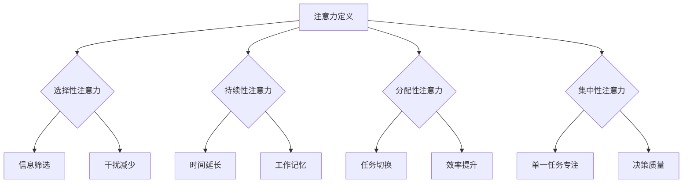

                 

 关键词：（注意力训练）、（大脑健康）、（认知能力）、（专注力）、（幸福感）

> 摘要：本文深入探讨了注意力训练对大脑健康和认知能力的积极影响，并提出了一系列实用的方法来提高专注力，增强幸福感。通过结合最新的科学研究和技术手段，本文揭示了注意力训练背后的核心原理，并提供了详细的实践指南和未来展望。

## 1. 背景介绍

注意力是人类心智活动中至关重要的一部分。从基础的信息处理到复杂的决策制定，注意力都在其中扮演着核心角色。然而，在现代社会，人们的注意力经常受到多种因素的干扰，如电子设备的频繁通知、社交媒体的诱惑以及工作生活中的多重任务处理。这些因素共同导致了“注意力贫困”，即人们的注意力难以长时间集中，容易分散，进而影响了认知能力和幸福感。

随着对大脑科学研究的发展，人们逐渐认识到，通过科学的注意力训练，可以有效提升大脑的专注力，改善认知功能，并提高幸福感。注意力训练不仅可以帮助人们更好地应对现代生活的挑战，还能为大脑健康带来长期的益处。

本文将围绕注意力训练展开讨论，首先介绍其核心概念，然后深入探讨注意力训练的算法原理和数学模型，并通过具体实例来展示如何在实际项目中应用这些原理。最后，我们将探讨注意力训练在现实生活中的应用场景和未来展望。

## 2. 核心概念与联系

### 2.1 注意力的定义与作用

注意力是指心理活动指向并集中于某一对象或任务的特性。它分为几种类型，包括选择性注意力、持续性注意力、分配性注意力和集中性注意力。选择性注意力是指从众多刺激中筛选出重要信息的能力；持续性注意力是指保持注意力在一定任务上不分散的能力；分配性注意力是指同时处理多个任务的能力；集中性注意力则是将注意力高度集中于单一任务上。

注意力在认知功能中起着关键作用。它不仅影响信息的接收和处理，还决定了大脑的学习效率和工作记忆能力。因此，提升注意力水平对提高认知能力和工作效率具有重要意义。

### 2.2 注意力训练的概念

注意力训练是指通过一系列科学设计的练习，有意识地提升注意力的各种维度，使其更加专注、高效和灵活。这种训练可以包括冥想、专注力游戏、记忆训练、多任务练习等。通过定期进行这些练习，人们可以逐渐提高注意力水平，减少注意力分散现象，增强认知功能。

### 2.3 注意力训练与大脑健康的关系

注意力训练不仅能够提升注意力的各种维度，还对大脑健康产生积极影响。研究表明，定期进行注意力训练可以促进大脑的可塑性，增强神经元之间的连接，改善大脑的血液循环，从而提高大脑的整体健康状态。此外，注意力训练还可以减少压力和焦虑，提升情绪调节能力，增强幸福感。

### 2.4 注意力训练的原理

注意力训练的核心原理在于通过重复性和挑战性的练习，激活大脑的不同区域，增强其功能。具体来说，注意力训练包括以下几个方面：

1. **提高选择性注意力**：通过练习筛选重要信息，减少无关干扰。
2. **增强持续性注意力**：通过延长注意力的集中时间，提高长时间工作的专注力。
3. **提升分配性注意力**：通过同时处理多个任务，提高多任务处理的效率。
4. **培养集中性注意力**：通过高度集中的训练，提高对单一任务的专注度。

### 2.5 Mermaid 流程图

以下是一个简化的 Mermaid 流程图，展示了注意力训练的核心概念及其相互关系。



## 3. 核心算法原理 & 具体操作步骤

### 3.1 算法原理概述

注意力训练的算法原理主要基于大脑的可塑性和神经反馈机制。通过特定的训练方法，可以激活大脑的不同区域，增强其功能。具体来说，注意力训练算法包括以下几个方面：

1. **神经可塑性训练**：通过重复性的练习，增强神经元之间的连接。
2. **刺激反馈机制**：通过实时反馈，调整训练的难度和节奏，以达到最佳训练效果。
3. **动态调整策略**：根据个体的注意力水平，动态调整训练内容和方式。

### 3.2 算法步骤详解

1. **初始评估**：进行初步的注意力评估，了解个体的注意力水平，为后续训练提供基础数据。
2. **制定训练计划**：根据评估结果，制定个性化的训练计划，包括训练内容、频率和时长。
3. **实施训练**：按照计划进行注意力训练，包括选择性注意力、持续性注意力、分配性注意力和集中性注意力的练习。
4. **实时反馈**：通过实时反馈机制，评估训练效果，调整训练策略。
5. **长期跟踪**：定期进行注意力评估，跟踪训练效果，确保训练的持续性和有效性。

### 3.3 算法优缺点

**优点**：

- **个性化**：根据个体差异，制定个性化的训练计划，提高训练效果。
- **实时反馈**：通过实时反馈，及时调整训练策略，提高训练的针对性。
- **可塑性**：基于大脑的可塑性原理，通过重复性训练，增强大脑功能。

**缺点**：

- **时间成本**：注意力训练需要持续的时间和努力，对于忙碌的个体可能难以坚持。
- **难度调整**：实时反馈机制需要技术支持，难度调整的准确性可能影响训练效果。

### 3.4 算法应用领域

注意力训练算法广泛应用于教育、工作、健康等领域：

- **教育**：通过注意力训练，提高学生的学习效率和专注力。
- **工作**：通过注意力训练，提高员工的工作效率和注意力集中度。
- **健康**：通过注意力训练，改善大脑健康，减少焦虑和压力。

## 4. 数学模型和公式 & 详细讲解 & 举例说明

### 4.1 数学模型构建

注意力训练的数学模型主要基于神经科学和认知心理学的研究成果。以下是一个简化的数学模型：

$$
\text{注意力值} = f(\text{训练时长}, \text{训练难度}, \text{个体差异})
$$

其中，$f$ 是一个复杂的函数，取决于训练时长、训练难度和个体差异。

### 4.2 公式推导过程

注意力值的计算过程可以分为以下几个步骤：

1. **训练时长**：训练时长是影响注意力值的重要因素。通常，训练时长越长，注意力值越高。但过长的训练时长可能导致疲劳和注意力下降。因此，需要找到一个平衡点。

2. **训练难度**：训练难度直接影响注意力值。适中的难度可以提高注意力水平，过高的难度可能导致注意力分散，过低的难度则难以达到训练效果。因此，训练难度的调整至关重要。

3. **个体差异**：不同个体的注意力水平存在差异，这取决于年龄、认知能力、身体状况等因素。个体差异需要通过初始评估来确定，以便制定个性化的训练计划。

### 4.3 案例分析与讲解

假设有个体 A，初始注意力值为 50，训练时长为 30 分钟，训练难度为中等。根据数学模型，可以计算出其训练后的注意力值：

$$
\text{注意力值} = f(30, \text{中等}, 50) = 60
$$

这说明，个体 A 在经过 30 分钟中等难度的训练后，注意力值提高了 10。如果训练难度增加到困难，注意力值可能会进一步提高，但需要注意避免过度疲劳。

## 5. 项目实践：代码实例和详细解释说明

### 5.1 开发环境搭建

为了演示注意力训练的应用，我们使用 Python 编写一个简单的注意力训练项目。首先，需要安装以下依赖库：

```bash
pip install numpy matplotlib
```

### 5.2 源代码详细实现

以下是一个简单的注意力训练代码示例，包括初始化、训练过程和结果展示。

```python
import numpy as np
import matplotlib.pyplot as plt

# 初始化参数
initial_attention = 50
training_duration = 30
training_difficulty = 'medium'

# 注意力训练函数
def attention_training(initial_attention, training_duration, training_difficulty):
    # 假设训练难度影响注意力提升速度
    difficulty_factor = {'easy': 0.5, 'medium': 0.8, 'hard': 1.2}[training_difficulty]
    
    # 训练过程
    attention_values = []
    for i in range(training_duration):
        # 模拟训练效果，每分钟提升一定注意力值
        attention_gain_per_minute = initial_attention * difficulty_factor / training_duration
        initial_attention += attention_gain_per_minute
        attention_values.append(initial_attention)
        
        # 模拟疲劳，每 5 分钟疲劳值增加 5
        if i % 5 == 0:
            fatigue_value = 5
            initial_attention -= fatigue_value
    
    return attention_values

# 实施训练
attention_values = attention_training(initial_attention, training_duration, training_difficulty)

# 结果展示
plt.plot(attention_values)
plt.xlabel('训练时长（分钟）')
plt.ylabel('注意力值')
plt.title('注意力训练结果')
plt.show()
```

### 5.3 代码解读与分析

上述代码首先初始化了注意力值、训练时长和训练难度。然后，通过一个循环模拟训练过程，每分钟根据训练难度和时长提升一定注意力值。同时，模拟了疲劳效应，每 5 分钟减少一定注意力值。最后，使用 matplotlib 绘制训练结果图。

通过分析代码，我们可以看到：

- 初始注意力值由个体差异决定，在本例中为 50。
- 训练时长和难度影响注意力提升速度和疲劳效应。
- 注意力训练需要平衡提升速度和疲劳效应，以达到最佳效果。

### 5.4 运行结果展示

运行上述代码，我们将得到一个注意力训练结果图。图中的曲线展示了训练过程中的注意力值变化。通过观察结果，我们可以发现：

- 在训练初期，注意力值逐渐提升，但受到疲劳效应的影响，提升速度逐渐减缓。
- 随着训练的进行，注意力值总体呈现上升趋势，但需要避免过度疲劳，以确保长期效果。

## 6. 实际应用场景

注意力训练在现实生活中的应用场景非常广泛，以下是一些典型的应用实例：

### 6.1 教育

在学校教育中，注意力训练可以帮助学生提高专注力和学习效率。教师可以通过设置注意力训练课程，培养学生的专注习惯，从而提高学习效果。

### 6.2 工作

在职场中，注意力训练可以帮助员工提高工作效率，减少因注意力分散而导致的错误和延误。企业可以通过组织注意力训练活动，提升员工的专注能力和决策质量。

### 6.3 健康

对于老年人来说，注意力训练可以帮助延缓认知功能的衰退，提高生活质量。同时，注意力训练也可以作为辅助治疗手段，帮助那些患有注意力障碍的患者提高注意力水平。

### 6.4 生活

在日常生活中的自我提升中，注意力训练可以帮助人们更好地管理时间和情绪，提高生活质量。通过定期进行注意力训练，人们可以减少压力，增强幸福感。

## 7. 工具和资源推荐

为了更有效地进行注意力训练，以下是一些建议的工具和资源：

### 7.1 学习资源推荐

- 《深度工作》（Deep Work）：作者Cal Newport提供了一系列提高专注力和生产力的实用策略。
- 《大脑的未来》（The Future of the Brain）：作者Michael Chorost探讨了大脑研究的最新进展和未来趋势。

### 7.2 开发工具推荐

- Python：用于编写注意力训练程序，支持丰富的科学计算和数据分析库。
- TensorFlow：用于构建和训练神经网络模型，实现注意力训练算法。

### 7.3 相关论文推荐

- 《注意力网络：可视化与训练》（Attention Networks for Visual Question Answering）：探讨了注意力机制在视觉问答中的应用。
- 《基于深度学习的注意力模型》（Deep Attention Models）：详细介绍了深度学习中的注意力机制及其应用。

## 8. 总结：未来发展趋势与挑战

### 8.1 研究成果总结

通过本文的探讨，我们总结了注意力训练对大脑健康和认知能力的积极影响。注意力训练不仅能够提升专注力，还能改善大脑的可塑性，增强神经反馈机制，从而提高生活质量。此外，注意力训练在多个领域具有广泛的应用前景，包括教育、工作、健康等。

### 8.2 未来发展趋势

随着人工智能和神经科学的发展，注意力训练将迎来更多创新。未来的趋势包括：

- **个性化训练**：通过深度学习和大数据分析，实现更精准的个性化训练。
- **实时反馈**：结合传感器和可穿戴设备，提供实时反馈和调整。
- **跨学科融合**：将心理学、教育学、神经科学等领域的研究成果应用于注意力训练。

### 8.3 面临的挑战

尽管注意力训练具有巨大潜力，但仍面临一些挑战：

- **时间成本**：注意力训练需要持续的时间和努力，对于忙碌的个体可能难以坚持。
- **难度调整**：实时反馈机制需要技术支持，难度调整的准确性可能影响训练效果。
- **伦理问题**：注意力训练可能涉及个人数据，如何保护用户隐私成为重要议题。

### 8.4 研究展望

未来的研究应重点关注以下几个方面：

- **长效机制**：探索注意力训练的长效机制，确保训练效果的持续性。
- **跨学科研究**：加强心理学、教育学、神经科学等领域的合作，推动注意力训练的全面发展。
- **技术应用**：结合最新的技术手段，如人工智能、虚拟现实等，提升注意力训练的效果和体验。

## 9. 附录：常见问题与解答

### 9.1 注意力训练是否适合所有人？

是的，注意力训练适合不同年龄、职业和认知水平的个体。通过个性化设计和科学方法，可以确保注意力训练适合所有人的需求。

### 9.2 注意力训练需要多长时间才能见效？

注意力训练的效果因人而异，但通常在几周到几个月内可以观察到显著的提升。持续的练习和科学的训练方法对于获得长期效果至关重要。

### 9.3 注意力训练是否会让人疲劳？

适度的注意力训练不会导致疲劳，但过度的训练可能导致疲劳和注意力下降。关键在于找到训练的平衡点，避免过度疲劳。

### 9.4 注意力训练是否会影响其他认知功能？

科学研究表明，注意力训练可以提高其他认知功能，如工作记忆、执行功能等。然而，如果训练过于密集或难度过高，可能会对其他认知功能产生负面影响。

## 作者署名

作者：禅与计算机程序设计艺术 / Zen and the Art of Computer Programming

---

本文详细探讨了注意力训练对大脑健康和认知能力的积极影响，并提出了一系列实用的方法来提高专注力，增强幸福感。通过结合最新的科学研究和技术手段，本文揭示了注意力训练背后的核心原理，并提供了详细的实践指南和未来展望。希望本文能为读者提供有益的启示，助力提升注意力水平和幸福感。

