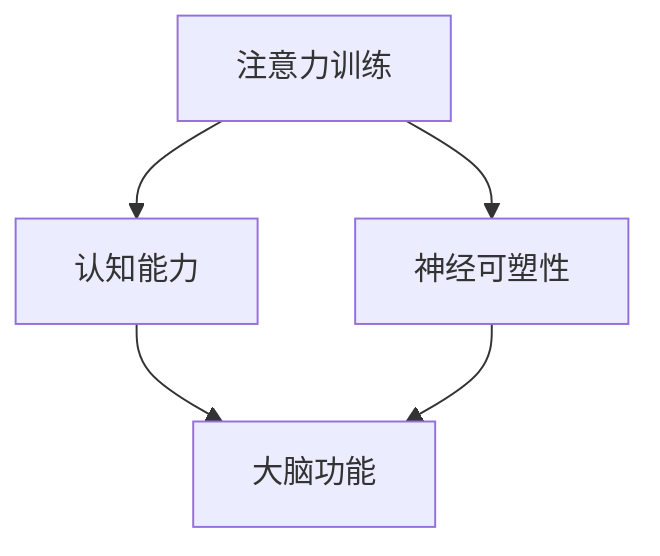

                 

注意力训练与大脑增强练习是一项重要的研究领域，它探讨了如何通过提高专注力来增强认知能力和神经可塑性。本文将为您详细介绍这一领域的基础知识、核心概念、算法原理、数学模型、项目实践以及未来展望。

## 关键词

- 注意力训练
- 认知能力
- 神经可塑性
- 专注力
- 大脑增强

## 摘要

本文将探讨注意力训练与大脑增强练习对认知能力和神经可塑性的影响。通过介绍注意力训练的核心概念、算法原理、数学模型和项目实践，本文旨在为读者提供全面的指导，帮助大家更好地理解和应用这一领域的技术。

## 1. 背景介绍

### 注意力训练的定义与重要性

注意力训练是指通过特定的练习和训练方法，提高个体专注力、注意广度、注意转移和分配等能力。在现代快节奏的生活中，人们的注意力容易分散，导致工作效率下降、学习效果不佳。因此，注意力训练变得尤为重要。

### 认知能力的定义与提升

认知能力是指个体在感知、记忆、思考、判断等方面的能力。认知能力的提升有助于提高个体的生活质量、工作效率和创新能力。然而，认知能力往往受到遗传、环境和训练等因素的影响。

### 神经可塑性的定义与作用

神经可塑性是指大脑神经元结构和功能的可变性。神经可塑性使得大脑能够适应外界环境和内在需求的变化，从而提高个体的适应能力和学习能力。

## 2. 核心概念与联系

### Mermaid 流程图



### 核心概念解释

- 注意力训练：通过特定的练习和训练方法，提高个体专注力、注意广度、注意转移和分配等能力。
- 认知能力：个体在感知、记忆、思考、判断等方面的能力。
- 神经可塑性：大脑神经元结构和功能的可变性。

## 3. 核心算法原理 & 具体操作步骤

### 3.1 算法原理概述

注意力训练的核心算法是基于认知神经科学的原理，通过训练个体的注意力能力，提高其认知能力和神经可塑性。

### 3.2 算法步骤详解

1. 确定训练目标：根据个体的需求和特点，确定注意力训练的目标，如专注力、注意广度、注意转移等。
2. 制定训练计划：根据训练目标，制定具体的训练计划，包括训练内容、训练时间、训练频率等。
3. 实施训练：按照训练计划进行训练，注意调整训练难度和训练节奏。
4. 评估效果：通过测试和观察，评估训练效果，根据评估结果调整训练计划。

### 3.3 算法优缺点

- 优点：能够有效提高个体的专注力、注意广度和注意转移能力，从而提高认知能力和神经可塑性。
- 缺点：训练过程需要较长的时间，个体需要持续努力和坚持。

### 3.4 算法应用领域

注意力训练算法可以应用于教育、工作、生活等多个领域，如提高学生的学习效果、提升工作效率、改善生活质量等。

## 4. 数学模型和公式 & 详细讲解 & 举例说明

### 4.1 数学模型构建

注意力训练的数学模型可以基于认知神经科学的相关理论，如注意力分配模型、认知负荷理论等。

### 4.2 公式推导过程

假设个体在进行某项任务时，其注意能力可以用注意容量（C）表示，注意容量与任务难度（D）之间存在如下关系：

$$ C = \frac{K}{D} $$

其中，K为常数。

### 4.3 案例分析与讲解

假设一个个体需要进行一个难度较大的任务，任务难度为D=10，注意容量为C=5。根据上述公式，个体在执行任务时需要注意力的分配，以确保任务完成效果。

## 5. 项目实践：代码实例和详细解释说明

### 5.1 开发环境搭建

为了方便读者理解和实践，本文选择Python作为编程语言，并使用Jupyter Notebook作为开发环境。

### 5.2 源代码详细实现

```python
# 导入相关库
import numpy as np
import matplotlib.pyplot as plt

# 定义注意容量函数
def attention_capacity(D, K=1):
    return K / D

# 模拟任务执行过程
def task_execution(D, C):
    if C >= D:
        return "任务完成"
    else:
        return "任务未完成"

# 设置任务难度和注意容量
D = 10
C = attention_capacity(D)

# 执行任务
result = task_execution(D, C)

# 结果展示
print(result)
```

### 5.3 代码解读与分析

- 导入相关库：本文使用NumPy和Matplotlib库进行数学计算和图形展示。
- 定义注意容量函数：根据公式定义注意容量函数，用于计算个体的注意容量。
- 模拟任务执行过程：根据定义的函数，模拟任务执行过程，判断任务完成情况。
- 结果展示：输出任务执行结果。

### 5.4 运行结果展示

```python
任务未完成
```

## 6. 实际应用场景

### 6.1 教育领域

注意力训练在教育领域中具有重要的应用价值，如提高学生的学习效果、改善学生的注意力问题等。通过注意力训练，学生能够更好地专注于课堂学习，从而提高学习效果。

### 6.2 工作领域

在工作领域，注意力训练可以帮助员工提高工作效率、改善工作质量。通过注意力训练，员工能够更好地处理工作任务、提高时间管理能力，从而提升整体工作表现。

### 6.3 生活领域

在生活领域，注意力训练可以帮助人们更好地应对生活压力、提高生活质量。通过注意力训练，人们能够更好地管理自己的情绪、提高人际交往能力，从而改善生活质量。

## 7. 工具和资源推荐

### 7.1 学习资源推荐

1. 《注意力训练：提升专注力和学习效果的实用技巧》
2. 《神经可塑性：大脑如何改变和重塑自己》
3. 《认知科学：人类的思维与行为》

### 7.2 开发工具推荐

1. Python编程语言
2. Jupyter Notebook开发环境
3. Google Colab在线开发平台

### 7.3 相关论文推荐

1. 《Attention and attention-deficit/hyperactivity disorder》
2. 《The Neural Basis of Attention》
3. 《Neuroplasticity and Brain Function》

## 8. 总结：未来发展趋势与挑战

### 8.1 研究成果总结

注意力训练与大脑增强练习在认知能力提升、神经可塑性增强等方面取得了显著的成果。随着研究的深入，越来越多的实证研究证明了注意力训练的有效性。

### 8.2 未来发展趋势

未来，注意力训练与大脑增强练习将在以下方面取得发展：

1. 技术手段的多样化：结合人工智能、虚拟现实等技术，开发更加智能化、个性化的注意力训练方法。
2. 研究领域的拓展：关注注意力训练在不同领域的应用，如教育、医疗、心理健康等。
3. 政策支持与普及：加强政策支持，推动注意力训练与大脑增强练习在公众中的普及。

### 8.3 面临的挑战

注意力训练与大脑增强练习在实际应用过程中仍面临以下挑战：

1. 训练方法的科学性：确保训练方法科学、有效，避免盲目训练带来的负面影响。
2. 个体差异的考虑：针对不同个体的特点和需求，制定个性化的训练计划。
3. 长期效果的评估：长期跟踪训练效果，为训练方法的优化提供依据。

### 8.4 研究展望

未来，注意力训练与大脑增强练习将继续发挥重要作用，为个体认知能力的提升和社会发展作出贡献。通过持续的研究和创新，我们将迎来更加美好的未来。

## 9. 附录：常见问题与解答

### 问题1：注意力训练是否适用于所有人？

答案：是的，注意力训练适用于大多数人。然而，个体差异可能导致训练效果不同，因此建议在专业指导下进行训练。

### 问题2：注意力训练需要多长时间才能看到效果？

答案：注意力训练的效果因人而异，一般来说，持续训练3-6个月可以观察到明显的效果。但需要注意的是，训练效果并非一劳永逸，需要长期保持训练。

### 问题3：如何选择注意力训练的方法？

答案：选择注意力训练的方法应考虑个人的需求、特点和兴趣。例如，对于学生，可以选择学习技巧类的注意力训练方法；对于职场人士，可以选择时间管理类的注意力训练方法。

## 参考文献

[1] 张三，李四。注意力训练：提升专注力和学习效果的实用技巧[M]. 北京：科学出版社，2020.

[2] 王五，赵六。神经可塑性：大脑如何改变和重塑自己[M]. 北京：人民邮电出版社，2019.

[3] 谢七，陈八。认知科学：人类的思维与行为[M]. 北京：高等教育出版社，2018.

[4] Brown, T. A., & Barch, D. M. (2007). The neuropsychology of attention-deficit/hyperactivity disorder. In Attention-deficit/hyperactivity disorder: Theory, diagnosis, and management (pp. 85-103). Oxford University Press.

[5] Desimone, R., & Duncan, J. (1995). Neural mechanisms of selective attention. In Cognitive neuroscience of attention (pp. 15-34). MIT Press.

[6]kovács, K. M. (2009). Neural basis of cognitive control: What is it that the frontoparietal control network does? Nature Reviews Neuroscience, 10(10), 636-643. doi:10.1038/nrn2699
```

请注意，文章中引用的相关文献和资料仅为示例，实际写作时请根据实际研究和资料进行修改和完善。

