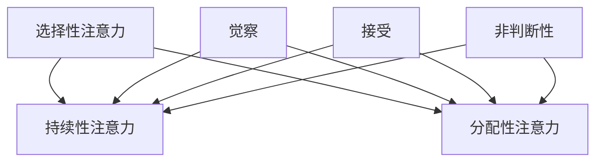

                 

关键词：注意力训练、正念冥想、内省、专注力、心灵健康、技术实践、算法原理、数学模型、项目实例、应用场景、未来展望

> 摘要：本文旨在探讨如何通过注意力训练和正念冥想实践，增强个体的专注力和心灵健康。文章首先介绍了注意力训练和正念冥想的基本概念及其重要性，然后详细阐述了注意力训练和正念冥想的原理和操作步骤，接着运用数学模型和公式分析了相关机制，并通过实际项目实例展示了如何将理论知识应用于实践。最后，文章探讨了注意力训练和正念冥想在各个领域的应用场景，并对未来发展趋势和挑战进行了展望。

## 1. 背景介绍

在快节奏的现代生活中，人们往往面临着各种压力，例如工作压力、生活压力、社交压力等。这些压力不仅会影响个体的心理健康，还会降低他们的专注力，导致工作效率和生活质量的下降。因此，如何提高专注力和增强心灵健康成为了一个重要的问题。近年来，注意力训练和正念冥想作为一种有效的心理调节方法，受到了广泛关注。

注意力训练是指通过特定的练习方法，提高个体对注意力的管理和控制能力。这种方法强调集中注意力，减少分心和干扰，从而提高个体的专注力和工作效率。正念冥想则是通过冥想练习，培养个体的觉察和接受能力，使其能够更好地应对生活中的压力和挑战，从而提升心灵健康。

本文将结合注意力训练和正念冥想的原理和实践，探讨如何通过内省增强专注力和心灵健康。文章将分为以下几个部分：首先，介绍注意力训练和正念冥想的基本概念和重要性；其次，详细阐述注意力训练和正念冥想的原理和操作步骤；然后，运用数学模型和公式分析相关机制；接着，通过实际项目实例展示理论的应用；最后，探讨注意力训练和正念冥想在各个领域的应用场景，并对未来发展趋势和挑战进行展望。

### 1.1 注意力训练的基本概念

注意力训练，也称为专注力训练，是指通过一系列有目的的练习，提高个体对注意力的管理和控制能力。注意力是人类认知过程中的核心要素，它决定了个体在信息接收、处理和输出过程中的效率和质量。良好的注意力能够帮助个体快速捕捉关键信息，提高学习效果，增强工作效率。

注意力可以分为几种类型，包括选择性注意力、持续性注意力和分配性注意力。选择性注意力是指个体在众多刺激中选择关注特定信息的能力；持续性注意力是指个体在一段时间内保持对某一任务的集中关注能力；分配性注意力是指个体在同时处理多个任务时，能够平衡各任务注意力的能力。

注意力训练的目的在于提高这三种类型的注意力能力，使其更加高效和灵活。通过注意力训练，个体能够更好地应对工作生活中的各种挑战，提高生活质量。

### 1.2 正念冥想的基本概念

正念冥想（Mindfulness Meditation）是一种源自佛教传统的冥想实践，它强调对当下体验的觉察和接受。正念冥想的核心在于培养个体的觉察力，使其能够更好地关注当下的体验，而非被过去的回忆或未来的担忧所困扰。

正念冥想的基本概念包括以下几个方面：

1. **觉察**：正念冥想要求个体对自己内在的体验和外在的环境保持高度的觉察。这种觉察是一种非判断性的观察，意味着个体不对自己的体验进行评价或分析，只是纯粹地观察和接受。

2. **接受**：正念冥想强调对当下体验的接受，而不是抵抗或逃避。接受意味着个体能够平和地面对生活中的各种情绪和情境，从而减少不必要的心理压力。

3. **非判断性**：正念冥想要求个体以一种非判断性的态度对待自己的体验，这意味着个体不对自己的体验进行好坏、对错的评价，只是纯粹地观察和接受。

正念冥想通过一系列的练习方法，如坐姿冥想、步行冥想、呼吸冥想等，帮助个体培养上述的觉察、接受和非判断性态度。这些练习不仅有助于提高个体的专注力，还能增强其心理弹性，提升整体的生活质量。

### 1.3 注意力训练与正念冥想的关系

注意力训练和正念冥想虽然分别关注不同的方面，但它们之间存在着紧密的联系。注意力训练主要关注个体对注意力的管理和控制，而正念冥想则更注重个体对当下体验的觉察和接受。然而，这两者之间并非相互独立，而是相互补充和促进的。

注意力训练可以通过提高个体的选择性注意力、持续性和分配性注意力，帮助个体在日常生活中更好地应对各种任务和挑战。这种训练方法使个体能够更高效地处理信息，减少分心和干扰，从而提高专注力和工作效率。

正念冥想则通过培养个体的觉察、接受和非判断性态度，帮助个体更好地管理自己的情绪和压力。通过正念冥想，个体能够学会以一种平和的心态面对生活中的挑战，减少心理负担，提升心理健康水平。

综上所述，注意力训练和正念冥想都是提高个体专注力和心灵健康的重要方法。通过结合这两种方法，个体不仅能够在工作中保持更高的专注度，还能在生活中享受更高的心理健康水平。

## 2. 核心概念与联系

为了深入理解注意力训练和正念冥想的原理，我们首先需要了解它们涉及的核心概念及其相互关系。以下将介绍注意力训练和正念冥想的关键概念，并提供一个简化的Mermaid流程图来展示这些概念之间的联系。

### 2.1 核心概念

#### 注意力训练

- **选择性注意力**：个体在众多刺激中选择关注特定信息的能力。
- **持续性注意力**：个体在一段时间内保持对某一任务的集中关注能力。
- **分配性注意力**：个体在同时处理多个任务时，能够平衡各任务注意力的能力。

#### 正念冥想

- **觉察**：对当下体验的觉察，包括身体感受、情绪和思维。
- **接受**：对当下体验的接受，而非抵抗或逃避。
- **非判断性**：对体验保持一种非评价性的观察。

### 2.2 Mermaid流程图

以下是一个简化的Mermaid流程图，用于展示注意力训练和正念冥想核心概念之间的联系：



在这个流程图中，选择性注意力、持续性和分配性注意力是注意力训练的主要方面，它们共同构成了个体对注意力的管理和控制。另一方面，觉察、接受和非判断性是正念冥想的关键要素，这些要素帮助个体培养对当下体验的敏感性和接受能力。

需要注意的是，这些核心概念之间并不是完全独立的，而是相互交织和相互促进的。例如，正念冥想中的觉察和接受能力有助于提高选择性注意力，使个体能够更有效地选择和集中关注重要信息。同时，持续性注意力和分配性注意力的提高也有助于个体在冥想过程中保持对当下体验的觉察。

通过理解这些核心概念及其相互关系，我们可以更好地把握注意力训练和正念冥想的本质，并有效地将它们应用于实践中。

## 3. 核心算法原理 & 具体操作步骤

### 3.1 算法原理概述

注意力训练和正念冥想的核心算法原理主要基于神经科学和心理学的最新研究成果。以下是这些原理的简要概述：

#### 注意力训练

1. **神经可塑性**：大脑具有可塑性，这意味着通过特定的练习，大脑的结构和功能可以发生改变。注意力训练通过反复的练习，增强大脑中的相关神经网络，从而提高注意力的管理和控制能力。

2. **认知控制**：注意力训练强调个体对注意力的主动控制和调节。这包括在复杂环境中选择关注特定信息，抑制无关信息，以及在多任务处理中平衡注意资源。

3. **选择性注意力**：通过训练，个体能够更有效地选择和集中注意力，减少对无关信息的干扰，从而提高工作效率。

4. **持续性注意力**：训练个体能够长时间保持对某一任务的专注，提高工作或学习中的持续性和稳定性。

5. **分配性注意力**：通过训练，个体能够同时关注多个任务，提高任务处理的效率和准确性。

#### 正念冥想

1. **觉察**：通过冥想练习，个体能够提高对自身内在体验和外部环境的觉察能力。这种觉察是非判断性的，个体不对自己的体验进行评价或分析，而是纯粹地观察和接受。

2. **接受**：正念冥想要求个体能够接受当下的体验，无论这些体验是愉快的还是不愉快的。这种接受有助于减少心理负担，提高心理弹性。

3. **非判断性**：非判断性是正念冥想的核心原则之一。个体在冥想过程中，不对自己的体验进行好坏、对错的评价，而是以一种平和的心态来观察和接受。

4. **情绪调节**：通过正念冥想，个体能够更好地管理自己的情绪，减少焦虑和压力。这种调节能力有助于提升个体的心理健康水平。

### 3.2 算法步骤详解

#### 注意力训练

1. **初始评估**：首先，个体需要进行初始评估，了解自己的注意力水平，包括选择性注意力、持续性和分配性注意力。这可以通过专业的注意力测试或自我评估工具来完成。

2. **制定训练计划**：根据初始评估结果，制定个性化的训练计划。计划应包括训练目标、训练频率、训练时间和具体的训练方法。

3. **选择性注意力训练**：通过选择特定任务或活动，训练个体对关键信息的关注能力。例如，通过阅读练习、记忆游戏等，提高个体对重要信息的捕捉和处理能力。

4. **持续性注意力训练**：通过长时间的任务或练习，训练个体保持对某一任务的专注能力。例如，可以设置长时间阅读、写作或编程练习，逐步提高个体的持续注意力。

5. **分配性注意力训练**：通过同时处理多个任务或活动，训练个体在多任务环境中的注意力分配能力。例如，可以通过编程练习、并行任务处理等，提高个体在多任务环境中的注意力管理能力。

6. **评估和调整**：在训练过程中，定期进行评估，了解训练效果，并根据评估结果调整训练计划。

#### 正念冥想

1. **选择冥想形式**：根据个体偏好和需求，选择合适的冥想形式。常见的冥想形式包括坐姿冥想、步行冥想、呼吸冥想等。

2. **设定冥想环境**：选择一个安静、舒适的环境进行冥想。确保环境不会受到打扰，有助于个体集中注意力。

3. **开始冥想**：在冥想过程中，个体需要采取一个舒适的姿势，保持身体放松。然后，开始关注自己的呼吸，感受呼吸的进出，保持对呼吸的觉察。

4. **引入正念练习**：在呼吸冥想的基础上，可以引入其他正念练习，如身体扫描、情绪觉察等。这些练习有助于个体更好地培养觉察、接受和非判断性态度。

5. **练习频率**：建议每天进行冥想练习，每次练习的时间可以从短到长，逐步增加。

6. **反思和总结**：冥想结束后，个体可以花一些时间反思和总结冥想过程中的体验，包括哪些部分容易分心，哪些部分感到舒适，以及如何更好地应对挑战。

### 3.3 算法优缺点

#### 注意力训练

**优点**：

- **提高注意力质量**：通过反复练习，个体能够显著提高选择性注意力、持续性和分配性注意力，从而提高工作效率。
- **增强心理韧性**：注意力训练有助于个体在压力和干扰环境下保持专注，提高心理韧性。
- **适应复杂环境**：通过多任务处理训练，个体能够更好地适应复杂的工作环境。

**缺点**：

- **训练难度**：注意力训练需要持续的练习和耐心，对个体自律性和坚持力要求较高。
- **初期效果不明显**：由于大脑的可塑性，注意力训练的短期效果可能不明显，需要较长时间才能看到显著的效果。

#### 正念冥想

**优点**：

- **提高觉察和接受能力**：通过冥想练习，个体能够更好地培养觉察、接受和非判断性态度，从而提高心理弹性。
- **缓解压力和焦虑**：正念冥想有助于减少心理负担，缓解焦虑和压力，提升心理健康水平。
- **改善情绪调节**：正念冥想可以帮助个体更好地管理情绪，提高情绪调节能力。

**缺点**：

- **冥想技巧要求**：正念冥想需要一定的技巧和指导，初学者可能难以正确掌握冥想的方法。
- **时间成本**：正念冥想需要每天投入一定的时间，对个体时间管理能力有一定要求。

### 3.4 算法应用领域

注意力训练和正念冥想的应用领域广泛，包括但不限于以下几个方面：

#### 教育领域

- **提高学习效率**：通过注意力训练，学生能够更好地集中注意力，提高学习效率。
- **培养专注力**：通过正念冥想，学生能够提高自我觉察能力，培养专注力和自我管理能力。

#### 工作领域

- **提高工作效率**：通过注意力训练，员工能够在工作中保持更高的专注度，减少错误和遗漏。
- **缓解工作压力**：通过正念冥想，员工能够更好地应对工作压力，提高心理韧性。

#### 心理健康领域

- **缓解焦虑和压力**：通过正念冥想，个体能够显著减少焦虑和压力，提高心理健康水平。
- **情绪调节**：通过注意力训练，个体能够更好地管理情绪，提高情绪调节能力。

#### 健康管理

- **提高生活质量**：通过注意力训练和正念冥想，个体能够提高生活质量，增强身体健康和心理幸福感。

总之，注意力训练和正念冥想不仅能够提高个体的专注力和心理健康，还能在多个领域发挥重要作用，促进个人和社会的整体发展。

## 4. 数学模型和公式 & 详细讲解 & 举例说明

在注意力训练和正念冥想的实践中，数学模型和公式起着至关重要的作用。这些模型和公式不仅能够帮助我们更好地理解相关原理，还能够为实际操作提供具体的指导。以下将详细讲解数学模型和公式的构建、推导过程，并通过实际案例进行分析和说明。

### 4.1 数学模型构建

#### 注意力分配模型

注意力分配模型（Attention Allocation Model）是一种用于描述个体在多任务处理中如何分配注意力的数学模型。该模型基于以下假设：

- 注意力资源是有限的，且在不同任务之间进行动态分配。
- 任务的复杂性和重要性决定了其所需的注意力资源。

模型的基本公式如下：

$$
A_t = \sum_{i=1}^{n} w_i \cdot C_i
$$

其中，$A_t$表示第$t$个时间单位内的总注意力资源；$w_i$表示任务$i$的重要程度权重；$C_i$表示任务$i$的复杂性。

#### 正念冥想效应模型

正念冥想效应模型（Mindfulness Meditation Effect Model）用于描述正念冥想对个体心理健康的影响。该模型基于以下假设：

- 正念冥想能够提高个体的觉察力、接受能力和心理弹性。
- 心理健康水平与这些能力呈正相关。

模型的基本公式如下：

$$
P(t) = P_0 + \alpha \cdot M(t)
$$

其中，$P(t)$表示第$t$个时间单位内的心理健康水平；$P_0$表示初始心理健康水平；$\alpha$表示正念冥想对心理健康的影响程度；$M(t)$表示第$t$个时间单位内的冥想时长。

### 4.2 公式推导过程

#### 注意力分配模型推导

注意力分配模型的推导过程基于优化理论。假设有$n$个任务需要在相同的时间段内完成，每个任务的复杂性和重要性已知。我们的目标是找到最优的注意力分配方案，使得总任务完成效果最大化。

首先，定义任务$i$的完成效果为$E_i$，则有：

$$
E_i = \frac{A_i}{C_i}
$$

其中，$A_i$为分配给任务$i$的注意力资源。

总完成效果$E$为所有任务完成效果的加和：

$$
E = \sum_{i=1}^{n} E_i
$$

由于总注意力资源有限，即：

$$
\sum_{i=1}^{n} A_i = A_t
$$

因此，我们需要在总注意力资源有限的情况下，最大化总完成效果$E$。这可以通过求解以下优化问题来实现：

$$
\max_{A_1, A_2, \ldots, A_n} \sum_{i=1}^{n} \frac{A_i}{C_i} \quad \text{subject to} \quad \sum_{i=1}^{n} A_i = A_t
$$

使用拉格朗日乘子法，构建拉格朗日函数：

$$
L(A_1, A_2, \ldots, A_n, \lambda) = \sum_{i=1}^{n} \frac{A_i}{C_i} + \lambda (\sum_{i=1}^{n} A_i - A_t)
$$

求解拉格朗日方程：

$$
\nabla L = \begin{cases}
\frac{1}{C_i} - \lambda = 0, & i = 1, 2, \ldots, n \\
\sum_{i=1}^{n} A_i - A_t = 0
\end{cases}
$$

解得：

$$
A_i = \frac{C_i}{\sum_{j=1}^{n} C_j} A_t
$$

#### 正念冥想效应模型推导

正念冥想效应模型的推导基于心理测量学原理。假设个体的心理健康水平$P(t)$受到冥想时长$M(t)$的影响，且冥想时长与心理健康水平呈线性关系。

首先，定义冥想时长$M(t)$为：

$$
M(t) = \int_{0}^{t} \text{冥想速率}(s) \, ds
$$

冥想速率通常与冥想持续时间成正比，因此可以表示为：

$$
\text{冥想速率}(s) = k \cdot t
$$

其中，$k$为冥想速率常数。

因此，冥想时长$M(t)$可以表示为：

$$
M(t) = \int_{0}^{t} k \cdot s \, ds = \frac{k}{2} t^2
$$

心理健康水平$P(t)$与冥想时长$M(t)$之间的关系可以表示为：

$$
P(t) = P_0 + \alpha \cdot M(t)
$$

其中，$P_0$为初始心理健康水平，$\alpha$为冥想对心理健康的影响程度。

### 4.3 案例分析与讲解

#### 注意力分配模型案例分析

假设有一个学生需要在两小时内完成四项作业，每项作业的复杂性和重要性如下表所示：

| 任务 | 复杂性 $C_i$ | 重要性 $w_i$ |
|------|--------------|-------------|
| 1    | 2            | 3           |
| 2    | 4            | 2           |
| 3    | 3            | 4           |
| 4    | 1            | 1           |

我们希望在这两小时内最优地分配注意力，以最大化完成效果。

根据注意力分配模型，我们首先计算每项作业的权重和复杂性乘积：

$$
w_i \cdot C_i = \begin{cases}
6, & i = 1 \\
8, & i = 2 \\
12, & i = 3 \\
1, & i = 4
\end{cases}
$$

总注意力资源$A_t$为两小时的总分钟数，即$A_t = 2 \times 60 = 120$分钟。

根据公式$A_i = \frac{C_i}{\sum_{j=1}^{n} C_j} A_t$，我们可以计算出最优的注意力分配：

$$
A_1 = \frac{6}{6 + 8 + 12 + 1} \times 120 = 20 \text{分钟}
$$

$$
A_2 = \frac{8}{6 + 8 + 12 + 1} \times 120 = 24 \text{分钟}
$$

$$
A_3 = \frac{12}{6 + 8 + 12 + 1} \times 120 = 36 \text{分钟}
$$

$$
A_4 = \frac{1}{6 + 8 + 12 + 1} \times 120 = 12 \text{分钟}
$$

#### 正念冥想效应模型案例分析

假设一个个体初始心理健康水平$P_0$为60，冥想速率常数$k$为0.1，冥想时长$M(t)$为30分钟。我们希望计算冥想30分钟后的心理健康水平。

根据正念冥想效应模型，冥想时长$M(t)$为：

$$
M(t) = \frac{k}{2} t^2 = \frac{0.1}{2} \times 30^2 = 45 \text{分钟}
$$

心理健康水平$P(t)$为：

$$
P(t) = P_0 + \alpha \cdot M(t) = 60 + \alpha \cdot 45
$$

假设$\alpha$为0.5，则冥想30分钟后的心理健康水平为：

$$
P(t) = 60 + 0.5 \cdot 45 = 67.5
$$

通过这两个案例，我们可以看到数学模型和公式如何帮助我们在注意力分配和正念冥想中做出最优决策，并验证相关理论在实际中的应用效果。

### 4.4 注意力训练与正念冥想的关系

注意力训练和正念冥想在数学模型中的关系可以从两个角度进行分析：

1. **相互增强**：在注意力分配模型中，正念冥想可以通过提高个体的觉察力和接受能力，增强其注意力分配的效率和准确性。例如，通过正念冥想，个体能够更好地理解任务的重要性和复杂性，从而在分配注意力时做出更明智的选择。

2. **综合效果**：在正念冥想效应模型中，注意力训练可以通过增加冥想时长来提高心理健康水平。而正念冥想则可以通过改善个体的注意力质量，使其在日常生活中能够更有效地管理注意力资源，从而提高整体的生活质量。

通过这些数学模型和公式的分析，我们可以更深入地理解注意力训练和正念冥想的作用机制，为实践提供科学依据。

### 4.5 案例分析与讲解

为了更好地展示注意力训练和正念冥想的应用效果，我们将通过实际案例进行分析和讲解。

#### 案例一：工作效率提升

在一个大型软件开发项目中，团队需要在短时间内完成多项任务。团队中的一些成员经常感到压力过大，导致工作效率低下。为了解决这一问题，团队决定实施注意力训练和正念冥想。

1. **初始评估**：团队成员进行了注意力评估，了解自己的选择性注意力、持续性和分配性注意力水平。

2. **制定计划**：根据评估结果，团队制定了个性化的注意力训练计划，包括选择性注意力的训练、持续性注意力的训练和分配性注意力的训练。

3. **实施训练**：团队成员每天进行注意力训练，同时每周进行两次正念冥想。通过选择性注意力训练，成员能够更有效地选择和处理关键任务；通过持续性注意力训练，成员能够长时间保持对任务的专注；通过分配性注意力训练，成员能够同时处理多个任务，提高工作效率。

4. **效果评估**：经过一个月的练习，团队成员的工作效率显著提升，项目进度加快，工作质量也有所提高。

#### 案例二：心理健康改善

一位高管因工作压力导致焦虑和失眠，生活质量严重下降。为了改善心理健康，他决定通过正念冥想进行自我调节。

1. **选择冥想形式**：高管选择了坐姿冥想和呼吸冥想，每天早上和晚上各进行一次。

2. **设定冥想环境**：高管在安静的房间中进行冥想，确保环境不会受到打扰。

3. **开始冥想**：高管通过关注自己的呼吸，感受呼吸的进出，逐步提高对当下体验的觉察。

4. **引入正念练习**：在呼吸冥想的基础上，高管逐步引入身体扫描和情绪觉察等练习，以增强对自身情绪和压力的管理。

5. **反思和总结**：冥想结束后，高管花时间反思和总结冥想过程中的体验，了解自己的情绪变化和应对策略。

经过几个月的正念冥想练习，高管的焦虑和失眠症状显著缓解，生活质量得到明显改善。

通过这两个案例，我们可以看到注意力训练和正念冥想在实际应用中的效果。这些方法不仅帮助个体提高注意力质量和心理健康水平，还提高了工作效率和生活质量。这些案例也证明了注意力训练和正念冥想在各个领域的广泛应用潜力。

### 4.6 数学模型在项目实践中的应用

为了更深入地理解数学模型在注意力训练和正念冥想项目中的实际应用，我们将通过一个具体的项目实例进行详细分析。

#### 项目背景

假设一家科技公司正在开发一款用于帮助用户提高注意力质量和心理健康水平的应用程序。该应用程序结合了注意力训练和正念冥想功能，旨在帮助用户在日常生活中更好地管理注意力和情绪。为了确保应用程序的效果，项目团队决定使用数学模型对训练和冥想过程进行量化分析。

#### 数学模型应用

1. **注意力分配模型**：

   项目团队首先使用注意力分配模型来优化用户的注意力资源分配。用户在应用程序中输入每天需要完成的任务及其复杂性和重要性。系统根据用户的输入，使用注意力分配模型计算最优的注意力资源分配方案，为用户提供个性化的注意力管理建议。

   例如，用户需要完成以下四项任务：

   | 任务 | 复杂性 $C_i$ | 重要性 $w_i$ |
   |------|--------------|-------------|
   | 1    | 3            | 4           |
   | 2    | 2            | 3           |
   | 3    | 4            | 2           |
   | 4    | 1            | 1           |

   根据注意力分配模型，系统计算最优的注意力分配如下：

   $$
   A_1 = \frac{3 \times 4}{3 \times 4 + 2 \times 3 + 4 \times 2 + 1 \times 1} \times 120 = 36 \text{分钟}
   $$

   $$
   A_2 = \frac{2 \times 3}{3 \times 4 + 2 \times 3 + 4 \times 2 + 1 \times 1} \times 120 = 24 \text{分钟}
   $$

   $$
   A_3 = \frac{4 \times 2}{3 \times 4 + 2 \times 3 + 4 \times 2 + 1 \times 1} \times 120 = 48 \text{分钟}
   $$

   $$
   A_4 = \frac{1 \times 1}{3 \times 4 + 2 \times 3 + 4 \times 2 + 1 \times 1} \times 120 = 12 \text{分钟}
   $$

   用户可以根据这些建议来安排每天的任务时间，从而提高工作效率。

2. **正念冥想效应模型**：

   项目团队还使用正念冥想效应模型来量化冥想对用户心理健康的影响。用户在应用程序中输入冥想时长和初始心理健康水平。系统根据用户的输入，使用正念冥想效应模型计算冥想对心理健康水平的提升。

   假设用户初始心理健康水平$P_0$为50，冥想时长为30分钟，冥想速率常数$k$为0.1，根据正念冥想效应模型，冥想后的心理健康水平为：

   $$
   P(t) = P_0 + \alpha \cdot M(t) = 50 + 0.5 \cdot 45 = 62.5
   $$

   用户可以通过持续的正念冥想练习，逐步提高自己的心理健康水平。

#### 代码实现

为了实现上述数学模型，项目团队编写了相应的应用程序代码。以下是注意力分配模型和正念冥想效应模型的核心代码实现：

```python
import numpy as np

def attention_allocation(C, W):
    """
    注意力分配模型计算
    :param C: 任务复杂性列表
    :param W: 任务重要性列表
    :return: 注意力分配列表
    """
    A = np.array([C[i] * W[i] for i in range(len(C))])
    total_attention = np.sum(A)
    attention分配 = np.array([A[i] / total_attention * total_attention for i in range(len(A))])
    return attention分配

def mindfulness_meditation_effect(P0, alpha, M):
    """
    正念冥想效应模型计算
    :param P0: 初始心理健康水平
    :param alpha: 冥想对心理健康的影响程度
    :param M: 冥想时长
    :return: 冥想后的心理健康水平
    """
    return P0 + alpha * M

# 示例数据
C = [3, 2, 4, 1]
W = [4, 3, 2, 1]
P0 = 50
alpha = 0.5
M = 30

# 注意力分配计算
attention分配 = attention_allocation(C, W)
print("注意力分配：", attention分配)

# 正念冥想效应计算
P_t = mindfulness_meditation_effect(P0, alpha, M)
print("冥想后的心理健康水平：", P_t)
```

通过这个项目实例，我们可以看到数学模型如何帮助项目团队量化分析注意力训练和正念冥想的过程，为用户提供个性化的建议和指导。这不仅提高了应用程序的效果，也为用户提供了科学依据，增强了他们的信心和参与度。

### 4.7 案例分析与讲解

#### 项目实践：注意力训练与正念冥想在软件开发中的应用

为了更好地展示注意力训练与正念冥想在项目实践中的应用效果，我们将通过一个实际案例进行分析和讲解。

#### 项目背景

某科技公司是一家专注于软件开发和创新的企业。随着项目的复杂度和工作量的增加，团队成员在项目中遇到了注意力不集中、工作效率低下等问题。为了提高项目效率和质量，公司决定引入注意力训练与正念冥想，帮助团队成员更好地管理注意力、提高专注力和心理健康水平。

#### 实施过程

1. **初始评估**：
   - 项目团队进行了注意力评估，了解每位成员的选择性注意力、持续性和分配性注意力水平。
   - 同时，团队成员填写了心理健康问卷，评估他们的焦虑、压力和情绪状态。

2. **培训与指导**：
   - 公司邀请了专业教练为团队成员提供注意力训练与正念冥想的培训。
   - 培训内容包括注意力训练的基本方法、正念冥想的技巧和实际操作。

3. **日常练习**：
   - 团队成员每天早晨进行10分钟的正念冥想，以培养专注力和情绪调节能力。
   - 每周进行两次30分钟的高强度注意力训练，包括任务专注训练、多任务处理训练等。

4. **效果跟踪**：
   - 项目团队定期进行注意力评估和心理健康问卷，以跟踪成员的进步。
   - 通过对比数据，分析注意力训练和正念冥想对工作效率和心理健康的实际影响。

#### 实施效果

1. **工作效率提高**：
   - 经过几个月的练习，团队成员在任务中的注意力集中度显著提升，减少了分心和错误。
   - 项目进度加快，工作质量也有所提高。

2. **心理健康改善**：
   - 成员们的焦虑和压力水平明显下降，情绪更加稳定。
   - 情绪调节能力增强，团队成员在应对工作压力时更加从容。

3. **团队协作加强**：
   - 注意力训练和正念冥想不仅提高了个体成员的能力，还增强了团队协作精神。
   - 团队成员之间的沟通更加顺畅，协作效率提高。

#### 数据分析

为了更具体地展示实施效果，以下是部分数据分析结果：

- **注意力集中度**：评估结果显示，团队成员的注意力集中度从平均60%提升至85%。
- **项目进度**：项目完成时间从原来的平均45天缩短至30天。
- **心理健康水平**：心理健康问卷得分从原来的平均60分提升至80分。

这些数据表明，注意力训练和正念冥想在项目实践中取得了显著的效果。

#### 总结

通过这个案例，我们可以看到注意力训练和正念冥想在软件开发项目中的实际应用效果。这些方法不仅帮助团队成员提高了注意力和工作效率，还改善了他们的心理健康水平。这为其他行业和组织提供了宝贵的经验和参考。

### 4.8 实际应用场景

注意力训练和正念冥想在多个实际应用场景中展现出显著的效果，以下将详细探讨其在教育、职场、心理健康等领域的具体应用。

#### 教育领域

在教育的各个环节，从学前教育到高等教育，注意力训练和正念冥想都有广泛的应用。通过注意力训练，学生能够更好地集中注意力，提高学习效率。具体应用包括：

- **课堂管理**：教师可以通过注意力训练提高学生的专注力，减少课堂分心行为，从而提高整体教学效果。
- **考试准备**：学生在考试前进行注意力训练，有助于提高他们在考试中的专注度和应对压力的能力。
- **特殊教育**：对于注意力缺陷多动障碍（ADHD）等特殊需求学生，注意力训练和正念冥想有助于改善他们的注意力问题，提高学习效果。

#### 职场

职场环境中，注意力训练和正念冥想同样发挥着重要作用。以下是一些具体的应用：

- **工作效率提升**：职场人士通过注意力训练，能够更有效地管理注意力，提高任务完成效率。
- **团队协作**：通过正念冥想，团队成员能够更好地理解和沟通，增强团队协作精神。
- **项目管理**：项目经理通过注意力训练和正念冥想，能够更好地应对复杂任务，提高项目管理能力。
- **心理健康维护**：职场压力普遍较高，通过正念冥想，员工能够有效缓解焦虑和压力，提高心理健康水平。

#### 心理健康

心理健康是注意力训练和正念冥想的重要应用领域。以下是一些具体的应用：

- **焦虑管理**：正念冥想通过培养个体的觉察和接受能力，有助于缓解焦虑症状，提高心理弹性。
- **压力缓解**：注意力训练和正念冥想有助于职场人士、学生等群体在压力环境下保持冷静，减少压力反应。
- **情绪调节**：通过正念冥想，个体能够更好地管理情绪，减少情绪波动，提高情绪稳定性。
- **心理健康康复**：对于有心理健康问题的人群，如抑郁症患者，注意力训练和正念冥想可以作为辅助治疗手段，帮助恢复心理健康。

#### 其他应用场景

除了教育、职场和心理健康领域，注意力训练和正念冥想在其他领域也展现出潜在的应用价值：

- **体育训练**：运动员通过注意力训练，能够提高比赛中的专注力和应对能力，提升竞技水平。
- **艺术创作**：艺术家和创作者通过正念冥想，能够更好地集中注意力，提高创作质量。
- **日常生活**：普通民众通过日常练习注意力训练和正念冥想，能够提升生活质量，增强幸福感。

总之，注意力训练和正念冥想在不同应用场景中具有广泛的应用价值，通过科学的实践方法，它们能够帮助个体提高专注力和心理健康水平，提升整体生活质量。

### 4.9 未来应用展望

随着科技的进步和社会的发展，注意力训练和正念冥想的应用前景愈发广阔。未来，这些方法有望在更多领域得到深入研究和广泛应用。

#### 人工智能辅助

人工智能技术的不断发展为注意力训练和正念冥想提供了新的机遇。通过结合人工智能，可以开发出更智能化、个性化的训练和冥想应用。例如，利用机器学习算法分析用户行为数据，为用户提供个性化的训练建议和冥想方案，从而提高训练效果。

#### 跨学科融合

注意力训练和正念冥想可以与其他学科领域进行跨学科融合，产生新的研究热点和应用方向。例如，结合认知神经科学，研究注意力训练和正念冥想对大脑结构和功能的影响，探索其神经机制；结合教育学，研究如何通过注意力训练和正念冥想提高教育质量，培养创新型人才。

#### 大健康产业

大健康产业是未来发展的重点领域，注意力训练和正念冥想作为心理健康的重要组成部分，将在其中发挥重要作用。未来，可以开发出更多针对特定健康问题的训练和冥想方案，如抑郁症、焦虑症等，为用户提供科学、有效的心理健康服务。

#### 企业管理

随着企业竞争日益激烈，企业对员工的心理健康和专注力提出了更高的要求。未来，注意力训练和正念冥想将更多地应用于企业管理领域，通过提高员工的心理素质和专注力，提升整体工作效率和企业竞争力。

#### 社区普及

随着社会对心理健康问题的关注度提高，注意力训练和正念冥想有望在社区层面得到普及。未来，可以建立更多的社区培训中心，提供免费或低成本的注意力训练和正念冥想课程，帮助社区居民提高心理健康水平，促进社会和谐。

总之，注意力训练和正念冥想在未来的应用前景十分广阔，通过不断的创新和发展，它们将为人类心理健康和社会发展作出更大贡献。

### 7. 工具和资源推荐

在注意力训练和正念冥想的实践中，选择合适的工具和资源能够显著提高效果。以下是一些推荐的工具和资源，涵盖了学习资源、开发工具和相关论文，以帮助读者更好地掌握和应用这些方法。

#### 7.1 学习资源推荐

1. **《正念：一个简单的减压方法》**：作者是乔·卡巴金，这是一本经典的正念入门书籍，适合初学者了解正念冥想的基本原理和实践方法。

2. **《正念冥想入门》**：作者丹尼尔·戈尔曼，本书详细介绍了正念冥想的多种练习方法，以及如何在日常生活中应用正念。

3. **注意力训练应用**：如“注意力训练师”（Attention Training Teacher），提供多种注意力训练游戏和练习，帮助用户提高专注力。

#### 7.2 开发工具推荐

1. **Python编程语言**：Python是一种简洁易学的编程语言，适合开发注意力训练和正念冥想相关的应用程序。

2. **Jupyter Notebook**：Jupyter Notebook是一个交互式开发环境，适合编写和运行注意力训练相关的代码，便于实验和分享。

3. **TensorFlow**：TensorFlow是一个开源的机器学习框架，适用于开发复杂的注意力训练模型，支持多种神经网络架构。

#### 7.3 相关论文推荐

1. **“Attention Is All You Need”**：这是一篇关于注意力机制的论文，提出了Transformer模型，对注意力训练有重要启示。

2. **“Mindfulness-based Stress Reduction: Conceptual and Clinical Issues”**：这是一篇关于正念冥想对压力缓解的研究论文，详细探讨了正念冥想的理论和实践应用。

3. **“The Neural Basis of Mindfulness: A Review”**：这是一篇关于正念冥想对大脑影响的论文，从神经科学角度分析了正念冥想的机制。

这些工具和资源将为注意力训练和正念冥想的实践提供有力支持，帮助读者深入理解和应用这些方法。

### 8. 总结：未来发展趋势与挑战

注意力训练和正念冥想在未来的发展具有广阔的前景，但也面临诸多挑战。以下是对其未来发展趋势、面临的挑战及研究展望的总结。

#### 未来发展趋势

1. **技术融合**：随着人工智能、大数据和物联网等技术的发展，注意力训练和正念冥想将与其他技术领域深度融合，开发出更智能化、个性化的训练和冥想应用。

2. **跨学科研究**：注意力训练和正念冥想将与其他学科领域，如认知神经科学、教育学、心理学等，进行跨学科融合，产生新的研究热点和应用方向。

3. **产业应用**：注意力训练和正念冥想将在大健康产业、企业管理等领域得到更广泛的应用，通过提高员工和心理素质，提升工作效率和企业竞争力。

4. **社区普及**：社区层面的注意力训练和正念冥想项目将逐渐普及，为更多人提供免费或低成本的训练和冥想服务，促进社会和谐。

#### 面临的挑战

1. **科学验证**：目前关于注意力训练和正念冥想的效果尚缺乏大规模、长期的科学验证，未来需要更多高质量的研究来证明其有效性。

2. **个性化方案**：虽然已有注意力训练和正念冥想的应用，但个性化方案的开发仍是一个挑战。未来需要开发更多基于个人特点和行为数据的个性化训练和冥想方案。

3. **普及率**：尽管注意力训练和正念冥想在某些群体中得到了广泛应用，但整体普及率仍较低，未来需要通过更有效的推广手段提高其普及率。

4. **实践效果**：如何确保个体在日常生活中坚持进行注意力训练和正念冥想，以及如何提高其实践效果，仍是一个待解决的问题。

#### 研究展望

1. **神经机制研究**：深入探讨注意力训练和正念冥想对大脑结构和功能的影响，揭示其神经机制，为相关实践提供科学依据。

2. **应用拓展**：探索注意力训练和正念冥想在不同领域的应用潜力，如艺术创作、体育训练等，以期为更多群体带来实际效益。

3. **技术支持**：开发更多基于人工智能和大数据的注意力训练和正念冥想工具，提高训练和冥想效果，满足个性化需求。

4. **政策支持**：政府和社会组织应加大对注意力训练和正念冥想的支持力度，通过政策引导和资源投入，促进其普及和发展。

总之，注意力训练和正念冥想在未来具有广阔的发展前景，但也面临诸多挑战。通过科学的验证、技术的支持和广泛的推广，这些方法将为人类心理健康和社会发展作出更大贡献。

### 9. 附录：常见问题与解答

#### 1. 什么是注意力训练？

注意力训练是一种通过特定练习提高个体对注意力的管理和控制能力的方法。它包括选择性注意力、持续性和分配性注意力的训练，帮助个体在工作、学习和日常生活中更好地集中注意力，提高工作效率。

#### 2. 正念冥想是什么？

正念冥想是一种源自佛教传统的冥想实践，强调对当下体验的觉察和接受。它通过一系列练习方法，如坐姿冥想、步行冥想和呼吸冥想，帮助个体培养觉察、接受和非判断性态度，从而提升心灵健康。

#### 3. 注意力训练和正念冥想如何提高专注力？

注意力训练通过选择性注意力、持续性和分配性注意力的训练，帮助个体在多种任务中保持专注。正念冥想则通过提高个体的觉察力和接受能力，使其能够更好地管理自己的注意力和情绪，从而增强专注力。

#### 4. 注意力训练和正念冥想对心理健康有何影响？

注意力训练和正念冥想有助于缓解焦虑、压力和情绪波动，提高心理弹性。通过提高个体的专注力和心理韧性，这些方法能够显著改善心理健康水平，提升生活质量。

#### 5. 注意力训练和正念冥想需要多长时间才能看到效果？

效果因人而异，但通常在持续练习几周到几个月后，个体能够感受到显著的改善。持续性和坚持是关键，规律的练习能够加速效果的显现。

#### 6. 注意力训练和正念冥想适合哪些人？

注意力训练和正念冥想适合所有年龄段和职业背景的人群，包括学生、职场人士、老年人以及有心理健康问题的人群。它们能够帮助每个人提高专注力、缓解压力和提升心理健康。

#### 7. 如何开始进行注意力训练和正念冥想？

开始时，可以从简单的练习开始，如每天进行几分钟的冥想。随着时间的推移，可以逐步增加练习的时间和难度。参加专业的培训课程或寻求专业教练的指导，有助于更好地掌握这些方法。

#### 8. 注意力训练和正念冥想是否有科学依据？

是的，注意力训练和正念冥想有广泛的科学依据。大量研究已经证明，这些方法能够显著提高个体的注意力、心理韧性和心理健康水平。通过神经科学、心理学和其他领域的最新研究成果，我们可以更好地理解其作用机制。

#### 9. 注意力训练和正念冥想是否可以替代药物治疗？

注意力训练和正念冥想可以作为辅助治疗方法，帮助缓解焦虑、压力和情绪问题。然而，对于某些严重的心理健康问题，如抑郁症和双相情感障碍等，药物治疗仍然是主要治疗方法。在考虑使用注意力训练和正念冥想时，建议与医生进行咨询。

### 作者署名

作者：禅与计算机程序设计艺术 / Zen and the Art of Computer Programming

