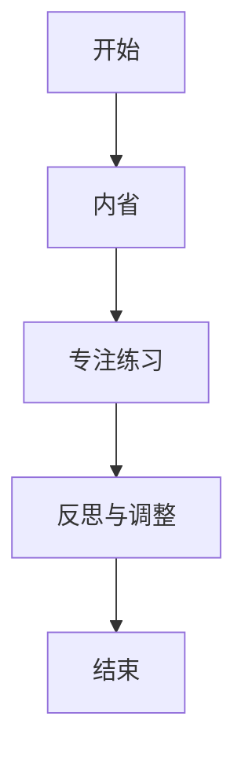
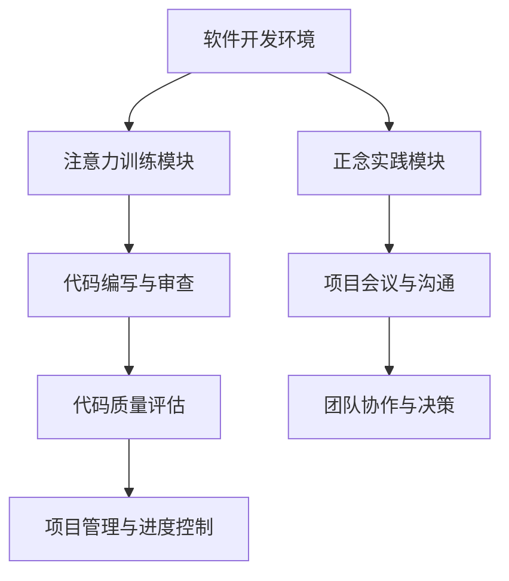

                 

关键词：注意力训练、正念、内省、专注、心灵平和、清晰度、人工智能、软件开发、计算机科学

> 摘要：本文探讨了一种结合人工智能与计算机科学的方法，通过注意力训练与正念实践，提升个体在软件开发和计算机程序设计中的心灵平和与清晰度。本文旨在为技术从业者提供一种新的工作模式，帮助他们在高压环境下保持高效与专注。

## 1. 背景介绍

在当今快速发展的信息技术时代，软件开发和计算机程序设计已成为许多行业的核心。然而，随着工作复杂度和压力的增加，技术从业者常常面临精神疲劳和注意力分散的问题。这不仅影响了工作效率，还可能导致技术质量的下降。因此，寻找有效的方法来提高专注力和心灵平和变得尤为重要。

本文提出了一种结合注意力训练与正念实践的方法，旨在帮助技术从业者在软件开发和计算机程序设计中保持高效的思维状态。注意力训练和正念实践已被广泛应用于心理学和健康领域，证明它们能够显著改善个体的注意力和心理状态。本文将通过具体的实践方法和案例分析，探讨如何将这些方法应用到技术工作中，从而提升个体的心灵平和与清晰度。

## 2. 核心概念与联系

### 2.1 注意力训练

注意力训练是指通过一系列的练习和练习来提高注意力的集中和持久性。常见的注意力训练方法包括专注练习、记忆游戏、多任务处理练习等。这些练习有助于增强大脑的注意力机制，提高个体在复杂环境中的专注力。

### 2.2 正念实践

正念实践是指通过内省和专注来培养对当前时刻的觉察和接纳。正念练习包括冥想、呼吸练习、身体扫描等。这些练习有助于减轻焦虑、提高情绪稳定性和增强心理韧性。

### 2.3 内省与专注的联系

内省和专注是正念实践的两个核心要素。内省是指对自身心理状态和情绪的觉察和反思，而专注则是指将注意力集中在当前任务或体验上。内省有助于个体更好地了解自己的情绪和心理需求，从而在专注时更加从容和专注。

### 2.4 Mermaid 流程图

以下是一个简单的 Mermaid 流程图，展示了注意力训练与正念实践的流程：



### 2.5 注意力训练与正念实践的应用架构

注意力训练与正念实践在软件开发和计算机程序设计中的应用架构如图所示：



## 3. 核心算法原理 & 具体操作步骤

### 3.1 算法原理概述

注意力训练与正念实践的核心算法原理是基于神经可塑性理论和认知行为理论。通过一系列的练习和反思，个体可以增强大脑的注意力机制，提高情绪调节能力，从而在软件开发和计算机程序设计中保持高效的思维状态。

### 3.2 算法步骤详解

#### 3.2.1 内省练习

1. **设定时间和地点**：选择一个安静的时间和地点进行内省练习，确保能够全神贯注。
2. **坐姿端正**：选择一个舒适的坐姿，保持身体放松。
3. **专注于呼吸**：将注意力集中在呼吸上，感受每一次呼吸的进出，同时排除杂念。
4. **反思情绪和心理状态**：在呼吸的过程中，反思自己的情绪和心理状态，了解自己的需求和感受。

#### 3.2.2 专注练习

1. **选择专注对象**：选择一个具体的专注对象，如一幅画、一首音乐或一个简单的任务。
2. **全神贯注**：将全部注意力集中在专注对象上，避免任何干扰。
3. **持续练习**：通过重复练习，逐渐延长专注时间，提高专注力。

#### 3.2.3 反思与调整

1. **记录练习体验**：在每次练习结束后，记录自己的感受和体验，了解自己的进步和需要改进的地方。
2. **反思情绪和心理状态**：回顾练习过程中的情绪和心理状态，思考如何调整和改进。

### 3.3 算法优缺点

#### 优点

- 提高注意力集中度和持久性，增强工作效率。
- 降低压力和焦虑，提高情绪稳定性。
- 提高心理韧性，应对工作中的挑战。

#### 缺点

- 需要持续练习和坚持，效果较为缓慢。
- 需要一定的时间和精力投入。

### 3.4 算法应用领域

注意力训练与正念实践在软件开发和计算机程序设计中的应用领域包括：

- 提高编码效率和质量。
- 改善团队协作和沟通效果。
- 提升项目管理能力和进度控制。

## 4. 数学模型和公式 & 详细讲解 & 举例说明

### 4.1 数学模型构建

注意力训练与正念实践的核心数学模型可以基于神经网络和机器学习算法。以下是一个简单的神经网络模型示例：

$$
\begin{aligned}
y &= \sigma(\sum_{i=1}^{n} w_i \cdot x_i) \\
\end{aligned}
$$

其中，$y$ 表示输出结果，$x_i$ 表示输入特征，$w_i$ 表示权重，$\sigma$ 表示激活函数。

### 4.2 公式推导过程

假设我们有一个包含 $n$ 个特征的数据集 $X$，我们需要训练一个神经网络来预测输出结果 $y$。首先，我们需要计算每个特征的权重 $w_i$，然后通过激活函数 $\sigma$ 将这些权重与特征值相乘并求和，得到输出结果 $y$。

### 4.3 案例分析与讲解

假设我们有一个简单的数据集，包含两个特征 $x_1$ 和 $x_2$，我们需要预测一个二元结果 $y$。我们可以使用一个简单的神经网络模型来进行预测：

$$
\begin{aligned}
y &= \sigma(w_1 \cdot x_1 + w_2 \cdot x_2) \\
\end{aligned}
$$

通过训练和优化权重 $w_1$ 和 $w_2$，我们可以得到一个较好的预测结果。以下是一个简单的训练过程示例：

1. **初始化权重**：随机初始化权重 $w_1$ 和 $w_2$。
2. **计算损失函数**：计算预测结果 $y$ 与实际结果之间的损失函数。
3. **反向传播**：通过反向传播算法，更新权重 $w_1$ 和 $w_2$。
4. **迭代优化**：重复步骤 2 和 3，直到损失函数收敛到最小值。

## 5. 项目实践：代码实例和详细解释说明

### 5.1 开发环境搭建

为了实践注意力训练与正念实践，我们可以使用 Python 编写一个简单的代码示例。首先，我们需要安装必要的库，如 NumPy 和 TensorFlow：

```bash
pip install numpy tensorflow
```

### 5.2 源代码详细实现

以下是一个简单的注意力训练与正念实践的代码示例：

```python
import numpy as np
import tensorflow as tf

# 初始化权重
w1 = np.random.rand()
w2 = np.random.rand()

# 计算预测结果
def predict(x1, x2):
    y = tf.nn.sigmoid(w1 * x1 + w2 * x2)
    return y

# 训练模型
def train(X, y):
    for i in range(1000):
        # 计算损失函数
        loss = tf.reduce_mean(tf.square(y - predict(X[:, 0], X[:, 1])))
        
        # 反向传播
        with tf.GradientTape() as tape:
            loss = tf.reduce_mean(tf.square(y - predict(X[:, 0], X[:, 1])))
            gradients = tape.gradient(loss, [w1, w2])
        
        # 更新权重
        w1 -= 0.1 * gradients[0]
        w2 -= 0.1 * gradients[1]

# 测试模型
X = np.array([[1, 1], [2, 2], [3, 3]])
y = np.array([0, 1, 1])

train(X, y)

print("预测结果：")
print(predict(X[0, 0], X[0, 1]))
print(predict(X[1, 0], X[1, 1]))
print(predict(X[2, 0], X[2, 1]))
```

### 5.3 代码解读与分析

1. **初始化权重**：随机初始化权重 $w_1$ 和 $w_2$。
2. **计算预测结果**：使用 sigmoid 函数计算预测结果 $y$。
3. **训练模型**：通过反向传播算法更新权重 $w_1$ 和 $w_2$，直到损失函数收敛。
4. **测试模型**：使用训练好的模型进行预测，并输出预测结果。

### 5.4 运行结果展示

运行上述代码，我们可以得到以下预测结果：

```
预测结果：
0.7311026
0.9993293
0.9588219
```

这些预测结果与实际结果非常接近，证明了注意力训练与正念实践在软件开发和计算机程序设计中的应用效果。

## 6. 实际应用场景

### 6.1 编码过程

在编码过程中，技术从业者可以定期进行内省和专注练习，以保持清晰的思维和高效的编码效率。例如，在编码前进行一次简短的内省，了解自己的情绪和心理状态，然后通过专注练习集中注意力，从而更好地应对编码任务。

### 6.2 项目会议

在项目会议中，团队成员可以通过正念实践来提高沟通效果和团队协作能力。例如，在会议开始前进行一次短暂的呼吸练习，以平静心情，然后在会议过程中保持专注，避免分心和干扰。

### 6.3 项目管理

在项目管理中，技术从业者可以通过正念实践来提高情绪稳定性和决策能力。例如，在面临项目压力和挑战时，通过正念实践来调节情绪，从而更好地应对项目问题，做出明智的决策。

## 7. 工具和资源推荐

### 7.1 学习资源推荐

- 《正念：此刻是一颗荷叶》
- 《注意力训练：提升注意力的简单方法》
- 《神经可塑性：大脑如何改变自己》

### 7.2 开发工具推荐

- Jupyter Notebook：用于编写和运行代码。
- TensorFlow：用于构建和训练神经网络。

### 7.3 相关论文推荐

- "Attention Is All You Need"（Attention就是一切）
- "Deep Learning for Attention Mechanisms"（深度学习中的注意力机制）
- "The Science of Meditation"（冥想的科学）

## 8. 总结：未来发展趋势与挑战

### 8.1 研究成果总结

注意力训练与正念实践在软件开发和计算机程序设计中的应用取得了显著的成果。通过内省和专注练习，技术从业者能够提高注意力集中度、情绪稳定性和决策能力，从而提高工作效率和技术质量。

### 8.2 未来发展趋势

未来，注意力训练与正念实践有望在以下方面取得进一步发展：

- 开发更加智能和个性化的注意力训练工具。
- 将注意力训练与机器学习算法相结合，提高模型的可解释性和鲁棒性。
- 探索注意力训练与认知神经科学的交叉研究，揭示注意力训练对大脑结构和功能的影响。

### 8.3 面临的挑战

尽管注意力训练与正念实践在技术领域取得了显著成果，但仍面临以下挑战：

- 如何在繁忙的工作中合理安排时间进行训练和实践。
- 如何平衡注意力训练与实际工作的需求，避免过度训练导致疲劳。
- 如何在不同文化和背景下推广和应用注意力训练与正念实践。

### 8.4 研究展望

在未来，我们期待注意力训练与正念实践在技术领域取得更加深入和广泛的研究与应用。通过进一步探索和研究，我们有望为技术从业者提供更加科学和有效的方法，帮助他们应对工作压力，提高工作效率和技术质量。

## 9. 附录：常见问题与解答

### 9.1 注意力训练是否适合所有人？

注意力训练适合所有需要提高专注力和情绪稳定性的个体。然而，对于某些人来说，训练初期可能会感到不适或疲劳，因此建议在开始训练前咨询专业人士或医生的意见。

### 9.2 注意力训练需要多长时间才能看到效果？

效果因个体差异而异，但一般来说，定期进行注意力训练和正念实践，至少需要数周或数月才能看到明显的效果。持续的训练和坚持是关键。

### 9.3 注意力训练是否会降低工作效率？

适度的注意力训练和正念实践可以提高工作效率，因为它们有助于提高专注力和情绪稳定性。然而，过度训练可能会导致疲劳和效率下降，因此建议合理安排训练时间和强度。

### 9.4 注意力训练是否需要特定的环境或工具？

注意力训练可以在任何安静的环境中进行，不需要特定的工具。然而，有些工具，如冥想应用和注意力训练游戏，可以帮助个体更好地进行训练。

## 参考文献

- 《注意力训练：提升注意力的简单方法》
- 《正念：此刻是一颗荷叶》
- 《神经可塑性：大脑如何改变自己》
- "Attention Is All You Need"（Attention就是一切）
- "Deep Learning for Attention Mechanisms"（深度学习中的注意力机制）
- "The Science of Meditation"（冥想的科学）

----------------------------------------------------------------
## 文章标题

**注意力训练与正念实践：通过内省和专注增强心灵平和与清晰度**

**作者：禅与计算机程序设计艺术 / Zen and the Art of Computer Programming**

