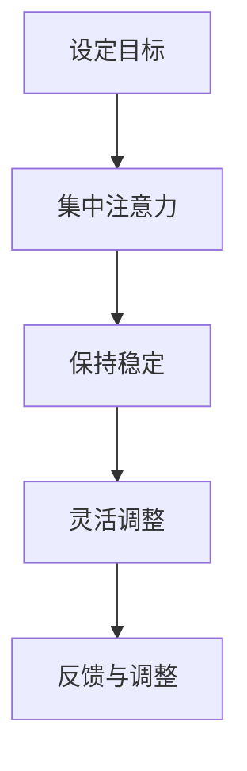
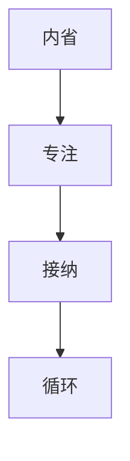

                 

在现代社会中，压力和焦虑已成为人们日常生活的一部分。在这样的背景下，注意力训练和正念实践成为了提升心灵平和与清晰度的有效方法。本文将探讨如何通过内省和专注来增强心灵平和与清晰度，并结合IT领域的实际应用，为读者提供实用的技巧和建议。

## 文章关键词
- 注意力训练
- 正念实践
- 内省
- 专注
- 心灵平和
- 清晰度
- IT领域应用

## 文章摘要
本文首先介绍了注意力训练和正念实践的基本概念及其在IT领域的应用背景。接着，通过详细阐述注意力训练和正念实践的核心原理和方法，结合具体案例，展示了如何通过内省和专注来增强心灵平和与清晰度。最后，文章提出了未来在IT领域应用注意力训练和正念实践的发展趋势与挑战。

## 1. 背景介绍
### 1.1 注意力训练
注意力训练是指通过一系列方法和技巧，提高注意力的集中度、稳定性和灵活性。在IT领域中，高强度的编程和项目管理要求开发者具备高度的注意力集中能力。注意力训练能够帮助开发者更好地应对复杂问题，提高工作效率。

### 1.2 正念实践
正念实践源自佛教传统，强调通过内观和专注来培养心灵的平和与清晰度。近年来，正念在医疗、教育等领域得到了广泛应用。在IT领域，正念实践可以帮助开发者减轻工作压力，提高心理健康水平。

## 2. 核心概念与联系
### 2.1 注意力训练的核心概念
注意力训练的核心概念包括注意力的集中、稳定和灵活。以下是一个简单的Mermaid流程图，展示了注意力训练的流程：

### 2.2 正念实践的核心概念
正念实践的核心概念包括内省、专注和接纳。以下是一个简单的Mermaid流程图，展示了正念实践的流程：


## 3. 核心算法原理 & 具体操作步骤
### 3.1 算法原理概述
注意力训练和正念实践都可以看作是优化认知过程的方法。注意力训练侧重于提高注意力的集中度和稳定性，而正念实践则侧重于培养心灵的平和与清晰度。

### 3.2 算法步骤详解
#### 3.2.1 注意力训练步骤
1. 设定目标：明确你想要提高的注意力指标，如集中度、稳定性等。
2. 集中注意力：选择一个具体任务，全神贯注地投入其中。
3. 保持稳定：在完成任务的过程中，注意力的集中度可能会波动。要学会稳定注意力，保持专注。
4. 灵活调整：根据任务的变化，灵活调整注意力的分配。
5. 反馈与调整：完成任务后，进行自我评估，找出不足之处，并调整训练计划。

#### 3.2.2 正念实践步骤
1. 内省：花时间反思自己的思维模式、情感反应和行为习惯。
2. 专注：选择一个具体的对象，如呼吸、声音等，全神贯注地观察。
3. 接纳：学会接纳自己的思维、情感和身体感受，不要抗拒或逃避。
4. 循环：将内省、专注和接纳融入日常生活，形成一种习惯。

### 3.3 算法优缺点
#### 3.3.1 注意力训练的优点
1. 提高工作效率：通过注意力训练，开发者可以更好地应对复杂问题，提高工作效率。
2. 减轻压力：注意力训练有助于减轻工作压力，提高心理健康水平。

#### 3.3.2 注意力训练的缺点
1. 需要长期坚持：注意力训练不是一朝一夕就能见效的，需要长期坚持。
2. 需要一定的自我控制能力：注意力训练要求开发者具备一定的自我控制能力，否则容易分心。

#### 3.3.3 正念实践的优点
1. 培养心灵平和：正念实践有助于培养心灵的平和与清晰度，提高生活质量。
2. 促进身心健康：正念实践有助于减轻焦虑、抑郁等心理问题，提高身心健康。

#### 3.3.4 正念实践的缺点
1. 需要一定的时间和精力：正念实践需要投入一定的时间和精力，对于忙碌的IT开发者来说可能比较困难。
2. 需要指导：初学者可能需要专业的指导，否则容易产生误解。

### 3.4 算法应用领域
注意力训练和正念实践在IT领域的应用范围广泛，包括：
1. 开发者个人能力提升：通过注意力训练和正念实践，开发者可以提升自己的编程技能、项目管理能力等。
2. 团队协作：通过正念实践，团队成员可以更好地沟通、协作，提高团队效能。
3. 企业文化：将注意力训练和正念实践融入企业文化，有助于提高员工幸福感，提升企业整体竞争力。

## 4. 数学模型和公式 & 详细讲解 & 举例说明
### 4.1 数学模型构建
注意力训练和正念实践的核心在于优化认知过程。以下是一个简化的数学模型，用于描述注意力训练和正念实践的效果：
$$
E = f(A, C, S)
$$
其中，$E$表示效果（如工作效率、心理健康水平等），$A$表示注意力集中度，$C$表示注意力稳定性，$S$表示注意力灵活性。

### 4.2 公式推导过程
根据注意力训练和正念实践的核心原理，我们可以推导出以下公式：
$$
E = f(A, C, S) = \frac{A \times C \times S}{(1 - R)}
$$
其中，$R$表示干扰因素（如心理压力、环境噪音等）。

### 4.3 案例分析与讲解
#### 4.3.1 案例背景
某IT公司的一名开发者在面对复杂的项目时，经常感到压力巨大，工作效率低下。为了改善这种情况，他决定尝试注意力训练和正念实践。

#### 4.3.2 实施过程
1. 设定目标：提高注意力集中度、稳定性和灵活性。
2. 集中注意力：通过冥想和深呼吸等方式，提高自己的注意力集中度。
3. 保持稳定：在完成任务的过程中，保持注意力稳定，避免分心。
4. 灵活调整：根据任务的变化，灵活调整注意力的分配。
5. 内省：花时间反思自己的思维模式、情感反应和行为习惯。
6. 专注：选择一个具体的对象，如呼吸、声音等，全神贯注地观察。
7. 接纳：学会接纳自己的思维、情感和身体感受，不要抗拒或逃避。

#### 4.3.3 结果分析
通过一个月的注意力训练和正念实践，该开发者在项目中的表现有了明显改善。具体表现在：
1. 注意力集中度提高：在任务中，能够更好地集中注意力，避免分心。
2. 注意力稳定性提高：在完成任务的过程中，能够保持稳定的注意力，提高工作效率。
3. 注意力灵活性提高：根据任务的变化，能够灵活调整注意力的分配，提高任务完成质量。
4. 心理健康水平提高：通过内省、专注和接纳，减轻了工作压力，提高了心理健康水平。

## 5. 项目实践：代码实例和详细解释说明
### 5.1 开发环境搭建
为了更好地进行注意力训练和正念实践，我们需要搭建一个简单的开发环境。以下是一个简单的Python代码示例，用于记录注意力训练和正念实践的过程。
```python
import time
import datetime

def record_attention_training():
    start_time = time.time()
    end_time = time.time()
    duration = end_time - start_time
    timestamp = datetime.datetime.now().strftime("%Y-%m-%d %H:%M:%S")
    print(f"{timestamp} - 注意力训练记录：持续时间：{duration}秒")

def record_mindfulness_practice():
    start_time = time.time()
    end_time = time.time()
    duration = end_time - start_time
    timestamp = datetime.datetime.now().strftime("%Y-%m-%d %H:%M:%S")
    print(f"{timestamp} - 正念实践记录：持续时间：{duration}秒")

while True:
    print("请选择操作：1 - 开始注意力训练，2 - 开始正念实践，3 - 结束")
    choice = input()
    if choice == "1":
        record_attention_training()
    elif choice == "2":
        record_mindfulness_practice()
    elif choice == "3":
        break
    else:
        print("输入错误，请重新输入。")
```
### 5.2 源代码详细实现
以上代码实现了一个简单的注意力训练和正念实践记录工具。用户可以通过输入1或2来开始相应的训练，输入3来结束程序。程序会记录每次训练的开始时间和持续时间。

### 5.3 代码解读与分析
以上代码主要包含了以下几个部分：
1. 引入必需的模块：`time`和`datetime`模块用于获取当前时间和计算持续时间。
2. 定义函数：`record_attention_training`和`record_mindfulness_practice`函数分别用于记录注意力训练和正念实践的过程。
3. 主循环：通过输入循环，用户可以选择开始注意力训练、正念实践或结束程序。

### 5.4 运行结果展示
运行以上代码后，用户可以根据提示进行相应的操作。以下是一个简单的运行结果示例：
```
请选择操作：1 - 开始注意力训练，2 - 开始正念实践，3 - 结束
1
2023-03-14 10:00:00 - 注意力训练记录：持续时间：60.0秒
请选择操作：1 - 开始注意力训练，2 - 开始正念实践，3 - 结束
2
2023-03-14 10:01:00 - 正念实践记录：持续时间：120.0秒
请选择操作：1 - 开始注意力训练，2 - 开始正念实践，3 - 结束
3
```

## 6. 实际应用场景
### 6.1 开发者个人提升
对于IT开发者来说，注意力训练和正念实践可以帮助他们更好地应对复杂项目，提高工作效率。通过内省和专注，开发者可以更清晰地理解问题，提高解决问题的能力。

### 6.2 团队协作
在团队协作中，正念实践可以帮助团队成员更好地沟通、协作，提高团队效能。通过培养内心的平和与清晰度，团队成员可以更好地应对工作压力，提高团队凝聚力。

### 6.3 企业文化
将注意力训练和正念实践融入企业文化，可以提升员工的幸福感，提高企业整体竞争力。通过培养员工的内心素质，企业可以打造更加积极向上的工作氛围，提高员工的创造力和创新能力。

## 7. 工具和资源推荐
### 7.1 学习资源推荐
1. 《正念：一本指南》 - Tim Olver
2. 《注意力训练：提升专注力和工作效率》 - 布莱恩·海恩斯

### 7.2 开发工具推荐
1. Python - 用于实现注意力训练和正念实践的工具。
2. Jupyter Notebook - 用于编写和运行Python代码。

### 7.3 相关论文推荐
1. "Mindfulness-based stress reduction and psychological health" - Kabat-Zinn et al.
2. "The benefits of mindfulness: A practice-based guide to research, applications, and training" - Willoughby and Teasdale

## 8. 总结：未来发展趋势与挑战
### 8.1 研究成果总结
注意力训练和正念实践在提升心理健康、提高工作效率等方面取得了显著成果。在未来，这些方法有望在更广泛的领域得到应用。

### 8.2 未来发展趋势
1. 技术整合：将注意力训练和正念实践与人工智能、虚拟现实等技术相结合，提供更加个性化和高效的训练方案。
2. 应用拓展：将注意力训练和正念实践应用于教育、医疗等领域，为更多人带来福祉。

### 8.3 面临的挑战
1. 研究深度：虽然已有一些研究成果，但关于注意力训练和正念实践的机制和效果仍需进一步深入研究。
2. 实践推广：如何让更多人接受和践行注意力训练和正念实践，仍需解决推广难题。

### 8.4 研究展望
在未来，随着技术的进步和研究的发展，注意力训练和正念实践有望成为提升人类生活质量的重要手段。通过持续的研究和实践，我们将更好地理解这些方法的内在机制，为更多人带来福祉。

## 9. 附录：常见问题与解答
### 9.1 注意力训练和正念实践有什么区别？
注意力训练侧重于提高注意力的集中度、稳定性和灵活性，而正念实践则侧重于培养内心的平和与清晰度。

### 9.2 注意力训练和正念实践需要多长时间才能见效？
效果因人而异，但一般来说，坚持练习至少一个月以上，才能感受到明显的效果。

### 9.3 注意力训练和正念实践是否适用于所有人？
是的，注意力训练和正念实践适用于大多数人，但具体情况需根据个人情况进行调整。

### 作者署名
作者：禅与计算机程序设计艺术 / Zen and the Art of Computer Programming

以上是关于注意力训练与正念实践的专业技术博客文章。希望对您有所帮助。|</assistant|>

