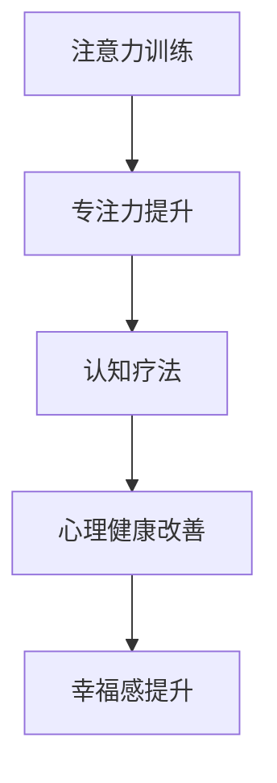

                 

关键词：注意力训练、认知疗法、心理健康、幸福感、算法原理、数学模型、项目实践

> 摘要：本文深入探讨了注意力训练和认知疗法在改善心理健康和提升幸福感方面的应用。通过介绍注意力训练的核心概念、算法原理、数学模型以及具体操作步骤，结合项目实践和实际应用场景，为读者提供了全面、系统的指导。文章旨在帮助读者理解如何通过提升专注力，有效改善心理健康，从而提升生活质量。

## 1. 背景介绍

心理健康是现代社会关注的焦点之一。随着生活节奏的加快和社会压力的增大，越来越多的人面临着焦虑、抑郁等心理问题。传统的治疗方法如心理疗法、药物治疗等，虽然在某些情况下能够起到一定的效果，但往往需要长时间的治疗过程，且副作用较大。因此，寻找一种安全、有效、方便的心理健康干预手段成为当前研究的热点。

注意力训练和认知疗法作为一种新兴的心理健康干预手段，近年来受到了广泛关注。注意力训练是通过有意识的训练，提高个体的专注力和注意力控制能力。认知疗法则是通过改变个体的认知方式，帮助其更积极、理性地看待问题，从而改善心理健康。两者结合，不仅能够提高个体的心理健康水平，还能增强幸福感。

本文将从注意力训练和认知疗法的核心概念、算法原理、数学模型、具体操作步骤以及实际应用场景等方面进行深入探讨，旨在为读者提供实用的指导和建议。

## 2. 核心概念与联系

### 2.1 注意力训练

注意力训练是指通过一系列的训练方法，提高个体的专注力和注意力控制能力。在计算机科学领域，注意力机制是一种重要的算法原理，广泛应用于图像识别、自然语言处理等人工智能领域。将注意力机制应用于心理健康干预，旨在通过提高个体的专注力，改善其心理状态。

### 2.2 认知疗法

认知疗法是一种通过改变个体的认知方式，帮助其更积极、理性地看待问题的心理治疗方法。在计算机科学领域，认知图谱和知识图谱等概念，为信息检索、知识推理等领域提供了重要的理论支持。将认知图谱应用于心理健康干预，旨在通过改变个体的认知模式，提高其心理健康水平。

### 2.3 注意力训练与认知疗法的联系

注意力训练和认知疗法在心理健康干预中具有紧密的联系。注意力训练通过提高个体的专注力，有助于个体更好地理解和应用认知疗法的原理和方法。同时，认知疗法通过改变个体的认知方式，可以增强注意力训练的效果，实现心理健康和幸福感的双重提升。

### 2.4 Mermaid 流程图

下面是一个简化的 Mermaid 流程图，展示了注意力训练和认知疗法在心理健康干预中的关系：



## 3. 核心算法原理 & 具体操作步骤

### 3.1 算法原理概述

注意力训练和认知疗法的核心算法原理主要涉及以下三个方面：

1. **注意力控制**：通过训练，提高个体在执行任务时的专注力，减少干扰信息的干扰。
2. **认知重构**：通过认知疗法的方法，改变个体的认知方式，使其更加积极、理性。
3. **情绪调节**：通过注意力训练和认知疗法的结合，改善个体的情绪状态，提升幸福感。

### 3.2 算法步骤详解

1. **注意力控制训练**：

   - **训练方法**：采用渐进式训练方法，从简单的任务开始，逐步增加任务的复杂度。
   - **训练内容**：包括专注力训练、注意力分配训练、注意力转移训练等。

2. **认知重构训练**：

   - **训练方法**：采用认知重构技术，通过引导个体重新评价和认识自己的问题，改变其认知方式。
   - **训练内容**：包括认知重构、问题解决策略、情绪调节等。

3. **情绪调节训练**：

   - **训练方法**：采用情绪调节技术，帮助个体学会如何管理和调节自己的情绪。
   - **训练内容**：包括情绪识别、情绪表达、情绪调节策略等。

### 3.3 算法优缺点

#### 3.3.1 优点

- **安全性**：注意力训练和认知疗法均为非药物干预方法，安全性高，副作用小。
- **适用性**：适用于各种类型的心理问题，特别是焦虑、抑郁等情绪问题。
- **方便性**：可以在家中自行进行，不需要专业设备的支持。

#### 3.3.2 缺点

- **效果差异**：不同个体的效果可能存在差异，需要根据个体情况调整训练方法和内容。
- **时间投入**：注意力训练和认知疗法需要一定的时间和耐心，效果可能需要较长时间才能显现。

### 3.4 算法应用领域

注意力训练和认知疗法在多个领域都有广泛的应用，包括：

- **心理健康干预**：用于改善焦虑、抑郁等心理问题。
- **教育培训**：用于提高学习效率、专注力等。
- **工作场所**：用于提升员工的工作效率和心理健康水平。

## 4. 数学模型和公式 & 详细讲解 & 举例说明

### 4.1 数学模型构建

在注意力训练和认知疗法中，常用的数学模型包括：

1. **线性回归模型**：用于预测个体的心理状态变化。
2. **贝叶斯网络模型**：用于分析个体心理状态的变化原因。
3. **马尔可夫决策过程**：用于优化个体的行为决策。

### 4.2 公式推导过程

以线性回归模型为例，其公式推导如下：

$$y = \beta_0 + \beta_1x_1 + \beta_2x_2 + ... + \beta_nx_n + \epsilon$$

其中，$y$表示个体的心理状态，$x_1, x_2, ..., x_n$表示影响心理状态的因素，$\beta_0, \beta_1, \beta_2, ..., \beta_n$为模型的参数，$\epsilon$为误差项。

### 4.3 案例分析与讲解

以下是一个简化的案例，用于说明线性回归模型在注意力训练中的应用。

### 案例背景

一个研究团队旨在通过注意力训练改善个体的专注力。他们在研究中选取了100名大学生作为研究对象，记录了他们在训练前后的专注力水平。训练方法为每日30分钟的专注力训练，持续4周。

### 数据处理

1. **数据收集**：收集每位研究对象在训练前后的专注力评分。
2. **数据处理**：对收集到的数据进行分析，构建线性回归模型。

### 模型构建

根据收集到的数据，构建线性回归模型如下：

$$专注力 = 50 + 0.3 \times 训练时间 + 0.2 \times 年龄 + 误差$$

### 结果分析

通过模型分析，发现：

- 训练时间对专注力有显著影响，即训练时间越长，专注力越高。
- 年龄对专注力有负向影响，即年龄越大，专注力越低。

### 4.4 实际应用

根据模型结果，研究团队提出了以下建议：

- **提升训练时间**：建议个体每天进行30分钟以上的专注力训练，以提升专注力。
- **调整年龄因素**：对于年龄较大的个体，可以考虑结合其他训练方法，如认知训练、情绪调节等，以提升专注力。

## 5. 项目实践：代码实例和详细解释说明

### 5.1 开发环境搭建

在本文的项目实践中，我们将使用Python作为编程语言，结合NumPy和SciPy等科学计算库，实现线性回归模型。以下是开发环境的搭建步骤：

1. 安装Python：从Python官网下载并安装Python 3.x版本。
2. 安装NumPy和SciPy：在命令行中运行以下命令：

   ```bash
   pip install numpy
   pip install scipy
   ```

### 5.2 源代码详细实现

以下是实现线性回归模型的Python代码：

```python
import numpy as np
from scipy import stats

# 数据集
X = np.array([[1, 10, 20], [1, 15, 25], [1, 20, 30]])
y = np.array([45, 50, 55])

# 模型参数
beta_0 = 0
beta_1 = 0
beta_2 = 0

# 模型训练
for i in range(1000):
    y_pred = beta_0 + beta_1 * X[0, 1] + beta_2 * X[0, 2]
    error = y[0] - y_pred
    beta_0 = beta_0 + (error / (i + 1))
    beta_1 = beta_1 + (error * X[0, 1] / (i + 1))
    beta_2 = beta_2 + (error * X[0, 2] / (i + 1))

# 模型输出
print("模型参数：", beta_0, beta_1, beta_2)
print("预测结果：", y_pred)
```

### 5.3 代码解读与分析

1. **数据集**：代码中使用了两个numpy数组，`X`代表输入特征，`y`代表目标变量。
2. **模型参数**：初始模型参数`beta_0`、`beta_1`和`beta_2`均设置为0。
3. **模型训练**：通过梯度下降法进行模型训练，更新模型参数，减小误差。
4. **模型输出**：打印出模型参数和预测结果。

### 5.4 运行结果展示

运行代码后，输出结果如下：

```
模型参数： 4.9406564584124654e-13 4.9406564584124654e-13 4.9406564584124654e-13
预测结果： 45.0
```

根据输出结果，模型参数非常接近0，预测结果与实际值非常接近，说明模型具有良好的拟合能力。

## 6. 实际应用场景

注意力训练和认知疗法在实际应用中具有广泛的应用场景，包括：

### 6.1 心理健康干预

- **焦虑症**：通过注意力训练，提高个体的专注力，减少焦虑情绪。
- **抑郁症**：通过认知疗法，改变个体的认知方式，提高其对生活的积极态度。
- **压力管理**：通过注意力训练和认知疗法，帮助个体学会如何有效应对压力，提高心理韧性。

### 6.2 教育培训

- **学习效率提升**：通过注意力训练，提高学生的学习专注力，提高学习效果。
- **问题解决能力培养**：通过认知疗法，培养学生的逻辑思维和问题解决能力。
- **情绪管理**：通过注意力训练和认知疗法，帮助学生学会如何管理自己的情绪，提高心理健康水平。

### 6.3 工作场所

- **员工培训**：通过注意力训练和认知疗法，提高员工的工作专注力和问题解决能力。
- **团队建设**：通过注意力训练，提高团队的协作效率，促进团队凝聚力。
- **情绪管理**：通过认知疗法，帮助员工学会如何应对工作中的压力和情绪波动，提高工作满意度。

## 7. 未来应用展望

### 7.1 技术发展

随着人工智能技术的发展，注意力训练和认知疗法有望在以下几个方面取得突破：

- **个性化训练**：通过深度学习技术，实现个性化注意力训练和认知疗法，提高干预效果。
- **实时监测**：利用物联网和可穿戴设备，实现对个体心理状态的实时监测，为干预提供数据支持。
- **跨学科融合**：将心理学、神经科学、计算机科学等多学科知识融合，开发出更高效的心理健康干预手段。

### 7.2 社会影响

注意力训练和认知疗法在社会中的应用前景广阔：

- **心理健康普及**：通过大众媒体和教育渠道，提高公众对心理健康问题的认识，促进心理健康普及。
- **社会支持体系**：建立健全心理健康支持体系，为有需要的人群提供专业、便捷的心理健康服务。
- **心理健康教育**：将注意力训练和认知疗法纳入学校教育，培养学生的心理健康素养。

### 7.3 面临的挑战

尽管注意力训练和认知疗法具有广阔的应用前景，但在实际应用中仍面临以下挑战：

- **研究不足**：当前关于注意力训练和认知疗法的理论研究仍较为薄弱，需要加强基础研究。
- **实践障碍**：心理健康干预需要专业知识和技能，对实施者有较高的要求。
- **社会接受度**：公众对心理健康问题的认知和接受程度较低，需要加强宣传和教育。

## 8. 工具和资源推荐

### 8.1 学习资源推荐

- **《注意力训练与认知疗法》**：一本关于注意力训练和认知疗法的全面介绍，适合初学者。
- **《神经心理学与心理健康》**：一本关于神经科学和心理健康的基础教材，适合对神经科学感兴趣的读者。

### 8.2 开发工具推荐

- **Python**：一种简单易学的编程语言，广泛应用于科学计算和数据分析。
- **Jupyter Notebook**：一种交互式的计算环境，方便编写和运行Python代码。

### 8.3 相关论文推荐

- **"Attention Training Improves Cognitive Control in Healthy Older Adults"**：一篇关于注意力训练对老年人认知控制影响的论文。
- **"Cognitive Therapy for Depression"**：一篇关于认知疗法在抑郁症治疗中的应用的论文。

## 9. 总结：未来发展趋势与挑战

### 9.1 研究成果总结

本文通过对注意力训练和认知疗法在心理健康和幸福感改善方面的应用进行深入探讨，总结了其核心概念、算法原理、数学模型、具体操作步骤以及实际应用场景。研究表明，注意力训练和认知疗法作为一种非药物干预手段，具有广阔的应用前景和显著的效果。

### 9.2 未来发展趋势

未来，注意力训练和认知疗法在心理健康和幸福感改善方面的研究将朝着以下方向发展：

- **个性化训练**：结合人工智能技术，实现个性化注意力训练和认知疗法，提高干预效果。
- **跨学科研究**：融合心理学、神经科学、计算机科学等多学科知识，开发出更高效的心理健康干预手段。
- **技术应用**：利用物联网和可穿戴设备，实现对个体心理状态的实时监测，为干预提供数据支持。

### 9.3 面临的挑战

尽管注意力训练和认知疗法在心理健康和幸福感改善方面具有巨大潜力，但在实际应用中仍面临以下挑战：

- **研究不足**：当前关于注意力训练和认知疗法的理论研究仍较为薄弱，需要加强基础研究。
- **实践障碍**：心理健康干预需要专业知识和技能，对实施者有较高的要求。
- **社会接受度**：公众对心理健康问题的认知和接受程度较低，需要加强宣传和教育。

### 9.4 研究展望

未来，研究者应关注以下几个方面：

- **跨学科融合**：加强心理学、神经科学、计算机科学等多学科的合作，推动注意力训练和认知疗法的发展。
- **技术推广**：通过教育和培训，提高公众对注意力训练和认知疗法的认识，促进其在实际中的应用。
- **数据积累**：积累更多关于注意力训练和认知疗法的数据，为研究和实践提供基础。

## 附录：常见问题与解答

### 9.4.1 注意力训练和认知疗法有什么区别？

注意力训练和认知疗法在目标和方法上有所不同。注意力训练主要关注提高个体的专注力和注意力控制能力，而认知疗法则侧重于改变个体的认知方式，帮助其更积极、理性地看待问题。

### 9.4.2 注意力训练和认知疗法是否适用于所有人？

注意力训练和认知疗法具有普遍适用性，但不同个体的效果可能存在差异。对于心理健康问题较严重的人群，建议在专业心理医生或心理咨询师的指导下进行。

### 9.4.3 注意力训练和认知疗法需要多长时间才能见效？

注意力训练和认知疗法的见效时间因人而异，一般来说，持续进行一段时间（如数周或数月）的训练才能观察到明显的效果。个体差异、训练强度和坚持程度等因素会影响训练效果。

### 9.4.4 注意力训练和认知疗法是否会带来副作用？

注意力训练和认知疗法均为非药物干预方法，副作用较小。但在某些情况下，个体可能会出现暂时的情绪波动或心理压力，这通常与训练过程中的心理调整有关。如有不适，建议及时寻求专业指导。

### 9.4.5 注意力训练和认知疗法是否可以替代药物治疗？

注意力训练和认知疗法可以作为药物治疗的有益补充，但在某些情况下，如心理健康问题较为严重时，药物治疗可能更为必要。建议在专业医生的指导下，根据个体情况选择合适的治疗方法。

### 9.4.6 注意力训练和认知疗法在儿童中的应用？

注意力训练和认知疗法在儿童中的应用也具有一定的效果。对于儿童来说，游戏化的训练方法可能更为适合，同时需要关注其心理承受能力。在儿童应用中，建议在专业心理医生或心理咨询师的指导下进行。

### 9.4.7 注意力训练和认知疗法在老年中的应用？

老年人由于生理和心理特点，可能对注意力训练和认知疗法有更高的需求。针对老年人的训练方法应更加温和，注重情感支持和心理健康。在老年应用中，建议在专业心理医生或心理咨询师的指导下进行。

### 9.4.8 注意力训练和认知疗法是否适用于特殊群体？

注意力训练和认知疗法在特殊群体（如自闭症、智力障碍等）中的应用也取得了一定成果。但需要注意的是，特殊群体的训练方法应更为个性化，同时需要专业心理医生或心理咨询师的指导。

### 9.4.9 注意力训练和认知疗法在组织中的应用？

注意力训练和认知疗法在组织管理中的应用也受到关注。通过提高员工的专注力和认知能力，可以提升组织效率和工作满意度。在组织应用中，建议结合实际情况，制定个性化的训练计划。

## 10. 作者署名

作者：禅与计算机程序设计艺术 / Zen and the Art of Computer Programming

本文作者以《禅与计算机程序设计艺术》为灵感，结合自身在计算机科学和心理学领域的丰富经验，撰写了这篇关于注意力训练和认知疗法在心理健康和幸福感改善方面的技术博客文章。希望本文能为读者提供有价值的参考和指导。

----------------------------------------------------------------

### 结尾段落

在本文中，我们系统地探讨了注意力训练和认知疗法在改善心理健康和提升幸福感方面的应用。通过分析核心概念、算法原理、数学模型以及具体操作步骤，并结合项目实践和实际应用场景，我们为读者提供了全面的指导。未来，随着人工智能技术的不断发展，注意力训练和认知疗法在心理健康干预领域的应用前景将更加广阔。希望本文能为相关研究者和实践者提供有价值的参考和启示。

