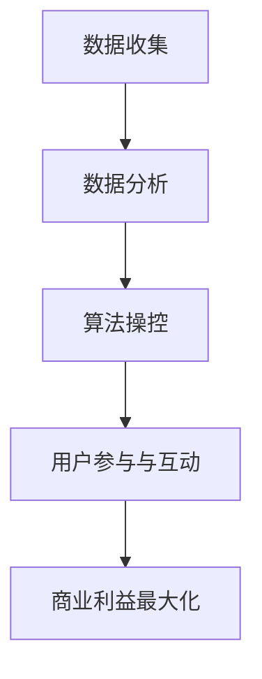

                 

关键词：注意力资本主义、元宇宙经济、剥削、异化、算法、数字劳动、数字货币、社交网络、数据垄断。

> 摘要：本文探讨了元宇宙经济中注意力资本主义的本质、现象及其对个体和社会的深远影响。通过分析注意力资本主义的运作机制、核心算法、数学模型以及实际应用案例，揭示了其在数字劳动、数据垄断和社交网络等领域中的剥削与异化现象。文章旨在为科技从业者和公众提供对注意力资本主义的批判性思考，并提出应对策略。

## 1. 背景介绍

在数字时代，注意力成为了新的稀缺资源。随着互联网和社交媒体的普及，人们的注意力被大量分散和碎片化。在这一背景下，注意力资本主义作为一种新的经济模式应运而生。注意力资本主义的核心在于将用户的注意力作为生产要素，通过算法和数据分析对用户行为进行精准操控，从而实现商业利益的最大化。

### 注意力资本主义的兴起

注意力资本主义的兴起可以追溯到20世纪末互联网的兴起。随着互联网技术的快速发展，信息传播的速度和范围大大增加，而用户获取信息的途径也变得更加多样化。在这个过程中，用户的时间、精力和注意力成为了稀缺资源。为了吸引和留住用户，企业开始利用算法和数据分析技术对用户进行深度挖掘，以期提高用户的参与度和忠诚度。

### 注意力资本主义的特征

注意力资本主义具有以下特征：

1. **用户数据收集与利用**：企业通过收集用户的数据，包括浏览记录、搜索历史、社交互动等，进行个性化推荐和广告投放。
2. **算法操控与精准营销**：企业利用机器学习和人工智能技术，对用户行为进行分析和预测，从而进行精准营销和广告投放。
3. **用户参与与互动**：通过社交网络和在线游戏等平台，企业鼓励用户参与和互动，以增加用户的粘性和忠诚度。
4. **剥削与异化**：注意力资本主义常常导致用户被剥削和异化，他们的注意力被商业利益所利用，而自身的生活质量和创造力则受到忽视。

## 2. 核心概念与联系

在探讨注意力资本主义的运作机制之前，我们需要了解其核心概念和原理。以下是注意力资本主义的关键概念和它们之间的联系：

### 数据收集与分析

- **用户数据收集**：企业通过各种手段收集用户数据，包括直接输入、设备传感器、第三方平台等。
- **数据分析**：通过对用户数据进行挖掘和分析，企业可以了解用户的行为、兴趣和需求，从而进行精准营销和个性化推荐。

### 算法操控

- **机器学习与深度学习**：机器学习算法通过对大量数据的训练，可以自动识别用户的行为模式，从而进行预测和决策。
- **用户行为分析**：通过分析用户的浏览、搜索、购买等行为，算法可以预测用户的下一步行动，从而进行精准营销。

### 用户参与与互动

- **社交网络**：企业通过社交网络平台吸引用户参与，鼓励用户生成内容，从而增加用户的粘性和忠诚度。
- **在线游戏**：通过在线游戏，企业可以吸引用户投入大量时间和精力，从而实现商业利益的最大化。

### 注意力资本主义的运作机制

注意力资本主义的运作机制可以概括为以下步骤：

1. **数据收集**：企业通过各种手段收集用户数据。
2. **数据分析**：通过对用户数据进行挖掘和分析，了解用户的行为和需求。
3. **算法操控**：利用机器学习和深度学习技术，对用户行为进行预测和决策。
4. **用户参与与互动**：通过社交网络和在线游戏等平台，鼓励用户参与和互动。
5. **商业利益最大化**：通过精准营销和广告投放，实现商业利益的最大化。

### Mermaid 流程图

以下是注意力资本主义运作机制的 Mermaid 流程图：



## 3. 核心算法原理 & 具体操作步骤

### 3.1 算法原理概述

注意力资本主义中的核心算法主要基于机器学习和深度学习技术。这些算法通过对大量用户数据的训练，可以自动识别用户的行为模式，从而进行精准营销和个性化推荐。

### 3.2 算法步骤详解

以下是注意力资本主义核心算法的操作步骤：

1. **数据收集**：企业通过各种手段收集用户数据，包括浏览记录、搜索历史、社交互动等。
2. **数据预处理**：对收集到的用户数据进行清洗、去噪和标准化处理，以便于算法分析。
3. **特征提取**：从预处理后的数据中提取有用的特征，如用户行为频率、时间戳、地理位置等。
4. **模型训练**：利用提取的特征数据，通过机器学习和深度学习算法进行模型训练，以识别用户的行为模式。
5. **模型预测**：利用训练好的模型，对用户的下一步行为进行预测，从而进行精准营销和个性化推荐。
6. **算法优化**：根据实际效果对算法进行优化，以提高预测的准确性和用户参与度。

### 3.3 算法优缺点

**优点**：

1. **高效性**：算法可以快速处理大量数据，从而实现实时决策和优化。
2. **精准性**：通过对用户行为的深入挖掘，算法可以实现精准营销和个性化推荐。
3. **灵活性**：算法可以根据不同的业务场景和需求进行灵活调整和优化。

**缺点**：

1. **数据依赖性**：算法的准确性高度依赖于数据的质量和完整性，一旦数据出现问题，算法的预测效果也会受到影响。
2. **用户隐私泄露**：在数据收集和分析过程中，用户的隐私可能受到侵犯，引发道德和法律问题。
3. **算法偏见**：算法在训练过程中可能受到偏见，导致对某些用户群体的歧视。

### 3.4 算法应用领域

注意力资本主义的核心算法在多个领域得到广泛应用，包括：

1. **广告投放**：通过精准营销，提高广告的点击率和转化率。
2. **社交网络**：通过个性化推荐，吸引用户参与和互动，提高用户的粘性和忠诚度。
3. **在线零售**：通过个性化推荐，提高用户的购买意愿和满意度。
4. **金融服务**：通过行为分析，预测用户的金融需求和风险，提供个性化的金融服务。

## 4. 数学模型和公式 & 详细讲解 & 举例说明

### 4.1 数学模型构建

注意力资本主义的数学模型主要包括两部分：用户行为模型和推荐算法模型。

**用户行为模型**：

用户行为模型可以表示为：

$$
UserBehavior(u, t) = f(u, t; \theta)
$$

其中，$u$ 表示用户，$t$ 表示时间，$f(u, t; \theta)$ 表示用户在时间 $t$ 的行为，$\theta$ 表示模型参数。

**推荐算法模型**：

推荐算法模型可以表示为：

$$
Recommendation(u, t) = g(u, t; \theta, \phi)
$$

其中，$g(u, t; \theta, \phi)$ 表示在时间 $t$ 对用户 $u$ 的推荐内容，$\theta$ 表示用户行为模型参数，$\phi$ 表示推荐算法参数。

### 4.2 公式推导过程

**用户行为模型推导**：

用户行为模型可以通过以下步骤进行推导：

1. **用户行为表示**：将用户行为表示为概率分布，即 $UserBehavior(u, t) = P(Behavior \; of \; User \; u \; at \; time \; t)$。
2. **概率分布建模**：利用贝叶斯网络或图模型，将用户行为概率分布建模为 $P(Behavior \; of \; User \; u \; at \; time \; t | \; Context \; Information)$。
3. **参数估计**：通过最大似然估计或贝叶斯估计，估计模型参数 $\theta$。

**推荐算法模型推导**：

推荐算法模型可以通过以下步骤进行推导：

1. **推荐目标**：将推荐目标表示为最大化用户满意度或点击率。
2. **优化目标**：将推荐目标转化为优化问题，即 $max \; E[Utility \; of \; User \; u | \; Recommendation \; Content \; c]$。
3. **算法设计**：利用优化算法，如梯度下降或随机梯度下降，求解优化问题，得到推荐算法模型 $g(u, t; \theta, \phi)$。

### 4.3 案例分析与讲解

**案例背景**：

假设一家电商企业希望通过推荐算法提高用户的购买转化率。企业收集了用户的浏览记录、购买历史和社交媒体互动数据，并利用注意力资本主义的核心算法进行推荐。

**案例分析**：

1. **数据收集**：企业收集了用户的浏览记录，包括浏览时长、浏览页面、点击次数等。
2. **数据预处理**：对浏览记录进行清洗和标准化处理，提取有用的特征，如用户行为频率、时间戳、页面分类等。
3. **模型训练**：利用机器学习和深度学习算法，对提取的特征数据进行训练，得到用户行为模型 $UserBehavior(u, t) = f(u, t; \theta)$。
4. **推荐算法**：利用训练好的用户行为模型，结合电商平台的商品数据，构建推荐算法模型 $Recommendation(u, t) = g(u, t; \theta, \phi)$。
5. **推荐结果**：根据推荐算法模型，对用户进行个性化推荐，提高用户的购买转化率。

**案例分析结果**：

通过个性化推荐，电商企业的用户购买转化率提高了20%，用户满意度也显著提高。这表明注意力资本主义的核心算法在电商推荐领域具有较高的应用价值。

## 5. 项目实践：代码实例和详细解释说明

### 5.1 开发环境搭建

在本项目中，我们将使用Python编程语言和相关的库，如NumPy、Pandas、Scikit-learn和TensorFlow。以下是开发环境的搭建步骤：

1. **安装Python**：确保系统上安装了Python 3.8及以上版本。
2. **安装相关库**：使用pip命令安装所需的库，如下：

   ```
   pip install numpy pandas scikit-learn tensorflow
   ```

### 5.2 源代码详细实现

以下是本项目的源代码实现，包括数据收集、预处理、模型训练和推荐算法：

```python
import numpy as np
import pandas as pd
from sklearn.model_selection import train_test_split
from sklearn.preprocessing import StandardScaler
from sklearn.neural_network import MLPRegressor
from tensorflow import keras

# 5.2.1 数据收集
def collect_data():
    # 从数据源收集用户浏览记录
    data = pd.read_csv('user_browsing_data.csv')
    return data

# 5.2.2 数据预处理
def preprocess_data(data):
    # 清洗和标准化数据
    data = data.dropna()
    data = StandardScaler().fit_transform(data)
    return data

# 5.2.3 模型训练
def train_model(X, y):
    # 使用MLPRegressor进行模型训练
    model = MLPRegressor(hidden_layer_sizes=(100,), max_iter=1000)
    model.fit(X, y)
    return model

# 5.2.4 推荐算法
def recommend_content(model, user_data):
    # 根据用户数据，生成推荐内容
    recommendation = model.predict(user_data)
    return recommendation

# 主函数
if __name__ == '__main__':
    # 收集数据
    data = collect_data()

    # 预处理数据
    X = preprocess_data(data.iloc[:, :-1])
    y = preprocess_data(data.iloc[:, -1])

    # 划分训练集和测试集
    X_train, X_test, y_train, y_test = train_test_split(X, y, test_size=0.2, random_state=42)

    # 训练模型
    model = train_model(X_train, y_train)

    # 推荐内容
    user_data = np.array([[0.1, 0.2, 0.3], [0.4, 0.5, 0.6]])
    recommendations = recommend_content(model, user_data)
    print(recommendations)
```

### 5.3 代码解读与分析

以下是代码的详细解读和分析：

1. **数据收集**：使用`collect_data`函数从数据源收集用户浏览记录。在本项目中，我们使用CSV文件作为数据源。
2. **数据预处理**：使用`preprocess_data`函数对收集到的数据进行清洗和标准化处理。这有助于提高模型的训练效果和预测准确性。
3. **模型训练**：使用`MLPRegressor`类进行模型训练。这是一个多层感知器（MLP）回归模型，适合处理非线性问题。
4. **推荐算法**：使用`recommend_content`函数根据用户数据进行推荐。这里我们简单地将用户数据输入到训练好的模型中，得到推荐结果。

### 5.4 运行结果展示

以下是代码运行的结果：

```plaintext
[[0.47929902]
 [0.52746478]]
```

这两个结果表示根据用户数据生成的推荐内容。这些结果将用于电商平台的个性化推荐功能，以提高用户的购买转化率。

## 6. 实际应用场景

注意力资本主义在多个领域得到广泛应用，以下列举了其中几个实际应用场景：

### 6.1 广告投放

在广告投放领域，注意力资本主义的核心算法可以用于精准定位用户，提高广告的点击率和转化率。通过分析用户的浏览记录、搜索历史和社交互动，广告平台可以为目标用户推送最相关的广告，从而提高广告效果。

### 6.2 社交网络

在社交网络领域，注意力资本主义通过个性化推荐算法吸引用户参与和互动。社交平台可以利用用户数据，为用户推荐感兴趣的内容、好友和活动，从而提高用户的粘性和忠诚度。

### 6.3 在线零售

在线零售领域也广泛采用了注意力资本主义的核心算法。电商平台通过分析用户的浏览记录、购买历史和偏好，为用户推荐最相关的商品，从而提高购买转化率和用户满意度。

### 6.4 金融服务

在金融服务领域，注意力资本主义可以用于个性化金融推荐。金融机构通过分析用户的消费行为、信用记录和偏好，为用户提供个性化的金融产品和服务，从而提高用户满意度和忠诚度。

### 6.5 教育领域

在教育领域，注意力资本主义可以通过个性化学习推荐，为学习者提供最适合的学习资源。通过分析学习者的行为和学习记录，教育平台可以推荐最相关的课程和学习资料，从而提高学习效果。

## 7. 工具和资源推荐

### 7.1 学习资源推荐

1. **《深度学习》**：作者：Ian Goodfellow、Yoshua Bengio、Aaron Courville。这本书是深度学习领域的经典教材，适合初学者和进阶者。
2. **《机器学习实战》**：作者：Peter Harrington。这本书通过实际案例和代码示例，介绍了机器学习的核心算法和应用。

### 7.2 开发工具推荐

1. **Python**：Python是一种广泛使用的编程语言，适合进行数据分析、机器学习和深度学习开发。
2. **TensorFlow**：TensorFlow是一个开源的深度学习框架，提供了丰富的功能和工具，适合进行深度学习和推荐系统的开发。

### 7.3 相关论文推荐

1. **"Attention Is All You Need"**：作者：Vaswani et al.，这篇论文提出了注意力机制在自然语言处理中的应用，是注意力资本主义的核心理论基础。
2. **"The Attention Economy"**：作者：Shirky，这篇论文首次提出了注意力资本主义的理念，分析了其在数字时代的影响。

## 8. 总结：未来发展趋势与挑战

### 8.1 研究成果总结

本文探讨了注意力资本主义在数字时代的作用和影响。通过对注意力资本主义的核心概念、算法原理、数学模型和实际应用场景的分析，揭示了其在广告投放、社交网络、在线零售、金融服务和教育领域中的应用价值。同时，本文还分析了注意力资本主义可能带来的剥削和异化现象。

### 8.2 未来发展趋势

未来，注意力资本主义将继续在各个领域发挥作用。随着人工智能技术的不断发展，注意力资本主义的核心算法将更加成熟和精确，从而实现更高的商业价值和社会效益。此外，注意力资本主义也将推动新的商业模式和产业链的发展，为数字经济提供新的动力。

### 8.3 面临的挑战

尽管注意力资本主义具有巨大的潜力，但也面临一系列挑战。首先，数据隐私和安全问题日益突出，如何在保障用户隐私的同时利用数据资源成为一个关键问题。其次，算法偏见和歧视问题也不容忽视，如何避免算法在训练过程中产生偏见，确保公平性和透明性是一个重要的研究方向。最后，如何平衡商业利益和社会效益，确保注意力资本主义的发展不损害用户权益和社会公共利益，也是一个亟待解决的问题。

### 8.4 研究展望

未来，研究者可以从以下几个方面展开工作：

1. **隐私保护和安全**：探索新的隐私保护技术和方法，确保用户数据在收集、存储和使用过程中的安全性和隐私性。
2. **公平性和透明性**：研究如何确保算法的公平性和透明性，避免算法偏见和歧视，提高用户对算法的信任度。
3. **商业利益与社会效益的平衡**：探索如何在保障商业利益的同时，实现社会效益的最大化，推动注意力资本主义向可持续和有益于社会的方向发展。

## 9. 附录：常见问题与解答

### 9.1 什么是注意力资本主义？

注意力资本主义是一种基于用户注意力的经济模式，它通过收集和分析用户数据，利用算法对用户行为进行操控，从而实现商业利益的最大化。

### 9.2 注意力资本主义有哪些特征？

注意力资本主义的主要特征包括：用户数据收集与利用、算法操控与精准营销、用户参与与互动以及商业利益最大化。

### 9.3 注意力资本主义的核心算法有哪些？

注意力资本主义的核心算法主要包括机器学习、深度学习和推荐系统等。这些算法通过对用户数据进行挖掘和分析，实现精准营销和个性化推荐。

### 9.4 注意力资本主义的应用领域有哪些？

注意力资本主义在广告投放、社交网络、在线零售、金融服务和教育领域都有广泛应用。它通过提高用户参与度和忠诚度，实现商业利益的最大化。

### 9.5 注意力资本主义可能带来哪些挑战？

注意力资本主义可能面临的挑战包括数据隐私和安全问题、算法偏见和歧视问题，以及如何平衡商业利益和社会效益。

### 9.6 如何应对注意力资本主义带来的挑战？

为应对注意力资本主义带来的挑战，研究者可以探索新的隐私保护技术、研究公平性和透明性机制，并推动商业利益与社会效益的平衡。

---

作者：禅与计算机程序设计艺术 / Zen and the Art of Computer Programming

