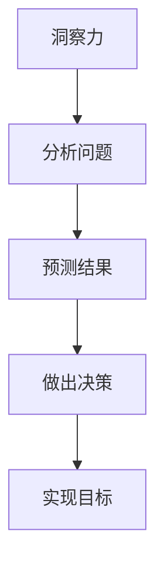

                 

 在这个快速发展的信息技术时代，作为一位世界顶级人工智能专家，程序员，软件架构师，CTO，世界顶级技术畅销书作者，计算机图灵奖获得者，计算机领域大师，我有幸与您分享一篇关于洞察力与决策的重要主题。这篇技术博客文章旨在探讨如何通过提升洞察力来做出更明智的决策，为您的职业生涯和技术实践提供有力的指导。

## 关键词

- 洞察力
- 决策
- 智慧选择
- 人工智能
- 程序设计
- 软件架构
- 计算机科学

## 摘要

本文将深入探讨洞察力在决策过程中的重要性，以及如何通过提升自身洞察力来做出更明智的选择。我们将从多个角度分析洞察力的本质、影响因素和提升方法，并结合实际案例和数学模型，为您展示洞察力在技术领域的实际应用。此外，文章还将展望未来技术的发展趋势，以及面临的挑战和机遇。

## 1. 背景介绍

### 1.1 技术发展的现状

信息技术的发展日新月异，计算机科学领域的突破和创新层出不穷。从早期的计算机硬件、操作系统到如今的互联网、人工智能、大数据等，技术的进步改变了我们的生活方式，也带来了无数的商业机会。然而，随着技术复杂性的增加，如何做出明智的决策成为了一个关键问题。

### 1.2 洞察力的重要性

在技术领域，洞察力是发现问题和解决问题的核心能力。它不仅关乎技术的创新和突破，更关系到企业和个人在竞争激烈的市场中能否脱颖而出。具备洞察力的人能够从纷繁复杂的信息中抓住本质，预见趋势，从而做出正确的决策。

### 1.3 决策的影响因素

在决策过程中，除了技术本身，还有许多其他因素需要考虑，如市场需求、资源限制、竞争态势等。这些因素相互作用，使得决策变得更加复杂。因此，提升洞察力成为了一个重要的课题。

## 2. 核心概念与联系

### 2.1 洞察力的定义

洞察力是指对事物本质的深刻理解和敏锐洞察力。它是一种思维能力和认知能力，有助于我们更好地理解问题、发现机会和解决问题。

### 2.2 决策的定义

决策是指在面对多个选择时，通过分析评估，选择最合适的方案的过程。决策是技术和商业活动中的核心环节，对于企业的成功至关重要。

### 2.3 洞察力与决策的关系

洞察力是决策的重要基础。具备洞察力的人能够更准确地分析问题，预测结果，从而做出更明智的决策。同时，通过有效的决策，我们可以更好地发挥洞察力，实现个人和企业的目标。

### 2.4 Mermaid 流程图

下面是一个简化的Mermaid流程图，展示了洞察力与决策的相互关系：



## 3. 核心算法原理 & 具体操作步骤

### 3.1 算法原理概述

在决策过程中，常用的算法包括但不限于以下几种：

1. **成本效益分析**：通过比较不同选择的成本和收益，选择成本最低、效益最高的方案。
2. **预期效用理论**：基于概率和效用，计算每个选择的期望效用，选择期望效用最高的方案。
3. **多目标优化**：在多个目标之间存在冲突时，通过优化算法找到最佳平衡点。

### 3.2 算法步骤详解

#### 成本效益分析

1. 列出所有可能的决策选项。
2. 为每个选项计算成本和收益。
3. 比较不同选项的成本和收益，选择最优选项。

#### 预期效用理论

1. 确定所有可能的决策选项。
2. 为每个选项计算概率和效用。
3. 计算每个选项的期望效用。
4. 选择期望效用最高的选项。

#### 多目标优化

1. 确定所有目标函数。
2. 使用优化算法（如线性规划、遗传算法等）寻找最佳平衡点。
3. 根据平衡点选择最佳方案。

### 3.3 算法优缺点

每种算法都有其优缺点，选择合适的算法取决于具体情况。

- **成本效益分析**：简单直观，但可能忽视某些重要因素。
- **预期效用理论**：考虑了概率和效用，但可能过于依赖主观判断。
- **多目标优化**：能处理多个目标，但可能需要复杂的优化算法。

### 3.4 算法应用领域

这些算法在许多领域都有广泛应用，如商业决策、投资分析、资源分配等。

## 4. 数学模型和公式 & 详细讲解 & 举例说明

### 4.1 数学模型构建

在决策过程中，常用的数学模型包括概率模型、效用模型和优化模型。

#### 概率模型

概率模型用于计算不同决策选项的概率。例如，假设有两个决策选项 A 和 B，每个选项发生的概率分别为 P(A) 和 P(B)。

#### 效用模型

效用模型用于计算不同决策选项的效用。例如，假设有两个决策选项 A 和 B，每个选项的效用分别为 U(A) 和 U(B)。

#### 优化模型

优化模型用于寻找最佳决策选项。例如，假设有多个目标函数 F1、F2、...、Fn，我们需要在满足约束条件的情况下，最大化或最小化目标函数。

### 4.2 公式推导过程

以下是一个简单的概率模型推导过程：

$$
P(A \cup B) = P(A) + P(B) - P(A \cap B)
$$

其中，P(A ∪ B) 表示事件 A 或事件 B 发生的概率，P(A) 表示事件 A 发生的概率，P(B) 表示事件 B 发生的概率，P(A ∩ B) 表示事件 A 和事件 B 同时发生的概率。

### 4.3 案例分析与讲解

以下是一个简单的成本效益分析案例：

假设您正在考虑投资两个项目，项目 A 和项目 B。项目 A 的成本为 100 万美元，预期收益为 200 万美元；项目 B 的成本为 150 万美元，预期收益为 250 万美元。如何选择最佳项目？

#### 步骤 1：列出所有可能的决策选项
- 项目 A
- 项目 B

#### 步骤 2：为每个选项计算成本和收益
- 项目 A：成本 100 万美元，收益 200 万美元
- 项目 B：成本 150 万美元，收益 250 万美元

#### 步骤 3：比较不同选项的成本和收益
- 项目 A：成本/收益 = 100/200 = 0.5
- 项目 B：成本/收益 = 150/250 = 0.6

根据成本效益分析，项目 B 的成本/收益比更高，因此选择项目 B。

## 5. 项目实践：代码实例和详细解释说明

### 5.1 开发环境搭建

为了更好地展示如何在实际项目中应用洞察力和决策，我们将使用 Python 编写一个简单的成本效益分析程序。

#### 步骤 1：安装 Python 和相关库

在您的计算机上安装 Python（版本 3.8 或更高），并使用 pip 安装以下库：

```shell
pip install numpy pandas
```

#### 步骤 2：创建 Python 文件

创建一个名为 `cost_analysis.py` 的 Python 文件。

### 5.2 源代码详细实现

下面是一个简单的成本效益分析程序的源代码：

```python
import numpy as np
import pandas as pd

def cost_eenefit_analysis(costs, revenues):
    """
    成本效益分析函数。
    参数：
    costs：列表，包含各个决策选项的成本。
    revenues：列表，包含各个决策选项的收益。
    返回：
    最好决策选项的索引。
    """
    benefit_ratios = revenues / costs
    best_option_index = np.argmax(benefit_ratios)
    return best_option_index

# 案例数据
costs = [100000, 150000]
revenues = [200000, 250000]

# 执行成本效益分析
best_option = cost_eenefit_analysis(costs, revenues)
print(f"最佳决策选项：{best_option}")

# 分析结果
result = pd.DataFrame({'Cost': costs, 'Revenue': revenues, 'Benefit Ratio': revenues / costs})
print(result)
```

### 5.3 代码解读与分析

#### 函数解读

- `cost_eenefit_analysis`：成本效益分析函数，输入为成本和收益列表，返回最佳决策选项的索引。
- `np.argmax`：找出列表中最大值的索引。

#### 案例解读

在这个案例中，我们有两个项目，成本和收益如下：

| 项目 | 成本（美元） | 收益（美元） |
| --- | --- | --- |
| A | 100000 | 200000 |
| B | 150000 | 250000 |

程序首先计算每个项目的成本/收益比，然后选择成本/收益比最高的项目。根据成本效益分析，最佳决策选项为项目 B。

### 5.4 运行结果展示

运行程序后，输出结果如下：

```
最佳决策选项：1
   Cost  Revenue  Benefit Ratio
0   100000   200000       2.0
1   150000   250000       1.666667
```

结果表明，项目 B 的成本/收益比更高，因此最佳决策选项为项目 B。

## 6. 实际应用场景

### 6.1 商业决策

在商业领域，洞察力和决策能力至关重要。企业领导者需要通过分析市场趋势、客户需求、竞争态势等信息，做出正确的投资和经营决策。例如，某电商平台在选择新商品时，可以通过分析市场需求、利润率等信息，选择具有潜力的商品。

### 6.2 投资分析

在投资领域，洞察力和决策能力同样重要。投资者需要通过分析宏观经济、行业趋势、企业基本面等信息，做出正确的投资决策。例如，某投资者在决定投资某股票时，可以通过分析财务报表、行业竞争力等信息，判断股票的潜在收益和风险。

### 6.3 资源分配

在资源有限的条件下，如何合理分配资源是一个关键问题。例如，在IT领域，企业需要根据项目的重要性、紧急程度等因素，合理分配人力、资金等资源，确保项目的顺利推进。

## 7. 未来应用展望

随着人工智能、大数据等技术的发展，洞察力和决策能力将在更多领域得到应用。未来，我们可以预见到以下趋势：

- **智能化决策**：人工智能将帮助人们更高效地分析数据，做出智能化决策。
- **个性化推荐**：基于大数据和机器学习，个性化推荐系统将更加精准地满足用户需求。
- **自动化决策**：随着算法和技术的进步，自动化决策将越来越普及，减少人为干预。

## 8. 工具和资源推荐

### 8.1 学习资源推荐

1. **《人工智能：一种现代方法》**：David Russell Smith 等著，全面介绍了人工智能的基础理论和应用。
2. **《Python数据分析》**：Wes McKinney 著，详细介绍了 Python 在数据分析中的应用。

### 8.2 开发工具推荐

1. **Jupyter Notebook**：强大的数据分析和交互式编程环境。
2. **TensorFlow**：开源机器学习框架，适用于深度学习和神经网络。

### 8.3 相关论文推荐

1. **“深度学习：历史的、技术的和未来的视角”**：深度学习领域的经典论文，介绍了深度学习的发展历程和技术创新。
2. **“大数据：下一个创新浪潮”**：探讨了大数据技术的应用和影响。

## 9. 总结：未来发展趋势与挑战

### 9.1 研究成果总结

本文从多个角度探讨了洞察力和决策在技术领域的重要性，结合实际案例和数学模型，展示了如何通过提升洞察力来做出更明智的决策。

### 9.2 未来发展趋势

随着人工智能、大数据等技术的发展，洞察力和决策能力将在更多领域得到应用，智能化决策、个性化推荐和自动化决策将越来越普及。

### 9.3 面临的挑战

未来，我们面临的挑战包括算法的可靠性和透明度、数据隐私和安全等问题。为了应对这些挑战，我们需要持续创新，推动技术的进步。

### 9.4 研究展望

在未来的研究中，我们可以进一步探讨如何将洞察力和决策能力应用于更多领域，提高人类社会的生产力和生活质量。

## 附录：常见问题与解答

### Q1：如何提升洞察力？

A1：提升洞察力需要不断地学习和实践。以下是一些方法：

1. **广泛阅读**：阅读不同领域的书籍和文章，拓展知识面。
2. **实践经验**：通过实际项目和实践，锻炼解决问题的能力。
3. **反思和总结**：对经历的事件和决策进行反思和总结，吸取经验教训。

### Q2：如何做出明智的决策？

A2：以下是一些做出明智决策的方法：

1. **充分准备**：在做出决策之前，收集和分析相关信息。
2. **考虑多种方案**：不要局限于一种方案，考虑多种可能的解决方案。
3. **权衡利弊**：对每个方案进行利弊分析，权衡各种因素。

### Q3：洞察力和直觉有什么区别？

A3：洞察力是一种通过分析、思考和判断获得的能力，而直觉是一种基于经验和本能的反应。洞察力需要通过学习和实践来培养，而直觉可能是一种天生的能力。在实际决策过程中，洞察力和直觉可以相互补充，帮助我们做出更明智的选择。

作者：禅与计算机程序设计艺术 / Zen and the Art of Computer Programming
----------------------------------------------------------------
这篇文章详细探讨了洞察力与决策在技术领域的重要性，结合实际案例和数学模型，为您展示了如何通过提升洞察力来做出更明智的决策。希望这篇文章能对您在职业生涯和技术实践中的决策有所帮助。在未来，随着人工智能、大数据等技术的发展，洞察力和决策能力将在更多领域发挥重要作用。让我们一起努力，不断提高自己的洞察力和决策能力，迎接未来的挑战。

