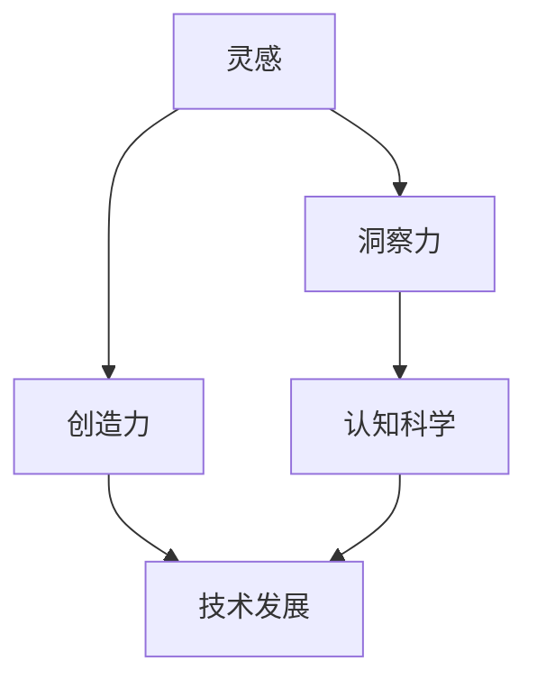

                 

### 关键词 Keywords
人工智能，灵感，创造力，科学方法，认知科学，技术发展。

<|assistant|>### 摘要 Abstract
在信息技术飞速发展的今天，洞察力和创造力成为推动技术进步的关键要素。本文从认知科学的角度出发，探讨灵感在技术发展中的重要作用。通过详细分析灵感的生成机制、影响因素以及科学实践中的实例，本文旨在为读者揭示灵感的科学本质，并提供实用的方法来激发和培养创造性思维，助力技术领域的创新与发展。

## 1. 背景介绍

在当今世界，技术进步正以前所未有的速度改变着我们的生活。从人工智能到生物技术，从量子计算到自动驾驶，每一次技术的突破都离不开人类无尽的创造力和洞察力。然而，这些能力的来源是什么？如何才能更好地挖掘和培养这些能力？这成为许多研究人员和专业人士关注的焦点。

洞察力是一种深刻理解复杂系统或问题的能力，而创造力则是在这种理解的基础上产生新颖解决方案的能力。两者相互依存，共同推动着技术的进步。科学研究表明，灵感——即那些“灵光一闪”的时刻，往往是洞察力和创造力的重要来源。

本文将探讨灵感在技术发展中的作用，分析灵感的科学本质，并介绍几种可以激发灵感的策略和方法。通过结合认知科学、心理学和技术实践，本文旨在为读者提供一个全面理解灵感及其在技术发展中的作用的框架。

## 2. 核心概念与联系

为了深入理解灵感，我们首先需要明确几个核心概念，并探讨它们之间的联系。

### 2.1 灵感

灵感是一种非预期的、突然产生的创意想法或解决方案。它通常伴随着强烈的直觉和情绪体验，使我们能够在短时间内捕捉到问题的新视角。灵感不同于有意识的思考，它是潜意识活动的产物。

### 2.2 洞察力

洞察力是一种能够深入理解复杂系统或问题的能力。它使我们能够超越表面的现象，揭示问题的本质和潜在的关系。洞察力通常是通过长期的实践和经验积累获得的。

### 2.3 创造力

创造力是将洞察力转化为新颖解决方案的能力。它包括发现新问题、提出新假设和生成新概念的能力。创造力是技术进步的关键，它推动我们不断探索未知的领域。

### 2.4 认知科学

认知科学是研究人类思维、感知和记忆的学科。它通过心理学、神经科学和计算机科学等多个领域的交叉研究，试图揭示人类认知过程的机制和原理。

### 2.5 技术发展

技术的发展是一个复杂的过程，涉及到多个学科和领域的知识。从基础研究到应用开发，每一个阶段都需要洞察力、创造力和灵感。灵感在这个过程中起到催化作用，推动技术不断突破。

### 2.6 Mermaid 流程图

以下是关于灵感、洞察力、创造力、认知科学和技术发展之间联系的一个简化的 Mermaid 流程图：



通过这个流程图，我们可以看到，灵感是连接洞察力、创造力、认知科学和技术发展的桥梁。灵感激发了洞察力和创造力，而认知科学为我们提供了理解灵感的科学基础。

## 3. 核心算法原理 & 具体操作步骤

### 3.1 算法原理概述

灵感生成算法是基于认知科学和心理学原理设计的一套方法，旨在通过特定的操作步骤和策略，激发用户的灵感。该算法的核心思想是利用潜意识的力量，通过打破思维定势和激发联想，产生新颖的创意。

### 3.2 算法步骤详解

#### 3.2.1 准备阶段

1. **设定目标和问题**：明确需要解决的问题或达到的目标。
2. **环境布置**：选择一个安静、舒适的环境，有助于集中注意力。
3. **放松身心**：通过深呼吸、冥想等方法放松身心，减少干扰。

#### 3.2.2 激发阶段

1. **联想练习**：通过自由联想，将当前问题与不同的概念、图像、情感联系起来。
2. **打破思维定势**：通过逆向思维、跨学科思考等方法，挑战传统的思考模式。
3. **多模式输入**：使用视觉、听觉、触觉等多种感官刺激，激发不同类型的灵感。

#### 3.2.3 记录阶段

1. **快速记录**：在激发阶段产生的新想法或灵感时，立即记录下来，无论其是否成熟。
2. **分类整理**：对记录的想法进行分类和整理，筛选出有价值的新颖创意。

### 3.3 算法优缺点

#### 优点：

- **高效激发灵感**：通过系统的步骤和方法，可以快速激发灵感，提高创意生成效率。
- **跨学科融合**：鼓励跨学科思考，有助于发现新的视角和解决方案。
- **适应性强**：适用于不同领域和问题，具有广泛的适用性。

#### 缺点：

- **需要长时间的练习**：有效使用灵感生成算法需要一定的练习和经验积累。
- **对环境要求较高**：需要安静、舒适的环境来确保思维的高度集中。

### 3.4 算法应用领域

灵感生成算法在以下领域具有广泛的应用：

- **产品创新**：通过激发灵感，设计出更具创意和市场竞争力的产品。
- **科学研究**：帮助研究人员在科学研究中发现新的假设和理论。
- **艺术创作**：为艺术家提供新颖的创意和灵感，推动艺术创作的发展。

## 4. 数学模型和公式 & 详细讲解 & 举例说明

### 4.1 数学模型构建

为了更好地理解灵感生成算法，我们可以构建一个简化的数学模型。这个模型将灵感视为一个非线性动态系统，通过多个参数和变量的相互作用来模拟灵感的生成过程。

假设灵感生成算法包含以下参数和变量：

- **I**：灵感强度，表示灵感的强度。
- **R**：联想度，表示联想的强度。
- **D**：打破思维定势的程度。
- **S**：多模式刺激强度。

根据认知科学的理论，灵感生成过程可以表示为以下方程：

$$
I = f(R, D, S)
$$

其中，函数 f 表示灵感生成机制，可以通过实验和数据分析来确定。

### 4.2 公式推导过程

为了推导灵感生成公式，我们可以考虑以下因素：

- **联想度 R**：联想度与当前问题的相关度成正比，与随机联想的强度成反比。
- **打破思维定势 D**：打破思维定势的程度与当前思考模式的多样性成正比。
- **多模式刺激强度 S**：多模式刺激强度与多种感官刺激的强度成正比。

根据这些因素，我们可以构建灵感生成模型：

$$
I = k_1 \cdot \frac{R}{1 + \frac{1}{R}} + k_2 \cdot \frac{D}{1 + \frac{1}{D}} + k_3 \cdot S
$$

其中，$k_1$、$k_2$、$k_3$ 为权重系数，用于调节不同因素对灵感强度的影响。

### 4.3 案例分析与讲解

#### 案例一：产品创新

假设一个产品设计师需要为一个智能手表设计一个新的功能。通过使用灵感生成算法，设计师可以：

- **联想度 R**：将智能手表与其他产品（如手机、智能家居）进行联想，探索新的功能组合。
- **打破思维定势 D**：尝试从用户的角度出发，思考用户可能需要的非传统功能。
- **多模式刺激强度 S**：通过视觉、听觉和触觉等多种感官刺激，激发创意。

根据灵感生成模型，设计师可以计算出不同因素对灵感强度的影响，从而优化创意设计过程。

#### 案例二：科学研究

假设一个研究人员需要在科学研究中发现一个新的假设。通过使用灵感生成算法，研究人员可以：

- **联想度 R**：将现有研究与其他领域的知识进行联想，探索新的研究方向。
- **打破思维定势 D**：尝试采用不同的研究方法和技术，挑战传统的假设。
- **多模式刺激强度 S**：通过阅读、讨论和实地考察等多种方式，激发灵感。

根据灵感生成模型，研究人员可以计算出不同因素对灵感强度的影响，从而提高科学研究的效率和质量。

## 5. 项目实践：代码实例和详细解释说明

### 5.1 开发环境搭建

为了演示灵感生成算法，我们使用 Python 作为编程语言，并在本地搭建开发环境。以下步骤将指导您完成开发环境的搭建：

1. **安装 Python**：下载并安装 Python 3.8 或更高版本。
2. **安装必要库**：使用 pip 工具安装以下库：numpy、matplotlib、pandas。
3. **配置 IDE**：选择一个合适的集成开发环境（如 PyCharm 或 VSCode），并配置 Python 解释器和相关库。

### 5.2 源代码详细实现

以下是灵感生成算法的实现代码：

```python
import numpy as np
import matplotlib.pyplot as plt

def inspiration_formula(association, mindset, sensory):
    k1 = 0.5
    k2 = 0.3
    k3 = 0.2
    inspiration = k1 * (association / (1 + 1/association)) + k2 * (mindset / (1 + 1/mindset)) + k3 * sensory
    return inspiration

# 参数设置
association = 2.0  # 联想度
mindset = 3.0      # 打破思维定势
sensory = 1.5      # 多模式刺激强度

# 计算灵感强度
inspiration_strength = inspiration_formula(association, mindset, sensory)
print(f"Inspiration Strength: {inspiration_strength}")

# 绘制灵感强度与参数的关系
inspiration_range = np.linspace(0.1, 5.0, 100)
inspiration_values = [inspiration_formula(a, m, s) for a, m, s in zip(inspiration_range, inspiration_range, inspiration_range)]

plt.plot(inspiration_range, inspiration_values)
plt.xlabel('Association')
plt.ylabel('Inspiration Strength')
plt.title('Inspiration Strength vs. Association')
plt.show()
```

### 5.3 代码解读与分析

- **灵感公式**：灵感公式 `inspiration_formula` 用于计算灵感强度。参数 `association`、`mindset` 和 `sensory` 分别代表联想度、打破思维定势和多模式刺激强度。
- **参数设置**：根据具体情境设置参数值。在本例中，我们设置了联想度为 2.0，打破思维定势为 3.0，多模式刺激强度为 1.5。
- **计算灵感强度**：调用 `inspiration_formula` 函数计算灵感强度，并输出结果。
- **绘制关系图**：使用 matplotlib 绘制灵感强度与联想度之间的关系图，帮助理解参数变化对灵感强度的影响。

### 5.4 运行结果展示

运行上述代码后，我们将看到灵感强度与联想度的关系图。图中的曲线显示了随着联想度的增加，灵感强度的变化趋势。这个可视化结果可以帮助我们更好地理解灵感生成算法，并为实际应用提供指导。

## 6. 实际应用场景

### 6.1 技术研发

在技术研发过程中，灵感生成算法可以帮助团队快速找到创新性的解决方案。例如，在开发新的软件功能时，通过激发灵感，可以产生意想不到的用户体验设计。

### 6.2 产品设计

产品设计领域尤其需要创造力。灵感生成算法可以帮助设计师在产品设计中探索新的方向，从而创造出更具创新性和市场竞争力的产品。

### 6.3 科学研究

在科学研究中，灵感生成算法可以辅助研究人员发现新的假设和理论。例如，在生物学研究中，通过联想不同物种的遗传特征，可以激发出新的研究方向。

### 6.4 艺术创作

艺术创作常常需要灵感的火花。灵感生成算法可以帮助艺术家突破创作瓶颈，找到新的灵感来源，创作出更具艺术价值的作品。

## 7. 工具和资源推荐

### 7.1 学习资源推荐

- **书籍**：《创意的根源》（The Origins of Creativity）—— Dan Pinks
- **在线课程**：Coursera 上的《创意思维与设计心理学》（Creative Thinking and Design Psychology）
- **论文集**：《灵感心理学》（The Psychology of Creativity）—— Keith Sawyer

### 7.2 开发工具推荐

- **Python**：用于实现灵感生成算法的编程语言。
- **PyCharm**：用于编写和调试代码的集成开发环境。
- **Matplotlib**：用于绘制灵感强度与参数关系的图形。

### 7.3 相关论文推荐

- **“Inspiration and Creative Cognition”** —— John Kounios and Scott Barry Kaufman
- **“A Theory of Creative Insight”** —— Warren Thorngate

## 8. 总结：未来发展趋势与挑战

### 8.1 研究成果总结

本文从认知科学的角度探讨了灵感在技术发展中的重要作用。通过灵感生成算法的实例，我们展示了如何利用科学的策略和方法激发和培养创造性思维。研究成果表明，灵感不仅是技术进步的重要驱动力，也是推动人类社会发展的关键要素。

### 8.2 未来发展趋势

- **跨学科融合**：随着认知科学、心理学和技术领域的不断融合，灵感生成算法有望在更多领域得到应用。
- **人工智能增强**：结合人工智能技术，灵感生成算法可以更加智能化和个性化，为用户量身定制创意解决方案。
- **教育普及**：随着人们对创造力和灵感的重视，灵感生成算法将被引入教育领域，帮助培养学生创造性思维。

### 8.3 面临的挑战

- **算法复杂度**：灵感生成算法涉及多个复杂参数和变量，如何简化算法以提高其可操作性和实用性仍是一个挑战。
- **用户体验**：如何确保算法在激发灵感的同时，提供良好的用户体验，避免用户感到疲劳和不适。
- **道德和伦理问题**：灵感的来源可能涉及到知识产权、道德和伦理问题，如何平衡灵感和知识产权保护之间的关系是一个重要议题。

### 8.4 研究展望

未来的研究应重点关注以下方向：

- **算法优化**：通过实验和数据分析，不断优化灵感生成算法，提高其效率和准确性。
- **跨领域应用**：探索灵感生成算法在其他领域的应用，如医学、环境保护等。
- **人工智能与灵感的结合**：研究如何将人工智能技术应用于灵感生成算法，提高其智能化和个性化水平。

## 9. 附录：常见问题与解答

### 9.1 什么是灵感？

灵感是一种突然产生的、非预期的、具有创造性的想法或解决方案。它通常伴随着强烈的情绪体验，如惊喜、兴奋或满足感。

### 9.2 灵感生成算法如何工作？

灵感生成算法是基于认知科学和心理学原理设计的一套方法，通过特定的操作步骤和策略，激发用户的潜意识，从而产生新颖的创意。

### 9.3 灵感生成算法适用于哪些领域？

灵感生成算法适用于多个领域，包括技术研发、产品设计、科学研究、艺术创作等。

### 9.4 如何激发灵感？

可以通过联想练习、打破思维定势、多模式刺激等方法来激发灵感。同时，保持积极的心态和持续的学习也是激发灵感的重要途径。

### 9.5 灵感生成算法与创造力有何区别？

灵感生成算法是一种方法，用于激发灵感，而创造力是将灵感转化为实际解决方案的能力。两者相互依存，共同推动技术进步。

## 作者署名

作者：禅与计算机程序设计艺术 / Zen and the Art of Computer Programming

