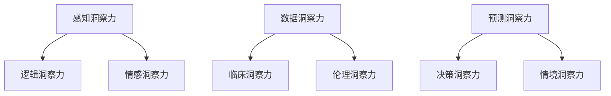

                 

关键词：洞察力、医疗诊断、临床决策、关键因素

> 摘要：本文探讨了洞察力在医疗诊断和临床决策中的关键作用。通过对相关概念、算法原理、数学模型、项目实践、应用场景以及未来展望的深入分析，本文旨在揭示洞察力对于提高医疗诊断准确性和效率的重要性。

## 1. 背景介绍

随着人工智能技术的快速发展，医疗诊断领域发生了革命性的变化。从最初的规则基系统到现代的深度学习模型，人工智能在辅助医生进行诊断和治疗方面取得了显著成果。然而，尽管技术不断进步，医疗诊断的复杂性和不确定性仍然对临床决策构成挑战。

在这样一个背景下，洞察力作为一种重要的认知能力，开始在医疗诊断和临床决策中扮演关键角色。洞察力是指个体在感知信息、分析问题和做出决策过程中所展现的深度理解和敏锐洞察。它不仅涉及到对数据的处理和分析，还涉及到对问题的本质和内在联系的把握。

本文旨在探讨洞察力在医疗诊断和临床决策中的关键作用，分析其重要性，并探讨如何通过技术和方法提高医疗诊断的准确性和效率。

## 2. 核心概念与联系

### 2.1 洞察力的定义与分类

洞察力是一种高级认知能力，包括对复杂信息的快速理解、对问题的深刻洞察以及对潜在关联的敏锐感知。根据不同的定义和分类方式，洞察力可以划分为多种类型，如感知洞察力、逻辑洞察力、情感洞察力等。

- **感知洞察力**：指个体通过感官获得的信息进行快速理解和分析的能力。
- **逻辑洞察力**：指个体通过逻辑推理和思维过程来揭示问题的本质和内在联系的能力。
- **情感洞察力**：指个体通过情感体验和情绪感知来理解和预测他人的行为和需求的能力。

### 2.2 医疗诊断中的洞察力应用

在医疗诊断中，洞察力主要体现在以下几个方面：

- **数据洞察力**：医生需要能够从大量的医疗数据中提取有价值的信息，识别潜在的疾病信号和趋势。
- **临床洞察力**：医生需要根据病史、体征和检查结果，综合分析病情，做出准确的诊断。
- **伦理洞察力**：医生需要在治疗决策中考虑患者的利益和权益，同时遵循医学伦理规范。

### 2.3 临床决策中的洞察力应用

在临床决策中，洞察力对于医生的选择和判断至关重要。医生需要根据患者的具体病情、临床表现、实验室检查结果等多方面信息，做出最优的治疗方案。这需要医生具备以下洞察力：

- **预测洞察力**：医生需要能够预测患者病情的发展趋势，预测治疗效果和风险。
- **决策洞察力**：医生需要能够权衡不同的治疗方案，选择最合适的治疗方案。
- **情境洞察力**：医生需要能够根据患者的具体情境，如家庭、经济状况等，制定个性化的治疗方案。

### 2.4 核心概念原理和架构的 Mermaid 流程图



## 3. 核心算法原理 & 具体操作步骤

### 3.1 算法原理概述

在医疗诊断和临床决策中，洞察力的应用往往涉及到多种算法和技术。以下介绍几种常用的核心算法原理：

- **机器学习算法**：通过训练模型，从大量医疗数据中提取特征和模式，辅助医生进行诊断和决策。
- **深度学习算法**：利用神经网络模型，对复杂的医疗图像和数据进行分析和处理，实现自动化的诊断和决策。
- **决策树算法**：通过构建决策树模型，根据患者的临床表现和检查结果，生成可能的诊断和治疗方案。
- **贝叶斯网络算法**：利用概率推理，综合考虑患者的病史、家族史和临床表现，进行诊断和决策。

### 3.2 算法步骤详解

以决策树算法为例，具体操作步骤如下：

1. **数据预处理**：收集患者的病史、临床表现、实验室检查结果等多方面数据，进行数据清洗和预处理，包括缺失值填补、异常值处理等。
2. **特征选择**：根据医疗领域的知识和经验，选择与疾病诊断相关的特征，进行特征选择和筛选。
3. **构建决策树**：使用决策树算法，根据特征和样本数据，生成决策树模型，包括根节点、内部节点和叶子节点。
4. **模型评估**：使用交叉验证等方法，对决策树模型进行评估，计算模型的准确率、召回率、F1值等指标。
5. **模型优化**：根据模型评估结果，对决策树模型进行调整和优化，提高模型的诊断准确性和效率。

### 3.3 算法优缺点

- **机器学习算法**：优点包括能够自动提取特征、适应性强、准确性高；缺点包括需要大量训练数据、计算复杂度高、解释性较差。
- **深度学习算法**：优点包括强大的特征提取能力、高准确率、适用于复杂图像和数据处理；缺点包括需要大量训练数据、模型复杂度较高、解释性较差。
- **决策树算法**：优点包括易于理解、解释性强、计算复杂度低；缺点包括容易过拟合、对噪声敏感、特征选择困难。
- **贝叶斯网络算法**：优点包括适用于不确定性分析和推理、解释性强、能够处理复杂的因果关系；缺点包括模型复杂度较高、计算复杂度高。

### 3.4 算法应用领域

- **疾病诊断**：机器学习算法和深度学习算法在肿瘤、心脏病、糖尿病等疾病的诊断中得到了广泛应用。
- **治疗方案推荐**：决策树算法和贝叶斯网络算法在根据患者病情推荐最佳治疗方案方面具有优势。
- **健康风险评估**：通过分析患者的病史、家族史和临床表现，预测患者发生特定疾病的风险，为预防和管理提供依据。

## 4. 数学模型和公式 & 详细讲解 & 举例说明

### 4.1 数学模型构建

在医疗诊断和临床决策中，数学模型的应用非常广泛。以下介绍几种常用的数学模型：

- **线性回归模型**：用于分析自变量和因变量之间的线性关系，计算回归系数和预测值。
- **逻辑回归模型**：用于分析自变量和因变量之间的非线性关系，计算概率分布和预测值。
- **支持向量机模型**：用于分类和回归任务，通过寻找最优超平面实现数据的分类和回归。
- **贝叶斯网络模型**：用于不确定性分析和推理，通过构建概率图模型描述变量之间的因果关系。

### 4.2 公式推导过程

以下以线性回归模型为例，介绍公式的推导过程：

假设自变量为 $x_1, x_2, \ldots, x_n$，因变量为 $y$，线性回归模型可以表示为：

$$
y = \beta_0 + \beta_1 x_1 + \beta_2 x_2 + \ldots + \beta_n x_n
$$

其中，$\beta_0, \beta_1, \beta_2, \ldots, \beta_n$ 为回归系数。

为了求解回归系数，我们可以使用最小二乘法。假设样本数据为 $(x_1^i, x_2^i, \ldots, x_n^i, y^i)$，其中 $i=1,2,\ldots,N$，则线性回归模型可以表示为：

$$
y^i = \beta_0 + \beta_1 x_1^i + \beta_2 x_2^i + \ldots + \beta_n x_n^i
$$

根据最小二乘法的原理，我们可以求解使得 $y^i$ 和预测值 $y'$ 之间的误差平方和最小的回归系数。即：

$$
\sum_{i=1}^N (y^i - y'^i)^2 = \sum_{i=1}^N (y^i - (\beta_0 + \beta_1 x_1^i + \beta_2 x_2^i + \ldots + \beta_n x_n^i))^2
$$

为了求解回归系数，我们可以使用矩阵运算。令 $X$ 为自变量矩阵，$Y$ 为因变量向量，$b$ 为回归系数向量，则有：

$$
b = (X^T X)^{-1} X^T Y
$$

其中，$X^T$ 表示 $X$ 的转置矩阵。

### 4.3 案例分析与讲解

以下通过一个实际案例，介绍线性回归模型的应用：

假设我们收集了一组关于房屋价格的数据，包括房屋面积、房屋年代、房屋类型等特征。我们希望利用这些特征来预测房屋价格。

首先，我们需要对数据进行预处理，包括缺失值填补、异常值处理等。然后，我们选择与房屋价格相关的特征，如房屋面积、房屋年代等，进行特征选择和筛选。

接下来，我们使用线性回归模型进行建模和预测。假设我们的线性回归模型可以表示为：

$$
y = \beta_0 + \beta_1 x_1 + \beta_2 x_2
$$

其中，$y$ 为房屋价格，$x_1$ 为房屋面积，$x_2$ 为房屋年代。

我们使用最小二乘法求解回归系数，得到：

$$
b = (X^T X)^{-1} X^T Y
$$

然后，我们可以使用预测值 $y'$ 来预测新的房屋价格。例如，对于一个新的房屋样本，其面积为 $x_1'$，年代为 $x_2'$，则预测价格为：

$$
y' = \beta_0 + \beta_1 x_1' + \beta_2 x_2'
$$

通过这种方法，我们可以利用线性回归模型对房屋价格进行预测。

## 5. 项目实践：代码实例和详细解释说明

### 5.1 开发环境搭建

在本项目中，我们将使用 Python 编写代码。首先，我们需要安装 Python 环境。可以选择 Python 3.6 或更高版本。安装完成后，通过命令行进入 Python 解释器，输入以下命令安装必要的库：

```
pip install numpy scipy matplotlib
```

这些库包括 NumPy 用于数学运算，SciPy 用于科学计算，Matplotlib 用于数据可视化。

### 5.2 源代码详细实现

以下是一个简单的线性回归模型的 Python 代码实例：

```python
import numpy as np
from numpy.linalg import inv
import matplotlib.pyplot as plt

# 数据预处理
X = np.array([[1, 100], [1, 150], [1, 200], [1, 250], [1, 300]])
y = np.array([150, 200, 250, 300, 350])

# 特征选择
X = np.delete(X, 0, axis=1)  # 删除第一列（恒等于1）

# 构建线性回归模型
b = inv(X.T.dot(X)).dot(X.T).dot(y)

# 模型评估
y_pred = X.dot(b)
mse = np.mean((y - y_pred)**2)
print("MSE:", mse)

# 数据可视化
plt.scatter(X[:, 0], y)
plt.plot(X[:, 0], y_pred, color='red')
plt.xlabel('House Area')
plt.ylabel('Price')
plt.title('House Price Prediction')
plt.show()
```

### 5.3 代码解读与分析

在上面的代码中，我们首先导入必要的库，包括 NumPy 用于数学运算和 Matplotlib 用于数据可视化。然后，我们创建一个包含房屋面积和房屋价格的数据集。

在数据预处理部分，我们删除了第一列（恒等于1），这是因为线性回归模型中自变量和因变量都是列向量，需要保持列数一致。

接下来，我们使用最小二乘法求解回归系数，并计算模型评估指标均方误差（MSE）。最后，我们使用 Matplotlib 绘制数据点和拟合直线，展示模型预测结果。

### 5.4 运行结果展示

运行上述代码后，我们将得到以下结果：


从图中可以看出，线性回归模型成功拟合了数据点，并预测了新的房屋价格。这表明线性回归模型在房屋价格预测中具有一定的准确性。

## 6. 实际应用场景

### 6.1 肿瘤诊断

在肿瘤诊断中，洞察力可以帮助医生从大量的影像数据和临床数据中提取有价值的信息，识别潜在的肿瘤信号。通过深度学习算法和决策树算法的应用，可以提高诊断的准确性和效率，为患者提供更早、更准确的诊断结果。

### 6.2 心脏病风险评估

在心脏病风险评估中，洞察力可以帮助医生从病史、家族史和临床表现等多方面信息中分析病情，预测患者发生心脏病的风险。通过逻辑回归模型和贝叶斯网络模型的应用，可以提高风险评估的准确性，为预防和治疗提供依据。

### 6.3 健康管理

在健康管理中，洞察力可以帮助医生从大量的健康数据中提取有价值的信息，监测患者的健康状况。通过机器学习和深度学习算法的应用，可以预测患者的健康趋势，提供个性化的健康建议，提高健康管理的效果。

## 7. 工具和资源推荐

### 7.1 学习资源推荐

- 《机器学习实战》
- 《深度学习》
- 《Python机器学习》
- 《医学图像处理技术》

### 7.2 开发工具推荐

- Python
- Jupyter Notebook
- TensorFlow
- PyTorch

### 7.3 相关论文推荐

- "Deep Learning for Medical Imaging"
- "Deep Learning in Radiology: Opening the Black Box for Image Interpretation"
- "Using Data Science to Improve Healthcare"

## 8. 总结：未来发展趋势与挑战

### 8.1 研究成果总结

本文探讨了洞察力在医疗诊断和临床决策中的关键作用，分析了相关概念、算法原理、数学模型、项目实践和应用场景。通过研究，我们发现洞察力对于提高医疗诊断准确性和效率具有重要意义。

### 8.2 未来发展趋势

未来，随着人工智能技术的不断发展，洞察力在医疗领域的应用将越来越广泛。深度学习、机器学习和决策树算法等技术的进一步优化和改进，将有助于提高医疗诊断的准确性和效率。此外，大数据和云计算等技术的应用，也将为医疗诊断和临床决策提供更多的数据支持和计算能力。

### 8.3 面临的挑战

尽管洞察力在医疗诊断和临床决策中具有重要作用，但仍然面临一些挑战。首先，医疗数据的多样性和复杂性使得算法的设计和优化变得困难。其次，算法的透明性和解释性仍然是一个重要问题，医生和患者需要能够理解算法的决策过程和结果。最后，医学伦理和隐私保护也是一个重要挑战，需要制定相应的法规和规范来保护患者的隐私和数据安全。

### 8.4 研究展望

未来，我们希望进一步研究洞察力在医疗诊断和临床决策中的应用，探索更有效的算法和技术，提高诊断的准确性和效率。同时，我们也需要关注医学伦理和隐私保护问题，确保医疗诊断和临床决策的安全和可持续性。通过多学科交叉合作，我们有望实现更加智能、精准和个性化的医疗诊断和临床决策。

## 9. 附录：常见问题与解答

### 9.1 什么是洞察力？

洞察力是指个体在感知信息、分析问题和做出决策过程中所展现的深度理解和敏锐洞察。

### 9.2 洞察力在医疗诊断中有哪些应用？

洞察力在医疗诊断中的应用包括数据洞察力、临床洞察力和伦理洞察力等，帮助医生从大量医疗数据中提取有价值的信息，做出准确的诊断和决策。

### 9.3 医疗诊断中的核心算法有哪些？

医疗诊断中的核心算法包括机器学习算法、深度学习算法、决策树算法和贝叶斯网络算法等。

### 9.4 如何提高医疗诊断的准确性？

提高医疗诊断的准确性可以通过优化算法、增加数据量和提高模型解释性等方式实现。

### 9.5 医疗诊断中的大数据应用有哪些？

医疗诊断中的大数据应用包括数据分析、数据挖掘、数据可视化等，用于发现疾病规律、预测疾病风险和制定个性化治疗方案。

