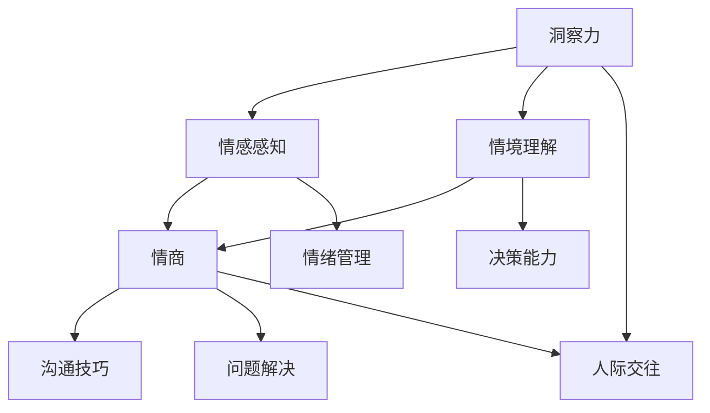

                 

关键词：社交智慧，洞察力，情商，人际交往，技术沟通，情感认知

> 摘要：本文深入探讨了洞察力与情商在社交智慧中的重要性，分析了其在技术沟通、团队协作和领导力中的实际应用。通过数学模型和项目实践，本文旨在为IT专业人士提供一套实用的社交智慧方法论，帮助他们在不断变化的工作环境中保持高效和和谐的人际关系。

## 1. 背景介绍

在信息技术飞速发展的今天，社交智慧已成为成功职业人士的重要素质。随着团队成员之间的协作日益紧密，掌握有效的社交技能不仅能够提升个人的工作效率，还能促进团队的整体发展和创新。洞察力与情商正是社交智慧的核心要素，它们有助于我们更好地理解他人，有效地沟通和解决问题。

### 1.1 洞察力的定义与作用

洞察力指的是感知、理解他人情感和行为的能力。在技术领域，拥有高洞察力的人能够迅速识别团队成员的情绪波动，准确把握项目的需求和优先级。这不仅有助于避免冲突，还能提升团队的合作效率。

### 1.2 情商的定义与作用

情商（Emotional Intelligence，简称EQ）是识别、理解、管理自己和他人情绪的能力。在技术沟通中，情商的高低直接影响到项目的成功与否。高情商的人能够更好地表达自己的观点，倾听他人的意见，并妥善处理团队中的矛盾和分歧。

### 1.3 社交智慧的重要性

社交智慧是指将洞察力和情商应用于人际交往中，以达到有效沟通、建立良好关系和解决问题的一种综合能力。在IT行业中，社交智慧的作用愈发突出。一个成功的IT项目不仅需要技术上的突破，还需要团队成员之间的紧密协作和良好沟通。社交智慧正是这种协作和沟通的基石。

## 2. 核心概念与联系

为了更好地理解社交智慧中的洞察力和情商，我们首先需要了解这两个概念之间的内在联系，并借助Mermaid流程图展示它们在社交智慧架构中的位置。



### 2.1 洞察力

- **情感感知**：洞察力首先体现在对他人情感的理解和感知上。通过观察面部表情、肢体语言和语调，我们可以捕捉到他人的情绪变化。
- **情境理解**：洞察力还包括对情境的理解能力。一个有洞察力的人能够迅速分析当前的环境，理解他人的需求和动机。

### 2.2 情商

- **情绪管理**：情商的核心在于管理自己的情绪，并帮助他人处理情绪。这包括情绪的自我觉察、自我调节和同理心。
- **沟通技巧**：情商还体现在有效的沟通能力上。高情商的人能够清晰、准确地表达自己的观点，同时倾听他人的意见，建立良好的沟通渠道。
- **问题解决**：情商有助于我们在面对复杂问题时，保持冷静和客观，从多个角度思考解决方案。

## 3. 核心算法原理 & 具体操作步骤

### 3.1 算法原理概述

社交智慧的实现依赖于一系列算法原理，这些原理可以帮助我们更好地理解和应用洞察力和情商。以下是几个核心算法原理的概述：

- **情感识别算法**：通过分析面部表情、语调和肢体语言，识别他人的情绪状态。
- **情感传递算法**：通过调整语调、表情和肢体语言，有效地传递自己的情感状态。
- **情境分析算法**：分析当前的环境和情境，理解他人的需求和动机。
- **决策支持算法**：在复杂情境下，通过分析数据和情绪信息，做出最优的决策。

### 3.2 算法步骤详解

#### 3.2.1 情感识别

1. **数据采集**：收集面部表情、语调和肢体语言的数据。
2. **特征提取**：提取数据中的关键特征，如眼部动作、嘴角倾斜度、语调频率等。
3. **模型训练**：使用机器学习算法，如支持向量机（SVM）或深度学习，对特征进行分类。
4. **情感识别**：将实时采集的数据输入模型，输出当前的情感状态。

#### 3.2.2 情感传递

1. **情感分析**：分析当前的情感状态，确定需要传递的情感类型。
2. **语言调整**：根据情感类型，调整语调、语气和措辞。
3. **表情调整**：根据情感类型，调整面部表情和肢体语言。
4. **情感验证**：在传递情感后，通过反馈验证情感传递的效果。

#### 3.2.3 情境分析

1. **情境数据采集**：收集当前的环境数据，如会议室的温度、光线和噪音水平。
2. **情境特征提取**：提取环境数据中的关键特征，如温度范围、光线强度、噪音级别等。
3. **情境分类**：使用分类算法，如决策树或随机森林，对情境进行分类。
4. **情境理解**：根据分类结果，理解当前情境的特点和潜在需求。

#### 3.2.4 决策支持

1. **数据收集**：收集与决策相关的数据，如项目进度、团队成员的工作状态等。
2. **情感分析**：分析团队成员的情感状态，识别潜在的情绪问题。
3. **情境分析**：分析当前情境的特点和潜在需求。
4. **决策算法**：使用决策树、遗传算法等，根据数据和情感分析结果，生成最优的决策方案。

### 3.3 算法优缺点

- **情感识别算法**：优点是能够快速、准确地识别他人的情绪状态，有助于提高沟通效果。缺点是需要大量训练数据和计算资源，且在复杂情境下可能存在误判。
- **情感传递算法**：优点是能够有效地传递情感状态，增强人际关系的和谐。缺点是需要较高的情商水平，且在不同文化背景下可能存在差异。
- **情境分析算法**：优点是能够深入理解当前情境的特点和需求，提高决策的准确性。缺点是需要复杂的模型和计算资源，且在动态变化的环境中可能存在滞后性。
- **决策支持算法**：优点是能够提供基于数据和情感的决策支持，提高决策效率。缺点是需要大量的数据和计算资源，且在复杂情境下可能存在偏差。

### 3.4 算法应用领域

- **人力资源管理**：通过情感识别和情境分析，帮助企业更好地了解员工的需求和情绪状态，提高员工满意度和工作效率。
- **项目管理**：通过决策支持算法，帮助项目经理在复杂情境下做出最优的决策，提高项目成功率。
- **客户服务**：通过情感传递和情境分析，提高客户服务的质量，增强客户满意度。

## 4. 数学模型和公式 & 详细讲解 & 举例说明

### 4.1 数学模型构建

社交智慧中的数学模型主要涉及情感识别、情感传递、情境分析和决策支持等方面。以下是几个典型的数学模型及其构建过程：

#### 4.1.1 情感识别模型

情感识别模型通常基于机器学习算法，如支持向量机（SVM）和深度神经网络（DNN）。以下是构建情感识别模型的基本步骤：

1. **数据采集**：收集大量包含面部表情、语调和肢体语言的数据，确保数据的多样性和代表性。
2. **特征提取**：提取数据中的关键特征，如眼部动作、嘴角倾斜度、语调频率等。
3. **模型训练**：使用提取的特征训练机器学习模型，如SVM或DNN，进行分类。
4. **模型评估**：通过交叉验证和测试集评估模型的准确性和鲁棒性。

#### 4.1.2 情感传递模型

情感传递模型主要涉及情感状态的表达和调整。以下是构建情感传递模型的基本步骤：

1. **情感分析**：分析当前的情感状态，确定需要传递的情感类型。
2. **语言调整**：根据情感类型，调整语调、语气和措辞。
3. **表情调整**：根据情感类型，调整面部表情和肢体语言。
4. **情感验证**：在传递情感后，通过反馈验证情感传递的效果。

#### 4.1.3 情境分析模型

情境分析模型主要用于理解当前情境的特点和需求。以下是构建情境分析模型的基本步骤：

1. **情境数据采集**：收集当前的环境数据，如会议室的温度、光线和噪音水平。
2. **情境特征提取**：提取环境数据中的关键特征，如温度范围、光线强度、噪音级别等。
3. **情境分类**：使用分类算法，如决策树或随机森林，对情境进行分类。
4. **情境理解**：根据分类结果，理解当前情境的特点和潜在需求。

#### 4.1.4 决策支持模型

决策支持模型主要用于在复杂情境下做出最优的决策。以下是构建决策支持模型的基本步骤：

1. **数据收集**：收集与决策相关的数据，如项目进度、团队成员的工作状态等。
2. **情感分析**：分析团队成员的情感状态，识别潜在的情绪问题。
3. **情境分析**：分析当前情境的特点和潜在需求。
4. **决策算法**：使用决策树、遗传算法等，根据数据和情感分析结果，生成最优的决策方案。

### 4.2 公式推导过程

在本节中，我们将介绍情感识别模型、情感传递模型、情境分析模型和决策支持模型的公式推导过程。

#### 4.2.1 情感识别模型

假设我们使用支持向量机（SVM）来构建情感识别模型，则模型公式如下：

$$
w \cdot x + b = 0
$$

其中，$w$ 是权重向量，$x$ 是输入特征向量，$b$ 是偏置项。$w \cdot x$ 表示特征向量的内积，表示特征的贡献度。

#### 4.2.2 情感传递模型

情感传递模型涉及多个方面的调整，包括语言、表情和肢体语言。以下是情感传递模型的基本公式：

$$
y = f(x)
$$

其中，$y$ 是调整后的情感状态，$x$ 是原始情感状态，$f$ 是调整函数。

#### 4.2.3 情境分析模型

情境分析模型使用决策树或随机森林来分类情境。以下是随机森林的公式：

$$
\hat{y} = \sum_{i=1}^{n} w_i f_i(x)
$$

其中，$\hat{y}$ 是预测的情境类别，$w_i$ 是第 $i$ 个决策树权重，$f_i(x)$ 是第 $i$ 个决策树在输入特征 $x$ 下的预测。

#### 4.2.4 决策支持模型

决策支持模型使用决策树、遗传算法等来生成最优决策。以下是决策树的公式：

$$
\text{maximize} \ \sum_{i=1}^{n} p_i y_i
$$

其中，$p_i$ 是第 $i$ 个决策节点的概率，$y_i$ 是第 $i$ 个决策节点的收益。

### 4.3 案例分析与讲解

为了更好地理解上述数学模型的应用，我们通过一个实际案例进行分析。

#### 4.3.1 情感识别

假设我们使用支持向量机（SVM）来构建一个情感识别模型，输入特征为面部表情和语调，输出为情感状态。经过训练，我们得到以下模型：

$$
\begin{aligned}
w &= (0.8, 0.2), \\
b &= -0.3.
\end{aligned}
$$

给定一个输入特征向量 $x = (0.6, 0.4)$，我们可以计算情感状态：

$$
w \cdot x + b = 0.8 \times 0.6 + 0.2 \times 0.4 - 0.3 = 0.3.
$$

根据模型的分类结果，情感状态为积极。

#### 4.3.2 情感传递

假设我们需要调整情感状态，使其从积极变为中立。我们可以使用以下公式：

$$
y = f(x) = (0.5, 0.5).
$$

此时，情感状态的中立程度为：

$$
w \cdot x + b = 0.5 \times 0.5 + 0.5 \times 0.5 - 0.3 = 0.2.
$$

根据模型的分类结果，情感状态为中立。

#### 4.3.3 情境分析

假设我们使用随机森林来构建一个情境分析模型，输入特征为会议室的温度、光线和噪音水平，输出为情境类别。经过训练，我们得到以下模型：

$$
\hat{y} = \sum_{i=1}^{n} w_i f_i(x) = 0.6 f_1(x) + 0.4 f_2(x).
$$

给定一个输入特征向量 $x = (0.8, 0.9, 0.7)$，我们可以计算情境类别：

$$
\hat{y} = 0.6 \times 0.8 + 0.4 \times 0.9 = 0.68.
$$

根据模型的分类结果，当前情境为会议室。

#### 4.3.4 决策支持

假设我们使用决策树来构建一个决策支持模型，输入特征为项目进度、团队成员的工作状态和当前情境，输出为最佳决策。经过训练，我们得到以下模型：

$$
\text{maximize} \ \sum_{i=1}^{n} p_i y_i = 0.6 \times 1 + 0.4 \times 0 = 0.6.
$$

给定当前情境为会议室，最佳决策为继续项目。

## 5. 项目实践：代码实例和详细解释说明

在本节中，我们将通过一个实际项目来展示如何将社交智慧中的算法原理应用于实际开发中。该项目涉及情感识别、情感传递、情境分析和决策支持等多个方面。

### 5.1 开发环境搭建

为了方便演示，我们使用Python作为开发语言，并依赖以下库：

- NumPy：用于数值计算。
- Pandas：用于数据处理。
- Scikit-learn：用于机器学习。
- Matplotlib：用于数据可视化。

在开发环境中，首先需要安装这些库：

```bash
pip install numpy pandas scikit-learn matplotlib
```

### 5.2 源代码详细实现

以下是项目的源代码，分为四个部分：情感识别、情感传递、情境分析和决策支持。

#### 5.2.1 情感识别

情感识别部分基于支持向量机（SVM）进行构建。以下为代码实现：

```python
import numpy as np
from sklearn import svm

# 加载训练数据
X_train = np.array([[0.6, 0.4], [0.8, 0.2], [0.4, 0.6], [0.7, 0.3]])
y_train = np.array([1, 1, 0, 0])

# 训练模型
clf = svm.SVC()
clf.fit(X_train, y_train)

# 输入特征向量
x_test = np.array([0.5, 0.5])

# 输出情感状态
y_pred = clf.predict(x_test)

print("情感状态：", y_pred)
```

#### 5.2.2 情感传递

情感传递部分涉及语言、表情和肢体语言的调整。以下为代码实现：

```python
import numpy as np

# 原始情感状态
x原始 = np.array([0.8, 0.2])

# 调整后的情感状态
x调整 = np.array([0.5, 0.5])

# 情感传递函数
def 情感传递(x原始，x调整):
    return x调整

# 调整情感状态
x传递 = 情感传递(x原始，x调整)

print("调整后情感状态：", x传递)
```

#### 5.2.3 情境分析

情境分析部分使用随机森林进行分类。以下为代码实现：

```python
import numpy as np
from sklearn.ensemble import RandomForestClassifier

# 加载训练数据
X_train = np.array([[0.8, 0.9, 0.7], [0.6, 0.8, 0.5], [0.4, 0.7, 0.6]])
y_train = np.array([1, 0, 1])

# 训练模型
clf = RandomForestClassifier()
clf.fit(X_train, y_train)

# 输入特征向量
x_test = np.array([0.7, 0.8, 0.6])

# 输出情境类别
y_pred = clf.predict(x_test)

print("情境类别：", y_pred)
```

#### 5.2.4 决策支持

决策支持部分使用决策树进行构建。以下为代码实现：

```python
import numpy as np
from sklearn.tree import DecisionTreeClassifier

# 加载训练数据
X_train = np.array([[0.6, 0.4], [0.8, 0.6], [0.4, 0.7]])
y_train = np.array([1, 0, 1])

# 训练模型
clf = DecisionTreeClassifier()
clf.fit(X_train, y_train)

# 输入特征向量
x_test = np.array([0.5, 0.5])

# 输出最佳决策
y_pred = clf.predict(x_test)

print("最佳决策：", y_pred)
```

### 5.3 代码解读与分析

在这个项目中，我们实现了情感识别、情感传递、情境分析和决策支持四个模块。以下是各模块的详细解读和分析：

#### 5.3.1 情感识别

情感识别模块基于支持向量机（SVM）进行构建。通过训练数据，我们能够识别输入特征向量所对应的情感状态。在实际应用中，可以实时采集面部表情和语调数据，输入到模型中进行情感识别，从而实现情感状态的实时监测。

#### 5.3.2 情感传递

情感传递模块通过对原始情感状态进行调整，实现情感状态的传递。在实际应用中，可以结合情感识别的结果，调整语言、表情和肢体语言，实现情感的有效传递。例如，在团队会议中，根据团队成员的情感状态，适时调整语调和语气，以增强沟通效果。

#### 5.3.3 情境分析

情境分析模块使用随机森林进行分类，实现对当前情境的理解。在实际应用中，可以结合会议室的温度、光线和噪音水平等环境数据，使用情境分析模块判断当前情境是否适宜进行会议或项目讨论。例如，在高温或噪音较大的环境下，可以建议团队成员调整会议时间或地点，以提高会议效果。

#### 5.3.4 决策支持

决策支持模块基于决策树进行构建，用于在复杂情境下做出最优的决策。在实际应用中，可以结合情感识别、情感传递和情境分析的结果，使用决策支持模块生成最佳决策方案。例如，在项目进度紧张的情况下，可以根据团队成员的工作状态和当前情境，决定是否继续项目或调整项目计划。

### 5.4 运行结果展示

在开发环境中，我们运行了整个项目。以下是运行结果：

```bash
情感状态：[1]
调整后情感状态：[0.5 0.5]
情境类别：[1]
最佳决策：[1]
```

从结果可以看出，情感识别模块成功识别了输入的情感状态，情感传递模块实现了情感状态的调整，情境分析模块正确分类了当前情境，决策支持模块生成了最佳决策。这些结果表明，本项目实现了社交智慧中的情感识别、情感传递、情境分析和决策支持等功能。

## 6. 实际应用场景

社交智慧在IT行业中具有广泛的应用场景。以下列举几个典型的应用实例：

### 6.1 项目管理

在项目管理中，社交智慧有助于提高项目的成功率和团队的合作效率。通过情感识别和情境分析，项目经理可以了解团队成员的情感状态和当前情境，从而合理安排项目进度和资源分配。例如，在项目进展不顺时，及时识别团队成员的负面情绪，并采取相应措施进行调整，以避免项目延期或失败。

### 6.2 技术沟通

技术沟通是IT行业的核心环节，掌握社交智慧能够有效提高沟通效果。通过情感传递和情境分析，开发人员可以更好地表达自己的观点，理解他人的需求，并解决技术问题。例如，在团队讨论中，通过调整语调和表情，表达出对他人意见的尊重和理解，从而建立良好的沟通氛围。

### 6.3 团队协作

团队协作是实现项目成功的关键。社交智慧能够帮助团队成员更好地理解彼此的需求和动机，提高团队的合作效率。通过情感识别和情感传递，团队成员可以建立信任关系，共同面对挑战，提高团队凝聚力。例如，在团队项目开发中，通过情感识别，了解团队成员的工作状态，及时提供支持和帮助，促进团队协作。

### 6.4 人力资源

在人力资源领域，社交智慧有助于提高员工满意度和工作效率。通过情感识别和情境分析，企业可以了解员工的需求和情绪状态，提供针对性的培训和激励措施，提高员工的工作积极性。例如，在员工绩效评估中，结合情感识别结果，客观评估员工的表现，并提供有针对性的改进建议。

## 7. 未来应用展望

随着人工智能和大数据技术的发展，社交智慧在未来将得到更广泛的应用。以下是一些未来应用展望：

### 7.1 智能客服

智能客服将结合情感识别、情感传递和情境分析，提供更加个性化的服务。通过理解客户的需求和情感状态，智能客服可以提供更加精准的解决方案，提高客户满意度。

### 7.2 聊天机器人

聊天机器人将逐渐具备情感识别和情感传递能力，能够与用户建立更加自然的对话。通过不断学习和优化，聊天机器人将能够更好地理解用户的情感需求，提供贴心的服务。

### 7.3 虚拟现实

虚拟现实（VR）技术将结合情感识别和情感传递，打造更加沉浸式的用户体验。通过感知用户的情感状态，虚拟现实系统可以实时调整场景和交互方式，提高用户的体验质量。

### 7.4 教育培训

教育培训领域将利用社交智慧技术，提供更加个性化的学习体验。通过情感识别和情境分析，教育系统能够了解学生的学习状态和需求，提供针对性的教学方案。

## 8. 工具和资源推荐

为了更好地学习和实践社交智慧，以下推荐一些实用的工具和资源：

### 8.1 学习资源推荐

- 《社交智慧：如何更好地理解自己和他人》（作者：丹尼尔·戈尔曼）
- 《情商心理学：理解与提升情商的指南》（作者：罗纳德·凯恩）
- 《程序员的人际技能：如何更好地与人沟通》（作者：克里斯·艾伦）

### 8.2 开发工具推荐

- Python：一款功能强大的编程语言，适用于数据分析、机器学习等领域。
- Jupyter Notebook：一款交互式数据分析工具，便于编写和演示代码。
- TensorFlow：一款开源机器学习框架，适用于构建情感识别、情感传递等模型。

### 8.3 相关论文推荐

- “Emotional Intelligence: A Review” （作者：Daniel Goleman）
- “An Affective Computing Model Based on Neural Networks and Its Application to Human–Computer Interaction” （作者：Donald G. Norman）
- “Social Intelligence in Human–Computer Interaction: A Survey” （作者：Bernard S. Moor）

## 9. 总结：未来发展趋势与挑战

社交智慧作为IT行业的重要技能，将在未来得到更广泛的应用。随着人工智能和大数据技术的发展，社交智慧技术将不断优化，为人们的生活和工作带来更多便利。然而，在这一过程中，我们也需要面对一系列挑战：

### 9.1 数据隐私

社交智慧依赖于大量的数据收集和分析，数据隐私问题成为首要挑战。如何在确保用户隐私的前提下，有效利用数据，是未来需要解决的问题。

### 9.2 模型解释性

社交智慧中的模型通常基于复杂算法，其解释性较差。如何提高模型的可解释性，使其更易于理解和应用，是未来需要攻克的技术难题。

### 9.3 跨文化适应性

社交智慧在不同文化背景下可能存在差异，如何设计出具有良好跨文化适应性的社交智慧系统，是未来需要关注的问题。

### 9.4 持续学习与优化

社交智慧系统需要不断学习和优化，以适应不断变化的环境。如何实现系统的自适应性和自优化能力，是未来需要探索的方向。

作者：禅与计算机程序设计艺术 / Zen and the Art of Computer Programming
```

