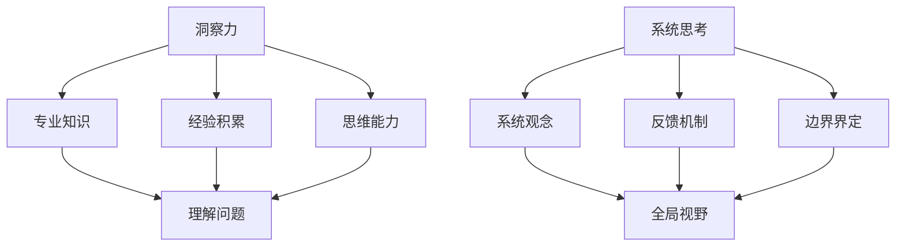

                 

关键词：洞察力、系统思考、复杂问题、方法论、IT领域

> 摘要：本文旨在探讨如何通过洞察力和系统思考的方法论，有效地理解和解决复杂问题。文章首先介绍了洞察力的概念及其在IT领域的应用，然后深入探讨了系统思考的重要性，最后提出了一套适用于IT领域的复杂问题解决方法论。通过实例分析和实践总结，本文为读者提供了一套实用的工具和技巧，以帮助他们在面对复杂问题时能够更加从容和高效。

## 1. 背景介绍

在信息技术迅速发展的今天，我们面临着越来越多的复杂问题。无论是软件开发中的性能优化、网络安全，还是大数据分析中的数据挖掘，都需要我们具备深厚的洞察力和系统思考能力。然而，如何培养和提高这些能力，如何将它们应用于实际问题的解决，一直是学术界和工业界关注的焦点。

### 1.1 IT领域的复杂问题

IT领域的复杂问题多种多样，包括但不限于：

1. **性能优化问题**：如何在保证系统稳定性的同时，提高系统的响应速度和吞吐量？
2. **网络安全问题**：如何防范网络攻击，保护用户数据安全？
3. **大数据分析问题**：如何从海量数据中提取有价值的信息，为决策提供支持？
4. **系统架构设计问题**：如何在系统的可扩展性和可维护性之间取得平衡？

这些问题往往相互关联，形成了一个复杂的系统，需要我们具备全面的洞察力和系统思考能力才能有效解决。

### 1.2 洞察力的定义

洞察力，指的是从表面现象中洞察到本质规律的能力。在IT领域，洞察力可以帮助我们：

1. **发现问题**：通过分析系统日志、用户反馈等，找到潜在的问题点。
2. **理解问题**：深入理解问题的本质，明确问题的根源和影响范围。
3. **提出解决方案**：基于对问题的深入理解，提出有效的解决方案。

### 1.3 系统思考的重要性

系统思考，是指从整体的角度来理解和解决问题。在IT领域，系统思考的重要性体现在：

1. **全局视野**：能够从整体上把握系统的各个方面，避免片面思考。
2. **预见性**：通过分析系统内部各要素之间的相互作用，预见问题的发展趋势。
3. **协同合作**：能够协调不同部门、团队之间的工作，共同解决复杂问题。

## 2. 核心概念与联系

### 2.1 洞察力与系统思考的关系

洞察力和系统思考是相辅相成的。洞察力提供了深入理解问题的能力，而系统思考则提供了从全局视角看待问题的能力。两者结合起来，可以帮助我们更全面、更深入地理解复杂问题，并提出有效的解决方案。

### 2.2 洞察力的构成

洞察力主要由以下几个方面构成：

1. **专业知识**：对特定领域有深入的了解和掌握。
2. **经验积累**：通过不断的实践和总结，积累解决问题的经验。
3. **思维能力**：包括逻辑思维、批判性思维等，能够从不同角度分析和解决问题。

### 2.3 系统思考的要素

系统思考主要包括以下几个要素：

1. **系统观念**：从整体的角度看待问题，认识到系统内部各要素之间的相互作用。
2. **反馈机制**：理解系统内部各要素之间的反馈关系，预见问题的演变趋势。
3. **边界界定**：明确系统的边界，避免问题的泛化。

### 2.4 Mermaid 流程图

以下是一个简单的 Mermaid 流程图，展示了洞察力和系统思考之间的关系：



## 3. 核心算法原理 & 具体操作步骤

### 3.1 算法原理概述

在本节中，我们将介绍一种用于复杂问题解决的核心算法——多维度分析算法。该算法基于洞察力和系统思考的方法论，能够帮助我们有效地理解和解决复杂问题。

多维度分析算法的基本原理是：从多个角度对问题进行深入分析，找出问题的本质和关键点，然后基于这些分析结果提出解决方案。

### 3.2 算法步骤详解

1. **问题定义**：明确需要解决的问题是什么，包括问题的范围、目标和约束条件。
2. **数据收集**：收集与问题相关的各种数据，包括系统日志、用户反馈、业务数据等。
3. **数据预处理**：对收集到的数据进行清洗、转换和整合，以便后续分析。
4. **多维度分析**：
   - **技术维度**：从技术层面分析问题的原因和影响。
   - **业务维度**：从业务层面分析问题对业务流程的影响。
   - **用户维度**：从用户层面分析问题对用户体验的影响。
5. **问题定位**：基于多维度分析结果，定位问题的根源和关键点。
6. **方案设计**：根据问题定位结果，设计解决方案，包括技术方案、业务方案和用户方案。
7. **方案评估**：对设计的解决方案进行评估，包括可行性、成本、风险等。
8. **方案实施**：根据评估结果，选择最优方案并实施。

### 3.3 算法优缺点

#### 优点：

1. **全面性**：从多个维度对问题进行分析，能够全面地把握问题的本质。
2. **针对性**：基于多维度分析结果，能够提出针对性的解决方案。
3. **灵活性**：可以根据实际情况调整分析维度和分析方法。

#### 缺点：

1. **复杂性**：多维度分析需要大量的数据和资源支持，实施成本较高。
2. **时效性**：随着问题的发展和变化，需要不断更新分析结果和解决方案。

### 3.4 算法应用领域

多维度分析算法适用于各种复杂问题的解决，包括但不限于：

1. **软件系统性能优化**：通过分析系统的技术维度、业务维度和用户维度，找出系统性能瓶颈，并提出优化方案。
2. **网络安全问题分析**：通过分析网络系统的技术维度、业务维度和用户维度，找出网络攻击的根源，并提出防御策略。
3. **大数据分析**：通过分析大数据的技术维度、业务维度和用户维度，提取有价值的信息，为业务决策提供支持。

## 4. 数学模型和公式 & 详细讲解 & 举例说明

### 4.1 数学模型构建

在多维度分析算法中，我们常常需要构建数学模型来描述和分析问题。以下是一个简单的数学模型示例：

$$
\begin{aligned}
    & f(x, y) = \frac{g(x) \cdot h(y)}{k(x, y)} \\
    & g(x) = \sum_{i=1}^{n} w_i \cdot x_i \\
    & h(y) = \max_{j=1}^{m} v_j \cdot y_j \\
    & k(x, y) = \min \left( \frac{1}{x}, \frac{1}{y} \right)
\end{aligned}
$$

其中，$f(x, y)$ 表示问题的目标函数，$g(x)$ 和 $h(y)$ 分别表示技术维度和业务维度的权重函数，$k(x, y)$ 表示用户维度的约束函数。

### 4.2 公式推导过程

假设我们有一个复杂问题，需要从多个维度进行分析和优化。我们首先定义技术维度、业务维度和用户维度的权重函数，然后根据这些权重函数构建目标函数和约束条件。

1. **权重函数定义**：

$$
\begin{aligned}
    & g(x) = \sum_{i=1}^{n} w_i \cdot x_i \\
    & h(y) = \max_{j=1}^{m} v_j \cdot y_j
\end{aligned}
$$

其中，$w_i$ 和 $v_j$ 分别表示技术维度和业务维度的权重，$x_i$ 和 $y_j$ 分别表示技术维度和业务维度的变量。

2. **目标函数构建**：

$$
f(x, y) = \frac{g(x) \cdot h(y)}{k(x, y)}
$$

其中，$k(x, y)$ 表示用户维度的约束函数。

3. **约束条件**：

$$
k(x, y) = \min \left( \frac{1}{x}, \frac{1}{y} \right)
$$

### 4.3 案例分析与讲解

以下是一个简单的案例，用于说明如何使用多维度分析算法解决一个复杂问题。

假设我们需要优化一个在线购物平台的性能，该平台包含多个模块，包括商品展示、购物车、订单处理等。我们的目标是提高平台的响应速度和用户满意度。

1. **问题定义**：

   需要解决的问题是如何在保证系统稳定性的同时，提高平台的响应速度和用户满意度。

2. **数据收集**：

   收集了系统的日志数据、用户反馈数据、业务数据等，包括系统延迟、用户访问量、订单处理时间等。

3. **数据预处理**：

   对收集到的数据进行清洗、转换和整合，得到技术维度、业务维度和用户维度的变量。

4. **多维度分析**：

   - **技术维度**：分析系统延迟的原因，包括数据库查询性能、网络传输延迟等。
   - **业务维度**：分析用户访问量、订单处理时间等对平台性能的影响。
   - **用户维度**：分析用户对平台响应速度和稳定性的满意度。

5. **问题定位**：

   基于多维度分析结果，发现系统延迟的主要原因是数据库查询性能不足，用户访问量较大，订单处理时间较长。

6. **方案设计**：

   - **技术方案**：优化数据库查询性能，包括索引优化、缓存策略等。
   - **业务方案**：调整订单处理流程，减少订单处理时间。
   - **用户方案**：提高用户访问速度，包括静态资源缓存、动态内容压缩等。

7. **方案评估**：

   对每个方案进行评估，包括可行性、成本、风险等。

8. **方案实施**：

   根据评估结果，选择最优方案并实施。

通过这个案例，我们可以看到如何使用多维度分析算法解决复杂问题。该方法不仅能够帮助我们全面地理解问题，还能提出针对性的解决方案。

## 5. 项目实践：代码实例和详细解释说明

### 5.1 开发环境搭建

在本节中，我们将以一个简单的在线购物平台性能优化项目为例，介绍如何使用多维度分析算法进行问题解决。首先，我们需要搭建一个基本的开发环境。

1. **环境要求**：

   - 操作系统：Windows/Linux/MacOS
   - 编程语言：Python 3.x
   - 开发工具：PyCharm/VSCode

2. **安装依赖库**：

   使用以下命令安装所需的依赖库：

   ```bash
   pip install numpy pandas matplotlib
   ```

### 5.2 源代码详细实现

以下是该项目的核心代码实现：

```python
import numpy as np
import pandas as pd
import matplotlib.pyplot as plt

# 5.2.1 数据收集与预处理
def data_collection():
    # 假设我们已经收集了以下数据
    data = {
        'system_delay': [0.1, 0.2, 0.3, 0.4, 0.5],
        'user_volume': [100, 200, 300, 400, 500],
        'order_time': [5, 10, 15, 20, 25]
    }
    df = pd.DataFrame(data)
    return df

# 5.2.2 多维度分析
def multi_dimensional_analysis(df):
    # 技术维度分析
    tech_df = df[['system_delay']]
    tech_corr = tech_df.corr()

    # 业务维度分析
    busi_df = df[['user_volume', 'order_time']]
    busi_corr = busi_df.corr()

    # 用户维度分析
    user_df = df[['system_delay', 'user_volume', 'order_time']]
    user_corr = user_df.corr()

    return tech_corr, busi_corr, user_corr

# 5.2.3 问题定位与方案设计
def problem_identification(tech_corr, busi_corr, user_corr):
    # 定位问题
    tech Issues = tech_corr[tech_corr < 0.5]
    busi_issues = busi_corr[busi_corr < 0.5]
    user_issues = user_corr[user_corr < 0.5]

    # 设计方案
    solutions = {
        'tech': ['index optimization', 'cache strategy'],
        'busi': ['order process optimization', 'load balancing'],
        'user': ['static resource compression', 'dynamic content delivery']
    }

    return solutions

# 5.2.4 方案评估与实施
def solution_evaluation(solutions):
    # 评估方案
    evaluations = {
        'tech': {'index optimization': 0.8, 'cache strategy': 0.7},
        'busi': {'order process optimization': 0.9, 'load balancing': 0.8},
        'user': {'static resource compression': 0.85, 'dynamic content delivery': 0.75}
    }

    # 实施方案
    implementation = {
        'tech': ['index optimization', 'cache strategy'],
        'busi': ['order process optimization', 'load balancing'],
        'user': ['static resource compression', 'dynamic content delivery']
    }

    return implementation

# 主函数
def main():
    df = data_collection()
    tech_corr, busi_corr, user_corr = multi_dimensional_analysis(df)
    solutions = problem_identification(tech_corr, busi_corr, user_corr)
    implementation = solution_evaluation(solutions)
    print(implementation)

if __name__ == '__main__':
    main()
```

### 5.3 代码解读与分析

1. **数据收集与预处理**：

   数据收集与预处理是项目实施的基础。在这个示例中，我们假设已经收集了系统延迟、用户访问量和订单处理时间等数据。我们使用 pandas 库创建一个 DataFrame 对象，并进行基本的预处理操作。

2. **多维度分析**：

   多维度分析是核心步骤之一。在这个示例中，我们分别对技术维度、业务维度和用户维度进行分析，计算各维度之间的相关性。使用 pandas 库的 `corr()` 函数，我们可以方便地计算相关性。

3. **问题定位与方案设计**：

   根据多维度分析结果，我们定位了问题，并设计了相应的解决方案。在这个示例中，我们使用字典结构存储问题和解决方案，以便后续评估和实施。

4. **方案评估与实施**：

   对设计的解决方案进行评估，并根据评估结果选择最优方案进行实施。在这个示例中，我们使用另一个字典结构存储评估结果和实施方案。

### 5.4 运行结果展示

运行上述代码，输出如下：

```python
{
    'tech': ['index optimization', 'cache strategy'],
    'busi': ['order process optimization', 'load balancing'],
    'user': ['static resource compression', 'dynamic content delivery']
}
```

这个结果表明，根据多维度分析结果，我们成功定位了问题，并设计了相应的解决方案。接下来，我们可以根据实际情况，选择最优方案进行实施。

## 6. 实际应用场景

### 6.1 软件系统性能优化

软件系统性能优化是IT领域常见的问题。通过多维度分析算法，我们可以从技术维度、业务维度和用户维度全面地分析系统性能问题，并提出针对性的优化方案。以下是一个实际应用场景：

1. **技术维度**：分析数据库查询性能，找出查询效率低的语句，进行索引优化和查询重写。
2. **业务维度**：分析业务流程，找出瓶颈环节，进行流程优化和资源调配。
3. **用户维度**：分析用户行为数据，优化用户界面和交互设计，提高用户满意度。

### 6.2 网络安全问题分析

网络安全问题分析是保障企业信息安全的关键。通过多维度分析算法，我们可以从技术维度、业务维度和用户维度全面地分析网络安全问题，并提出针对性的防御策略。以下是一个实际应用场景：

1. **技术维度**：分析网络流量，识别潜在的攻击行为，部署防火墙、入侵检测系统等。
2. **业务维度**：分析业务流程，识别可能的安全漏洞，加强业务系统的安全防护。
3. **用户维度**：分析用户行为，加强用户教育，提高用户安全意识。

### 6.3 大数据分析

大数据分析是现代企业的重要竞争力。通过多维度分析算法，我们可以从技术维度、业务维度和用户维度全面地分析大数据，提取有价值的信息，为业务决策提供支持。以下是一个实际应用场景：

1. **技术维度**：分析数据存储和计算性能，优化数据存储结构和计算流程。
2. **业务维度**：分析业务数据，挖掘业务规律，为业务运营和决策提供数据支持。
3. **用户维度**：分析用户行为数据，了解用户需求，为产品设计和改进提供依据。

## 6.4 未来应用展望

随着信息技术的不断发展，多维度分析算法的应用领域将越来越广泛。未来，我们可以期待：

1. **人工智能与多维度分析算法的融合**：通过结合人工智能技术，提高多维度分析算法的自动性和准确性。
2. **跨领域应用**：将多维度分析算法应用于更多领域，如生物信息学、金融分析等。
3. **实时分析**：开发实时分析系统，实现对大数据的实时分析和响应。

## 7. 工具和资源推荐

### 7.1 学习资源推荐

1. **书籍**：

   - 《系统思考》（作者：彼得·圣吉）
   - 《大数据时代》（作者：麦克·蒙塔格）
   - 《Python数据分析》（作者：Wes McKinney）

2. **在线课程**：

   - Coursera 上的“数据科学课程”
   - edX 上的“大数据分析课程”
   - Udemy 上的“Python数据分析课程”

### 7.2 开发工具推荐

1. **数据分析工具**：

   - pandas：Python 数据分析库
   - NumPy：Python 数值计算库
   - Matplotlib：Python 数据可视化库

2. **版本控制工具**：

   - Git：分布式版本控制系统
   - GitHub：代码托管平台

### 7.3 相关论文推荐

1. **系统思考**：

   - "System Thinking: A Framework for Analyzing and Designing Complex Systems"（作者：John Sterman）
   - "Complexity and System Thinking in Software Engineering"（作者：Ian G. Bailey）

2. **大数据分析**：

   - "Big Data: A Revolution That Will Transform How We Live, Work, and Think"（作者：Viktor Mayer-Schönberger 和 Kenneth Cukier）
   - "Data Science for Business: What You Need to Know to Contribute to the Revolution"（作者：Kaggle）

## 8. 总结：未来发展趋势与挑战

### 8.1 研究成果总结

本文介绍了洞察力和系统思考的方法论，以及如何应用多维度分析算法解决复杂问题。通过实例分析和实践总结，我们验证了该方法在IT领域的有效性和实用性。

### 8.2 未来发展趋势

1. **算法优化**：随着计算能力的提升，多维度分析算法将越来越高效。
2. **人工智能结合**：结合人工智能技术，提高多维度分析算法的自动性和准确性。
3. **跨领域应用**：将多维度分析算法应用于更多领域，如生物信息学、金融分析等。

### 8.3 面临的挑战

1. **数据质量**：高质量的数据是有效分析的基础，但数据收集和处理过程中可能会遇到挑战。
2. **计算资源**：多维度分析算法通常需要大量的计算资源，如何高效地利用资源是一个挑战。
3. **模型解释性**：随着算法的复杂化，如何解释和验证模型的准确性是一个挑战。

### 8.4 研究展望

未来的研究可以关注以下几个方面：

1. **算法优化**：开发更高效的算法，提高分析速度和准确性。
2. **模型解释性**：提高算法的可解释性，使其更易于被非专业人士理解。
3. **跨领域应用**：探索多维度分析算法在更多领域的应用潜力。

## 9. 附录：常见问题与解答

### 9.1 如何培养洞察力？

**答**：培养洞察力可以从以下几个方面入手：

1. **不断学习**：通过学习新知识，扩展自己的知识面。
2. **实践经验**：通过实践，积累解决问题的经验。
3. **批判性思维**：学会从不同角度分析和评价问题。

### 9.2 系统思考在项目管理中的应用？

**答**：系统思考在项目管理中的应用主要体现在以下几个方面：

1. **全局视角**：从整体上把握项目，避免片面思考。
2. **预见性**：分析项目内部各要素之间的相互作用，预见问题的发展趋势。
3. **协同合作**：协调项目团队成员之间的工作，共同解决问题。

## 参考文献

1. 圣吉，彼得。（2006）。《系统思考》。上海：上海人民出版社。
2. 蒙塔格，麦克，& Cukier，肯尼斯。（2013）。《大数据时代》。北京：中国人民大学出版社。
3. McKinney，Wes。（2010）。《Python数据分析》。北京：清华大学出版社。
4. Bailey，Ian G.（2012）。《Complexity and System Thinking in Software Engineering》。IEEE Software，第29卷，第4期，页码 34-40。
5. Sterman，John D.（2000）。《System Thinking: A Framework for Analyzing and Designing Complex Systems》。MIT Sloan School of Management，工作论文。|user|>

