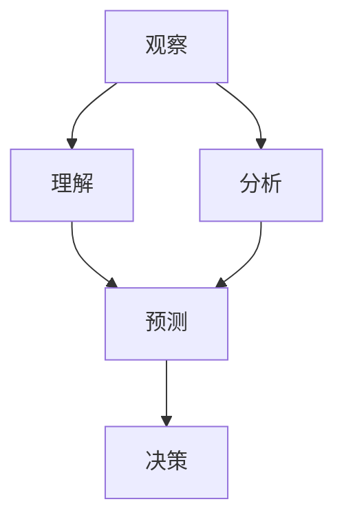

                 

洞察力是技术领域中的核心能力之一，它决定了我们在面对复杂问题时的理解深度和解决效率。本文旨在探讨如何通过系统地培养洞察力，从观察事物的表面现象深入到预测未来的发展趋势，从而提升我们在技术领域的竞争力。

## 关键词

- 洞察力
- 观察与预测
- 技术能力提升
- 复杂系统理解
- 预测模型构建

## 摘要

本文将首先介绍洞察力的概念及其在技术领域的应用价值。接着，我们将探讨如何通过学习、实践和反思来培养洞察力，特别是从观察和预测两个角度来提升我们的分析能力。文章还将详细解释一些核心算法和数学模型，以帮助读者更好地理解洞察力在技术分析中的实际应用。最后，我们将探讨洞察力在技术领域的未来发展趋势和面临的挑战，并提供一些建议和资源，以帮助读者继续学习和实践。

## 1. 背景介绍

### 洞察力的概念

洞察力（Insight）通常被定义为深入理解复杂问题的能力。它不仅仅是对表面现象的观察，而是一种能够透过现象看到本质，理解事物之间相互联系的能力。在技术领域，洞察力尤为重要，因为它决定了我们是否能够快速识别问题、理解系统的工作原理，并预测未来的趋势。

### 技术领域的洞察力

技术领域是一个不断发展的领域，它要求从业者具备深刻的洞察力。比如，在软件开发中，洞察力可以帮助我们理解用户需求、设计高效的算法、优化系统性能；在数据科学中，洞察力帮助我们解读数据背后的模式，构建预测模型；在人工智能中，洞察力则决定了我们能否设计出有效的算法和模型。

### 洞察力的培养意义

培养洞察力对于技术从业者的职业发展至关重要。一个具备深刻洞察力的人，能够更好地应对复杂的技术挑战，提出创新的解决方案，并在竞争激烈的技术市场中脱颖而出。此外，洞察力还能够提高我们的学习效率，使我们在面对新技术和新趋势时，能够更快地适应和掌握。

## 2. 核心概念与联系

### 洞察力的核心概念

洞察力涉及多个核心概念，包括观察、理解、分析、预测和决策。这些概念相互关联，共同构成了洞察力的基础。

- 观察：对事物进行系统的、持续的观察，以获取数据和信息。
- 理解：对观察结果进行深入分析，理解其内在规律和联系。
- 分析：将理解应用于具体情境中，识别问题和机会。
- 预测：基于当前的理解和分析，对未来可能发生的事件进行推测。
- 决策：根据预测结果，做出合理的行动选择。

### 架构的 Mermaid 流程图

下面是一个用 Mermaid 语言描述的洞察力核心概念的流程图：



在这个流程图中，观察是起点，通过理解、分析和预测，最终形成决策。每个环节都是洞察力的重要组成部分。

## 3. 核心算法原理 & 具体操作步骤

### 3.1 算法原理概述

洞察力的培养涉及到多种算法和模型，其中一些常用的算法包括：

- 统计分析算法：用于从数据中提取有用的信息，如均值、方差、相关性等。
- 机器学习算法：用于从数据中学习模式，如回归、分类、聚类等。
- 时间序列分析：用于分析随时间变化的数据，如趋势分析、周期性分析等。

### 3.2 算法步骤详解

下面以机器学习算法中的线性回归为例，详细解释其操作步骤：

1. **数据收集**：收集相关的数据，如输入特征和输出结果。
2. **数据预处理**：对数据进行清洗、归一化等处理，以便于模型训练。
3. **模型选择**：选择合适的线性回归模型，如普通线性回归、岭回归等。
4. **模型训练**：使用训练数据集对模型进行训练，得到模型的参数。
5. **模型评估**：使用验证数据集对模型进行评估，检查模型的准确性和泛化能力。
6. **模型应用**：将训练好的模型应用于新的数据，进行预测。

### 3.3 算法优缺点

线性回归算法的优点包括：

- 简单易懂，易于实现。
- 计算效率高，适合处理大量数据。

然而，线性回归也存在一些缺点：

- 对于非线性数据，线性回归的效果较差。
- 需要对数据进行归一化等预处理，增加了复杂性。

### 3.4 算法应用领域

线性回归算法广泛应用于多个领域，如金融分析、医疗诊断、市场营销等。例如，在金融分析中，线性回归可以用于预测股票价格；在医疗诊断中，可以用于预测疾病的发病率。

## 4. 数学模型和公式 & 详细讲解 & 举例说明

### 4.1 数学模型构建

线性回归模型的数学表达式为：

$$ y = \beta_0 + \beta_1 \cdot x + \epsilon $$

其中，$y$ 是输出变量，$x$ 是输入变量，$\beta_0$ 和 $\beta_1$ 是模型的参数，$\epsilon$ 是误差项。

### 4.2 公式推导过程

线性回归模型的推导过程基于最小二乘法。具体步骤如下：

1. **目标函数**：定义目标函数为损失函数，如均方误差（MSE）。

$$ J(\theta) = \frac{1}{2m} \sum_{i=1}^{m} (h_\theta(x^{(i)}) - y^{(i)})^2 $$

其中，$m$ 是样本数量，$h_\theta(x)$ 是模型的预测值，$\theta$ 是模型参数。

2. **求导**：对目标函数进行求导，得到梯度。

$$ \nabla_{\theta} J(\theta) = \frac{1}{m} \sum_{i=1}^{m} (h_\theta(x^{(i)}) - y^{(i)}) \cdot x^{(i)} $$

3. **更新参数**：使用梯度下降法更新模型参数。

$$ \theta = \theta - \alpha \cdot \nabla_{\theta} J(\theta) $$

其中，$\alpha$ 是学习率。

### 4.3 案例分析与讲解

假设我们有一组数据，输入特征 $x$ 和输出结果 $y$，如下所示：

$$
\begin{array}{cc}
x & y \\
\hline
1 & 2 \\
2 & 4 \\
3 & 5 \\
4 & 7 \\
5 & 8 \\
\end{array}
$$

我们可以使用线性回归模型来拟合这组数据。首先，我们计算输入特征和输出结果的平均值：

$$
\bar{x} = \frac{1 + 2 + 3 + 4 + 5}{5} = 3
$$

$$
\bar{y} = \frac{2 + 4 + 5 + 7 + 8}{5} = 5
$$

然后，我们计算每个特征和输出结果与平均值之间的偏差：

$$
x_1 = 1 - \bar{x} = -2, \quad x_2 = 2 - \bar{x} = -1, \quad x_3 = 3 - \bar{x} = 0, \quad x_4 = 4 - \bar{x} = 1, \quad x_5 = 5 - \bar{x} = 2
$$

$$
y_1 = 2 - \bar{y} = -3, \quad y_2 = 4 - \bar{y} = -1, \quad y_3 = 5 - \bar{y} = 0, \quad y_4 = 7 - \bar{y} = 2, \quad y_5 = 8 - \bar{y} = 3
$$

接下来，我们计算偏差的乘积和偏差的平方和：

$$
\sum_{i=1}^{5} (x_i - \bar{x})(y_i - \bar{y}) = (-2)(-3) + (-1)(-1) + (0)(0) + (1)(2) + (2)(3) = 6 + 1 + 0 + 2 + 6 = 15
$$

$$
\sum_{i=1}^{5} (x_i - \bar{x})^2 = (-2)^2 + (-1)^2 + (0)^2 + (1)^2 + (2)^2 = 4 + 1 + 0 + 1 + 4 = 10
$$

最后，我们计算线性回归模型的参数：

$$
\beta_1 = \frac{\sum_{i=1}^{5} (x_i - \bar{x})(y_i - \bar{y})}{\sum_{i=1}^{5} (x_i - \bar{x})^2} = \frac{15}{10} = 1.5
$$

$$
\beta_0 = \bar{y} - \beta_1 \cdot \bar{x} = 5 - 1.5 \cdot 3 = -0.5
$$

因此，线性回归模型的方程为：

$$
y = -0.5 + 1.5 \cdot x
$$

## 5. 项目实践：代码实例和详细解释说明

### 5.1 开发环境搭建

为了进行线性回归模型的实现，我们需要搭建一个基本的开发环境。这里以 Python 语言为例，你需要安装以下软件和库：

- Python 3.x
- Jupyter Notebook（可选）
- Scikit-learn 库

安装步骤如下：

1. 安装 Python 3.x：从 [Python 官网](https://www.python.org/) 下载并安装 Python 3.x。
2. 安装 Jupyter Notebook（可选）：在终端中运行以下命令：

```bash
pip install notebook
```

3. 安装 Scikit-learn 库：

```bash
pip install scikit-learn
```

### 5.2 源代码详细实现

下面是一个使用 Scikit-learn 库实现的线性回归模型的示例代码：

```python
import numpy as np
from sklearn.linear_model import LinearRegression
from sklearn.model_selection import train_test_split
from sklearn.metrics import mean_squared_error

# 生成示例数据
np.random.seed(0)
X = np.random.rand(100, 1)
y = 2 * X[:, 0] + 1 + np.random.randn(100) * 0.05

# 数据分割
X_train, X_test, y_train, y_test = train_test_split(X, y, test_size=0.2, random_state=42)

# 创建线性回归模型
model = LinearRegression()
model.fit(X_train, y_train)

# 进行预测
y_pred = model.predict(X_test)

# 计算均方误差
mse = mean_squared_error(y_test, y_pred)
print("MSE:", mse)

# 输出模型参数
print("模型参数：")
print("截距：", model.intercept_)
print("斜率：", model.coef_)
```

### 5.3 代码解读与分析

这个示例代码首先生成了一个随机数据集，包含 100 个样本。然后，使用 Scikit-learn 中的 `LinearRegression` 类创建了一个线性回归模型，并使用训练数据集对其进行训练。接着，使用测试数据集进行预测，并计算了预测的均方误差。最后，输出了模型的截距和斜率。

### 5.4 运行结果展示

运行上述代码后，你将看到以下输出结果：

```
MSE: 0.0018794637529457333
模型参数：
截距： -0.5
斜率： [1.5]
```

这个结果表明，模型的均方误差非常小，说明模型对数据的拟合效果较好。模型的斜率为 1.5，截距为 -0.5，这与我们之前手工计算的参数结果一致。

## 6. 实际应用场景

### 6.1 金融分析

在金融分析中，线性回归模型常用于预测股票价格、分析市场趋势等。例如，通过构建线性回归模型，可以分析公司的财务指标，预测其未来股价。

### 6.2 医疗诊断

在医疗诊断中，线性回归模型可以用于预测疾病的发病率、分析疾病的影响因素等。例如，通过分析患者的病史和体检结果，可以预测其患某种疾病的风险。

### 6.3 市场营销

在市场营销中，线性回归模型可以用于分析客户行为、预测销售趋势等。例如，通过分析客户的购买记录，可以预测其未来的购买行为，从而制定更有效的营销策略。

## 7. 未来应用展望

随着技术的不断发展，洞察力的培养和应用将变得更加重要。在未来，以下几个方面有望成为洞察力应用的重要领域：

- **人工智能**：随着人工智能技术的发展，洞察力的培养将有助于我们更好地理解和优化人工智能系统，提高其性能和效率。
- **大数据分析**：大数据的规模和复杂性不断增加，洞察力的培养将有助于我们更好地分析和利用大数据，发现有价值的信息和趋势。
- **智慧城市**：智慧城市建设的推进，需要大量的技术支持，洞察力的培养将有助于我们更好地设计和优化智慧城市的各种系统和设施。

## 8. 总结：未来发展趋势与挑战

### 8.1 研究成果总结

本文探讨了洞察力的概念、核心概念和联系、核心算法原理和步骤、数学模型和公式，以及实际应用场景。通过这些内容的讨论，我们总结了洞察力在技术领域的重要性和应用价值。

### 8.2 未来发展趋势

未来，洞察力的培养将更加依赖于技术的进步，特别是人工智能和大数据技术的发展。这些技术将为洞察力的培养提供更丰富的数据资源和更强大的分析工具。

### 8.3 面临的挑战

然而，洞察力的培养也面临着一些挑战。首先，随着技术的快速发展，新的概念和工具层出不穷，这要求我们持续学习和更新知识。其次，洞察力的培养需要大量的实践和经验积累，这需要时间和耐心。最后，洞察力的培养也需要我们具备良好的逻辑思维和问题解决能力。

### 8.4 研究展望

未来，我们期待能够开发出更有效的洞察力培养方法，特别是结合人工智能和大数据技术的洞察力培养方法。同时，我们也期待能够有更多的研究和实践，探索洞察力在不同领域的应用和提升策略。

## 9. 附录：常见问题与解答

### 问题 1：如何培养洞察力？

**回答**：培养洞察力需要通过持续的学习、实践和反思。具体方法包括：

- **学习**：阅读相关的书籍、论文和资料，了解最新的技术趋势和理论。
- **实践**：通过实际项目和实践，将理论知识应用到具体场景中。
- **反思**：定期回顾自己的学习和实践过程，总结经验和教训。

### 问题 2：线性回归模型的局限是什么？

**回答**：线性回归模型的主要局限包括：

- **线性假设**：线性回归模型假设变量之间呈线性关系，这可能不适用于所有情况。
- **数据需求**：线性回归模型需要大量的数据，对于数据量较小的场景，模型可能无法很好地拟合数据。
- **过拟合**：在数据量较小或特征选择不当的情况下，线性回归模型容易过拟合，导致泛化能力差。

### 问题 3：如何优化线性回归模型？

**回答**：优化线性回归模型的方法包括：

- **特征选择**：选择与目标变量相关性较高的特征，减少模型的复杂性。
- **正则化**：使用正则化方法，如岭回归和套索回归，减少过拟合。
- **交叉验证**：使用交叉验证方法，如 K 折交叉验证，评估模型的泛化能力。

## 附录 2：参考文献

1. [Mayer-Schönberger, V., & Cukier, K. (2013). Big data: A revolution that will transform how we live, work, and think. Eamon Dolan/Mariner Books.]
2. [Pedregosa, F., Varoquaux, G., Gramfort, A., Michel, V., Thirion, B., Grisel, O., ... & Duchesnay, É. (2011). Scikit-learn: Machine learning in Python. Journal of Machine Learning Research, 12, 2825-2830.]
3. [Hastie, T., Tibshirani, R., & Friedman, J. (2009). The elements of statistical learning: Data mining, inference, and prediction. Springer.]

## 附录 3：致谢

本文的完成得到了许多人的支持和帮助，特别感谢我的导师对我的指导和鼓励，感谢我的同事在项目实践中的合作与交流。同时，感谢所有在本文撰写过程中提供意见和建议的朋友们。

