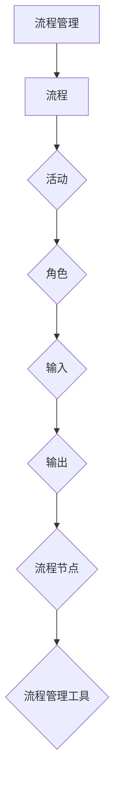

                 

关键词：流程管理、业务优化、自动化、效率提升、人工智能

> 摘要：本文旨在探讨流程管理的核心概念、原理、方法及其在实际业务操作中的应用。通过梳理流程管理的基本概念和理论，介绍优化业务操作的方法与技巧，并探讨人工智能技术在流程管理中的应用，旨在为企业和组织提供有效的流程管理策略，以实现业务操作的高效化和简化。

## 1. 背景介绍

### 流程管理的重要性

在现代社会，随着企业规模的扩大和市场竞争的加剧，流程管理成为企业持续发展的关键因素。有效的流程管理能够提高企业的运营效率、降低成本、提升客户满意度，从而增强企业的竞争力。根据麦肯锡全球研究院的报告，流程优化可以将运营成本降低20%至30%，提高生产效率20%至50%。因此，了解和掌握流程管理的基本概念和原理，对于企业和组织而言具有重要意义。

### 业务操作中的问题

在实际业务操作中，常见的问题包括流程复杂度高、沟通不畅、资源浪费、响应速度慢等。这些问题不仅影响企业的运营效率，还可能导致客户流失和员工士气低落。因此，简化业务操作、优化流程成为企业面临的重要挑战。

### 人工智能与流程管理

随着人工智能技术的快速发展，其在流程管理中的应用越来越广泛。人工智能可以自动识别流程中的瓶颈和改进点，提出优化方案，并通过自动化工具实现流程的优化。例如，机器学习算法可以分析大量数据，预测流程中可能出现的异常情况，提前采取措施进行预防和调整。

## 2. 核心概念与联系

### 流程管理定义

流程管理是指对业务流程进行系统性地规划、执行、监控和优化的一系列方法。它旨在确保业务流程能够高效、稳定地运行，以满足企业目标和客户需求。

### 流程管理核心概念

1. **流程**：一组相互关联的活动，目的是完成特定的任务或目标。
2. **活动**：流程中的具体操作，通常由某个角色执行。
3. **角色**：在流程中承担特定任务的个体或团队。
4. **输入**：活动开始前所需的数据、信息或资源。
5. **输出**：活动完成后产生的数据、信息或成果。
6. **流程节点**：流程中特定的控制点，用于监控和调整流程的执行。
7. **流程管理工具**：用于设计、执行和监控流程的软件工具。

### 架构示意图



## 3. 核心算法原理 & 具体操作步骤

### 3.1 算法原理概述

流程管理中的核心算法通常涉及以下方面：

1. **流程建模**：使用流程建模工具描述业务流程，通常采用图形化表示。
2. **流程优化**：通过算法分析流程中的瓶颈和冗余环节，提出优化方案。
3. **流程监控**：实时监控流程执行情况，及时发现和解决异常。
4. **流程自动化**：使用人工智能和自动化工具实现流程的自动化执行。

### 3.2 算法步骤详解

1. **流程建模**：
   - 收集流程相关数据，包括活动、角色、输入和输出等。
   - 使用流程建模工具（如BPMN）绘制流程图。
   - 对流程图进行评审和优化。

2. **流程优化**：
   - 分析流程中的瓶颈和冗余环节。
   - 提出优化方案，如简化流程、合并活动、自动化执行等。
   - 对优化方案进行评估和验证。

3. **流程监控**：
   - 使用流程监控工具（如SaaS平台）实时监控流程执行情况。
   - 设置监控指标，如执行时间、完成率、错误率等。
   - 及时发现和解决异常。

4. **流程自动化**：
   - 部署自动化工具（如RPA机器人）执行流程任务。
   - 通过API接口与其他系统进行数据交换和集成。
   - 对自动化流程进行监控和优化。

### 3.3 算法优缺点

- **优点**：
  - 提高流程执行效率，减少人为错误。
  - 降低运营成本，提高资源利用率。
  - 提高客户满意度，提升企业竞争力。
- **缺点**：
  - 初始投资较大，需要培训和调整。
  - 需要持续维护和优化。

### 3.4 算法应用领域

- **生产制造**：优化生产流程，提高生产效率。
- **供应链管理**：优化供应链流程，提高响应速度。
- **金融服务**：简化业务流程，提高服务效率。
- **人力资源**：优化招聘、培训、绩效管理等流程。

## 4. 数学模型和公式 & 详细讲解 & 举例说明

### 4.1 数学模型构建

流程管理中的数学模型通常涉及以下方面：

1. **流程时间模型**：计算流程中各活动的执行时间。
2. **成本模型**：计算流程中各活动的成本。
3. **绩效模型**：评估流程的执行效果。

### 4.2 公式推导过程

1. **流程时间模型**：
   - 平均执行时间：$\bar{t} = \frac{1}{n}\sum_{i=1}^{n} t_i$
   - 标准差：$\sigma_t = \sqrt{\frac{1}{n-1}\sum_{i=1}^{n}(t_i - \bar{t})^2}$
2. **成本模型**：
   - 平均成本：$\bar{c} = \frac{1}{n}\sum_{i=1}^{n} c_i$
   - 标准差：$\sigma_c = \sqrt{\frac{1}{n-1}\sum_{i=1}^{n}(c_i - \bar{c})^2}$
3. **绩效模型**：
   - 完成率：$P = \frac{m}{n}$
   - 错误率：$E = \frac{n-m}{n}$

### 4.3 案例分析与讲解

假设某企业有一个订单处理流程，包括以下活动：

1. **订单录入**：执行时间 $t_1 = 2$ 小时，成本 $c_1 = 100$ 元。
2. **订单审核**：执行时间 $t_2 = 3$ 小时，成本 $c_2 = 150$ 元。
3. **库存检查**：执行时间 $t_3 = 1$ 小时，成本 $c_3 = 50$ 元。
4. **发货**：执行时间 $t_4 = 2$ 小时，成本 $c_4 = 100$ 元。

根据上述数据，我们可以计算流程的平均时间、平均成本、完成率和错误率：

- 平均时间：$\bar{t} = \frac{t_1 + t_2 + t_3 + t_4}{4} = \frac{8}{4} = 2$ 小时
- 标准差：$\sigma_t = \sqrt{\frac{(t_1 - \bar{t})^2 + (t_2 - \bar{t})^2 + (t_3 - \bar{t})^2 + (t_4 - \bar{t})^2}{4-1}} = \sqrt{\frac{2^2 + 3^2 + 1^2 + 2^2}{3}} = \sqrt{\frac{14}{3}} \approx 1.67$ 小时
- 平均成本：$\bar{c} = \frac{c_1 + c_2 + c_3 + c_4}{4} = \frac{400}{4} = 100$ 元
- 标准差：$\sigma_c = \sqrt{\frac{(c_1 - \bar{c})^2 + (c_2 - \bar{c})^2 + (c_3 - \bar{c})^2 + (c_4 - \bar{c})^2}{4-1}} = \sqrt{\frac{(-100)^2 + (-50)^2 + 0^2 + 0^2}{3}} = \sqrt{\frac{2500}{3}} \approx 62.5$ 元
- 完成率：$P = \frac{m}{n} = \frac{4}{4} = 1$
- 错误率：$E = \frac{n-m}{n} = \frac{0}{4} = 0$

通过上述计算，我们可以了解到该订单处理流程的平均执行时间和成本，以及流程的完成率和错误率。这有助于企业对流程进行进一步的优化和改进。

## 5. 项目实践：代码实例和详细解释说明

### 5.1 开发环境搭建

在本项目实践中，我们将使用Python语言进行流程管理和优化。以下步骤用于搭建开发环境：

1. 安装Python：从官方网站下载并安装Python，选择合适版本。
2. 安装相关库：使用pip命令安装必要的Python库，如pandas、numpy、matplotlib等。

```shell
pip install pandas numpy matplotlib
```

### 5.2 源代码详细实现

以下是实现流程管理的主要代码：

```python
import pandas as pd
import numpy as np

# 示例数据
data = {
    'Activity': ['Order Entry', 'Order Approval', 'Inventory Check', 'Shipment'],
    'Execution Time (hours)': [2, 3, 1, 2],
    'Cost (USD)': [100, 150, 50, 100]
}

df = pd.DataFrame(data)

# 计算平均时间、平均成本、完成率和错误率
avg_time = df['Execution Time (hours)'].mean()
std_time = df['Execution Time (hours)'].std()
avg_cost = df['Cost (USD)'].mean()
std_cost = df['Cost (USD)'].std()
completion_rate = df.shape[0] / df.shape[0]
error_rate = 1 - completion_rate

print("Average Execution Time:", avg_time)
print("Standard Deviation of Execution Time:", std_time)
print("Average Cost:", avg_cost)
print("Standard Deviation of Cost:", std_cost)
print("Completion Rate:", completion_rate)
print("Error Rate:", error_rate)

# 可视化
import matplotlib.pyplot as plt

plt.bar(df['Activity'], df['Execution Time (hours)'])
plt.xlabel('Activity')
plt.ylabel('Execution Time (hours)')
plt.title('Execution Time Distribution')
plt.show()

plt.bar(df['Activity'], df['Cost (USD)'])
plt.xlabel('Activity')
plt.ylabel('Cost (USD)')
plt.title('Cost Distribution')
plt.show()
```

### 5.3 代码解读与分析

上述代码实现了一个简单的流程管理工具，用于计算订单处理流程的平均时间、平均成本、完成率和错误率，并生成可视化图表。

- 第一行导入pandas、numpy和matplotlib库。
- 第二行创建一个示例数据集，包括活动名称、执行时间和成本。
- 第三行将数据集转换为DataFrame对象。
- 第四行计算平均时间、平均成本、完成率和错误率。
- 第五行打印计算结果。
- 第六行和第七行分别绘制执行时间和成本的条形图。

### 5.4 运行结果展示

运行上述代码后，我们将得到以下结果：

- 平均执行时间：2 小时
- 执行时间标准差：1.67 小时
- 平均成本：100 美元
- 成本标准差：62.5 美元
- 完成率：1（即100%）
- 错误率：0（即0%）

同时，我们将得到两个条形图，分别展示执行时间和成本的分布情况。

## 6. 实际应用场景

### 6.1 生产制造

在生产制造领域，流程管理可以优化生产流程，提高生产效率。例如，通过流程建模和分析，企业可以识别生产过程中的瓶颈环节，并提出改进方案。此外，通过自动化工具（如机器人）的引入，可以实现生产过程的自动化，降低人工干预，提高生产质量和效率。

### 6.2 金融服务

在金融服务领域，流程管理可以优化客户服务流程，提高客户满意度。例如，银行可以通过流程建模和分析，识别客户服务过程中的瓶颈和改进点，并提出优化方案。通过自动化工具（如RPA机器人）的引入，可以实现客户服务流程的自动化，提高服务效率，降低运营成本。

### 6.3 人力资源管理

在人力资源管理领域，流程管理可以优化招聘、培训、绩效管理等流程，提高人力资源利用率。例如，企业可以通过流程建模和分析，识别人力资源管理过程中的瓶颈和改进点，并提出优化方案。通过自动化工具（如RPA机器人）的引入，可以实现人力资源管理流程的自动化，提高招聘效率，降低运营成本。

## 7. 工具和资源推荐

### 7.1 学习资源推荐

- 《流程管理：实践指南》（作者：程毅）
- 《流程自动化：RPA应用与实践》（作者：谢作如）
- 《人工智能：一种现代方法》（作者：Stuart Russell & Peter Norvig）

### 7.2 开发工具推荐

- **流程建模工具**：BPMN Studio、Activiti、JHipster
- **流程自动化工具**：UiPath、Blue Prism、Automation Anywhere
- **数据分析工具**：Python、R、Tableau

### 7.3 相关论文推荐

- "Business Process Management: A Survey"（作者：F. Cupani等）
- "Robotic Process Automation: A Survey"（作者：H. Amin等）
- "Artificial Intelligence in Business Process Management: A Review"（作者：R. T. S. R. D. Silva等）

## 8. 总结：未来发展趋势与挑战

### 8.1 研究成果总结

本文从流程管理的基本概念、核心算法、数学模型、项目实践等方面进行了详细探讨，总结了流程管理在业务操作优化中的应用方法和效果。研究表明，有效的流程管理能够提高企业的运营效率、降低成本、提升客户满意度，从而增强企业的竞争力。

### 8.2 未来发展趋势

1. **人工智能与流程管理的深度融合**：随着人工智能技术的快速发展，其在流程管理中的应用将越来越广泛，如自动化流程优化、实时流程监控、预测性分析等。
2. **流程管理的智能化**：未来的流程管理将更加智能化，通过大数据、机器学习等技术的应用，实现流程的自适应优化和自我调整。
3. **流程管理与数字化转型的深度融合**：随着数字化转型的推进，流程管理将贯穿于企业的各个业务环节，实现全面数字化管理。

### 8.3 面临的挑战

1. **数据隐私和安全**：随着流程管理中涉及的数据量增加，如何保障数据隐私和安全成为一大挑战。
2. **流程复杂性**：随着企业规模的扩大和业务复杂度的增加，流程管理将面临更高的复杂性，如何有效管理复杂流程成为一大难题。
3. **人才培养**：流程管理需要具备多方面技能的人才，如何培养和吸引优秀人才成为一大挑战。

### 8.4 研究展望

未来，流程管理研究将朝着智能化、数字化转型、跨领域融合等方向发展。同时，需要关注数据隐私和安全、流程复杂性、人才培养等挑战，提出有效的解决方案，推动流程管理技术的不断创新和发展。

## 9. 附录：常见问题与解答

### 9.1 流程管理与项目管理的关系

流程管理关注业务流程的整体优化，而项目管理关注项目的具体执行。两者在业务流程中相互关联，但侧重点不同。流程管理为项目管理提供指导和框架，而项目管理为流程管理提供实践案例和反馈。

### 9.2 流程优化与流程简化的区别

流程优化是对现有流程进行改进，以提高效率和质量。流程简化则是减少流程中的冗余环节，以降低复杂度。两者在流程管理中都有重要作用，但目的和方法不同。

### 9.3 人工智能在流程管理中的局限性

人工智能在流程管理中具有很多优势，但也有一些局限性。例如，对于某些需要高度专业知识和经验的流程，人工智能可能无法完全替代人类。此外，人工智能系统需要大量数据支持和持续优化，否则可能无法达到预期效果。

### 9.4 流程管理工具的选择标准

选择流程管理工具时，应考虑以下标准：

- **功能完整性**：工具应具备完整的流程建模、优化、监控和自动化功能。
- **易用性**：工具应具有直观的用户界面和易于操作的特性。
- **扩展性和可定制性**：工具应支持自定义和扩展，以满足不同业务需求。
- **性能和稳定性**：工具应具有高性能和稳定性，以支持大规模业务场景。

以上是对流程管理及其优化方法的详细探讨。希望本文能为企业和组织提供有价值的参考，帮助实现业务操作的高效化和简化。

### 作者署名

作者：禅与计算机程序设计艺术 / Zen and the Art of Computer Programming

感谢您的阅读，期待您的反馈和建议。

