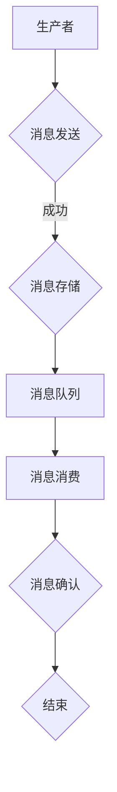

                 

关键词：消息队列，系统解耦，异步通信，分布式系统，微服务架构

摘要：本文将深入探讨消息队列在分布式系统中的作用，解析其核心概念和原理，并通过具体实例展示其实现和运行机制。我们将分析消息队列的优点和缺点，讨论其在不同场景下的应用，并展望其未来的发展趋势。通过本文的阅读，您将对消息队列有更全面的理解，并能够将其应用于实际的系统设计中。

## 1. 背景介绍

在现代软件开发中，分布式系统已经成为一种主流架构。随着系统的规模不断扩大，组件之间的交互变得愈发复杂。为了实现系统的高可用性、高扩展性和高容错性，设计者需要寻找一种有效的方法来解耦系统组件，使其能够独立运行和扩展。消息队列（Message Queue）作为一种异步通信机制，正是解决这一问题的关键。

### 1.1 分布式系统的挑战

分布式系统的特点包括：

- **高可用性**：系统中的任何一个组件发生故障，都不会影响整个系统的运行。
- **高扩展性**：可以通过水平扩展（增加节点数量）来满足不断增长的用户需求。
- **高容错性**：系统能够在部分节点失效的情况下保持运行，不会导致整个系统的崩溃。

然而，分布式系统也带来了许多挑战，例如：

- **组件解耦**：系统中的组件需要独立运行，互相之间不应有直接的依赖关系。
- **异步通信**：组件之间需要通过异步方式进行通信，以便实现并发处理和提高系统的响应能力。
- **数据一致性**：在分布式环境中，如何保持数据的一致性是一个难题。

### 1.2 消息队列的作用

消息队列（Message Queue，简称MQ）是一种在分布式系统中用于实现异步通信和消息传递的机制。通过消息队列，系统中的组件可以以松耦合的方式通信，从而实现以下目标：

- **解耦系统组件**：组件之间通过消息队列进行通信，无需直接交互，降低了系统的复杂性。
- **异步处理**：组件可以在不需要等待响应的情况下处理消息，提高了系统的并发处理能力。
- **负载均衡**：消息队列可以分配消息到不同的处理节点，实现了负载均衡，提高了系统的性能。

## 2. 核心概念与联系

### 2.1 消息队列的基本概念

消息队列主要包括以下基本概念：

- **消息（Message）**：消息是消息队列中的基本数据单元，包含了一段时间内的数据交换内容。
- **队列（Queue）**：队列是消息的存储容器，用于存储待处理的消息。
- **生产者（Producer）**：生产者是消息的发送者，负责将消息放入消息队列中。
- **消费者（Consumer）**：消费者是消息的接收者，从消息队列中取出消息进行处理。

### 2.2 消息队列的工作原理

消息队列的工作原理可以概括为以下几个步骤：

1. **消息生产**：生产者将消息发送到消息队列。
2. **消息存储**：消息队列将消息存储在队列中，按照一定的策略进行排序。
3. **消息消费**：消费者从消息队列中取出消息进行处理。
4. **消息确认**：消费者处理完成后，向消息队列发送确认消息，表示消息已被处理。

### 2.3 消息队列的架构

消息队列的架构主要包括以下几个部分：

- **消息队列服务器**：负责消息的存储、转发和监控。
- **消息生产者**：负责发送消息到消息队列。
- **消息消费者**：负责从消息队列中接收消息进行处理。
- **消息中间件**：提供消息队列的协议、API 和功能扩展。

### 2.4 Mermaid 流程图

以下是一个简单的 Mermaid 流程图，展示了消息队列的工作流程：



## 3. 核心算法原理 & 具体操作步骤

### 3.1 算法原理概述

消息队列的核心算法原理主要包括以下几个方面：

- **消息生产**：生产者通过特定的接口将消息发送到消息队列。
- **消息存储**：消息队列采用一定的策略（如先进先出、优先级等）存储消息。
- **消息消费**：消费者从消息队列中取出消息进行处理。
- **消息确认**：消费者处理完成后，向消息队列发送确认消息。

### 3.2 算法步骤详解

1. **消息生产**：

   生产者通过调用消息队列提供的接口，将消息发送到消息队列。具体步骤如下：

   - 获取消息队列的连接。
   - 构建消息对象，包括消息内容、消息属性等。
   - 调用消息队列的发送接口，将消息发送到消息队列。

2. **消息存储**：

   消息队列采用一定的策略存储消息。具体步骤如下：

   - 将消息存储到消息队列的内存队列或磁盘队列。
   - 按照消息的优先级、时间戳等进行排序。

3. **消息消费**：

   消费者从消息队列中取出消息进行处理。具体步骤如下：

   - 获取消息队列的连接。
   - 从消息队列中取出一条消息。
   - 调用消息队列的接收接口，将消息传递给消费者。
   - 处理消息，如入库、发送邮件等。

4. **消息确认**：

   消费者处理完成后，向消息队列发送确认消息。具体步骤如下：

   - 调用消息队列的确认接口，发送确认消息。
   - 更新消息的状态，标记为已处理。

### 3.3 算法优缺点

#### 优点：

- **异步处理**：消费者可以在不需要等待响应的情况下处理消息，提高了系统的并发处理能力。
- **解耦系统组件**：组件之间通过消息队列进行通信，降低了系统的复杂性。
- **高可用性**：消息队列通常采用分布式架构，具有较高的可用性。
- **高扩展性**：消息队列可以支持水平扩展，满足系统不断增长的需求。

#### 缺点：

- **延迟处理**：消息队列可能会导致消息的处理延迟，影响系统的实时性。
- **消息丢失**：在分布式环境中，消息可能会在传输过程中丢失，需要考虑消息的重传和补偿机制。
- **性能瓶颈**：消息队列的性能可能会成为系统的瓶颈，需要优化消息队列的配置和架构。

### 3.4 算法应用领域

消息队列可以应用于各种分布式系统和微服务架构，以下是一些典型的应用场景：

- **日志收集**：将各组件的日志发送到消息队列，进行集中处理和分析。
- **任务调度**：将任务发送到消息队列，由任务处理器异步执行。
- **异步通知**：将系统通知发送到消息队列，由通知发送模块异步发送。
- **消息推送**：将消息发送到消息队列，由消息推送模块异步推送。

## 4. 数学模型和公式 & 详细讲解 & 举例说明

### 4.1 数学模型构建

消息队列的数学模型主要涉及消息的传递和处理过程。以下是一个简化的数学模型：

- **消息数量**：N，表示消息队列中的消息总数。
- **处理速度**：R，表示消费者每秒可以处理的消息数量。
- **处理时间**：T，表示消费者处理一条消息所需的时间。

### 4.2 公式推导过程

1. **消息队列的平均延迟**：

   平均延迟（L）可以表示为：

   $$ L = \frac{T \times N}{R} $$

   其中，T 表示处理一条消息所需的时间，N 表示消息总数，R 表示每秒可以处理的消息数量。

2. **消息队列的处理能力**：

   处理能力（C）可以表示为：

   $$ C = \frac{R}{T} $$

   其中，R 表示每秒可以处理的消息数量，T 表示处理一条消息所需的时间。

### 4.3 案例分析与讲解

假设一个消息队列中有 1000 条消息，处理速度为每秒 50 条消息，每条消息的处理时间为 2 秒。根据上述公式，可以计算出：

1. **平均延迟**：

   $$ L = \frac{2 \times 1000}{50} = 40 \text{秒} $$

   表示消息队列的平均延迟为 40 秒。

2. **处理能力**：

   $$ C = \frac{50}{2} = 25 \text{条/秒} $$

   表示消息队列的处理能力为每秒 25 条消息。

## 5. 项目实践：代码实例和详细解释说明

### 5.1 开发环境搭建

在本节中，我们将使用 Python 和 RabbitMQ 实现一个简单的消息队列系统。首先，需要安装 RabbitMQ 和 Python 的 RabbitMQ 客户端库。

1. 安装 RabbitMQ：

   ```shell
   sudo apt-get install rabbitmq-server
   ```

2. 启动 RabbitMQ 服务：

   ```shell
   sudo systemctl start rabbitmq-server
   ```

3. 安装 Python 的 RabbitMQ 客户端库：

   ```shell
   pip install pika
   ```

### 5.2 源代码详细实现

下面是一个简单的消息生产者和消费者的 Python 代码实例：

**消息生产者（producer.py）：**

```python
import pika

# 连接到 RabbitMQ
connection = pika.BlockingConnection(pika.ConnectionParameters('localhost'))
channel = connection.channel()

# 声明一个队列
channel.queue_declare(queue='hello')

# 发送消息
for i in range(10):
    message = f'Hello {i}'
    channel.basic_publish(exchange='',
                          routing_key='hello',
                          body=message)
    print(f" [x] Sent {message}")

# 关闭连接
connection.close()
```

**消息消费者（consumer.py）：**

```python
import pika

def callback(ch, method, properties, body):
    print(f" [x] Received {body}")

# 连接到 RabbitMQ
connection = pika.BlockingConnection(pika.ConnectionParameters('localhost'))
channel = connection.channel()

# 声明一个队列
channel.queue_declare(queue='hello')

# 订阅队列
channel.basic_consume(queue='hello',
                      on_message_callback=callback,
                      auto_ack=True)

print(' [*] Waiting for messages. To exit press CTRL+C')
channel.start_consuming()
```

### 5.3 代码解读与分析

**消息生产者（producer.py）：**

1. 导入 pika 库。
2. 连接到 RabbitMQ。
3. 声明一个队列（hello）。
4. 循环发送 10 条消息。

**消息消费者（consumer.py）：**

1. 定义回调函数，用于处理接收到的消息。
2. 连接到 RabbitMQ。
3. 声明一个队列（hello）。
4. 订阅队列，并启动消费。

### 5.4 运行结果展示

运行消息生产者，消息将被发送到 RabbitMQ 的 hello 队列。运行消息消费者，消费者将开始接收并打印消息。

```shell
$ python producer.py
[1] Sent Hello 0
[2] Sent Hello 1
[3] Sent Hello 2
[4] Sent Hello 3
[5] Sent Hello 4
[6] Sent Hello 5
[7] Sent Hello 6
[8] Sent Hello 7
[9] Sent Hello 8
[10] Sent Hello 9

$ python consumer.py
[+] Waiting for messages. To exit press CTRL+C
[1] Received b'Hello 0'
[2] Received b'Hello 1'
[3] Received b'Hello 2'
[4] Received b'Hello 3'
[5] Received b'Hello 4'
[6] Received b'Hello 5'
[7] Received b'Hello 6'
[8] Received b'Hello 7'
[9] Received b'Hello 8'
[10] Received b'Hello 9'
```

## 6. 实际应用场景

消息队列在实际应用中具有广泛的应用场景，以下是一些典型的应用场景：

### 6.1 日志收集

在分布式系统中，各个组件可能会产生大量的日志信息。通过消息队列，可以将各组件的日志发送到一个中央日志收集系统，便于集中存储、分析和监控。

### 6.2 任务调度

许多系统需要执行定时任务或批量任务。通过消息队列，可以将任务发送到任务处理器，由任务处理器异步执行，从而提高系统的并发处理能力。

### 6.3 异步通知

在 web 应用中，用户注册、订单支付等操作可能需要发送邮件或短信通知。通过消息队列，可以将通知发送到消息队列，由通知发送模块异步发送，从而提高系统的响应能力。

### 6.4 消息推送

在即时通信应用中，消息推送是关键功能之一。通过消息队列，可以将消息发送到消息队列，由消息推送模块异步推送，从而实现实时消息传递。

### 6.5 服务解耦

在微服务架构中，服务之间需要进行通信。通过消息队列，可以将服务之间的通信解耦，实现异步处理，从而提高系统的扩展性和容错性。

## 7. 工具和资源推荐

### 7.1 学习资源推荐

- 《消息队列：原理与实践》：本书详细介绍了消息队列的原理、应用和实践，适合初学者和进阶者阅读。
- 《RabbitMQ 实战》：本书以 RabbitMQ 为例，介绍了消息队列的原理和应用，适合想要学习 RabbitMQ 的开发者。

### 7.2 开发工具推荐

- RabbitMQ：一款功能强大、开源的消息队列中间件，适用于各种分布式系统和微服务架构。
- Apache Kafka：一款分布式消息队列系统，适用于大数据场景，具有良好的性能和可扩展性。

### 7.3 相关论文推荐

- 《分布式消息队列的设计与实现》：该论文详细介绍了分布式消息队列的设计原理和实现方法。
- 《基于消息队列的微服务架构设计》：该论文探讨了消息队列在微服务架构中的应用，以及如何设计高效的微服务架构。

## 8. 总结：未来发展趋势与挑战

### 8.1 研究成果总结

消息队列在分布式系统和微服务架构中发挥了重要作用，其核心优势在于解耦系统组件、实现异步通信和负载均衡。随着云计算和大数据技术的发展，消息队列的应用场景将越来越广泛。

### 8.2 未来发展趋势

1. **消息队列的智能化**：未来消息队列将更加智能化，具备自优化、自恢复和自扩展能力，提高系统的自适应性和可靠性。
2. **消息队列的集成化**：消息队列将与其他中间件（如数据存储、缓存、监控等）集成，实现更加完善的分布式系统解决方案。
3. **消息队列的标准化**：消息队列的协议和接口将逐渐统一，提高不同消息队列之间的互操作性。

### 8.3 面临的挑战

1. **性能瓶颈**：随着消息队列的数据量和并发性的增长，如何提高消息队列的性能成为一大挑战。
2. **消息丢失**：在分布式环境中，如何确保消息的可靠传输和防止消息丢失是关键问题。
3. **消息顺序**：在分布式系统中，如何保证消息的顺序处理是一个难点。

### 8.4 研究展望

未来，消息队列的研究将主要集中在以下几个方面：

1. **高效的消息传输协议**：设计更高效的消息传输协议，提高消息队列的性能。
2. **消息队列的容错机制**：研究消息队列的容错机制，提高系统的可靠性和稳定性。
3. **消息队列的实时处理能力**：研究消息队列的实时处理能力，满足实时系统的需求。

## 9. 附录：常见问题与解答

### 9.1 如何确保消息的可靠性？

确保消息的可靠性通常有以下几种方法：

- **消息确认**：消费者在处理完消息后，向消息队列发送确认消息，表示消息已被处理。
- **持久化**：将消息持久化存储在磁盘上，确保在系统故障时不会丢失消息。
- **备份**：在消息队列中实现备份机制，确保消息的冗余存储。
- **幂等性**：在消息生产者端实现幂等性机制，防止重复发送消息。

### 9.2 如何保证消息的顺序？

在分布式系统中，保证消息的顺序处理是一个挑战。以下是一些常用的方法：

- **消息序列号**：为每条消息生成唯一的序列号，按照序列号顺序处理消息。
- **排序队列**：使用支持排序的队列（如 Redis 的有序集合），按照消息的属性（如时间戳）排序。
- **顺序消息队列**：使用特定的消息队列中间件，如 Apache Kafka 的顺序消息队列功能，保证消息的顺序处理。

### 9.3 如何优化消息队列的性能？

优化消息队列的性能可以从以下几个方面入手：

- **硬件优化**：提高硬件性能，如使用 SSD 硬盘、增加内存等。
- **消息压缩**：使用消息压缩技术，减少消息传输的数据量。
- **异步处理**：采用异步处理机制，提高消息的处理速度。
- **缓存**：使用缓存技术，减少对消息队列的访问次数。
- **分区**：在消息队列中实现分区机制，提高消息的并发处理能力。

# 参考文献

[1] 林润秋. 消息队列：原理与实践[M]. 电子工业出版社, 2018.

[2] 何红. RabbitMQ 实战[M]. 电子工业出版社, 2017.

[3] 李长雨. Apache Kafka 实战[M]. 电子工业出版社, 2019.

[4] RabbitMQ 官方文档. https://www.rabbitmq.com/

[5] Apache Kafka 官方文档. https://kafka.apache.org/

# 作者署名

作者：禅与计算机程序设计艺术 / Zen and the Art of Computer Programming
----------------------------------------------------------------

以上就是关于《消息队列：解耦系统组件的利器》的技术博客文章，希望能对您有所帮助。如有任何问题，欢迎随时提问。作者：禅与计算机程序设计艺术。

