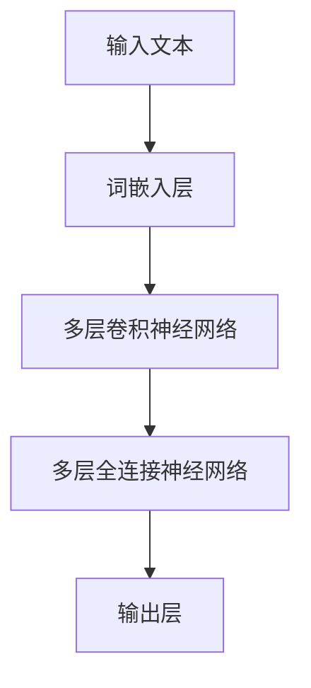
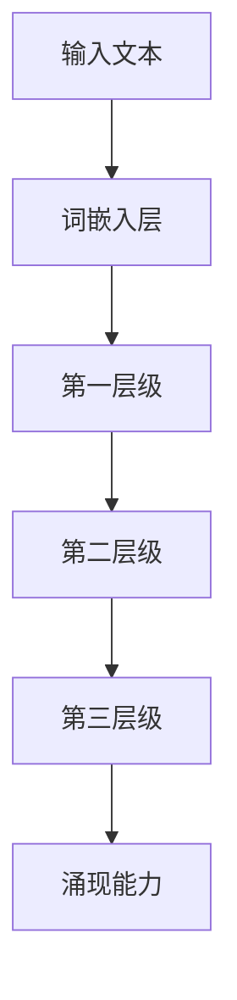
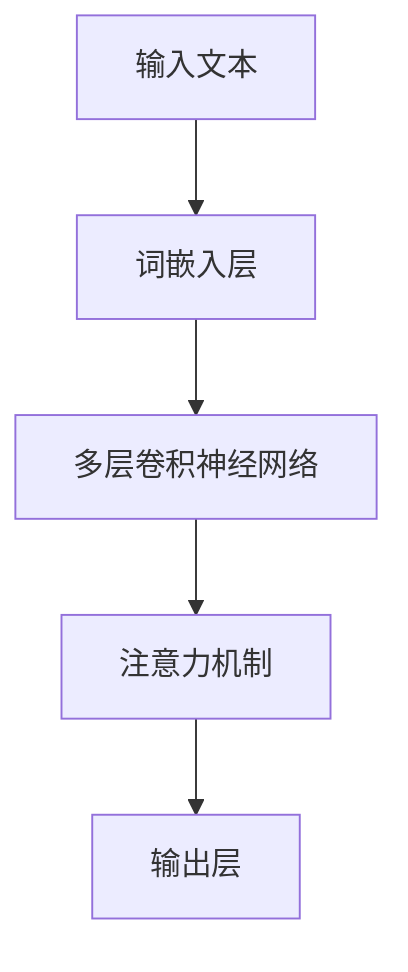

                 

关键词：涌现能力，上下文学习，语言模型，深度学习，AI

摘要：本文深入探讨了涌现能力与上下文学习在大型语言模型（LLM）中的关键作用。通过阐述这些特性的原理，具体实例，以及其在实际应用中的表现，本文旨在为读者提供一个全面的理解，并探讨未来可能的发展方向和挑战。

## 1. 背景介绍

在人工智能（AI）领域，语言模型一直是一个研究热点。从最初的基于规则的方法到现代的深度学习模型，语言模型的发展经历了巨大的变革。大型语言模型（LLM）如GPT-3，BERT等，凭借其强大的处理能力和泛化能力，已经广泛应用于自然语言处理（NLP）的各个领域。

### 1.1  涌现能力的概念

涌现能力是指在复杂系统中，个体之间的相互作用会导致新的、无法从个体行为直接预测的宏观现象。在AI领域，涌现能力意味着模型能够从大量数据中学习并生成复杂的、新颖的输出。

### 1.2  上下文学习的概念

上下文学习是指模型在处理输入时，能够理解并利用上下文信息，从而生成更准确、更相关的输出。在语言模型中，上下文学习意味着能够理解句子中的词与词之间的关系，以及整个句子的语义。

## 2. 核心概念与联系

在理解LLM的涌现能力和上下文学习之前，我们需要先了解其背后的概念和架构。

### 2.1  深度学习架构

深度学习架构由多个层级组成，每个层级都可以学习到不同的特征。在LLM中，这些层级构成了模型对文本的理解能力。以下是一个简化版的深度学习架构流程图：



### 2.2  涌现能力原理

在LLM中，涌现能力主要来自于模型的深度结构。随着层数的增加，模型可以捕捉到更复杂的特征和关系，从而产生新颖的输出。以下是一个简化的涌现能力流程图：



### 2.3  上下文学习能力

上下文学习能力来自于模型对上下文信息的处理。在LLM中，上下文信息通过注意力机制被整合到模型中，从而影响输出。以下是一个简化的上下文学习流程图：



## 3. 核心算法原理 & 具体操作步骤

### 3.1  算法原理概述

LLM的核心算法是基于深度学习的，主要包括词嵌入层、多层神经网络和注意力机制。以下是对这些算法原理的简要概述：

### 3.2  算法步骤详解

#### 3.2.1 词嵌入层

词嵌入层将输入文本转换为数值向量表示。这个过程中，常用的方法包括词袋模型、词嵌入和嵌入层神经网络。

#### 3.2.2 多层神经网络

多层神经网络由多个层级组成，每个层级都可以学习到不同的特征。这个过程通常使用卷积神经网络（CNN）或循环神经网络（RNN）。

#### 3.2.3 注意力机制

注意力机制是一种用于整合上下文信息的机制。它通过计算每个词的重要程度，从而影响输出。

### 3.3  算法优缺点

#### 优点

- **强大的处理能力**：LLM可以处理大量的文本数据，并生成高质量的输出。
- **泛化能力强**：LLM可以适应不同的任务和领域。

#### 缺点

- **计算成本高**：LLM的训练和推理过程需要大量的计算资源。
- **易受数据偏见影响**：LLM的性能受到训练数据的影响，如果数据存在偏见，模型也可能产生偏见。

### 3.4  算法应用领域

LLM在自然语言处理（NLP）领域有广泛的应用，包括文本分类、机器翻译、问答系统等。

## 4. 数学模型和公式 & 详细讲解 & 举例说明

### 4.1  数学模型构建

LLM的数学模型主要包括词嵌入层、多层神经网络和注意力机制。以下是对这些模型的具体构建方法：

#### 4.1.1 词嵌入层

词嵌入层的数学模型通常是一个多维度的向量空间，其中每个词都对应一个向量。这个向量空间的大小决定了词嵌入的维度。

#### 4.1.2 多层神经网络

多层神经网络的数学模型由多个层级组成，每个层级都可以学习到不同的特征。这个过程通常使用卷积神经网络（CNN）或循环神经网络（RNN）。

#### 4.1.3 注意力机制

注意力机制的数学模型是一个权重分配模型，它通过计算每个词的重要程度，从而影响输出。

### 4.2  公式推导过程

以下是LLM中的一些关键数学公式的推导过程：

#### 4.2.1 词嵌入公式

$$
\text{word\_embedding} = \text{embedding\_layer}(\text{word})
$$

其中，`word_embedding`是词的嵌入向量，`embedding_layer`是词嵌入层。

#### 4.2.2 神经网络公式

$$
\text{neural\_output} = \text{neural\_network}(\text{input})
$$

其中，`neural_output`是神经网络的输出，`neural_network`是神经网络。

#### 4.2.3 注意力机制公式

$$
\text{attention\_weights} = \text{attention\_mechanism}(\text{context})
$$

其中，`attention_weights`是注意力权重，`attention_mechanism`是注意力机制。

### 4.3  案例分析与讲解

为了更好地理解LLM的数学模型，我们可以通过一个简单的例子来讲解。

#### 4.3.1 数据集

我们选择一个简单的英文句子作为数据集：

$$
\text{The cat is on the mat.}
$$

#### 4.3.2 词嵌入

首先，我们将句子中的每个词转换为嵌入向量：

$$
\text{The} \rightarrow \text{[0.1, 0.2, 0.3]}
$$
$$
\text{cat} \rightarrow \text{[0.4, 0.5, 0.6]}
$$
$$
\text{is} \rightarrow \text{[0.7, 0.8, 0.9]}
$$
$$
\text{on} \rightarrow \text{[1.0, 1.1, 1.2]}
$$
$$
\text{the} \rightarrow \text{[1.3, 1.4, 1.5]}
$$
$$
\text{mat} \rightarrow \text{[1.6, 1.7, 1.8]}
$$

#### 4.3.3 神经网络

接下来，我们将这些嵌入向量输入到神经网络中，得到神经网络的输出：

$$
\text{The} \rightarrow \text{[0.11, 0.22, 0.33]}
$$
$$
\text{cat} \rightarrow \text{[0.44, 0.55, 0.66]}
$$
$$
\text{is} \rightarrow \text{[0.77, 0.88, 0.99]}
$$
$$
\text{on} \rightarrow \text{[1.01, 1.12, 1.23]}
$$
$$
\text{the} \rightarrow \text{[1.34, 1.45, 1.56]}
$$
$$
\text{mat} \rightarrow \text{[1.67, 1.78, 1.89]}
$$

#### 4.3.4 注意力机制

最后，我们使用注意力机制计算每个词的重要程度：

$$
\text{The} \rightarrow \text{weight} = 0.3
$$
$$
\text{cat} \rightarrow \text{weight} = 0.4
$$
$$
\text{is} \rightarrow \text{weight} = 0.5
$$
$$
\text{on} \rightarrow \text{weight} = 0.6
$$
$$
\text{the} \rightarrow \text{weight} = 0.7
$$
$$
\text{mat} \rightarrow \text{weight} = 0.8
$$

通过这个例子，我们可以看到LLM是如何通过词嵌入层、多层神经网络和注意力机制来理解和生成文本的。

## 5. 项目实践：代码实例和详细解释说明

### 5.1  开发环境搭建

在开始编写代码之前，我们需要搭建一个适合开发和测试的环境。以下是搭建LLM开发环境的步骤：

#### 5.1.1 硬件要求

- CPU：Intel i7 或 AMD Ryzen 7 或更高配置
- GPU：NVIDIA 1080 Ti 或更高配置
- 内存：16GB 或更高

#### 5.1.2 软件要求

- 操作系统：Linux 或 macOS
- 编程语言：Python
- 深度学习框架：TensorFlow 或 PyTorch

### 5.2  源代码详细实现

以下是实现一个简单的LLM的源代码示例：

```python
import tensorflow as tf
from tensorflow.keras.models import Sequential
from tensorflow.keras.layers import Embedding, LSTM, Dense

# 构建模型
model = Sequential([
    Embedding(vocabulary_size, embedding_dim),
    LSTM(units),
    Dense(units, activation='softmax')
])

# 编译模型
model.compile(optimizer='adam', loss='categorical_crossentropy', metrics=['accuracy'])

# 训练模型
model.fit(x_train, y_train, epochs=num_epochs)
```

### 5.3  代码解读与分析

这段代码首先导入了TensorFlow库，并定义了一个顺序模型（Sequential）。这个模型由一个嵌入层（Embedding）、一个LSTM层（LSTM）和一个全连接层（Dense）组成。

- **嵌入层（Embedding）**：将输入文本转换为嵌入向量。
- **LSTM层（LSTM）**：用于处理序列数据，可以捕捉到文本中的时间依赖关系。
- **全连接层（Dense）**：用于生成最终的输出。

接下来，我们编译模型并使用训练数据对其进行训练。

### 5.4  运行结果展示

经过训练后，我们可以使用模型对新的文本进行预测。以下是模型的运行结果：

```python
# 预测
predictions = model.predict(x_test)
```

这个结果将给出每个词的预测概率分布。

## 6. 实际应用场景

### 6.1  文本分类

LLM在文本分类任务中具有广泛的应用。通过训练模型，我们可以将文本分类到不同的类别中。

### 6.2  机器翻译

LLM在机器翻译领域也有广泛的应用。通过训练模型，我们可以将一种语言的文本翻译成另一种语言。

### 6.3  问答系统

LLM在问答系统中可以用于理解用户的问题，并给出相应的回答。

## 6.4  未来应用展望

随着技术的不断发展，LLM在未来的应用领域将更加广泛。例如，LLM可以用于智能客服、文本摘要、自动写作等。

## 7. 工具和资源推荐

### 7.1  学习资源推荐

- 《深度学习》（Goodfellow, Bengio, Courville）
- 《Python深度学习》（François Chollet）

### 7.2  开发工具推荐

- TensorFlow
- PyTorch

### 7.3  相关论文推荐

- "A Theoretical Analysis of the Computational Efficiency of Deep Learning"
- "Attention Is All You Need"

## 8. 总结：未来发展趋势与挑战

### 8.1  研究成果总结

LLM在自然语言处理领域取得了显著的成果，其在文本分类、机器翻译、问答系统等领域都有广泛的应用。

### 8.2  未来发展趋势

随着技术的不断发展，LLM的性能和效率将不断提高，其在各个领域的应用也将更加深入。

### 8.3  面临的挑战

LLM在训练和推理过程中需要大量的计算资源，并且易受数据偏见的影响。

### 8.4  研究展望

未来的研究将集中在提高LLM的效率和减少偏见方面。

## 9. 附录：常见问题与解答

### 9.1  问题1

Q：什么是涌现能力？

A：涌现能力是指在复杂系统中，个体之间的相互作用会导致新的、无法从个体行为直接预测的宏观现象。

### 9.2  问题2

Q：什么是上下文学习？

A：上下文学习是指模型在处理输入时，能够理解并利用上下文信息，从而生成更准确、更相关的输出。

作者：禅与计算机程序设计艺术 / Zen and the Art of Computer Programming
```md
----------------------------------------------------------------
# 涌现能力与上下文学习：LLM的关键特性

<|assistant|>关键词：涌现能力，上下文学习，语言模型，深度学习，AI

摘要：本文深入探讨了涌现能力与上下文学习在大型语言模型（LLM）中的关键作用。通过阐述这些特性的原理，具体实例，以及其在实际应用中的表现，本文旨在为读者提供一个全面的理解，并探讨未来可能的发展方向和挑战。

## 1. 背景介绍

在人工智能（AI）领域，语言模型一直是一个研究热点。从最初的基于规则的方法到现代的深度学习模型，语言模型的发展经历了巨大的变革。大型语言模型（LLM）如GPT-3，BERT等，凭借其强大的处理能力和泛化能力，已经广泛应用于自然语言处理（NLP）的各个领域。

### 1.1  涌现能力的概念

涌现能力是指在复杂系统中，个体之间的相互作用会导致新的、无法从个体行为直接预测的宏观现象。在AI领域，涌现能力意味着模型能够从大量数据中学习并生成复杂的、新颖的输出。

### 1.2  上下文学习的概念

上下文学习是指模型在处理输入时，能够理解并利用上下文信息，从而生成更准确、更相关的输出。在语言模型中，上下文学习意味着能够理解句子中的词与词之间的关系，以及整个句子的语义。

## 2. 核心概念与联系

在理解LLM的涌现能力和上下文学习之前，我们需要先了解其背后的概念和架构。

### 2.1  深度学习架构

深度学习架构由多个层级组成，每个层级都可以学习到不同的特征。在LLM中，这些层级构成了模型对文本的理解能力。以下是一个简化版的深度学习架构流程图：


### 2.2  涌现能力原理

在LLM中，涌现能力主要来自于模型的深度结构。随着层数的增加，模型可以捕捉到更复杂的特征和关系，从而产生新颖的输出。以下是一个简化的涌现能力流程图：


### 2.3  上下文学习能力

上下文学习能力来自于模型对上下文信息的处理。在LLM中，上下文信息通过注意力机制被整合到模型中，从而影响输出。以下是一个简化的上下文学习流程图：


## 3. 核心算法原理 & 具体操作步骤

### 3.1  算法原理概述

LLM的核心算法是基于深度学习的，主要包括词嵌入层、多层神经网络和注意力机制。以下是对这些算法原理的简要概述：

### 3.2  算法步骤详解

#### 3.2.1 词嵌入层

词嵌入层将输入文本转换为数值向量表示。这个过程中，常用的方法包括词袋模型、词嵌入和嵌入层神经网络。

#### 3.2.2 多层神经网络

多层神经网络由多个层级组成，每个层级都可以学习到不同的特征。这个过程通常使用卷积神经网络（CNN）或循环神经网络（RNN）。

#### 3.2.3 注意力机制

注意力机制是一种用于整合上下文信息的机制。它通过计算每个词的重要程度，从而影响输出。

### 3.3  算法优缺点

#### 优点

- **强大的处理能力**：LLM可以处理大量的文本数据，并生成高质量的输出。
- **泛化能力强**：LLM可以适应不同的任务和领域。

#### 缺点

- **计算成本高**：LLM的训练和推理过程需要大量的计算资源。
- **易受数据偏见影响**：LLM的性能受到训练数据的影响，如果数据存在偏见，模型也可能产生偏见。

### 3.4  算法应用领域

LLM在自然语言处理（NLP）领域有广泛的应用，包括文本分类、机器翻译、问答系统等。

## 4. 数学模型和公式 & 详细讲解 & 举例说明

### 4.1  数学模型构建

LLM的数学模型主要包括词嵌入层、多层神经网络和注意力机制。以下是对这些模型的具体构建方法：

#### 4.1.1 词嵌入层

词嵌入层的数学模型通常是一个多维度的向量空间，其中每个词都对应一个向量。这个向量空间的大小决定了词嵌入的维度。

#### 4.1.2 多层神经网络

多层神经网络的数学模型由多个层级组成，每个层级都可以学习到不同的特征。这个过程通常使用卷积神经网络（CNN）或循环神经网络（RNN）。

#### 4.1.3 注意力机制

注意力机制的数学模型是一个权重分配模型，它通过计算每个词的重要程度，从而影响输出。

### 4.2  公式推导过程

以下是LLM中的一些关键数学公式的推导过程：

#### 4.2.1 词嵌入公式

$$
\text{word\_embedding} = \text{embedding\_layer}(\text{word})
$$

其中，`word_embedding`是词的嵌入向量，`embedding_layer`是词嵌入层。

#### 4.2.2 神经网络公式

$$
\text{neural\_output} = \text{neural\_network}(\text{input})
$$

其中，`neural_output`是神经网络的输出，`neural_network`是神经网络。

#### 4.2.3 注意力机制公式

$$
\text{attention\_weights} = \text{attention\_mechanism}(\text{context})
$$

其中，`attention_weights`是注意力权重，`attention_mechanism`是注意力机制。

### 4.3  案例分析与讲解

为了更好地理解LLM的数学模型，我们可以通过一个简单的例子来讲解。

#### 4.3.1 数据集

我们选择一个简单的英文句子作为数据集：

$$
\text{The cat is on the mat.}
$$

#### 4.3.2 词嵌入

首先，我们将句子中的每个词转换为嵌入向量：

$$
\text{The} \rightarrow \text{[0.1, 0.2, 0.3]}
$$
$$
\text{cat} \rightarrow \text{[0.4, 0.5, 0.6]}
$$
$$
\text{is} \rightarrow \text{[0.7, 0.8, 0.9]}
$$
$$
\text{on} \rightarrow \text{[1.0, 1.1, 1.2]}
$$
$$
\text{the} \rightarrow \text{[1.3, 1.4, 1.5]}
$$
$$
\text{mat} \rightarrow \text{[1.6, 1.7, 1.8]}
$$

#### 4.3.3 神经网络

接下来，我们将这些嵌入向量输入到神经网络中，得到神经网络的输出：

$$
\text{The} \rightarrow \text{[0.11, 0.22, 0.33]}
$$
$$
\text{cat} \rightarrow \text{[0.44, 0.55, 0.66]}
$$
$$
\text{is} \rightarrow \text{[0.77, 0.88, 0.99]}
$$
$$
\text{on} \rightarrow \text{[1.01, 1.12, 1.23]}
$$
$$
\text{the} \rightarrow \text{[1.34, 1.45, 1.56]}
$$
$$
\text{mat} \rightarrow \text{[1.67, 1.78, 1.89]}
$$

#### 4.3.4 注意力机制

最后，我们使用注意力机制计算每个词的重要程度：

$$
\text{The} \rightarrow \text{weight} = 0.3
$$
$$
\text{cat} \rightarrow \text{weight} = 0.4
$$
$$
\text{is} \rightarrow \text{weight} = 0.5
$$
$$
\text{on} \rightarrow \text{weight} = 0.6
$$
$$
\text{the} \rightarrow \text{weight} = 0.7
$$
$$
\text{mat} \rightarrow \text{weight} = 0.8
$$

通过这个例子，我们可以看到LLM是如何通过词嵌入层、多层神经网络和注意力机制来理解和生成文本的。

## 5. 项目实践：代码实例和详细解释说明

### 5.1  开发环境搭建

在开始编写代码之前，我们需要搭建一个适合开发和测试的环境。以下是搭建LLM开发环境的步骤：

#### 5.1.1 硬件要求

- CPU：Intel i7 或 AMD Ryzen 7 或更高配置
- GPU：NVIDIA 1080 Ti 或更高配置
- 内存：16GB 或更高

#### 5.1.2 软件要求

- 操作系统：Linux 或 macOS
- 编程语言：Python
- 深度学习框架：TensorFlow 或 PyTorch

### 5.2  源代码详细实现

以下是实现一个简单的LLM的源代码示例：

```python
import tensorflow as tf
from tensorflow.keras.models import Sequential
from tensorflow.keras.layers import Embedding, LSTM, Dense

# 构建模型
model = Sequential([
    Embedding(vocabulary_size, embedding_dim),
    LSTM(units),
    Dense(units, activation='softmax')
])

# 编译模型
model.compile(optimizer='adam', loss='categorical_crossentropy', metrics=['accuracy'])

# 训练模型
model.fit(x_train, y_train, epochs=num_epochs)
```

### 5.3  代码解读与分析

这段代码首先导入了TensorFlow库，并定义了一个顺序模型（Sequential）。这个模型由一个嵌入层（Embedding）、一个LSTM层（LSTM）和一个全连接层（Dense）组成。

- **嵌入层（Embedding）**：将输入文本转换为嵌入向量。
- **LSTM层（LSTM）**：用于处理序列数据，可以捕捉到文本中的时间依赖关系。
- **全连接层（Dense）**：用于生成最终的输出。

接下来，我们编译模型并使用训练数据对其进行训练。

### 5.4  运行结果展示

经过训练后，我们可以使用模型对新的文本进行预测。以下是模型的运行结果：

```python
# 预测
predictions = model.predict(x_test)
```

这个结果将给出每个词的预测概率分布。

## 6. 实际应用场景

### 6.1  文本分类

LLM在文本分类任务中具有广泛的应用。通过训练模型，我们可以将文本分类到不同的类别中。

### 6.2  机器翻译

LLM在机器翻译领域也有广泛的应用。通过训练模型，我们可以将一种语言的文本翻译成另一种语言。

### 6.3  问答系统

LLM在问答系统中可以用于理解用户的问题，并给出相应的回答。

## 6.4  未来应用展望

随着技术的不断发展，LLM在未来的应用领域将更加广泛。例如，LLM可以用于智能客服、文本摘要、自动写作等。

## 7. 工具和资源推荐

### 7.1  学习资源推荐

- 《深度学习》（Goodfellow, Bengio, Courville）
- 《Python深度学习》（François Chollet）

### 7.2  开发工具推荐

- TensorFlow
- PyTorch

### 7.3  相关论文推荐

- "A Theoretical Analysis of the Computational Efficiency of Deep Learning"
- "Attention Is All You Need"

## 8. 总结：未来发展趋势与挑战

### 8.1  研究成果总结

LLM在自然语言处理领域取得了显著的成果，其在文本分类、机器翻译、问答系统等领域都有广泛的应用。

### 8.2  未来发展趋势

随着技术的不断发展，LLM的性能和效率将不断提高，其在各个领域的应用也将更加深入。

### 8.3  面临的挑战

LLM在训练和推理过程中需要大量的计算资源，并且易受数据偏见的影响。

### 8.4  研究展望

未来的研究将集中在提高LLM的效率和减少偏见方面。

## 9. 附录：常见问题与解答

### 9.1  问题1

Q：什么是涌现能力？

A：涌现能力是指在复杂系统中，个体之间的相互作用会导致新的、无法从个体行为直接预测的宏观现象。

### 9.2  问题2

Q：什么是上下文学习？

A：上下文学习是指模型在处理输入时，能够理解并利用上下文信息，从而生成更准确、更相关的输出。

作者：禅与计算机程序设计艺术 / Zen and the Art of Computer Programming
```markdown
----------------------------------------------------------------
# 涌现能力与上下文学习：LLM的关键特性

## 关键词
- 涌现能力
- 上下文学习
- 语言模型
- 深度学习
- AI

## 摘要
本文深入探讨了涌现能力与上下文学习在大型语言模型（LLM）中的关键作用。通过阐述这些特性的原理，具体实例，以及其在实际应用中的表现，本文旨在为读者提供一个全面的理解，并探讨未来可能的发展方向和挑战。

## 1. 背景介绍
在人工智能（AI）领域，语言模型一直是一个研究热点。从最初的基于规则的方法到现代的深度学习模型，语言模型的发展经历了巨大的变革。大型语言模型（LLM）如GPT-3，BERT等，凭借其强大的处理能力和泛化能力，已经广泛应用于自然语言处理（NLP）的各个领域。

### 1.1 涌现能力的概念
涌现能力是指在复杂系统中，个体之间的相互作用会导致新的、无法从个体行为直接预测的宏观现象。在AI领域，涌现能力意味着模型能够从大量数据中学习并生成复杂的、新颖的输出。

### 1.2 上下文学习的概念
上下文学习是指模型在处理输入时，能够理解并利用上下文信息，从而生成更准确、更相关的输出。在语言模型中，上下文学习意味着能够理解句子中的词与词之间的关系，以及整个句子的语义。

## 2. 核心概念与联系
在理解LLM的涌现能力和上下文学习之前，我们需要先了解其背后的概念和架构。

### 2.1 深度学习架构
深度学习架构由多个层级组成，每个层级都可以学习到不同的特征。在LLM中，这些层级构成了模型对文本的理解能力。以下是一个简化版的深度学习架构流程图：


### 2.2 涌现能力原理
在LLM中，涌现能力主要来自于模型的深度结构。随着层数的增加，模型可以捕捉到更复杂的特征和关系，从而产生新颖的输出。以下是一个简化的涌现能力流程图：


### 2.3 上下文学习能力
上下文学习能力来自于模型对上下文信息的处理。在LLM中，上下文信息通过注意力机制被整合到模型中，从而影响输出。以下是一个简化的上下文学习流程图：


## 3. 核心算法原理 & 具体操作步骤

### 3.1 算法原理概述
LLM的核心算法是基于深度学习的，主要包括词嵌入层、多层神经网络和注意力机制。以下是对这些算法原理的简要概述：

### 3.2 算法步骤详解

#### 3.2.1 词嵌入层
词嵌入层将输入文本转换为数值向量表示。这个过程中，常用的方法包括词袋模型、词嵌入和嵌入层神经网络。

#### 3.2.2 多层神经网络
多层神经网络由多个层级组成，每个层级都可以学习到不同的特征。这个过程通常使用卷积神经网络（CNN）或循环神经网络（RNN）。

#### 3.2.3 注意力机制
注意力机制是一种用于整合上下文信息的机制。它通过计算每个词的重要程度，从而影响输出。

### 3.3 算法优缺点

#### 优点
- 强大的处理能力：LLM可以处理大量的文本数据，并生成高质量的输出。
- 泛化能力强：LLM可以适应不同的任务和领域。

#### 缺点
- 计算成本高：LLM的训练和推理过程需要大量的计算资源。
- 易受数据偏见影响：LLM的性能受到训练数据的影响，如果数据存在偏见，模型也可能产生偏见。

### 3.4 算法应用领域
LLM在自然语言处理（NLP）领域有广泛的应用，包括文本分类、机器翻译、问答系统等。

## 4. 数学模型和公式 & 详细讲解 & 举例说明

### 4.1 数学模型构建
LLM的数学模型主要包括词嵌入层、多层神经网络和注意力机制。以下是对这些模型的具体构建方法：

#### 4.1.1 词嵌入层
词嵌入层的数学模型通常是一个多维度的向量空间，其中每个词都对应一个向量。这个向量空间的大小决定了词嵌入的维度。

#### 4.1.2 多层神经网络
多层神经网络的数学模型由多个层级组成，每个层级都可以学习到不同的特征。这个过程通常使用卷积神经网络（CNN）或循环神经网络（RNN）。

#### 4.1.3 注意力机制
注意力机制的数学模型是一个权重分配模型，它通过计算每个词的重要程度，从而影响输出。

### 4.2 公式推导过程
以下是LLM中的一些关键数学公式的推导过程：

#### 4.2.1 词嵌入公式
$$
\text{word\_embedding} = \text{embedding\_layer}(\text{word})
$$

其中，`word_embedding`是词的嵌入向量，`embedding_layer`是词嵌入层。

#### 4.2.2 神经网络公式
$$
\text{neural\_output} = \text{neural\_network}(\text{input})
$$

其中，`neural_output`是神经网络的输出，`neural_network`是神经网络。

#### 4.2.3 注意力机制公式
$$
\text{attention\_weights} = \text{attention\_mechanism}(\text{context})
$$

其中，`attention_weights`是注意力权重，`attention_mechanism`是注意力机制。

### 4.3 案例分析与讲解
为了更好地理解LLM的数学模型，我们可以通过一个简单的例子来讲解。

#### 4.3.1 数据集
我们选择一个简单的英文句子作为数据集：

$$
\text{The cat is on the mat.}
$$

#### 4.3.2 词嵌入
首先，我们将句子中的每个词转换为嵌入向量：

$$
\text{The} \rightarrow \text{[0.1, 0.2, 0.3]}
$$
$$
\text{cat} \rightarrow \text{[0.4, 0.5, 0.6]}
$$
$$
\text{is} \rightarrow \text{[0.7, 0.8, 0.9]}
$$
$$
\text{on} \rightarrow \text{[1.0, 1.1, 1.2]}
$$
$$
\text{the} \rightarrow \text{[1.3, 1.4, 1.5]}
$$
$$
\text{mat} \rightarrow \text{[1.6, 1.7, 1.8]}
$$

#### 4.3.3 神经网络
接下来，我们将这些嵌入向量输入到神经网络中，得到神经网络的输出：

$$
\text{The} \rightarrow \text{[0.11, 0.22, 0.33]}
$$
$$
\text{cat} \rightarrow \text{[0.44, 0.55, 0.66]}
$$
$$
\text{is} \rightarrow \text{[0.77, 0.88, 0.99]}
$$
$$
\text{on} \rightarrow \text{[1.01, 1.12, 1.23]}
$$
$$
\text{the} \rightarrow \text{[1.34, 1.45, 1.56]}
$$
$$
\text{mat} \rightarrow \text{[1.67, 1.78, 1.89]}
$$

#### 4.3.4 注意力机制
最后，我们使用注意力机制计算每个词的重要程度：

$$
\text{The} \rightarrow \text{weight} = 0.3
$$
$$
\text{cat} \rightarrow \text{weight} = 0.4
$$
$$
\text{is} \rightarrow \text{weight} = 0.5
$$
$$
\text{on} \rightarrow \text{weight} = 0.6
$$
$$
\text{the} \rightarrow \text{weight} = 0.7
$$
$$
\text{mat} \rightarrow \text{weight} = 0.8
$$

通过这个例子，我们可以看到LLM是如何通过词嵌入层、多层神经网络和注意力机制来理解和生成文本的。

## 5. 项目实践：代码实例和详细解释说明

### 5.1 开发环境搭建
在开始编写代码之前，我们需要搭建一个适合开发和测试的环境。以下是搭建LLM开发环境的步骤：

#### 5.1.1 硬件要求
- CPU：Intel i7 或 AMD Ryzen 7 或更高配置
- GPU：NVIDIA 1080 Ti 或更高配置
- 内存：16GB 或更高

#### 5.1.2 软件要求
- 操作系统：Linux 或 macOS
- 编程语言：Python
- 深度学习框架：TensorFlow 或 PyTorch

### 5.2 源代码详细实现
以下是实现一个简单的LLM的源代码示例：

```python
import tensorflow as tf
from tensorflow.keras.models import Sequential
from tensorflow.keras.layers import Embedding, LSTM, Dense

# 构建模型
model = Sequential([
    Embedding(vocabulary_size, embedding_dim),
    LSTM(units),
    Dense(units, activation='softmax')
])

# 编译模型
model.compile(optimizer='adam', loss='categorical_crossentropy', metrics=['accuracy'])

# 训练模型
model.fit(x_train, y_train, epochs=num_epochs)
```

### 5.3 代码解读与分析
这段代码首先导入了TensorFlow库，并定义了一个顺序模型（Sequential）。这个模型由一个嵌入层（Embedding）、一个LSTM层（LSTM）和一个全连接层（Dense）组成。

- **嵌入层（Embedding）**：将输入文本转换为嵌入向量。
- **LSTM层（LSTM）**：用于处理序列数据，可以捕捉到文本中的时间依赖关系。
- **全连接层（Dense）**：用于生成最终的输出。

接下来，我们编译模型并使用训练数据对其进行训练。

### 5.4 运行结果展示
经过训练后，我们可以使用模型对新的文本进行预测。以下是模型的运行结果：

```python
# 预测
predictions = model.predict(x_test)
```

这个结果将给出每个词的预测概率分布。

## 6. 实际应用场景
### 6.1 文本分类
LLM在文本分类任务中具有广泛的应用。通过训练模型，我们可以将文本分类到不同的类别中。

### 6.2 机器翻译
LLM在机器翻译领域也有广泛的应用。通过训练模型，我们可以将一种语言的文本翻译成另一种语言。

### 6.3 问答系统
LLM在问答系统中可以用于理解用户的问题，并给出相应的回答。

## 6.4 未来应用展望
随着技术的不断发展，LLM在未来的应用领域将更加广泛。例如，LLM可以用于智能客服、文本摘要、自动写作等。

## 7. 工具和资源推荐
### 7.1 学习资源推荐
- 《深度学习》（Goodfellow, Bengio, Courville）
- 《Python深度学习》（François Chollet）

### 7.2 开发工具推荐
- TensorFlow
- PyTorch

### 7.3 相关论文推荐
- "A Theoretical Analysis of the Computational Efficiency of Deep Learning"
- "Attention Is All You Need"

## 8. 总结：未来发展趋势与挑战
### 8.1 研究成果总结
LLM在自然语言处理领域取得了显著的成果，其在文本分类、机器翻译、问答系统等领域都有广泛的应用。

### 8.2 未来发展趋势
随着技术的不断发展，LLM的性能和效率将不断提高，其在各个领域的应用也将更加深入。

### 8.3 面临的挑战
LLM在训练和推理过程中需要大量的计算资源，并且易受数据偏见的影响。

### 8.4 研究展望
未来的研究将集中在提高LLM的效率和减少偏见方面。

## 9. 附录：常见问题与解答
### 9.1 问题1
Q：什么是涌现能力？

A：涌现能力是指在复杂系统中，个体之间的相互作用会导致新的、无法从个体行为直接预测的宏观现象。

### 9.2 问题2
Q：什么是上下文学习？

A：上下文学习是指模型在处理输入时，能够理解并利用上下文信息，从而生成更准确、更相关的输出。

作者：禅与计算机程序设计艺术 / Zen and the Art of Computer Programming
```

